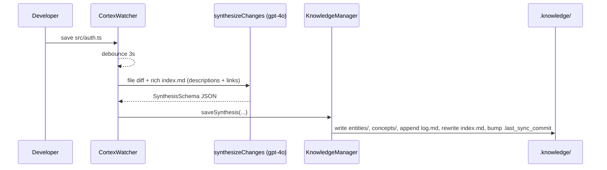
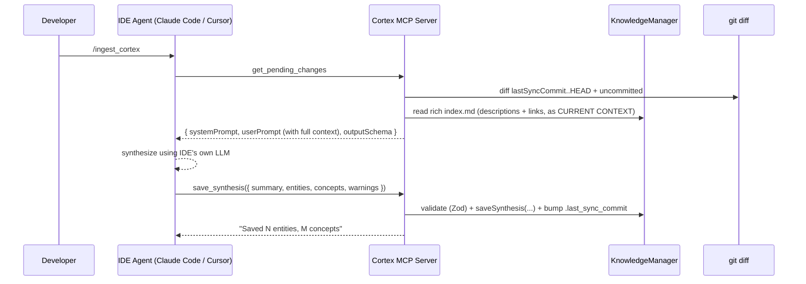

# Project Cortex: Architecture & System Design

This document is the technical blueprint for Project Cortex. It outlines the core components, data flow, tech stack, and dependencies that make up the Autonomous Knowledge Engine.

---

## 1. System Overview

Cortex is a local-first Node.js tool that operates in two interoperable modes, both targeting the same `.knowledge/` output:

1. **Active Ingestion (The Daemon — `cortex watch`)**: A background process that watches the user's source code, leverages an LLM via the user's own API key to synthesize architectural changes, and writes the output to `.knowledge/`.
2. **IDE-Driven Ingestion (The MCP Server — `cortex setup`)**: A standalone MCP server that exposes the synthesized knowledge folder *and* the pending diff to external coding agents (Claude Code, Cursor, Windsurf, Claude Desktop, VS Code Copilot). In this mode the IDE's own AI performs the synthesis — Cortex supplies the prompts and validates the result.

Both modes share the same Knowledge Manager, schema, and storage layout. The daemon embeds the MCP server, so an IDE can trigger a real-time sync against a running watcher.

---

## 2. Core Components

### A. The CLI (`src/cli/`)
* **Responsibility**: Entry point for the developer. Wires the rest of the system together.
* **Files**:
  * [src/cli/index.ts](src/cli/index.ts) — `commander` setup for `init`, `watch`, `setup`.
  * [src/cli/init.ts](src/cli/init.ts) — Interactive wizard that picks between the API-keys route and the IDE route, scaffolds `.knowledge/`, writes `.env`, and updates `.gitignore`.
  * [src/cli/watch.ts](src/cli/watch.ts) — Boots the file watcher, the Knowledge Manager, and an embedded MCP server. Owns the per-file (auto) and batched (manual) sync flows.
  * [src/cli/setup.ts](src/cli/setup.ts) — Writes the Cortex MCP entry into supported IDE config files (Claude Code, Cursor, VS Code, Windsurf, Claude Desktop).
  * [src/cli/read.ts](src/cli/read.ts) — `cortex read` command. Prints the full rich knowledge index to stdout. Accepts `--entity <name>` and `--concept <name>` flags to drill into a specific page.

### B. The File Watcher (`src/core/watcher.ts`)
* **Responsibility**: Monitor the project directory for `add`, `change`, and `unlink` events and emit semantic events with diffs attached.
* **Behavior**: Wraps `chokidar` with a 3-second debounce (rapid `Cmd+S` produces a single emission). Respects the project's `.gitignore` via the `ignore` package and hard-codes ignores for `.git/**`, `.knowledge/**`, `node_modules/**`, `dist/**` to prevent recursive loops.

### C. The Diff Layer (`src/core/diff.ts`)
* **Responsibility**: Convert filesystem events into reviewable code changes.
* **Behavior**: Two surfaces:
  * `getFileDiff(targetDir, filePath)` — used by the daemon. Tries `git diff HEAD -- <file>`; falls back to inlining untracked file contents.
  * `getPendingDiff(projectRoot, lastSyncCommit)` — used by the MCP server. Combines `git diff <lastSyncCommit>..HEAD` with uncommitted `git diff HEAD`, so a sync covers everything since the previous one regardless of how many commits happened in between.

### D. The LLM Engine (`src/llm/`)
* **Responsibility**: Convert raw code changes into semantic architectural knowledge.
* **Files**:
  * [src/llm/schema.ts](src/llm/schema.ts) — Shared Zod `SynthesisSchema` (summary / entities / concepts / warnings) reused by both the daemon and the MCP `save_synthesis` validator.
  * [src/llm/prompts.ts](src/llm/prompts.ts) — The Librarian system prompt and the diff-injection user-prompt template.
  * [src/llm/client.ts](src/llm/client.ts) — `synthesizeChanges()` calls `generateObject()` from the Vercel AI SDK against `gpt-4o`. Honors `CORTEX_MOCK_AI=true` to return a deterministic mock synthesis for tests.

### E. The Knowledge Manager (`src/knowledge/writer.ts`)
* **Responsibility**: All file I/O against `.knowledge/`. The only writer in the system.
* **State layer**: Maintains `.knowledge/state.json` as the canonical store — a JSON object keyed by entity/concept name, holding `{ description, links, sourceFile?, lastRefined }`. On startup, `init()` migrates existing entity/concept markdown files into `state.json` if it doesn't exist yet (best-effort parse of legacy layout).
* **Index rendering**: `updateIndex()` regenerates `index.md` from `state.json` — now a **rich index** with full descriptions, source citations, and outbound `[[WikiLink]]` sets per entry (not just a flat name list). This is what both the Librarian (ingest context) and downstream AIs (read tools) see.
* **Deep-read access**: `readEntity(name)` and `readConcept(name)` return the full markdown page for a named entity/concept. Used by the `read_entity`/`read_concept` MCP tools so downstream AIs can follow wiki-links without opening source files.
* **Write flow**: `saveSynthesis()` applies each entity action (create/update/delete) to both `state.json` and the per-entity markdown file, then triggers `updateIndex()`. Deletions remove from both state and disk atomically.

### E.1 Structured logging (`src/core/logger.ts`)
* **Responsibility**: Daemon-only logging via `createDaemonLogger(projectRoot)`.
* **Behavior**: Writes pretty logs to stdout and JSON lines to `cortex.log` in the project root (via `pino` transports).

### F. The MCP Server (`src/mcp/server.ts`)
* **Responsibility**: Bridge between Cortex's synthesized knowledge and active coding agents via the Model Context Protocol.
* **Tools exposed**:
  * `get_cortex_status` — init state + last-sync commit.
  * `get_pending_changes` — bundles the diff since last sync, the **rich** knowledge index (descriptions + links + source paths) as `CURRENT CONTEXT` for the Librarian, and the output schema. This is the IDE route's synthesis prompt-pack.
  * `save_synthesis` — Zod-validates the synthesis JSON (including the new optional `sourceFile` field), writes it to `.knowledge/`, advances `.last_sync_commit`.
  * `read_knowledge_index` — returns the rich `index.md`. Call this first; it's the project's architectural memory.
  * `read_entity(name)` — returns the full markdown page for a named entity. Downstream AIs use this to follow `[[WikiLinks]]` from the index without opening source files.
  * `read_concept(name)` — same for abstract concepts.
* **Prompts exposed**: `ingest`, `status`, `read`, `explore`. The `read` and `explore` prompts explicitly instruct the consuming AI to navigate the knowledge graph (index → `read_entity`/`read_concept`) rather than re-scanning source code.
* **Modes**: When constructed by `cortex watch`, the server is embedded with an optional `onAfterKnowledgeSave` callback: after a successful `save_synthesis`, the daemon clears its in-memory manual-mode diff queue so IDE ingestion does not leave stale queued deltas. When launched standalone by an IDE (via the registered config), it runs purely as an MCP STDIO server against `process.cwd()`.

---

## 3. Data Flow

### Route 1 — API Keys (auto mode)



### Route 2 — IDE / MCP



---

## 4. Tech Stack & Dependencies

Built as a standalone CLI in **Node.js + TypeScript** (strict, ESM, `module: NodeNext`). Compiles to `dist/` via `tsc`.

### Runtime Dependencies
* **CLI Framework**: `commander` — `cortex init / watch / setup`.
* **File System**: `chokidar` — robust file watching.
* **LLM Orchestration**: `ai` (Vercel AI SDK) plus `@ai-sdk/openai`, `@ai-sdk/anthropic`, `@ai-sdk/google`, and `@ai-sdk/openai-compatible` — `generateObject` with structured-output enforcement. Provider is selected via `CORTEX_PROVIDER` in [src/llm/client.ts](src/llm/client.ts).
* **Schema Validation**: `zod` — enforces the LLM output shape end-to-end (daemon and MCP both reuse `SynthesisSchema`).
* **MCP**: `@modelcontextprotocol/sdk` — STDIO server.
* **Utilities**: `dotenv` (API keys / `INGESTION_MODE`), `ignore` (parses `.gitignore`).

### Test Hook
* `CORTEX_MOCK_AI=true` — short-circuits `synthesizeChanges()` to return a deterministic synthesis, so the full daemon → writer → MCP pipeline can be exercised without LLM calls or API keys.

---

## 5. Folder Structure (Current)

```text
project-cortex/
├── bin/
│   └── cortex.js                # CLI entry point → dist/cli/index.js
├── src/
│   ├── index.ts                 # Direct daemon entry (delegates to runWatch)
│   ├── cli/
│   │   ├── index.ts             # commander program
│   │   ├── init.ts              # interactive setup wizard
│   │   ├── watch.ts             # daemon (watcher + LLM + embedded MCP)
│   │   ├── setup.ts             # IDE config writer
│   │   └── read.ts              # cortex read — prints knowledge index / entity / concept
│   ├── core/
│   │   ├── watcher.ts           # chokidar + .gitignore + debounce
│   │   ├── diff.ts              # per-file diff + since-last-sync diff
│   │   ├── env.ts               # ~/.cortexrc + project .env loader
│   │   └── logger.ts            # pino factory for daemon (stdout + cortex.log)
│   ├── llm/
│   │   ├── client.ts            # generateObject + mock mode
│   │   ├── prompts.ts           # Librarian system + extraction templates
│   │   └── schema.ts            # shared Zod SynthesisSchema
│   ├── knowledge/
│   │   └── writer.ts            # all .knowledge/ file I/O + index
│   └── mcp/
│       └── server.ts            # MCP server (4 tools + prompts) — embeddable & standalone
├── .claude/commands/            # Claude Code slash commands shipped with the repo
│   ├── ingest_cortex.md
│   ├── cortex_status.md
│   └── read_knowledge.md
├── package.json
├── tsconfig.json
└── README.md
```

---

## 6. The Knowledge Data Schema (Output)

When Cortex runs on a user's repository, it generates and maintains this structure in the project root:

```text
.knowledge/
├── index.md             # Rich catalog — descriptions + source paths + links (rendered from state.json)
├── state.json           # Canonical state: { entities: { name → {description, links, sourceFile, lastRefined} }, concepts: {...} }
├── log.md               # Append-only chronological trajectory + warnings per entry
├── entities/            # Per-entity markdown pages (deep-read target of read_entity)
├── concepts/            # Per-concept markdown pages (deep-read target of read_concept)
└── .last_sync_commit    # Git SHA used by getPendingDiff()
```

The Zod source of truth for what gets written lives in [src/llm/schema.ts](src/llm/schema.ts).

---

## 7. Status & Next Steps

Phases 1–5 of the [implementation plan](implementation_plan.md) are implemented in code: CLI (`init`, `watch`, `status`, `config`, `setup`, `mcp`), git-aware diffs, multi-provider LLM synthesis with bounded retries, `.knowledge/` writer (including entity deletes), MCP tools + prompts, embedded MCP in `cortex watch` with post-save queue clearing, lockfile (`.knowledge/cortex.lock`), `pino` logging to stdout and `cortex.log`, global `~/.cortexrc` plus project `.env` loading, and a starter `npm test` suite under `tests/`.

**Still optional / incremental:**

1. Broader automated coverage (watcher, diff, MCP handlers, E2E temp repos).
2. Persistent offline queue when the LLM fails in **auto** mode (today, failed saves are retried up to three times per call; manual mode retains queued diffs until a successful `cortex sync`).
3. Cross-platform daemon install docs (Windows service / launchd / systemd) beyond the README PM2 section.
