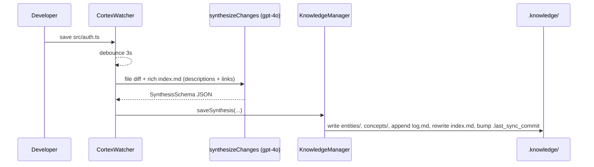
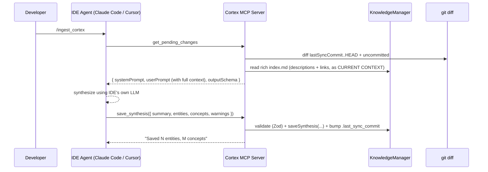

# Project Cortex: Architecture & System Design

This document is the technical blueprint for Project Cortex. It outlines the core components, data flow, tech stack, and dependencies that make up the Autonomous Knowledge Engine.

---

## 1. System Overview

Cortex is a local-first Node.js tool that operates in two interoperable modes, both targeting the same `.knowledge/` output:

1. **Active Ingestion (The Daemon — `cortex watch`)**: A background process that watches the user's source code, leverages an LLM via the user's own API key to synthesize architectural changes, and writes the output to `.knowledge/`.
2. **IDE-Driven Ingestion (The MCP Server — `cortex setup`)**: A standalone MCP server that exposes the synthesized knowledge folder *and* the pending diff to external coding agents (Claude Code, Cursor, Windsurf, Claude Desktop, VS Code Copilot). In this mode the IDE's own AI performs the synthesis — Cortex supplies the prompts and validates the result.

Both modes share the same Knowledge Manager, schema, and storage layout. The daemon embeds the MCP server, so an IDE can trigger a real-time sync against a running watcher.

---

## 2. Core Components

### A. The CLI (`src/cli/`)
* **Responsibility**: Entry point for the developer. Wires the rest of the system together.
* **Files**:
  * [src/cli/index.ts](src/cli/index.ts) — `commander` setup for `init`, `watch`, `setup`.
  * [src/cli/init.ts](src/cli/init.ts) — Interactive wizard that picks between the API-keys route and the IDE route, scaffolds `.knowledge/`, writes `.env`, and updates `.gitignore`.
  * [src/cli/watch.ts](src/cli/watch.ts) — Boots the file watcher, the Knowledge Manager, and an embedded MCP server. Owns the per-file (auto) and batched (manual) sync flows.
  * [src/cli/setup.ts](src/cli/setup.ts) — Writes the Cortex MCP entry into supported IDE config files (Claude Code, Cursor, VS Code, Windsurf, Claude Desktop, Antigravity). The Antigravity target writes the **global** `~/.gemini/antigravity/mcp_config.json` by default (Windows: `%USERPROFILE%\.gemini\antigravity\mcp_config.json`), with a project-agnostic entry (`command: "cortex"`, `args: ["mcp"]`) — one entry serves every project the user opens in Antigravity. A `--local` flag falls back to per-project `.antigravity/mcp_config.json`. Pre-flight check verifies `cortex` is on PATH; aborts the target with a clear error if not.
  * [src/cli/read.ts](src/cli/read.ts) — `cortex read` command. Prints the full rich knowledge index to stdout. Accepts `--entity <name>` and `--concept <name>` flags to drill into a specific page.

### B. The File Watcher (`src/core/watcher.ts`)
* **Responsibility**: Monitor the project directory for `add`, `change`, and `unlink` events and emit semantic events with diffs attached.
* **Behavior**: Wraps `chokidar` with a 3-second debounce (rapid `Cmd+S` produces a single emission). Respects the project's `.gitignore` via the `ignore` package and hard-codes ignores for `.git/**`, `.knowledge/**`, `node_modules/**`, `dist/**` to prevent recursive loops.

### C. The Diff Layer (`src/core/diff.ts`)
* **Responsibility**: Convert filesystem events into reviewable code changes.
* **Behavior**: Two surfaces:
  * `getFileDiff(targetDir, filePath)` — used by the daemon. Tries `git diff HEAD -- <file>`; falls back to inlining untracked file contents.
  * `getPendingDiff(projectRoot, lastSyncCommit)` — used by the MCP server. Combines `git diff <lastSyncCommit>..HEAD` with uncommitted `git diff HEAD`, so a sync covers everything since the previous one regardless of how many commits happened in between.

### D. The LLM Engine (`src/llm/`)
* **Responsibility**: Convert raw code changes into semantic architectural knowledge.
* **Files**:
  * [src/llm/schema.ts](src/llm/schema.ts) — Shared Zod `SynthesisSchema` (summary / entities / concepts / warnings) reused by both the daemon and the MCP `save_synthesis` validator.
  * [src/llm/prompts.ts](src/llm/prompts.ts) — The Librarian system prompt and the diff-injection user-prompt template.
  * [src/llm/client.ts](src/llm/client.ts) — `synthesizeChanges()` calls `generateObject()` from the Vercel AI SDK against `gpt-4o`. Honors `CORTEX_MOCK_AI=true` to return a deterministic mock synthesis for tests.

### E. The Knowledge Manager (`src/knowledge/writer.ts`)
* **Responsibility**: All file I/O against `.knowledge/`. The only writer in the system.
* **State layer**: Maintains `.knowledge/state.json` as the canonical store — a JSON object keyed by entity/concept name, holding `{ description, links, sourceFile?, lastRefined }` today, plus `{ constraints?, relationships?, failedApproaches?, evidence?, staleSince? }` once Phases 6–7 land. On startup, `init()` migrates existing entity/concept markdown files into `state.json` if it doesn't exist yet (best-effort parse of legacy layout). A second migration lifts legacy `links[]` arrays into `relationships[]` with `kind: "depends_on"` (Phase 6).
* **Index rendering**: `updateIndex()` regenerates `index.md` from `state.json` — now a **rich index** with full descriptions, source citations, and outbound `[[WikiLink]]` sets per entry (not just a flat name list). The flat-link projection is preserved post-Phase-6 so Obsidian/human readers see no churn even as typed edges power graph traversal under the hood. This is what both the Librarian (ingest context) and downstream AIs (read tools) see.
* **Deep-read access**: `readEntity(name)` and `readConcept(name)` return the full markdown page for a named entity/concept. Used by the `read_entity`/`read_concept` MCP tools so downstream AIs can follow wiki-links without opening source files.
* **Write flow**: `saveSynthesis()` applies each entity action (create/update/delete) to both `state.json` and the per-entity markdown file, then triggers `updateIndex()`. Deletions remove from both state and disk atomically.

### E.1 Structured logging (`src/core/logger.ts`)
* **Responsibility**: Daemon-only logging via `createDaemonLogger(projectRoot)`.
* **Behavior**: Writes pretty logs to **STDERR** (not STDOUT) and JSON lines to `cortex.log` in the project root (via `pino` transports). Routing to STDERR is critical — STDOUT must remain clean for the MCP STDIO transport.

### F. The MCP Server (`src/mcp/server.ts`)
* **Responsibility**: Bridge between Cortex's synthesized knowledge and active coding agents via the Model Context Protocol.
* **Tools exposed**:
  * `get_cortex_status` — init state + last-sync commit.
  * `get_pending_changes` — **branches on `knowledge.isEmpty()`**: when the knowledge base is empty (first run), returns a `mode: "bootstrap"` payload — a curated source-file list (via `listSourceFiles()` in [src/core/scan.ts](src/core/scan.ts)) plus `BOOTSTRAP_PROMPT_TEMPLATE`, with the git diff **deliberately excluded** because it usually reflects the Cortex install itself. When the base is non-empty, returns the regular `mode: "incremental"` payload — the diff since last sync plus the rich knowledge index as `CURRENT CONTEXT`. The consuming AI reads `mode` to decide its workflow.
  * `save_synthesis` — Zod-validates the synthesis JSON (including the new optional `sourceFile` field), writes it to `.knowledge/`, advances `.last_sync_commit`.
  * `read_knowledge_index` — returns the rich `index.md`. Call this first; it's the project's architectural memory.
  * `read_entity(name)` — returns the full markdown page for a named entity. Downstream AIs use this to follow `[[WikiLinks]]` from the index without opening source files.
  * `read_concept(name)` — same for abstract concepts.
* **Prompts exposed**: `ingest`, `status`, `read`, `explore`. The `read` and `explore` prompts explicitly instruct the consuming AI to navigate the knowledge graph (index → `read_entity`/`read_concept`) rather than re-scanning source code.
* **Modes**: When constructed by `cortex watch`, the server is embedded with an optional `onAfterKnowledgeSave` callback: after a successful `save_synthesis`, the daemon clears its in-memory manual-mode diff queue so IDE ingestion does not leave stale queued deltas. When launched standalone by an IDE (via the registered config), it runs purely as an MCP STDIO server against `process.cwd()`.

---

## 3. Data Flow

### Route 1 — API Keys (auto mode)



### Route 2 — IDE / MCP



---

## 4. Tech Stack & Dependencies

Built as a standalone CLI in **Node.js + TypeScript** (strict, ESM, `module: NodeNext`). Compiles to `dist/` via `tsc`.

### Runtime Dependencies
* **CLI Framework**: `commander` — `cortex init / watch / setup`.
* **File System**: `chokidar` — robust file watching.
* **LLM Orchestration**: `ai` (Vercel AI SDK) plus `@ai-sdk/openai`, `@ai-sdk/anthropic`, `@ai-sdk/google`, and `@ai-sdk/openai-compatible` — `generateObject` with structured-output enforcement. Provider is selected via `CORTEX_PROVIDER` in [src/llm/client.ts](src/llm/client.ts).
* **Schema Validation**: `zod` — enforces the LLM output shape end-to-end (daemon and MCP both reuse `SynthesisSchema`).
* **MCP**: `@modelcontextprotocol/sdk` — STDIO server.
* **Utilities**: `dotenv` (API keys / `INGESTION_MODE`), `ignore` (parses `.gitignore`).

### Test Hook
* `CORTEX_MOCK_AI=true` — short-circuits `synthesizeChanges()` to return a deterministic synthesis, so the full daemon → writer → MCP pipeline can be exercised without LLM calls or API keys.

---

## 5. Folder Structure (Current)

```text
project-cortex/
├── bin/
│   └── cortex.js                # CLI entry point → dist/cli/index.js
├── src/
│   ├── index.ts                 # Direct daemon entry (delegates to runWatch)
│   ├── cli/
│   │   ├── index.ts             # commander program
│   │   ├── init.ts              # interactive setup wizard
│   │   ├── watch.ts             # daemon (watcher + LLM + embedded MCP)
│   │   ├── setup.ts             # IDE config writer
│   │   └── read.ts              # cortex read — prints knowledge index / entity / concept
│   ├── core/
│   │   ├── watcher.ts           # chokidar + .gitignore + debounce
│   │   ├── diff.ts              # per-file diff + since-last-sync diff
│   │   ├── scan.ts              # bootstrap source-file listing (git ls-files + filters)
│   │   ├── env.ts               # ~/.cortexrc + project .env loader (with dotenv quiet)
│   │   └── logger.ts            # pino factory for daemon (STDERR + cortex.log)
│   ├── llm/
│   │   ├── client.ts            # generateObject + mock mode
│   │   ├── prompts.ts           # Librarian system + extraction templates
│   │   └── schema.ts            # shared Zod SynthesisSchema
│   ├── knowledge/
│   │   └── writer.ts            # all .knowledge/ file I/O + index
│   └── mcp/
│       └── server.ts            # MCP server (4 tools + prompts) — embeddable & standalone
├── .claude/commands/            # Claude Code slash commands shipped with the repo
│   ├── ingest_cortex.md
│   ├── cortex_status.md
│   └── read_knowledge.md
├── .agents/workflows/           # Antigravity local workflow definitions
│   ├── ingest.md
│   ├── read.md
│   ├── status.md
│   └── explore.md
├── package.json
├── tsconfig.json
└── README.md
```

---

## 6. The Knowledge Data Schema (Output)

When Cortex runs on a user's repository, it generates and maintains this structure in the project root:

```text
.knowledge/
├── index.md             # Rich catalog — descriptions + source paths + links (rendered from state.json)
├── state.json           # Canonical state: { entities: { name → {description, links, sourceFile, lastRefined} }, concepts: {...} }
├── log.md               # Append-only chronological trajectory + warnings per entry
├── entities/            # Per-entity markdown pages (deep-read target of read_entity)
├── concepts/            # Per-concept markdown pages (deep-read target of read_concept)
└── .last_sync_commit    # Git SHA used by getPendingDiff()
```

The Zod source of truth for what gets written lives in [src/llm/schema.ts](src/llm/schema.ts).

### Schema evolution at a glance

Today's schema is intentionally tight. Each planned phase adds an **optional** field — never a required one — so older `.knowledge/` directories keep loading without manual migration:

| Phase | Field added | Where it lives | Purpose |
|---|---|---|---|
| 6 | `constraints?: { mustNotImport?, mustNotBeCalledBy?, contract? }` | per-entity | Hard architectural lines enforced at `save_synthesis`. |
| 6 | `relationships?: { target, kind }[]` | per-entity | Typed edges (`depends_on` / `called_by` / `supports` / `contradicts` / `derived_from` / `parent_of`) over the flat `links[]`. |
| 6 | `failedApproaches?: { summary, reason, recordedAt, commit? }[]` | per-entity & per-concept | Anti-repetition memory replayed into CURRENT CONTEXT. |
| 6 | `staleSince?: string` (derived) | per-entity | Inbound blast-radius stamp; not LLM-emitted. |
| 7 | `evidence?: { sourceFile, lineRange?, commit?, content? }[]` | per-entity | Anchored citation so audit can verify the claim still resolves; optional `content` is a bounded (≤ 10 lines, ≤ 2 entries, ≤ 500 chars/entity) literal-text snapshot of the cited range at synthesis time, with secret-pattern redaction, enabling content-diff drift detection and snippet-aware `cortex find`. |

The migration policy is uniform: any legacy record without one of these fields is loaded as-is, with the missing field treated as `undefined`. Legacy `links[]` is the only field that gets auto-lifted (into `relationships[]` with `kind: "depends_on"`) because the graph traversal in Phase 6 depends on it being present.

---

## 7. Roadmap: From Memory to Guardrail to Workflow

Phases 1–5 establish Cortex as a **passive architectural memory** — it reads, synthesizes, links, and serves. The planned phases move it across three further bands:

**Band A — Active Guardrail (Phases 6–7).** Enforcement and observability on top of the existing knowledge graph.
* **Phase 6 — Constraints, Typed Edges, Blast-Radius & Failed-Approach Memory.** Entities gain an optional `constraints` field (`mustNotImport`, `mustNotBeCalledBy`, free-form `contract`). `save_synthesis` rejects syntheses that introduce violating edges. The flat `links[]` array is lifted to `relationships[]` carrying typed edges (`depends_on`, `called_by`, `supports`, `contradicts`, `derived_from`, `parent_of`) so blast-radius and impact analysis traverse the graph honestly. `action: update` on an entity propagates `staleSince` along inbound `depends_on` / `called_by` edges. A new `failedApproaches[]` array captures architectural dead-ends, replayed into CURRENT CONTEXT so the Librarian (and human readers) see what was already tried and why it didn't stick.
* **Phase 7 — Audit, Evidence, Evolution & Lint.** Every synthesis dual-emits to `log.md` (human-readable) and `log.jsonl` (queryable). Citations are upgraded from a single `sourceFile` to an `evidence[]` block carrying line ranges, commit anchors, and optional bounded `content` snapshots (≤ 10 lines, ≤ 2 entries, ≤ 500 chars per entity, with a secret-redaction pass), so audit upgrades from *"does the range still resolve?"* to *"does the content at HEAD still match what was synthesized against?"* — drift becomes a literal string diff. `cortex evolution <entity>` replays `log.jsonl` to reconstruct an entity's semantic timeline (created → renamed → strategy changed → flagged stale) and `--replay --at <commit>` reproduces the rendered `index.md` as it stood at any past commit. CLI surfaces (`cortex log`, `cortex audit stale | evidence`, `cortex evolution`, `cortex lint`) and matching MCP tools (`audit_entity`, `audit_since`, `audit_evidence`, `evolution_entity`) turn the append-only log into a debuggable event stream. `cortex lint` flags orphaned entities, disconnected knowledge silos, missing source files, `depends_on` cycles, god-module candidates, contradiction-heavy entities, and duplicate-candidate pairs — surface only, never auto-act.

**Band B — Surfaces & Interaction (Phases 8–10).** New projections of the same `state.json` graph, no new data.
* **Phase 8 — Visual Knowledge Graph.** `cortex graph` emits Mermaid for PRs and docs; `cortex serve` opens a local-only browseable graph viewer with click-through to entity pages. Stale entities and warnings render visually distinct.
* **Phase 9 — Refactoring Impact Preview.** The inverse of Phase 6's reactive blast-radius: `cortex impact <entity>` and `impact_analysis` MCP tool answer *before* the refactor — "what depends on this, ranked by hop distance, and what would break if I deleted it?"
* **Phase 10 — Onboarding, Parent Summaries & Search.** A new synthesis output mode: `cortex onboard` produces a centrality-ranked, audience-tuned reading path through the knowledge base. Parent-summary concepts auto-emit for directories with ≥5 entities, giving the reader a module map before the implementation detail. `cortex find --type entity|concept|parent` adds category-scoped lookup over `state.json`. The "compounding architectural memory" pays back for humans, not just AIs.

**Band C — Team & Workflow (Phases 11–12).** Cortex graduates from individual tool to team gate.
* **Phase 11 — Monorepo Federation.** One `.knowledge/` per workspace, with a federated index and cross-workspace `[[ws:Entity]]` links. Cross-workspace constraints (Phase 6) become enforcement for module-boundary contracts that no language tooling enforces at the workspace level.
* **Phase 12 — Git & CI Integration.** `cortex install-hooks` adds a pre-push hook; a published GitHub Action posts a sticky PR comment with the architectural diff (entities created/updated/deleted, new warnings, constraint violations that block the PR). Defense in depth: local hook catches issues before push, CI catches them before merge.

**Band D — Token Economics (Phase 13).** Knowledge becomes exportable and predictable in cost.
* **Phase 13 — Context Packs, Cost Simulation, Response Compression.** `cortex context build --budget <tokens> --scope <entity>` exports a self-contained, token-bounded markdown bundle for any other agent (pasted into a one-shot Claude call, ChatGPT, a colleague's IDE without MCP). `cortex test-cost` reports the estimated input/output tokens and dollar cost of the next sync per configured provider — no LLM calls, deterministic from diff size + index size. MCP responses gain a per-session content-addressed cache: repeated large blocks within one session collapse to `§ref:<hash>§` pointers that a new `resolve_refs` tool can rehydrate, amortizing per-call token cost on high-volume agents.

**Explicitly rejected**: bi-directional source injection (writing Cortex-generated comments back into `src/`), Cortex Cloud / remote shared knowledge, in-house AST parsing, custom per-project prompt plugins, symmetric encryption of entities, chat-turn decision extraction, import-graph pre-caching, parallel `rationale.json` logs, review-gated falsifiable claims, runtime/CI/incident correlation, CRDT or UUID-based fact storage, native per-IDE extensions (`cortex://` URIs), first-class Obsidian plugin, LLM-emitted numerical confidence scores, autonomous self-maintenance rewrites, vector/hybrid storage, and "Remember this" chat auto-extraction. Full rationale lives in the [implementation plan's "out of scope" section](implementation_plan.md). The read-only-source invariant from [CORTEX.md §2](CORTEX.md) is a load-bearing boundary; the local-first principle is what makes Cortex easy to adopt; both stay non-negotiable. Trust signals are observable (evidence, staleSince, lastRefined) rather than model-emitted.

## 8. Status & Next Steps

Phases 1–5 of the [implementation plan](implementation_plan.md) are implemented in code: CLI (`init`, `watch`, `status`, `config`, `setup`, `mcp`), git-aware diffs, multi-provider LLM synthesis with bounded retries, `.knowledge/` writer (including entity deletes), MCP tools + prompts, embedded MCP in `cortex watch` with post-save queue clearing, lockfile (`.knowledge/cortex.lock`), `pino` logging to STDERR and `cortex.log`, global `~/.cortexrc` plus project `.env` loading, and a starter `npm test` suite under `tests/`.

Post-launch fixes applied (v0.3.3):
- **STDOUT pollution — root cause**: `dotenv@17` prints a tip log to STDOUT on every `config()` call, corrupting the MCP STDIO stream that IDEs parse as JSON. Fixed by adding `quiet: true` to both `dotenv.config()` calls in [src/core/env.ts](src/core/env.ts). The `pino-pretty → STDERR` change remains as defense-in-depth in [src/core/logger.ts](src/core/logger.ts).
- **Antigravity portability**: Antigravity loads MCP servers from the global `~/.gemini/antigravity/mcp_config.json` with priority over per-project files, so per-project entries were silently ignored — and entries with hardcoded paths broke when switching projects. `cortex setup antigravity` now defaults to writing the global config with a project-agnostic entry (`command: "cortex"`, `args: ["mcp"]`). At runtime, `findProjectRoot()` resolves the active project from CWD. One global entry serves every project. A `--local` flag retains the per-project mode for testing. A pre-flight check verifies `cortex` is on PATH and aborts cleanly with an install hint if not.
- **Bootstrap ingestion — tool-level enforcement**: The previous prompt-level guidance ("scan src/ if the index is empty") was too weak because the tool still returned a git diff in the user prompt, and LLMs follow what's in front of them. Now `get_pending_changes` itself branches on `knowledge.isEmpty()`: on first run it returns `mode: "bootstrap"` with a curated source-file list (from [src/core/scan.ts](src/core/scan.ts)) and an explicit "ignore the install commit" warning, with **no diff in the payload**. The file list excludes Project Cortex's own footprint (`.knowledge/`, `.claude/`, `.agents/`, `.antigravity/`, etc.), tests, and `node_modules`-class noise; includes `docs/`.

**Still optional / incremental:**

1. Broader automated coverage (watcher, diff, MCP handlers, E2E temp repos).
2. Persistent offline queue when the LLM fails in **auto** mode (today, failed saves are retried up to three times per call; manual mode retains queued diffs until a successful `cortex sync`).
3. Cross-platform daemon install docs (Windows service / launchd / systemd) beyond the README PM2 section.
