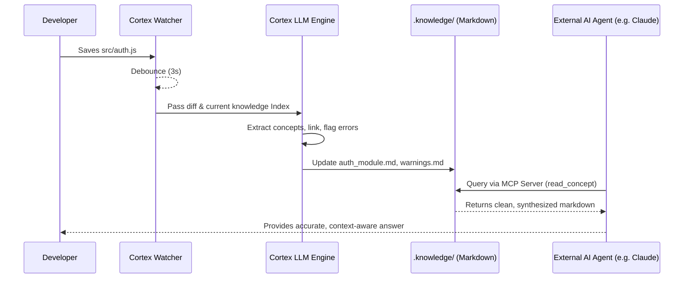

# Project Cortex: Architecture & System Design

This document serves as the technical blueprint for building Project Cortex. It outlines the core components, data flow, tech stack, and dependencies required to build the Autonomous Knowledge Engine.

---

## 1. System Overview

Cortex is a local-first, headless Node.js daemon that operates in two primary modes:
1.  **Active Ingestion (The Daemon)**: A background process that watches the user's source code, leverages LLMs to synthesize architectural changes, and writes the output to a local `.knowledge` folder in human-readable Markdown.
2.  **Context Serving (The MCP Server)**: An integration layer that exposes the synthesized `.knowledge` folder to external AI agents (Claude Code, Cursor, Antigravity) via the Model Context Protocol (MCP).

---

## 2. Core Components

### A. The File Watcher (`watcher/`)
*   **Responsibility**: Monitor the project directory (`src/`, `lib/`, etc.) for `add`, `change`, and `unlink` events.
*   **Behavior**: Implements debouncing to prevent spamming the LLM when a developer saves a file multiple times rapidly. Ignores `.git`, `node_modules`, and the `.knowledge` folder to prevent recursive loops.

### B. The Extraction Pipeline (`llm/`)
*   **Responsibility**: Converts raw code changes into semantic architectural knowledge.
*   **Behavior**: Takes a git diff or file content, packages it with the current `.knowledge/index.md` state, and sends it to an LLM. It forces the LLM to return Structured JSON (e.g., `filesToUpdate`, `newConcepts`, `contradictions`).

### C. The knowledge Manager (`knowledge/`)
*   **Responsibility**: Handles file I/O operations for the `.knowledge` directory.
*   **Behavior**: Parses the LLM's JSON response and executes the file writes. It manages the creation of new Markdown pages, appends to existing pages, and ensures bidirectional linking (`[[Concept]]`) is maintained for Obsidian compatibility.

### D. The MCP Server (`mcp/`)
*   **Responsibility**: Act as the bridge between Cortex's synthesized knowledge and active coding agents.
*   **Behavior**: Exposes tools like `get_architecture_overview`, `read_concept`, and `report_new_learning`.

---

## 3. Data Flow (Mermaid Diagram)



---

## 4. Tech Stack & Dependencies

The project will be built as a standalone CLI tool using **Node.js** and **TypeScript** for strict type safety, especially when handling LLM JSON outputs.

### Core Dependencies
*   **CLI Framework**: `commander` (For handling `cortex init`, `cortex start`)
*   **File System**: `chokidar` (Robust file watching, better than native `fs.watch`)
*   **LLM Orchestration**: `@ai-sdk/core` & `@ai-sdk/openai` (Vercel AI SDK allows us to easily swap between OpenAI, Anthropic, or local models).
*   **Validation**: `zod` (For enforcing strict JSON schemas on the LLM output).
*   **MCP Integration**: `@modelcontextprotocol/sdk` (Official SDK for building the server).
*   **Utilities**: `dotenv` (API keys), `ignore` (Parsing `.gitignore` rules).

---

## 5. Folder Structure Blueprint

```text
project-cortex/
├── bin/
│   └── cortex.js            # CLI Entry point
├── src/
│   ├── cli/                 # Commander logic (init, watch)
│   ├── core/
│   │   ├── watcher.ts       # Chokidar implementation
│   │   ├── diff.ts          # Git diff extraction logic
│   │   └── config.ts        # Loads CORTEX.md or cortex.json
│   ├── llm/
│   │   ├── prompts.ts       # System prompts for the Librarian
│   │   └── client.ts        # AI SDK implementation with Zod schemas
│   ├── knowledge/
│   │   ├── writer.ts        # Markdown generation and file I/O
│   │   └── indexer.ts       # Maintains the index.md catalog
│   └── mcp/
│       └── server.ts        # The MCP Server exposing tools
├── package.json
├── tsconfig.json
└── README.md
```

---

## 6. The Knowledge Data Schema (Output)

When Cortex runs on a user's repository, it generates and maintains this structure in their project root:

```text
.knowledge/
├── index.md             # The catalog. Agent reads this first.
├── log.md               # Append-only chronological trajectory.
├── warnings.md          # Contradictions or architectural drift.
├── entities/            # Specific files/modules (e.g., AuthController.md)
└── concepts/            # Abstract ideas spanning files (e.g., DatabaseStrategy.md)
```

## 7. Next Implementation Steps

1.  Initialize Node/TypeScript project (`package.json`, `tsconfig.json`).
2.  Install core dependencies (`chokidar`, `commander`, `zod`, `ai`).
3.  Build the CLI skeleton (`bin/cortex.js`).
4.  Implement the File Watcher to log changes to the console.
5.  Connect the LLM engine to generate a dummy Markdown file.
