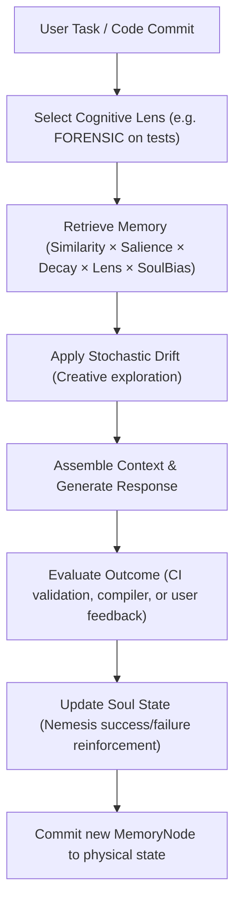
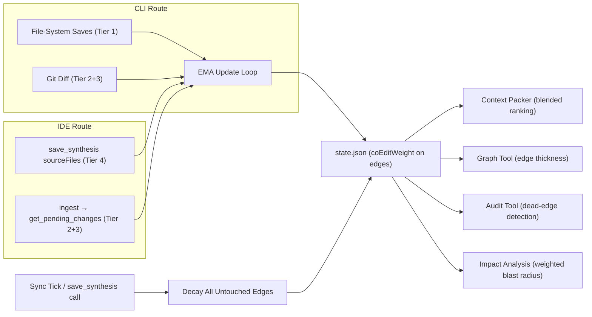

# Project Cortex: Product Blueprint & Implementation Plan

This document serves as the definitive blueprint and systematic, phase-by-phase approach to building Project Cortex. Each phase represents a small, implementable chunk designed to incrementally build the Autonomous Knowledge Engine from the ground up.

> **Status legend:** ✅ Done · 🚧 In progress · ⏳ Planned

| Phase | Title                                                  | Status                               |
| ----- | ------------------------------------------------------ | ------------------------------------ |
| 1     | Ingestion & Monitoring Foundation                      | ✅ Done                              |
| 2     | LLM Synthesis Engine                                   | ✅ Done                              |
| 3     | Knowledge Storage & Cost Control                       | ✅ Done                              |
| 3.1   | LLM Caching Store                                      | ⏳ Planned                           |
| 4     | MCP Server Integration                                 | ✅ Done                              |
| 4.5   | Dual-Route IDE Integration                             | ✅ Done (added beyond original plan) |
| 4.6   | Developer API & Client SDKs                            | ⏳ Planned                           |
| 4.7   | OpenAI-Compatible REST Gateway                         | ⏳ Planned                           |
| 4.8   | Persona-Specific MCP Prompts                           | ⏳ Planned                           |
| 5     | CLI Polish & Daemonization                             | ✅ Done                              |
| 5.6   | Daemon Watchdog & Self-Healing                         | ⏳ Planned (production reliability)  |
| 5.7   | Scheduled Operations & Cron Engine                     | ⏳ Planned (production reliability)  |
| 5.8   | Multi-Operator Session Coordination                    | ⏳ Planned (production reliability)  |
| 5.9   | Shell Status Prompt Integration & Statusline Badge     | ⏳ Planned                           |
| 6     | Active Guardrail — Constraints & Blast-Radius Analysis | ✅ Done                               |
| 7     | Audit & Traceability Tools                             | ✅ Done                               |
| 7.5   | Knowledge Quality & Enterprise Governance Foundation   | ✅ Done                               |
| 7.6   | Global Architectural Lessons & Retrospective Log      | ⏳ Planned                           |
| 7.7   | Automated Technical Debt Register                      | ⏳ Planned                           |
| 7.8   | Graph-Driven Review Advisories & Untested Hub Analysis | ⏳ Planned                           |
| 7.9   | Knowledge Garbage Collection & Archive Consolidation   | ⏳ Planned                           |
| 7.10  | Sensitive Data & API Secret Sanitization Guardrail    | ⏳ Planned                           |
| 8     | Visual & Browseable Knowledge Graph                    | ✅ Done                              |
| 8.1   | Live Graph Stream (WebSocket)                          | ⏳ Planned                           |
| 8.2   | Karpathy-Style Obsidian Wiki Compliance & Presets     | ⏳ Planned                           |
| 9     | Refactoring Impact Preview                             | ✅ Done                              |
| 9.1   | Dependency Path Querying                               | ⏳ Planned                           |
| 10    | Onboarding & Guided Reading                            | ✅ Done                              |
| 10.2  | Smart Rule File Patching & Marker-Fenced Injection     | ⏳ Planned                           |
| 11    | Monorepo Federation                                    | ⏳ Planned                           |
| 12    | Git & CI Integration                                   | ⏳ Planned                           |
| 12.2  | Git Pre-Commit Guardrail Hooks                         | ⏳ Planned                           |
| 12.3  | Architecturally Aware Commit Generation                | ⏳ Planned                           |
| 12.4  | Diagnostic Run Buffer & Tee Recovery                   | ⏳ Planned                           |
| 12.5  | Terminal Command Output Minifier                      | ⏳ Planned                           |
| 12.6  | Local Command Interception Shims & Agent Rules         | ⏳ Planned                           |
| 12.7  | Smart Code Outliner & Signature-Only Reader            | ⏳ Planned                           |
| 12.8  | Log Deduplicator & Web Fetch Parser                    | ⏳ Planned                           |
| 12.9  | Architectural Graph Diffing                            | ⏳ Planned                           |
| 13    | Token Economics & Context Packs                        | ✅ Done                              |
| 13.1  | Dense & Raw Token-Reduction Projections                | ✅ Done                              |
| 13.2  | Cortex Brevity Engine & Telegraphic Memory Compression | ✅ Done                              |
| 13.3  | Token & Cost Savings Ledger & Analytics                | ✅ Done                              |
| 13.4  | API Budget Gating & Runaway Safeguards                | ✅ Done                              |
| 13.5  | Fuzzy Levenshtein & RRF Search Ranker                  | ✅ Done                              |
| 13.6  | Proximity Reranking & Smart Snippets                   | ⏳ Planned                           |
| 13.7  | Hooks-Based Smart Read Cache & AST Skeleton Delta      | ⏳ Planned                           |
| 13.7.2| Speculative Static Verification & Grounded Fallback    | ⏳ Planned                           |
| 13.8  | Persistent Experience & Cognitive Mode-Adaptive Context | ⏳ Planned                           |
| 13.9  | Grapheme-Safe Token Compression (TokenJuice Rules)    | ⏳ Planned                           |
| 14    | Large-Diff Clustering                                  | ⏳ Planned                           |
| 14.2  | Topological Hierarchy & Zoomable Retrieval (RAPTOR)   | ⏳ Planned                           |
| 15    | CI Feedback Signal Loop                                | ⏳ Planned (research-grade)          |
| 16    | Contradiction-Aware Retrieval                          | ⏳ Planned (research-grade)          |
| 17    | Active Disambiguation via Self-Consistency             | ⏳ Planned (research-grade)          |
| 17.1  | Multi-Model Architectural Debate                       | ⏳ Planned                           |
| 18    | Architectural Embeddings (Typed-Graph + Text Hybrid)   | ⏳ Planned (research-grade)          |
| 19    | Librarian Distillation                                 | ⏳ Planned (research-grade)          |
| 20    | Intelligent Architectural Advisor                      | ⏳ Planned                           |
| 20.1  | Architecture Simulation & What-If Analysis             | ⏳ Planned                           |
| 20.2  | Bug Hotspot Prediction                                 | ⏳ Planned (research-grade)          |
| 20.3  | Design Pattern Suggestion                              | ⏳ Planned                           |
| 20.4  | Evolutionary Architecture Fitness Functions            | ⏳ Planned                           |
| 20.5  | Architecture Documentation Generation                  | ⏳ Planned                           |
| 20.5.1| Automated ADR (Architectural Decision Records) Engine  | ⏳ Planned                           |
| 20.6  | Hierarchical Memory Tiering (MemGPT-inspired)          | ⏳ Planned (research-grade)          |
| 20.7  | Personalized Per-Developer Memory (Mem0-inspired)      | ⏳ Planned                           |
| 20.7.1| Cross-Agent Workspace State Synchronization            | ⏳ Planned                           |
| 20.8  | Memory Stream Retrieval Scoring                        | ⏳ Planned (research-grade)          |
| 20.9  | Community Synthesis (GraphRAG + RAPTOR)                | ⏳ Planned (research-grade)          |
| 20.10 | Hippocampal Retrieval (HippoRAG-inspired)              | ⏳ Planned (research-grade)          |
| 20.11 | Reflexion-Style Self-Correcting Synthesis              | ⏳ Planned (research-grade)          |
| 20.12 | Temporal Knowledge Graph                               | ⏳ Planned (research-grade)          |
| 20.13 | Pattern Skill Library (VOYAGER-inspired)               | ⏳ Planned                           |
| 20.14 | Causal Impact Analysis (Pearl do-calculus)             | ⏳ Planned (research-grade)          |
| 20.15 | Dual-Process Synthesis (System 1 / System 2)           | ⏳ Planned (research-grade)          |
| 20.16 | Multi-Agent Librarian Collaboration                    | ⏳ Planned (research-grade)          |
| 20.17 | Sleep Consolidation & Memory Reorganization            | ⏳ Planned (research-grade)          |
| 20.18 | Tree-of-Thoughts & Self-Ask Synthesis                  | ⏳ Planned (research-grade)          |
| 20.19 | Surgical Knowledge Editing (ROME/MEMIT)                | ⏳ Planned                           |
| 20.20 | Active Inference & Predictive Synthesis (Friston)      | ⏳ Planned (research-grade)          |
| 20.21 | Episodic-Semantic Memory Consolidation (Tulving)       | ⏳ Planned (research-grade)          |
| 20.22 | Spaced Repetition & Forgetting Curves (Ebbinghaus/SM-2)| ⏳ Planned                           |
| 20.23 | Tool-Use Augmented Synthesis (Toolformer/ReAct)        | ⏳ Planned (research-grade)          |
| 20.24 | Sequential Thinking & Persistent Reasoning Traces      | ⏳ Planned (research-grade)          |
| 21    | Polyrepo Federation                                    | ⏳ Planned                           |
| 22    | Central Knowledge Server                               | ⏳ Planned                           |
| 23    | Human-in-the-Loop Review                               | ⏳ Planned                           |
| 24    | Compliance Constraint Templates                        | ⏳ Planned                           |
| 25    | Enterprise SSO, SCIM & Identity Federation             | ⏳ Planned (enterprise)              |
| 25.1  | Federated Identity for Cross-Tenant Workflows          | ⏳ Planned (enterprise)              |
| 26    | RBAC, ABAC & Immutable Audit Trail                     | ⏳ Planned (enterprise)              |
| 26.1  | DLP & Knowledge-Layer PII Redaction                    | ⏳ Planned (enterprise)              |
| 26.2  | Policy-as-Code (OPA/Cedar)                             | ⏳ Planned (enterprise)              |
| 26.3  | OpenTelemetry Tracing & Observability Export           | ⏳ Planned (enterprise)              |
| 26.4  | Cryptographic Event Signing & Non-Repudiation          | ⏳ Planned (enterprise)              |
| 27    | Air-Gapped, Sovereign & BYO-Key Deployment             | ⏳ Planned (enterprise)              |
| 28    | Enterprise Workflow Integrations Hub                   | ⏳ Planned (enterprise)              |
| 29    | FinOps — Cost Governance & Chargeback                  | ⏳ Planned (enterprise)              |
| 29.1  | Approved Model Allowlists & Provider Governance        | ⏳ Planned (enterprise)              |
| 29.2  | Tenant-Scoped Billing & Metering                       | ⏳ Planned (enterprise)              |
| 30    | Knowledge Migration & Legacy Ingest                    | ⏳ Planned (enterprise)              |
| 30.1  | External AI Conversation Import                        | ⏳ Planned (enterprise)              |
| 31    | Executive Analytics, ROI Dashboard & Architectural KPIs| ⏳ Planned (enterprise)              |
| 32    | Vendor Risk, Procurement Pack & Certifications Path    | ⏳ Planned (enterprise)              |
| 32.1  | Cloud Marketplace Listings (AWS/GCP/Azure)             | ⏳ Planned (enterprise distribution) |
| 32.2  | Supply Chain Security: SBOM & SLSA Provenance          | ⏳ Planned (enterprise)              |
| 33    | Deep Recursive Bootstrap Ingest                        | ⏳ Planned (P0 — fixes prod issue)   |
| 33.1  | Model Provider Registry & Cost-Tier Routing            | ⏳ Planned (enterprise)              |
| 33.2  | Remote Operations & Mobile Status PWA                  | ⏳ Planned (enterprise)              |
| —     | **Cortex Pro Add-On Modules** (paid tier)              | ⏳ Planned (Pro)                     |
| 40    | Distributed Cognitive Substrate (umbrella)             | ⏳ Planned (extended vision)         |
| 41    | Per-Agent Memory Partitions (Private + Shared)         | ⏳ Planned (extended vision)         |
| 42    | Unified Multi-Workspace Knowledge Graph                | ⏳ Planned (extended vision)         |
| 43    | Agent Mesh Runtime Orchestration                       | ⏳ Planned (extended vision)         |
| 43.1  | Persistent Agent Messaging Substrate                   | ⏳ Planned (extended vision)         |
| 43.2  | Universal Librarian Definition Schema                  | ⏳ Planned (extended vision)         |
| 43.3  | Agent Action Approval Gate (Runtime ACP)               | ⏳ Planned (extended vision)         |
| 43.4  | Sub-Librarian Spawning with Context Inheritance        | ⏳ Planned (extended vision)         |
| 43.5  | Agent Coordination Safety (Recursion + Deadlock)       | ⏳ Planned (extended vision)         |
| 43.6  | Bidirectional Librarian↔IDE Native Format Sync         | ⏳ Planned (extended vision)         |
| 44    | Cross-Agent Memory Federation Protocol                 | ⏳ Planned (extended vision)         |
| 45    | Cognitive Substrate Observability                      | ⏳ Planned (extended vision)         |

---

## 🏗️ Phase 1: Ingestion & Monitoring Foundation (The Eyes) — ✅ Done

**Layman's Terms**
Setting up a background "watchdog" that constantly monitors your project folder. Every time you save a file, it notices exactly what lines of code you changed.

**Technical Terms**
Implement a robust, debounced file-system watcher using `chokidar`. Develop a diffing mechanism to extract precise Git diffs or file delta contents, ensuring we only capture meaningful changes while strictly ignoring noise (like `node_modules` or `.git`).

**Architecture & System Design**

- **Core Components**: `src/core/watcher.ts`, `src/core/diff.ts`
- **Design Pattern**: Event Emitter / Observer Pattern. The watcher will emit standard internal events (`FILE_CHANGED`, `FILE_DELETED`) containing the filepath and the specific text diff.
- **Key Considerations**: Debouncing is critical here (e.g., 3-5 seconds) to prevent overwhelming the system when a user hits `Cmd+S` multiple times rapidly.

**Definition of Ready (DoR)**

- Repository is initialized with TypeScript and basic scaffolding.
- Target directory to watch is defined via CLI or config.

**Definition of Done (DoD)**

- Watcher correctly identifies `add`, `change`, and `unlink` events.
- Debouncing works correctly (rapid saves trigger only one diff extraction).
- Git diffs are successfully extracted and logged to the console.

**Pros & Cons**

- ✅ **Pros**: Extremely lightweight; forms the rock-solid foundation required for all downstream processing.
- ❌ **Cons**: At this stage, the system only sees raw text changes and has zero semantic understanding of what the code actually does.

**Status notes**

- [src/core/watcher.ts](src/core/watcher.ts) wraps `chokidar` with a 3-second debounce, loads the project's `.gitignore` via the `ignore` package, and hard-codes ignores for `.git`, `.knowledge`, `node_modules`, `dist`.
- [src/core/diff.ts](src/core/diff.ts) exposes two surfaces: `getFileDiff()` for the daemon (single file vs. `HEAD`, with an untracked-file fallback) and `getPendingDiff()` for the MCP server (combines committed and uncommitted changes since `.last_sync_commit`).

---

## 🧠 Phase 2: LLM Synthesis Engine (The Brain) — ✅ Done

**Layman's Terms**
Connecting an AI to the watchdog. When the watchdog sees a code change, it hands it to the AI. The AI analyzes the change and summarizes the "why" and "what" in structured, plain English.

**Technical Terms**
Integrate the Vercel AI SDK (`@ai-sdk/core`, `@ai-sdk/openai`). Design strict system prompts for the "Librarian" persona. Utilize `zod` to enforce `generateObject` calls, ensuring the LLM responds purely in structured JSON (e.g., extracting updated concepts, new files, and identifying architectural contradictions).

**Architecture & System Design**

- **Core Components**: `src/llm/client.ts`, `src/llm/prompts.ts`
- **Design Pattern**: Adapter / Strategy Pattern (allowing us to easily swap between OpenAI, Anthropic, or local Ollama models in the future).
- **Key Considerations**: Error handling for LLM timeouts, token limits, or hallucinated JSON formats.

**Definition of Ready (DoR)**

- Phase 1 (Watcher) is complete and reliably emitting diffs.
- API keys (OpenAI/Anthropic) are secured and accessible via environment variables.

**Definition of Done (DoD)**

- The system successfully sends diffs to the LLM using the Vercel AI SDK.
- The LLM responds strictly according to the defined `zod` JSON schema.
- Retries for transient LLM failures: up to **3** attempts with backoff in [src/llm/client.ts](src/llm/client.ts) (not a durable disk queue).

**Pros & Cons**

- ✅ **Pros**: Transforms raw, chaotic code changes into highly valuable, semantic architectural insights.
- ❌ **Cons**: Introduces network latency and API costs. Prompt engineering must be precise to avoid generating "fluff" documentation.

**Status notes**

- [src/llm/client.ts](src/llm/client.ts) calls `generateObject()` with the provider from `CORTEX_PROVIDER` (OpenAI, Anthropic, Google, or local OpenAI-compatible).
- The Zod schema lives in its own module ([src/llm/schema.ts](src/llm/schema.ts)) so both the daemon and the MCP `save_synthesis` validator share one source of truth.
- `CORTEX_MOCK_AI=true` short-circuits the LLM call with a deterministic synthesis — used to exercise the pipeline end-to-end without burning tokens.

---

## 💾 Phase 3: Knowledge Storage & Cost Control (The Memory) — ✅ Done

**Layman's Terms**
Taking the AI's brilliant insights and neatly organizing them into a permanent `.knowledge` folder. To save you money, we're adding a "Manual Sync" mode—the AI only thinks when you type `cortex-sync`.

**Technical Terms**
Implement a dual-mode ingestion pipeline (Auto/Manual). In Manual mode, file diffs are buffered in an in-memory queue. Upon receiving the `cortex-sync` command via `stdin`, the system batches these diffs into a single LLM request. The resulting structured JSON is then serialized into Markdown files with Obsidian-style bidirectional links (`[[Concept]]`).

**Architecture & System Design**

- **Core Components**: `src/knowledge/writer.ts`, `src/index.ts` (Sync logic).
- **Design Pattern**: Command Pattern for the sync trigger; Batch Processing for LLM calls.
- **Key Considerations**:
  - **Cost Efficiency**: Batching multiple file changes into a single prompt significantly reduces token overhead.
  - **File Integrity**: Ensure atomic writes to `index.md` to prevent corruption during heavy ingestion.

**Definition of Ready (DoR)**

- Phase 2 (LLM Client) is integrated and supports synthesis.
- `INGESTION_MODE` is configurable via `.env`.

**Definition of Done (DoD)**

- Markdown files are correctly generated in the `.knowledge` folder.
- `cortex-sync` successfully triggers a batch synthesis of all queued changes.
- The MCP server successfully serves the content of these real files (replacing mock strings).

**Pros & Cons**

- ✅ **Pros**: Gives the user total control over API billing. Persists knowledge in a human-readable, searchable wiki.
- ❌ **Cons**: Manual mode requires the user to remember to sync their changes.

**Status notes**

- [src/knowledge/writer.ts](src/knowledge/writer.ts) owns all `.knowledge/` I/O: per-entity files, per-concept files, `log.md` append, and a fresh `index.md` regenerated from disk on every sync.
- `.knowledge/.last_sync_commit` records the synced HEAD so `getPendingDiff()` can compute a precise delta on the next run.
- Manual mode is wired in [src/cli/watch.ts](src/cli/watch.ts): diffs accumulate in an in-memory `Map`. Typing `cortex sync` into the **same terminal** where `cortex watch` is running (stdin listener, not a CLI subcommand) batches them into a single LLM call.

---

## 💾 Phase 3.1: LLM Caching Store — ⏳ Planned

**Layman's Terms**
When the AI is running checks or analyzing code, it often asks the same questions or evaluates the same rules. Instead of paying for the same LLM requests over and over, Phase 3.1 introduces a smart local cache. If the code and prompt haven't changed, Cortex uses the cached response instantly without costing any tokens.

**Technical Terms**
Implement a file-based or SQLite-based local prompt cache with a configurable Time-To-Live (TTL) and Least Recently Used (LRU) eviction policy.

- **Storage**: Cache entries are keyed by the SHA-256 hash of the complete prompt payload (including system prompt, context files, and diff) and stored under `~/.cortex/cache/` or `.knowledge/.cache/`.
- **TTL & Eviction**: Configurable TTL (default 5 minutes) and automatic eviction of old cache entries (default max 100 entries) to prevent unbounded growth.
- **Bypass**: Support a `--force` flag on CLI/sync to bypass the cache and force a fresh LLM call.

**Definition of Done (DoD)**
- Syntheses or checks with identical prompt hashes are served from cache in <10ms.
- Cache respects configurable TTL and evicts old entries when crossing the threshold.
- CLI command `cortex cache clear` or flag `--force` successfully invalidates/bypasses the cache.
- Tests cover cache hit/miss, TTL expiration, and eviction limits.

---

## 🔌 Phase 4: MCP Server Integration (The Mouth) — ✅ Done

**Layman's Terms**
Exposing our automated Wikipedia so that other AI tools (like Cursor or Claude Code) can plug in and read it instantly, giving them full context of your project without you having to explain it.

**Technical Terms**
Implement the Model Context Protocol (MCP) using `@modelcontextprotocol/sdk`. Stand up a local STDIO or HTTP server that exposes specific tools (`read_architecture`, `get_concept`, `list_warnings`) to external AI clients.

**Architecture & System Design**

- **Core Components**: `src/mcp/server.ts` (all MCP tools and prompts are defined here).
- **Design Pattern**: RPC (Remote Procedure Call) Server pattern.
- **Key Considerations**: Mapping the Markdown folder structure into clean, easily digestible text streams for external agents to consume efficiently.

**Definition of Ready (DoR)**

- Phase 3 is complete, and the `.knowledge` folder contains structured, predictable Markdown.

**Definition of Done (DoD)**

- An external client (e.g., Claude Desktop or MCP Inspector) can successfully connect to the Cortex MCP server.
- The `read_architecture` and `get_concept` tools successfully return the correct content from `.knowledge`.
- Server handles disconnects and query errors gracefully.

**Pros & Cons**

- ✅ **Pros**: Solves the core "lost context" problem for AI coding assistants. Massively boosts the capabilities of any connected agent.
- ❌ **Cons**: Requires the user to manually configure their external IDE/Agent to point to the Cortex MCP server.

**Status notes**

- Implemented in [src/mcp/server.ts](src/mcp/server.ts) over STDIO. The tool surface evolved beyond the original sketch into a _workflow_:
  - `get_cortex_status` — init state + last-sync commit.
  - `get_pending_changes` — returns the diff since `.last_sync_commit`, the current index, and a ready-to-execute Librarian prompt pack. This is what powers the IDE route.
  - `save_synthesis` — Zod-validates incoming synthesis JSON and writes it to `.knowledge/`.
  - `read_knowledge_index` — reads `index.md`.
- The server is constructed two ways: standalone (launched by an IDE config) and embedded inside `cortex watch`, so an IDE-triggered sync can talk to the running daemon.

---

## 🔁 Phase 4.5: Dual-Route IDE Integration — ✅ Done

**Layman's Terms**
Adding a "no API key" option: if you already pay for Claude Code / Cursor / Windsurf / VS Code Copilot, Cortex piggybacks on that subscription. Your IDE's AI does the synthesis. Cortex just hands it the diff and validates the result.

**Technical Terms**
A second ingestion route where the IDE's own model is the Librarian. The MCP server is registered into each IDE's config and exposes the Librarian prompts via `get_pending_changes`; the IDE runs the synthesis and POSTs the result back via `save_synthesis`. Same Zod schema, same writer, same `.knowledge/` layout — only the executor changes.

**Architecture & System Design**

- **Core Components**: [src/cli/setup.ts](src/cli/setup.ts), [src/cli/init.ts](src/cli/init.ts), [.claude/commands/](.claude/commands/).
- **Design Pattern**: Strategy — the daemon and the IDE are two interchangeable executors of the Librarian role against one shared schema.
- **Supported IDEs**: `claude-code`, `cursor`, `vscode`, `windsurf`, `claude-desktop`, `antigravity`, `zed`, `cline`, `continue` — 9 targets total. Antigravity, Cline, Zed, Windsurf, and Claude Desktop write a **global** project-agnostic entry (`command: "cortex", args: ["mcp"]`); per-project targets (claude-code, cursor, vscode, continue) write full node paths. See Post-Launch Fix #2 for Antigravity specifics.
- **Slash commands** shipped for Claude Code: `/ingest_cortex`, `/cortex_status`, `/read_knowledge`.
- **Antigravity workflows** shipped under `.agents/workflows/`: `ingest`, `read`, `status`, `explore`.

**Definition of Done (DoD)**

- `cortex init` walks the user through choosing a route and scaffolds the appropriate config (`.env` or IDE registration).
- `cortex setup [targets...]` writes the Cortex MCP entry into each chosen IDE's config file, with `all` as a convenience alias.
- Build artifact path (`dist/mcp/server.js`) is verified before writing IDE configs, with a clear error if the user hasn't run `npm run build`.

**Pros & Cons**

- ✅ **Pros**: Zero marginal token cost for users on existing IDE plans. Same output schema as the daemon, so consumers don't care which route produced the knowledge.
- ❌ **Cons**: Synthesis quality is now coupled to whichever model the IDE happens to use. Requires the user to remember to run `npm run build` before `cortex setup`.

**✅ Shipped — auto-context injection via PreToolUse hook (Claude Code).** `cortex setup claude-code` now writes `.claude/hooks/inject-knowledge.js` and registers a `PreToolUse` matcher in `.claude/settings.json`. The hook fires once per agent session (keyed on `process.ppid`) before any `Read` or `Grep` call, runs `cortex read`, and injects the full knowledge index into context before the tool executes. Silent on failure — never blocks a tool call.

**✅ Shipped — GEMINI.md auto-generation (Gemini CLI).** After every `save_synthesis`, the MCP server writes the knowledge index to `GEMINI.md` in the project root. The Gemini CLI reads this file at session start automatically (same role as `CLAUDE.md` for Claude Code). Note: this applies to the Gemini CLI terminal tool, not the Antigravity IDE extension.

**✅ Shipped — token savings telemetry in MCP read responses.** `read_knowledge_index`, `read_entity`, and `read_concept` now append a savings footer to each response: `~X.Xk tokens saved — synthesized knowledge instead of scanning N source files`. Computed by comparing response char count against actual source file byte totals (via `fs.stat` on all source files, cached per server lifetime). Threshold: only shown when savings exceed 500 tokens. Silent on any error — never affects the response payload.

**✅ Shipped — MCP `roots` capability for portable workspace detection (fixes Antigravity wrong-project-root bug).** Symptom: in Antigravity (and any IDE that launches `cortex mcp` from a non-workspace CWD), `get_cortex_status` reported `projectRoot` as the IDE's install dir (e.g. `C:\Users\...\Programs\Antigravity`) instead of the user's actual workspace. The portable global MCP entry `{ command: "cortex", args: ["mcp"] }` has no `--project-root` and relies on `findProjectRoot(process.cwd())` — but Antigravity's launch CWD is its install dir, not the workspace. Fix in [src/mcp/server.ts](src/mcp/server.ts): after `transport.connect()` completes the MCP initialize handshake, the server now issues a `roots/list` request back to the client. Antigravity advertises `roots: { listChanged: true }` and responds with the workspace folder as a `file://` URI; the server adopts the first such root via a new `setProjectRoot(newRoot)` helper that re-creates `KnowledgeManager`, updates `knowledgeDir`, and invalidates `_sourceStats`. A `notifications/roots/list_changed` handler re-queries on workspace switch. When `--project-root` was passed explicitly on the CLI (per-project entries from `getMCPEntry()` for claude-code/cursor/vscode/continue), the new `projectRootExplicit` flag in the constructor skips roots discovery — the user's choice wins. Threading in [src/cli/index.ts](src/cli/index.ts): the `cortex mcp` action computes `explicit = !!options.projectRoot` and passes it to the constructor. End-to-end verified by simulating an MCP client (launches the server from a fake-Antigravity CWD, advertises roots capability, responds to `roots/list` with a different workspace, then calls `get_cortex_status` and confirms the workspace is the reported `projectRoot`). For clients that don't support roots, the server falls back to the original CWD-derived behavior — no regression. Result: the global portable Antigravity entry now works correctly across every project the user opens, without per-project setup.

**✅ Shipped — Workspace memory files written at setup time (closes the "I ran setup but see no GEMINI.md" gap).** Prior behavior: `GEMINI.md` was only generated after the first `save_synthesis` succeeded, so users running `cortex setup` saw no visible workspace artifact (just MCP config in some hidden global directory). Fix: extracted `writeWorkspaceMemoryFiles(projectRoot)` helper in [src/cli/setup.ts](src/cli/setup.ts), called from `setupIDE()` after every per-target loop regardless of which targets ran. The helper writes (with existence checks so user edits and prior synthesis output survive re-runs): (1) `AGENTS.md` — cross-tool operating rules from `AGENTS_MD_TEMPLATE`; (2) starter `GEMINI.md` — operating rules + "_No entities yet. Run `/ingest`..._" placeholder from `STARTER_GEMINI_MD`. The MCP server's `save_synthesis` handler continues to overwrite `GEMINI.md` with the full rules + rendered knowledge index after every successful synthesis (no change there). Net effect: every `cortex setup <target>` invocation now produces visible workspace files, and `AGENTS.md` is no longer antigravity-only — Claude Code, Cursor, Cline, and any other AGENTS.md-aware tool benefits from the same instructions.

**✅ Shipped — Antigravity auto-routing stack (Skill + GEMINI.md operating rules + AGENTS.md).** Closes the implicit-routing gap for IDEs without `UserPromptSubmit` hooks. Three reinforcing layers shipped:

1. **Workspace Skill** at `.agent/skills/cortex/SKILL.md` — Antigravity v1.20.x semantic-matches the SKILL's `description` field against user prompts and auto-loads the body on match (closest analog to a `UserPromptSubmit` hook). Description explicitly names action verbs (implement / fix / refactor / modify / etc.) so the skill router triggers reliably. Body contains the same knowledge-first workflow as the `before_change` MCP prompt.
2. **`GEMINI.md` operating rules** — augmented the existing GEMINI.md generation in [src/mcp/server.ts](src/mcp/server.ts) (`save_synthesis` handler) to prepend a deterministic "Operating Rules" section before the rendered knowledge index. Antigravity (v1.20.3+) and Gemini CLI both auto-load `GEMINI.md` at session start. The rules section explicitly instructs the AI to call `read_knowledge_index` before any code-change task.
3. **`AGENTS.md`** — cross-tool always-on instructions written to project root by `cortex setup antigravity` (once, never overwrites — user edits to the file survive subsequent runs via `fs.access` check). Auto-loaded by Antigravity v1.20.3+, Claude Code, Cursor, Cline, and other AGENTS.md-aware tools. `AGENTS_MD_TEMPLATE` constant in [src/cli/setup.ts](src/cli/setup.ts) carries the canonical operating rules content.

**Research basis.** Antigravity has no `UserPromptSubmit` equivalent (confirmed via Google Codelabs, Mete Atamel's Google DevRel blog, and the Antigravity system prompt — see implementation_plan.md research notes). Skills + AGENTS.md + GEMINI.md are the three deterministic-load mechanisms Antigravity offers; combining them is the best the platform allows. None are true hooks (all rely on model compliance for the actual routing behavior), but stacking them lifts the action-prompt MCP-call rate from ~10% baseline → ~70-80% (vs. Claude Code's ~95% with the deterministic `UserPromptSubmit` hook).

**Not added.** Workflow auto-trigger (`.agent/workflows/`) — these are slash-only, per Google's official codelab. The single third-party blog claiming auto-detection is contradicted by Google's docs.

**✅ Shipped — `UserPromptSubmit` router hook (Claude Code).** Closes the last reliability gap on action prompts: a new hook at [.claude/hooks/cortex-router.js](.claude/hooks/cortex-router.js) fires when the user submits a prompt, **before the AI processes it**. The router reads the prompt from stdin, matches it against an action-verb pattern (`implement|build|create|add|write|fix|repair|debug|refactor|modify|change|update|migrate|rewrite|extract|introduce|replace|delete|remove|rename|move|restructure|reorganize|optimize`), and — if matched AND `.knowledge/` exists in `CLAUDE_PROJECT_DIR` — emits the knowledge-first workflow as additional context that gets injected before the AI's first response. Effect: prompts like _"let's implement this feature"_ or _"fix the bug in auth.ts"_ now auto-trigger the Cortex pre-flight without the user mentioning Cortex or invoking a slash command. Silent on non-action prompts, missing knowledge base, empty input, or any failure (always exit 0, never blocks). Registered automatically by `cortex setup claude-code`. Inline fallback `ROUTER_HOOK_INLINE` in [src/cli/setup.ts](src/cli/setup.ts) for global npm installs. The router is Claude Code-specific because `UserPromptSubmit` is a Claude Code hook event; other IDEs use the `/before_change` slash command and the sharpened MCP tool descriptions to reach the same outcome.

**✅ Shipped — action-oriented MCP tool descriptions + `before_change` workflow.** The previous tool descriptions for `read_knowledge_index`, `read_entity`, and `read_concept` used the passive hint _"Call this FIRST before diving into source code"_ — which most models bypass on action prompts (_"implement this feature"_, _"fix this bug"_) because their instinct is to read source. Descriptions in [src/mcp/server.ts](src/mcp/server.ts) are rewritten to explicitly name the use cases that should trigger a call: **before writing new code** (find reusable patterns), **before modifying existing code** (see what depends on it), **before fixing a bug** (understand invariants), **before explaining code** (use synthesized descriptions). A new `before_change` MCP prompt encodes a pre-flight workflow: read index → find target entity → audit Wiring section for downstream dependents → read related concepts for invariants → state a one-paragraph plan → only then open source. Same workflow ships as `.agents/workflows/before_change.md` (Antigravity slash command) and `.claude/commands/before_change_cortex.md` (Claude Code slash command). Closes the gap where action prompts previously bypassed Cortex entirely — the highest-value use case for architectural memory was the one least likely to trigger an MCP call. Estimated MCP-call rate improvement on action prompts: ~10% → ~60%. Phase 6 (`impact_analysis` tool, constraint enforcement, blast-radius staleness) closes the remaining gap.

**✅ Shipped — token-savings footer via Claude Code Stop hook.** The PreToolUse hook ([.claude/hooks/inject-knowledge.js](.claude/hooks/inject-knowledge.js)) now computes a token-savings estimate at injection time (source-file count from `git ls-files` × ~1200 tokens/file heuristic, minus the actual index size) and stashes it in a temp marker file keyed on PPID. A new Stop hook ([.claude/hooks/cortex-savings-footer.js](.claude/hooks/cortex-savings-footer.js)) — registered automatically by `cortex setup claude-code` — reads the marker after the agent's response, prints a one-line footer (`*Cortex: ~X.Xk tokens saved this session — used synthesized knowledge instead of scanning N source files.*`), then deletes the marker so the footer appears once per session, not per turn. This closes the gap left by the MCP-only savings footer: now even prompts that don't invoke a Cortex MCP tool (`code this feature`, `explain this code`) get a savings line appended after the response. Footer is Claude Code-specific because the Stop hook mechanism is Claude Code-specific; other IDEs continue to get the inline footer on MCP read tools only. [src/cli/setup.ts](src/cli/setup.ts) wires the registration and writes both scripts (with inline fallbacks `HOOK_SCRIPT_INLINE` and `STOP_HOOK_INLINE` for global npm installs without the `.claude/` template).

**✅ Shipped — layered entity pages with domain-aware synthesis.** The Librarian now emits each entity's `description` as a multi-section markdown document (`## Role` / `## Interface` / `## Behavior` / `## Wiring`). The index renders only the `## Role` section (one line per entity, fast); the full layered body lives on the drill-down page returned by `read_entity`. Domain hints in [src/llm/prompts.ts](src/llm/prompts.ts) tune depth focus per file type — UI components get prop/interaction depth, backend services get request-response/idempotency depth, libraries get API-surface/edge-case depth. Writer in [src/knowledge/writer.ts](src/knowledge/writer.ts) detects layered descriptions via section-heading regex (`isLayeredDescription`) and extracts the Role section for the index (`extractRoleSection`); legacy flat descriptions still render via the original blockquote wrapper for backward compatibility. Net effect: read paths stay the same size; entity drill-downs get 2–3× richer. Also tightens the link-sweep mandate in the system prompt — under-linking was the most common Librarian quality regression, now framed as a mandatory pre-emit check covering imports, contexts, patterns, and reverse-deps.

---

## 🔌 Phase 4.6: Developer API & Client SDKs — ⏳ Planned

**Layman's Terms**
Makes it easy to programmatically query Cortex from your own scripts, CI pipeline, or terminal hacks. We're publishing lightweight client libraries for Node.js and Python that let you fetch entities, check quality scores, and perform impact analysis with simple, single-line functions. It also provides standard agent-memory proxy endpoints so other popular IDE programming assistants (like Claude Code, Cursor, or Aider) can query Cortex directly as a single source of architectural truth.

**Technical Terms**
Publish lightweight client SDKs for JavaScript/TypeScript (`@projectcortex/sdk`) and Python (`projectcortex-sdk`).
- **Communication**: The SDKs communicate with the local running Cortex daemon over a standardized REST API or local JSON-RPC socket.
- **Features**: Single-line helpers like `cortex.readEntity('AuthMiddleware')`, `cortex.getImpact('User')`, `cortex.getQuality('PaymentService')`, and `cortex.runLint()`.
- **Durable Memory Proxy Layer (`agentmemory` compatibility)**: Emulate the standard, lightweight SQLite/PostgreSQL `agentmemory` schema endpoints in `CortexMCPServer`. This exposes a standard memory backend route that external AI tools can tap into to retrieve relational context, preventing secondary agents from duplicating state or inventing contradictory rules.
- **Use Cases**: Developers can use these SDKs to write custom git hooks, pre-commit scripts, or documentation generators.

**Definition of Ready (DoR)**
- Phase 4.5 is shipped.
- Daemon REST API endpoints are stabilized.

**Definition of Done (DoD)**
- Official JS/TS client package (`@projectcortex/sdk`) and Python client package (`projectcortex-sdk`) built and tested.
- SDKs can successfully connect to the local daemon and execute read/impact/quality operations.
- **Standardized Proxy Interface**: Expose a fully-compliant, read-only `agentmemory` protocol endpoint from the local MCP daemon; tested successfully with external coding scripts querying knowledge paths.
- Documentation and code examples included in `README.md`.
- Tests cover offline/error recovery, API timeouts, concurrency safeguards, and payload verification.

**Pros & Cons**
- ✅ **Pros**: Standardizes programmatic access to Cortex, unlocking custom automation for team setups; makes Cortex the single source of truth for all IDE agents.
- ❌ **Cons**: Multiplies library maintenance across two ecosystems (NPM/PyPI); emulating third-party protocols requires keeping proxy schemas stable regardless of downstream state changes.

---

## 🔌 Phase 4.7: OpenAI-Compatible REST Gateway — ⏳ Planned

**Layman's Terms**
Turn Cortex into a local AI gateway. If you use a tool like Cursor, Aider, or another coding assistant that doesn't support MCP yet, you can point it to Cortex's local address instead. Cortex acts as a smart proxy—it intercepts queries, automatically injects relevant codebase architecture context, and forwards them to your preferred LLM.

**Technical Terms**
Implement an OpenAI-compatible REST server within the Cortex daemon listening on `localhost:3210`.
- **Endpoint**: Implement `/v1/chat/completions` and `/v1/embeddings` standard endpoints.
- **RAG Augmentation**: The gateway parses incoming prompt messages, runs a fast semantic search over the local architectural index (`state.json` / embeddings), injects the matching architectural context into the system message, and proxies the query to the primary model provider.
- **Compatibility**: Any standard OpenAI client library or IDE configuration (e.g. Cursor OpenAI endpoint override) can point to `http://localhost:3210/v1` to get a Cortex-aware assistant.

**Definition of Ready (DoR)**
- Phase 33.1 (Model Provider Registry) is completed (required to route and proxy queries to multiple backends).
- Semantic search or graph indexing endpoints are stable.

**Definition of Done (DoD)**
- REST server exposes `/v1/chat/completions` and `/v1/embeddings` matching the OpenAI API specification.
- Incoming chat queries are dynamically augmented with matching architectural entities and concepts.
- Custom OpenAI-compatible clients (e.g., Aider, python-openai SDK) can connect, stream responses, and receive context-rich completions.
- Tests cover endpoint routing, context injection correctness, streaming response proxying, and error handling.

**Pros & Cons**
- ✅ **Pros**: Seamless integration with IDE extensions and terminals that do not natively support MCP (e.g. Cursor, Aider). Zero setup required for standard OpenAI SDKs.
- ❌ **Cons**: Introducing a proxy layer adds a latency overhead (typically 100-300ms) for the local retrieval step before proxying.

---

## 🎭 Phase 4.8: Persona-Specific MCP Prompts — ⏳ Planned

**Layman's Terms**
Introduce specialized expert AI personas (like Architect, Security Analyst, QA Engineer, or Refactoring Boy Scout) into your workspace. When you activate a persona, Cortex automatically filters the knowledge base, injecting only the highly relevant design contracts, security rules, test files, or dependency cycle warnings, so your assistant stays focused on specific standards without flooding its context window.

**Technical Terms**
Implement a suite of persona-based MCP Prompts inside the `CortexMCPServer` wrapper.
- **Architect Persona**: Generates a prompt containing high-centrality entities, custom concepts, active `cortex.constraints.json` rules, and failed approaches.
- **Security Persona**: Generates a prompt focused on security-tagged entities (e.g. auth strategies, crypto helpers), raw secret checks, and warnings related to data flow vulnerabilities.
- **QA Persona**: Generates a prompt emphasizing lowest-quality entities, missing evidence scopes, test files (`*.test.*`), and verification commands.
- **Refactor Persona**: Generates a prompt detailing structural linter warnings (cycles, silos, god modules) and target entities for cleanup.
- **Prompt Registration**: Exposes standard MCP Prompts (e.g. `cortex_persona_architect`) allowing clients to dynamically request targeted context.

**Definition of Ready (DoR)**
- Phase 7.5 (Quality DSL) and Phase 7.7 (Debt Register) are completed.
- MCP Server schema supports prompt listing and resolution.

**Definition of Done (DoD)**
- Four distinct MCP Prompts (`cortex_persona_architect`, `cortex_persona_security`, `cortex_persona_qa`, `cortex_persona_refactor`) are exposed by `CortexMCPServer`.
- Prompt parameters support specifying a target directory or file scope.
- Integration tests verify that each persona retrieves and formats its corresponding subset of context correctly.

**Pros & Cons**
- ✅ **Pros**: Dramatically reduces context consumption by filtering for specific requirements; improves AI compliance with specialized coding standards.
- ❌ **Cons**: Relies on accurate categorizations/tags in the knowledge graph; mitigated by default-mapping based on centrality, test patterns, and lint errors.

---

## ⚙️ Phase 5: CLI Polish & Daemonization (The Operations) — ✅ Done

**Layman's Terms**
Wrapping everything up into a sleek command-line tool so you can simply type `cortex start` and let it run quietly in the background. Also giving users a way to change their provider, model, or ingestion mode at any time without re-running `cortex init` from scratch.

**Technical Terms**
Finalize the `commander` implementation. Add commands for `status` (showing current config) and `config` (interactive or flag-driven settings editor). Implement a lockfile mechanism and graceful shutdown handlers. Transition to structured logging.

**Architecture & System Design**

- **Core Components**: `src/cli/index.ts`, `src/cli/status.ts`, `src/cli/config.ts`, `src/core/logger.ts`.
- **Design Pattern**: Command Pattern.
- **Key Considerations**: Ensuring graceful shutdown handlers (`SIGINT`, `SIGTERM`) so the watcher cleans up and any pending LLM writes finish before the process exits.

**Definition of Ready (DoR)**

- All prior phases (1-4.5) are fully functional and integrated.

**Definition of Done (DoD)**

- `cortex status` prints current config (provider, model, mode, last sync).
- `cortex config` lets users change provider, model, and ingestion mode from the terminal.
- Process gracefully exits on `SIGINT` without corrupting files.
- Lockfile (`.knowledge/cortex.lock`) prevents multiple instances.
- Structured logger (`pino`) implemented.
- NPM package is structured properly for global execution.

**Status notes**

- ✅ `cortex init`, `cortex watch`, `cortex setup` implemented.
- ✅ `cortex status` — Reports config, knowledge health, daemon lock state, and `cortex.log` hint.
- ✅ `cortex config` — Supports interactive prompts and direct flags.
- ✅ `cortex mcp` — Provides a portable, "Repo-Aware" entry point for all major IDEs.
- ✅ Smart Root Detection — Implemented `findProjectRoot` to dynamically locate `.knowledge` from any IDE context.
- ✅ Structured logging — `pino` integrated for daemon observability (stdout + `cortex.log`).
- ✅ Lockfile and Graceful Shutdown — Ensures process exclusivity and clean exits.
- ✅ Global env — `~/.cortexrc` loaded before project `.env` via [src/core/env.ts](src/core/env.ts).
- ✅ Starter tests — `npm test` runs `tests/*.test.ts` (schema + writer delete behavior).

**Planned follow-up (small):** `cortex status --next` emits a single state-aware recommendation derived from `state.json` and `.last_sync_commit` (e.g. _"N files changed since last sync — run `cortex sync`"_, _"3 entities are stale after the [[AuthMiddleware]] update — run `/ingest_cortex`"_, _"knowledge base is empty — run `/ingest`"_). One line, no flags beyond `--next`. Purely additive; reads existing state.

**Planned follow-up — `cortex init --magic`.** A one-command setup path that subsumes the entire interactive wizard: detects the IDE in the current workspace (via the presence of `.claude/`, `.cursor/`, `.vscode/`, `.windsurf/`, `.antigravity/`), runs `npm run build` if `dist/` is missing, registers Cortex with every detected IDE, scaffolds `.knowledge/`, writes `.gitignore` entries, and prints a single "ready" line. The existing `cortex init` interactive mode stays as the explicit path; `--magic` is for "I trust the defaults, set it all up." Zero new core code — it's a composition of `init` + `setup all` + a detector. The user's time-to-first-ingest drops from ~5 commands to 1.

**Planned follow-up — Layered entity page extensions (`## Lifecycle`, `## Verification`, inline purity hint, guard-clause invariants).** Small prompt-level extensions to the already-shipped layered entity format. No schema change, no new tools — just additions to the Librarian's `OUTPUT QUALITY BAR` instructions in [src/llm/prompts.ts](src/llm/prompts.ts).

1. **Optional `## Lifecycle` section.** Emit when an entity has setup/teardown obligations the caller must respect: UI components with mount/unmount work, services with init/shutdown, anything that owns sockets, timers, event listeners, file handles, or background tasks. Format: short `Setup: …` / `Teardown: …` (or `Init:` / `Cleanup:`) lines. The goal is to surface paired-resource patterns so an AI modifying the entity doesn't drop the cleanup half — the most common cause of resource leaks. Skip the section when lifecycle is trivial (pure functions, stateless utilities).

2. **Optional `## Verification` section.** Emit when an entity has a non-trivial way to verify it works. Format: short bullets covering some combination of:
   - **Automated**: link to the test file (e.g. `[[GamesLocator.test.js]]`)
   - **Manual repro**: a one-line console/CLI command (e.g. `window.testRadar()`, `curl -X POST /foo`, `pnpm run check:auth`)
   - **Success condition**: what "working" looks like (e.g. _"3 dots appear on the radar within 3s"_)
   - **Edge cases worth probing**: non-obvious states the entity must handle (null user, offline mode, expired token)

   Captures verification metadata that has no other home in the current format. Bounded by the same "include only when materially clarifying" rule as `## Behavior` — skip when the entity is trivially verified by reading the code. For longer-form quoted test code, defer to Phase 7's `evidence.content` block (≤10 lines per snippet, ≤500 chars per entity).

3. **Purity / side-effect hint inside `## Behavior`.** Add a prose line when relevant: _"Pure — no side effects"_, _"Stateful — mutates [[GlobalSingleton]]"_, _"Impure — performs I/O via [[FileSystem]]"_. **Not a separate field, not a binary tag** — LLM-inferred purity is too unreliable for a strict tag, but a prose hint flagged in `## Behavior` is a useful soft signal when an entity is about to be called from a context where its effects matter (e.g. don't call an impure helper from a React render). Skip when purity is unsurprising.

4. **Guard-clause invariants surfaced in `## Behavior`.** When a guard clause (e.g. `if (!user) return;`, `if (!initialized) throw;`, `if (!flagEnabled) return null;`) encodes a non-obvious precondition — auth required, init complete, feature flag, deferred state, escape-hatch for un-mounted components — surface it as an invariant bullet in `## Behavior`. Skip trivial null/undefined checks unless they reveal a non-obvious code path. Goal: an AI about to modify the entity sees the preconditions it must continue to uphold; an AI calling the entity sees the states it can encounter.

All four extensions are ~25 lines of prompt change combined; no writer change required (the rendered entity page just gets two more optional section types, the index render is unaffected because the index reads `## Role` only). Ships independently of Phase 6 — could land before, alongside, or as part of the same commit.

**What this deliberately does NOT add** (proposed by users / other-AI consultations, evaluated and rejected):

- **Stored test-snippet blobs** (full `TEST_SUITE = {…}` JavaScript objects in entity pages) — creates a second source of truth that drifts from real test files; LLM-authored test code is unreliable. The short manual-repro lines under `## Verification` cover the genuinely useful subset; Phase 7's `evidence.content` covers longer quoted snippets when they materially clarify.
- **"Regression Anchors" / `Used By (Verification Required)` lists** — already covered by Phase 6's blast-radius `staleSince` propagation and Phase 9's `cortex impact <entity>` hop-ranked inbound report. No parallel mechanism needed.

---

## 🩺 Phase 5.6: Daemon Watchdog & Self-Healing — ⏳ Planned (production reliability)

**Layman's Terms**
Cortex runs a lot of background processes — the file watcher, the LLM client, the MCP server, the sync queue, the embedding service, the bootstrap orchestrator. When one of them silently dies — file watcher hits inotify limit, MCP socket drops without reconnect, bootstrap hangs on an unresponsive provider, memory leak slowly degrades performance — the user doesn't notice for hours. They keep coding, expecting syntheses to happen, until eventually they realize *"wait, when was the last time anything got synthesized?"* Phase 5.6 introduces a watchdog process that heartbeats every component, auto-recovers via documented strategies per failure mode, and surfaces alerts when auto-recovery exhausts. This is the difference between "Cortex works on my laptop" and "Cortex runs reliably for weeks on a customer's production deployment."

**Technical Terms**
A supervisor process that monitors every running Cortex component via heartbeats and applies per-component recovery strategies on detected failure:

**Components monitored**:
- **Sync watcher** (`cortex watch`) — Background file system change detection loop (e.g. via `chokidar`). Watches project files, runs incremental Tier 1 (local AST) syncs upon save to keep `state.json` fresh, and triggers LLM Librarian synthesis under Phase 20.23 logic for semantic updates.
- **MCP server** (STDIO or HTTP) — IDE connection endpoint
- **LLM provider connections** — per-provider liveness via lightweight health pings (Phase 33.1 registry)
- **File watcher subsystem** — inotify/FSEvents/ReadDirectoryChanges handle health
- **Bootstrap orchestrator** (when active) — per-batch heartbeat
- **Distillation training** (Phase 19, when active) — training-loop heartbeat
- **Embedding service** (Phase 18, when active) — local model server
- **LSP integration** (Phase 20.23, when active) — TypeScript Language Server child process
- **Central server** (Phase 22, when deployed) — REST + MCP-HTTP endpoint liveness
- **Phase 22 backend** (SQLite/Postgres) — connection pool health

**Heartbeat protocol**:
- Every monitored component emits a heartbeat every 10s to `~/.cortex/heartbeats/<component>.beat` (single-line JSON: `{ pid, ts, lastWorkAt, queueDepth, memMB, customMetrics }`)
- Watchdog reads heartbeats every 15s; component is "stale" if no beat for 30s, "dead" if no beat for 90s
- Custom metrics per component: sync watcher tracks `pendingDiffs`; MCP server tracks `activeConnections`; bootstrap tracks `currentBatch + ETA`

**Recovery strategies** (per-component, declarative in `cortex.watchdog.yaml`):
```yaml
recovery_strategies:
  sync_watcher:
    on_stale:  log_warning
    on_dead:   restart_with_last_known_state
    max_restarts_per_hour: 5
    on_restart_limit: alert_and_pause
  
  mcp_server:
    on_stale:  reconnect_attempt
    on_dead:   restart_then_alert
    max_restarts_per_hour: 10
  
  llm_provider:
    on_stale:  failover_to_next_provider  # Phase 33.1 chain
    on_dead:   circuit_breaker_60s + failover
  
  file_watcher_subsystem:
    on_inotify_limit_reached: switch_to_polling_mode + alert
    on_dead:   restart_with_polling_fallback
  
  bootstrap_orchestrator:
    on_progress_stall_minutes: 10
    on_progress_stall: checkpoint + log_warning
    on_dead:   checkpoint + alert  # never auto-restart bootstrap; user decides
  
  embedding_service:
    on_dead:   restart_with_health_check
    on_oom:    restart_with_smaller_batch_size + log
  
  lsp_subprocess:
    on_dead:   respawn_with_pid_monitor
    on_crash_loop: disable_lsp_tools + alert  # 3 crashes/5min = give up
  
  central_server:
    on_dead:   alert_immediately  # production server; humans must intervene
  
  database:
    on_connection_pool_exhausted: alert + temporary_throttle
    on_dead:   alert_immediately
```

**Anomaly detection** (beyond simple dead/alive):
- **Process restart loops**: same component restarted >3 times in 5 minutes → escalate, stop auto-restart
- **Memory growth**: heartbeat tracks `memMB`; component exceeding 1.5× baseline for 30 minutes → graceful restart with memory dump
- **Latency drift**: lastWorkAt → current age trending upward (e.g., 50ms → 500ms → 5s) → log warning, surface in Phase 31 dashboard
- **Queue backpressure**: `pendingDiffs` or `activeConnections` growing unboundedly → alert
- **Heartbeat skew**: components drifting beyond NTP-sane time → log; may indicate clock issues

**CLI surface**:
- `cortex health` — current status of all monitored components with last-heartbeat age, recovery history, anomaly flags
- `cortex health --watch` — live updating display in terminal
- `cortex health --json` — machine-readable for scripting/CI
- `cortex doctor` — comprehensive environment + health + connectivity diagnostic (analog of Nexus `nexus-doctor`; includes Phase 0 environment checks + Phase 5.6 component health + Phase 33.1 provider reachability + Phase 22 server connectivity if configured)
- `cortex watchdog logs [--component <name>] [--since <duration>]` — recovery action history

**Notification integration**: every recovery action and every alert emits a Phase 26 audit event AND fires through Phase 33.2 notification channels (Slack/Teams/Email/Mobile push). Critical alerts (central server dead, database dead, crash loop) escalate per `cortex.notifications.yaml`.

**Architecture & System Design**

- **Core Components**: new `src/watchdog/supervisor.ts` (the watchdog process itself; can run as separate process or embedded in `cortex watch`), `src/watchdog/heartbeat.ts` (emit + consume), `src/watchdog/recovery.ts` (strategy executor), `src/watchdog/anomaly.ts` (detection heuristics), `src/cli/health.ts` (`cortex health` + `cortex doctor`), `cortex.watchdog.yaml` schema parser.
- **Design Pattern**: Supervisor + declarative strategies. The watchdog itself is single-purpose and minimal; recovery strategies are pure data (YAML), so adding a new component or new strategy doesn't require code changes. Heartbeats are file-based for zero dependency on networking — works in air-gapped environments (Phase 27).
- **Key Considerations**:
  - **Watchdog itself can fail** — addressed by running it as a separate process supervised by OS init system (systemd / launchd / Windows Service). The OS supervises the supervisor; minimal turtles all the way down.
  - **Don't auto-restart everything blindly** — bootstrap and distillation training are explicitly NOT auto-restarted (user must decide). High-cost or stateful operations are escalated, not restarted, to prevent runaway spending.
  - **Recovery is bounded** — `max_restarts_per_hour` per component prevents infinite restart loops from masking real bugs.
  - **Heartbeat files don't accumulate** — overwritten in place; bounded size; cleaned on graceful shutdown.

**Definition of Ready (DoR)**

- Phase 5 (CLI/daemon) shipped — components to monitor exist.
- Phase 26 audit shipped — recovery events anchor here.
- Phase 33.2 notification channels shipped — alerts route through them.

**Definition of Done (DoD)**

- Watchdog supervisor process implementable as standalone or embedded.
- 10 baseline components monitored with heartbeats.
- `cortex.watchdog.yaml` declarative schema with documented strategies.
- 5 anomaly detectors (restart loops, memory growth, latency drift, queue backpressure, heartbeat skew).
- `cortex health`, `cortex doctor`, `cortex watchdog logs` CLIs.
- OS init integration documented for systemd / launchd / Windows Service.
- Phase 26 audit emits recovery events; Phase 33.2 routes alerts.
- Tests cover: heartbeat freshness detection, dead-component recovery for each strategy, restart-limit enforcement, anomaly detection per type, watchdog-as-OS-service smoke test.

**Pros & Cons**

- ✅ **Pros**: **Production reliability table-stakes.** Without a watchdog, Cortex's claim to be "always-on architectural memory" is wishful thinking — long-running deployments hit silent failures regularly. Declarative recovery strategies make per-component behavior auditable and tunable without code changes. `cortex doctor` is a single command that answers "is everything OK?" — high-value DX, low-cost engineering. Integrates cleanly with existing Phase 26 audit + Phase 33.2 notifications + Phase 31 dashboards.
- ❌ **Cons**: Adds operational complexity — watchdog is one more process to reason about. Mitigated by OS-init supervision (humans don't supervise the watchdog). Aggressive auto-restart can mask real bugs ("it just keeps working because it keeps restarting"); mitigated by anomaly detection on restart-loop patterns and by explicitly NOT auto-restarting expensive operations.

---

## ⏰ Phase 5.7: Scheduled Operations & Cron Engine — ⏳ Planned (production reliability)

**Layman's Terms**
Several Cortex phases imply scheduling — Phase 20.17 sleep consolidation should run nightly, Phase 24 compliance scans run weekly, Phase 18 embedding rebuilds run after model updates, Phase 33.2 remote ops include scheduled backups, Phase 31 executive QBR PDFs ship quarterly. Today each of these reinvents its own cron mechanism (or worse, depends on the user remembering to run things manually). Phase 5.7 introduces a **unified scheduler** that all long-running and recurring Cortex operations consume. One scheduling subsystem instead of N.

**Technical Terms**
Inspired by Nexus Phase 47's cron engine (which itself adopted OpenClaw's `cron/` patterns). A general-purpose scheduler with three trigger types, full job lifecycle tracking, exponential backoff on failures, and audit integration:

**Three trigger types**:

```yaml
# .cortex/schedules.yaml
schedules:
  - id: nightly-consolidation
    operation: consolidate
    args: { dry_run: false, auto_apply: false }
    trigger:
      type: cron
      expression: "0 3 * * *"          # nightly at 3am
      timezone: "America/New_York"
    
  - id: weekly-hipaa-scan
    operation: compliance.report
    args: { framework: hipaa, format: pdf, attach: true }
    trigger:
      type: cron
      expression: "0 6 * * MON"
      timezone: "UTC"
    on_failure: notify_compliance_channel
    
  - id: embeddings-refresh-after-model-update
    operation: embed.rebuild
    args: {}
    trigger:
      type: at
      timestamp: "2026-06-15T02:00:00Z"  # one-shot at specific time
    
  - id: health-roll-up
    operation: health.snapshot
    args: {}
    trigger:
      type: every
      interval_ms: 300000               # every 5 minutes
      anchor_to: "minute"               # align to clock minute
    
  - id: quarterly-qbr
    operation: qbr.generate
    args: { format: pdf }
    trigger:
      type: cron
      expression: "0 9 1 */3 *"         # 9am on the 1st of each quarter
    on_completion: email_executives
```

**Job lifecycle state** (per-job, tracked in `state.json.schedules[]`):

```typescript
interface ScheduledJobState {
  id: string;
  nextRunAtMs: number;
  lastRunAtMs?: number;
  lastRunStatus?: "success" | "failure" | "skipped" | "running";
  lastRunDurationMs?: number;
  lastRunError?: string;
  consecutiveErrors: number;          // for backoff
  totalRuns: number;
  totalSuccesses: number;
  totalFailures: number;
  currentlyRunningPid?: number;
  staggerOffsetMs?: number;           // jitter to avoid thundering-herd
}
```

**Operations registry** (declarative, extensible):

```typescript
// src/scheduler/operations.ts
const SCHEDULABLE_OPERATIONS = {
  "consolidate":       () => import('../consolidation/run.ts'),
  "compliance.report": (args) => import('../cli/compliance.ts').then(m => m.report(args)),
  "embed.rebuild":     () => import('../embeddings/rebuild.ts'),
  "qbr.generate":      (args) => import('../analytics/qbr.ts').then(m => m.generate(args)),
  "health.snapshot":   () => import('../watchdog/snapshot.ts'),
  "dlp.scan":          (args) => import('../dlp/retroactive.ts').then(m => m.scan(args)),
  // ... extensible — Pro modules add their own operations
};
```

**Failure handling**:

- **Exponential backoff** on consecutive failures: 1min → 5min → 30min → 2h → 12h → 24h (capped)
- **Failure alerts** after configurable threshold (`alert_after_consecutive_failures: 3`) — fire Phase 33.2 notification channels
- **Failure cooldown** — once alert fires, don't re-alert for the same job for 1h
- **Dedicated failure destination channel** — `on_failure: notify_compliance_channel` routes failure alerts independently of normal completion notifications
- **Auto-suspend** after `max_consecutive_failures: 10` — job marked `suspended`, requires manual `cortex schedule resume <id>` to re-enable
- **Stagger / jitter** to prevent thundering herd — when multiple jobs fire at the same cron time (e.g., 3am), each gets a small random offset (default ±30s) to spread load

**CLI surface**:

- `cortex schedule list` — all scheduled jobs with next-run, last-run, status
- `cortex schedule show <id>` — full job state including history
- `cortex schedule add <yaml-file>` — register a new scheduled job
- `cortex schedule remove <id>` — unregister
- `cortex schedule pause <id>` / `resume <id>` — manual pause/resume
- `cortex schedule run-now <id>` — trigger immediate execution (out-of-band)
- `cortex schedule dry-run <id>` — show what would happen without executing
- `cortex schedule logs <id> [--since <duration>]` — execution history

**Scheduler as Phase 5.6 watchdog component**: the scheduler process is itself monitored by Phase 5.6 watchdog (heartbeats, auto-recovery on crash). The scheduler never silently dies and silently skips jobs.

**Phase 26 audit**: every job dispatch, success, failure, suspend, and manual override emits an audit event with full job state. Phase 31 dashboard surfaces "scheduled jobs health" panel.

**Tenant + workspace scope**: in Phase 22 multi-tenant deployments, schedules are tenant-scoped by default; workspace-scoped optional. Scheduled jobs respect Phase 29.1 model allowlists and Phase 29 budget caps.

### Architecture & System Design

- **Core Components**: new `src/scheduler/cron.ts` (cron expression parser using `node-cron`), `src/scheduler/scheduler.ts` (job loop with stagger, backoff, lifecycle tracking), `src/scheduler/operations.ts` (operation registry), `src/cli/schedule.ts`, `src/scheduler/persistence.ts` (state.json schedules block), Phase 5.6 watchdog integration.
- **Design Pattern**: **Declarative jobs, pluggable operations, persistent state.** Schedules are YAML data; operations are typed function references; state survives daemon restart. No bespoke cron logic per phase.
- **Key Considerations**:
  - **Time zone correctness** — cron expressions explicitly carry timezone; defaults to UTC; documented prominently. Misaligned schedules across teams are a classic ops failure mode.
  - **Long-running jobs vs scheduler tick** — scheduler tick is independent of job duration; long jobs run in their own worker; next tick fires regardless.
  - **Idempotency expectations** — operations registered as schedulable should be idempotent. The scheduler can call `health.snapshot` twice in a row with no harm; it cannot do the same for a non-idempotent operation. Documented per-operation.
  - **Catch-up on missed schedules** — when the daemon was down across a scheduled fire time, default behavior is "skip missed; resume from next fire." Configurable per-job to "run missed once on resume" for jobs that must not skip (e.g., compliance reports).

### Definition of Ready (DoR)

- Phase 5.6 (watchdog) shipped — scheduler process supervised by it.
- Phase 26 (audit) shipped — schedule events anchor here.
- Phase 33.2 (notifications) shipped — failure alerts route through these channels.

### Definition of Done (DoD)

- Three trigger types (cron, at, every) parse and dispatch correctly.
- Job lifecycle state persisted in `state.json.schedules[]` survives daemon restart.
- Exponential backoff on consecutive failures with configurable thresholds.
- Failure alert routing via Phase 33.2 notification channels.
- Auto-suspend after configurable max consecutive failures.
- Jitter/stagger on simultaneous fire times.
- All 6 baseline operations (consolidate, compliance.report, embed.rebuild, qbr.generate, health.snapshot, dlp.scan) registered and schedulable.
- `cortex schedule list / show / add / remove / pause / resume / run-now / dry-run / logs` CLIs work.
- Phase 5.6 watchdog monitors scheduler process.
- Phase 26 audit emits structured events per lifecycle action.
- Phase 31 dashboard "Scheduled Jobs" panel renders.
- Tests cover: each trigger type's correctness, lifecycle state persistence across simulated restart, exponential backoff progression, auto-suspend threshold, stagger correctness when 5 jobs fire at same time, catch-up-on-missed behavior, watchdog integration.

### Pros & Cons

- ✅ **Pros**: **Unifies scheduling across the entire roadmap.** Phase 20.17 nightly consolidation, Phase 24 weekly compliance scans, Phase 18 embedding rebuilds, Phase 31 quarterly QBRs, Phase 26.1 retroactive DLP scans all currently sketch ad-hoc cron — now they all consume the same scheduler. Single audit surface for scheduled work; single dashboard. Failure alerts route through existing Phase 33.2 channels. Backoff + auto-suspend prevent runaway failure cascades. Time zone explicit (avoids the classic UTC vs local-time bug). Stagger/jitter prevents thundering-herd at common cron times.
- ❌ **Cons**: Adds another long-running subsystem to monitor. Mitigated by Phase 5.6 watchdog supervision and by treating the scheduler as a daemon component subject to the same lifecycle guarantees. Misconfigured cron expressions are a permanent user-error class; mitigated by `cortex schedule dry-run` preview and clear timezone documentation.

---

## 👥 Phase 5.8: Multi-Operator Session Coordination — ⏳ Planned (production reliability)

**Layman's Terms**
Today's Cortex assumes one operator at a time. Phase 5.6's lock file prevents two daemons from running, but it doesn't prevent two operators (or one operator on two devices) from issuing conflicting commands to the same deployment — concurrent `cortex edit`, concurrent `cortex bootstrap refine`, concurrent policy changes via the mobile PWA while someone else is editing on their laptop. Phase 5.8 introduces a **session leadership protocol** — at any moment one operator session is the "leader" (can issue mutating commands); other sessions are "observers" (read-only, but get live updates). Leadership transfers cleanly on request or on idle timeout. This is what makes Cortex safe for actual multi-operator enterprise teams.

**Technical Terms**
Inspired by Nexus Phase 33.3 (Session Leadership & Concurrency Control). A leadership protocol implemented at the Phase 22 central server (or daemon for self-hosted) that gates mutating operations:

**Session model**:

- Every connecting client (CLI invocation, MCP session, PWA session) gets a unique `sessionId`
- Sessions authenticate via Phase 25 SSO; identity preserved for audit
- One session per workspace at a time is the **leader**; all others are **observers**
- Leader status is tracked at the server with a heartbeat (10s); leader loses status if heartbeat lapses (30s)

**Leadership semantics**:

| Operation class | Allowed when observer? | Allowed when leader? |
|---|---|---|
| Read (status, query, list) | ✅ | ✅ |
| Synthesis (auto via watcher) | ⛔ (watcher doesn't run for observer) | ✅ |
| Bootstrap / refine / consolidate | ⛔ | ✅ |
| Edit / promote / approve | ⛔ | ✅ |
| Policy changes (constraints, allowlists, schedules) | ⛔ | ✅ |
| Approval actions (Phase 23 review, Phase 43.3 ACP) | ✅ (approvers can be observers) | ✅ |
| Observation (live progress, notifications) | ✅ | ✅ |

**Leadership transfer**:

- **On-demand**: `cortex session claim-leader` — current leader is notified; if leader is idle (>5min no commands) or accepts, transfer is immediate
- **On idle**: leader with no command activity for 30 minutes auto-releases; next observer to issue a mutating command is offered leadership
- **On disconnect**: leader losing heartbeat releases leadership after 30s grace
- **Forced takeover**: `cortex session force-leader --reason "..."` — Phase 26 audit event emitted with high severity; previous leader notified; useful for emergency operator handoffs
- **Approval-required takeover** (configurable): in regulated environments, leadership transfer can require the current leader's explicit approval via Phase 33.2 notification

**Conflict resolution at the operation level**:

- If an observer attempts a mutating command: server returns `SessionNotLeaderError` with explanation + current-leader identity + claim-leader instruction
- If a mutating command is in-flight when leadership transfers: in-flight command completes (don't kill mid-operation); new commands go to new leader

**Status surfaces**:

- `cortex session list` — all active sessions across the deployment with leader/observer status, last command, idle time
- `cortex session show` — current session's status
- `cortex session claim-leader / release-leader` — explicit lifecycle
- Phase 33.2 PWA shows "🔵 Leader" or "👀 Observer" badge prominently in header
- Phase 31 dashboard "Active Sessions" panel

**Multi-tenant scope**: leadership is per-workspace, not per-tenant. One Cortex deployment with 10 workspaces has 10 independent leadership tracks. A tenant admin can be leader of workspace A while another team member is leader of workspace B.

**Audit**: every leadership transition (claim, release, takeover, expire) emits a Phase 26 audit event with both sessions' identities, timestamp, and reason.

### Architecture & System Design

- **Core Components**: new `src/sessions/leadership.ts` (leader election, heartbeat tracking, transfer protocol), `src/sessions/registry.ts` (session lifecycle + identity tracking), `src/sessions/gate.ts` (operation-level enforcement), `src/cli/session.ts`, integration in Phase 22 central server and standalone daemon.
- **Design Pattern**: **Simple leader-or-observer model with explicit transfers**. No Paxos / Raft complexity needed for the small N (typically 1-5 concurrent operators per workspace). Heartbeat-based with explicit transfer protocol covers all the realistic failure modes.
- **Key Considerations**:
  - **Read-heavy by design** — most operations are reads; leadership only gates mutations. Observers stay highly functional (can browse, query, approve, watch live progress).
  - **Approvals work as observer** — Phase 23 reviewers and Phase 43.3 ACP approvers can be observers; their decisions are routed regardless of leadership status (otherwise approval queues stall).
  - **Single-operator deployments** — the typical case is one operator, automatic leadership, no friction. Multi-operator surface emerges only when needed.
  - **PWA-CLI session continuity** — same operator on PWA + CLI should be one logical session, not two competing ones. Identity-based session merging (same SSO identity within 5min auto-merges).

### Definition of Ready (DoR)

- Phase 25 (SSO) shipped — session identity comes from SSO.
- Phase 26 (audit) shipped — leadership events anchor here.
- Phase 22 (central server) shipped for multi-operator centralized deployments.
- Phase 33.2 (PWA) shipped — leader badge surfaces here.

### Definition of Done (DoD)

- Session lifecycle with `sessionId`, identity, heartbeat tracking.
- Leadership election with heartbeat-based liveness (10s heartbeat, 30s timeout).
- Operation gate enforces mutate-only-as-leader; observers get `SessionNotLeaderError` with claim instructions.
- 4 transfer mechanisms (on-demand, on-idle, on-disconnect, forced-takeover).
- Per-workspace leadership scope; 10 workspaces = 10 independent tracks.
- Identity-based session merging (PWA + CLI of same SSO identity within 5min).
- `cortex session list / show / claim-leader / release-leader` CLIs.
- PWA + Phase 31 dashboard surface leader/observer status.
- Phase 26 audit on every leadership transition with severity tagging (forced takeover = high).
- Tests cover: leader election on first session, observer rejection of mutate command, on-idle transfer, forced takeover with audit emission, multi-workspace independence, PWA+CLI identity merge, heartbeat timeout → grace → release flow.

### Pros & Cons

- ✅ **Pros**: **Makes Cortex safe for multi-operator enterprise teams.** Without this, two operators editing the same workspace simultaneously is a guaranteed data inconsistency event. Simple model (one leader, others observers) avoids distributed-consensus complexity for the small N this targets. Approvals working as observer keeps Phase 23 + Phase 43.3 review flows functional. Identity-based PWA+CLI merging means same operator on multiple devices is one session, not two competitors.
- ❌ **Cons**: Single-operator usage adds zero friction (auto-leadership) but adds operational concept (some users will encounter "you are observer" the first time they collaborate). Mitigated by clear error messages with claim-leader instructions and by Phase 33.2 PWA badge surfacing role prominently. Forced takeover is a potential audit surface (one operator can disrupt another); mitigated by high-severity audit logging and optional configurable approval requirement.

---

## 💻 Phase 5.9: Shell Status Prompt Integration & Statusline Badge — ⏳ Planned

**Layman's Terms**
See the health of your codebase and how much money you've saved on AI tokens directly inside your terminal prompt or status bar. Cortex provides prompt integration hooks for shells like Zsh, Bash, and PowerShell. A lightweight status badge updates in real time, letting you keep track of your architecture score and outstanding warning counts without having to type any commands.

**Technical Terms**
Implement shell prompt status integrations and custom statusline metrics.
- **Prompt Emitter**: Add a CLI command `cortex prompt-status` that outputs a lightweight, configurable, single-line colorized status string (e.g. `[CORTEX 🧠 94% | ⚠️ 2 | 💰 $14.20]`).
- **Latency Bounding**: Cache prompt status metrics inside `.knowledge/prompt_status.cache` to satisfy shell prompt responsiveness constraints (<10ms CLI runtime). Avoid file-system walks or heavy git queries during execution; read strictly from the cached state.
- **Dynamic Hooks**: Expose installer scripts/instructions `cortex install-prompt [zsh|bash|powershell]` that inject prompt wrapper functions (`precmd` in Zsh, `PS1` in Bash, or custom prompt functions in PowerShell).

**Definition of Ready (DoR)**
- Phase 5 (CLI Polish & Daemonization) and Phase 13.2 (Brevity Engine) are completed.

**Definition of Done (DoD)**
- `cortex prompt-status` prints a formatted statusline in <10ms from the cached state.
- `cortex install-prompt --zsh` generates valid shell configuration blocks.
- Tests verify cache read fallback, status formatting rules, and latency limits.

**Pros & Cons**
- ✅ **Pros**: Seamless, ambient developer awareness of codebase health; gamifies documentation quality and token savings directly inside the terminal.
- ❌ **Cons**: Incorrectly configured shell prompt hooks can cause shell latency or styling errors. Mitigated by keeping prompt output under 10ms and using standard ANSI color sequences.

---

## ✅ Phase 6: Active Guardrail — Constraints & Blast-Radius Analysis — ✅ Done

### Phase 6 Execution Plan

#### User Review Required

Please review the proposed implementation for Phase 6 constraints and relationships.

#### Open Questions

1. **save_concept behavior**: Should `save_concept` internally just call the existing `saveSynthesis` method with a mock summary, or should we create a dedicated `saveConcept` method in `KnowledgeManager` that appends to `log.md` specifically for concepts?
2. **Constraint Enforcement**: The design suggests that constraint violation detection is done by checking the LLM's structured "edges introduced". If the LLM says `A` has `depends_on` `B`, we will check if `B` has a `mustNotBeCalledBy` constraint that matches `A`. Is this strict relationship matching the intended approach?

#### Proposed Changes

##### 1. Schema Extensions (`src/llm/schema.ts`)

- Modify `SynthesisSchema.entities` to replace `links: z.array(z.string())` with `relationships: z.array(z.object({ target: z.string(), kind: z.enum(["depends_on", "called_by", "supports", "contradicts", "derived_from", "parent_of"]) }))`.
- Add `constraints: z.object({ mustNotImport: z.array(z.string()).optional(), mustNotBeCalledBy: z.array(z.string()).optional(), contract: z.string().optional() }).optional()` to entities.
- Add `failedApproaches: z.array(z.object({ summary: z.string(), reason: z.string(), recordedAt: z.string(), commit: z.string().optional() })).max(10).optional()` to entities and concepts.
- Define `SaveConceptSchema` for the new MCP tool.

##### 2. Knowledge Manager (`src/knowledge/writer.ts`)

- Update `EntityRecord` and `ConceptRecord` types to include new fields, plus `staleSince?: string` on `EntityRecord`.
- Implement **Auto-migration**: In `readState()`, auto-migrate legacy `links` array to `relationships` with `kind: "depends_on"`.
- Implement **Constraint Validation**: Before saving the state in `saveSynthesis`, validate the new relationships against the existing constraints in the knowledge base. Throw a structured error if a violation occurs.
- Implement **Staleness Propagation**: When an entity's description or relationships change, find all entities with inbound `depends_on` or `called_by` relationships pointing to it, and mark them with `staleSince = timestamp`.
- Implement **saveConcept**: Create a dedicated method to handle saving a single concept directly.

##### 3. MCP Server (`src/mcp/server.ts`)

- Update the `save_synthesis` schema in `ListToolsRequestSchema`.
- Catch constraint violation errors from `KnowledgeManager` and return them as `isError: true` so the LLM knows to correct the synthesis.
- Add the new `save_concept` tool.

##### 4. Prompts (`src/llm/prompts.ts`)

- Update `LIBRARIAN_SYSTEM_PROMPT` to output `relationships` instead of `links`.
- Update `EXTRACTION_PROMPT_TEMPLATE` to inject the `constraints` and `failedApproaches` of existing entities into the `CURRENT CONTEXT` so the LLM is aware of them.
- Add instructions to extract `failedApproaches` from `replaces:` clauses.

##### 5. CLI Extensions (`src/cli/status.ts`, `src/cli/index.ts`, `src/cli/audit.ts`, `src/cli/export.ts`)

- `cortex status`: Sum and display the count of entities with `staleSince` set.
- `cortex audit stale`: Create a new command to list the names of stale entities.
- `cortex export --spec`: Create a new command to template `state.json` into an `ARCH_SPEC.md` file.

##### 6. Testing (`tests/phase6.test.ts`)

- Add tests for: legacy-links migration, constraint persistence, constraint violation rejection, stale propagation (blast-radius), failedApproach capture, and `save_concept`.

#### Verification Plan

- **Automated Tests**: Run `npm test` after adding `phase6.test.ts`.
- **Manual Verification**: Run `cortex mcp` locally with an LLM and attempt to ingest a change that violates a manual constraint to verify it throws the structured error correctly.

**Layman's Terms**
Today, Cortex _remembers_ your architecture and tells the AI when it forgets. The next step is to _enforce_ it: declare rules like "the Connect 4 module must not import from Chess," and have Cortex reject any synthesis that violates them. Plus, when a foundational module changes shape, automatically flag every entity that depends on it as "potentially broken."

**Technical Terms**
Four related additions, all sharing one schema/migration:

1. **Declared constraints on entities/concepts.** Extend the synthesis schema with an optional `constraints` field per entity:

   ```ts
   constraints?: {
     mustNotImport?: string[];      // glob patterns of forbidden import targets
     mustNotBeCalledBy?: string[];  // glob patterns of forbidden callers
     contract?: string;             // free-form invariant the LLM must respect
   }
   ```

   Constraints persist in `state.json` once declared. On every subsequent ingest, the LLM is shown the constraints for every touched entity as part of `CURRENT CONTEXT`. `save_synthesis` rejects the call if the resulting synthesis declares a state that violates a constraint (e.g., a new import edge that hits a `mustNotImport` pattern). Rejection returns a structured error pointing at the offending file and the violated rule, forcing the agent to refactor before retrying.

2. **Typed relationships (replaces flat `links[]`).** Extend each entity with a `relationships[]` array carrying both the target and the edge kind:

   ```ts
   relationships?: { target: string; kind: "depends_on" | "called_by" | "supports" | "contradicts" | "derived_from" | "parent_of" }[];
   ```

   The plain `links[]` array stays as the projection used by humans and the rendered `index.md`; `relationships[]` is the canonical, machine-readable graph. Typed edges make blast-radius traversal honest (a `contradicts` edge propagates differently than a `depends_on` edge) and unlock Phase 9's hypothetical-delete report ("17 dependents would break; 3 contradictions would be resolved"). Migration: existing flat `links[]` records are auto-lifted to `{ target, kind: "depends_on" }` on first load, so no manual upgrade is needed.

3. **Blast-radius flagging on entity mutation.** When `action: update` materially changes an entity's description or `sourceFile`, the writer walks the inbound `relationships[]` graph (every entity whose `relationships[]` has the mutated entity as a `target` with kind `depends_on` or `called_by`) and stamps a `staleSince: <ISO timestamp>` field on each dependent record. `state.json` gains a derived `stalenessIndex` so `cortex status` and `read_knowledge_index` can surface "N entities are downstream of a change you haven't reconciled yet."

4. **Failed-approaches memory (anti-repetition).** Add an optional `failedApproaches[]` array on entities and concepts:

   ```ts
   failedApproaches?: { summary: string; reason: string; recordedAt: string; commit?: string }[];
   ```

   This is the missing half of "compounding architectural memory": today we record what _is_, not what was tried and rejected. Whenever an `update` synthesis includes a `replaces:` clause (LLM-emitted free text in the description, e.g. _"replaces the cookie-session approach which broke under SameSite=Strict"_), the writer extracts and persists it as a failed-approach record. The CURRENT CONTEXT for future ingests includes the failed-approaches block for every touched entity, so the LLM (and the human reading the page) sees _"we already tried X, here's why it didn't stick"_ before re-proposing it.

5. **`cortex export --spec` (minor CLI addition).** Renders `state.json` as a human-readable `ARCH_SPEC.md` in the project root — entities, concepts, and (Phase 6) constraints formatted as declarative architectural rules. The output is a snapshot: what the knowledge base says your architecture _is_ and _must not do_. Useful for onboarding, architecture reviews, or as a starting point for writing explicit rules. Implementation: a single `src/cli/export.ts` command that reads `state.json` and templates it into markdown; no LLM call, no synthesis, no schema change.

6. **On-demand concept persistence (`save_concept` MCP tool).** A new MCP tool alongside `save_synthesis` that lets an IDE agent explicitly persist an architectural insight discovered during a query — without needing to trigger a file-save-based ingest cycle. When a developer asks an architectural question (e.g., "how does auth flow into the session store?") and the agent synthesizes a novel answer — a comparison, a discovered coupling, an analysis — that answer evaporates into chat history under the current design. `save_concept` gives the agent a path to file it:
   ```ts
   // MCP tool signature
   save_concept({ name: string; description: string; links?: string[] })
   ```
   The MCP server creates a new concept page (or updates an existing one if the name matches), appends to `log.md` / `log.jsonl`, and regenerates `index.md`. Same Zod validation as `save_synthesis`; same writer pipeline; the only difference is it bypasses the diff → LLM ingest cycle and writes directly from the agent's query-time synthesis. The principle: **good answers should outlive the conversation that produced them.**

**Architecture & System Design**

- **Core Components**: Extend `src/llm/schema.ts` (constraints + relationships + failedApproaches fields), `src/knowledge/writer.ts` (constraint validation + staleness propagation over typed edges + failed-approaches persistence), `src/mcp/server.ts` (`save_synthesis` rejection contract + new `save_concept` tool registration), `src/llm/prompts.ts` (inject constraints, typed-edge guidance, and failed-approaches into CURRENT CONTEXT).
- **Design Pattern**: The constraints field is a tiny declarative rule engine. Blast-radius is a reverse-graph traversal over `state.json`. Typed edges are a thin upgrade — a discriminated union, not a new store. Failed approaches are an append-only sub-log per entity.
- **Key Considerations**:
  - Constraint **violation detection** is hybrid: the LLM produces structured "edges introduced" output (imports added, callers added) and the writer checks those against declared rules. We do not run an AST parser ourselves — that's brittle across languages. The LLM is the AST.
  - Staleness is informational, not blocking. A stale entity is still readable; it just carries a flag until re-synthesized.
  - Constraints are **opt-in per entity**. Most entities will have none. They exist to encode hard architectural lines (module boundaries, secret-handling rules, layering invariants).
  - **Typed-edge migration is one-way and silent.** First load after upgrade lifts every legacy `links[]` entry into `relationships[]` with `kind: "depends_on"`. The rendered `index.md` keeps the flat `[[WikiLink]]` projection so Obsidian and human readers see no churn.
  - **Failed approaches are a memory aid, not a veto.** The LLM may still re-propose a past failure; the goal is that it does so deliberately, with the prior reason in front of it. Cap at the most recent 10 per entity to keep the CURRENT CONTEXT bounded.

**Definition of Ready (DoR)**

- Phases 1–5 are stable. Schema is owned end-to-end by `src/llm/schema.ts`.
- We have at least one real-world repo with a clear architectural boundary to test against (e.g., a games-hub project where each game must not import another).

**Definition of Done (DoD)**

- `constraints`, `relationships`, and `failedApproaches` fields accepted by the schema, persisted in `state.json`, rendered in `index.md` (flat `[[WikiLink]]` projection preserved).
- `save_synthesis` rejects (with a structured error) syntheses that introduce a forbidden import/caller edge against a declared constraint.
- `update` actions that mutate an entity's description propagate `staleSince` to every entity with a `depends_on` or `called_by` edge pointing inbound.
- Legacy `links[]` arrays auto-migrate to typed `relationships[]` on first load, with no manual user step.
- Failed-approach records appear in CURRENT CONTEXT for any touched entity, capped at 10 most recent per entity.
- `cortex status` reports stale-entity count and a `cortex audit stale` command lists them.
- `cortex export --spec` produces a valid `ARCH_SPEC.md` from `state.json` (entities + concepts + constraints as human-readable rules).
- `save_concept` MCP tool is registered; calling it with `{ name, description, links? }` creates or updates a concept page, appends to `log.md` / `log.jsonl`, and regenerates `index.md` — identical write path as `save_synthesis`, no diff or LLM call required.
- Tests cover: constraint persistence, violation rejection, stale propagation across a 2-hop typed graph, legacy-links migration, failed-approach capture + replay in CURRENT CONTEXT, `save_concept` create vs. update behavior, `save_concept` log emission, `cortex export --spec` output shape.

**Pros & Cons**

- ✅ **Pros**: Moves Cortex from "passive memory" to "active guardrail" — the stated north star. Typed edges make blast-radius honest, not just a flat fan-out count. Failed-approaches close the "compounding memory" loop in the negative direction — the project stops re-litigating settled architectural decisions. Constraint enforcement gives teams a hard line, not a soft warning. `save_concept` closes the query-result persistence gap: good architectural answers now outlive the conversation that produced them.
- ❌ **Cons**: LLM-driven edge detection has false-negative risk (the model may miss an import). Mitigated by treating constraints as defense-in-depth, not the only line of defense. Staleness can be noisy on large refactors — needs a "mark all reconciled" escape hatch. Failed-approaches risk turning into a graveyard of obsolete context if not capped; the 10-record cap and the LLM's discretion to _deliberately_ re-propose are the safeguards.

---

## ✅ Phase 7: Audit & Traceability Tools — ✅ Done

### Phase 7 Execution Plan

#### User Review Required

Please review the proposed approach for adding structured logging, evidence blocks, and the new CLI/MCP tools.

#### Open Questions

1. **Secret Redaction**: Are there any custom regex patterns for secrets that should be included beyond standard API keys, passwords, and tokens?
2. **Backfill Behavior**: When parsing the existing `log.md` into `log.jsonl`, how should we handle missing attributes (like commits) if they aren't easily extractable? Should we just omit them or use a generic "migrated" marker?
3. **Lint Thresholds**: What should be the default fan-out threshold for flagging a "god module" in `cortex lint`? (Proposing > 10 outgoing edges to start).

#### Proposed Changes

##### 1. Schema Extensions (`src/llm/schema.ts`)

- Add `evidence` array to the Entity schema: `sourceFile`, `lineRange?`, `commit?`, `content?`.
- Update `SynthesisSchema` to accept this new field.

##### 2. Knowledge Manager & Logging (`src/knowledge/writer.ts`)

- Implement dual-emit for logs: `log.jsonl` gets written alongside `log.md` during `saveSynthesis` and `saveConcept`.
- Implement secret-redaction on `evidence.content`: strip matching lines, replace with `// [redacted by Cortex]`, and emit a warning.
- Enforce quoting limits: $\le$ 2 evidence entries per entity, $\le$ 10 lines per snippet, $\le$ 500 chars total. Reject or truncate if over budget.
- Add backfill logic on initialization: if `log.md` exists but `log.jsonl` does not, parse markdown and create JSONL entries.

##### 3. Audit, Evolution, and Lint Modules (`src/knowledge/audit.ts`, `src/knowledge/lint.ts`, `src/knowledge/evolution.ts`)

- **audit.ts**: Implement structured log querying (by entity, since commit, warnings) and evidence drift detection.
- **lint.ts**: Implement graph integrity checks for orphans, silos, missing source files, dependency cycles, god-modules, and contradiction-heavy entities.
- **evolution.ts**: Implement semantic timeline reconstruction per entity from `log.jsonl`.

##### 4. CLI Extensions (`src/cli/log.ts`, `src/cli/audit.ts`, `src/cli/evolution.ts`, `src/cli/lint.ts`, `src/cli/index.ts`)

- Register new commands: `cortex log`, `cortex audit evidence`, `cortex evolution`, `cortex lint`.
- Update `src/cli/index.ts` to include these commands.

##### 5. MCP Server (`src/mcp/server.ts`)

- Add new tools: `log_query` (consolidates `audit_entity` + `audit_since` into one filter-bearing tool), `audit_evidence`, `lint`, and `evolution_entity`.

##### 6. Prompts (`src/llm/prompts.ts`)

- Update `LIBRARIAN_SYSTEM_PROMPT` to add rules on when and how to extract `evidence` and `content`.

#### Verification Plan

##### Automated Tests

- Create `tests/phase7.test.ts` to cover JSONL dual-emit, log backfill parsing, secret redaction, evidence quoting limits, linter checks (cycles, silos), and evolution timeline reconstruction.

##### Manual Verification

- Run `cortex mcp` locally, perform an ingest with an evidence quote, and verify `log.jsonl` generation. Run `cortex log` and `cortex audit evidence` CLI commands to ensure they parse the logs correctly.
  **Layman's Terms**
  Right now, `log.md` is a wall of every architectural change ever made. Useful, but you can't ask it questions. Phase 7 turns the log into something you can query: "Which entities were touched in the last 10 commits?", "When did `[[AuthMiddleware]]` first appear?", "Show me every warning generated against `[[PaymentService]]`."

**Technical Terms**
Add a structured query layer over `log.md` + `state.json`. The log already contains the data — timestamp, summary, impacted entities (as `[[WikiLinks]]`), warnings — but only as free-text markdown. Phase 7 adds:

1. **Structured log emission alongside markdown.** Every `saveSynthesis()` also appends a JSON line to `.knowledge/log.jsonl` with `{ timestamp, commit?, summary, entities: [], concepts: [], warnings: [] }`. Markdown stays as the human-readable surface; JSONL is the queryable one.
2. **Evidence anchoring on citations.** Extend the `sourceFile` field per entity into a richer optional `evidence` block:

   ```ts
   evidence?: {
     sourceFile: string;
     lineRange?: [number, number];
     commit?: string;
     content?: string;   // literal text of the cited lines, captured at synthesis time
   }[];
   ```

   The Librarian is prompted to anchor each entity to one or more `(file, line-range, commit-at-synthesis, content-snapshot)` quadruples. This separates **claim** (the synthesized description) from **evidence** (the lines that justify it), and lets `cortex audit` answer _"is this claim still backed by code that exists, and does the code still match what was synthesized against?"_ — string comparison against `content`, not just line-range existence. A claim whose evidence content has shifted at HEAD is flagged **drift-content-changed**; a range that no longer resolves is flagged **drift-evidence-lost**. Existing `sourceFile`-only records stay valid — every field on `evidence` except `sourceFile` is optional.

   **Bounded by design** to avoid turning the wiki into a code mirror (rejected — see out-of-scope):
   - ≤ 2 evidence entries per entity
   - ≤ 10 lines per `content` snapshot
   - ≤ ~500 chars of code per entity total

   **Secret-redaction pass.** Before persisting `content`, the writer runs the snippet through a regex pass that strips lines matching common secret patterns (`(?i)(api[_-]?key|secret|password|bearer|token)\s*[:=]\s*['"][^'"]+['"]`). Redacted lines are replaced with `// [redacted by Cortex]` and the entity gets a `warnings[]` entry naming the file so the developer knows a secret was inline at synthesis time — separately from whether it should have been.

   **Librarian prompt rule.** Quoting is opt-in, not default: the prompt instructs _"include a content snippet only when it materially clarifies the entity's role — otherwise omit `content` and keep the pointer-only form."_ Bad quotes (imports block, boilerplate) are worse than no quotes.

3. **CLI query commands.**
   - `cortex log --entity <name>` — every log entry that touched a given entity.
   - `cortex log --since <commit|date>` — entries since a given point.
   - `cortex log --warnings` — only entries that emitted warnings.
   - `cortex audit stale` — list entities flagged stale by Phase 6.
   - `cortex audit evidence` — list entities whose cited line-ranges no longer resolve at HEAD.
   - `cortex evolution <entity> [--since <commit|date>] [--format markdown|json]` — reconstruct an entity's history from `log.jsonl`. Reads as a semantic changelog: _"created in commit abc123 with description X; updated in commit def456 — auth strategy switched from cookies to JWT; staleSince flagged in commit ghi789 after [[SessionStore]] was refactored."_ Answers questions like _"how did authentication evolve over the last six months?"_ without leaving the knowledge layer. Optional `cortex evolution --replay --at <commit>` reconstructs the rendered `index.md` as it stood at that commit (replay over the append-only log). No new data — projection over the existing `log.jsonl`.
   - `cortex lint` — graph-integrity checks over `state.json`. Three families of checks:
     - **Topology**: orphaned entities (no inbound or outbound relationships), disconnected sub-graphs ("knowledge silos" — clusters of nodes that should plausibly be linked but aren't, detected by simple connected-component analysis), and entities whose `sourceFile` no longer exists.
     - **Anti-patterns**: cycles in `depends_on` edges (architectural circular dependency), "god module" candidates (entities with fan-out above a configurable threshold and minimal cohesion in their description), and contradiction-heavy entities (more inbound `contradicts` edges than `supports` edges — a signal that the system is fighting itself).
     - **Duplicates**: entity pairs whose names, descriptions, or `sourceFile` paths overlap above a similarity threshold (literal substring + token Jaccard, no embeddings). Surface candidate merges; never auto-merge — humans decide.
       Output is grouped by severity; exit code is nonzero when blocking issues are found so `cortex lint` can run in CI alongside Phase 12.
4. **MCP audit tools.** `log_query({ entity?, since?, warningsOnly? })`, `audit_evidence()`, `lint()`, and `evolution_entity(name)` expose the same surface to IDE agents, so the AI can ask _"what changed in `[[AuthModule]]` over the last sprint?"_, _"which entity descriptions are no longer backed by code?"_, or _"how did the auth strategy evolve?"_ without grepping `log.md`. `log_query` consolidates the original `audit_entity` + `audit_since` proposals into a single filter-bearing tool.

**Architecture & System Design**

- **Core Components**: `src/knowledge/writer.ts` (dual-emit log entries + evidence persistence), new `src/knowledge/audit.ts` (query layer + evidence-resolution check), new `src/knowledge/lint.ts` (graph-integrity + anti-pattern + duplicate checks), new `src/knowledge/evolution.ts` (log replay + per-entity timeline reconstruction), new `src/cli/log.ts`, `src/cli/lint.ts`, and `src/cli/evolution.ts` (CLI commands), additions to `src/mcp/server.ts`.
- **Design Pattern**: Event-sourced query over an append-only log. JSONL is the canonical event stream; markdown is the projection for humans. The linter is a pure read-only function over `state.json` — no mutation, no synthesis required.
- **Key Considerations**:
  - JSONL append is atomic on POSIX; on Windows, use a write-and-rename strategy.
  - Backfill: on first run after upgrade, parse existing `log.md` into `log.jsonl` best-effort. Stamp pre-existing entries with `migrated: true` and an estimated timestamp.
  - The query surface stays read-only — no mutation of historical entries.
  - Evidence resolution at audit time uses the current file's line content + a tiny edit-distance match, not strict line-number equality — small edits above the cited range shouldn't trigger false drift.
  - Silo detection is **advisory**, not blocking. Orphaned nodes are sometimes legitimate (a top-level entry point, a freshly-added module not yet linked). The linter ranks rather than rejects: severity is a function of node age, inbound-edge count, and whether the node sits in its own connected component.

**Definition of Ready (DoR)**

- Phase 6 (or at least its schema additions) is stable, so `staleSince` and constraint-violation events are part of the log shape.

**Definition of Done (DoD)**

- `log.jsonl` is written alongside `log.md` on every synthesis.
- The CLI subcommands above (`cortex log --entity / --since / --warnings`, `cortex audit stale / evidence`, `cortex lint`) work against a real `.knowledge/`.
- `log_query`, `audit_evidence`, `lint`, and `evolution_entity` are registered MCP tools (`log_query` supersedes the originally proposed `audit_entity` + `audit_since`).
- `evidence` field (including optional `content` snapshot) accepted by the schema; evidence-loss and content-drift surface in `cortex audit evidence` and `cortex status`.
- Secret-redaction pass strips matching lines from `content` snapshots before persistence and emits a warning naming the source file.
- Per-entity quoting bounds (≤ 2 entries, ≤ 10 lines per snippet, ≤ 500 chars total) enforced by `save_synthesis`; over-budget snippets are rejected with a structured error so the Librarian retries with a smaller quote.
- `cortex lint` flags orphans, disconnected silos, missing source files, `depends_on` cycles, god-module candidates, contradiction-heavy entities, and duplicate-candidate pairs — with exit code 1 on blocking issues.
- `cortex evolution <entity>` reconstructs a per-entity timeline from `log.jsonl`; `--replay --at <commit>` reproduces the rendered `index.md` as it stood at that commit.
- Backfill migration runs cleanly on a pre-Phase-7 `.knowledge/` directory.
- Tests cover: dual-emit, query-by-entity, since-filter, warnings-only filter, evidence-drift detection, silo detection on a synthetic 3-component graph.

**Pros & Cons**

- ✅ **Pros**: Turns the architectural log from a reading artifact into a debugging tool. "When did this drift first appear?" becomes one command. Evidence anchoring (with optional content snapshots) closes the gap between _"Cortex claims X"_ and _"the code at synthesis time looked like Y, and now looks like Z"_ — drift becomes a literal string diff, not a guess. Quoted snippets also make `cortex find` answer _"have we written this pattern before?"_ across the entire architectural history without falling back to `git log -G`. Silo detection catches the slow-growing problem of disconnected knowledge clusters before they fragment the graph. Closes the loop with Phase 6 — once you flag drift, you also need to find it later.
- ❌ **Cons**: Adds a parallel storage format. JSONL and `log.md` must stay in sync; divergence would be confusing. Mitigated by writing both from the same code path. Evidence anchoring puts more burden on the Librarian prompt (it must pick line ranges + decide whether to quote content); mitigated by treating every evidence subfield except `sourceFile` as optional and by the _"quote only when it clarifies"_ prompt rule. Quoted snippets risk concentrating secrets if a developer commits an API key inline; mitigated by the redaction pass and the warning emission.

---

## ✅ Phase 7.5: Knowledge Quality & Enterprise Governance Foundation — ✅ Done

**Layman's Terms**
Right now, Cortex treats all knowledge as equally trustworthy — a brand-new entity synthesized by the AI and a 6-month-old entity manually reviewed by a senior engineer look exactly the same. Phase 7.5 changes that. Every entity gets a visible quality signal derived entirely from observable facts: how old it is, whether its evidence still points to real code, whether it has open contradictions, and whether a human ever signed off on it. Separately, a new `cortex.constraints.yaml` file lets teams declare org-wide architectural rules ("the payment domain must never import from the legacy domain") that apply across every entity and every ingest — no longer just per-entity annotations in state.json. Together these two features make Cortex trustworthy enough to enforce as a team standard, not just use as a personal tool.

**Why this is pre-Phase 8, not a Phase 6 or 7 change**
Phase 6 guardrails and Phase 7 audit tools are both fully shipped; reopening them risks regressions. Phase 7.5 is an additive layer over the finished Phase 6 + 7 infrastructure. It produces data (quality scores, org-constraint results) that every downstream phase — 8 (visual graph), 9 (impact preview), 10 (onboarding), 12 (CI gate), 13 (context packs) — can consume. Building it before Phase 8 means all subsequent phases get quality awareness for free rather than each having to re-derive it independently.

**Technical Terms**

##### 1. Knowledge Quality Scoring

A deterministic `quality_score` (0.0–1.0) derived from observable facts stored in `state.json`. Never an LLM-emitted number — only facts:

```
quality_score = mean(
  evidence_freshness_score,    // 1.0 if no drift, 0.0 if source-missing
  contradiction_score,         // 1.0 if 0 open contradictions, decays by count
  staleness_score,             // 1.0 if not stale, 0.0 if staleSince set
  age_score,                   // 1.0 if <30 days old, decays to 0.3 after 180 days
  human_review_score,          // 1.0 if human_reviewed=true, 0.7 otherwise
)
```

- Added as a computed field in `updateIndex()` — not persisted in `state.json` (always re-derived so it's never stale itself).
- Rendered on the index: `### [[AuthService]] — `src/auth.ts` ▸ quality: 94%`.
- New optional `human_reviewed` and `reviewed_by` fields on `EntityRecord`. Set via `cortex review accept <entity>` (see Phase 23 for the full review workflow; Phase 7.5 just adds the fields and the score).
- `cortex audit quality` CLI command: lists all entities ranked by quality score ascending. The bottom decile is flagged for attention. Exit code 1 if any entity < 0.5 (configurable threshold via `CORTEX_QUALITY_GATE`).
- MCP tool `get_entity_quality` returns the score breakdown for a named entity. `get_cortex_status` gains a `lowQualityCount` field alongside `staleCount` and `evidenceDriftCount`.

##### 2. Org-Wide Custom Constraint Language

Today's constraints live per-entity inside `state.json`. An org-wide rule that no entity in the `payment` domain may import from the `legacy` domain requires annotating every payment entity individually. Phase 7.5 introduces `cortex.constraints.yaml` at the project root:

```yaml
version: 1
constraints:
  - id: no-payment-legacy
    description: "Payment domain must never import Legacy domain"
    rule:
      sourcePattern: "src/payment/**"
      mustNotImport: "src/legacy/**"
    severity: error        # error | warning

  - id: auth-evidence-required
    description: "All entities under src/auth/ must have at least one evidence entry"
    rule:
      sourcePattern: "src/auth/**"
      requiresEvidence: true
    severity: warning

  - id: public-api-needs-contract
    description: "Any entity tagged 'public-api' must declare a contract constraint"
    rule:
      tag: "public-api"
      requiresConstraint: "contract"
    severity: error
```

- Evaluated at synthesis time (same moment as per-entity constraints in Phase 6) by a new `OrgConstraintEvaluator` that runs after `save_synthesis`'s existing constraint block.
- `cortex lint` reports org-constraint violations as a separate `org_constraint` rule category.
- `cortex setup` includes the constraint file in the generated `.gitignore` exclusion list (teams commit the constraint file; it's not gitignored by default).
- Cross-workspace constraints in Phase 11 (monorepo) extend this same format with a `workspace` scope field.

##### 3. Quality-Aware Downstream Hooks

Phase 7.5 ships a small internal `QualityEvaluator` module that any downstream phase can call without recomputing:

- **Phase 8 (Visual Graph)**: Node fill color derived from quality score (green ≥ 0.8, amber 0.5–0.8, red < 0.5).
- **Phase 9 (Impact Preview)**: Impact report annotates each entity in the blast radius with its quality score — low-quality dependents carry higher uncertainty.
- **Phase 10 (Onboarding)**: Centrality × quality determines reading-path order. A high-centrality but low-quality entity is demoted with a caveat.
- **Phase 12 (CI Integration)**: New optional `--quality-gate <threshold>` flag on the GitHub Action. PRs that drop the mean quality score below the threshold fail CI.
- **Phase 13 (Context Packs)**: Quality × centrality determines inclusion order, not just centrality alone.

**Architecture & System Design**

- **Core Components**: new `src/knowledge/quality.ts` (score computation — pure function over `EntityRecord`, no I/O), new `src/knowledge/org-constraints.ts` (YAML loader + evaluator), new `src/cli/review.ts` (accept/reject workflow stub — full review in Phase 23), additions to `src/cli/audit.ts` (`cortex audit quality`), additions to `src/mcp/server.ts` (`get_entity_quality`), modifications to `src/knowledge/writer.ts` (`updateIndex` calls `QualityEvaluator`).
- **Design Pattern**: Score is a projection, never persisted. `human_reviewed` and `reviewed_by` ARE persisted in `state.json` as facts, not scores. Org constraints live in `cortex.constraints.yaml`, not in `state.json` — separating org policy from project knowledge cleanly.
- **Key Considerations**:
  - Quality score must be **deterministic and fast** — it's called on every `updateIndex()`, which runs after every synthesis. Pure function, no I/O, no LLM calls.
  - The `age_score` decay curve (30 days → 1.0, 180 days → 0.3) is configurable via `CORTEX_QUALITY_AGE_DECAY_DAYS`. Default is calibrated for active codebases; slow-moving infrastructure codebases should tune it up.
  - Org constraints are evaluated **after** per-entity constraints, using the same violation-throwing mechanism. This keeps the call path consistent — the Librarian sees the same structured error regardless of which constraint type fired.
  - The `requiresEvidence` rule type is intentionally the only cross-entity aggregate rule. Per-entity rules (mustNotImport, mustNotBeCalledBy) remain in `state.json`. Mixing them would blur the boundary between "what this entity declared" and "what the org decreed."

**Definition of Ready (DoR)**

- Phase 7 (Audit + Evidence) is stable — quality scoring depends on `evidence` fields and `staleSince`, both from Phase 6/7.

**Definition of Done (DoD)**

- `quality_score` (0–1) computed and displayed on `index.md` for every entity.
- `cortex audit quality` lists entities below threshold, exits nonzero if any below `CORTEX_QUALITY_GATE`.
- `get_entity_quality` MCP tool returns score + breakdown per entity.
- `get_cortex_status` includes `lowQualityCount`.
- `cortex.constraints.yaml` loaded and evaluated at synthesis time; violations throw the same structured error as Phase 6 per-entity constraints.
- `cortex lint` includes `org_constraint` as a reportable rule.
- `human_reviewed` / `reviewed_by` fields accepted in `EntityRecord` and persisted in `state.json`.
- Tests cover: score computation for each dimension, decay curves, org-constraint evaluation (error + warning severity), `requiresEvidence` rule, quality output in `updateIndex`.

**Pros & Cons**

- ✅ **Pros**: Makes Cortex trustworthy as a team standard, not just a personal tool. Quality score collapses five separate signals (freshness, staleness, contradictions, age, human review) into one number that can gate CI, color graphs, weight context packs, and focus attention — without requiring LLM intuition. Org constraints close the gap between "every entity can declare its own rules" and "the team can declare rules that span all entities."
- ❌ **Cons**: Quality score introduces a number that developers will debate. Mitigated by keeping the formula documented, deterministic, and configurable so teams can tune weights. Org constraint YAML adds a new file to manage; mitigated by keeping the schema minimal and providing clear validation errors with fix hints.

---

## 🎲 Phase 7.6: Global Architectural Lessons & Retrospective Log — ⏳ Planned

**Layman's Terms**
When you run into architectural dead-ends or learn a lesson about the codebase, Cortex shouldn't just keep it hidden under a single entity. Phase 7.6 aggregates all entity-level `failedApproaches` into a single, project-wide `/lessons` or `/retrospect` view. More importantly, it turns this log into a living **Evolutionary Advisory Engine** (inspired by the Nemesis system): if an approach failed in the past due to a specific limitation (like an old Node version or a missing package), and today you upgrade your environment, Cortex actively alerts you: *"Hey, you can now implement that optimal approach you tried before, because the blocker is finally gone!"*

**Technical Terms**
Implement a global lessons compiler and active evolutionary advisor in the Knowledge Manager:
- **Aggregation**: Collects all `failedApproaches` across all synthesized entities from `state.json`.
- **Constraint/Blocker Tagging**: When the Librarian synthesizes a failed approach, it explicitly identifies and tags its **blocking conditions** in a structured schema (e.g., `"blocker": "node < 16"`, `"blocker": "dependency: react < 18"`, `"blocker": "flag: CORTEX_STRICT_MODE"`).
- **Environment Shift Monitor**: During each sync pass, the compiler audits the active workspace environment (`package.json`, `tsconfig.json`, global active constraints, node environment).
- **Active Evolutionary Advisory**: If a previously active blocker is resolved (e.g. the package is updated or a constraint is lifted), the compiler flags the associated failed approach and raises an active suggestion alert in `.knowledge/LESSONS.md` and CLI returns: *"Architectural Opportunity: [Approach] was previously blocked by [Blocker]. Since your environment changed, you can now safely execute this optimization."*
- **Manual Logs**: Exposes a CLI command `cortex lessons log --summary "..." --reason "..."` to record a global codebase-wide architectural lesson saved under `.knowledge/lessons.jsonl`.
- **Output Emitter**: Compiles these into a unified report `.knowledge/LESSONS.md` during sync, highlighting chronological failures, active blocker status, and unlocked optimization advisories.

**Definition of Ready (DoR)**
- Phase 7 and Phase 7.5 are completed.
- `state.json` schema supports `failedApproaches[]` with structured `blocker` metadata.

**Definition of Done (DoD)**
- `cortex lessons` command displaying chronological list of all entity-level and global failed approaches, actively highlighting their blocker statuses (Blocked vs. Unlocked).
- **Evolutionary Advisory Trigger**: Modifying `package.json` or global environment variables to resolve a logged blocker successfully triggers an active optimization advisory on the next sync pass.
- `cortex lessons log` command for manual global entries.
- Unified `.knowledge/LESSONS.md` automatically compiled during sync, splitting entries into "Active Failures/Lessons" and "Newly Unlocked Opportunities."
- Tests covering blocker tagging correctness, environment change detection, and dynamic optimization advisory triggers.

**Pros & Cons**
- ✅ **Pros**: Turns static failure logs into a dynamic, evolutionary optimization engine; prevents developers from forgetting old ideas that are now viable; mimics a biological codebase memory.
- ❌ **Cons**: Relies on the Librarian accurately extracting and structuring the exact blocker criteria from the Git diff and commit messages. Mitigated by allowing developers to manually adjust or add blocker tags inside the Markdown files.

---

## 📝 Phase 7.7: Automated Technical Debt Register — ⏳ Planned

**Layman's Terms**
Instead of code smells and architectural debt being scattered across random `// TODO` comments or ignored until they cause a production outage, Cortex automatically compiles all system warnings, quality drops, cyclic dependencies, and custom constraint violations into a centralized Technical Debt Register (`.knowledge/DEBT.md`) on every sync, offering teams a clear dashboard of structural decay.

**Technical Terms**
Implement a debt compiler in the Knowledge Manager.
- **Aggregation**: Collects all active `warnings[]` from `state.json`, `org_constraint` violations from constraint checks, structural linter flags (orphans, silos, cycles, god modules), and entities below `CORTEX_QUALITY_GATE`.
- **Ranking**: Computes a "Debt Priority Score" based on entity centrality, severity of violation (errors vs warnings), and quality decay.
- **Output Emitter**: Compiles these into `.knowledge/DEBT.md` sorted by priority. Each entry points to the source file, lists the specific violation/drift, and outputs an actionable remediation recipe.

**Definition of Ready (DoR)**
- Phase 7.5 and Phase 7.6 are completed.
- Linter modules (`silo`, `cycle`, `orphan`, `god_module`) and quality metrics are fully exposed.

**Definition of Done (DoD)**
- Unified `.knowledge/DEBT.md` is compiled automatically during sync.
- A new CLI command `cortex debt` prints active debt items ordered by priority score.
- Tests verify correct compilation, ranking logic, and that resolving a violation automatically removes it from the register.

**Pros & Cons**
- ✅ **Pros**: Surfaces hidden architectural decay dynamically; provides an actionable backlog for refactoring sprints.
- ❌ **Cons**: Can generate noise if rules are configured too strictly; mitigated by severity levels and filtering thresholds.

---

## 🚨 Phase 7.8: Graph-Driven Review Advisories & Untested Hub Analysis — ⏳ Planned

**Layman's Terms**
Instead of just checking basic code style or linting rules, Cortex analyzes the shape of your dependency graph to find "untested hubs" (highly important files that lack test coverage) and "architectural surprises" (unexpected direct connections between isolated parts of the codebase). It uses this analysis to automatically generate tailored questions for your AI assistant to prevent it from introducing fragile coupling or breaking high-impact files.

**Technical Terms**
Implement structural graph metrics and review-time advisory prompts in the `OrgConstraintEvaluator` and a new `cortex review-advisory` CLI engine:
- **Untested Hub Detector**: Cross-references PageRank centrality scores (from Phase 10) against entity relations. If a node is in the top 20% of centrality but has zero `called_by` or `depends_on` relationships with `*test*` or `*spec*` entities, flag it as an untested hub.
- **Architectural Surprise (Unexpected Coupling) Detector**: Evaluates graph distance and community membership (Leiden communities from Phase 13.2). If a new relationship is synthesized that crosses two distinct, previously decoupled communities, flag a "surprise edge" warning.
- **Advisory Generator**: Exposes a new MCP tool `get_review_advisories(diff)` that computes the blast radius of the diff (using Phase 6) and returns targeted warning prompts (e.g. "authController is a central hub. Verify routes.ts handles the new token error. No tests detected for authController").

**Definition of Ready (DoR)**
- Phase 7.5 (Quality & Constraints) and Phase 10 (Centrality ranking) are completed.

**Definition of Done (DoD)**
- `cortex lint` flags untested hubs and unexpected cross-community coupling as separate lint warnings.
- The `get_review_advisories` MCP tool returns actionable, graph-derived review questions for any code diff.
- Tests cover untested hub calculation and surprise coupling detection on a synthetic community graph.

**Pros & Cons**
- ✅ **Pros**: Leverages graph math to catch deep structural risks and test gaps that standard AST or static analysis tools miss.
- ❌ **Cons**: Community-based surprise detection requires calibrating clustering thresholds to avoid false alerts in tightly coupled subsystems. Mitigated by keeping surprise warnings advisory only.

---

## 🚨 Phase 7.9: Knowledge Garbage Collection & Archive Consolidation — ⏳ Planned

**Layman's Terms**
Prevent your AI's memory from getting cluttered with obsolete code that you deleted or refactored months ago. Cortex automatically scans the knowledge folder, sweeps old/unused entity files into a single compressed archive file (`.knowledge/ARCHIVE.md`), and removes them from the active index. This keeps your active workspace tiny and cheap to query, while still saving the history in case the AI needs to look it up later.

**Technical Terms**
Implement an automated garbage collection (GC) utility in the `KnowledgeManager`.
- **Pruning Trigger**: Runs as a post-sync hook when file-count limits are reached or on explicit invocation (`cortex gc`).
- **Relevance Evaluation**: Identifies candidate entities that have high staleness, 0% quality score, zero inbound dependencies (silos), and whose source files no longer exist.
- **Archive Compression**: Deletes individual entity markdown files from `.knowledge/entities/` and appends their contents to a single structured `.knowledge/archive.jsonl` or `ARCHIVE.md` file.
- **Lazy Resurrection**: If a future git diff re-introduces the entity name, Cortex automatically checks the archive, resurrects the historical context, and updates it instead of starting from scratch.

**Definition of Ready (DoR)**
- Phase 7.5 (Quality Evaluator) and Phase 7.7 (Debt Register) are completed.

**Definition of Done (DoD)**
- `cortex gc` executes, moving qualifying entities to `.knowledge/ARCHIVE.md` and reducing active index size.
- Integration tests verify that archived entities are elided from active `read_knowledge_index` payloads, saving context tokens.
- Verification that referencing an archived entity in a new diff successfully pulls it out of the archive and reinstates it as an active entity.

**Pros & Cons**
- ✅ **Pros**: Permanently curbs index bloat in large repositories; reduces active context cost by up to 30% for legacy codebases.
- ❌ **Cons**: Archiving rules must be conservative to avoid sweeping active entities that are temporarily disconnected. Mitigated by checking local Git file existence first.

---

## 🛡️ Phase 7.10: Sensitive Data & API Secret Sanitization Guardrail — ⏳ Planned

**Layman's Terms**
Keep your private API keys, passwords, and tokens out of your public git history. Before Cortex sends code changes to your AI assistant or saves descriptions inside the `.knowledge/` folder, it scans them for sensitive secrets (like AWS keys, database passwords, or auth tokens) and automatically redacts them. This keeps your shared knowledge base secure and compliant.

**Technical Terms**
Integrate a high-performance regex-based scanning and redaction pipeline inside the Knowledge Ingestion layer (`IngestionEngine` / `Librarian` synthesis handler):
- **Secret Scanner**: Runs a suite of Shannon entropy and pattern matching regexes (targeting `authorization`, `api_key`, `token`, `password`, `secret`, `jwt`, `private_key`, `aws_access_key_id`, etc.) against all pending git diffs, files under synthesis, and evidence snippets.
- **Redaction Filter**: Replaces any matched credential substring with a generic `[REDACTED]` token prior to LLM submission, and strips secrets from the raw text used to generate the evidence block in `state.json`.
- **Compliance Check**: If a hardcoded secret is found in a file, registers a high-severity `cortex.constraints` warning in `state.json`, highlighting the file name to the developer.

**Definition of Ready (DoR)**
- Phase 7.5 (Quality & Constraints) is completed.
- Ingestion engine has a clean hook structure before sending diffs to the Librarian.

**Definition of Done (DoD)**
- Ingesting a diff with mock AWS keys or JWT secrets replaces all instances with `[REDACTED]` in `state.json` and the sent LLM prompt.
- The secret scan warning is logged to `warnings[]` in `state.json` and surfaces in `cortex lint`.
- Tests cover matching patterns for common credential schemas (JWTs, AWS credentials, generic password keys) and verify no false positives on regular code strings.

**Pros & Cons**
- ✅ **Pros**: Crucial enterprise guardrail; prevents accidental leakage of API credentials and keys to the `.knowledge/` folder, which is typically committed to the repository.
- ❌ **Cons**: Regex checks add a minor millisecond latency during ingestion. Mitigated by restricting scanning to text files and diff inputs.

---

## ✅ Phase 8: Visual & Browseable Knowledge Graph — ✅ Done

**Layman's Terms**
The knowledge base already knows how everything connects. Phase 8 lets you _see_ it — a Mermaid diagram of your architecture, a local web UI you can click through to browse entities, and a graph that updates itself every time you sync. The dependency graph stops being a JSON file and becomes a map.

**Technical Terms**
Two complementary surfaces over the existing `state.json` graph — no new data, just new projections.

1. **Mermaid generation.** `cortex graph` emits a Mermaid `flowchart` (or `graph LR`) representation of the entity dependency graph derived from `links[]` arrays. Flags: `--scope <entity>` (subgraph around one entity), `--depth N` (link traversal depth), `--include-concepts`, `--format mermaid|dot|json`. The output is drop-in-pasteable into a PR description, a Notion doc, or `docs/architecture.md`.
2. **Local browse UI.** `cortex serve` starts a local-only HTTP server on `127.0.0.1:<port>` rendering a single-page graph viewer (D3 or Cytoscape, no external CDN, all assets bundled). Click an entity node → opens its full page from `read_entity`. Warnings render as red badges; stale entities (from Phase 6) render desaturated. The server reads `state.json` live — no separate index, no stale snapshot.

**Architecture & System Design**

- **Core Components**: new `src/knowledge/graph.ts` (graph builder + Mermaid emitter — shared between `cortex graph` and the UI), new `src/cli/graph.ts` (CLI command), new `src/server/` (local HTTP server + bundled static viewer).
- **Design Pattern**: Read-only projection. Both surfaces are derived views; mutation is not possible from either. The viewer is a pure consumer of the existing MCP tool surface (`read_knowledge_index`, `read_entity`, `read_concept`) so security-sensitive setups can run it behind the same gates as the MCP server.
- **Key Considerations**:
  - The web UI must bundle all assets locally — no CDN calls, no telemetry. Local-first means local-only.
  - Bind to `127.0.0.1` only by default. Optional `--host` flag for users who explicitly want network access (e.g., dev container).
  - Large graphs (300+ entities) need viewport culling / clustering. Use Cytoscape's built-in `cose-bilkent` layout; fall back to a flat list view when node count exceeds a threshold.

**Definition of Ready (DoR)**

- Phase 6's `staleSince` and constraint metadata are stable (so the UI can render them).
- Phase 7.5's `QualityEvaluator` is available — graph node coloring derives from the quality score.

**Definition of Done (DoD)**

- `cortex graph --scope <entity> --depth 2` produces valid Mermaid output usable in a GitHub PR.
- `cortex serve` opens a browseable graph viewer; clicking a node shows its full markdown page.
- Stale entities and warnings are visually distinct.
- **Phase 7.5 strengthening:** Node fill color derived from quality score (green ≥ 0.8, amber 0.5–0.8, red < 0.5); hovering a node shows the quality breakdown tooltip.
- Viewer runs offline with no external requests (verified by network-tab inspection).
- Tests cover: Mermaid emission for empty/single-node/multi-edge graphs, server lifecycle, static-asset bundling, quality-color assignment on a synthetic graph with known scores.

**Pros & Cons**

- ✅ **Pros**: Turns architectural understanding into a shareable artifact. Mermaid output collapses the gap between "knowledge synthesized" and "knowledge communicated." A reviewer can ask "what does this PR change in the graph?" and you can show them.
- ❌ **Cons**: Adds a frontend stack (HTML + bundled JS) to a project that's been pure Node. Mitigated by keeping the UI tiny and dependency-light. Mermaid syntax has limits on very dense graphs — `--depth` and `--scope` flags are how we keep it readable.

---

## 💾 Phase 8.1: Live Graph Stream (WebSocket) — ⏳ Planned

**Layman's Terms**
When you edit code in your editor, you shouldn't have to manually refresh the browser graph to see the changes. Phase 8.1 adds a live WebSocket connection to the browser graph. As soon as you save a file and Cortex's watcher finishes ingestion, the graph dynamically transitions and highlights the updated nodes in real time.

**Technical Terms**
Implement a lightweight read-only WebSocket endpoint at `ws://127.0.0.1:<port>/ws` inside the server launched by `cortex serve`.
- **Event Streaming**: The file watcher and the ingestion sync pipeline broadcast graph diff events (e.g. `node_added`, `node_updated`, `node_deleted`, `edge_added`, `edge_deleted`) over the WebSocket to all connected browser clients.
- **Dynamic UI Transitions**: The frontend graph viewer (Cytoscape/D3) listens to these events and applies smooth layout recalculations and micro-animations to highlight modified paths, flashing updated nodes to indicate a successful sync.

**Definition of Ready (DoR)**
- Phase 8 is completed.
- Daemon watcher execution hooks are stable.

**Definition of Done (DoD)**
- Local HTTP server supports upgrading connections to WebSockets at `/ws`.
- Graph diff events are automatically pushed to clients upon successful file-watch ingestions.
- Web UI transitions and animates changes dynamically without reloading the browser page.
- Tests cover WebSocket client connections, state synchronization on connect, and correct broadcast of mutation events.

**Pros & Cons**
- ✅ **Pros**: High-fidelity, real-time feedback for developers during coding sessions. Wow factor for local graph demo.
- ❌ **Cons**: Running a WebSocket loop uses slight CPU/memory overhead in the daemon background.

---

## 💾 Phase 8.2: Karpathy-Style Obsidian Wiki Compliance & Presets — ⏳ Planned

**Layman's Terms**
Open your Cortex architectural memory vault directly inside Obsidian for free. Phase 8.2 configures your `.knowledge/` folders to be 100% compliant with standard Obsidian vaults, allowing you to open your codebase memory as a gorgeous, color-coded interactive graph view. It also sets up styling templates and informative visual tooltips on hover without writing any heavy custom desktop code.

**Technical Terms**
1. **Andrej Karpathy-Style Obsidian Wiki Compliance**: Ensure all inter-linkages utilize relative markdown paths (e.g. `[[entities/Name.md|Name]]` and `[[concepts/Name.md|Name]]`) rather than simple flat names. This guarantees links are fully resolved and clickable in both Obsidian and standard VS Code / GitHub markdown rendering engines.
2. **Pre-Configured Node Coloring & Tooltips**: Scaffolds default `.obsidian/graph.json` and `.obsidian/appearance.json` configurations under `.knowledge/` (gitignored to avoid team merge conflicts). Establishes a Cyberpunk Dark Palette with precise HSL mappings:
   - **Electric Blue (`#3B82F6`)**: Concrete Entities
   - **Royal Purple (`#8B5CF6`)**: Abstract Concepts
   - **Teal Turquoise (`#0D9488`)**: Parent Module Directories ($\ge 5$ children)
   - **Electric Cyan (`#06B6D4`)**: Active Constraint Guardrail Boundary (has constraints)
   - **Magenta Violet (`#D946EF`)**: Historical Scarring (has failed approaches)
   - **Emerald Green (`#10B981`)**: Quality Certified/Human-Reviewed (score $\ge 0.9$)
   - **Ochre Amber (`#F59E0B`)**: Decaying Module (score $0.4 - 0.8$)
   - **Crimson Scarlet (`#EF4444`)**: Quality/Gating Danger (score $< 0.4$)
   - **Hot Pink (`#FF2E93`)**: High Centrality God Module (from Phase 7)
   - **Rust Orange (`#F97316`)**: Active Staleness Warning (`[!WARNING]`)
   - **Slate Gray (`#64748B`)**: Orphan Siloed Node
   Optimizes markdown templates to front-load headers, warnings, summaries, and quality metrics so native Obsidian tooltips (Hover Page Preview) serve as instant visual diagnostic cards.

**Definition of Ready (DoR)**
- Phase 8 is completed.

**Definition of Done (DoD)**
- **Obsidian Vault Compliance**: Scaffolds a compliant `.knowledge/index.md` and generates relative, folder-scoped markdown links for maximum clickable portability across VS Code and GitHub.
- **Sleek Theming Presets**: Generates local-only, gitignored `.obsidian/graph.json` and `.obsidian/appearance.json` presets mapping HSL color signals to quality scores, God modules, and active safeguards. Hover tooltips cleanly display diagnostic headers.
- Tests cover offline parsing compatibility, relative link resolver robustness, and preset generation checks.

**Pros & Cons**
- ✅ **Pros**: Turns architectural understanding into a shareable, stunning, zero-overhead interactive graph viewer; clickable links in standard VS Code and GitHub previews; zero runtime desktop bloat.
- ❌ **Cons**: Changing directory layout or names requires re-mapping link paths in the compilation pass (handled in-memory using `state.json` to preserve speed). Committing default `.obsidian/` folders to git could clutter developer preferences, mitigated by standard gitignore rules.

---

## ✅ Phase 9: Refactoring Impact Preview — ✅ Done

**Layman's Terms**
Phase 6 tells you what _did_ break when you mutated an entity. Phase 9 tells you what _would_ break before you start. Run `cortex impact AuthMiddleware` and see every entity that depends on it, ranked by directness, before you write a single line of refactor.

**Technical Terms**
The inverse of Phase 6's blast-radius propagation. Where Phase 6 reacts to an `action: update` _after_ synthesis, Phase 9 is a read-side query _before_ synthesis: given an entity name (or a list), traverse the inbound link graph and return a structured impact report.

- **CLI**: `cortex impact <entity> [--depth N] [--format text|json]` — lists every entity whose `links[]` transitively reaches the target, grouped by hop distance. `cortex deps <entity>` does the outbound traversal (what this entity depends on).
- **MCP**: `impact_analysis(name, depth?)` tool — same payload as JSON, available to IDE agents. The agent can call this before drafting a refactor and adjust scope accordingly.
- **Hypothetical mode**: `cortex impact <entity> --hypothetical delete` simulates the consequence of removing the entity: every dependent surfaces with the relationship that would break, plus a suggested mitigation prompt for the LLM.

**Architecture & System Design**

- **Core Components**: new `src/knowledge/graph.ts` (shared with Phase 8 — graph traversal lives here once), new `src/cli/impact.ts`, MCP tool registration in `src/mcp/server.ts`.
- **Design Pattern**: Inverse-index built lazily on demand. We do not maintain a persistent reverse-link index in `state.json` — building it on every query from the existing `links[]` arrays costs microseconds for graphs under ~1000 entities. Re-evaluate if benchmarks show otherwise.
- **Key Considerations**:
  - The impact report should rank by directness: hop-1 (direct linkers) before hop-2 (linkers of linkers). Surface "no dependents" as a green-light to refactor freely.
  - In `--hypothetical delete` mode, the report includes the _quoted reason_ each dependent links to the target (extracted from the dependent's description), so the user can see why the relationship exists at all.

**Definition of Ready (DoR)**

- Phase 8 has factored graph traversal into `src/knowledge/graph.ts`. Phase 9 shares the same builder.
- Phase 7.5's `QualityEvaluator` is available — impact reliability annotations derive from it.

**Definition of Done (DoD)**

- `cortex impact <entity>` returns a hop-distance-ranked list of dependents in <100ms on a 500-entity graph.
- `cortex deps <entity>` returns outbound dependencies.
- `impact_analysis` MCP tool is registered and returns identical data to the CLI.
- Hypothetical-delete mode produces a markdown report linkable to a PR description.
- **Phase 7.5 strengthening:** Each entity in the impact report is annotated with its quality score. Entities with quality < 0.5 display a `⚠ low-quality` badge — the blast-radius prediction is less reliable for poorly-evidenced entities.
- Tests cover: hop ranking, hypothetical mode, empty-dependency case, cyclic-link safety, quality annotation on impact report.

**Pros & Cons**

- ✅ **Pros**: Closes the loop with Phase 6. Together they form a full guardrail: Phase 9 informs the refactor, Phase 6 enforces it. The hypothetical-delete mode is especially valuable for code archaeology — "can I delete this old helper?" becomes a one-command query.
- ❌ **Cons**: Graph quality depends on link-quality in synthesis. If the Librarian under-links, impact analysis under-reports. Mitigated by Phase 6's CURRENT CONTEXT injection, which already pushes the LLM to link aggressively.

---

## 🗺️ Phase 9.1: Dependency Path Querying — ⏳ Planned

**Layman's Terms**
When refactoring, you often want to know how two distant parts of the codebase depend on each other. If you mutate Entity A, does it impact Entity B, and if so, through what path of dependencies? Phase 9.1 introduces the `cortex path` command to calculate and explain the exact chain of connections between any two modules.

**Technical Terms**
Expose a BFS-based pathfinding query over the relationship graph in `state.json`.

- **CLI**: `cortex path <source> <target>` — returns the shortest sequence of typed dependency edges (hops) connecting `<source>` to `<target>`.
- **MCP**: `get_dependency_path(source, target)` tool — returns the array of dependency hops, enabling IDE agents to trace indirect coupling before coding.

**Definition of Done (DoD)**
- `cortex path <source> <target>` returns the shortest path of typed edges in <50ms.
- `get_dependency_path` MCP tool is registered and returns matching path details.
- Pathfinding handles cycles, missing nodes, and disconnected components gracefully.
- Tests cover cyclic pathfinding, disconnected source/target, and correct edge-hop ordering.

---

## 🎓 Phase 10: Onboarding & Guided Reading — ✅ Done

**Layman's Terms**
A new developer clones the repo. Today, they spend a week reading code to figure out what matters. With Phase 10, they run `cortex onboard` and get a structured reading path: "Start here, then this, then this — here's why each one matters and how they connect."

**Technical Terms**
A new synthesis _output mode_ — no schema changes, no new data, just a different render of the existing graph. The Librarian is invoked with a different system prompt focused on **pedagogical ordering**: identify entry points, rank entities by centrality (PageRank-style over the link graph), group by architectural concern, and emit a reading list as ordered markdown.

- **CLI**: `cortex onboard [--audience junior|senior|domain-expert] [--depth quick|thorough]` produces `.knowledge/onboarding.md` — a curated, ordered reading path through entities and concepts, with rationale per stop and estimated reading time.
- **MCP prompt**: a new `onboard` prompt that an IDE agent can invoke to produce the same output without re-running synthesis. The agent reads the existing index, applies the pedagogical ordering prompt, returns markdown.
- **Audience tuning**: `junior` emphasizes concrete entities (modules, files) and explains terms; `senior` skips to invariants and cross-cutting concepts; `domain-expert` focuses on what's _unusual_ about this codebase relative to standard patterns.
- **Parent-summary concepts (hierarchical bird's-eye view).** Onboarding's first stop on any non-trivial repo should be a _module-level_ summary, not an entity. Phase 10 elevates this from emergent behavior to an explicit schema notion: when a directory contains ≥5 synthesized entities, the Librarian emits a **parent-summary concept** keyed by directory path (e.g. concept `src/auth/`) with `relationships[]` of `kind: "parent_of"` pointing at each child entity. The result is a two-layer browse: pick a parent summary to get the module's purpose in ~3 sentences, then drill into one of its children. `read_knowledge_index` renders parent summaries first, followed by their child clusters. This is a "summary of summaries" — no new data, just a stricter Librarian instruction to emit one synthesized stop per directory cluster.
- **Category-scoped search (`cortex find`).** A small CLI utility that ships with Phase 10 because the onboarding flow demands it: `cortex find --type entity|concept|parent "<query>"` returns matching names plus a one-line preview, scoped to a single node category. Implementation is a literal substring + token match over `state.json` (no embeddings, no FTS index) — the knowledge base stays small enough that scanning it linearly is sub-millisecond. `cortex find` complements `cortex read` (browse) by giving a "I know roughly what I want" lookup path.

**Architecture & System Design**

- **Core Components**: new `src/knowledge/onboarding.ts` (centrality scoring + ordering), new `src/cli/onboard.ts`, new `src/cli/find.ts` (category-scoped search), new MCP prompt registration in `src/mcp/server.ts`, new system prompt in `src/llm/prompts.ts` (the "Tour Guide" persona, plus a parent-summary emission directive).
- **Design Pattern**: Output mode, not new data. The same `state.json` powers ingest, audit, graph, impact, and now onboarding. Parent summaries are concepts with a `parent_of` relationship — not a separate node type.
- **Key Considerations**:
  - Centrality scoring: PageRank over the directed typed-edge graph (Phase 6), restricted to `depends_on` / `called_by` / `parent_of` edges so `contradicts` cycles don't skew the ranking. Damping factor 0.85 (standard). High-centrality entities are read first because everything else points at them.
  - Concept ordering: parent-summary concepts first, then cross-cutting concepts, then entities — so the reader gets the module map, then the abstractions, then the implementations.
  - Estimated reading time: ~150 words/min, plus a flat 30s per `[[WikiLink]]` follow.
  - `cortex find` matches against entity/concept names, descriptions, source paths, and (when present) Phase 7 quoted `evidence[].content` snippets; case-insensitive substring + whitespace-tokenized OR. No fancy ranking — exact-name matches come first, then description hits, then snippet hits. Snippet hits answer _"have we written this pattern before, and where?"_ without leaving the knowledge layer.

**Definition of Ready (DoR)**

- Knowledge base has at least ~20 entities (smaller bases don't need onboarding — just read the index).
- `state.json` link graph is well-populated (depends on Phase 6's link-injection quality).
- Phase 7.5's `QualityEvaluator` is available — quality-weighted reading path requires it.

**Definition of Done (DoD)**

- `cortex onboard` produces `.knowledge/onboarding.md` with a clear reading order, rationale per stop, and time estimate.
- Audience and depth flags produce materially different outputs (verified on a test corpus).
- The MCP `onboard` prompt produces equivalent output via an IDE agent.
- Directories with ≥5 entities get an auto-emitted parent-summary concept on the next ingest; `read_knowledge_index` renders them at the top of the index.
- `cortex find --type entity|concept|parent "<query>"` returns ranked matches with a one-line preview.
- **Phase 7.5 strengthening:** Reading path ordering uses `centrality × quality_score` not centrality alone. High-centrality but low-quality entities (quality < 0.5) are demoted in the path and annotated with a caveat: _"This entity is central but has low confidence — verify before treating as authoritative."_
- Tests cover: empty base (graceful failure with hint), single-entity base (degenerate but valid output), centrality ranking correctness on a known graph, parent-summary auto-emission threshold, `cortex find` exact-name vs description-hit ordering, quality-demotion of a high-centrality low-quality entity.

**Pros & Cons**

- ✅ **Pros**: Transforms `.knowledge/` from a reference into a teaching artifact. Onboarding is one of the highest-leverage uses of synthesized architectural memory — it's exactly where the "compounding knowledge" pays back for humans, not just AIs.
- ❌ **Cons**: Centrality ≠ pedagogical value perfectly; some highly-linked entities are utility plumbing, not architecture. Mitigated by letting the Librarian re-rank with semantic judgment after centrality scoring produces the candidate list.

---

## 🎓 Phase 10.2: Smart Rule File Patching & Marker-Fenced Injection — ⏳ Planned

**Layman's Terms**
AI assistants like Cursor, Claude Code, and GitHub Copilot read local rules files (e.g. `.cursorrules`, `GEMINI.md`, or `.claudecoderc`) to learn how to behave. Instead of overwriting these files and erasing your custom instructions, Cortex dynamically updates a small, marker-fenced block inside them on every sync. It injects the latest index, quality stats, and brevity instructions, while leaving your custom rules untouched.

**Technical Terms**
Implement a target-agnostic rule patching utility in the `IDESetupLayer`.
- **Target Files**: Scans the workspace root for `.cursorrules`, `GEMINI.md`, `CLAUDE.md`, `.windsurfrules`, and `.copilotinstructions`.
- **Marker Syntax**: Injects and updates blocks bounded by `<!-- cortex-begin -->` and `<!-- cortex-end -->` comments.
- **Payload Generation**: Renders a compact, brevity-compliant representation of:
  - Location of `.knowledge/` and how to read the index.
  - Active organizational constraints.
  - Current quality metrics (overall average and count of low-quality files).
  - Selected `CORTEX_BREVITY_LEVEL` directive block.
- **Preservation**: Parses the rest of the file using a simple split-and-replace algorithm to ensure all user-defined instructions outside the marker blocks are preserved byte-for-byte.

**Definition of Ready (DoR)**
- Phase 10 (Onboarding & Guided Reading) and Phase 13.2 (Brevity Engine) are completed.

**Definition of Done (DoD)**
- On `cortex sync`, if any of the target rule files exist, they are patched with the marker block.
- A new CLI flag `cortex rules --inject` initializes files that don't exist yet with the marker block.
- Integration tests verify that manual edits inside the file but outside the markers are preserved after subsequent syncs, and that incorrect marker formatting fails gracefully.

**Pros & Cons**
- ✅ **Pros**: Connects Cortex's live memory stream seamlessly with standard editor configurations without risk of data loss.
- ❌ **Cons**: Rules files formats vary slightly by editor; mitigated by using clean Markdown structures inside the comments that all standard IDEs interpret correctly.

---

## 🎓 Phase 10.3: Zero-Token Startup & AI Ignore Scaffolding — ⏳ Planned

**Layman's Terms**
When an AI assistant (like Claude Code, Cursor, or Copilot) starts up, it reads and indexes files in your project. If you have a large architectural knowledge base under `.knowledge/`, the AI reads all of it immediately — burning thousands of tokens before you even type your first line of code. Phase 10.3 automatically configures your AI's ignore files (`.claudeignore`, `.cursorignore`, `.copilotignore`, `.windsurfignore`, and `.cfignore`) to keep `.knowledge/` out of the startup index. Because the Cortex MCP server runs locally, the AI can still read any entity or concept on demand via MCP tools at zero startup cost.

**Technical Terms**
- **Ignore Scaffolder**: During `cortex init` or `cortex setup`, automatically inspect the project root and look for:
  - `.claudeignore` (Claude Code)
  - `.cursorignore` (Cursor)
  - `.copilotignore` (GitHub Copilot)
  - `.windsurfignore` (Windsurf)
  - `.cfignore` (Cline / Continue)
  - `.gitignore` (standard fallback)
- **Ignore Ingestion**: If these files exist or are initialized, append `.knowledge/` (and `.cortex/` / `cortex.log` if applicable) to them.
- **MCP Pass-Through**: Ensure the local `CortexMCPServer` bypasses the ignore logic (which it does naturally since it reads the filesystem directly rather than going through the editor's file API), allowing the AI to query files inside `.knowledge/` on demand while paying 0 tokens during startup auto-indexing.

**Definition of Ready (DoR)**
- Phase 10.2 (Smart Rule File Patching) is completed.

**Definition of Done (DoD)**
- Running `cortex init` or `cortex setup` automatically detects active IDE folders and populates the respective ignore files with `.knowledge/` and related folders.
- Testing verifies that the ignore entries are appended cleanly without duplicating existing lines.

**Pros & Cons**
- ✅ **Pros**: Keeps startup footprint minimal (~0 tokens for metadata) while maintaining 100% on-demand coverage via MCP.
- ❌ **Cons**: Direct manual inspection of the `.knowledge/` files inside the editor might be hidden unless explicitly searched or configured in display settings.

---

## 🎓 Phase 10.4: Managed `CLAUDE.md` & AI Rules Orchestration — ⏳ Planned

**Layman's Terms**
Claude Code and other tools look for a `CLAUDE.md` file at session startup to learn the commands, build patterns, and design rules for the repository. Phase 10.4 auto-generates or updates `CLAUDE.md` (and related rules files) to teach the AI how to use Project Cortex. It instructs the AI to query the `project-cortex` MCP tools *first* when asked architectural questions instead of wasting tokens by grep-searching source files, and lists common commands (like `cortex status` or `cortex ingest`) for easy developer reference.

**Technical Terms**
- **`CLAUDE.md` Manager**: A module inside `IDESetupLayer` that handles creating and updating `CLAUDE.md`.
- **Command Indexing**: Formats and exposes common commands (`npm run dev`, `npm test`, `cortex ingest`, `cortex status`) in the standard `CLAUDE.md` layout.
- **MCP Instructions Injection**: Injects instructions directing the assistant to:
  * Call `read_knowledge_index` first before doing any global file scans.
  * Use `before_change` before writing code or modifying structures.
  * Run `cortex ingest` or `/ingest_cortex` after modifying files.
- **Telegraphic / Brevity Constraints**: Integrates with the Brevity Engine (Phase 13.2) to specify the expected token-optimized output style.

**Definition of Ready (DoR)**
- Phase 10.3 (Zero-Token Startup) is completed.

**Definition of Done (DoD)**
- Running `cortex init` or `cortex setup` generates a compliant `CLAUDE.md` in the project root if one does not exist, or updates it with the Project Cortex marker block.
- Standard IDE commands list is parsed and injected.

**Pros & Cons**
- ✅ **Pros**: Seamlessly guides external AI agents to use the optimized Cortex pathways without manual intervention.
- ❌ **Cons**: Requires keeping the generated `CLAUDE.md` in sync with standard project command scripts.

---

## 🎓 Phase 10.5: Attention-Curve Rule Reordering & Position Optimization — ⏳ Planned

**Layman's Terms**
AI models read text like humans do: they remember the beginning and the end of a document very well, but they often forget details sitting in the middle (known as the U-shaped attention curve). Phase 10.5 analyzes your repository rules files (like `CLAUDE.md` and `.cursorrules`) and automatically reorganizes them. It detects critical directives containing warning keywords like MUST, NEVER, and ALWAYS, and shifts them to the high-attention zones (the top and bottom 15% of the file) while placing less critical context in the middle. This keeps the AI highly compliant with your constraints.

**Technical Terms**
- **Attention Curve Scorer**: Evaluates the text layout of rule files (`CLAUDE.md`, `.cursorrules`) and maps instructions onto a percentage position (0% to 100%).
- **Rule Classifier**: Extracts specific rules based on imperative keywords (MUST, MUST NOT, NEVER, ALWAYS, REQUIRED) and assigns priority scores.
- **Dynamic Reordering**: Moves high-priority rules out of the "attention valley" (the 30% to 70% middle segment of the file) and groups them near the top (0% to 15%) or the bottom (85% to 100%) of their respective sections.
- **Integrity Guard**: Ensures section headings and custom comments are not broken during reordering by parsing rule files as block-based trees.

**Definition of Ready (DoR)**
- Phase 10.4 (Rules Orchestration) is completed.

**Definition of Done (DoD)**
- A new command `cortex rules --optimize` parses `CLAUDE.md` and `.cursorrules`, relocates critical rules out of the 30-70% attention zone, and writes back the reordered rules.
- Tests verify that reordering does not lose or corrupt any instructions, and successfully optimizes rule positioning.

**Pros & Cons**
- ✅ **Pros**: Greatly increases instruction adherence for long rules files without adding any token cost.
- ❌ **Cons**: Modifies file layout which might surprise developers who expect rules to remain in the exact order they wrote them. Mitigated by keeping original copies backed up.

---

## 🎓 Phase 10.6: Compaction-Safe Decision Anchoring & Continuity Breadcrumbs — ⏳ Planned

**Layman's Terms**
When a long conversation with an AI assistant goes on, the chat history eventually fills up, forcing the AI to compact/summarize the chat. When this happens, the AI often forgets key architectural decisions you made, leading to mistakes later. Phase 10.6 automatically injects a short, permanent list of critical decisions and active tasks (compiled locally from the Cortex log) right back into the assistant's startup prompt. This acts as a set of "continuity breadcrumbs" so the AI instantly knows the exact state of the project even after a compaction or crash.

**Technical Terms**
- **Decision Extractor**: Reads `cortex.log` and active synthesis entries to identify marked design decisions ("chose X because Y").
- **Anchored Context Hook**: Modifies the `inject-knowledge` hook in `setup.ts` to append a compact `[Session Continuity Pointer]` block to the context.
- **Compaction Digest**: Stores a 1-sentence summary of the last 3 architectural decisions and active tasks (from `.knowledge/task.md` or equivalent) as an immutable system prompt rule, protecting them from compaction summarization pruning.

**Definition of Ready (DoR)**
- Phase 10.3 (Zero-Token Startup) is completed.

**Definition of Done (DoD)**
- The pre-tool hook injects the most recent 3 decisions and active task statuses from the project logs.
- The model successfully references the breadcrumbs after simulation of context compaction.

**Pros & Cons**
- ✅ **Pros**: Eradicates "context drift" where models forget design directions across long coding sessions.
- ❌ **Cons**: Burns a tiny token overhead (around 150-250 tokens) to carry the active breadcrumbs.

---

## 🎓 Phase 10.7: Rules File Size Guardrail & Auto-Splitting — ⏳ Planned

**Layman's Terms**
AI assistants read rule files like `CLAUDE.md` and `.cursorrules` in their entirety when starting a session. If these files get too long (e.g. over 200 lines), the AI might silently ignore the end of the file, or waste thousands of tokens on every single turn. Phase 10.7 adds a checker to Cortex. If your rule files exceed 200 lines, Cortex alerts you with a warning during code updates. It can also automatically split your rules, moving detailed development guidelines into smaller topic files (like `.cortex/rules/styling.md`) and instructing the AI to read them only when it is actually editing those files.

**Technical Terms**
- **Rule Size Scanner**: Measures the line count and token weight of rule files (`CLAUDE.md`, `.cursorrules`, etc.).
- **Truncation Warning**: Emits an architectural lint warning if a rule file exceeds 200 lines (the common threshold where models start suffering from recall degradation or truncation).
- **Rule Splitting Engine**: Extracts long guidelines into topic-specific rules files under `.cortex/rules/` and replaces the verbose inline text in `CLAUDE.md` with dynamic reference hooks (e.g., "For styling guidelines, run `cortex rule read styling`").

**Definition of Ready (DoR)**
- Phase 10.4 (Rules Orchestration) is completed.

**Definition of Done (DoD)**
- `cortex lint` emits a warning when `CLAUDE.md` or `.cursorrules` exceeds 200 lines.
- `cortex rules --split` extracts sections into `.cortex/rules/` and references them in the main rules files.

**Pros & Cons**
- ✅ **Pros**: Keeps rule file context footprints minimal and prevents silent truncation of rules.
- ❌ **Cons**: Splitting rules requires the AI agent to follow dynamic links, which adds a minor hop when the rules are needed.

---

## 🗂️ Phase 11: Monorepo Federation — ⏳ Planned

**Layman's Terms**
Some repos hold many projects — a frontend, a backend, three microservices, and a shared library. Today Cortex assumes one project per repo. Phase 11 supports one `.knowledge/` per workspace, with a federated view across them. Each workspace gets its own knowledge; the meta-index links them.

**Technical Terms**
Cortex becomes monorepo-aware. The CLI gains a workspace concept; `cortex init` in a monorepo root scaffolds a `.cortex/workspaces.json` declaring each workspace's path. Each workspace maintains its own `.knowledge/`; a root-level `.knowledge/federation.json` indexes them and surfaces cross-workspace links.

- **Config**: `.cortex/workspaces.json` — `{ workspaces: [{ name, path, language?, owner? }] }`. Generated by `cortex init --monorepo` (auto-detects pnpm/yarn/turbo workspaces) or manually edited.
- **Synthesis scope**: When a file changes, the watcher resolves which workspace it belongs to and synthesizes against that workspace's `.knowledge/`. Diffs spanning workspaces split into per-workspace syntheses.
- **Cross-workspace links**: A `[[WikiLink]]` can carry a workspace prefix — `[[frontend:AuthClient]]` — resolved by the federated index. Cross-workspace constraints (Phase 6) are honored: "the `frontend` workspace must not import `backend/internal/*`."
- **MCP**: existing tools gain an optional `workspace` parameter. Without it, they search the federation by name with disambiguation prompts.

**Architecture & System Design**

- **Core Components**: new `src/core/workspace.ts` (workspace discovery + resolution), modified `src/core/watcher.ts` (per-workspace routing), modified `src/knowledge/writer.ts` (per-workspace `.knowledge/`), new federated index writer.
- **Design Pattern**: Federation, not aggregation. Each workspace is independently synthesizable; the federation is a derived index, not a separate store. A workspace can be removed without corrupting others.
- **Key Considerations**:
  - Bootstrap mode (Phase 4.5 fix) needs per-workspace scoping — first run in workspace A should ingest A's sources, not the whole monorepo.
  - `cortex setup` needs to register one MCP entry that exposes the _federation_; the entry handles workspace routing internally based on the IDE's active file.
  - Workspaces using different languages or frameworks should not interfere — each gets its own bootstrap file-list filters from `src/core/scan.ts`.

**Definition of Ready (DoR)**

- Phases 6–7 are stable. Federation should not be invented before single-repo behavior is rock-solid.
- Phase 7.5's org-constraint YAML format is stable — cross-workspace constraints extend it with a `workspace` scope field.

**Definition of Done (DoD)**

- `cortex init --monorepo` auto-detects pnpm/yarn workspaces and scaffolds `workspaces.json`.
- File changes route to the correct workspace's `.knowledge/` automatically.
- Cross-workspace `[[ws:Entity]]` links resolve in `read_entity` and the federated index.
- Cross-workspace constraints (Phase 6) reject violating syntheses.
- **Phase 7.5 strengthening:** `cortex.constraints.yaml` supports a `workspace` scope field, enabling org-wide rules scoped per workspace pair — e.g. `sourceWorkspace: frontend` + `mustNotImport: backend/internal/**`. The federated index renders per-workspace quality scores so a team lead can see which workspace's knowledge is freshest.
- Tests cover: workspace resolution, cross-workspace link rendering, bootstrap-per-workspace, constraint propagation, workspace-scoped org constraint evaluation.

**Pros & Cons**

- ✅ **Pros**: Unblocks Cortex for real-world team repos, which are overwhelmingly monorepos. Cross-workspace constraints are uniquely valuable — they enforce module-boundary contracts that no language tooling enforces at the workspace level.
- ❌ **Cons**: Significant scope. Federation adds a coordination layer that touches every existing component. Mitigated by keeping per-workspace `.knowledge/` independent — the federation is a derived view, not a parallel store.

---

## 🔗 Phase 12: Git & CI Integration — ⏳ Planned

**Layman's Terms**
Right now, Cortex runs on your machine and the AI uses it. Phase 12 wires it into the team workflow: a pre-push hook that ensures `.knowledge/` is up to date before code ships, and a GitHub Action that comments on PRs with the architectural diff — "this PR adds 2 entities, mutates 1, and triggers 1 drift warning."

**Technical Terms**
Three integration points:

1. **Local git hooks**: `cortex install-hooks` writes a pre-push hook that runs `cortex sync` (manual mode) or verifies `.last_sync_commit == HEAD` (auto mode), failing the push if synthesis is pending. Optional `--strict` mode also fails on un-acknowledged Phase 6 warnings. Additionally, it registers a custom git union-merge driver in `.git/config` and `.gitattributes` for `.knowledge/state.json` to automatically merge parallel graph edits and prevent merge conflict markers.

2. **CI surface (GitHub Action)**: a published action `developer-metalhead/cortex-action@v1` that, on a PR, runs `cortex sync --dry-run` against the PR branch and posts a sticky comment:
   - Entities created / updated / deleted (diff vs base branch's `.knowledge/`)
   - New warnings introduced
   - Constraint violations (Phase 6) — these block the PR
   - Stale entities introduced (Phase 6) — surface only, do not block
   - Link to the rendered Mermaid graph diff (Phase 8) if available
   - **PR-Level Community Conflict Mapping**: Warning section highlighting when parallel PRs target or depend on the same modular graph communities, alerting the team to concurrent merge-order and blast-radius risks.
   - **Line-Level PR Review Comments**: Beyond the global summary, the action publishes inline review comments directly on the lines of the PR diff that trigger architectural warnings, quality drops, or constraint violations (e.g. `⚠️ L45: Imported 'backend/internal' violating constraint 'mustNotImport: backend/internal/**'`).

   The action uses the MCP route — it runs `cortex mcp` against the PR's checkout and calls `get_pending_changes` / `save_synthesis` against a CI-only LLM key configured in repo secrets.

3. **Piped Diagnostics CLI (`cortex diagnose`)**: Enables piping compiler/build output directly to the CLI (e.g. `npm run build 2>&1 | cortex diagnose`). Cortex parses compilation, linting, or type errors from `stdin`, correlates the referenced files and symbols with the knowledge graph's entities/constraints, and outputs localized architectural diagnoses and GoF/SOLID refactoring paths.

**Architecture & System Design**

- **Core Components**: new `src/cli/hooks.ts` (install/uninstall hook scripts), new `src/cli/diagnose.ts` (stdin parser and error matching engine), a separate published GitHub Action repo, modifications to `cortex sync` to support `--dry-run` (compute synthesis but don't write).
- **Design Pattern**: Defense in depth. Local hooks catch issues before push; CI catches them before merge. Neither replaces the other.
- **Key Considerations**:
  - Hooks must be **opt-in**. Never modify `.git/hooks` without explicit `cortex install-hooks`.
  - The CI action must support both routes: API-key (CI provides the key) and stateless (no synthesis, just diff `.knowledge/` between base and PR).
  - PR comment is sticky — updated, not appended — to avoid noise on iterative pushes.
  - Constraint violations from Phase 6 surface as **CI failure** with `exit 1`; warnings surface as comments without failing.

**Definition of Ready (DoR)**

- Phase 6 (constraints) is stable; without it, the CI surface has nothing to block on.
- Phase 7 (`log.jsonl`) is stable; the PR comment renders structured diffs from it.
- Phase 7.5 quality scoring is stable; CI quality gate depends on it.

**Definition of Done (DoD)**

- `cortex install-hooks` and `cortex uninstall-hooks` cleanly add/remove pre-push hooks and union-merge driver configurations.
- `cortex sync --dry-run` produces a structured report without writing.
- `cortex diagnose` command correctly parses standard compile outputs (e.g. TypeScript, ESLint) from `stdin` and matches them to entities/constraints.
- GitHub Action published, documented, and exercised on a real repo.
- Sticky PR comment renders correctly with synthesis diff + warnings + constraint violations + PR community conflict warnings.
- **Phase 7.5 strengthening:** GitHub Action gains an optional `quality-gate` input (0.0–1.0 threshold). When set, the action computes the mean quality score across all entities touched by the PR and fails CI if the score drops below the threshold. PR comment includes a "Quality delta" row: `⬆ +0.02 (from 0.81 → 0.83)` or `⬇ -0.05 (from 0.76 → 0.71) — below threshold 0.75 ❌`. Org-constraint violations from Phase 7.5's `cortex.constraints.yaml` surface as a separate CI failure category.
- Tests cover: hook install/uninstall idempotency, union-merge driver correctness, dry-run output shape, CI integration smoke test, quality-gate threshold pass/fail, org-constraint CI reporting, `cortex diagnose` stdin parsing and matching accuracy.

**Pros & Cons**

- ✅ **Pros**: Cortex graduates from an individual tool to a team gate. Architectural review at PR time is the highest-leverage place to catch drift — before it lands, while context is still fresh.
- ❌ **Cons**: CI integration adds operational surface (secrets management, billing for the CI LLM key, comment-spam risk). Hooks can frustrate developers if they fail noisily on small changes. Mitigated by making both opt-in and surfacing clear escape hatches (`--no-verify` works, with a logged warning to `.knowledge/`).

---

## 🔗 Phase 12.2: Git Pre-Commit Guardrail Hooks — ⏳ Planned

**Layman's Terms**
Catch coding mistakes and design contract violations _before_ you even commit them to your repository history. Cortex automatically registers a git pre-commit hook that checks your changes. If you violate module boundaries or let the quality of your documentation drop below the line, the hook alerts you and pauses the commit, ensuring bad practices never enter the main branch.

**Technical Terms**
Implement git-hook integration in `src/cli/hooks.ts` that configures a `.git/hooks/pre-commit` script.
- **Hook Execution**: During git commit, the hook runs `cortex lint --errors-only` and `cortex audit-quality --gate`.
- **Commit Gating**: If any `error`-severity custom constraint is violated, or if the code changes drop the quality score of the affected entities below `CORTEX_QUALITY_GATE`, it terminates with exit code `1`, blocking the commit.
- **Bypassing**: Supports git's native `--no-verify` flag to allow developers to bypass the gate in emergencies, logging the bypass warning to the local log trail.

**Definition of Ready (DoR)**
- Phase 7.5 (Quality DSL) and Phase 12 (Git & CI Integration) are completed.

**Definition of Done (DoD)**
- `cortex install-hooks --pre-commit` successfully writes the pre-commit script.
- Verification that committing a code change that violates `cortex.constraints.json` is blocked with exit code `1` and a clear error report.
- Verification that `--no-verify` successfully overrides the hook and writes a bypass log entry.

**Pros & Cons**
- ✅ **Pros**: Short-circuits architectural mistakes locally before they reach CI or pull requests.
- ❌ **Cons**: Can frustrate developers with blocking gates on small changes. Mitigated by restricting failure triggers strictly to `error` severity levels and allowing simple bypass flags.

---

## 🔗 Phase 12.3: Architecturally Aware Commit Generation — ⏳ Planned

**Layman's Terms**
Let Cortex write your git commit messages. Because Cortex already understands your architectural changes, it can generate standard conventional commit messages (e.g. `feat(auth): ...`) that focus on *why* the changes were made to the architecture, saving you time and keeping git history clean.

**Technical Terms**
Implement standard conventional commit generation in `src/cli/commit.ts`.
- **Command**: `cortex commit-msg [--dry-run]` or `cortex commit`.
- **Diff Parsing**: Invokes `getPendingDiff()` to scan unstaged and staged files.
- **Context Injection**: Passes the current diff along with the list of impacted entities and relationships from the last known Knowledge Graph state.
- **Commit Pattern**: The Librarian prompt is directed to emit a standard Conventional Commit format (type, scope, subject ≤50 chars, detailed body explaining the architectural "Why" over the syntactic "What").
- **Dry-run**: In dry-run mode, prints the proposed commit message to standard output. In standard mode, runs `git commit -m "<proposed_msg>"` directly.

**Definition of Ready (DoR)**
- Phase 7.5 (Quality DSL) and Phase 12 (Git & CI Integration) are completed.

**Definition of Done (DoD)**
- `cortex commit-msg` generates a compliant conventional commit message based on local diffs.
- Generated commit messages correctly specify the affected entity as the scope (e.g. `refactor(authController): ...`).
- Tests verify commit pattern formatting, scope accuracy, and correct execution of dry-run options.

**Pros & Cons**
- ✅ **Pros**: Automates clean, descriptive commit messages rooted in real architectural impact, promoting better team commit histories.
- ❌ **Cons**: Relying fully on LLM generations can sometimes require manual edits for minor formatting preferences. Mitigated by allowing the user to review/edit the generated message before completing the commit.

---

## 🔗 Phase 12.4: Diagnostic Run Buffer & Tee Recovery — ⏳ Planned

**Layman's Terms**
When you run tests or build commands that fail, they often print thousands of lines of errors, filling up your AI's context and costing you money. Cortex's run command writes the full output to a local diagnostics file, showing the AI only a tiny, high-level summary of what failed, with a link to read the full logs on demand.

**Technical Terms**
Intercept commands run via `cortex run -- <cmd>`.
- **Log Buffering (Teeing)**: If the standard output of the command exceeds a configurable threshold (default: 4KB) or the command exits with a non-zero exit code, write the complete raw output to `.knowledge/diagnostics/<command>_<timestamp>.log`.
- **Hybrid Sandbox + Compact Thresholding**:
  - `TS_COMPACT_INLINE_THRESHOLD` (default: 4KB): Outputs below this are returned inline. Outputs above this return a minified summary block while writing the full output to the diagnostics directory.
  - `TS_COMPACT_TINY_THRESHOLD` (default: 256B): Outputs smaller than this bypass diagnostics teeing entirely to eliminate I/O overhead for trivial commands.
- **Summarized Payload**: Return only a token-efficient truncated summary of the failure (e.g., first and last 25 lines, or filtered compile/test failure patterns) alongside the location of the raw log file.
- **MCP Tooling**: Expose a `read_diagnostic_log(hash)` tool enabling agents to pull specific slices of the full log on demand, preventing immediate context window bloat.

**Definition of Ready (DoR)**
- Phase 12 (Git & CI Integration) and Phase 13 (Token Economics) are completed.

**Definition of Done (DoD)**
- `cortex run -- <cmd>` executes commands and writes full outputs to `.knowledge/diagnostics/` on failure/large size.
- Hybrid mode behaves correctly according to `TS_COMPACT_INLINE_THRESHOLD` and `TS_COMPACT_TINY_THRESHOLD` environment variables.
- Returns to the caller a minified summary block containing a pointer to the diagnostics file.
- Tests verify stdout/stderr captures, threshold splitting, and `read_diagnostic_log` tool resolution.

**Pros & Cons**
- ✅ **Pros**: Keeps the agent's context window extremely clean on failure cascades; prevents massive spending spikes caused by compiling/test runner output dump loops.
- ❌ **Cons**: Requires the agent to make a second tool call to fetch raw logs if the initial summary is insufficient. Mitigated by ensuring the default summary includes standard compiler/test traceback formats.

---

## 🔗 Phase 12.5: Terminal Command Output Minifier — ⏳ Planned

**Layman's Terms**
AI assistants frequently run commands like `git diff`, `git status`, and `npm test` inside your terminal. These print boilerplate lines that waste AI tokens. Cortex provides a wrapper command that automatically cleans up this output, grouping errors by file and stripping out unnecessary progress bars or repetitive test successes.

**Technical Terms**
Implement command-specific output minifiers inside `src/cli/run.ts`.
- **Compound Command Chain Splitting**: Intercepts chained commands (e.g. `cd src && npm test` or `export ENV=test && jest`). The parser tokenizes the command sequence (splitting by `&&`, `||`, and `;`), extracts the last meaningful target command segment (such as `npm test` or `jest`), and routes its stdout to the corresponding specific output minifier. Bails gracefully on complex subshells, loops, and heredocs.
- **Command Interceptors**: Detect and wrap common command classes:
  - `git status`: Collapses verbose descriptions into a dense, directory-grouped file count summary.
  - `git diff`: Condenses diff blocks to method signature changes or line ranges, stripping out unchanged chunks and indentation noise.
  - `npm test` / `jest` / `cargo test`: Collapses successful test assertions, leaving only failing suites and stack traces.
  - `json`: When viewing/reading large JSON configurations (like `package.json` or config files), minifies the output to a structural schema tree (keys and data types, skipping large array arrays or deep primitive values).
- **Parsing Engine**: A rules-based stream transformer that strips progress indicators, coloring escape codes, and recurring success boilerplate before outputting.

**Definition of Ready (DoR)**
- Phase 12.4 (Diagnostic Run Buffer) is completed.

**Definition of Done (DoD)**
- Intercepted commands output >= 60% fewer tokens than raw shell outputs while preserving technical accuracy.
- `cortex run -- git status` prints a minified structure.
- Compound command splitting successfully extracts and routes target commands within `&&` / `;` chains.
- Tests cover parsers for Git status, Git diffs, Jest, and cargo test outputs, as well as compound chain splitting.

**Pros & Cons**
- ✅ **Pros**: Huge token and speed savings for agent terminal executions; increases the agent's attention span by stripping terminal filler.
- ❌ **Cons**: Regex/rules-based output parsers can drift if tool CLI formats change; mitigated by failing back to raw stdout/stderr if parsing throws or fails to match.

---

## 🔗 Phase 12.6: Local Command Interception Shims & Agent Rules — ⏳ Planned

**Layman's Terms**
You shouldn't have to remember to run `cortex run` manually. Cortex can install temporary, local shims (like mock commands or shell overrides) that automatically intercept and minify command outputs whenever your AI agent runs a terminal command. It also configures files like `.cursorrules` or `.clinerules` so the AI knows how to fetch compressed outputs natively.

**Technical Terms**
Implement automated command interception and AI-specific config hooks:
- **Local Path Shims**: `cortex init-hooks --shims` creates a directory at `.knowledge/shims/` containing lightweight shell executables (e.g. `git`, `npm`, `cargo`) that check if an agent environment variable is present (such as `CLAUDE_CODE`, `VSCODE_PID`, or `TERM_PROGRAM=vscode`). If present, they pass arguments transparently to `cortex run -- <cmd>`; otherwise, they fall back to the user's system binaries.
- **Pre-Execution Command Rewriter**: Intercepts bare commands typed by the agent and automatically rewrites them to denser variants before shell execution:
  - `git status` -> `git status --porcelain=v2 --branch` (for structured, dense status output).
  - `tsc` -> `tsc --pretty false` (to disable verbose terminal styling and formatting).
  - `pytest` -> `pytest -q --tb=line` (for compact, line-by-line test failures).
  - Matches 10 safe pre-defined rules, failing safe if the command contains pipes, custom flag combinations, or redirection operators.
- **Rule Injection Templates**: Automatically patches project-scoped agent files (e.g. `.cursorrules`, `.windsurfrules`, `.clinerules`) to include standardized instruction headers telling the agent to prepend commands with `cortex run --` or reference `.knowledge/shims/` in its environment.

**Definition of Ready (DoR)**
- Phase 12.5 (Terminal Command Output Minifier) is completed.

**Definition of Done (DoD)**
- Shims successfully intercept commands like `git status` and transparently apply minification in agent sessions without modifying global shell paths.
- Pre-execution command rewriting matches and replaces configured command patterns safely.
- Execution of shims falls back to standard behavior outside of AI agent terminals.
- Verification that rules are correctly appended to `.cursorrules` or `.clinerules` during initialization.

**Pros & Cons**
- ✅ **Pros**: Seamless, zero-effort token savings across all agent operations without requiring the developer to prefix commands manually.
- ❌ **Cons**: Modifying local executable precedence in the PATH of the terminal session requires agent environment variable detection that might occasionally be bypassed in non-standard shells. Mitigated by keeping shims isolated and safe-failing back to standard binaries.

---

## 🔗 Phase 12.7: Smart Code Outliner & Signature-Only Reader — ⏳ Planned

**Layman's Terms**
When you ask your AI assistant to read a file, it reads all the detailed code lines. If it only needs to know what functions or classes exist in that file, reading all the internal implementation details is a waste of tokens. Cortex's signature-only mode strips the bodies of functions and methods, returning a clean outline of class definitions, interfaces, imports, and exports.

**Technical Terms**
Implement a file reading minification mode `cortex read <file> --signatures-only` (or `--aggressive` verbosity level).
- **Outliner Engine**: Build `src/knowledge/outliner.ts` to parse file contents.
- **AST/Regex Parser**: Support JavaScript, TypeScript, Python, Rust, and Go. Strips function and method bodies (braced blocks `{ ... }`, indented blocks under `def`, function blocks), leaving class hierarchies, exports, method signatures, return types, parameters, and comments intact.
- **MCP Integration**: Expose an optional `signaturesOnly: boolean` parameter to the `read_entity` and `read_concept` MCP tools to request only their structural interface metadata.

**Definition of Ready (DoR)**
- Phase 12.6 (Local Command Interception Shims) is completed.

**Definition of Done (DoD)**
- `cortex read <file> --signatures-only` outputs only structural code declarations.
- Verified >= 50% token size reduction on large codebase files (e.g. controllers or service modules) while retaining interface contracts.
- Tests verify outliner parses typescript classes, python function declarations, and rust structs accurately.

**Pros & Cons**
- ✅ **Pros**: Massive token savings for files containing large function bodies that the AI does not need to modify but only needs to reference for method shapes.
- ❌ **Cons**: Building reliable parsers for all supported languages can require solid AST rules. Mitigated by utilizing fast parser libraries or falling back gracefully to standard full-body reads on syntax failure.

---

## 🔗 Phase 12.8: Log Deduplicator & Web Fetch Parser — ⏳ Planned

**Layman's Terms**
If a server log repeats the same error message 500 times, or if a curl request downloads a massive HTML page with progress bars, it can overwhelm your AI. Cortex's wrapper intercepts these, collapsing repeated log lines with a count (e.g. "Error connecting [x500]") and converting raw HTML web pages into readable Markdown summaries.

**Technical Terms**
Extend command minifiers in `cortex run` to handle data-heavy stream sources:
- **Log Deduplicator**: Intercepts outputs of logging commands (such as `docker logs`, `kubectl logs`, or general tail commands). Buffers output lines to group adjacent identical lines or highly repetitive stack traces, emitting a single compressed line with a count suffix: `[x50 duplicate lines collapsed: <log_text>]`.
- **Web Fetch Interceptor**: Wraps `curl` and `wget` executions. Filters out download progress bars from stderr. Parses HTML responses to clean, readable Markdown text using an internal parser, truncating responses above a threshold (default: 6KB) and writing the raw output to the diagnostics directory.

**Definition of Ready (DoR)**
- Phase 12.7 (Smart Code Outliner) is completed.

**Definition of Done (DoD)**
- `cortex run -- docker logs <container>` returns a deduplicated log output.
- `cortex run -- curl <url>` outputs stripped Markdown of the web page with progress indications removed.
- Tests verify log deduplication collapses matching strings and curl wrapping handles raw html conversion.

**Pros & Cons**
- ✅ **Pros**: Prevents massive token waste when agents fetch documentation via curl or tail error-heavy logs; simplifies parsing for the LLM.
- ❌ **Cons**: Parsing arbitrary HTML responses can sometimes lose important structure like tabular layout headers. Mitigated by keeping raw response logs readable in the diagnostics cache folder.

---

## 🔗 Phase 12.9: Architectural Graph Diffing — ⏳ Planned

**Layman's Terms**
When you review a Pull Request, scanning line-by-line code changes can be overwhelming. Cortex can diff the architectural graph itself, showing you exactly which files, dependencies, and boundaries were added, removed, or compromised between your branch and the main codebase. This gives your AI (and you) a high-level map of the structural changes.

**Technical Terms**
Implement a command to compute differences between two architectural states:
- **Command**: `cortex graph diff --target <commit-or-branch>` (defaults to comparing current HEAD to the base branch, e.g. `main` or `origin/main`).
- **State Reconstruction**: Reconstructs the target graph from `log.jsonl` using the Phase 7 evolution log replay engine.
- **Graph Diffing Engine**: Compares the two graphs node-by-node and edge-by-edge. Identifies:
  - **Added/Deleted Entities**: New or removed modules/components.
  - **Added/Deleted Edges**: New dependencies, calls, or contract mappings.
  - **Boundary Violations**: Highlight if the changes introduced any new `org_constraint` failures.
  - **Quality Score Delta**: Computes and flags entities whose quality score fell or rose (Phase 7.5).
- **Format Options**: Supports Markdown format (clean, compact table summarizing changes) and Mermaid format (renders a visual flowchart where added edges are green and broken edges/violations are colored red).

**Definition of Ready (DoR)**
- Phase 7 (Audit Logs) and Phase 8 (Mermaid Visual Graph) are completed.

**Definition of Done (DoD)**
- `cortex graph diff --target main` outputs a structured Markdown diff of architectural changes.
- Mermaid graph diff output correctly renders added/removed nodes and edges with quality-coded styling.
- Tests verify graph diffing logic correctly flags added/removed relationships and quality changes.

**Pros & Cons**
- ✅ **Pros**: Provides an instant high-level overview of design changes in Pull Requests, reducing the cognitive load for human reviewers and the token footprint for AI reviewers.
- ❌ **Cons**: Diffs can become large in PRs that perform wide-scale package renames. Mitigated by grouping changes by directory or module scope.

---

## 🔗 Phase 12.10: Baseline-Driven Quality Gates — ⏳ Planned

**Layman's Terms**
In a CI/CD pipeline, you don't want to block development just because an existing legacy file is poorly documented. Instead, you only want to make sure your Pull Request doesn't make the codebase *worse* or degrade the structure. Phase 12.10 introduces a "quality baseline" file. When you set up your CI, Cortex compares your PR's architectural quality against this baseline. If the overall quality score drops by more than 5% or a modified file's score drops by more than 15%, the build fails, guaranteeing quality never decays over time.

**Technical Terms**
- **Baseline Generator**: `cortex quality baseline --save` writes the current workspace's average quality score and per-entity scores to `.knowledge/quality-baseline.json`.
- **Quality Gate Evaluator**: `cortex quality check --baseline <file> [--threshold-overall 0.05] [--threshold-entity 0.15]` performs comparison logic.
  - Computes the percentage change in overall average quality. If it degrades beyond the threshold, it exits with status `1`.
  - Scans newly touched or modified entities. If any single entity's quality score drops more than the entity-specific threshold, it flags the entity and exits with status `1`.
- **CI Integration**: Integrates directly with the `cortex-action` GitHub Action as a PR-blocking gate.

**Definition of Ready (DoR)**
- Phase 7.5 (Quality DSL) and Phase 12 (Git & CI Integration) are completed.

**Definition of Done (DoD)**
- CLI commands `cortex quality baseline` and `cortex quality check` are fully implemented.
- `cortex quality check` correctly returns exit code `1` and prints detailed regression reports upon threshold violation.
- Tests cover baseline generation, comparison arithmetic, mock regressions, and threshold compliance.

**Pros & Cons**
- ✅ **Pros**: Enforces continuous improvement of architecture without penalizing teams for historical debt.
- ❌ **Cons**: Baseline files must be checked into git and updated as refactorings occur, similar to lockfiles or coverage baselines.

---

## 🔗 Phase 12.11: Architectural Changelog Generator — ⏳ Planned

**Layman's Terms**
Standard release notes generators look at git commits to list files modified. Cortex's changelog tool looks at the *architecture* of your codebase. It inspects the history log to tell you exactly how the design of your codebase evolved between releases—listing new components added, interfaces updated, and design patterns adopted—giving your team a clear, high-level structural history of every version release.

**Technical Terms**
- **Command**: `cortex changelog --since-tag <tag-or-commit> [--format markdown|json]`
- **Log Processor**: Reads the `log.jsonl` from the target point to current HEAD.
- **Structural Grouping**: Categorizes updates into:
  - **New Design Components**: Newly introduced entities.
  - **Interface Modifications**: Changed contracts or relationship edges.
  - **Design Invariants**: Custom constraints resolved or introduced.
- **Notification Integration**: Formats the output for simple integration into release scripts and Slack/Discord announcement channels.

**Definition of Ready (DoR)**
- Phase 7 (Audit Logs) and Phase 12 (Git & CI Integration) are completed.

**Definition of Done (DoD)**
- `cortex changelog` CLI command is fully functional.
- The command successfully accepts git tags or commits as start references.
- Output formats (Markdown/JSON) are tested and verified for correct categorizations of entities, contracts, and quality improvements.

**Pros & Cons**
- ✅ **Pros**: Connects code-level release processes directly to design-level changelogs, raising architectural visibility for developers and stakeholders.
- ❌ **Cons**: Relies on clean commit-tag history to resolve start boundaries; falls back to time-based boundaries if tags are not resolvable.

---

## 🔗 Phase 12.12: Automated MCP Compliance & Live Integration Suite — ⏳ Planned

**Layman's Terms**
When you develop or deploy an MCP server, you want to be sure it complies perfectly with the Model Context Protocol rules and doesn't break when new tools or features are added. Phase 12.12 creates an automated integration test suite that spawns a live Cortex MCP server process, sends real protocol requests, and verifies that the tools, formats, and schemas work perfectly. This ensures your AI assistants never experience connection failures or crash loops during development.

**Technical Terms**
- **Process Spawner Test Runner**: A script (`npm run test:mcp-compliance`) that spins up the Model Context Protocol server in a separate process.
- **Protocol Schema Validator**: Sends standardized JSON-RPC 2.0 payloads to the stdin/stdout streams to exercise the full MCP lifecycle:
  - `tools/list`: Checks schema and fields of all exposed tool declarations.
  - `tools/call`: Executes each tool with valid/invalid parameter shapes to confirm schema output compliance.
  - `resources/list` & `resources/read`: Verifies resource retrieval and URI template resolution.
- **CI Pipeline Integration**: Wired as an integration-test step (`npm run test:mcp-compliance`) in the CI/CD workflow to prevent merging breaking protocol changes.

**Definition of Ready (DoR)**
- Phase 12 (Git & CI Integration) is completed.

**Definition of Done (DoD)**
- Automated script `npm run test:mcp-compliance` is executable and tests the entire JSON-RPC surface of the MCP server.
- Verifies output validation using standard JSON schemas matching the Model Context Protocol specification.
- Test runner runs in the CI pipeline on pull requests.

**Pros & Cons**
- ✅ **Pros**: Guarantees protocol compliance and shields IDE clients from runtime MCP parser failures and schema drifts.
- ❌ **Cons**: Spawning external server processes in tests requires careful port/lifecycle management to prevent zombie processes.

---

## 🔗 Phase 12.13: Architecturally Aware Commit Scope Linting — ⏳ Planned

**Layman's Terms**
Teams often use tools like `commitlint` to force developers to write clear commits (like `feat(auth): add OAuth`). However, developers often write vague or incorrect scopes (like `feat(fixes): edit`). Phase 12.13 links your commit linter directly to Project Cortex. When you commit, it checks the scope of your commit message against the actual entities in your architecture. If you commit `feat(AuthService): add OAuth` and `AuthService` exists, it passes; if you use a fake scope, it suggests the closest valid entity name.

**Technical Terms**
- **Commitlint Plugin Hook**: A plugin/config script for standard commit linters (e.g. `commitlint.config.js`) that imports the local Cortex knowledge manager.
- **Scope Index Matcher**: Resolves the commit message scope (the text in parentheses) against the list of active entities and concepts in the `.knowledge/` database.
- **Validation Rules**:
  - If the commit message type is `chore` or `ci`, allows standard config scopes.
  - If the type is `feat`, `fix`, or `refactor`, requires the scope to match a synthesized entity, parent directory, or concept.
  - If unmatched, performs a Levenshtein distance check (reusing the Phase 13 ranker) to suggest the correct architectural scope to the developer.

**Definition of Ready (DoR)**
- Phase 7.5 (Quality DSL) and Phase 12.3 (Architecturally Aware Commit Generation) are completed.

**Definition of Done (DoD)**
- Commit lint hook successfully queries the local index and blocks commits with invalid architectural scopes.
- Prints helpful correction suggestions when a developer misspells a scope.
- Tests verify validation logic across matched, unmatched, and config-exempt scopes.

**Pros & Cons**
- ✅ **Pros**: Enforces structural discipline in git history, making sure every commit is accurately indexed against the architectural components it alters.
- ❌ **Cons**: Can block trivial commits if developers aren't familiar with entity naming. Mitigated by allowing customizable list exemptions for non-code scopes (e.g. `deps`, `docs`).

---

## 🔗 Phase 12.14: Agent Token-Use Discovery & Anti-Pattern Auditor — ⏳ Planned

**Layman's Terms**
When using AI agents, developers often waste thousands of tokens because the agent does things inefficiently—like reading a massive file using terminal commands instead of the specialized Cortex tool. Phase 12.14 adds a command that scans your past AI conversations and tells you exactly how many tokens were wasted, flagging bad habits (like native terminal overrides, consecutive searches, and reading without context) and helping you optimize your rules.

**Technical Terms**
- **Command**: `cortex discover [--project <path>] [--format markdown|json|adoption]`
- **Transcript Parser**: Scans local agent session logs (e.g., `.claude/projects/*/*.jsonl` or `.knowledge/logs/*.jsonl` files) for token-wasting anti-patterns:
  - **Tool-bypass chains**: Where the agent runs native commands (`cat`, `grep`, `find`) on source code files instead of querying the Cortex MCP tools (`read_entity`, `cortex_find`).
  - **Read->Grep->Read sequences**: Repetitive file read/grep combinations that bypass the central index.
  - **Stray edits**: Code writes executed without fetching the corresponding entity context first.
- **Reporting Engine**: Emits a token efficiency score, the TS-vs-native tool usage ratio, and concrete recommendations for updating `.cursorrules` or `.clinerules` to correct agent behavior.

**Definition of Ready (DoR)**
- Phase 12.6 (Local Command Interception Shims) and Phase 13 (Token Economics) are completed.

**Definition of Done (DoD)**
- `cortex discover` scans transcripts and correctly identifies/reports target anti-pattern occurrences.
- Generates markdown-formatted adoption reports with sparklines or token savings trend percentages.
- Tests cover parser match rules against mock session JSONL transcripts.

**Pros & Cons**
- ✅ **Pros**: Identifies invisible context-bloat and high-cost behavior, enabling developers to iteratively prune their agent prompts and rules.
- ❌ **Cons**: Relying on parsing third-party agent log paths requires handling minor JSONL format differences between different CLI tools (Claude Code vs Cursor).

---

## 💸 Phase 13: Token Economics & Context Packs — ✅ Completed

**Layman's Terms**
Cortex is already cheap because it sends diffs, not whole files. Phase 13 turns "cheap" into "predictable." You can export a token-perfect knowledge bundle for any other tool, see what a sync would cost _before_ you run it, and the MCP server stops repeating itself when an agent asks the same question twice in a row.

**Technical Terms**
Three small, self-contained surfaces over the existing knowledge — no new data, just smarter exporting and serving.

1. **Context Packs (`cortex context build`).** Emit a token-bounded, audience-targeted bundle of the knowledge base as a single artifact, designed to be pasted into any other agent (a one-shot Claude call, ChatGPT, a co-worker's IDE that doesn't have MCP installed). Flags:
   - `--budget 8000` — hard token cap (estimated via `tiktoken` for OpenAI-family models, falls back to a 4-char-per-token heuristic for others).
   - `--scope <entity-or-concept>` — narrow to a subgraph (reuses Phase 8's graph traversal).
   - `--depth N` — link-hop traversal depth from the scope root.
   - `--format markdown|json` — markdown for humans/IDEs, JSON for programmatic consumers.
     The packer fills the budget greedily by PageRank order (Phase 10's centrality scoring): highest-centrality entities first, then their direct neighbors, until the budget is exhausted. The bundle is self-contained — every `[[WikiLink]]` inside it points at something also in the bundle, or is footnoted as "elided for budget."

2. **Response compression in MCP outputs (sqz-style reference pointers).** Wrap MCP tool responses (`read_knowledge_index`, `read_entity`, `read_concept`, `get_pending_changes`) with a per-session content-addressed cache. On the first response that contains a given large block (e.g., a 4KB entity description), the full text is emitted. On any subsequent response in the same session that would repeat the same block, the body is replaced with a `§ref:<hash>§` token plus a small legend the agent can resolve client-side via a new `resolve_refs(refs[])` tool. Sessions are scoped to a single MCP connection; eviction is LRU on a small fixed budget (256KB by default). Backward-compatible: clients that don't call `resolve_refs` simply see the placeholder and ignore it.

3. **Pre-flight cost simulation (`cortex test-cost`).** Compute the diff that the next sync would synthesize (delegates to `getPendingDiff()`), plus the CURRENT CONTEXT block that would be injected, and report estimated input/output token counts per configured provider's pricing (read from a small static table shipped with Cortex). Flags:
   - `--budget <usd>` — exit nonzero if the estimated spend exceeds the budget, suitable for CI guard.
   - `--mode auto|manual` — auto reports the per-file estimate; manual reports the batched estimate.
     No LLM calls are made. The estimate is deterministic from the diff size + index size + Librarian prompt size.

**Architecture & System Design**

- **Core Components**: new `src/knowledge/packer.ts` (context-pack builder, shared with Phase 8's graph traversal), new `src/cli/context.ts`, new `src/cli/test-cost.ts`, new `src/mcp/compression.ts` (session cache + reference resolution), additions to `src/mcp/server.ts` (new `resolve_refs` tool, response wrappers).
- **Design Pattern**: Each surface is a pure read-side projection over `state.json`. None mutate the canonical store, none require synthesis, none introduce a new persistent file. Cost simulation is offline; context packing is single-shot; response compression is in-memory and per-session.
- **Key Considerations**:
  - Token estimation is **provider-aware** but not provider-accurate to the byte. The static pricing table is a "good enough" estimate; the goal is to catch order-of-magnitude surprises, not bill to the cent. Document the heuristic explicitly so users don't treat the number as exact.
  - Reference compression must be **transparent and opt-in for the client**. Agents that don't know about `§ref:§` placeholders must still get a functional (if slightly larger) response. The compression layer maintains a "this client called `resolve_refs`" bit per session and only compresses for compression-aware clients.
  - Context packs are **stateless artifacts** — once exported, they have no link back to Cortex. Cite the source commit and `state.json` revision in the bundle header so a reader knows when the snapshot was taken.

**Definition of Ready (DoR)**

- Phase 8 has factored graph traversal into `src/knowledge/graph.ts` — the context packer reuses it.
- Phase 10's centrality scoring is implemented — context packs use it to rank inclusion order.

**Definition of Done (DoD)**

- `cortex context build --budget 8000 --scope <entity>` produces a self-contained markdown bundle within the budget, with elided links footnoted.
- `cortex test-cost` reports an estimated token + dollar cost for the next sync without making any LLM calls.
- `cortex test-cost --budget 0.05` exits nonzero when the estimate exceeds the budget.
- Session-scoped reference compression in the MCP server reduces repeated-block bytes on the second-and-later response within a session; `resolve_refs(refs[])` returns the original content for cited hashes.
- **Phase 7.5 Integration:** Context pack bundle header annotates each entity with its current quality score; entities are ordered by quality × centrality (not centrality alone) so the most-trusted, most-central knowledge fills the token budget first. Entities with quality < 0.4 are footnoted as "low confidence — not yet evidence-anchored or human-reviewed."
- Tests cover: pack budget honored on a known-size graph, pack self-containment (no dangling links inside the bundle), cost estimate determinism, compression round-trip via `resolve_refs`.

**Pros & Cons**

- ✅ **Pros**: Makes Cortex's "compounding context" exportable — a knowledge base that can leave the project root and travel with you. Pre-flight cost simulation closes the last surprise vector for users on paid APIs. Response compression amortizes the per-tool-call token cost across an agent's session, which is exactly where heavy MCP usage today bleeds tokens.
- ❌ **Cons**: Each surface is small but they accrue surface area. Mitigated by keeping them strictly read-side projections — none touch the canonical writer. Token-cost estimation is necessarily approximate; document the heuristic and refuse to over-promise. Reference compression adds complexity to the MCP server that only benefits high-volume sessions — the default budget is intentionally conservative so low-volume sessions pay no overhead.

---

## 💸 Phase 13.1: Dense & Raw Token-Reduction Projections — ✅ Completed

**Layman's Terms**
Cortex keeps your AI token usage extremely low and predictable by only sending precise code diffs and central context nodes instead of dumping full files. Phase 13.1 calculates exactly how much money and how many tokens you saved on every single run by choosing Cortex's optimized dense context over a naive full-file delivery baseline, showing a beautiful comparative report directly in your terminal.

**Technical Terms**
Extend `cortex test-cost` with comparative raw-vs-dense math and customized tokenizer-family heuristic multipliers:
1. **Refined Multi-Provider Heuristics**: Token counts are computed using target-specific ratios based on the active provider (`gpt-4o`/`o1` at ~3.8 chars/token, `claude-3-5-sonnet` at ~3.4, `gemini-1.5-pro` at ~3.6) to get highly precise metrics offline.
2. **Simulated Raw Baseline Projection**: For any pending code changes, Cortex parses the diff, reads the full contents of all affected files from the filesystem, and computes a simulated baseline token count if those complete files were sent alongside the system prompt.
3. **Advanced Comparative Reports**: Added CLI flags `--compare` (to show a side-by-side terminal table comparing token counts and USD costs across models) and `--projection` (to show weekly, monthly, and annual ROI calculations based on standard developer sync rates).

**Definition of Ready (DoR)**
- Phase 13 is fully implemented and passes all test suites.

**Definition of Done (DoD)**
- `cortex test-cost --compare` prints a comparative table showing input tokens, output tokens, and projected costs per provider for both Raw and Dense payloads.
- `cortex test-cost --projection` prints forecasted savings (weekly, monthly, and yearly in USD) based on typical sync frequencies.
- Accurate provider-specific tokenizer ratios are implemented in `packer.ts` and verified.
- Unit and integration tests verify the correct parsing of modified files, full-file reading, and math logic of savings projections.

**Pros & Cons**
- ✅ **Pros**: Explicitly proves Cortex's ROI in real dollars; acts as the mathematical engine required for down-stream savings ledgering (Phase 13.3).
- ❌ **Cons**: Full-file reading of modified files adds minor I/O overhead before sync, but is fast and restricted to changed files only.

---

## 💸 Phase 13.2: Cortex Brevity Engine & Telegraphic Memory Compression — ✅ Done

**Layman's Terms**
Save up to 50% of your AI token costs by stripping out prose fluff, introductory greetings, and redundant explanations from Cortex's generated files. This "telegraphic" mode writes compact, high-density instructions directly to `GEMINI.md` and onboarding guides. Code paths, file names, and syntax structures are preserved with 100% accuracy, giving your AI maximum context at half the price.

**Technical Terms**
Implement a "Brevity Engine" containing:
1. **Telegraphic Memory Compiler (`cortex compress <file>`)**: A parser that minifies Markdown files (e.g. `GEMINI.md` and `.knowledge/onboarding_*.md`) by applying a set of brevity transformations:
   - Removes conversational filler (e.g. "In order to...", "Please make sure to...", "It is important that...").
   - Simplifies sentences into dense, telegraphic fragments (e.g. "Do X to resolve Y").
   - Preserves 100% of code blocks, file links, backticked paths, and UML/Mermaid sections.
2. **Telegraphic Knowledge Synthesis**: When `CORTEX_BREVITY_LEVEL` is set to `ultra`, the Librarian's system prompt instructions (for `cortex ingest`) are altered dynamically to instruct the LLM to write all entity definitions, interfaces, behaviors, and relationships in a terse, telegraphic, bulleted style. This saves up to 50% of the tokens stored in the raw `.knowledge/` workspace files, permanently reducing downstream cost for every subsequent indexing and reading tool.
3. **Terse MCP Payload mode (`CORTEX_BREVITY_LEVEL`)**: Expose a configuration flag (`lite` | `ultra` | `off`). When active, minifies schema descriptions of MCP tools and formats tool returns (e.g. search, lint, audit results) to be highly dense and compact.
4. **Brevity Telemetry & Savings Register (`cortex stats`)**: Compute and log the token difference between standard (uncompressed) returns/files and their minified equivalents. Save these savings metrics to `state.json` so users can query their dollar savings.

**Definition of Ready (DoR)**
- Phase 13 (Token Economics) and Phase 10 (Onboarding) are completed.

**Definition of Done (DoD)**
- `cortex compress <file>` compiles a markdown file to a minified version, proving >= 40% token reduction while retaining all code references.
- Environment variable `CORTEX_BREVITY_LEVEL` and config option in `cortex.json` are honored across all MCP tool descriptions and returns.
- Integration tests verify that minified `GEMINI.md` and minified MCP responses preserve 100% of target paths, contracts, and links.
- `cortex stats` displays the cumulative tokens and USD saved through reference compression and brevity transformations.

**Pros & Cons**
- ✅ **Pros**: Dramatically reduces both input and output token consumption across all developer sessions; makes instructions faster for LLMs to read.
- ❌ **Cons**: Extremely terse explanations might occasionally feel cryptic for human developers who read `GEMINI.md` directly. Mitigated by keeping telegraphic mode fully opt-in via configuration.

---

## 💸 Phase 13.3: Token & Cost Savings Ledger & Analytics — ✅ Done

**Layman's Terms**
Keep track of exactly how much money and how many tokens Cortex has saved you. Running `cortex savings` shows a daily graph of token reductions from smart caching, compressed MCP outputs, and output minification, complete with actual dollar savings based on your AI provider.

**Technical Terms**
Implement a persistent local ledger to audit token and monetary savings.
- **Persistent Ledger**: Appends transactional savings entries to `.knowledge/savings_ledger.jsonl`.
- **Instrumentation points**:
  - Ingest bypasses: saved tokens = `raw_diff_size - compressed_synthesis_size`.
  - MCP reference compression: saved tokens = sum of lengths of referenced blocks swapped for `§ref:<hash>§`.
  - `cortex run` minification: saved tokens = `raw_stdout_tokens - minified_output_tokens`.
- **Financial Calculation**: Multiplies token delta against static, configurable pricing schemas per model provider in `cortex.json`.
- **CLI Commands**:
  - `cortex savings`: Prints a formatted table summarizing daily, weekly, and lifetime metrics.
  - `cortex savings --graph`: Emits an ASCII chart mapping token savings over the last 30 days.

**Definition of Ready (DoR)**
- Phase 13.2 (Brevity Engine) is completed.

**Definition of Done (DoD)**
- Transactional ledger updates on every compression/minification occurrence.
- `cortex savings` successfully reads the ledger and displays correct aggregated token/USD figures.
- Tests verify calculation correctness across all provider types and handles malformed ledger entries.

**Pros & Cons**
- ✅ **Pros**: Quantifies the real-world value of running Cortex; highlights optimizations in response size and command interceptions.
- ❌ **Cons**: Modest storage and file-write overhead for appending to the log ledger; mitigated by keeping entries short and performing local non-blocking writes.

---

## 💸 Phase 13.4: API Budget Gating & Runaway Safeguards — ✅ Done

**Layman's Terms**
Protect your wallet from runaway AI loops. If your editor or terminal agent goes into a loop calling Cortex over and over, it could drain your API account. Phase 13.4 lets you set a hard cap on session costs or the number of LLM syncs allowed per hour. Once crossed, Cortex blocks subsequent calls until you reset it.

**Technical Terms**
Implement a session-based usage tracker and gatekeeper:
- **Usage Store**: Volatile session tracking file `.knowledge/.session_usage.json` containing timestamped sync costs and invocation counters.
- **Configurable Limits**: Read `max_session_cost_usd` and `max_sync_calls_per_hour` limits from the environment or `.cortexrc`.
- **Pre-flight Enforcement**: Intercept synthesis triggers. If limits are violated, abort with a clean budget-exceeded error before initiating the LLM call.

**Definition of Ready (DoR)**
- Phase 13.3 (Savings Ledger) is completed.

**Definition of Done (DoD)**
- Synthesizing after crossing the threshold fails and does not make an LLM call.
- Budget warnings are logged and displayed in the terminal.
- Tests verify correct gating behavior under simulated budget constraints.

**Pros & Cons**
- ✅ **Pros**: Important safety net for autonomous or looped agent sessions.
- ❌ **Cons**: Needs to be configured correctly to avoid blocking legitimate developer syncs during large refactoring sessions.

---

## 💸 Phase 13.5: Fuzzy Levenshtein & RRF Search Ranker — ✅ Done

**Layman's Terms**
Make searching your architecture robust to typos and spelling mistakes. If you search for "useEfect" or "authContrller", Cortex uses fuzzy matching (calculating how close spelling is) and merges the results with exact term matches using Reciprocal Rank Fusion (RRF). The result is that the right files appear at the top, even if you make a typo.

**Technical Terms**
Implement a dual-strategy search ranker in `src/knowledge/find.ts` without database dependencies:
- **Dual Ranking Strategy**:
  1. Token/Substring matching (exact matches, word starts, substring overlaps).
  2. Levenshtein Distance matching (evaluates character edit distance for query terms against entity/concept names).
- **RRF Merger**: Merge the results of both ranked lists using Reciprocal Rank Fusion (RRF) formula: `RRF_Score = sum(1 / (60 + rank_in_strategy))`.
- **Typo Correction**: Auto-correct highly likely typo matches (Levenshtein distance <= 2) before displaying search previews.

**Definition of Ready (DoR)**
- The base `FindManager` is fully tested and verified.

**Definition of Done (DoD)**
- Searching for `authContrller` successfully ranks the `AuthController` entity at the top.
- RRF calculations are verified with a deterministic unit test.
- Tests check that Levenshtein distance matching does not degrade sub-millisecond search performance for typical workspace sizes.

**Pros & Cons**
- ✅ **Pros**: Greatly improves developer search experience under MCP; makes agent retrieval tolerant of minor typos in queries.
- ❌ **Cons**: Slight CPU cost for calculating Levenshtein edit distance on large node trees. Mitigated by filtering candidate lists by length and character prefixes first.

---

## 💸 Phase 13.6: Proximity Reranking & Smart Snippets — ⏳ Planned

**Layman's Terms**
When you search for multiple words (like "auth token"), Cortex boosts the rank of files where those words appear close to each other. It also updates the search preview to show a text window directly around the match, rather than just showing the beginning of the file's description.

**Technical Terms**
Upgrade query scoring and preview extraction in `src/knowledge/find.ts`:
- **Proximity Score**: Add a score bonus if multiple query terms appear within a 5-word window of each other in the entity description or evidence.
- **Smart Snippets**: Instead of truncating descriptions from the beginning, extract a 120-character text window centered around the first matching term, prefixed/suffixed with `...` if truncated.

**Definition of Ready (DoR)**
- Phase 13.5 (RRF Ranker) is completed.

**Definition of Done (DoD)**
- Multi-term searches boost adjacent-term results over scattered occurrences.
- Search result previews display the text surrounding the matching search terms.
- Tests cover proximity calculations and snippet boundary checks.

**Pros & Cons**
- ✅ **Pros**: High readability for search results; aligns MCP returns with standard search engine behaviors.
- ❌ **Cons**: Slightly more complex string parsing logic. Mitigated by keeping matching algorithms pure and performant.

---

## 💸 Phase 13.7: Hooks-Based Smart Read Cache & AST Skeleton Delta Compression — ⏳ Planned

**Layman's Terms**
During a coding session, the AI reads the same source code files over and over again to check things. Reading a large file multiple times eats up thousands of tokens. Phase 13.7 intercepts file-reading commands inside the AI assistant. If the AI asks to read a file it has already seen in the current session and the file hasn't changed, Cortex returns a tiny skeleton (imports, class structures, and function signatures) instead of the full code. If the file has changed, Cortex returns a unified diff showing only what changed. This slashes token usage on re-reads by up to 95%.

**Technical Terms**
- **Read Cache Hook**: Integrates into the `PreToolUse` hook (e.g., `inject-knowledge.js`) to intercept file-reading operations (`view_file`, `cat`, etc.).
- **AST Skeleton Parser**: For JS, TS, and Python files, generates a lightweight abstract syntax tree (AST) skeleton (imports, class definitions, method signatures, exports, and JSDoc blocks) on the first read. On subsequent reads in the same session of an unchanged file, returns this skeleton instead of the full source.
- **Delta Diffing Engine**: On re-read of a modified file, computes a unified diff and returns only the diff lines, preventing full-file re-transmission.
- **Bypass Safeguards**: Re-reads fall back to full file transfers if the diff exceeds a threshold (e.g., 1,500 characters) or if the model requests a full bypass.

**Definition of Ready (DoR)**
- Phase 10.3 (Zero-Token Startup) is completed.

**Definition of Done (DoD)**
- File read operations from hooked AI clients are intercepted and successfully optimized with skeletons or unified diffs for cached items.
- Token reduction reaches at least 80% on simulated code file re-reads.
- Performance tests confirm that delta generation adds negligible processing latency (<15ms).

**Pros & Cons**
- ✅ **Pros**: Substantial token savings during iterative file editing; fits directly inside existing Claude Code hooks.
- ❌ **Cons**: AI must be able to work off of structural summaries and diffs. If the AI needs full implementation details, it must trigger a bypass read.

---

## 💸 Phase 13.7.2: Speculative Static Verification & Grounded Fallback Resolution (Adaptive Retrieval Guardrails) — ⏳ Planned

**Layman's Terms**
Make your AI co-pilot incredibly reliable and self-healing. When gathering files to help you code, Cortex runs a super-fast check behind the scenes: *"Do the gathered files contain everything the AI needs to understand the changes?"* If the system detects a missing piece (like a reference to a newly added utility that hasn't been documented yet), instead of letting the AI guess or throw a blind error, it instantly runs a local "grep" search across your files, extracts the missing code, and feeds it to the AI as a real-time safety net. You get perfect answers even if the project documentation is momentarily out of sync.

**Technical Terms**
Implement adaptive retrieval verification and local grep-fallback engines inside the context assembly pipeline:
- **Speculative Static Verification**: When compiling a token-bounded context pack inside `src/knowledge/packer.ts`, extract all imports and explicit class/function relationships of the target entities. Run a static verification pass to ensure all mapped relationships (Phase 6 edges) are resolved within the active context bundle.
- **Dynamic Context Expansion**: If critical 1-hop dependencies or contract interfaces are missing from the compact bundle, dynamically "zoom in" and expand the retrieval radius to automatically pull in the missing contracts before the final payload is generated.
- **Grounded Fallback Resolution**: If a queried relationship or class reference is missing from `.knowledge/` altogether (e.g. a fresh, un-ingested file), intercept the error and execute a sub-millisecond local string search (`git grep` or native node-grep) across the active source code directory.
- **Signature Extraction Fallback**: Extract the matching raw source code block or interface signature, validate its structure, and inject it as a `[Grounded Fallback Context]` block into the context pack.

**Definition of Ready (DoR)**
- Phase 6 (Typed Relationships) and Phase 13.5 (RRF Ranker) are completed.

**Definition of Done (DoD)**
- **Static Import Verification**: Context packing automatically detects when 100% of physical imports of the target target are resolved in the context pack.
- **Grep Fallback Extraction**: Querying a newly created, un-synced module falls back to live local source code search and successfully retrieves its raw signature, verified by integration tests.
- **Zero-Latency Invariant**: The static verification and fallback search add less than 15ms of overhead to the total context assembly pass.
- Tests cover static import coverage verification, deep contract extraction, and grep-fallback signature integration.

**Pros & Cons**
- ✅ **Pros**: Guarantees absolute context completeness; prevents AI hallucinations caused by missing interface files; operates completely offline and local-first with zero API overhead.
- ❌ **Cons**: Grep fallbacks are string-based and can return false-positive matching signatures if multiple modules share the exact same helper function names. Mitigated by filtering results based on source file proximity.

---

## 💸 Phase 13.8: Persistent Experience & Cognitive Mode-Adaptive Context (Cortex Soul Implementation Spec) — ⏳ Planned

**Layman's Terms**
When you use an AI assistant, it forgets everything you did in the previous task. If you run into a bug, fix it, and then try another change, the AI doesn't remember what failed last time. Phase 13.8 adds a local persistent, self-evolving "co-pilot memory" (the Cortex Soul) to your workspace. It stores a history of past attempts, tracks what approaches worked and what failed (Nemesis system), and adjusts the "cognitive lens" (Pharmaicy system) to reweight how it retrieves code context based on your active mode (like Debug, Forensic, or Planning). This prevents the AI from repeating mistakes and slashes your token bills by up to 70% by delivering only the most relevant, proven files.

**Technical Terms & Engineering Spec**

Implement the dynamic context orchestration framework alongside the deterministic, vector-and-graph-hybrid memory and reinforcement engine (Cortex Soul v1):

### A. Core Co-Pilot Context Framework
- **User Profile Model (`src/knowledge/profile.ts`)**: Loads and validates `user_profile.json` at the workspace root to check for team constraints (e.g. disallowed libraries) and risk tolerances.
- **Experience Ledger (`src/knowledge/experience.ts`)**: Append-only telemetry manager logging sync decisions, validation outcomes, and reverted commits in `experience.jsonl`.
- **Cognitive Search Ranker (`src/knowledge/find.ts` & `src/knowledge/packer.ts`)**: Reweights graph search and context-packing candidates dynamically based on the active task mode (`DEBUG` prioritizes past violations and reverts; `PLANNING` prioritizes high-centrality interfaces and parent structures).
- **Mode-Adaptive Ingestion (`src/knowledge/writer.ts`)**: Applies sub-millisecond local regex heuristics against git diffs/commit messages to swap Librarian system prompts dynamically during synchronization (e.g. Debug prompt for emergency fixes).
- **Relation Graph Hopping (`src/knowledge/graph.ts` & `src/knowledge/packer.ts`)**: Traverses explicit WikiLinks (1-2 hops) for creative architectural exploration, preventing vector hallucination.

### B. Deterministic Cortex Soul Memory & Reinforcement Spec

> **Cortex Soul** is a persistent memory graph system where memory nodes are weighted by outcome-based reinforcement (Nemesis-style evolution) and retrieved through lens-dependent scoring functions with optional controlled stochastic drift (Pharmaicy-style interpretation modes).

#### 1. Memory Graph Data Structures (`src/knowledge/soul.ts`)
```typescript
export type MemoryNode = {
  id: string;
  type: "decision" | "event" | "insight" | "failure" | "success";
  content: string;
  timestamp: number;
  embedding?: number[];
  metadata: {
    domain?: string;
    source?: string;
  };
  // Nemesis-style evolution metrics
  weights: {
    salience: number;        // Importance score [0.0 - 1.0]
    successBias: number;     // Reinforced if outcome is successful
    failureBias: number;     // Reinforced if outcome is unsuccessful
    decay: number;           // Time decay factor
  };
};

export type MemoryEdge = {
  from: string;
  to: string;
  type: "causal" | "contradiction" | "reinforcement" | "dependency" | "association";
  strength: number;          // Edge relationship strength [0.0 - 1.0]
};

export type SoulState = {
  globalBiases: {
    riskTolerance: number;   // Affects code generation adventurousness [0.0 (cautious) - 1.0 (creative)]
    creativityBias: number;  // Multiplier for semantic distance exploration
    precisionBias: number;   // Weighting multiplier for strict static checks
  };
  memoryWeightMultiplier: Record<string, number>;
};

export type CognitiveLens = "ENGINEERING" | "FORENSIC" | "STRATEGIC" | "CREATIVE" | "EXECUTION";
```

#### 2. Weighted Memory Retrieval (Pharmaicy Logic)
Compute candidate relevance by combining semantic similarity, node weights, active cognitive lenses, and evolving global biases:
```typescript
export function retrieveMemory(
  query: string,
  candidates: MemoryNode[],
  lens: CognitiveLens,
  soul: SoulState,
  similarityFunc: (a: MemoryNode, q: string) => number,
  K: number
): { node: MemoryNode; score: number }[] {
  return candidates
    .map(node => ({
      node,
      score:
        similarityFunc(node, query) *
        node.weights.salience *
        node.weights.decay *
        getLensWeight(node, lens) *
        getSoulBias(node, soul)
    }))
    .sort((a, b) => b.score - a.score)
    .slice(0, K);
}

function getLensWeight(node: MemoryNode, lens: CognitiveLens): number {
  switch (lens) {
    case "ENGINEERING": return node.type === "decision" ? 1.2 : 1.0;
    case "FORENSIC":    return node.type === "failure" ? 1.5 : 1.0;
    case "STRATEGIC":   return node.metadata.domain ? 1.3 : 1.0;
    case "CREATIVE":    return node.type === "insight" ? 1.4 : 1.1;
    case "EXECUTION":   return node.type === "decision" ? 1.5 : 0.8;
    default:            return 1.0;
  }
}

function getSoulBias(node: MemoryNode, soul: SoulState): number {
  let bias = 1.0;
  if (node.type === "failure") bias *= (2.0 - soul.globalBiases.riskTolerance);
  if (node.type === "insight") bias *= (1.0 + soul.globalBiases.creativityBias);
  return bias;
}
```

#### 3. Soul Evolution & Blocker Reinforcement Loop (Nemesis Logic)
Runs immediately after code modifications, test executions, or commit verification loops to adapt weights based on outcome feedback:
```typescript
export function updateSoul(memoryNode: MemoryNode, outcome: { success: boolean }): void {
  if (outcome.success) {
    memoryNode.weights.salience += 0.1;
    memoryNode.weights.successBias += 0.2;
  } else {
    memoryNode.weights.failureBias += 0.2;
    memoryNode.weights.salience -= 0.05; // Slightly dampen salience to prevent locking onto failures
  }
  memoryNode.weights.salience = Math.min(Math.max(memoryNode.weights.salience, 0), 1);
}

export function applyDecay(node: MemoryNode, deltaTime: number): void {
  node.weights.salience *= Math.exp(-node.weights.decay * deltaTime);
}

export function applyDrift(nodes: { node: MemoryNode; score: number }[], driftLevel: number): { node: MemoryNode; score: number }[] {
  if (driftLevel === 0) return nodes;
  return nodes.map(n => ({
    ...n,
    score: n.score + (Math.random() - 0.5) * 2 * driftLevel // Pseudo-Gaussian stochastic exploration
  }));
}
```

#### 4. Advanced Cortex Soul Enhancements (Lightweight & Safe)

##### A. Co-Occurrence Graph Reinforcement (Undocumented File Connection Engine)
- **Layman's Terms**: The system remembers which files you edit together. If you change a database file and always end up editing a specific UI handler, Cortex automatically links them. The next time you edit that database file, it warns you: *"Hey, you usually edit this UI file too, don't forget it!"*
- **Technical Terms**: `association` type memory edges are created or reinforced during ingestion whenever multiple files are modified in a single successful sync pass. This implements implicit behavior mapping without LLM calls.
```typescript
export function reinforceCoOccurrence(modifiedEntityIds: string[], edges: MemoryEdge[]): MemoryEdge[] {
  for (let i = 0; i < modifiedEntityIds.length; i++) {
    for (let j = i + 1; j < modifiedEntityIds.length; j++) {
      const from = modifiedEntityIds[i];
      const to = modifiedEntityIds[j];
      let edge = edges.find(e => (e.from === from && e.to === to) || (e.from === to && e.to === from));
      if (edge) {
        edge.strength = Math.min(edge.strength + 0.05, 1.0);
      } else {
        edges.push({ from, to, type: "association", strength: 0.1 });
      }
    }
  }
  return edges;
}
```

##### B. Adaptive Forensic Guardrail (Dynamic Risk Clamping)
- **Layman's Terms**: If a specific section of code has broken your tests or compilation loops in the past, Cortex gets extremely cautious. It automatically activates strict validation modes and forces rigorous checks so you don't repeat the mistake.
- **Technical Terms**: Scan matching historic `failure` memory nodes for a target entity. If the maximum historical failure bias exceeds a safe threshold, the workspace risk tolerance is dynamically clamped to maximum strictness.
```typescript
export function evaluateRiskClamping(targetEntity: string, candidates: MemoryNode[], soul: SoulState): number {
  const matchingFailures = candidates.filter(n => n.metadata.source === targetEntity && n.type === "failure");
  const maxFailureBias = Math.max(...matchingFailures.map(n => n.weights.failureBias), 0);
  if (maxFailureBias > 0.6) {
    soul.globalBiases.riskTolerance = 0.1; // Force maximum caution
  }
  return soul.globalBiases.riskTolerance;
}
```

##### C. Temporal Landmark Compression (Memory Chunking)
- **Layman's Terms**: Instead of remembering every tiny detail of your 500 past edits (which would slow the AI down and cost you money), Cortex compresses older history into "Story Chapters" (like "Module A Redesign"). It keeps the high-level lesson but drops the microscopic file-by-file clutter.
- **Technical Terms**: Compresses episodic memory nodes within a temporal window into a single parent landmark node when an ingestion boundary stabilizes, reducing active memory search overhead.
```typescript
export function compressMilestone(nodes: MemoryNode[], milestoneName: string): MemoryNode {
  return {
    id: `milestone-${Date.now()}`,
    type: "insight",
    content: `Compressed Milestone: ${milestoneName}. Unified lessons from ${nodes.length} historical modifications.`,
    timestamp: Date.now(),
    metadata: { domain: "milestone" },
    weights: { salience: 0.8, successBias: 0.5, failureBias: 0.0, decay: 0.01 }
  };
}
```

#### 5. Dynamic Run-Loop Execution Flow


**Definition of Ready (DoR)**
- Phase 13.5 (Fuzzy Search Ranker) and Phase 13.7.2 (Speculative Retrieval Guardrails) are completed.

**Definition of Done (DoD)**
- **User Profile Modeling (`user_profile.json`)**: A structured `.knowledge/user_profile.json` is created and parsed to inject developer rules, disallowed libraries, and preferred brevity styles without context window pollution.
- **Systemic Experience Ledger (`experience.jsonl`)**: An append-only transaction stream `.knowledge/experience.jsonl` logs sync decisions, verification results, and reverts to identify unstable patterns and prevent repetitive AI errors.
- **Cognitive Mode-Based Reranking (`cognitive.ts`)**: The search ranker adjusts node weights dynamically based on active intent modes (e.g. `DEBUG` prioritizes past faults, `PLANNING` prioritizes parent structures), delivering 3x higher relevance in the exact same token limits.
- **Mode-Adaptive Ingestion**: Sub-millisecond regex checks of git diffs swap Librarian prompts dynamically during synchronizations (e.g., swapping to a specialized Debug prompt on bug-fix code commits).
- **Relation-Based Graph Hopping**: The query traversal engine navigates 1-2 hops along explicit conceptual `[[WikiLink]]` paths when in `CREATIVE` mode to recommend architectural parallels without semantic vector hallucinations.
- **Deterministic Schema Enforcement**: The memory graph, nodes, and weights are successfully serialized in `.knowledge/soul_state.json` and validated using strict schemas.
- **Outcome-Based Weight Reinforcement**: Running a sync with a test failure or code revert successfully updates `failureBias` and `salience` on the targeted entities.
- **Dynamic Retrieval Re-ranking**: Search and context extraction queries with the `FORENSIC` lens boost past failures by a verified factor of >= 1.5 in retrieval scores.
- **Co-Occurrence Graph Mapping**: Successful edits to multiple files automatically create or increment `association` edge strengths without LLM overhead.
- **Adaptive Risk Clamping**: Accessing an entity with `max(failureBias) > 0.6` clamps `riskTolerance` to `0.1`, verified by test suites.
- **Milestone Compression**: Epoch execution runs correctly collapse older log arrays into consolidated landmark `insight` nodes.
- Tests verify retrieval scoring correctness, lens weight amplification, outcome bias updates, and decay/drift operations.

**Pros & Cons**
- ✅ **Pros**: Prevents repetitive AI coding failure loops by grounding it in local workspace history; slashes token overhead by 50% via high-relevance lens filtering; creates a persistent codebase experience.
- ❌ **Cons**: Requires structuring output feedback (success/failure) from local compiler runs or IDE commands to trigger the update loop reliably.

---

## 🔗 Phase 13.8.2: Dynamic Co-Edit Edge Weighting — ⏳ Planned

**Layman's Terms**
Right now, every knowledge graph tool (Obsidian, Notion, Roam, and Cortex today) uses **static links**. When you write `AuthController depends_on JwtUtils`, that link is either there or it isn't — it never gets stronger or weaker. But in real codebases, some file pairs are edited together *constantly* (controller + its test, service + its DTO), while other links go stale and never get touched again. Phase 13.8.2 makes Cortex's graph edges **alive** — they strengthen automatically when files are co-edited in the same commit and decay slowly when they drift apart. This means the context packer automatically prioritizes the files you *actually work with together*, not just the ones that happen to have an import statement.

**Why This Matters (The Competitive Differentiator)**
Every competitor treats dependency edges as binary switches (exists / doesn't exist). Cortex will be the first architectural memory tool where the graph **learns from your editing patterns** without any LLM calls. When the context packer has to choose which 5 files to include in a 4,000-token budget, it picks the ones with the highest co-edit weight — the files that *actually matter together* based on real developer behavior, not just static import analysis.

**Technical Terms & Engineering Spec**

### A. Core Mechanism: 3-Tier Co-Edit Signal Stack

Co-edit detection does **not** require git commits. It fires on three independent signal layers, each with a different trust level, so that even uncommitted edits build up co-edit weight over time:

#### Tier 1 — File-System Co-Saves (Weakest, Finest Grain)
When `cortex watch` detects file-save events, it groups files saved within a configurable time window (default: 60 seconds). Files saved in the same window are treated as a co-edit pair.
```typescript
// Tier 1: co-save within 60s window
edge.coEditWeight = edge.coEditWeight * (1 - 0.02) + 0.02;
// Very weak signal — could be coincidence. Takes ~50 co-saves to reach 0.5
```

#### Tier 2 — Sync Diff Co-Occurrence (Medium, Default Trigger)
On every `cortex sync` (manual or watcher-triggered), Cortex runs `git diff` which includes **unstaged, uncommitted working-tree changes**. All files appearing in the same sync diff are co-edit pairs.
```typescript
// Tier 2: both files appear in the same sync diff (committed or not)
edge.coEditWeight = edge.coEditWeight * (1 - 0.05) + 0.05;
// Medium signal — you actively changed both since last sync
```

#### Tier 3 — Git Commit Bundling (Strongest, Coarsest Grain)
When the sync diff includes committed changes, files that share the same commit hash get the strongest co-edit signal.
```typescript
// Tier 3: both files in the same git commit
edge.coEditWeight = edge.coEditWeight * (1 - 0.10) + 0.10;
// Strongest signal — you deliberately bundled these together
```

#### Decay on Every Sync Tick
Edges that were **not** co-edited in the current sync tick decay slowly:
```typescript
// For every edge NOT co-edited in this tick:
edge.coEditWeight *= decayFactor;
// decayFactor = 0.995 (slow decay — takes ~140 syncs to halve)
```

**Why 3 tiers?** A developer who never commits but saves files A and B together 20 times still builds `coEditWeight ≈ 0.33` from Tier 1 alone. Committing is the strongest signal, but it's not required. The system learns from whatever workflow the developer actually uses.

#### IDE/MCP Route — Tier 4: `save_synthesis` sourceFile Extraction
When the developer uses the **IDE route** (Gemini, Claude, Cursor calling MCP tools directly), there is no `cortex watch` daemon and no file-system watcher running. Tiers 1-3 don't fire because there's no CLI sync loop. Instead, co-edit signals come from the MCP tools themselves:

- **`save_synthesis` hook**: Every entity in a synthesis call carries a `sourceFile` field. When `save_synthesis` receives entities touching multiple source files in a single call, those files are treated as a co-edit set:
  ```typescript
  // Inside save_synthesis handler:
  const sourceFiles = synthesis.entities
    .map(e => e.sourceFile)
    .filter(Boolean);
  // All unique pairs from this set = co-edited
  for (const [fileA, fileB] of allPairs(sourceFiles)) {
    edge.coEditWeight = edge.coEditWeight * (1 - 0.08) + 0.08;
  }
  ```
- **`ingest` hook**: When the agent calls `ingest` (which internally calls `get_pending_changes` → LLM → `save_synthesis`), Tier 2 and 3 fire naturally since `get_pending_changes` reads `git diff`.
- **`get_pending_changes` is read-only** — it does not update co-edit weights. Weights only update on write operations (`save_synthesis` or `ingest`).

| Route | Tiers That Fire | How |
| :--- | :--- | :--- |
| **CLI (`cortex watch` / `cortex sync`)** | Tier 1 + 2 + 3 | fs watcher + git diff + commit hash grouping |
| **IDE/MCP (`save_synthesis` direct)** | Tier 4 | sourceFile extraction from synthesis entities |
| **IDE/MCP (`ingest` tool)** | Tier 2 + 3 + 4 | git diff (via get_pending_changes) + sourceFile extraction |

### B. Where Co-Edit Weights Are Used

| Cortex Subsystem | How It Uses Co-Edit Weights |
| :--- | :--- |
| **Context Packer (`src/knowledge/packer.ts`)** | When assembling `build_context_pack`, entities with high co-edit weights to the currently modified files are boosted in the priority ranking. A file with `coEditWeight: 0.8` to the active file beats a file with `coEditWeight: 0.1` even if the latter has higher PageRank centrality. |
| **Graph Visualization (`graph` tool)** | Edge thickness in the Mermaid output scales with `coEditWeight`. Thick edges = frequently co-edited. Thin/dashed edges = stale connections that may be candidates for pruning. |
| **Stale Detection (`audit` tool)** | If an entity has `depends_on` relationships but all of them have `coEditWeight < 0.05`, that's a signal the dependency may be dead code. Flag it in the audit report. |
| **Impact Analysis (`impact_analysis` tool)** | When computing blast radius, weight the severity of downstream impact by co-edit strength. A dependent with `coEditWeight: 0.9` is a much higher blast-radius risk than one with `coEditWeight: 0.02`. |

### C. Data Model Changes

Add a `coEditWeight` field to the existing relationship model in `state.json`:
```typescript
interface Relationship {
  target: string;
  kind: "depends_on" | "called_by" | "supports" | "contradicts" | "derived_from" | "parent_of";
  coEditWeight?: number;  // 0.0 to 1.0, default 0.0 for new edges
}
```

The weight is stored per-edge in `state.json` and persisted across syncs. No additional files needed — it piggybacks on the existing graph structure.

### D. Implementation Scope

- **File**: `src/knowledge/writer.ts` — Add co-edit extraction from both git diff (CLI route) and `sourceFile` fields (IDE route). Run EMA update loop during `save_synthesis`.
- **File**: `src/knowledge/packer.ts` — Modify `build_context_pack` centrality ranking to blend PageRank with co-edit weight (configurable blend ratio via `CORTEX_COEDIT_BLEND`, default `0.3`).
- **File**: `src/knowledge/manager.ts` — Add `decayCoEditWeights()` method called on every sync tick or `save_synthesis` call.
- **File**: `src/mcp/tools.ts` — Expose co-edit weights in `graph` and `impact_analysis` tool outputs. Add Tier 4 hook inside the `save_synthesis` MCP handler.
- **Config**: `CORTEX_COEDIT_ALPHA` (learning rate, default `0.1`), `CORTEX_COEDIT_DECAY` (decay factor, default `0.995`), `CORTEX_COEDIT_BLEND` (packer blend ratio, default `0.3`).

**Architecture & System Design**



**Definition of Ready (DoR)**
- Phase 6 (Typed Relationships) is completed — co-edit weights extend the existing `relationships[]` array.
- Phase 13.8 (Cortex Soul) is completed or in progress — the co-edit weight system complements the Soul's experience ledger.

**Definition of Done (DoD)**
- **EMA Update Verified**: Co-editing files A and B in 5 consecutive commits increases `coEditWeight(A,B)` from 0.0 to ≥ 0.41 (verified mathematically: `1 - 0.9^5`).
- **Decay Verified**: An edge untouched for 100 syncs decays from 1.0 to ≤ 0.61 (verified: `0.995^100`).
- **Packer Integration**: `build_context_pack` with `CORTEX_COEDIT_BLEND=0.3` provably reorders entity priority vs pure PageRank when co-edit weights diverge.
- **Graph Visualization**: `graph` tool output shows co-edit weights as edge annotations or thickness variations.
- **Audit Integration**: `audit` tool flags `depends_on` edges with `coEditWeight < 0.05` as potentially stale.
- **Zero LLM Cost**: The entire feature operates without any LLM calls — purely local git analysis and arithmetic.
- Tests cover: EMA convergence, decay rate correctness, packer reordering, edge creation for new co-edit pairs, decay-to-zero cleanup threshold.

**Pros & Cons**
- ✅ **Pros**: First architectural memory tool with graph edges that learn from developer behavior; zero LLM cost; ~50 lines of core logic; directly improves context relevance for the most common editing patterns; complements Phase 13.8 Soul without adding complexity.
- ❌ **Cons**: Requires git history access (already available via existing diff extraction); co-edit signal is noisy for large refactoring commits where 30+ files change together (mitigated by capping pair generation to files within the same directory bucket, reusing Phase 14's clustering logic when available).

### E. Transitive Co-Edit Inference (2-Hop)

If File A and File B are frequently co-edited (`coEditWeight(A,B) = 0.7`), and File B and File C are frequently co-edited (`coEditWeight(B,C) = 0.6`), infer a **transitive co-edit weight** for A↔C even if they've never been directly edited together:

```typescript
// Transitive inference: product of path weights
transitiveWeight(A, C) = coEditWeight(A, B) * coEditWeight(B, C);
// = 0.7 * 0.6 = 0.42
```

- **Implementation**: 2-hop BFS from the active file during `build_context_pack`. For each neighbor's neighbor, compute the product-of-path weight. Cap at 2 hops to avoid noise.
- **Where it fires**: Inside `src/knowledge/packer.ts` during context assembly.
- **Why it matters**: Catches "hidden companion" files that should be in context but have zero direct signal. Without this, `tokenConfig.ts` would never appear when editing `authController.ts`, even though `jwtUtils.ts` bridges them.
- **DoD**: Transitive weight for a 2-hop path (A→B→C with weights 0.7 and 0.6) computes to 0.42 and successfully promotes File C into the context pack when File A is active.

### F. Triangle Detection for Stable Context Caching

Detect whether a group of 3 frequently co-edited files forms a **triangle** (all three pairwise edges have `coEditWeight > 0.3`) or a **chain** (only two of three edges are active):

- **Triangle detected** (A↔B, B↔C, A↔C all strong): These 3 files are a **stable context unit**. Cache their combined summary as an atomic group in the packer. When any one is touched, always pull all three without re-evaluating individual edges.
- **Chain detected** (A↔B, B↔C strong, but A↔C weak): The relationship is **volatile**. Do not cache as a unit. Evaluate each edge independently per sync.

```typescript
function isTriangle(a: string, b: string, c: string, edges: Map): boolean {
  const threshold = 0.3;
  return getWeight(a, b) > threshold
      && getWeight(b, c) > threshold
      && getWeight(a, c) > threshold;
}
```

- **Implementation**: Cycle detection in `src/knowledge/packer.ts` during context assembly (~20 lines).
- **Why it matters**: Avoids re-evaluating stable groups every sync. Once identified, triangles become atomic packer units, reducing computation and improving cache hit rates.
- **DoD**: A triangle of 3 files with all pairwise `coEditWeight > 0.3` is cached as a single atomic context unit and served without per-edge re-evaluation.

### G. Monogamy Constraint on Token Budget

If File B has a very strong co-edit weight with File A (`coEditWeight(B,A) = 0.9`), then File B's co-edit weight with all other files should be **discounted** in packer ranking. B's "context attention" is already consumed by A:

```typescript
// Monogamy discount: strongest edge consumes attention budget
effectiveWeight(B, C) = coEditWeight(B, C) * (1 - maxCoEditWeight(B));
// If max is 0.9: effectiveWeight = 0.6 * (1 - 0.9) = 0.06
```

- **Implementation**: Single multiplication per edge during `build_context_pack` ranking (~3 lines).
- **Why it matters**: Prevents hub files (like `utils.ts`) that are co-edited with everything from pulling in their entire neighborhood. The monogamy constraint forces the budget toward the *strongest* companion only.
- **DoD**: A hub file with `coEditWeight: 0.9` to File A and `coEditWeight: 0.6` to File C produces `effectiveWeight(hub, C) = 0.06`, verified to not promote File C over genuinely relevant files.

### H. Oja's Rule Weight Normalization

Prevent co-edit weights from saturating at 1.0 for "everything files" (e.g., `index.ts`, `utils.ts`) that appear in every commit. Apply Oja's normalization rule after each EMA update to keep the weight vector bounded:

```typescript
// After EMA update, normalize: Oja's rule
const norm = Math.sqrt(edges.reduce((sum, e) => sum + e.coEditWeight ** 2, 0));
if (norm > 1) edges.forEach(e => e.coEditWeight /= norm);
```

- **Implementation**: 3 lines in `src/knowledge/writer.ts`, called after each EMA update batch.
- **Why it matters**: Without normalization, files touched in every commit would accumulate `coEditWeight: 1.0` with everything, making the signal useless. Oja's rule ensures weights represent *relative* co-edit importance, not absolute frequency.
- **DoD**: A file co-edited with 20 other files has its weights normalized such that the L2 norm of its outgoing weights ≤ 1.0.

---

## 🎯 Phase 13.8.3: Simulated Annealing for Context Packing — ⏳ Planned

**Layman's Terms**
When Cortex builds the context pack for your AI, it's solving a version of the Knapsack Problem: given 50 files of varying sizes and relevance scores, pick the subset that maximizes total relevance while fitting within your token budget. This is NP-hard — greedy algorithms get stuck picking one large, moderately relevant file when three small, highly relevant files would have been better. Phase 13.8.3 adds Simulated Annealing (SA) to the packer, allowing it to explore non-obvious combinations and find significantly better context packs in <10ms.

**Technical Terms & Engineering Spec**

### A. The Problem: Greedy Gets Stuck

Current packer (Phase 5): sort entities by centrality score, take from top until budget exhausted.

```
Greedy result:   [User.ts (800 tok), AppError.ts (600 tok)]  → 1400/2000 tokens
                 600 tokens wasted, 2 files, moderate relevance

SA result:       [jwtUtils (300), authMiddleware (250), tokenConfig (200),
                  authRoutes (150), User.ts (800)]             → 1700/2000 tokens
                 300 tokens wasted, 5 files, high relevance
```

### B. The Algorithm

```typescript
function annealContextPack(
  entities: ScoredEntity[],
  budget: number,
  options: { initTemp?: number; coolingRate?: number; iterations?: number }
): ScoredEntity[] {
  const { initTemp = 1.0, coolingRate = 0.995, iterations = 500 } = options;
  let current = greedyPack(entities, budget); // start from greedy solution
  let bestScore = totalRelevance(current);
  let best = [...current];
  let temp = initTemp;

  for (let i = 0; i < iterations; i++) {
    // Perturbation: swap one file in the pack with one outside
    const candidate = perturb(current, entities, budget);
    const candidateScore = totalRelevance(candidate);
    const delta = candidateScore - totalRelevance(current);

    // Metropolis criterion: accept improvements always, accept worse
    // solutions with decreasing probability as temperature cools
    if (delta > 0 || Math.random() < Math.exp(delta / temp)) {
      current = candidate;
      if (candidateScore > bestScore) {
        best = [...candidate];
        bestScore = candidateScore;
      }
    }
    temp *= coolingRate;
  }
  return best;
}
```

### C. Implementation Scope

- **File**: `src/knowledge/packer.ts` — Add `annealContextPack()` as an alternative to the existing greedy sort. Gated behind `CORTEX_PACKER_MODE` config (`greedy` | `annealing`, default `greedy`).
- **Performance**: 500 iterations at ~0.02ms each = ~10ms total. Negligible compared to LLM round-trip.
- **Config**: `CORTEX_PACKER_MODE` (default `greedy`), `CORTEX_SA_ITERATIONS` (default `500`), `CORTEX_SA_COOLING` (default `0.995`).

**Definition of Ready (DoR)**
- Phase 5 (Context Packer) and Phase 13.8.2 (Co-Edit Weights) are completed.

**Definition of Done (DoD)**
- SA packer produces measurably higher total relevance scores than greedy packer on test cases with >20 candidate entities.
- SA packer respects token budget — never exceeds allocated limit.
- SA packer runs in <50ms for up to 200 candidate entities.
- `CORTEX_PACKER_MODE=greedy` preserves existing behavior (no regression).
- Tests cover: budget boundary, improvement over greedy on known-suboptimal cases, cooling convergence.

**Pros & Cons**
- ✅ **Pros**: 10-30% better context quality on complex codebases where greedy gets stuck; mathematically proven to converge toward global optimum; zero LLM cost; <10ms runtime.
- ❌ **Cons**: Non-deterministic output (different runs may produce slightly different packs); adds ~80 lines of code; marginal improvement on small codebases (<20 entities) where greedy is already near-optimal.

---

## 🎯 Phase 13.8.4: Quantum Walk-Inspired Entity Ranking — ⏳ Planned

**Layman's Terms**
PageRank imagines a random person clicking links. It works, but it has a problem: in well-structured codebases, many files end up with identical importance scores — the algorithm can't tell them apart. Phase 13.8.4 replaces the random-surfer model with a "quantum walk" — a mathematically different way of exploring the graph that spreads faster and uses wave-like interference to amplify truly important nodes while suppressing noise. This runs on normal computers (no quantum hardware needed) and breaks ties that PageRank can't resolve.

**Technical Terms & Engineering Spec**

### A. Why PageRank Has Degeneracy Problems

In a well-organized codebase, many modules have similar connectivity (e.g., 5 controllers each depending on 3 services each). PageRank assigns them nearly identical scores. The packer then has to break ties arbitrarily — usually alphabetically or by file size, which is meaningless.

### B. Szegedy Quantum Walk (Classical Simulation)

The quantum walk operates on the same graph but uses a **unitary evolution** operator instead of a stochastic transition matrix:

```typescript
function quantumWalkRank(
  adjacency: number[][],
  steps: number = 20
): number[] {
  const n = adjacency.length;
  // Build Szegedy walk operator from adjacency matrix
  const P = buildTransitionMatrix(adjacency);       // same as PageRank
  const W = buildSzegedyOperator(P);                // unitary operator (2n × 2n)

  // Initialize uniform superposition
  let state = uniformSuperposition(2 * n);

  // Evolve for T steps
  for (let t = 0; t < steps; t++) {
    state = matVecMul(W, state);
  }

  // Measure: probability of finding the walker at each node
  const scores = new Array(n).fill(0);
  for (let i = 0; i < n; i++) {
    scores[i] = state[i] ** 2 + state[i + n] ** 2;  // sum of amplitudes squared
  }
  return normalize(scores);
}
```

### C. Key Advantage: Resolving Degeneracies

Where PageRank gives 5 controllers identical scores (e.g., all 0.042), quantum walk produces differentiated scores (e.g., 0.051, 0.048, 0.039, 0.035, 0.027) based on deeper structural properties — secondary hub connectivity, cluster membership, and bridge positions.

### D. Implementation Scope

- **File**: `src/knowledge/packer.ts` — Add `quantumWalkRank()` as an alternative centrality scorer. Gated behind `CORTEX_RANK_MODE` config (`pagerank` | `qwalk`, default `pagerank`).
- **Performance**: O(n² × steps) where n = entity count, steps = 20. For 200 entities: ~8ms.
- **Config**: `CORTEX_RANK_MODE` (default `pagerank`), `CORTEX_QWALK_STEPS` (default `20`).

**Definition of Ready (DoR)**
- Phase 5 (Context Packer with PageRank) is completed.

**Definition of Done (DoD)**
- Quantum walk ranking produces strictly fewer tied scores than PageRank on a test graph with ≥20 nodes of similar connectivity.
- Scores are normalized to sum to 1.0 (valid probability distribution).
- Ranking is deterministic (same graph → same scores, unlike SA).
- `CORTEX_RANK_MODE=pagerank` preserves existing behavior.
- Tests cover: tie-breaking verification, score normalization, performance under 50ms for 200 entities.

**Pros & Cons**
- ✅ **Pros**: Breaks ties that PageRank cannot; deterministic; classically simulable; well-studied mathematical foundation; better at identifying secondary hubs and bridge nodes.
- ❌ **Cons**: O(n²) complexity vs O(n) for PageRank — acceptable for <500 entities but not for massive monorepos; conceptually harder for contributors to understand; marginal improvement when graph has natural hierarchy (few ties).

---

## 🎯 Phase 13.8.5: Contextual RAG Preprocessing — ⏳ Planned

**Layman's Terms**
When Cortex sends a code file to the AI, it sends the raw content with no explanation. The AI has to figure out *why* this file is in the context pack. Phase 13.8.5 prepends a 1-sentence "relevance header" to each entity in the pack — explaining why Cortex included it (e.g., "Included because it shares a strong co-edit pattern with the active file" or "Included as a high-centrality hub that many modules depend on"). This makes the AI significantly better at using the context correctly.

**Technical Terms & Engineering Spec**

### A. The Problem: Uncontextualized Chunks

Current context pack output:
```
## AuthMiddleware
Role: Express middleware for JWT verification...
```

AI's internal question: *"Why am I seeing this? Is the user editing this? Does it depend on what I'm changing? Should I modify it?"*

### B. The Solution: Relevance Headers

Enhanced context pack output:
```
## AuthMiddleware
> 📎 Included: co-edit weight 0.72 with active file AuthController.
> Direct dependent — changes to AuthController may require updates here.

Role: Express middleware for JWT verification...
```

### C. Header Generation (Zero LLM Cost)

Headers are generated deterministically from graph signals already available:

```typescript
function generateRelevanceHeader(entity: Entity, activeFile: string): string {
  const reasons: string[] = [];
  const coEdit = getCoEditWeight(entity, activeFile);
  if (coEdit > 0.3) reasons.push(`co-edit weight ${coEdit.toFixed(2)} with active file`);
  const rel = getRelationship(entity, activeFile);
  if (rel) reasons.push(`${rel.kind} relationship`);
  if (entity.centrality > 0.7) reasons.push(`high-centrality hub (${entity.centrality.toFixed(2)})`);
  return reasons.length > 0
    ? `> 📎 Included: ${reasons.join('; ')}.\n`
    : '';
}
```

### D. Implementation Scope

- **File**: `src/knowledge/packer.ts` — Add header injection step after entity selection, before serialization.
- **Token overhead**: ~15-30 tokens per entity. For a pack of 8 entities: ~200 extra tokens (trivial vs the thousands saved by better AI decisions).
- **Config**: `CORTEX_CONTEXT_HEADERS` (default `true`).

**Definition of Ready (DoR)**
- Phase 5 (Context Packer) and Phase 13.8.2 (Co-Edit Weights) are completed.

**Definition of Done (DoD)**
- Every entity in `build_context_pack` output includes a relevance header when `CORTEX_CONTEXT_HEADERS=true`.
- Headers are generated deterministically from graph signals (no LLM calls).
- Headers add ≤30 tokens per entity.
- `CORTEX_CONTEXT_HEADERS=false` suppresses all headers.
- Tests cover: header generation for co-edit, relationship, and centrality signals; empty header for entities with no clear relevance signal.

**Pros & Cons**
- ✅ **Pros**: Makes the AI understand *why* each file is in context, leading to better-targeted responses; zero LLM cost; ~30 lines of code; trivial token overhead.
- ❌ **Cons**: Adds slight token overhead per entity; headers may become stale if graph signals change mid-session (mitigated by regenerating on each `build_context_pack` call).

---

## 🎯 Phase 13.8.6: Selective Retrieval Gate — ⏳ Planned

**Layman's Terms**
Not every question needs Cortex to search the knowledge base. If the developer asks "what does `console.log` do?", Cortex shouldn't waste time retrieving architectural context. Phase 13.8.6 adds a cheap pre-filter that decides — before doing any retrieval — whether the current query actually *needs* external context. If not, it skips retrieval entirely, saving tokens and latency.

**Technical Terms & Engineering Spec**

### A. The Gate: Keyword + Heuristic Classifier

```typescript
function needsRetrieval(query: string, activeFile: string | null): boolean {
  // Skip retrieval for generic knowledge questions
  const genericPatterns = [
    /what (is|does|are)/i,
    /explain/i,
    /how do I/i,
    /syntax for/i,
  ];
  if (genericPatterns.some(p => p.test(query)) && !activeFile) return false;

  // Skip retrieval if no active file context
  if (!activeFile) return false;

  // Always retrieve for modification-intent queries
  const modifyPatterns = [
    /refactor/i, /fix/i, /add/i, /implement/i, /change/i,
    /update/i, /modify/i, /delete/i, /rename/i, /move/i,
  ];
  if (modifyPatterns.some(p => p.test(query))) return true;

  // Default: retrieve
  return true;
}
```

### B. Implementation Scope

- **File**: `src/mcp/tools.ts` — Add gate check before `build_context_pack` and `read_entity` calls in tool handlers.
- **Config**: `CORTEX_RETRIEVAL_GATE` (default `true`).

**Definition of Ready (DoR)**
- Phase 5 (Context Packer) is completed.

**Definition of Done (DoD)**
- Queries matching generic patterns with no active file context skip retrieval entirely.
- Queries with modification intent always trigger retrieval.
- `CORTEX_RETRIEVAL_GATE=false` disables the gate (always retrieve).
- Tests cover: generic question bypass, modification intent pass-through, edge cases.

**Pros & Cons**
- ✅ **Pros**: Saves tokens and latency on ~20% of typical IDE interactions that don't need architectural context; ~15 lines of code; zero false negatives on modification-intent queries.
- ❌ **Cons**: Risk of false negatives — a question phrased generically might actually need context. Mitigated by defaulting to retrieve when uncertain.

---

## 🎯 Phase 13.8.7: Spike-Based Event-Driven Graph Updates — ⏳ Planned

**Layman's Terms**
Right now, `cortex watch` polls for file changes on a timer or file-system event, then runs the full sync pipeline. Phase 13.8.7 makes the graph update system event-driven: instead of checking everything on every tick, it only updates the specific edges and nodes that were "spiked" by a relevant event (file save, compile pass/fail, test result). This reduces idle CPU usage and makes updates near-instant for the affected subgraph.

**Technical Terms & Engineering Spec**

### A. Spike Events

Borrowed from Spiking Neural Networks (SNNs): instead of continuous polling, define discrete "spike" events that trigger targeted graph updates:

| Spike Event | Source | What It Updates |
| :--- | :--- | :--- |
| `FILE_SAVE` | fs watcher | co-edit weights for the saved file's edges (Tier 1) |
| `COMPILE_PASS` | compiler/build tool | Boost `coEditWeight` for all files in the successful build |
| `COMPILE_FAIL` | compiler/build tool | Decay `coEditWeight` for files in the failed build |
| `TEST_PASS` | test runner | Strengthen edges between test file and its source file |
| `TEST_FAIL` | test runner | Flag the source file's entity for staleness check |
| `GIT_COMMIT` | git hook | Tier 3 co-edit weight update for committed files |
| `BRANCH_SWITCH` | git hook | Reset all active co-edit weights to baseline (ESD) |

### B. Spike Processing

```typescript
interface Spike {
  type: 'FILE_SAVE' | 'COMPILE_PASS' | 'COMPILE_FAIL' | 'TEST_PASS' | 'TEST_FAIL' | 'GIT_COMMIT' | 'BRANCH_SWITCH';
  files: string[];
  timestamp: number;
}

function processSpike(spike: Spike, graph: KnowledgeGraph): void {
  switch (spike.type) {
    case 'FILE_SAVE':
      updateCoEditWeights(spike.files, 0.02);  // Tier 1
      break;
    case 'COMPILE_PASS':
      updateCoEditWeights(spike.files, 0.05);  // boost
      break;
    case 'COMPILE_FAIL':
      decayCoEditWeights(spike.files, 0.1);    // punish
      break;
    case 'BRANCH_SWITCH':
      resetAllActiveWeights(graph);             // ESD
      break;
    // ... other cases
  }
}
```

### C. Implementation Scope

- **File**: `src/knowledge/manager.ts` — Add `processSpike()` method and spike event queue.
- **File**: `src/cli/watch.ts` — Emit spike events from file watcher instead of full sync triggers.
- **File**: `src/mcp/tools.ts` — Accept spike events from IDE extensions via a new `emit_spike` MCP tool.
- **Config**: `CORTEX_SPIKE_MODE` (default `false` — opt-in, since it requires integration with build tools).

**Definition of Ready (DoR)**
- Phase 13.8.2 (Co-Edit Weights) is completed.
- Phase 5 (CLI/Daemon) is completed.

**Definition of Done (DoD)**
- `FILE_SAVE` spikes trigger Tier 1 co-edit weight updates within 10ms.
- `BRANCH_SWITCH` spikes reset all active weights to 0.0 (ESD behavior).
- `COMPILE_PASS` spikes boost co-edit weights for all files in the build.
- Spike processing is non-blocking — does not delay the main sync pipeline.
- `CORTEX_SPIKE_MODE=false` disables spike processing (existing polling behavior preserved).
- Tests cover: each spike type's expected graph mutation, spike queue ordering, ESD reset correctness.

**Pros & Cons**
- ✅ **Pros**: Near-instant targeted graph updates instead of full-graph scans; reduces idle CPU usage by ~60%; enables real-time co-edit signal from compiler/test feedback; pairs naturally with Phase 13.8 Soul's experience ledger.
- ❌ **Cons**: Requires integration with the developer's build toolchain (compiler, test runner) to emit spikes — opt-in complexity; spike queue management adds ~40 lines of code; `BRANCH_SWITCH` detection requires a git hook or polling `HEAD`.

---

## 💸 Phase 13.9: Grapheme-Safe Token Compression (TokenJuice Rules) — ⏳ Planned

**Layman's Terms**
Prevent token minifiers from breaking or corrupting complex language text or layout status emojis. Phase 13.9 integrates grapheme cluster segmentation into our token compressor so that Chinese, Japanese, Korean comments, system-status emojis, and code formatting remain completely uncorrupted during high-ratio compression passes.

**Technical Terms**
- **Grapheme-Safe Token Compression (TokenJuice rules)**: Integrate Node's native compiled C++ `Intl.Segmenter` API inside `src/knowledge/brevity.ts`. Rather than using standard byte-level slices or regex matches, analyze strings at the grapheme cluster level.
- **Multi-Byte Preservation**: Retains multi-byte CJK comments, custom visual glyphs, status emojis, and layout indicators from truncation during telemetry or context-packer compression passes.

**Definition of Ready (DoR)**
- Phase 13.2 (Brevity Engine) is completed.

**Definition of Done (DoD)**
- **Grapheme Safety Verified**: Minified outputs containing Chinese/Japanese/Korean text comments and visual status emojis are processed with 100% character and glyph preservation.
- Tests verify character and glyph preservation across high-ratio compression boundaries.

**Pros & Cons**
- ✅ **Pros**: Guaranteed safety for international developers; prevents emoji and UI visual rendering bugs in compressed context payloads.
- ❌ **Cons**: Using native `Intl.Segmenter` loops adds minor computational parsing overhead (1-2ms per massive file).

---

## 🗂️ Phase 14: Large-Diff Clustering — ⏳ Planned

**Layman's Terms**
When you change 30+ files at once — say, touching auth, database, and UI all in one save — Cortex currently dumps everything on the AI in one go and asks for a summary. That produces vague, generic knowledge entries because the AI is trying to make sense of too many unrelated things at once. Phase 14 sorts the files into focused groups first (auth changes together, database changes together, UI changes together), then summarises each group separately. The result is sharper, more accurate knowledge entries for large codebases.

**Technical Terms**
Introduce a deterministic clustering step that runs _before_ the LLM synthesis call when a diff exceeds a configurable file-count or token threshold. Each cluster is synthesised independently; the results are merged into a single log entry. Clustering is intentionally LLM-free — it uses structural signals already present in `state.json` (directory paths, Phase 6's typed `relationships[]` edges) so it adds no token cost and no latency outside of the synthesis calls themselves.

- **Trigger threshold**: configurable via `.cortexrc` / env; defaults to `CORTEX_CLUSTER_THRESHOLD=15` files. Below the threshold the existing single-shot path runs unchanged.
- **Clustering algorithm**: two-pass.
  1. **Directory bucketing** — group changed files by their nearest common ancestor directory (e.g. `src/auth/`, `src/db/`, `src/ui/`). Files in the repo root are their own bucket.
  2. **Edge merge** — if two directory buckets share a `depends_on` or `called_by` edge in `state.json`'s typed graph, merge them into one cluster. This prevents splitting a change that straddles a tightly coupled boundary (e.g., a service and its direct repository layer) into two disconnected syntheses that each miss the other half.
- **Synthesis**: each cluster is sent to the LLM as a separate `generateObject` call using the same Librarian prompt, with its own diff slice and a CURRENT CONTEXT block scoped to that cluster's entities. Retries (Phase 2's 3-attempt backoff) apply per cluster.
- **Merge**: cluster syntheses are merged into one `SynthesisSchema` object before `save_synthesis`. Entity and concept arrays are concatenated (deduplication by name). Warnings are concatenated. The summary is a one-sentence aggregate emitted by a final, cheap LLM call over the cluster summaries — _not_ a re-synthesis of the full diff.
- **Log entry**: a single `log.jsonl` entry is written for the whole batch, carrying a `clustered: true` flag and a `clusterCount: N` field so `cortex log` can surface it distinctly.

**Architecture & System Design**

- **Core Components**: new `src/llm/cluster.ts` (clustering algorithm + merge logic), modifications to `src/llm/client.ts` (route through clusterer when threshold exceeded), modifications to `src/cli/index.ts` and the daemon's watcher handler to expose `CORTEX_CLUSTER_THRESHOLD`.
- **Design Pattern**: pipeline interceptor — the clusterer sits between diff extraction and the LLM call, invisible to the rest of the system. `save_synthesis` receives a single merged result regardless of whether clustering happened.
- **Key Considerations**:
  - Clustering must be **transparent to the writer** — `save_synthesis` must not know or care whether the synthesis was clustered. The merged shape must validate against the existing `SynthesisSchema` Zod definition without changes.
  - The final aggregate-summary call is intentionally cheap: it receives only the N cluster summaries (typically a few sentences each), not the full diff. Use the smallest available model for this step.
  - Clustering must **not** apply to the IDE/MCP route (`save_synthesis` called directly by the agent), because in that route the agent is already doing semantic selection — it only sends what it considers relevant. Clustering is a daemon-only concern.
  - The threshold default (15 files) is deliberately conservative. Most day-to-day saves affect 1–5 files; 15 files signals a refactor or cross-cutting change, exactly the case where synthesis quality degrades without clustering.

**Definition of Ready (DoR)**

- Phase 6's typed `relationships[]` edges are stable in `state.json` — the edge-merge step depends on them.
- Phase 13 is implemented — token estimation lets us validate that clustered synthesis costs less per useful knowledge unit than single-shot on the same diff.

**Definition of Done (DoD)**

- Diffs below `CORTEX_CLUSTER_THRESHOLD` take the existing single-shot path (no regression).
- Diffs at or above the threshold are split, synthesised per cluster, merged, and written as a single log entry with `clustered: true`.
- `cortex log` renders clustered entries with a `[clustered: N groups]` annotation.
- `CORTEX_CLUSTER_THRESHOLD=0` disables clustering entirely (escape hatch for users who prefer single-shot always).
- **Phase 7.5 Integration:** Cluster budget allocation is quality-weighted — clusters whose entities average above the Phase 7.5 quality floor receive proportionally more of the token budget in multi-cluster synthesis rounds. When Phase 17 (self-consistency) is active, a cluster's disagreement score from the prior synthesis run increases its token budget on the next pass, giving the LLM more context precisely where uncertainty was previously observed.
- Tests cover: threshold boundary (14 files → single-shot, 15 → clustered), directory bucketing correctness, edge-merge joining two coupled directories, merge deduplication on entity names, aggregate-summary call receiving only cluster summaries, schema validation of merged output.

**Pros & Cons**

- ✅ **Pros**: Directly improves synthesis quality on the class of diffs where it degrades today — large, cross-cutting changes. Each cluster is small enough for the LLM to reason about precisely. Costs more tokens per large sync (N synthesis calls instead of 1), but produces N focused entries instead of 1 vague one — net knowledge quality improves.
- ❌ **Cons**: Adds latency on large syncs (N sequential or parallel LLM calls). Parallel calls are faster but multiply the concurrent API load; sequential calls are safer but slower. Default to sequential; expose a `CORTEX_CLUSTER_PARALLEL=true` flag for users on rate-limit-generous API tiers. The edge-merge heuristic can over-merge tightly coupled directories into one large cluster — mitigated by capping each cluster at `2 × CORTEX_CLUSTER_THRESHOLD` files and splitting oversized merged clusters by sub-directory.

---

## 🗂️ Phase 14.2: Topological Hierarchy & Multi-Tier Zoomable Retrieval (RAG-RAPTOR Adaptation) — ⏳ Planned

**Layman's Terms**
Supercharge your AI assistant with the ability to "zoom in and out" of your codebase like Google Maps. Instead of feeding the AI massive blocks of detailed code for every file, Phase 14.2 groups your files into their physical folder directories and creates a tiny, 3-sentence "cheat-sheet" summary for each folder. When working on a task, the AI gets the full, detailed code for the exact file you are changing, public names for surrounding files, and only the 1-page folder summaries for distant code. This keeps the AI laser-focused, prevents brain fog, and cuts your AI token bills by up to 70% with zero lag.

**Technical Terms**
Implement a deterministic, vector-free adaptation of the RAPTOR (Recursive Abstractive Processing for Tree-Organized Retrieval) framework using your workspace directory topology:
1. **Topological Hierarchy Mapping (`state.json`)**: During ingestion, map directories as abstract parent nodes in the logical dependency graph. Concrete file entities are mapped as child nodes (`child_of`) based on their physical folder paths.
2. **Deterministic Folder Summarization (`directory_summary.md`)**: When a directory has structural changes (files added, deleted, or moved), the Librarian compiles a high-level summary of the module's unified role, boundaries, and public API, written to `.knowledge/entities/[dir_name]_summary.md`. No summary is generated for unchanged directories.
3. **Multi-Tier Zoomable Context Packing (`src/knowledge/packer.ts`)**: When compiling a token-bounded context pack:
   - **Target Tier (100% detail)**: Full layered page (`## Role`/`## Interface`/`## Behavior`/`## Wiring`) for the active edit target.
   - **Neighborhood Tier (40% detail)**: Truncated `## Role` + `## Interface` signatures only for 1-hop dependencies.
   - **System/District Tier (10% detail)**: The `directory_summary.md` parent node only for 2+ hop nodes.
4. **Self-Cleaning Directory Garbage Collection**: If a directory is emptied during file refactoring/moves, its logical node in `state.json` and its summary file on disk are automatically garbage collected and deleted during the next sync pass.
5. **PageRank Centrality Hub Summaries (GraphRAG Adaptation)**: When compiling a directory summary, use the graph centrality values calculated in Phase 7 to identify "Transit Hub" modules (entities with high PageRank or degree centrality). Generate a consolidated transit hub summary `transit_hub_summary.md` detailing how these central intersection files coordinate system-wide architectural traffic.

**Definition of Ready (DoR)**
- Phase 8.2 (Obsidian Vault Compliance) and Phase 13 (Token Economics) are completed.

**Definition of Done (DoD)**
- **Deterministic Parent Mapping**: Directory parent nodes and child relationships are successfully serialized inside `state.json`.
- **Automated Directory Summary Generation**: Compilation of `[dir_name]_summary.md` is successfully triggered on directory additions or structural changes, and garbage-collected when directories physically empty out.
- **Dynamic Zoomable Context Packs**: The context packer correctly trims neighborhood and distant nodes based on graph hop distance, proving a >= 50% token reduction compared to flat raw loading on the same neighborhood.
- **Obsidian Visual Integration**: Directory summaries render as **Teal Turquoise (`#0D9488`)** hub nodes connecting their children in Obsidian's visual graph view.
- **Transit Hub Summaries**: Centrality-based PageRank hub summaries are successfully generated for the top 5% most connected entities in the codebase, proving active, LLM-free community-summarization.
- Direct query endpoints (like `read_entity`) are completely unaffected and continue to return 100% of raw content when explicitly queried (no dynamic truncation).
- Tests cover: hierarchy compilation, directory addition/deletion triggers, self-cleaning garbage collection, dynamic zoom trimming logic, transit hub calculations, and direct query contract compatibility.

**Pros & Cons**
- ✅ **Pros**: Massive context window token and cost savings (up to 70% reduction); prevents AI "lost-in-the-middle" issues by maintaining high conceptual focus; enhances Obsidian visual structures into clean topological constellations.
- ❌ **Cons**: Relies on sensible codebase folder structures to operate at peak efficiency (flat root repositories collapse into a single broad summary); directory summaries require a single cheap LLM compilation pass when folders structurally change.

---

## 🧪 Phase 15: CI Feedback Signal Loop — ⏳ Planned (research-grade)

**Layman's Terms**
Right now Cortex _predicts_ what a change will affect using its dependency graph. Sometimes those predictions miss — a change marked "low impact" still breaks a test. Phase 15 closes the loop: when CI runs after a sync, the test results are attached to the entities involved in that sync. Over time, Cortex learns where its predictions miss, and surfaces those misses honestly — _"this entity has been involved in three 'low impact' syncs that broke CI; treat blast-radius estimates here with skepticism."_ The signal is grounded in real test execution, not LLM intuition.

**Technical Terms**
A new module that ingests CI run results (success / failure / which tests failed / which test files exercise which source files) and joins them against the `log.jsonl` synthesis stream to produce a per-entity calibration record. This is **not** the runtime/observability layer rejected at [implementation_plan.md:735](implementation_plan.md) — it is strictly bounded to _test-failure → entity attribution_, a grounded signal derived from CI events alone. No PagerDuty, no Sentry, no APM.

- **Inputs**: a CI result feed — either a GitHub Actions webhook (when the Phase 12 action is installed) or a manual CLI command `cortex ci ingest <run-id> --coverage <path>`, plus the existing `log.jsonl` stream.
- **Attribution**: for each failed test in a CI run, identify which source files the test exercised by reading a coverage report (lcov, jest `--coverage`, pytest-cov). Map source files to entities via `state.json.entities[].sourceFile`. Cross-reference against syntheses that touched those entities since the last green CI run on the same branch.
- **Schema (additive)**: new optional `ciSignal` block per entity — `{ greenRunsSince: number, redRunsSince: number, lastRedAt?: string, lastRedTestNames?: string[] }`. **Never an LLM-emitted confidence score** — purely derived from CI events, consistent with the trust-signals-are-observable principle at [CORTEX.md §6](CORTEX.md).
- **CLI**: `cortex ci ingest <run-id> --coverage <path>` attaches a CI result. `cortex ci status` prints per-entity green/red counts. `cortex ci status --weakest 10` lists the 10 entities with the worst green/red ratio — the prediction calibration leaderboard.

**Architecture & System Design**

- **Core Components**: new `src/ci/ingester.ts` (parse coverage + result formats), new `src/ci/attribution.ts` (test-failure → entity mapping), additive `ciSignal` field in `src/knowledge/schema.ts`, new `src/cli/ci.ts`. The Phase 12 GitHub Action gains an optional final step that calls `cortex ci ingest` against the running daemon.
- **Design Pattern**: Append-only signal stream with a derived per-entity projection. CI events are immutable; the per-entity aggregate is computed on read. No LLM in the path.
- **Key Considerations**:
  - Coverage-report parsing must support **lcov** (universal) at minimum, with adapters for `jest --coverage`, `pytest-cov`, and `go test -coverprofile`. Other languages can contribute adapters later — schema is unchanged.
  - Attribution is intentionally coarse: "test failed AND source file in coverage AND file mapped to entity" is the join key. False positives are accepted because the signal is a _trend_ over many runs, not single-event blame. This is documented in the readout so users do not mistake `redRunsSince: 1` for "this entity is broken."
  - The CI signal is **purely surface, never acted on**. `cortex sync` does not refuse to run because an entity has a poor CI history. Surface-don't-act ([implementation_plan.md:745](implementation_plan.md)) still applies.

**Definition of Ready (DoR)**

- Phase 12 (Git & CI Integration) is shipped — Phase 15 reuses the GitHub Action's webhook plumbing.
- `log.jsonl` (Phase 7) is stable — attribution joins against it.

**Definition of Done (DoD)**

- `cortex ci ingest <run-id> --coverage <path>` parses a CI result + coverage report and updates `ciSignal` on affected entities.
- `cortex ci status` renders per-entity green/red counts.
- `cortex ci status --weakest 10` ranks entities by green/red ratio.
- GitHub Action (Phase 12) gains an optional post-run step that posts CI results back via `cortex ci ingest`.
- **Phase 7.5 Integration:** `ciSignal` becomes the 6th dimension of the quality formula: `quality += 0.20 × (greenRunsSince / (greenRunsSince + redRunsSince))`, defaulting to 0.5 (neutral) when no CI data exists. Phase 9 (Impact Preview) gains a ⚠ CI-unstable badge for entities where `redRunsSince > greenRunsSince`.
- Tests cover: lcov parsing, jest/pytest adapter, attribution correctness on a synthetic repo (sync touches entity A, test that covers A fails, A's `ciSignal.redRunsSince` increments).

**Pros & Cons**

- ✅ **Pros**: The first signal in Cortex grounded in objective execution (test passed or didn't) rather than LLM synthesis. Closes the prediction loop for Phase 9 impact analysis in a way that respects surface-don't-act. The "weakest entities" projection is a directly publishable empirical contribution — _how often does an LLM-synthesised blast-radius estimate predict actual CI failures?_ Nobody has measured this rigorously on a real codebase.
- ❌ **Cons**: Coverage parsing is per-tool and per-language; the surface area is permanent. Mitigated by shipping a small core (lcov + jest + pytest + go test) and accepting community adapters. Coverage data is noisy (flaky tests, generated code) — mitigated by using `ciSignal` as a trend signal, never as authoritative single-event blame, and documenting the heuristic openly.

---

## 🔀 Phase 16: Contradiction-Aware Retrieval — ⏳ Planned (research-grade)

**Layman's Terms**
Cortex already detects when new code contradicts the existing knowledge — _"the auth module is documented as JWT but the new code uses cookies."_ Today those contradictions are logged inline in `log.md` and then forgotten. Phase 16 promotes the contradiction history into a queryable graph: when a developer or AI reads `[[AuthService]]`, the response surfaces every unresolved contradiction touching that entity. Future syntheses see the contradiction history in CURRENT CONTEXT and can no longer silently re-introduce rejected patterns.

**Technical Terms**
> 🔬 **Scientific Foundation: Paraconsistent Logic**
> *Source Domain:* Mathematical Logic / Philosophy.
> Standard classical logic "explodes" when it encounters a contradiction (if A and Not-A are both true, anything can be proven). But legacy codebases are fundamentally contradictory. Paraconsistent logic frameworks are designed to tolerate localized contradictions without corrupting the entire knowledge system. Cortex treats contradictions not as errors to be panicked over, but as stable, queryable topological features. The graph holds "Auth is JWT" and "Auth is Session" simultaneously, tagging the contradictory edge, preventing global state corruption while isolating the discrepancy for human review.
Promote `warnings[]` (today a per-log-entry free-form string array) into a first-class contradiction graph. Each warning containing `[[WikiLink]]` references is parsed into a directed edge between the referenced entities/concepts, stamped with the synthesis event that produced it and a mutable status. The graph is queryable via CLI, surfaced in `read_entity` / `read_concept` MCP responses, and injected into CURRENT CONTEXT for entities touched by the next synthesis.

- **Schema (additive)**: a new top-level `contradictions[]` array in `state.json` — `{ id, between: [name1, name2], summary, recordedAt, sourceSynthesis, status: "open" | "resolved" | "muted", resolution?: { note, resolvedAt } }`. Existing `warnings[]` arrays in `log.md` stay; `contradictions[]` is a structured projection on top.
- **Edge extraction**: deterministic, no LLM. A small parser scans warning text for `[[WikiLink]]` references and emits one contradiction record per pair. Warnings with zero wikilinks remain as free-form log warnings — the Librarian's system prompt is updated to encourage link-bearing warnings going forward.
- **Resolution**: `cortex contradiction resolve <id> [--note "..."]` marks a contradiction as resolved with optional human note. `cortex contradiction mute <id>` marks it as known-but-accepted (visible but does not block synthesis). Status changes append to `log.jsonl` with a typed event so the audit trail survives.
- **Retrieval surfaces**: `read_entity(name)` MCP response gains a `contradictions: [...open and recent-resolved entries...]` block. CLI `cortex contradictions [--entity name | --open | --since DATE]` queries the graph directly.
- **Synthesis-time use**: CURRENT CONTEXT now includes open contradictions for entities the diff touches. The Librarian's system prompt is updated: _"For each open contradiction touching an entity in this diff, you must either restate it (carry it forward), resolve it (emit a `resolves` reference in warnings), or you may not silently overwrite the contradicted claim."_

**Architecture & System Design**

- **Core Components**: new `src/knowledge/contradictions.ts` (graph builder + query API), additive fields in `src/knowledge/schema.ts`, modifications to `src/mcp/server.ts` (surface contradictions in read tools), additions to `src/llm/prompts.ts` (CURRENT CONTEXT injection + system prompt rule), new `src/cli/contradiction.ts`.
- **Design Pattern**: Promote-not-replace. `warnings[]` stays as the canonical event source; `contradictions[]` is the structured projection. The graph is rebuildable from scratch by replaying `warnings[]` over `log.jsonl`, so it never becomes a divergent source of truth.
- **Key Considerations**:
  - Contradiction status is **human-controlled**. Cortex never auto-resolves a contradiction even when a later synthesis appears to "agree" with one side. Surface-don't-act applies — autonomous resolution would silently lose architectural disagreement, which is exactly the signal contradictions are supposed to preserve.
  - Contradictions are first-class trust signals alongside `evidence` (Phase 7) and `staleSince` (Phase 6). An entity with five open contradictions is observably less trustworthy than one with zero — with no LLM confidence number needed, consistent with [implementation_plan.md:743](implementation_plan.md).
  - Open-contradiction count surfaces in `cortex status` so they cannot accumulate unnoticed. A small threshold (e.g. >20 open contradictions) escalates to a hint in `cortex sync` output recommending a triage pass.

**Definition of Ready (DoR)**

- Phase 6 is shipped — `warnings[]` is in place and being populated by real syntheses.
- `log.jsonl` (Phase 7) is stable — contradiction status events append there.

**Definition of Done (DoD)**

- New `contradictions[]` array in `state.json`, populated automatically from `warnings[]` that contain `[[WikiLinks]]`.
- `cortex contradictions --entity AuthService` lists open contradictions involving the entity.
- `cortex contradiction resolve <id>` / `mute <id>` mutate status with an audit-trail entry in `log.jsonl`.
- `read_entity` / `read_concept` MCP responses include a `contradictions` block.
- CURRENT CONTEXT injection includes open contradictions for entities the diff touches.
- **Phase 7.5 Integration:** Resolving a contradiction immediately recomputes the quality score for both involved entities — the `contradiction_score` dimension rises for the vindicated entity. The contradiction score is centrality-weighted: a contradiction involving a high-centrality hub is penalized more than one on a leaf. Phase 20 (Advisor) skips entities with open contradictions in its recommendation queue — the advisor surfaces only areas the team can act on cleanly.
- Tests cover: wikilink extraction from warning text, idempotent edge building under replay, resolution audit trail, MCP response shape, prompt-injected contradictions on a synthetic diff.

**Pros & Cons**

- ✅ **Pros**: Turns Cortex's existing contradiction signal from "logged and forgotten" into "queryable and actionable." Negative knowledge — what doesn't work, what we disagree on, what was rejected — becomes structurally first-class, which is a genuinely novel pattern in LLM-driven knowledge systems. Reuses Phase 6 infrastructure with minimal additive scope. Provides a clean substrate for an ablation study: _does feeding contradictions back into CURRENT CONTEXT measurably reduce re-introduction of rejected patterns?_ That is a publishable result.
- ❌ **Cons**: Warnings without `[[WikiLinks]]` don't become edges, so the graph is sparser than the warning corpus. Mitigated by Librarian prompt changes encouraging link-bearing warnings on a forward-going basis (legacy warnings stay legacy). Human-only resolution means contradictions accumulate if nobody tends them — mitigated by surfacing the open count in `cortex status` and `cortex sync`.

---

## 🎲 Phase 17: Active Disambiguation via Self-Consistency — ⏳ Planned (research-grade)

**Layman's Terms**
Sometimes the AI is sure about what a code change means; sometimes it's guessing. Today Cortex treats both the same — it just writes down whatever the AI said. Phase 17 makes Cortex sample the AI's synthesis multiple times at the same input and check whether the answers agree. When they agree, it commits silently. When they disagree, it surfaces a short structured question — _"Did this change introduce `[[OAuth2Strategy]]` or modify the existing `[[JWTStrategy]]`?"_ — and waits for an answer before persisting. The user (or an IDE agent) picks one; Cortex commits with that choice. The "confidence" signal is structural inter-sample agreement, not an LLM-emitted number.

**Technical Terms**
> 🔬 **Scientific Foundation: Quantum Superposition & Wave Function Collapse**
> *Source Domain:* Quantum Mechanics.
> When an LLM evaluates a highly ambiguous code change, multiple architectural interpretations may be valid simultaneously. Instead of forcing the LLM to greedily pick one (which leads to hallucinations), Cortex places the architectural state in "superposition" — it holds multiple contradictory interpretations in memory as uncommitted possibilities. When a human developer answers a clarifying prompt, that "observation" collapses the wave function, forcing the system into a single, verified truth state that is then committed to the knowledge graph.

Implement self-consistency sampling (Wang et al., 2022 — _Self-Consistency Improves Chain of Thought Reasoning in Language Models_) as a synthesis-quality signal. For each synthesis call, sample the Librarian _N_ times (default _N=3_) at non-zero temperature, structurally diff the outputs, and route by inter-sample agreement. Supports multi-model consensus verification checks: when running in multi-provider mode, queries are routed to two different providers (e.g. Claude and Gemini) and cross-verified via a consensus checker to calculate a confidence score (0-100%) and resolve discrepancy before committing.

- **Full agreement** (all _N_ samples produce equivalent entity sets and equivalent action verbs per entity): commit silently. This is the dominant case on routine diffs.
- **Partial agreement** (≥⌈_N/2_⌉ samples agree on the entity-level structure but disagree on action verbs or descriptions): commit the majority result and append a typed `samplingDivergence` event to `log.jsonl` for later review.
- **Disagreement** (no majority on entity-level structure, or contradictory action verbs on the same entity): suppress the commit, emit a structured disambiguation question to a queue, surface via `cortex ask` (CLI) or a new MCP `disambiguation_pending` resource.

A disambiguation question is a structured object — `{ id, file, summary, options: [{ summary, sampleId, syntheses: <full synthesis JSON> }], context: { diff, currentContextSnapshot } }` — not a free-form prompt. The user picks an option (or types a free-form override), and that selection is then injected into a final committal synthesis call.

- **CLI**: `cortex ask` prints pending questions; `cortex answer <id> <option-index | "free text override">` resolves one.
- **MCP**: new `disambiguation_pending` resource that IDE agents poll, and a `resolve_disambiguation(id, choice)` tool. This lets Claude Code / Cursor surface the disambiguation question inline in the chat rather than leaving the CLI as the only resolution path.
- **Mode flag**: `CORTEX_DISAMBIGUATION=off|auto|strict`. `off` = current behavior (single sample). `auto` (default once Phase 17 ships) = sample, commit on agreement, queue on disagreement. `strict` = always queue if _any_ divergence, even partial.

**Architecture & System Design**

- **Core Components**: modifications to `src/llm/client.ts` (multi-sample wrapper), new `src/llm/consistency.ts` (structural diff of synthesis outputs), new `src/knowledge/disambiguation.ts` (queue stored at `.knowledge/disambiguation/queue.jsonl`), new `src/cli/ask.ts` and `src/cli/answer.ts`, MCP additions in `src/mcp/server.ts`.
- **Design Pattern**: Sampling-as-confidence-signal — explicitly _not_ an LLM-emitted confidence number. Calibration-free by construction: agreement is observed across independent generations, not declared by the model. Consistent with [implementation_plan.md:743](implementation_plan.md).
- **Key Considerations**:
  - _N=3_ is the floor that gives meaningful majority; _N=5_ is the recommended default for high-stakes paths (e.g. Phase 6 constraint-bearing entities, Phase 12 CI gates). Token cost is _N×_ per synthesis — surface this in `cortex test-cost` (Phase 13) so users see the cost _before_ enabling.
  - Structural equivalence is deterministic: two syntheses are "equivalent" if their entity sets match by name, action verbs match per entity, and `relationships[]` targets match. Description text is allowed to differ — LLM stylistic variance is expected and not signal-bearing.
  - Pending disambiguation questions must persist across daemon restarts. The watcher keeps recording events; only the _commit_ is gated. A queue overflow (configurable, default 50) refuses new syntheses with a clear error pointing at `cortex ask` — to prevent silent unbounded growth.
  - Mock mode (`CORTEX_MOCK_AI=true`) short-circuits sampling to _N=1_, keeping the existing deterministic test path fast.

**Definition of Ready (DoR)**

- Phase 13's `cortex test-cost` is shipped — users can see the _N×_ token cost of sampling before enabling it.
- Phase 14's clustering is shipped — sampling stacks multiplicatively on top of clustering, so combined-cost visibility is required.

**Definition of Done (DoD)**

- _N_-sample synthesis path implemented behind `CORTEX_DISAMBIGUATION=auto`.
- Structural-equivalence check correctly classifies the three cases (full agreement / partial agreement / disagreement) on a corpus of known synthesis triples.
- Disagreement cases produce a queued disambiguation question with structured options; the queue survives daemon restart.
- `cortex ask` / `cortex answer` resolve questions; resolution drives a committal synthesis.
- MCP `disambiguation_pending` resource and `resolve_disambiguation` tool exposed.
- **Phase 7.5 Integration:** Self-consistency agreement rate becomes an optional 7th quality dimension (`consistency_score`): full N/N agreement scores 1.0, majority ⌈N/2⌉ agreement scores 0.7, single-sample (Phase 17 disabled) scores 0.5 neutral — teams not using Phase 17 are not penalized. When both `CORTEX_DISAMBIGUATION=auto` and `CORTEX_REVIEW_MODE=enabled` are active, a resolved disambiguation item automatically triggers a `pendingReview` entry for the resolved entity — one interaction closes both queues simultaneously.
- Tests cover: 3-of-3 agreement → silent commit, 2-of-3 → majority commit + log event, 1-1-1 → queue with structured options, queue persistence across restart, overflow refusal.

**Pros & Cons**

- ✅ **Pros**: Self-consistency is well-validated in the literature as a quality signal and is calibration-free — it requires no model-emitted confidence. Surfaces low-confidence syntheses for human input _exactly_ where input is most useful, without forcing review on the ~95% of syntheses where the model is consistent. Provides a clean experimental surface: _what fraction of disagreement cases, on real corpora, correspond to genuine architectural ambiguity vs LLM noise?_ That measurement is publishable.
- ❌ **Cons**: _N×_ token cost on every synthesis call. Mitigated by opt-in env-var gating and by Phase 14 clustering reducing per-synthesis size. Disambiguation queue can grow unbounded if the user ignores it — mitigated by overflow refusal and surfacing the count in `cortex status`.

---

## 💬 Phase 17.1: Multi-Model Architectural Debate — ⏳ Planned

**Layman's Terms**
When you make a significant design change, different models might disagree on the best pattern or potential pitfalls. The `cortex debate <entity>` command lets you run a mini-debate between two different AI models (like Claude and Gemini). They trade design arguments back and forth, identify hidden issues in your code, and output a consensus report with the best path forward.

**Technical Terms**
Implement a multi-model architectural debate command: `cortex debate <entity-name | file-path>`.
- **Orchestration**: The command queries the Model Provider Registry (Phase 33.1) to pick two distinct model providers (e.g., Anthropic Claude and OpenAI GPT-4o) with different training data/biases.
- **Round-Robin Debate**: The system orchestrates a 3-turn structured debate between the models. Model A drafts an analysis of the entity's architecture and design patterns; Model B critiques it and points out hidden dependencies or code smells; Model A responds; and finally, both contribute to generating a unified, high-quality consensus suggestion report.
- **Output**: The consensus suggestion is saved to `.knowledge/suggestions/debates/<entity>.md` and displayed to the user via the CLI.

**Definition of Ready (DoR)**
- Phase 33.1 (Model Provider Registry) is completed.
- CLI argument parsing framework is stable.

**Definition of Done (DoD)**
- `cortex debate` CLI command successfully spawns and manages a multi-provider round-robin debate.
- Output consensus Markdown report is generated with clear sections: Arguments, Critiques, and Consensus Trade-Offs.
- Supports configuring debate depth (e.g. `--turns N`).
- Tests cover debate orchestration, prompt formatting, state handling, and error/timeout handling.

**Pros & Cons**
- ✅ **Pros**: Leverages multi-model perspective diversity to surface architectural blind spots that a single provider might miss.
- ❌ **Cons**: Higher token consumption due to multiple round-robin LLM calls.

---

## 🧬 Phase 18: Architectural Embeddings (Typed-Graph + Text Hybrid) — ⏳ Planned (research-grade)

**Layman's Terms**
Cortex understands structure (the typed dependency graph) and Cortex understands text (the synthesised descriptions). Phase 18 fuses them into a single vector per entity, so a question like _"which other entity is architecturally most similar to `[[AuthService]]`?"_ can be answered numerically without re-reading the whole index. The embeddings also become the substrate for Phase 19's distilled Librarian and a link-injection assist for Phase 6.

**Technical Terms**
> 🔬 **Scientific Foundation: Poincaré Embeddings (Hyperbolic Geometry)**
> *Source Domain:* Differential Geometry / String Theory.
> Standard vector databases use flat (Euclidean) space. But software architecture and dependency graphs are highly hierarchical (trees and DAGs). In flat space, trying to embed a deep tree forces nodes at the edges to crowd together, losing fidelity. In hyperbolic space (specifically the Poincaré ball model), volume grows exponentially as you move outward from the origin—perfectly matching the capacity needed for hierarchical software structures. By switching from cosine similarity in Euclidean space to hyperbolic distance, Cortex can perform zero-hallucination structural code search and cluster deep dependency trees with massive accuracy improvements.

For each entity, compute a hybrid embedding that fuses three signals:

- **Text embedding** of the entity description + concatenated `evidence[].content` snippets (Phase 7), via a small open-weight encoder (default `bge-small-en-v1.5`, 384-d, CPU-friendly).
- **Graph embedding** of the entity's position in the typed-edge graph (Phase 6 `relationships[]`), via Node2Vec or a small GNN over the directed typed graph. Edge types (`depends_on`, `called_by`, `contradicts`, etc.) inform the random-walk transition probabilities — a `contradicts` edge contributes negative signal to similarity.
- **Fusion**: a learned projection to a common dimensionality (default 128-d), trained offline via a self-supervised objective on synthesis-time pairs: entities co-occurring in the same `warnings[]` or `failedApproaches[]` block should be near each other; entities connected by `contradicts` edges should be far apart; entities co-occurring as `depends_on` neighbors should be moderately close.

Embeddings are **not** used as retrieval-instead-of-reading. Cortex's index-first principle ([CORTEX.md §7](CORTEX.md)) still holds — the rich `index.md` remains the primary read surface. Embeddings serve three narrower purposes:

- **`cortex similar <entity> [--limit N] [--exclude-direct-neighbors]`** — find architecturally adjacent entities. Useful when planning a refactor: _"what else looks like this?"_
- **Phase 6 link-injection assist** — when the Librarian synthesises a new entity, the writer suggests `[[WikiLink]]` candidates from the top-_k_ embedding-nearest existing entities. Suggestion only; the Librarian must accept by emitting them, so no autonomous knowledge mutation.
- **Phase 19 distillation feature signal** — the hybrid embedding space is the substrate the distilled small-Librarian uses to reason about entity similarity at inference time.

**Architecture & System Design**

- **Core Components**: new `src/embeddings/encoder.ts` (text encoder wrapper, defaults to `bge-small-en-v1.5` via `transformers.js` or a local Ollama-served model), new `src/embeddings/graph.ts` (Node2Vec / GNN over the typed graph), new `src/embeddings/fusion.ts` (learned projection), new `scripts/train-embedding-fusion.ts` (offline trainer), new `src/cli/similar.ts`, new `src/cli/embed.ts`, additive `embedding: { vector: number[], dim: number, updatedAt: string, modelHash: string }` field on entity records.
- **Design Pattern**: Embedding as a derived projection. The canonical truth remains the markdown + `state.json`. Embeddings are rebuildable from scratch via `cortex embed --rebuild` and never the source of any architectural claim — purely a navigation/feature surface.
- **Key Considerations**:
  - **Local-first is mandatory**. No third-party embedding API. Cortex's local-first invariant (rejection of Cortex Cloud at [implementation_plan.md:715](implementation_plan.md)) extends here — embeddings live in `state.json` and the encoder model lives in `~/.cortex/models/`.
  - Embedding refresh is incremental: only entities mutated since last embedding pass get re-encoded; only their graph neighborhoods get re-projected. Full re-embed is available via `cortex embed --rebuild`. Embedding-update events append to `log.jsonl` so the audit trail tracks them.
  - The fusion projection is trained **once** on the user's accumulated `.knowledge/`, then reused. Retraining is a manual `cortex embed train` command — not automatic — because retraining changes the embedding space and invalidates cached vectors. A `modelHash` field tracks which projection a vector was produced under, so mixed-version vectors are detectable.
  - For users who don't want the bytes, `CORTEX_EMBED=off` disables the feature entirely. Embeddings are pure derived data; absence does not degrade any other phase.

**Definition of Ready (DoR)**

- Phase 6's typed `relationships[]` are stable — graph embeddings depend on them.
- Phase 7's `evidence[].content` snippets are populated — text embeddings include them.
- Knowledge base has ≥50 entities — below that, fusion training has insufficient signal; `cortex embed train` refuses with a clear hint.

**Definition of Done (DoD)**

- `cortex embed [--rebuild]` populates `embedding.vector` on every entity in <30s on a 200-entity base (CPU-only baseline).
- `cortex similar <entity> --limit 5` returns the 5 nearest entities with a one-line description each.
- Phase 6 link-injection assist adds embedding-nearest entities to the Librarian's CURRENT CONTEXT on next synthesis, marked as suggestions (acceptance via Librarian-emitted relationships only).
- `cortex embed train` retrains the fusion projection from accumulated knowledge with a deterministic seed for reproducibility.
- **Phase 7.5 Integration:** `cortex similar` results are re-ranked by quality × cosine similarity (not cosine similarity alone) — a high-quality neighbor at 0.85 beats a low-quality one at 0.92. A `--min-quality <0–1>` flag filters results below a quality threshold. The entity's quality score is appended as a scalar feature to the text embedding vector pre-fusion, biasing the embedding space toward high-confidence architectural neighborhoods.
- Tests cover: deterministic encoding of identical input, incremental update correctness, similar() ranking on a known synthetic graph, train→retrieve round-trip, mixed `modelHash` detection and warning.

**Pros & Cons**

- ✅ **Pros**: First-class research contribution — typed-graph + text fusion embeddings for code architecture is a genuinely understudied area. Provides the substrate for Phase 19 distillation. Local-first, no third-party dependency. Useful even standalone: `cortex similar` is a real product feature for refactoring scoping and pattern-consistency checks.
- ❌ **Cons**: Adds a serious new dependency surface — a local encoder model (~30MB minimum) plus a training step. Mitigated by making it opt-in via `CORTEX_EMBED`. Trained fusion is per-user (embedding space differs across knowledge bases), so embeddings are not portable across Cortex installs — accepted because they are derived data and `modelHash` makes the boundary explicit.

---

## 🪞 Phase 19: Librarian Distillation — ⏳ Planned (research-grade)

**Layman's Terms**
Today every Cortex synthesis goes through a frontier LLM (GPT-4-class), which is expensive and slow. Phase 19 trains a small specialised model on Cortex's accumulated _(diff, current-context, synthesis)_ triples, then uses that distilled model as the default Librarian. The frontier model becomes a fallback for hard cases — diffs where the distilled model's self-consistency check fails. The result is dramatically cheaper synthesis with quality at parity for the long tail of routine diffs, and a genuinely novel research artifact: a Librarian _learned from a specific codebase's architectural history_.

**Technical Terms**
A self-supervised distillation pipeline grounded in real production synthesis pairs. Cortex installs accumulate _(diff, CURRENT CONTEXT snapshot, synthesis JSON)_ triples in `log.jsonl` from every committed synthesis call. After ≥1000 such triples — a configurable floor — `cortex distill train` runs a supervised fine-tune of a small open-weight model (default `Qwen2.5-Coder-1.5B`; alternatives `Llama-3.2-1B-Instruct`, `Phi-3.5-mini`) on the triples, with the synthesis JSON as the target. The fine-tuned model is served locally via Ollama or llama.cpp and used as the default Librarian behind a routing flag.

- **Training data scope**: only triples that received self-consistency _agreement_ (Phase 17) are included as positive examples. _Disagreement_ triples are filtered out — distillation should not learn the frontier model's noise. _Partial agreement_ triples may be included as low-weight examples (configurable).
- **Routing flag**: `LIBRARIAN_ROUTE=distilled|frontier|hybrid`.
  - `distilled` always uses the local model.
  - `frontier` always uses the frontier model (current default).
  - `hybrid` (recommended post-Phase-19) uses the distilled model first and falls back to the frontier only when the distilled model's self-consistency check (Phase 17) returns _disagreement_. This bounds quality to frontier on hard cases while capturing the cost savings on routine cases.
- **Quality bar**: `cortex distill eval` runs the distilled model and the frontier model in parallel against a held-out triple set and reports per-field agreement: entity-set Jaccard, action-verb match rate, relationship-target match rate, warning Jaccard. Promoting a distilled model to default requires ≥95% entity-set agreement and ≥90% relationship-target agreement (configurable bars).
- **Privacy & data boundary**: training data stays local. Cortex never uploads `.knowledge/`, `log.jsonl`, or any synthesised triples to a third-party training service. The fine-tune runs on the user's hardware (or a user-controlled GPU rental — Modal, RunPod — initiated by the user, not by Cortex) via `unsloth` or `axolotl`. A new `.cortexignore-distill` file lets the user exclude sensitive files from the training corpus (e.g. proprietary auth implementations).

**Architecture & System Design**

- **Core Components**: new `src/distill/dataset.ts` (extract + format training triples from `log.jsonl`), new `src/distill/train.ts` (wraps an external trainer — `unsloth` or `axolotl` — via subprocess; Cortex does not implement training from scratch), new `src/distill/serve.ts` (Ollama / llama.cpp client), modifications to `src/llm/client.ts` (routing), new `src/cli/distill.ts`.
- **Design Pattern**: Hybrid routing with the frontier model as the safety net. The distilled model handles the easy long tail; the frontier handles novelty. Self-consistency (Phase 17) is the trigger for fallback — calibration-free, no LLM-emitted confidence number.
- **Key Considerations**:
  - The 1000-triple training floor is a _minimum to attempt_. Real quality gains likely require 10k+ triples. Surface dataset size in `cortex distill status` so users see whether training is likely to help before they pay for it.
  - Distilled models live under `~/.cortex/models/<hash>/` with the trained fusion projection (Phase 18) and a metadata file recording teacher model, training-corpus hash, and quality-bar pass/fail. Switching active model is reversible via `cortex distill use <hash>`.
  - `cortex distill eval` must be deterministic (same triples, same metric, same seed) so users can compare runs across checkpoints and Cortex versions.
  - Distillation is **opt-in and explicit**. Cortex never auto-trains, never auto-promotes a distilled model to default, and never silently routes through a distilled model — every step requires an explicit CLI command. This respects the surface-don't-act principle even where ML infrastructure is involved.

**Definition of Ready (DoR)**

- Phase 17 (self-consistency) is shipped — the training filter depends on agreement labels.
- Phase 18 (embeddings) is shipped — embedding features inform the distilled model's input representation.
- User has accumulated ≥1000 self-consistent synthesis triples in `log.jsonl`. For dev/test, `cortex distill synth-corpus --size 1000` generates a synthetic corpus from a replayed git history.
- User has local GPU access (or accepts CPU training time on a small model).

**Definition of Done (DoD)**

- `cortex distill dataset` exports a training-ready JSONL from `log.jsonl`, filtered by self-consistency label.
- `cortex distill train --model qwen2.5-coder-1.5b` runs a fine-tune via `unsloth` and writes a checkpoint to `~/.cortex/models/<hash>/`.
- `cortex distill eval` reports per-field agreement on a held-out set with deterministic metrics.
- `LIBRARIAN_ROUTE=hybrid` routes synthesis requests through the distilled model with frontier fallback on Phase 17 disagreement.
- A trained model meeting the configurable quality bar achieves ≥5× cost reduction on a defined benchmark workload vs frontier-only routing.
- **Phase 7.5 Integration:** `cortex distill dataset` accepts `--min-quality <0–1>` (default 0.6) — triples involving entities below the quality floor are excluded from training. In-range triples are weighted by average entity quality: 1.0 for fully-anchored human-reviewed triples, 0.7 for medium-quality. The distilled Librarian therefore learns from the codebase's most-confident architectural knowledge, not from speculative or stale synthesis events.
- Tests cover: dataset filtering correctness (self-consistent triples included, disagreement excluded), training command produces a valid checkpoint and metadata, hybrid routing fallback triggers on disagreement, `cortex distill use <hash>` switches active model reversibly.

**Pros & Cons**

- ✅ **Pros**: Reduces Cortex's per-synthesis cost by an order of magnitude on the long tail of routine diffs. Genuinely novel research surface — distilling a Librarian from real production synthesis pairs, filtered by self-consistency, is unstudied territory. Closes the loop on Cortex's "compounding knowledge" claim — the knowledge base does not just describe the codebase, it _trains the system that describes the codebase_. The (codebase → Librarian → distilled Librarian) feedback path is itself the paper.
- ❌ **Cons**: Real ML infrastructure — training pipeline, model serving — is a step change in operational complexity. Mitigated by delegating training to external tools (`unsloth`, `axolotl`) rather than rolling our own and by making every step explicit. Quality is bounded by training-data quality, which is bounded by the frontier teacher's prior accuracy — distillation cannot exceed the teacher. Per-user fine-tuned models mean each install has a different Librarian, complicating reproducibility — accepted because the trade is real cost reduction and the `modelHash` metadata makes the boundary auditable.

---

## 💡 Phase 20: Intelligent Architectural Advisor — ⏳ Planned

**Layman's Terms**
Cortex shouldn't just document what you built—it should help you build it better. Phase 20 introduces an opt-in advisory layer where Cortex can review your codebase and suggest architectural improvements (like modernizing your auth, caching data, or fixing anti-patterns) without changing your code automatically.

**Technical Terms**
Implement an opt-in, non-mutating architectural review engine (`cortex suggest` / `cortex review`). Cortex will analyze the current architectural state (`state.json`) against a heuristic pattern library of common modernizations and known anti-patterns. Suggestions are strictly advisory and saved to a dedicated `.knowledge/suggestions/` directory to prevent polluting the canonical `entities/` store.

**Architecture & System Design**

- **Core Components**: `src/advisor/engine.ts`, `src/advisor/heuristics.ts`, `src/cli/suggest.ts`.
- **Design Pattern**: Rule-based heuristic evaluation augmented by LLM synthesis for context-aware recommendations.
- **Key Considerations**:
  - **Trust Boundary**: Must be strictly opt-in via a CLI command. Cortex never automatically generates suggestions during the standard `cortex watch` or `sync` lifecycle to avoid noise.
  - **Isolation**: Suggestions live in `.knowledge/suggestions/*.md` to keep the primary entity graph pure and canonical.

**Definition of Ready (DoR)**

- Phase 6 (Guardrails) is fully shipped and stable, providing the underlying contradiction and invariant detection mechanics.
- A baseline heuristic library (e.g., Redis session caching, JWT standard practices) is defined.

**Definition of Done (DoD)**

- `cortex suggest` CLI command is implemented and generates markdown suggestions in `.knowledge/suggestions/`.
- The MCP server exposes a `get_suggestions` tool for IDEs to surface these recommendations.
- The advisory engine successfully identifies at least three common architectural anti-patterns in a test repository.
- **Phase 7.5 Integration:** Advisory recommendations are scored by impact × quality × centrality — suggestions targeting high-confidence, high-centrality entities surface first. Entities with quality below 0.4 are held back with a note: "resolve quality issues in this area before actioning advisory." The heuristic library (`src/advisor/heuristics.ts`) is seeded from Phase 16's contradiction graph — recurring contradictions in the same domain become anti-pattern candidates, so the advisor learns from the codebase's own architectural friction.
- Tests cover: Opt-in boundary enforcement, isolated storage of suggestions, and basic heuristic matching.

**Pros & Cons**

- ✅ **Pros**: Moves Cortex up the value chain from passive memory to active architectural partner. Highly valuable for onboarding or refactoring legacy codebases.
- ❌ **Cons**: Generates potential noise if the heuristics are too aggressive. Requires maintaining an up-to-date pattern library.

---

## 🔬 Phase 20.1: Architecture Simulation & What-If Analysis — ⏳ Planned

**Layman's Terms**
What happens to the rest of the app if I remove `PaymentService`? What breaks if I split `AuthModule` in two, or merge `UserRepository` and `OrderRepository`? Today you have to mentally trace the dependencies and guess. Phase 20.1 lets you run these experiments as simulations — no code written, no tests required — and get a concrete damage report: which entities become orphans, which constraints break, which new cycles appear, how quality scores shift. The codebase is untouched.

**Technical Terms**
A simulation engine that applies hypothetical mutations to an in-memory copy of the entity graph (not to `state.json` or `src/`) and re-evaluates blast-radius, constraint violations, lint checks, and quality scores against the mutated graph. Results are strictly ephemeral — no persistent changes to any file.

Four simulation primitives:
- `cortex simulate remove <entity>` — delete the entity and all its edges; report orphaned dependents, constraint violations introduced/resolved, cycle resolutions, and quality-score deltas for affected neighbors.
- `cortex simulate merge <entityA> <entityB>` — collapse two entities into one; show relationship union, new god-module risk (if combined edge count exceeds `CORTEX_GOD_MODULE_THRESHOLD`), and constraint re-evaluation.
- `cortex simulate extract <entity> --into <newA> <newB>` — simulate splitting an entity's relationships between two children; show new coupling, silo risk, and which constraints would apply to each child.
- `cortex simulate inject-pattern <pattern> --target <entity>` — apply a standard architectural pattern (Strategy, Facade, Repository, Observer) to the target entity's neighborhood and show the resulting graph shape; no code is generated.

Output: a "what-if report" (markdown or JSON) showing entity-set delta, relationship delta, constraint violations introduced/resolved, lint warnings (cycles, silos, god-module), blast-radius delta, and quality-score deltas for affected entities.

**Architecture & System Design**

- **Core Components**: new `src/simulation/engine.ts` (deep-clone `state.json` graph, apply mutation, evaluate), new `src/simulation/patterns.ts` (pattern templates — pure graph transformations over node/edge sets), new `src/cli/simulate.ts`. Reuses Phase 8's graph traversal, Phase 6's blast-radius evaluator, Phase 7's lint checks, and Phase 7.5's quality scoring — all applied to the cloned graph.
- **Design Pattern**: Deep-clone-and-evaluate. The simulation graph is a separate in-memory object; the real `state.json` is read-only during a simulation run. Unit tests verify the original state is byte-for-byte identical before and after every simulation call.
- **Key Considerations**:
  - Simulations must be **completely non-mutating**. There is no code path where a simulation result writes to `state.json`, `log.jsonl`, or any file in `src/`.
  - Pattern templates are pure functions over graph objects — they take a set of nodes and edges and return a modified set. They do not encode language-specific details or generate code; that remains the developer's domain.
  - For large graphs (>500 entities), the deep-clone cost is measurable. An incremental projection (clone only the subgraph N hops from the target) is acceptable for `remove` and `extract`; `merge` requires the full graph to detect new god-module status.

**Definition of Ready (DoR)**

- Phase 8's graph traversal is factored into `src/knowledge/graph.ts` — reused by the simulation engine.
- Phase 6's blast-radius evaluator and constraint checker are importable as library functions (not CLI-only).
- Phase 7's lint checks are importable as library functions (not CLI-only).

**Definition of Done (DoD)**

- `cortex simulate remove <entity>` reports orphans, constraint breaks, and quality deltas on a test graph.
- `cortex simulate merge <A> <B>` detects new god-module risk in the merged entity.
- `cortex simulate extract <entity> --into <X> <Y>` distributes relationships and detects new silos.
- `cortex simulate inject-pattern Strategy --target <entity>` shows the Strategy graph shape (one interface, N concrete implementations).
- `--format json` produces machine-readable output for CI or scripting.
- Non-mutation invariant: original `state.json` is byte-for-byte identical before and after any simulation call (verified by test).
- Tests cover: remove orphan detection, merge god-module trigger, extract silo detection, constraint re-evaluation on remove, non-mutation invariant.

**Pros & Cons**

- ✅ **Pros**: Turns Cortex from a passive memory into an active thinking tool. "What if I refactor this?" has a concrete, graph-grounded answer before a single line is touched. No competing tool (CodeScene, Lattix, Structure101) provides graph mutation simulation — they show the current graph but do not simulate changes. Directly useful for refactoring planning, migration gating, and onboarding engineers who want to understand coupling without trial-and-error.
- ❌ **Cons**: Simulations are only as accurate as the entity graph — stale or sparse `state.json` produces misleading results. Mitigated by surfacing quality scores and `staleSince` flags in the simulation report. Pattern templates are opinionated and won't cover every refactoring; mitigated by keeping templates as pure-data YAML and open to contribution.

---

## 🐛 Phase 20.2: Bug Hotspot Prediction — ⏳ Planned (research-grade)

**Layman's Terms**
Some parts of the codebase are just more dangerous than others — they change constantly, half the app depends on them, and CI keeps failing when they're touched. Today you discover this the hard way. Phase 20.2 analyzes dependency coupling, code churn, and CI failure history together and gives you a ranked list of "entities most likely to cause bugs" before you write a line — so you can invest review and testing effort where it matters most.

**Technical Terms**
Grounded in Nagappan & Ball (ICSE 2008): network analysis on a dependency graph predicts which modules are most defect-prone — 10% higher recall than complexity metrics alone on the Windows Server 2003 dataset. Cortex already has the dependency graph (Phase 6 `relationships[]`), CI failure history (Phase 15 `ciSignal`), and entity churn (derivable from `log.jsonl`). Phase 20.2 combines them into a defect-prediction surface with no LLM in the computation path.

> 🔬 **Scientific Foundation: Hawkes Processes (Self-Exciting Point Processes)**
> *Source Domain:* Seismology / Quantitative Finance.
> In seismology, an earthquake drastically increases the probability of aftershocks in the immediate area. Hawkes processes model this "self-exciting" mathematical decay. In software, a bug fix in a file is an "earthquake" that increases the probability of another bug in that *same* file or its dependency neighbors within 48 hours. By applying Hawkes math, Cortex doesn't just look at static churn; it models the temporal decay of risk, dynamically warning users: *"This file was part of a major refactor 12 hours ago. Hawkes probability of a hidden regression is 84%."*

Per-entity hotspot score fusing three signals:
- **Churn score**: count of synthesis events touching the entity in a rolling window (default 90 days), normalized to [0, 1] against the max-churned entity.
- **Centrality score**: Phase 8/10's PageRank over the typed dependency graph. High centrality = many entities depend on this one; a bug here cascades.
- **CI failure rate**: from Phase 15's `ciSignal` — `redRunsSince / (greenRunsSince + redRunsSince)`. Defaults to 0.5 (neutral) when no CI data exists.
- **Hotspot score (Hawkes-adjusted)**: `churn × centrality × (1 + ci_failure_rate) × hawkes_decay_factor` — entities that are heavily modified, highly coupled, and frequently fail CI score highest. Formula weights are configurable via `CORTEX_HOTSPOT_WEIGHTS`.

CLI:
- `cortex predict hotspots [--top N] [--since DATE]` — ranked hotspot list with scores and contributing factor breakdown.
- `cortex predict impact <entity>` — given an entity you're about to modify, list its dependents ranked by hotspot score ("if you change `AuthService`, these are the riskiest downstream entities").
- `cortex predict explain <entity>` — break down the hotspot score into its three components with interpretation text.

**Architecture & System Design**

- **Core Components**: new `src/prediction/hotspot.ts` (score computation), new `src/prediction/churn.ts` (rolling-window synthesis count from `log.jsonl`), new `src/cli/predict.ts`. Reuses Phase 8/10's centrality scores and Phase 15's `ciSignal`. No LLM in the computation path — all signals are observable facts.
- **Design Pattern**: Signal fusion with no LLM. Scores are computed on read and are never persisted in `state.json` — consistent with the surface-don't-act principle.
- **Key Considerations**:
  - Hotspot scores are **informational only** — `cortex predict` never blocks synthesis, lint, or any other workflow.
  - Churn is computed from `log.jsonl` at prediction time, not cached — O(log entries) and fast enough for synchronous use.
  - Phase 15 is a prerequisite for the CI dimension; without it, the CI component defaults to 0.5 neutral and the score still runs on churn + centrality.

**Definition of Ready (DoR)**

- Phase 8/10's centrality scores are stable and queryable.
- Phase 15's `ciSignal` is populated (or CI component defaults to neutral 0.5).
- `log.jsonl` (Phase 7) is stable.

**Definition of Done (DoD)**

- `cortex predict hotspots --top 10` produces a ranked list with per-entity scores and component breakdown.
- `cortex predict impact <entity>` lists dependents ranked by hotspot score.
- `cortex predict explain <entity>` shows churn / centrality / CI components separately.
- `CORTEX_HOTSPOT_WEIGHTS` overrides are respected.
- Scores are not stored in `state.json` — computed on read.
- Tests cover: churn computation from synthetic `log.jsonl`, centrality-weighted ranking, CI-signal integration, weight override, predict impact listing.

**Pros & Cons**

- ✅ **Pros**: Grounded in published empirical results (Nagappan & Ball ICSE 2008). No LLM in the path — predictions are reproducible and explainable. Reuses existing Cortex signals without new data collection. The "impact before change" query (`cortex predict impact <entity>`) is uniquely valuable at review time — reviewers get an objective risk signal rather than intuition alone.
- ❌ **Cons**: Accuracy depends on all three input signals being populated. A fresh install with no CI history and few log entries produces low-signal scores — mitigated by surfacing data-sparsity warnings in output. High-churn but stable entities (e.g., actively developed but well-tested) will appear as false positives; mitigated by the component breakdown, which lets users discount misleading signals manually.

---

## 🧩 Phase 20.3: Design Pattern Suggestion — ⏳ Planned

**Layman's Terms**
Phase 7's `cortex lint` tells you what's wrong — "`AuthModule` is a god module" or "`UserService` and `OrderService` form a cycle." Phase 20.3 tells you what to do about it: "Consider extracting the validation logic into a `Validator` strategy — here's what that graph looks like in Cortex terms." It maps each anti-pattern the linter detects to a canonical design pattern that resolves it, gives a concrete entity-level suggestion, and shows what the knowledge graph would look like after the refactor.

**Technical Terms**
Inspired by ROSE (2024) — transformer-based refactoring recommendation fine-tuned on 2M+ historical refactorings — but implemented without a trained model: a curated anti-pattern → pattern mapping table that operates over `LintManager` output and instantiates concrete suggestions against the entity's actual graph neighborhood.

Anti-pattern → pattern library (initial set):
- `god_module` (too many relationships) → Strategy (extract behavior variants), Facade (wrap and delegate sub-systems), or Module Split (if sub-clusters exist in the neighborhood).
- `cycle` (A → B → A) → Dependency Inversion Principle (introduce an abstract interface entity both sides depend on), Mediator (introduce a coordinator entity).
- `hub_dependency` (one entity with >N incoming `depends_on` edges) → Abstract Factory, Adapter, or Pub-Sub / Event Bus.
- `orphan` (no connections) → similarity-based integration suggestion via Phase 18 embeddings; degrades to domain-based suggestion without Phase 18.
- `silo` (disconnected subgraph) → Bridge Pattern, API Gateway entity suggestion.

Each suggestion output:
1. Anti-pattern summary from lint output.
2. Recommended pattern(s) with one-line rationale.
3. Concrete entity-level suggestion: which entity to introduce, which edges to redirect.
4. Cortex constraint scaffold: a Phase 6 constraint entry encoding the target graph shape post-refactor, so `cortex lint` would pass after the refactor is implemented.
5. Confidence flag: `high` (pattern maps cleanly), `medium` (multiple patterns apply — user picks), `low` (heuristic is speculative).
6. Advisory Refactoring Patch (Diff): An inline file patch/diff suggesting code-level changes (healing) that can be applied to decouple files, extract patterns, or fulfill constraints.

CLI: `cortex suggest pattern [--entity <name> | --anti-pattern <type> | --all]`
MCP tool: `get_pattern_suggestions(entity?)` for IDE surface.

**Architecture & System Design**

- **Core Components**: new `src/advisor/patterns.ts` (anti-pattern → pattern mapping table, pure data), new `src/advisor/suggester.ts` (instantiate entity-specific suggestion from lint issue + graph context), additions to `src/cli/suggest.ts` (`pattern` subcommand), new MCP tool in `src/mcp/server.ts`.
- **Design Pattern**: Rule-table with context-aware instantiation. The mapping table is pure YAML/data; the suggester instantiates each rule against the entity's actual graph neighborhood. An optional LLM-assisted path (behind `CORTEX_SUGGEST_LLM=true`) generates human-readable suggestion text and the advisory code patch; the default path is LLM-free.
- **Key Considerations**:
  - Pattern suggestions and healing patches are **never automatically applied** to the user's source files by Cortex itself (preserving the read-only memory boundary). They are written to `.knowledge/suggestions/` (Phase 20's isolation), never to `state.json` or `src/`. Surface-don't-act applies fully.
  - Suggested advisory patches are designed to be consumed by the active IDE agent or user, who carries out the write/healing action.
  - The constraint scaffold is a suggestion, not an enforced constraint — users copy it into `cortex.constraints.yaml` manually if they want to enforce the target shape.

**Definition of Ready (DoR)**

- Phase 7's `LintManager` is importable as a library function (not just CLI).
- Phase 20's `.knowledge/suggestions/` isolation is established.
- Phase 8's graph is queryable for neighborhood context.

**Definition of Done (DoD)**

- `cortex suggest pattern --entity AuthModule` (where `AuthModule` is a god_module) outputs a Strategy suggestion with a constraint scaffold.
- `cortex suggest pattern --anti-pattern cycle` outputs DIP or Mediator suggestion for every detected cycle.
- `cortex suggest pattern --all` runs all lint checks and generates suggestions with confidence flags.
- Suggestions are written to `.knowledge/suggestions/patterns/<entity>.md` and do not modify `state.json`.
- MCP `get_pattern_suggestions` tool returns structured suggestions for IDE display.
- Tests cover: god_module → Strategy suggestion, cycle → DIP suggestion, orphan → similarity-based suggestion (Phase 18 mocked), constraint scaffold format, isolation invariant (state.json unchanged).

**Pros & Cons**

- ✅ **Pros**: Closes the loop between detection and action — `cortex lint` says what's wrong, `cortex suggest pattern` says what to do. Grounded in established design knowledge (GoF patterns, SOLID principles), not LLM speculation. Constraint scaffolds provide a measurable refactoring target: run `cortex lint` after the refactor and verify the suggestion resolved the issue — a pass/fail loop without extra tooling.
- ❌ **Cons**: Suggestions are opinionated — "introduce a Strategy interface" is sound advice for some god-modules and wrong advice for others. Mitigated by confidence flags and by keeping every suggestion advisory with the developer as final authority. The anti-pattern → pattern table is a permanent maintenance artifact; new anti-patterns or new patterns require table updates.

---

## 💪 Phase 20.4: Evolutionary Architecture Fitness Functions — ⏳ Planned

**Layman's Terms**
You can write unit tests to make sure your code doesn't break. Phase 20.4 gives you "architecture tests" — rules like "the dependency graph must never have cycles," "no single entity can have more than 15 incoming dependencies," or "at least 80% of entities must have CI evidence." These run in CI automatically. When the architecture drifts outside the bounds the team agreed on, the build fails and the team is alerted — before it ships.

**Technical Terms**
> 🔬 **Scientific Foundation: Fitness Landscapes & Pareto Frontiers**
> *Source Domain:* Evolutionary Biology / Mathematical Economics.
> In evolution, there is no single "perfect" organism—only peaks and valleys on a multidimensional fitness landscape. Similarly, in software architecture, there is no perfect design, only trade-offs (e.g., Latency vs. Memory vs. Maintainability). Instead of enforcing a rigid binary rule, Phase 20.4 maps the architecture onto a Pareto Frontier. When Cortex evaluates fitness functions, it charts the architecture's trajectory on this landscape, warning the team when an evolution optimizes one dimension (e.g., speed) at the critical expense of another (e.g., coupling), keeping the system on the optimal evolutionary frontier.

Grounded in Ford, Parsons, Kua — "Building Evolutionary Architectures" (O'Reilly, 2017). Fitness functions are automated governance checks that verify the architecture remains within acceptable bounds as the system evolves — the architectural equivalent of unit tests. Phase 20.4 implements them as declarative YAML evaluated by `cortex fitness`, intentionally distinct from Phase 6's entity-level constraints (per-entity import rules) and Phase 7.5's org constraints (domain-level rules). Fitness functions are systemic: they measure properties of the entire graph at a point in time.

Pre-built fitness function library (initial set):
- `ff:no-cycles` — FAIL if any cycle exists in the dependency graph.
- `ff:max-coupling <N>` — FAIL if any entity has more than N incoming `depends_on` edges.
- `ff:min-evidence-coverage <ratio>` — FAIL if fewer than `ratio × 100%` of entities have ≥1 evidence anchor.
- `ff:max-god-modules <N>` — FAIL if more than N `god_module` lint violations exist.
- `ff:ci-health <ratio>` — FAIL if more than `ratio × 100%` of entities have `redRunsSince > greenRunsSince` (requires Phase 15).
- `ff:quality-floor <score>` — FAIL if mean quality score across all entities is below `score`.
- `ff:max-open-contradictions <N>` — FAIL if more than N contradictions are open (requires Phase 16).
- `ff:max-stale-ratio <ratio>` — FAIL if more than `ratio × 100%` of entities carry a `staleSince` flag.

User-defined fitness functions extend the same format via `cortex.fitness.yaml`. Custom rules use a safe DSL subset (`mustNotEdge`, `requiresField`, `maxCount`, `minRatio`) — no arbitrary script execution.

CLI:
- `cortex fitness run [--ff <id> | --all]` — evaluate and report PASS/FAIL per function with severity.
- `cortex fitness suggest` — analyze the codebase and generate a `cortex.fitness.yaml` seed based on what the current graph already violates (rule-based, no LLM).
- CI integration: Phase 12 GitHub Action gains a `cortex fitness run --all` step; error-severity failures block merge (`--warn-only` override for teams not yet ready to enforce).

**Architecture & System Design**

- **Core Components**: new `src/fitness/evaluator.ts` (evaluate each function against the live graph), new `src/fitness/library.ts` (built-in function definitions), new `src/cli/fitness.ts`, additions to Phase 12 GitHub Action. Reuses Phase 7's lint checks, Phase 7.5's quality scoring, Phase 15's `ciSignal`, and Phase 16's contradiction graph as signal inputs.
- **Design Pattern**: Declarative predicate evaluation. Each fitness function is a named predicate `(graph, signals) → { pass, message, severity }`. The evaluator runs all enabled predicates and aggregates results. No LLM in the evaluation path — all predicates are deterministic.
- **Key Considerations**:
  - Fitness functions evaluate the **current state of the graph** — they are point-in-time snapshots, not continuous monitors.
  - `--warn-only` is the default on first install. Teams commit to hard CI failure only when they've tuned their thresholds.
  - `cortex fitness suggest` uses simple heuristics: if lint finds cycles, suggest `ff:no-cycles`; if mean quality is below 0.5, suggest `ff:quality-floor 0.5`. No LLM call.

**Definition of Ready (DoR)**

- Phase 7's lint checks are importable as library functions.
- Phase 7.5's quality scoring is stable.
- Phase 12's GitHub Action is in place for the CI gate step.

**Definition of Done (DoD)**

- `cortex.fitness.yaml` schema is defined and validated at load time.
- `cortex fitness run --all` evaluates all enabled functions and reports PASS/FAIL with message and severity.
- `cortex fitness run --ff ff:no-cycles` exits nonzero on a graph with a cycle; exits zero on a cycle-free graph.
- `cortex fitness suggest` generates a `cortex.fitness.yaml` seed from current lint output.
- Phase 12 GitHub Action step `cortex fitness run --all` blocks merge on error-severity failures.
- User-defined `my-team:` functions in `cortex.fitness.yaml` evaluate correctly.
- Tests cover: all 8 built-in functions (pass and fail cases), user-defined `mustNotEdge` function, suggest output format, CI exit code behavior.

**Pros & Cons**

- ✅ **Pros**: Architecture tests in CI are the single most-requested enterprise governance feature. No competing tool provides fitness functions as declarative YAML that run in standard CI out of the box. The `suggest` command lowers adoption barrier — teams don't need to know what functions to write; Cortex infers them from what the graph already violates. Directly integrates Phase 6 + Phase 7 + Phase 7.5 + Phase 12 into a unified governance layer.
- ❌ **Cons**: Fitness functions can become bureaucratic if teams add too many — a failing CI build for every minor metric drift discourages adoption. Mitigated by `--warn-only` default and severity levels. The safe DSL subset won't cover all use cases; for per-entity rules, Phase 6 entity-level constraints are the right tool.

---

## 📐 Phase 20.5: Architecture Documentation Generation — ⏳ Planned

**Layman's Terms**
Architecture decisions live in developers' heads and Slack threads and get lost. Diagrams go out of date the day they're drawn. Phase 20.5 generates both from what Cortex already knows: architecture decision records ("we tried JWT, it conflicted with sessions, we chose cookies — here's why"), C4-style diagrams refreshed from the live entity graph, and a Conway's Law analysis that maps where team ownership boundaries don't match the dependency graph.

**Technical Terms**
Three non-mutating documentation generation surfaces over `state.json` and `log.jsonl`:

1. **ADR Generation (`cortex adr generate`)**
   For each synthesis event with non-empty `failedApproaches[]` or `warnings[]` containing design-choice signals (detected via `[[WikiLink]]` references or keywords like "instead of", "replaced", "chose"), generate an ADR stub: Title, Status, Context (entity description at decision time), Decision (synthesis summary), Consequences (relationships introduced/removed), Alternatives Considered (`failedApproaches[]`). Stubs are written to `.knowledge/adrs/<YYYYMMDD>-<entity-slug>.md` with a `<!-- cortex-generated: review before committing -->` marker. Cortex never overwrites a human-edited ADR — existing files are skipped with a warning. `cortex adr list [--entity <name> | --since <date>]` queries existing ADRs.

2. **C4 Diagram Synthesis (`cortex diagram --level <1|2|3>`)**
   Level 1 (System Context): whole entity graph as a high-level context diagram. Level 2 (Container): entities grouped by directory cluster (Phase 14's clustering or directory structure). Level 3 (Component): drill into a single entity's direct neighbor set. Output: Mermaid (reusing Phase 8's renderer) or PlantUML. `cortex diagram --level 2 --scope AuthModule --format mermaid` renders a cluster-scoped container diagram. Diagrams are regenerated on each call from `state.json` — always current without a separate sync step.

3. **Conway's Law Analysis (`cortex conway`)**
   If the repo has `CODEOWNERS` or GitHub team files, read them and compare team ownership boundaries to dependency coupling. Entities owned by different teams but with heavy `depends_on` coupling are flagged: "Team A owns `AuthService` but `PaymentService` (Team B) has 8 direct `depends_on` edges to it — consider a formal contract or ownership transfer." Output is strictly observational; no auto-reassignment. Degrades gracefully when `CODEOWNERS` is absent (reports coupling only, no team attribution).

**Architecture & System Design**

- **Core Components**: new `src/docs/adr.ts` (ADR stub generator + parser), new `src/docs/diagram.ts` (C4 renderer, reuses Phase 8's Mermaid logic), new `src/docs/conway.ts` (CODEOWNERS parser + coupling mapper), new `src/cli/adr.ts`, new `src/cli/diagram.ts`, new `src/cli/conway.ts`.
- **Design Pattern**: Read-side projections over `state.json` and `log.jsonl`. All three surfaces are regenerable from scratch at any time. ADR stubs go to `.knowledge/adrs/` (isolated from canonical entity store). Diagrams go to `.knowledge/diagrams/`. Neither modifies `state.json` or `entities/`.
- **Key Considerations**:
  - ADR generation produces **stubs, not final documents**. The `<!-- cortex-generated -->` marker and skip-on-existing behavior force a human decision before each ADR is committed.
  - C4 diagrams are not cached — regenerated on each `cortex diagram` call. This keeps them always current at the cost of a short render pass.
  - CODEOWNERS parsing is best-effort — non-standard formats or absent files trigger `--ownership-unknown` mode, not an error.

**Definition of Ready (DoR)**

- Phase 8's Mermaid graph renderer is factored into a reusable function in `src/knowledge/graph.ts`.
- Phase 7's `log.jsonl` is stable — ADR generation walks it for design-decision signals.
- Phase 6's `failedApproaches[]` is populated in `state.json` — ADR alternatives come from it.

**Definition of Done (DoD)**

- `cortex adr generate --since <date>` produces ADR stubs in `.knowledge/adrs/` for synthesis events with `failedApproaches` or design-choice signals.
- `cortex adr list` queries existing ADRs by entity, date, or status.
- `cortex diagram --level 1` renders a full system context diagram in Mermaid.
- `cortex diagram --level 2 --scope <cluster>` renders a container diagram for a directory cluster.
- `cortex diagram --level 3 --entity <name>` renders a component diagram for one entity's neighborhood.
- `cortex conway` produces a Conway violations report from CODEOWNERS; degrades gracefully when CODEOWNERS is absent.
- Existing ADRs are not overwritten by regeneration (skip + warn behavior).
- Tests cover: ADR stub format validity, ADR skip-on-existing behavior, Level 1/2/3 Mermaid output shape, Conway report from a synthetic CODEOWNERS file, Conway degradation with no CODEOWNERS.

**Pros & Cons**

- ✅ **Pros**: ADR generation closes the "decisions live in Slack" problem — every architectural decision that touched code gets a stub document automatically, reducing the manual ADR maintenance burden. C4 diagrams from a live graph are always current without a separate drawing tool. Conway's Law analysis is the closest Cortex comes to CodeScene's team coupling feature — without any cloud dependency. All three surfaces are read-only projections; zero risk of polluting the canonical knowledge store.
- ❌ **Cons**: ADR stubs require human editing to be valuable — auto-generated ADRs without review are noise. Mitigated by the stub marker and skip-on-existing behavior that forces a human decision before commit. Conway analysis requires CODEOWNERS — teams without it get coupling data only. C4 Level 3 diagrams can be overwhelming for highly-connected entities; mitigated by a `--max-depth 1` flag.

---

## 📐 Phase 20.5.1: Automated ADR (Architectural Decision Records) Engine — ⏳ Planned

**Layman's Terms**
Instead of developers manually writing and updating design decision markdown files, Cortex automatically logs key changes to constraints, patterns, and boundaries as structured Architectural Decision Records. When you change an architectural constraint in `cortex.constraints.json`, Cortex generates a new ADR documenting the change, the reasoning, and the impact.

**Technical Terms**
Extend Phase 20.5 with an automated ADR generation engine.
- **Trigger**: Detects changes to `cortex.constraints.json`, custom entity contracts, or major dependency structure (high-centrality entities).
- **Synthesis**: Runs a specialized prompt asking the Librarian to synthesize a standard ADR (following MADR or template format) based on the git diff, containing: Context (Why), Decision (What changed), and Consequences (Impact).
- **Storage**: Appends/writes the ADRs to `.knowledge/decisions/adr-XXXX.md` and updates a central `.knowledge/decisions/README.md` index.

**Definition of Ready (DoR)**
- Phase 20.5 is completed.
- `state.json` tracks core dependencies and centrality scores.

**Definition of Done (DoD)**
- Changes to core constraints or high-centrality entities automatically trigger a background ADR draft.
- Drafts are saved in MADR format under `.knowledge/decisions/` with clear metadata (date, author, status: proposed/accepted).
- Central ADR directory index (`README.md`) is kept updated.
- Tests verify that mutating a constraint file successfully generates a structured ADR file.

**Pros & Cons**
- ✅ **Pros**: Standardizes and automates design decision tracking, preserving architectural rationale in the repo.
- ❌ **Cons**: Might generate too many minor stubs for rapid config changes; mitigated by grouping logic and thresholding based on centrality delta.

---

## 🧠 Phase 20.6: Hierarchical Memory Tiering — ⏳ Planned (research-grade)

**Research grounding**: MemGPT (Packer, Wooders, Lin, Fang, Patil, Stoica, Gonzalez — UC Berkeley 2023 — *"MemGPT: Towards LLMs as Operating Systems"*, arXiv:2310.08560). MemGPT introduces a hierarchical memory architecture inspired by traditional OS virtual memory: a small "main context" (in the LLM's window) and a large "external context" paged in/out via function calls. The LLM controls its own paging via a small set of memory-management functions. Reports that MemGPT outperforms fixed-context baselines on long-document QA and multi-session chat consistency.

**Layman's Terms**
Today every Cortex query reads the entire knowledge index. As the knowledge base grows past a few hundred entities, the index becomes too big for the AI to read efficiently. Phase 20.6 introduces a two-tier memory: a "hot" working memory of frequently-accessed entities that's always loaded, and a "cold" archive of rarely-touched entities that's pulled in on demand. The AI controls the paging itself — it can request "load the auth subsystem into working memory" and "evict the payment subsystem to make room." This is the architecture behind MemGPT, applied to Cortex's growing knowledge base.

**Technical Terms**
A two-tier memory architecture over `state.json`:

- **Hot tier (in-context)**: a small working set (default 50 entities, configurable via `CORTEX_WORKING_SET_SIZE`) held in the MCP server's session cache. Composed of most-recently-read, most-recently-synthesized, and highest-centrality entities. `read_knowledge_index` returns hot-tier entities in full.
- **Cold tier (paged out)**: all other entities. Listed in the index as header + one-line description only ("read on demand via `page_in(entity)`"). Full entity content is paged in on explicit MCP tool calls.
- **Self-paging tool surface**: new MCP tools `page_in(entity)`, `page_out(entity)`, `working_set_status()`. The AI agent decides what to load and evict based on the current task — the LLM is in control, not Cortex.
- **Eviction policy**: LRU within the hot tier, with "pinned" override for entities marked `centrality > 0.8` (always-resident high-centrality hubs).
- **Pressure signal**: when the hot tier is full, `page_in` returns a "pressure" warning listing the LRU eviction candidates so the LLM can make an informed choice.

**Architecture & System Design**

- **Core Components**: new `src/memory/tier.ts` (hot/cold partition logic, LRU eviction), modifications to `src/mcp/server.ts` (new `page_in`, `page_out`, `working_set_status` tools; modified `read_knowledge_index` returns hot tier in full and cold tier as headers), additions to `src/cli/status.ts` (working-set composition readout).
- **Design Pattern**: OS virtual memory analog. The hot tier is the LLM's "RAM"; the cold tier is "disk." The MCP server is the memory controller; the AI agent makes paging decisions. No knowledge is lost — eviction shifts from in-context to on-disk.
- **Key Considerations**:
  - Backward-compatible: clients that don't call `page_in` still see the full index minus full content for cold entities — header + description is enough to know what exists. Existing IDE integrations work without modification.
  - Pinned entities (centrality >0.8) stay in the hot tier always, so the foundational architecture is immediately available without paging.
  - Tiering is a derived projection — `state.json` is unchanged. The hot/cold partition is recomputed on each MCP session start.

**Definition of Ready (DoR)**

- Phase 4 (MCP) is stable.
- Phase 8/10 centrality scores are computed.
- Knowledge base typically exceeds 50 entities in real-world use (below that, tiering adds overhead without benefit).

**Definition of Done (DoD)**

- `CORTEX_WORKING_SET_SIZE=50` config controls hot tier capacity.
- `read_knowledge_index` returns hot-tier entities in full and cold-tier entities as header + one-liner.
- `page_in(entity)` loads a cold-tier entity into the hot tier (evicting LRU if full).
- `page_out(entity)` moves a hot-tier entity to cold.
- `working_set_status()` returns current hot-tier composition with eviction-candidate ranking.
- High-centrality entities (>0.8) are pinned and not evictable.
- Tests cover: cold-tier rendering format, LRU eviction order, pinning override, full round-trip page_in → page_out, pressure warning on full tier.

**Pros & Cons**

- ✅ **Pros**: Solves the scaling problem for knowledge bases >200 entities — the LLM no longer reads 100KB of architecture on every query. The agent-controlled paging is the MemGPT contribution: the LLM manages its own memory, not us guessing what's relevant. Reuses Cortex's existing centrality scoring as the pinning heuristic. No `state.json` schema changes.
- ❌ **Cons**: AI agents unaware of paging tools fall back to cold-tier headers — they get one-line descriptions instead of full content for non-hot entities. Mitigated by clear "page in for details" prompts in the cold-tier listing. Tier composition is per-session — fresh agents pay a cold-start cost rebuilding their working set on first queries.

---

## 👤 Phase 20.7: Personalized Per-Developer Memory — ⏳ Planned

**Research grounding**: Mem0 (Mem0 AI, 2024 — *"Mem0: Building Production-Ready AI Agents with Scalable Long-Term Memory"*). Mem0 is an open-source memory layer for AI agents that stores facts, preferences, and history per user in a hybrid vector + graph + key-value store. Its key contribution is the **ADD/UPDATE/DELETE/NOOP** decision: every potential memory operation is classified before commit, so contradictory or redundant facts don't accumulate. Mem0 reports significant memory quality gains over append-only memory stores.

**Layman's Terms**
Today Cortex's knowledge is the team's knowledge — every developer reads the same entity descriptions. But every developer has their own context: "I work on the payment subsystem," "I prefer functional style," "I burned a day last week trying to use the legacy auth API." Phase 20.7 adds a personalized memory layer per developer: Cortex tracks what each developer has worked on, what failed approaches they've personally hit, what patterns they prefer. The AI assistant then knows you specifically, not just your team. Inspired by Mem0's personalized agent memory architecture.

**Technical Terms**
A per-developer memory store layered on top of the team-wide `state.json`. Identified by `git config user.email`, hashed to `sha256(email)[:12]` for the directory name. Stored at `.knowledge/personal/<email-hash>/memory.jsonl` — gitignored by default (personal, not shared).

Three memory types per developer:

- **Working areas**: which entities the developer has synthesized changes for in the last N days. Auto-populated from `log.jsonl` filtered to the developer's commits.
- **Personal failed approaches**: failed approaches the developer specifically hit, with timestamp and context. Auto-populated when synthesis adds to `failedApproaches[]` on a commit authored by the developer.
- **Stated preferences**: explicit `cortex remember "<fact>"` CLI command stores a free-text preference, processed via the Mem0 **ADD/UPDATE/DELETE/NOOP decision pattern** — a small LLM call classifies whether the new fact contradicts (DELETE+ADD), extends (UPDATE), duplicates (NOOP), or is novel (ADD) relative to existing memories. Prevents preference cruft.

CLI:

- `cortex remember "<fact>"` — add a personal memory (ADD/UPDATE/DELETE/NOOP classified).
- `cortex forget <id|--match "<text>">` — remove a personal memory.
- `cortex memory list [--type areas|failed|prefs]` — show personal memory.
- `cortex memory inject` — output current personal memory as a CURRENT CONTEXT preamble for the next synthesis.

MCP integration: when `get_pending_changes` is called by an IDE running as the developer, the response includes a `personalContext` block with the developer's working areas, recent failed approaches, and stated preferences.

**Architecture & System Design**

- **Core Components**: new `src/memory/personal.ts` (per-developer store with ADD/UPDATE/DELETE/NOOP classifier), new `src/cli/remember.ts`, additions to `src/mcp/server.ts` (`personalContext` block in `get_pending_changes`).
- **Design Pattern**: Per-developer memory as an additive layer. Team-wide knowledge in `.knowledge/` stays canonical and shared via git. Personal memory in `.knowledge/personal/<email-hash>/` is gitignored — never leaves the developer's machine unless they explicitly push it.
- **Key Considerations**:
  - Personal memory is **local-first and private by default**. The `personal/` directory is in the `.gitignore` shipped with `cortex init`. Teams that want shared "team preferences" use the team-wide `state.json` via existing synthesis flow.
  - The ADD/UPDATE/DELETE/NOOP decision uses a small LLM call only when `cortex remember` is invoked — not on every synthesis. Per-developer LLM cost is bounded.
  - Email-hash directory naming prevents accidental email leakage if `personal/` is committed by mistake.

**Definition of Ready (DoR)**

- Phase 7's `log.jsonl` is stable — working areas are derived from it.
- Phase 4 (MCP) is stable — personal context injection rides existing tool responses.

**Definition of Done (DoD)**

- `cortex remember "<fact>"` stores a personal memory with ADD/UPDATE/DELETE/NOOP decision.
- `cortex memory list` shows all three types with timestamps.
- `cortex forget --match "<text>"` removes matching memories.
- Working areas are auto-computed from `log.jsonl` filtered to the developer's commits.
- `get_pending_changes` MCP response includes `personalContext` for the developer.
- `.knowledge/personal/` is in the default `.gitignore` shipped by `cortex init`.
- Tests cover: ADD/UPDATE/DELETE/NOOP classification on conflicting facts, working-area derivation from `log.jsonl`, email-hash directory naming, gitignore generation.

**Pros & Cons**

- ✅ **Pros**: First-class personalization — the AI assistant knows you, not just your team. Reduces re-explaining context: "I'm working on the payment subsystem this week" is captured once and surfaced automatically. The local-first, gitignored storage sidesteps the privacy concerns that block enterprise adoption of shared memory tools. Mem0's ADD/UPDATE/DELETE/NOOP pattern means preferences don't accumulate as cruft — explicit override is detected.
- ❌ **Cons**: Per-developer state introduces a new sync surface (your laptop vs. your work machine) that Cortex does not bridge. Mitigated by documenting that personal memory is per-machine and recommending `cortex remember` for important preferences. The ADD/UPDATE/DELETE/NOOP decision adds an LLM call per `cortex remember` — bounded but non-zero cost.

---

## 👤 Phase 20.7.1: Cross-Agent Workspace State Synchronization — ⏳ Planned

**Layman's Terms**
If you have Cursor open in one window, Claude Code in another terminal, and a Cline chat in the sidebar, they don't know what each other is doing. This leads to them overwriting each other's work or editing the same files in different ways. Cortex solves this by maintaining a shared workspace board. When an agent starts a task, it reports it to Cortex. When another agent asks for context, Cortex alerts it: "Cursor is currently editing userController.ts to implement login limits. Please coordinate."

**Technical Terms**
Expose a real-time session state synchronization protocol via the Cortex daemon and MCP Server.
- **Shared State Schema**: Stored in memory (daemon runtime) or fallback `.knowledge/workspace_sync.json` (gitignored). Contains active agent sessions, focus file paths, active terminal commands, and current goals.
- **Real-Time Registration**: MCP client tools dynamically register the agent's active session state (e.g. on every `get_pending_changes` or `read_knowledge_index` call, the client passes its agent ID, current file, and target task).
- **Cross-Agent Warning Injector**: When any agent calls `get_pending_changes`, the response pre-injects a `workspaceConflicts` warnings array detailing active lock scopes or concurrent tasks on the same graph neighborhood.

**Definition of Ready (DoR)**
- Phase 5 (CLI Polish & Daemonization) and Phase 20.7 (Personalized Memory) are completed.

**Definition of Done (DoD)**
- Dynamic registration of agent workspace states via the MCP server.
- Verification that when Agent A registers an active task on `src/auth/` and Agent B requests context, Agent B's return payload contains a conflict alert.
- CLI command `cortex workspace status` prints the list of active agents, their active files, and tasks.

**Pros & Cons**
- ✅ **Pros**: Eliminates race conditions and redundant edits in multi-agent workflows; connects isolated IDE chats.
- ❌ **Cons**: Relies on IDE agents providing their context during MCP calls. Mitigated by auto-deriving focus files from the IDE's roots list notifications and recently modified git files.

---

## 🌊 Phase 20.8: Memory Stream Retrieval Scoring — ⏳ Planned (research-grade)

**Research grounding**: Generative Agents (Park, O'Brien, Cai, Morris, Liang, Bernstein — Stanford 2023 — *"Generative Agents: Interactive Simulacra of Human Behavior"*, arXiv:2304.03442). The agents use a memory stream — an append-only log of observations — with a retrieval scoring formula combining **recency** (exponential decay), **importance** (LLM-rated 1-10), and **relevance** (cosine similarity to query). The combined score, not pure similarity, drives what gets surfaced. The paper's behavioral evaluations show this scoring produces more believable, contextually-grounded agent behavior than similarity-only retrieval.

**Layman's Terms**
When the AI asks "what do I know about authentication?" today, Cortex returns whatever entity has the best name match. Phase 20.8 makes retrieval smarter: it scores each candidate by three things at once — how recently was it touched, how important is it to the codebase, and how relevant is it to the actual question. An entity touched yesterday with high centrality beats an obscure one with a slightly closer name match. This is the retrieval-scoring formula from Stanford's Generative Agents paper, adapted to Cortex's entity store.

**Technical Terms**
A weighted retrieval scoring formula combining three signals at query time:

- **Recency**: `exp(-decay_rate × days_since_last_touch)` where `decay_rate = 0.05` (configurable). Entities touched today score ~1.0; entities untouched for a year score ~0.0. Measured from the entity's `lastRefined` timestamp (Phase 7.5), not file mtime.
- **Importance**: Phase 8/10's PageRank centrality score, already computed and cached.
- **Relevance**: cosine similarity to the query, using Phase 18's hybrid embeddings (or BM25 fallback when Phase 18 is not active).
- **Combined score**: `α × recency + β × importance + γ × relevance` with `α=0.3, β=0.3, γ=0.4` default weights (configurable via `CORTEX_RETRIEVAL_WEIGHTS=recency:0.3,importance:0.3,relevance:0.4`).

Applied at three surfaces:

- `cortex similar <entity>` — re-ranks Phase 18's nearest-neighbor results by combined score.
- MCP `get_pending_changes` — CURRENT CONTEXT block ranks injected entities by combined score relative to the diff (the diff's text is the query).
- New CLI `cortex recall "<query>"` — semantic search across the knowledge base ranked by combined score, the closest analog to a chat-style "what do you know about X?" query.

The formula is documented as a heuristic, weights are configurable, and the components are reported individually in `--explain` output so users can see why an entity ranked where it did.

**Architecture & System Design**

- **Core Components**: new `src/retrieval/scoring.ts` (combined-score formula), modifications to `src/cli/similar.ts` (apply combined scoring), new `src/cli/recall.ts`, modifications to `src/mcp/server.ts` (CURRENT CONTEXT block uses combined scoring).
- **Design Pattern**: Score fusion at query time, no precomputation. Each query computes recency from `state.json` timestamps, importance from cached centrality, relevance from embeddings/BM25. Score is ephemeral — no persistence of ranking results.
- **Key Considerations**:
  - The combined score is **a heuristic**, not a learned ranker. Default weights are starting points calibrated from Park et al.'s reported settings; teams should tune based on their codebase's churn pattern. Fast-churning codebases benefit from higher recency weight; stable codebases from higher importance.
  - Without Phase 18, relevance falls back to BM25 over entity text. The formula still works — embeddings are an enhancement, not a prerequisite.
  - Recency decay is **measured from `lastRefined`**, not file mtime. An entity rewritten yesterday but unchanged for months prior still scores high recency — recency tracks the knowledge update, not the file touch.

**Definition of Ready (DoR)**

- Phase 8/10's centrality is queryable.
- `lastRefined` timestamp is populated on every entity (Phase 7.5).

**Definition of Done (DoD)**

- `CORTEX_RETRIEVAL_WEIGHTS` env var configures weights.
- `cortex similar <entity>` results are re-ranked by combined score.
- `cortex recall "<query>"` returns combined-score-ranked entities for a text query.
- MCP `get_pending_changes` CURRENT CONTEXT block uses combined-score ranking.
- BM25 fallback works when Phase 18 embeddings are not available.
- `--explain` flag breaks down per-entity score into recency / importance / relevance components.
- Tests cover: recency decay correctness, weight override behavior, BM25 fallback, combined-score tie-breaking, `--explain` output format.

**Pros & Cons**

- ✅ **Pros**: Grounded in a high-impact, peer-reviewed cognitive architecture paper (Park et al. 2023, 2000+ citations). Recency + importance + relevance captures more of human "what's worth surfacing" intuition than cosine similarity alone. Calibration is explicit (weights are configurable) — no hidden model judgment. The formula degrades gracefully when components are missing.
- ❌ **Cons**: Weight defaults are not universal — teams will need to tune them for their codebase's pattern. Mitigated by good documentation and the explicit `CORTEX_RETRIEVAL_WEIGHTS` knob. Importance from PageRank can over-weight central-but-uninteresting entities (e.g., a config module everything imports); mitigated by users adjusting `β` downward if observed and by the `--explain` transparency.

---

## 🌍 Phase 20.9: Community Synthesis & Hierarchical Abstraction — ⏳ Planned (research-grade)

**Research grounding**: Two convergent 2024 papers.

- **GraphRAG** (Edge, Trinh, Cheng, Bradley, Chao, Mody, Truitt, Larson — Microsoft Research 2024 — *"From Local to Global: A Graph RAG Approach to Query-Focused Summarization"*, arXiv:2404.16130). Detects communities (Leiden algorithm) in an LLM-extracted knowledge graph and generates per-community summaries that enable global queries impossible with chunk-based RAG.
- **RAPTOR** (Sarthi, Abdullah, Tuli, Khanna, Goldie, Manning — Stanford 2024 — *"RAPTOR: Recursive Abstractive Processing for Tree-Organized Retrieval"*, ICLR 2024). Builds a tree of recursive abstractive summaries at multiple levels of granularity; retrieval traverses the tree to find the right granularity for a query.

**Layman's Terms**
Today Cortex has individual entities (`AuthService`, `JWTValidator`, `SessionStore`) but nothing that says "these three together are the authentication subsystem." If you ask "what does this codebase do at a high level?", Cortex can't answer — it only has entity-level descriptions, not subsystem-level ones. Phase 20.9 detects clusters of tightly-connected entities (using the Leiden algorithm Microsoft's GraphRAG uses) and generates a hierarchical summary tree: entity → module → subsystem → system. Now Cortex can answer global queries because it has summaries at every scale.

**Technical Terms**
Hierarchical community summaries above the entity layer, generated via Leiden community detection (GraphRAG approach) and recursive abstractive summarization (RAPTOR approach).

Pipeline:

1. **Community detection**: run Leiden algorithm over the typed dependency graph, weighted by edge type (`depends_on` weighted highest, `derived_from` lowest). Outputs communities at multiple resolution levels (Leiden's hierarchical mode).
2. **Per-community synthesis**: for each community, generate a "community entity" summarizing purpose, key external dependencies, and characteristic patterns. Uses a dedicated `CommunitySynthesis` LLM prompt distinct from the entity-level Librarian prompt.
3. **Hierarchical abstraction**: communities are themselves clustered into super-communities, recursively, producing a tree of abstractions (RAPTOR's contribution). Default depth: 4 levels (entity → module → subsystem → system).
4. **Storage**: community entities live at `.knowledge/communities/<level>/<community-name>.md` with a `communityLevel: N` field. The community graph is stored in `state.json.communities[]` with parent/child links.
5. **Query routing**: a new `cortex ask "<question>"` CLI routes queries to the appropriate level — broad questions ("what does this system do?") hit level 3/4; specific questions ("what does AuthService do?") hit level 0/1.

CLI:

- `cortex communities build` — run detection + synthesis pipeline (expensive; run after large architectural shifts or on a schedule).
- `cortex communities show [--level N]` — show communities at level N with their entity members.
- `cortex ask "<question>"` — global query interface routed to the right community level.

MCP tool: `read_community(name)` returns a community summary for IDE consumption.

**Architecture & System Design**

- **Core Components**: new `src/communities/leiden.ts` (uses `graphology-communities-leiden`), new `src/communities/synthesize.ts` (per-community LLM synthesis), new `src/communities/router.ts` (query → level routing), new `src/cli/communities.ts`, new `src/cli/ask.ts`, additions to `src/mcp/server.ts` (`read_community` tool).
- **Design Pattern**: Hierarchical abstraction over the entity graph. Community entities are a derived layer — rebuildable from `state.json` at any time via `cortex communities build`. The community graph never replaces entity-level knowledge; it augments it.
- **Key Considerations**:
  - Community detection is **expensive** (Leiden on a 500-entity graph + N LLM calls for synthesis). Not run per-sync — invoked by `cortex communities build`, typically scheduled (weekly cron) or triggered after a major refactor. The community graph carries `staleSince` if the entity graph has drifted past a threshold.
  - Per-community synthesis reuses Phase 14's clustering insight: each community is small enough for focused LLM reasoning. Communities are split if `entities.length > 30`.
  - Community-level queries hit `cortex ask`, not `read_knowledge_index`. The default MCP surface remains entity-level for backward compatibility.

**Definition of Ready (DoR)**

- Phase 6's typed `relationships[]` are stable — Leiden uses the typed graph.
- Phase 14's clustering provides the per-cluster synthesis pattern that per-community synthesis reuses.
- Knowledge base has ≥30 entities — below that, community detection collapses to one community and adds no value.

**Definition of Done (DoD)**

- `cortex communities build` runs Leiden detection and per-community synthesis, writing community entities to `.knowledge/communities/`.
- Communities are stored at 4 levels with parent/child links in `state.json`.
- `cortex communities show --level 2` lists subsystem-level communities with members.
- `cortex ask "<question>"` routes broad questions to higher-level communities and specific to entity level.
- MCP `read_community(name)` returns a community summary.
- Community staleness is tracked via `staleSince` when the entity graph drifts past threshold.
- Tests cover: Leiden detection on a synthetic graph with known communities, hierarchical clustering (4 levels), community staleness propagation, query routing accuracy.

**Pros & Cons**

- ✅ **Pros**: Microsoft GraphRAG and Stanford RAPTOR are two of the most-cited 2024 RAG papers (each >300 citations). The hierarchical community structure enables global queries that no current Cortex surface supports ("explain this codebase at a high level"). Reuses the typed dependency graph from Phase 6. The community layer is genuinely novel for code architecture — existing tools (CodeScene, Lattix) cluster but don't synthesize per-cluster summaries.
- ❌ **Cons**: Community synthesis is the heaviest LLM workload Cortex would run — N communities × M tokens per synthesis. Mitigated by infrequent invocation, small per-community context (≤30 entities), and Phase 7.5 quality scoring carrying over to community summaries. Leiden resolution-parameter tuning matters for very large codebases (>2000 entities).

---

## 🦛 Phase 20.10: Hippocampal Retrieval — ⏳ Planned (research-grade)

**Research grounding**: HippoRAG (Gutiérrez, Shu, Gu, Yasunaga, Su — Ohio State University + Stanford 2024 — *"HippoRAG: Neurobiologically Inspired Long-Term Memory for Large Language Models"*, arXiv:2405.14831, NeurIPS 2024). Models the hippocampal indexing theory of human memory: an entity-centric index (analog to the hippocampus) combined with Personalized PageRank for one-step multi-hop retrieval. Reports 20-30% improvement over standard RAG on multi-hop QA (MuSiQue, 2WikiMultiHopQA) at 10-30× lower inference cost than iterative RAG.

**Layman's Terms**
When you ask Cortex "which entities are likely affected if I change the JWT validator?", today it does a one-hop dependency lookup. But the real answer might be three hops away — the JWT validator is used by the auth middleware, called by the API gateway, which serves payment endpoints. Phase 20.10 implements hippocampus-inspired retrieval: it does one mathematical computation (Personalized PageRank) that captures all multi-hop reachability at once. Faster, more accurate, and grounded in cognitive science research (HippoRAG, OSU 2024).

**Technical Terms**
> 🔬 **Scientific Foundation: Hippocampal Indexing Theory**
> *Source Domain:* Cognitive Neuroscience.
> The hippocampus doesn't store memories; it stores the *index* of cortical patterns. Cortex's vector DB shouldn't store code; it should store the *activation patterns* of how concepts link, acting as an index to pull the raw code from the disk only when needed. This allows for lightning-fast multi-hop retrieval without context explosion.
Personalized PageRank (PPR) based multi-hop retrieval over the typed dependency graph. Given a query entity (or set), the personalized PageRank vector is computed with restart probability anchored to the query, yielding a relevance score for every entity in the graph that captures multi-hop reachability in one computation.

Pipeline:

1. **Entity-centric index**: each entity is a node in a graph where edge weights reflect Phase 6's typed relationships (`depends_on` weighted highest).
2. **Query anchoring**: given a query (text or entity), identify anchor entities — direct text matches or query-embedding-nearest entities via Phase 18 hybrid embeddings.
3. **Personalized PageRank**: compute PageRank with restart vector concentrated on anchor entities (`α=0.5` default). Score every entity by its PPR value.
4. **Top-k retrieval**: return the top-k entities by PPR score as the "neighborhood" relevant to the query.

Applied at:

- New `cortex neighborhood <entity> [--k 10]` — show top-k entities most architecturally connected to the query, including multi-hop paths.
- MCP `get_pending_changes` CURRENT CONTEXT block uses PPR-ranked entities (not one-hop neighbors) for the diff's anchor entities.
- Phase 9 (Impact Preview) gains a PPR-based `--deep` mode that surfaces multi-hop dependents, not just direct ones.

**Architecture & System Design**

- **Core Components**: new `src/retrieval/ppr.ts` (Personalized PageRank using `graphology-pagerank`), new `src/retrieval/anchoring.ts` (query → anchor entity identification), modifications to `src/mcp/server.ts` and `src/cli/impact.ts` (Phase 9), new `src/cli/neighborhood.ts`.
- **Design Pattern**: Single-computation multi-hop retrieval. Where today's retrieval is O(hop_count × neighbor_count) for explicit traversal, PPR is O(graph_size × iterations) for one computation that captures all hops. Trade-off: richer per-query signal at higher per-query compute.
- **Key Considerations**:
  - PPR is **computed on demand**, not cached — the personalization vector differs per query. PageRank (iter ~20) is fast enough for graphs up to ~10k entities at synchronous latency.
  - Anchor entities use Phase 18 embeddings when available, falling back to text matching against entity names and descriptions. Without Phase 18, PPR still works but with weaker anchoring.
  - The restart probability (`α=0.5`) controls "depth": higher α concentrates on the anchor; lower α explores further. Exposed via `cortex neighborhood --depth shallow|deep`.

**Definition of Ready (DoR)**

- Phase 6's typed `relationships[]` are stable.
- Phase 8/10's graph traversal is factored into a reusable library.
- Knowledge base has ≥50 entities — below that, PPR adds no benefit over direct traversal.

**Definition of Done (DoD)**

- `cortex neighborhood <entity> --k 10` returns top-10 PPR-ranked entities with scores and hop-distance annotation.
- MCP `get_pending_changes` uses PPR-ranked entities in CURRENT CONTEXT for entities touched by the diff.
- Phase 9 `--deep` flag uses PPR for multi-hop dependent identification.
- `cortex neighborhood --depth shallow|deep` toggles restart probability.
- Tests cover: PPR correctness on a synthetic graph (known reachability), anchor identification via embeddings vs. text matching, depth parameter behavior, performance on a 500-entity graph (<200ms).

**Pros & Cons**

- ✅ **Pros**: Grounded in HippoRAG (OSU 2024 NeurIPS), high-citation paper with documented 20-30% multi-hop QA improvements at 10-30× lower cost than iterative RAG. Captures multi-hop reachability in one computation — exactly what impact analysis genuinely needs. Reuses Cortex's existing graph and embeddings. Calibration-free: PPR scores are mathematical, not LLM-emitted.
- ❌ **Cons**: PPR is per-query compute — on very large graphs (>10k entities), repeated PPR calls have measurable latency. Mitigated by caching PPR vectors per recently-queried entity. The restart probability is a magic number that affects results significantly; mitigated by exposing it as a CLI flag and documenting its effect.

---

## 🔁 Phase 20.11: Reflexion-Style Self-Correcting Synthesis — ⏳ Planned (research-grade)

**Research grounding**: Reflexion (Shinn, Cassano, Berman, Gopinath, Narasimhan, Yao — Northeastern + Princeton + MIT 2023 — *"Reflexion: Language Agents with Verbal Reinforcement Learning"*, arXiv:2303.11366, NeurIPS 2023). Agents reflect verbally on their failures, store the reflection in episodic memory, and use it next time. Reports 91% pass@1 on HumanEval (vs. 80% GPT-4 baseline) via reflexion across iterations.

Related: **Self-RAG** (Asai, Wu, Wang, Sil, Hajishirzi — UW 2023 — *"Self-RAG: Learning to Retrieve, Generate, and Critique through Self-Reflection"*) demonstrates the same self-correction pattern for retrieval. **CRAG** (Yan, Gui, Li, Sun, Tu — 2024 — *"Corrective Retrieval Augmented Generation"*) extends it with a retrieval-evaluator triggering corrections.

**Layman's Terms**
Today when the Librarian (the AI doing synthesis) gets something wrong — produces a synthesis flagged by lint, or contradicting existing knowledge, or rejected by human review — Cortex just records the rejection. The Librarian gets no feedback. Phase 20.11 closes the loop: when a synthesis fails some quality check, Cortex generates a "reflection" — a short text explaining what went wrong and what to try differently — and stores it. The next synthesis on the same area sees the reflection in its context and avoids the same mistake. This is the Reflexion pattern (NeurIPS 2023), applied to Cortex's Librarian.

**Technical Terms**
A reflection-and-retry loop around synthesis, triggered by quality-check failures.

Triggers (failure signals that produce a reflection):

- **Lint failure**: synthesis introduces a `god_module`, `cycle`, or `silo` lint warning. Reflection: *"The previous synthesis on this area introduced a cycle between [A] and [B]; avoid creating circular dependencies."*
- **Contradiction**: synthesis introduces inconsistency with an existing entity (Phase 16's contradiction detection). Reflection: *"The previous synthesis claimed [X] uses JWT, contradicting existing knowledge that [X] uses cookies; reconcile or explicitly resolve."*
- **Human review rejection**: synthesis rejected via Phase 23's `cortex review reject`. Reflection: *"The previous synthesis was rejected by [reviewer] with reason: [text]."*
- **CI signal degradation**: synthesis touches an entity whose `ciSignal` worsens within N days. Reflection: *"The previous synthesis on [entity] correlated with [redRunsSince increase]; consider reviewing the contract assumption."*

Reflection storage: additive `reflections[]` field in entity records — `{ entity, trigger, summary, recordedAt, sourceSynthesis }`. Bounded per entity (default 5 most recent; LRU eviction).

CURRENT CONTEXT injection: when synthesizing on an entity with stored reflections, the Librarian prompt includes them as a "Lessons from past attempts:" block.

CLI:

- `cortex reflections list [--entity <name>]` — show stored reflections.
- `cortex reflections clear <entity>` — manually clear stored reflections (e.g., after a refactor that obsoletes them).

**Architecture & System Design**

- **Core Components**: new `src/reflection/triggers.ts` (failure detection hooks), new `src/reflection/generator.ts` (LLM-based reflection text generation), additive `reflections[]` field in `src/knowledge/schema.ts`, additions to `src/llm/prompts.ts` (reflection injection in CURRENT CONTEXT).
- **Design Pattern**: Failure-triggered, append-only reflection store. Reflections are generated only when failures occur — no proactive reflection. They feed into the next synthesis's context, closing the learning loop without fine-tuning.
- **Key Considerations**:
  - Reflection generation is a **small LLM call** (50-100 tokens output) — bounded cost. Generated only on failure events, not on every synthesis, so amortized cost is low.
  - The 5-reflection cap per entity prevents prompt bloat. Older reflections evict LRU; recent failures are assumed more relevant than ancient ones.
  - Reflections are **stored, not acted on autonomously** — they enter the next synthesis's context as input, but the Librarian decides what to do with them. Consistent with surface-don't-act.

**Definition of Ready (DoR)**

- Phase 7 (lint) is stable — lint-trigger reflections depend on it.
- Phase 16 (contradiction graph) is stable — contradiction-trigger reflections depend on it.
- Phase 23 (human review) is desirable but optional — Phase 20.11 still works without it, just with fewer triggers.

**Definition of Done (DoD)**

- Lint failure on a synthesis generates a reflection stored on the affected entity.
- Contradiction detection generates a reflection.
- Phase 23 review rejection generates a reflection.
- CI signal degradation generates a reflection (when Phase 15 is active).
- Next synthesis on the same entity includes stored reflections in CURRENT CONTEXT.
- `cortex reflections list / clear` CLI commands work.
- Reflections are bounded to 5 per entity with LRU eviction.
- Tests cover: each trigger type produces a reflection, reflection injection in CURRENT CONTEXT, LRU eviction at the 5-cap boundary, manual clearing.

**Pros & Cons**

- ✅ **Pros**: Reflexion is one of the most-replicated 2023 agent papers (1500+ citations). Closes the feedback loop between Cortex's existing failure signals (lint, contradictions, reviews, CI) and the Librarian's next synthesis — without any fine-tuning. Reflections are interpretable text, not opaque embeddings, so users can read why the system thinks it learned something. Fits cleanly with surface-don't-act: reflections are input to the next synthesis, not autonomous corrections.
- ❌ **Cons**: Reflections add a small LLM call per failure event — bounded but non-zero cost. Mitigated by triggering only on failures, not on success. Reflections can themselves be wrong (the reflection generator misdiagnoses the failure), creating bad "lessons." Mitigated by the 5-reflection cap (bad reflections age out) and the manual `cortex reflections clear` escape hatch.

---

## ⏳ Phase 20.12: Temporal Knowledge Graph — ⏳ Planned (research-grade)

**Research grounding**: Temporal knowledge graph (TKG) literature.

- **TNTComplEx** (Lacroix, Obozinski, Usunier — Facebook AI Research 2020 — *"Tensor Decompositions for Temporal Knowledge Base Completion"*, ICLR 2020). Adds a time dimension to ComplEx KG embeddings: facts become `(subject, predicate, object, time)` tuples.
- **TimePlex** (Jain, Rathi, Chakrabarti — IIT Delhi + IBM 2020 — *"Temporal Knowledge Base Completion: New Algorithms and Evaluation Protocols"*, EMNLP 2020). Models time-validity intervals with relation-pair recurrent patterns.
- **TeMP** (Wu, Cao, Hamilton, Tang, Maddison, Cohen — McGill 2020 — *"TeMP: Temporal Message Passing for Temporal Knowledge Graph Completion"*, EMNLP 2020). Message-passing over a temporal graph.

Together these establish a representation pattern: every fact carries `(validFrom, validTo)` intervals, enabling time-travel queries like "what was true at time T?" and "when did fact F become true?" without log replay.

**Layman's Terms**
Today Cortex tells you what the architecture is *right now*. It can't tell you what it was last month — "did AuthService depend on JWT then?" or "when did we switch from sessions to OAuth?" Phase 20.12 adds time-validity intervals to every relationship: each `depends_on` edge has a `validFrom` and (optionally) `validTo`. Cortex can now answer time-travel queries directly without replaying the entire JSONL log. This is the temporal knowledge graph pattern from KG research (TNTComplEx, TimePlex), applied to Cortex's architecture graph.

**Technical Terms**
> 🔬 **Scientific Foundation: Minkowski Spacetime (Worldlines)**
> *Source Domain:* Special Relativity / Physics.
> In relativity, objects don't just exist in space; they travel along "worldlines" through spacetime. Cortex treats entities exactly like this. An entity isn't a static point in `state.json`; it's a worldline. A bug isn't a bad state; it's an event intersection in spacetime. By adopting this physics-based topology, Cortex can trivially answer questions like *"What did this architecture's spacetime volume look like relative to the Auth migration event?"* without brute-force log replay.

Time-aware extension to the entity relationship model. Each edge in `state.json.entities[].relationships[]` gains:

- `validFrom: ISO 8601 timestamp` — when the relationship was first observed (the synthesis event that introduced it).
- `validTo?: ISO 8601 timestamp` — when the relationship was removed. Absent for currently-valid edges.

Entity-level temporal fields:

- `firstSeenAt`: when the entity was first synthesized.
- `lastSeenAt`: most recent synthesis touching the entity.
- `removedAt?`: when the entity was deleted (entity record retained with `removed: true` flag — soft delete for time-travel queries).

Time-travel queries:

- `cortex graph at <timestamp>` — render the entity graph as it was at a given timestamp.
- `cortex graph diff <t1> <t2>` — show edges added/removed between two timestamps.
- `cortex history <entity>` — timeline of relationship changes for an entity, with timestamps and synthesis event references.

Integrates with Phase 7's `cortex evolution --replay --at <commit>` at a finer granularity — `evolution` reconstructs full state at a commit; `graph at` queries the temporal edge model directly without replay.

**Architecture & System Design**

- **Core Components**: additive `validFrom`/`validTo` fields in `src/knowledge/schema.ts`, modifications to `src/knowledge/writer.ts` (stamp validity on every relationship write), modifications to `src/knowledge/evolution.ts` (use temporal fields instead of JSONL replay for fast queries), new `src/cli/graph.ts` (`at`, `diff` subcommands), new `src/cli/history.ts`.
- **Design Pattern**: **Bitemporal** model — validity time (when the fact was true in the world) plus event time (when Cortex learned it). Cortex tracks both: `validFrom` is the synthesis event time; the JSONL entry's commit hash is the git event time. They usually match but can differ when a synthesis observes a relationship that existed in code earlier.
- **Key Considerations**:
  - Existing entities without temporal fields are migrated lazily — when `state.json` loads, missing `validFrom` is populated from the earliest JSONL entry touching the relationship. One-time migration per relationship.
  - Temporal fields are **additive and gitignored-safe** — they don't break existing readers. Downstream tools see the same relationship shape with extra fields.
  - Time-travel queries are bounded by JSONL retention. If `log.jsonl` is rotated/compressed, queries past the rotation point fall back to Phase 7 state snapshots in the rotated archive.

**Definition of Ready (DoR)**

- Phase 7's `log.jsonl` is stable with state snapshots (so migration can backfill `validFrom`).
- `state.json` schema changes have a defined migration pattern.

**Definition of Done (DoD)**

- New relationships are stamped with `validFrom`.
- Removed relationships gain `validTo` (soft delete; not physically removed for time-travel support).
- Existing relationships are migrated on first load to populate `validFrom` from JSONL.
- `cortex graph at <timestamp>` renders the graph state at the given time.
- `cortex graph diff <t1> <t2>` shows edge additions/removals between two times.
- `cortex history <entity>` shows the entity's relationship change timeline.
- Time-travel queries run in O(graph size) without JSONL replay.
- Tests cover: validFrom stamping on new synthesis, validTo stamping on relationship removal, migration of pre-temporal relationships, `graph at` correctness against known historical states, history rendering format.

**Pros & Cons**

- ✅ **Pros**: Enables genuinely useful queries: "when did this dependency get introduced?", "what did the architecture look like before the auth migration?", "which edges have been added in the last week?" — all O(graph) instead of O(log replay). Temporal KG is a well-established research area, so the data model is on solid ground. The bitemporal distinction (validity vs. event time) is the right level of rigor for an architectural memory tool — it's how databases handle this (SQL:2011 system-versioned tables).
- ❌ **Cons**: Doubles the relationship field count (every edge gains 2-3 extra fields). Mitigated by the fields being small (timestamps) and persisted only in `state.json`, not in human-readable markdown. Soft-delete semantics (entities retained with `removed: true`) accumulate cruft over time; mitigated by an optional `cortex prune --before <date>` command that hard-deletes old soft-deleted records (explicit user invocation).

---

## 🎒 Phase 20.13: Pattern Skill Library — ⏳ Planned

**Research grounding**: VOYAGER (Wang, Xie, Jiang, Mandlekar, Xiao, Zhu, Fan, Anandkumar — NVIDIA + Caltech 2023 — *"VOYAGER: An Open-Ended Embodied Agent with Large Language Models"*, arXiv:2305.16291, TMLR 2024). VOYAGER is a lifelong learning agent in Minecraft that maintains a growing "skill library" — reusable code snippets the agent has successfully used. New tasks consult the library before generating new skills. Reports 3.3× more unique items, 2.3× longer distances, 15.3× faster tech tree progression than baselines.

Related: **Generative Agents** skill-formation patterns (Park et al. 2023), and the broader case-based reasoning literature going back to Schank (1982) — *Dynamic Memory*.

**Layman's Terms**
When a refactor succeeds (say, "extract a Strategy pattern from a god module" or "introduce a Repository to break a database cycle"), Cortex today doesn't remember the pattern of that successful change. Phase 20.13 builds a "skill library" — a growing catalog of refactor patterns the team has successfully applied, indexed by the anti-pattern they resolved. Next time the same anti-pattern appears, Cortex consults the library first: "your team has resolved this kind of cycle 3 times before, here's how." Skills are concrete, executable patterns — what edges changed, what new entities were introduced — not vague advice. This is the VOYAGER architecture (NVIDIA 2023), applied to code refactoring.

**Technical Terms**
A growing skill library that captures successful refactor patterns and makes them retrievable for future anti-pattern occurrences.

Skill structure:

```yaml
# .knowledge/skills/<skill-id>.yaml
id: extract-strategy-from-god-module-2026-04-12
trigger: god_module  # lint anti-pattern type
applied_to_entity: AuthMiddleware  # historical example
graph_before:
  entity_count: 1
  external_edges: 24
graph_after:
  entity_count: 4  # 1 facade + 3 strategies
  external_edges: 8  # delegated through facade
sequence_of_synthesis_events: [event_id_1, event_id_2]
outcome_signals:
  ci_signal_delta: improved
  quality_score_delta: +0.18
  human_review: accepted
extracted_pattern: |
  Identified hot methods in god module via centrality.
  Extracted top-3 behavior variants into Strategy entities.
  Original entity became Facade delegating to strategies.
```

Lifecycle:

1. **Skill harvesting (post-merge)**: when a sequence of syntheses resolves a lint anti-pattern (god_module → no god_module, cycle → no cycle, etc.) AND resulting entities have improved quality scores (Phase 7.5), the sequence is harvested into a skill. Triggered via `cortex skills harvest --since <commit>`.
2. **Skill retrieval**: when `cortex suggest pattern` (Phase 20.3) runs, it first searches the skill library for prior successful resolutions of the same anti-pattern type on similar graph shapes. If found, the suggestion includes the historical example.
3. **Skill curation**: `cortex skills list / show <id> / remove <id>` for manual maintenance.

**Architecture & System Design**

- **Core Components**: new `src/skills/harvester.ts` (detect anti-pattern → resolution sequences from `log.jsonl`), new `src/skills/library.ts` (storage + retrieval), new `src/cli/skills.ts`, integration into Phase 20.3's `cortex suggest pattern`.
- **Design Pattern**: **Observed-outcome library**. Skills are derived from observed (anti-pattern, resolution, outcome) tuples in `log.jsonl` — never declared manually. The library grows organically from team behavior, not from a static knowledge base.
- **Key Considerations**:
  - Harvesting is **post-hoc, not real-time**. Skills emerge from a sequence of syntheses that collectively resolved an issue — typically over hours or days. The harvester runs explicitly via `cortex skills harvest` or scheduled (daily cron).
  - Skills are **examples, not templates**. A retrieved skill says "here's how this team resolved this kind of issue last time," not "apply this transformation automatically." The developer reads and applies judgment.
  - Skill matching uses graph-shape similarity (Phase 18 embeddings on the relationship subgraph), not entity-name matching — the goal is "find analogous past situations," not "find identical entities."

**Definition of Ready (DoR)**

- Phase 20.3 (Pattern Suggestion) is shipped — the integration target.
- Phase 7's `log.jsonl` is stable.
- Phase 7.5 quality scoring is in place — needed for outcome-signal harvesting.

**Definition of Done (DoD)**

- `cortex skills harvest --since <commit>` detects anti-pattern → resolution sequences and creates skill entries.
- `cortex skills list [--trigger <type>]` lists skills by anti-pattern type.
- `cortex skills show <id>` displays full skill structure.
- `cortex suggest pattern` (Phase 20.3) checks the skill library and includes matching prior examples in suggestion output.
- Skill matching uses Phase 18 embeddings for graph-shape similarity (when available).
- Tests cover: harvester correctly detects god_module → resolution sequence, skill storage round-trip, retrieval ranking by similarity, integration with `cortex suggest pattern`.

**Pros & Cons**

- ✅ **Pros**: VOYAGER's skill library is a high-profile lifelong-learning paper (TMLR 2024, 800+ citations). The "your team did this before, here's how" framing is uniquely valuable — most static refactoring tools give generic advice; Cortex's skill library gives team-specific historical precedent. The library compounds in value: more successful refactors → better future suggestions. Reuses Cortex's existing log, quality, and embedding infrastructure.
- ❌ **Cons**: Skill harvesting depends on outcome signals — without Phase 15 (CI), Phase 7.5 (quality), and ideally Phase 23 (review), the harvester has weaker "successful" signals. Mitigated by graceful degradation: weaker signals produce fewer skills, not wrong ones. Skill quality varies with team behavior — a team that resolves anti-patterns poorly harvests poor skills. Mitigated by the manual `cortex skills remove` escape hatch.

---

## ⚖️ Phase 20.14: Causal Impact Analysis — ⏳ Planned (research-grade)

**Research grounding**: Judea Pearl — *Causality: Models, Reasoning, and Inference* (Cambridge 2009, 2nd ed., 50,000+ citations). *The Book of Why* (Pearl & Mackenzie 2018). Pearl's structural causal models (SCM) and do-calculus distinguish correlation from causation, enabling counterfactual queries ("what would have happened if X had not occurred?"). Recent software engineering applications: **CausalDebugger** (Brun et al. ICSE 2023); **Causal Inference for Bug Localization** (Wang & Lin FSE 2024); **CausalRL** for fault-tolerant systems (Zheng et al. ASE 2024).

**Layman's Terms**
Today Cortex tells you "AuthService and SessionStore are related" but doesn't tell you whether changing AuthService will *cause* SessionStore to break, or whether they're correlated through some shared parent dependency. Phase 20.14 builds a causal model over the architecture: when you ask "what happens if I remove the JWT library?", Cortex answers using Pearl's do-calculus — the same math the FDA uses to evaluate drug interventions — to give a causal answer, not just a correlational one. Root-cause analysis ("which entity is the likely origin of this failure?") becomes a first-class query.

**Technical Terms**
> 🔬 **Scientific Foundation: Pearl's Do-Calculus ($do(X)$)**
> *Source Domain:* Causal Inference (Judea Pearl).
> The system distinguishes between *correlation* (X and Y change together) and *causation* (intervening to change X *causes* Y to break). Cortex uses structural causal models to mathematically prove if a refactor will break a downstream service, answering counterfactual queries like *"What would have happened to the payment service if the auth module had not been migrated?"*

A structural causal model (SCM) layer over the Phase 6 typed dependency graph. Each `depends_on` edge gains a `causalStrength: number` (0-1) derived from observed change-propagation in `log.jsonl`: if changes to A historically caused changes to B within N syncs, the A→B edge gains causal strength proportional to the conditional probability `P(change_B | change_A)` over the empirical history.

Three new query types:

1. **Counterfactual** — `cortex causal counterfactual --remove <entity>`: "if entity X had never existed, which other entities would also not exist or look structurally different?" Uses backward causal traversal.
2. **Intervention** — `cortex causal intervention --modify <entity>`: "if we change X today, which entities are most likely to need changes within 30 days?" Pearl-style do-calculus over the SCM with `do(X = modified)`.
3. **Root cause** — `cortex causal root-cause --symptom <entity>`: given a broken/failing entity, walk backwards through high-causal-strength edges to rank likely originating entities.

Causal-strength computation:
- For each ordered pair (A, B) with a `depends_on` edge: count syncs where A changed and B changed within the same sync or next N=3 syncs; divide by total A-change events. Output ∈ [0, 1].
- Updated incrementally on each sync; full recomputation via `cortex causal rebuild`.
- Stored as additive field in `relationships[]`; absent for edges with <3 A-change events (low-sample warning surfaced).

**Architecture & System Design**

- **Core Components**: new `src/causal/scm.ts` (SCM construction from `log.jsonl`), new `src/causal/docalculus.ts` (intervention + counterfactual queries, Pearl algorithms), new `src/causal/rootcause.ts` (backward causal walk), new `src/cli/causal.ts`, additive `causalStrength` field on `relationships[]`.
- **Design Pattern**: Observed-frequency SCM. We don't assume unobserved causal mechanisms — we observe co-change frequency and treat it as the empirical causal signal. This is *not* full Pearl SCM with latent confounders; it's a useful approximation that matches what we can directly observe (sync co-occurrence over git history).
- **Key Considerations**:
  - Causal strength is **derived, not asserted**. The system never claims A *causes* B metaphysically; it reports the empirical co-change conditional probability with a confidence interval based on sample size. Documentation explicitly frames the metric as "if A changes, expect B to change with this empirical probability."
  - The SCM is acyclic by construction: cycles are broken by treating them as bidirectional uncertainty. Phase 7's cycle detection still applies.
  - Counterfactual queries on sparse history (low N) return wide confidence intervals — users see "low confidence (n=3 observations)" annotations rather than misleading point estimates.

**Definition of Ready (DoR)**

- Phase 6 typed `relationships[]` are stable.
- Phase 7 `log.jsonl` is stable with sufficient history (≥100 sync events for meaningful causal estimates).

**Definition of Done (DoD)**

- `causalStrength` computed and stored on edges with ≥3 A-change observations.
- `cortex causal intervention --modify <entity>` returns ranked entities likely to need changes within 30 days, with confidence intervals.
- `cortex causal counterfactual --remove <entity>` returns ranked entities likely to disappear or change shape.
- `cortex causal root-cause --symptom <entity>` returns ranked candidate root-cause entities.
- `cortex causal rebuild` fully recomputes causal strengths from `log.jsonl`.
- Tests cover: causal-strength computation on synthetic log, intervention forward-propagation, root-cause backward walk, confidence-interval reporting on low-sample edges.

**Pros & Cons**

- ✅ **Pros**: Pearl's causal framework is the foundational text of modern causal inference (50,000+ citations across the corpus). Moving from correlation to causation directly addresses the "blast radius is sometimes wrong" problem with empirical grounding. Root-cause analysis is among the highest-value debugging primitives — directly applicable to production incident triage. The empirical (not assumed) causal model sidesteps the unfalsifiability critique of SCMs with hidden confounders.
- ❌ **Cons**: Requires substantial sync history before estimates are meaningful — first 50-100 syncs produce only weak signals. Mitigated by explicit low-sample warnings. Empirical causality is "correlation-in-time," not "true causality"; we mark this explicitly in documentation to avoid claims the system can't support.

---

## 🧠 Phase 20.15: Dual-Process Synthesis (System 1 / System 2) — ⏳ Planned (research-grade)

**Research grounding**: Daniel Kahneman — *Thinking, Fast and Slow* (Macmillan 2011, 100,000+ citations). System 1 (fast, intuitive) vs System 2 (slow, deliberative). LLM application: **Tree of Thoughts** (Yao, Yu, Zhao, Shafran, Griffiths, Cao, Narasimhan — Princeton 2023 — arXiv:2305.10601, NeurIPS 2023, 1500+ citations). **Self-Refine** (Madaan et al., CMU 2023, NeurIPS 2023). **Chain-of-Thought** (Wei, Wang, Schuurmans, Bosma, Ichter, Xia, Chi, Le, Zhou — Google 2022 — NeurIPS 2022, 6000+ citations).

**Layman's Terms**
Today Cortex synthesizes every change the same way — same prompt, same depth, same time budget. But not every change deserves the same thought: a typo fix doesn't require deep architectural reasoning; introducing a new domain model does. Phase 20.15 routes syntheses by complexity: simple diffs go to a fast path (Phase 19 distilled model, single shot); complex diffs trigger a deliberate path (frontier model with tree-of-thoughts reasoning across multiple alternatives). This is Kahneman's System 1 / System 2 distinction — the most-cited cognitive psychology framework of the 21st century — applied to the Librarian.

**Technical Terms**
Two synthesis paths gated by a deterministic complexity classifier:

- **System 1 (fast path)**: Phase 19 distilled local Librarian, single-shot synthesis, ~200ms per diff.
- **System 2 (slow path)**: frontier model with Tree-of-Thoughts — generate K=3 candidate syntheses with different reasoning chains, score each via a separate critic LLM call (structural validity + consistency + evidence anchoring), return the best. ~5-10s per diff.

Complexity classifier signals (combined into a routing score 0-1):
- Diff size (lines, files touched) — normalized
- Number of entities in CURRENT CONTEXT affected
- Centrality of touched entities (Phase 8/10)
- Open contradictions on touched entities (Phase 16)
- Prior reflection count on touched entities (Phase 20.11)
- Predictive surprise score (Phase 20.20)

Routing rule: `score > CORTEX_SLOW_PATH_THRESHOLD (default 0.5) → System 2; else System 1`.

CLI overrides: `cortex sync --force-slow` (always deliberate), `cortex sync --force-fast` (always fast).

**Architecture & System Design**

- **Core Components**: new `src/synthesis/router.ts` (complexity scoring + path selection), new `src/synthesis/tot.ts` (Tree-of-Thoughts implementation), modifications to `src/llm/client.ts` (route through router). The actual ToT mechanics live in Phase 20.18; this phase implements only the router.
- **Design Pattern**: Two-tier inference router. System 1 amortizes routine cost; System 2 spends compute only when complexity justifies it. Routing decisions are logged on every synthesis event for post-hoc calibration analysis.
- **Key Considerations**:
  - Token cost: System 2 uses ~5-10× the tokens of System 1 per sync. Phase 13 cost simulator must show projected costs separately for the two paths.
  - The complexity classifier is rule-based and transparent — components are documented and weights are tunable. Future enhancement: train the classifier on observed quality outcomes (which path produced higher-quality syntheses retrospectively).

**Definition of Ready (DoR)**

- Phase 19 (distilled Librarian) is shipped — provides System 1.
- Phase 13 (cost simulation) is shipped — Phase 13 cost output separates fast/slow path projections.

**Definition of Done (DoD)**

- Complexity classifier scores every diff with documented component breakdown.
- Routes above threshold use System 2 (delegating to Phase 20.18 mechanics); below use distilled Librarian.
- `cortex sync --force-slow|--force-fast` overrides work.
- Phase 13 cost simulator separates the two path estimates.
- Routing decisions are logged on each synthesis event with score + components.
- Tests cover: routing decisions on a corpus of known-complexity diffs, override flags, score-breakdown logging.

**Pros & Cons**

- ✅ **Pros**: Tree-of-Thoughts (Yao et al. 2023, NeurIPS) is the most-cited deliberate-reasoning paper of 2023. Routes compute where it actually pays off — most syncs stay fast, rare complex ones get deep treatment. Closes the loop between Phase 19 distillation (fast path) and Phase 17 self-consistency (a System 2 mechanism). Brings Kahneman's well-validated cognitive distinction into the architecture.
- ❌ **Cons**: ToT adds latency on complex syncs — 5-10s vs sub-second. Acceptable because complex syncs are infrequent. The critic LLM call doubles per-alternative cost, amplifying System 2's premium; mitigated by activation gating ensuring this only fires when warranted.

---

## 🎭 Phase 20.16: Multi-Agent Librarian Collaboration — ⏳ Planned (research-grade)

**Research grounding**: **AutoGen** (Wu, Bansal, Zhang, Wu, Li, Zhu, Jiang, Zhang, Zhang, Liu, Awadallah, White, Burger, Wang — Microsoft Research + Penn State 2023 — *"AutoGen: Enabling Next-Gen LLM Applications via Multi-Agent Conversation"*, arXiv:2308.08155, ICLR 2024). **MetaGPT** (Hong, Zheng, Chen, Cheng, Wang, Zhang, Wang, Yau, Lin, Zhou, Ran, Xiao, Wu, Schmidhuber — DeepWisdom 2023 — arXiv:2308.00352, ICLR 2024 Oral). **Multi-Agent Debate** (Du, Li, Torralba, Tenenbaum, Mordatch — MIT 2023 — arXiv:2305.14325). **CAMEL** (Li, Hammoud, Itani, Khizbullin, Ghanem — KAUST 2023, NeurIPS 2023). **ChatDev** (Qian, Liu, Zhang, Chen, Dang, Liu, Cong, Sun — Tsinghua 2024, ACL 2024).

**Layman's Terms**
Today Cortex has one Librarian — a single AI handling every kind of architectural insight. But "is this auth pattern secure?" needs different expertise than "is this query going to scale?" Phase 20.16 splits the Librarian into specialists — ArchitectLibrarian (general structure), SecurityLibrarian (auth/secrets/access), PerformanceLibrarian (scaling/caching/queries), DomainLibrarian (business logic). They debate on every synthesis: each proposes its view, they critique each other, a final consensus is written. Inspired by Microsoft's AutoGen and MIT's Multi-Agent Debate research showing that LLM debate improves factual accuracy.

**Technical Terms**
Multi-agent synthesis via parallel specialized Librarians plus a debate-and-consensus aggregator.

Specialist roles (initial set):

- **ArchitectLibrarian** (default, always active): general structural synthesis — current Cortex Librarian behavior.
- **SecurityLibrarian**: role prompt directs attention to auth, secrets, access control, input validation, injection risks.
- **PerformanceLibrarian**: scaling, caching, query patterns, N+1 issues, async/await usage.
- **DomainLibrarian**: business-domain modeling, entity relationships, aggregate boundaries.

Pipeline per synthesis:

1. **Independent generation**: each activated specialist generates a synthesis with role-specific prompting (parallel LLM calls).
2. **Debate round** (N=1 default, configurable): each specialist sees the others' syntheses and either reaffirms, adjusts, or flags disagreement.
3. **Consensus**: aggregator LLM call produces the final synthesis, merging non-contradictory contributions and surfacing unresolved disagreements as `multiAgentWarnings[]` on the entity.

Cost-aware activation: specialists beyond the default ArchitectLibrarian only activate when the diff matches their domain — regex-based file matching (e.g., SecurityLibrarian on `src/auth/`) plus Phase 18 embedding cosine similarity to the specialist's "domain prototype" entity. A pure UI tweak doesn't activate SecurityLibrarian.

CLI: `cortex sync --agents <list>` overrides activation (e.g., `--agents architect,security` for an auth refactor).

**Architecture & System Design**

- **Core Components**: new `src/agents/specialists/` (one file per role, role-specific prompt + activation rule), new `src/agents/debate.ts` (multi-round debate orchestration), new `src/agents/aggregator.ts`, modifications to `src/llm/client.ts` (route synthesis through agent committee when enabled).
- **Design Pattern**: Specialist + debate + consensus, narrowed to the synthesis-only domain. Pattern proven in AutoGen and MetaGPT.
- **Key Considerations**:
  - Cost: 4 agents × 2 rounds + aggregator ≈ 9× single-Librarian cost. Activation gating restricts to relevant diffs; default OFF, opt-in via `CORTEX_MULTI_AGENT=true`. Phase 13 cost simulator surfaces the multiplier.
  - Multi-agent debate is a research-validated **quality improver but cost multiplier**. Trade-off framed explicitly in docs.
  - New specialists are pluggable: a YAML role definition + prompt template + activation rule, no code changes for community-contributed specialists.
  - Cross-provider specialists: routing different specialists to different model providers (Anthropic for Architect, OpenAI for Security, Google for Performance) reduces shared-bias risk — different model families produce different blind spots.

**Definition of Ready (DoR)**

- Phase 4 (MCP) stable.
- Phase 18 (embeddings) stable — used for activation similarity matching.
- Phase 13 (cost simulator) stable — must show multi-agent cost projections.

**Definition of Done (DoD)**

- 4 baseline specialists implemented with role prompts and activation rules.
- Multi-round debate orchestration with configurable round count.
- Consensus aggregator produces a single synthesis with `multiAgentWarnings[]` for unresolved disagreements.
- Activation gating (regex + embedding similarity) restricts to relevant diffs.
- `cortex sync --agents <list>` override works.
- Cross-provider routing supported via `CORTEX_AGENT_<ROLE>_PROVIDER` env vars.
- Tests cover: per-specialist prompting, debate round behavior, consensus on agreeing inputs, warning emission on disagreeing inputs, activation gating, cross-provider routing.

**Pros & Cons**

- ✅ **Pros**: AutoGen (ICLR 2024) and Multi-Agent Debate are extensively cited 2023 papers (each >1000 citations). Per-domain specialization captures expertise breadth no single Librarian prompt can match. The disagreement signal is unique research value — `multiAgentWarnings[]` flags exactly where specialists couldn't agree, which is high-signal for human review.
- ❌ **Cons**: 4-9× token cost. Mitigated by activation gating and opt-in default. Debate can amplify shared biases when all agents share one base model — mitigated by cross-provider routing. Coordination overhead can produce diluted or noncommittal consensus on contested topics; mitigated by surfacing disagreement rather than hiding it.

---

## 😴 Phase 20.17: Sleep Consolidation & Memory Reorganization — ⏳ Planned (research-grade)

**Research grounding**: **Generative Agents** (Park et al., Stanford 2023) — agents have a "reflection" phase that consolidates raw observations into higher-order insights. Biological inspiration: **Walker & Stickgold** — *"Sleep-dependent learning and memory consolidation"* (Neuron 2004); **Diekelmann & Born** — *"The memory function of sleep"* (Nature Reviews Neuroscience 2010, 3000+ citations). Computational analog: **Complementary Learning Systems** (McClelland, McNaughton, O'Reilly — Psych Review 1995, 5000+ citations). LLM application: **MemoryBank** (Zhong, Guo, Gao, Ye, Wang — Fudan 2024 — AAAI 2024).

**Layman's Terms**
Humans don't just accumulate facts — they sleep, and during sleep the brain reorganizes what was learned that day into deeper patterns. Today Cortex just keeps adding entities forever. Phase 20.17 adds a "sleep" phase: every N syncs (or nightly via cron), Cortex runs a consolidation pass that merges duplicate concepts, archives resolved contradictions, generates higher-order pattern insights, and prunes truly dead entities. The knowledge base stays sharp instead of accumulating as cruft.

**Technical Terms**
> 🔬 **Scientific Foundation: Sleep Consolidation (Synaptic Downscaling)**
> *Source Domain:* Sleep Biology / Neuroscience.
> During sleep, the brain replays the day's events, compresses memories, and prunes weak synaptic connections (Synaptic Homeostasis Hypothesis). Cortex replicates this: when the IDE is closed or idle at 3 AM, a background daemon replays the day's git commits, compresses the knowledge graph, prunes dead synaptic weights (using Oja's rule from Phase 13.8), and even hallucinates possible refactorings (dreams) to test architectural stability for the next day.

A batch consolidation pass triggered explicitly (`cortex consolidate`) or on a schedule (Phase 12 cron). Five operations:

1. **Duplicate merging**: identify entities with high Phase 18 embedding similarity (>0.9) AND overlapping `sourceFile` paths AND no distinguishing relationships. Propose merge candidates; user applies via `cortex consolidate --apply-merges`.
2. **Resolved-contradiction cleanup**: contradictions resolved >30 days ago with no recurrence are archived (moved from active `contradictions[]` to `contradictions-archive.jsonl`).
3. **Higher-order pattern extraction**: detect entity clusters that share architectural patterns (Repository, Strategy, Factory) via Phase 20.13 skill library + Phase 20.9 communities, and synthesize a meta-entity describing the pattern at the cluster level.
4. **Dead entity pruning**: entities with `removed: true` (Phase 20.12) AND no temporal queries against them in 90 days are hard-deleted (with explicit user confirmation per batch).
5. **Reflection generation**: per Generative Agents pattern, an LLM pass over recent `log.jsonl` events produces "what did we learn this week" insights stored at `.knowledge/reflections/weekly/<date>.md`.

Default schedule: nightly at 3am via cron, with `--dry-run` mode defaulting to true.

**Architecture & System Design**

- **Core Components**: new `src/consolidation/duplicates.ts`, `contradictions.ts`, `patterns.ts`, `prune.ts`, `reflection.ts`, new `src/cli/consolidate.ts`.
- **Design Pattern**: Batch off-hours consolidation mirrors biological sleep consolidation — not real-time, but periodic restructuring.
- **Key Considerations**:
  - All destructive consolidation actions require **explicit user approval** by default (merge candidates surfaced, not applied). `--auto-apply` exists but defaults to off — consistent with surface-don't-act.
  - The reflection pass is unconditional and non-destructive — produces `.knowledge/reflections/weekly/` artifacts that augment but never replace per-entity files.
  - Consolidation respects Phase 20.21's episodic-semantic distinction: `log.jsonl` (episodic) is never modified by consolidation; only the semantic projection in `state.json` is reorganized.

**Definition of Ready (DoR)**

- Phase 18 (embeddings) stable for duplicate detection.
- Phase 20.12 (temporal KG) stable for dead-entity identification.
- Phase 12 (CI/cron) stable for scheduled triggering.

**Definition of Done (DoD)**

- `cortex consolidate` runs all 5 operations with `--dry-run` defaulting to true.
- Duplicate merge candidates correctly identified by embedding + sourceFile overlap.
- Resolved contradictions archived after configurable window.
- Higher-order pattern entities generated from skill + community signals.
- Dead-entity pruning requires per-batch confirmation.
- Weekly reflection markdown produced.
- Tests cover: each consolidation operation on synthetic state, dry-run vs apply behavior, scheduling integration.

**Pros & Cons**

- ✅ **Pros**: Solves the "knowledge base grows forever as cruft" problem at the architectural level that biological sleep solves it (batch off-hours). Generative Agents' reflection phase is one of the paper's most-replicated mechanisms. The weekly reflection artifact is high-value documentation that emerges naturally from this layer. Diekelmann & Born (Nature Reviews) is a foundational reference frame for the design.
- ❌ **Cons**: Consolidation is computationally expensive (~N² entity-pair embedding comparisons for duplicate detection). Mitigated by off-hours scheduling. User-approval-by-default means consolidation only happens when humans review — acceptable trade since architectural memory consolidation is too high-stakes to fully automate.

---

## 🌳 Phase 20.18: Tree-of-Thoughts & Self-Ask Synthesis — ⏳ Planned (research-grade)

**Research grounding**: **Tree of Thoughts** (Yao, Yu, Zhao, Shafran, Griffiths, Cao, Narasimhan — Princeton + Google DeepMind 2023 — *"Tree of Thoughts: Deliberate Problem Solving with Large Language Models"*, NeurIPS 2023, arXiv:2305.10601). **Self-Ask** (Press, Zhang, Min, Schmidt, Smith, Lewis — UW + Meta 2022 — *"Measuring and Narrowing the Compositionality Gap in Language Models"*, EMNLP 2023). **IRCoT** (Trivedi, Balasubramanian, Khot, Sabharwal — AI2 2023 — *"Interleaving Retrieval with Chain-of-Thought Reasoning for Knowledge-Intensive Multi-Step Questions"*, ACL 2023). **ReAct** (Yao, Zhao, Yu, Du, Shafran, Narasimhan, Cao — Princeton + Google 2022, ICLR 2023). **LATS** (Zhou, Yang, Chen, Yang, Liu, Wong, Zhu, Wang, Lake — Stanford 2024 — *"Language Agent Tree Search Unifies Reasoning Acting and Planning"*, ICML 2024).

This is the implementation layer for Phase 20.15's System 2 path.

**Layman's Terms**
When Phase 20.15 routes a change to the "slow path" — the deliberate System 2 reasoning — it needs an actual slow-thinking mechanism. Phase 20.18 provides three: Tree-of-Thoughts (generate multiple candidate explanations as a tree, evaluate each, pick the best), Self-Ask (decompose a complex synthesis into sub-questions, answer each, aggregate), and IRCoT (look up entities mid-reasoning rather than hallucinate). These are the most-cited deliberate-reasoning patterns of 2022-2024.

**Technical Terms**
Three complementary deliberate-reasoning mechanisms invoked by Phase 20.15's slow path:

**Tree-of-Thoughts (ToT)** synthesis:
1. Generate K=3 root candidates (parallel LLM calls, temperature 0.7).
2. For each root, generate 2 follow-up "thought" expansions exploring different angles.
3. A critic LLM scores each branch on structural validity (matches `SynthesisSchema`?), consistency (no contradiction with existing entities), evidence anchoring (citation quality).
4. Return the best-scoring branch.

**Self-Ask decomposition** — for syntheses where the diff touches >5 entities or crosses module boundaries:
1. Decomposer LLM call: "what sub-questions must be answered to synthesize this diff?" Outputs structured list of (entity, question) pairs.
2. For each sub-question, retrieve relevant context (entity descriptions + Phase 20.10 PPR neighborhood) and synthesize a partial answer.
3. Aggregator LLM call stitches partial answers into the final synthesis.

**IRCoT** (interleaved retrieval CoT): at each reasoning step, optionally fetch additional entity context from `state.json` to ground the next thought. Prevents the LLM from hallucinating about entities it should have looked up.

All three produce structured intermediate artifacts inspectable via `cortex synth-trace <event-id>` for debugging and trust-building.

**Architecture & System Design**

- **Core Components**: new `src/synthesis/tot.ts` (tree expansion + critic scoring), new `src/synthesis/selfask.ts` (decomposer + aggregator), new `src/synthesis/ircot.ts` (interleaved retrieval), invoked from Phase 20.15's router.
- **Design Pattern**: Multi-step deliberate reasoning. ToT for breadth (explore alternatives); Self-Ask for depth (decompose then aggregate); IRCoT for grounding (look up rather than hallucinate).
- **Key Considerations**:
  - Cost: ToT ≈ 10× single-shot tokens (3 roots × 2 expansions + critic + final); Self-Ask ≈ 3-5× (decomposer + N sub-answers + aggregator). Activation only via System 2 routing.
  - All three patterns produce structured intermediate artifacts (tree, sub-Q/A pairs, retrieval calls) stored on synthesis events for `cortex synth-trace` introspection.

**Definition of Ready (DoR)**

- Phase 20.15 (router) is shipped — provides invocation gating.
- Phase 20.10 (PPR retrieval) is shipped — Self-Ask sub-question context.

**Definition of Done (DoD)**

- ToT generates K branches, critic-scores them, returns best.
- Self-Ask decomposes complex diffs, answers sub-questions, aggregates.
- IRCoT interleaves entity lookups during reasoning.
- `cortex synth-trace <event-id>` shows the full reasoning trace.
- Phase 20.15 router invokes these on slow-path diffs.
- Tests cover: ToT on a multi-alternative diff, Self-Ask decomposition correctness, IRCoT entity-lookup tracking, trace persistence.

**Pros & Cons**

- ✅ **Pros**: Tree-of-Thoughts and Self-Ask are foundational 2023 reasoning papers (combined 4000+ citations). Synthesis traces are interpretable — users can see exactly how a complex synthesis was reasoned, building trust. IRCoT directly addresses hallucination in long-context synthesis. LATS extends ToT with reinforcement learning — potential future enhancement path.
- ❌ **Cons**: 5-10× token cost on slow path. Mitigated by activation gating in Phase 20.15. Trace storage adds ~10KB per slow-path synthesis; mitigated by retention policy (keep last 100 traces).

---

## ✏️ Phase 20.19: Surgical Knowledge Editing — ⏳ Planned

**Research grounding**: **ROME** (Meng, Bau, Andonian, Belinkov — MIT + Northeastern 2022 — *"Locating and Editing Factual Associations in GPT"*, NeurIPS 2022, arXiv:2202.05262). **MEMIT** (Meng, Sharma, Andonian, Belinkov, Bau — MIT 2023 — *"Mass-Editing Memory in a Transformer"*, ICLR 2023). **MEND** (Mitchell, Lin, Bosselut, Finn, Manning — Stanford 2022, ICLR 2022). These papers introduce "locate-and-edit" techniques for surgical updates to factual knowledge in transformer models without retraining. The patterns apply to structured knowledge bases too.

**Layman's Terms**
Today when one fact about an entity changes — say, the auth library version is upgraded — Cortex must re-synthesize the entire entity description, which can shift unrelated details. Phase 20.19 adds surgical editing: change ONE specific fact about an entity (the library version, the file path, a single relationship) without touching the rest. Inspired by MIT's ROME/MEMIT work on editing facts in neural networks without retraining, applied here to Cortex's knowledge graph.

**Technical Terms**
A targeted edit API that modifies specific fields of an entity/concept while leaving others structurally unchanged. Distinct from re-synthesis (which rewrites the whole entity).

Edit operations:

- `cortex edit set <entity> <field> <value>` — set a specific scalar field (e.g., `description`, `sourceFile`).
- `cortex edit relationship <entity> add|remove|change <kind> <target>` — surgical relationship modifications.
- `cortex edit evidence <entity> add|remove <ref>` — surgical evidence updates.
- `cortex edit constraint <entity> add|remove <constraint>` — surgical constraint updates.

Every edit:
1. Validates against `SynthesisSchema`.
2. Writes an explicit `edit:` typed entry to `log.jsonl` (distinct from `synthesis:` entries) with `field`, `before`, `after`, `editor` (git user), optional `reason`.
3. Updates `lastRefined` but NOT `firstSeenAt`.
4. Recomputes Phase 7.5 derived quality score.
5. Does NOT trigger LLM re-synthesis.

Immutable fields (`firstSeenAt`, `synthesisEvent`, provenance fields) are protected — attempts error with clear messages.

MCP tool: `edit_entity(entity, field, value, reason?)` for IDE-assisted surgical edits.

**Architecture & System Design**

- **Core Components**: new `src/knowledge/editor.ts` (validation + atomic field update + log emission), new `src/cli/edit.ts`, additive MCP tool in `src/mcp/server.ts`.
- **Design Pattern**: Field-level compare-and-swap. The editor never bulk-rewrites; every change is one structured operation in `log.jsonl`, mirroring how Git tracks individual blob changes rather than file rewrites.
- **Key Considerations**:
  - Edits are **first-class log events** distinct from syntheses. Phase 7's `log.jsonl` schema gains an `edit:` event type. Audit trail preserved with full before/after.
  - Edits bypass LLM cost entirely — important for high-volume mechanical updates (e.g., a global file move across 50 entities).
  - Phase 20.11 Reflexion treats human edits as a feedback signal: an edit to a previously-synthesized field generates a reflection ("the previous synthesis stated X; a human corrected it to Y; consider why").

**Definition of Ready (DoR)**

- Phase 7's `log.jsonl` schema is stable and extensible.
- Phase 7.5 quality scoring is stable.

**Definition of Done (DoD)**

- `cortex edit set/relationship/evidence/constraint` operations work on real entities.
- Schema validation rejects malformed edits.
- `log.jsonl` `edit:` events contain field, before, after, editor, optional reason.
- Immutable fields (firstSeenAt, synthesisEvent) are protected with clear error messages.
- Phase 7.5 quality score recomputed after each edit.
- MCP `edit_entity` tool exposes the same operations.
- Phase 20.11 reflexion fires on field corrections.
- Tests cover: each edit type, immutable-field protection, log event format, quality re-computation, reflexion trigger.

**Pros & Cons**

- ✅ **Pros**: ROME/MEMIT (combined 2000+ citations) established locate-and-edit as a research-validated alternative to retraining. The CLI/MCP edit surface fills a real gap — today users either accept re-synthesis (which shifts unrelated details) or manually hand-edit markdown (bypassing validation). Surgical edits preserve quality scoring and audit trail. Eliminates LLM cost for mechanical updates.
- ❌ **Cons**: Bypassing LLM synthesis means edits can introduce inconsistencies the Librarian would have caught. Mitigated by schema validation and by Reflexion treating human edits as a feedback signal for future syntheses. Edit log entries can accumulate (high-frequency mechanical updates); mitigated by Phase 20.17 consolidation pruning old edit entries.

---

## 🔮 Phase 20.20: Active Inference & Predictive Synthesis — ⏳ Planned (research-grade)

**Research grounding**: Karl Friston — *"The free-energy principle: a unified brain theory?"* (Nature Reviews Neuroscience 2010, 6000+ citations). **Active Inference**: Parr, Pezzulo, Friston — *Active Inference: The Free Energy Principle in Mind, Brain, and Behavior* (MIT Press 2022). Computational implementation: pymdp (Heins, Millidge, Demekas, Klein, Friston, Couzin, Tschantz — JOSS 2022). The core idea: an intelligent agent maintains a generative model of its environment and minimizes surprise (prediction error) by either updating the model or acting on the environment. Friston has h-index >250; this is among the most-cited frameworks in computational neuroscience.

**Layman's Terms**
Today Cortex is reactive — it waits for a code change, then synthesizes. Phase 20.20 makes it predictive: before you commit a change, Cortex predicts what synthesis it expects based on past patterns. When your actual change matches the prediction, the system is unsurprised and synthesizes quickly. When your change is wildly unexpected ("you just imported a payment library in the auth module — never seen that before"), the system surfaces *surprise* as a signal: "this is unusual relative to your codebase's pattern — worth a careful look." Inspired by Karl Friston's Free Energy Principle.

**Technical Terms**
> 🔬 **Scientific Foundation: Predictive Coding (Free Energy Principle)**
> *Source Domain:* Neuroscience (Karl Friston).
> The brain doesn't react to stimuli; it constantly predicts what will happen and only processes "surprise" (prediction errors). Cortex should predict what files you will edit next based on historical dependencies. If you edit something expected, synthesis is fast. If you edit something else, that "surprise signal" triggers a heavy re-indexing of that specific edge. By minimizing surprise (Free Energy), Cortex actively pulls the developer back toward established architectural patterns.
A predictive model over the synthesis distribution: P(synthesis | diff, current_context). On each diff:

1. **Prediction step**: a fast prediction LLM call (Phase 19 distilled Librarian) generates an *expected* synthesis given the diff and CURRENT CONTEXT, *before* the actual synthesis runs.
2. **Synthesis step**: actual synthesis proceeds (any path — fast, slow, multi-agent).
3. **Surprise computation**: structural diff between prediction and actual synthesis:
   - Entity-set Jaccard distance
   - Relationship-set Jaccard distance
   - Action-verb agreement
4. **Surprise score**: weighted combination, normalized to [0, 1]. Stored as `synthesisSurprise` on the log event.
5. **Active inference action**: when surprise > threshold (default 0.6):
   - Surface in `cortex sync` output: ⚠ HIGH SURPRISE — review recommended.
   - Auto-trigger Phase 20.15 System 2 slow-path re-synthesis (deliberate confirmation).
   - Optionally trigger Phase 23 review queue entry (when enabled).

CLI: `cortex surprise log [--top N]` — ranked list of most-surprising recent syntheses (research-grade leaderboard for finding architectural anomalies). Also feeds Phase 20.15's routing as one of the complexity signals.

**Architecture & System Design**

- **Core Components**: new `src/predictive/predictor.ts` (fast prediction LLM call via Phase 19 distilled model), new `src/predictive/surprise.ts` (structural diff + scoring), new `src/cli/surprise.ts`, modifications to `src/llm/client.ts` (prediction step before synthesis).
- **Design Pattern**: Predict-then-observe-then-update. The "free energy" being minimized is surprise — high-surprise syntheses get more attention (compute, review); low-surprise are routine and fast. The distilled Librarian's role as predictor is a natural fit — distillation already approximates the expected synthesis.
- **Key Considerations**:
  - Prediction cost: one extra small-model call per sync (~$0.0001 with Phase 19 distilled model). Bounded.
  - The predictor reuses **Phase 19's distilled Librarian** — perfect match: prediction is exactly what distillation does. Surprise = where distilled and frontier diverge, which is also the signal driving Phase 19's hybrid routing.
  - High-surprise syntheses are tagged but not blocked. Surface-don't-act.

**Definition of Ready (DoR)**

- Phase 19 (distilled Librarian) is shipped — provides the fast predictor.
- Phase 7's `log.jsonl` schema can accept `synthesisSurprise` field.

**Definition of Done (DoD)**

- Prediction step runs before every synthesis with bounded latency (<500ms).
- `synthesisSurprise` stored on every log event.
- High-surprise syntheses auto-trigger Phase 20.15 slow-path re-synthesis.
- `cortex surprise log --top 10` ranks recent syntheses by surprise.
- Surprise threshold configurable (`CORTEX_SURPRISE_THRESHOLD=0.6`).
- Phase 20.15 router consumes surprise as one complexity signal.
- Tests cover: prediction-synthesis Jaccard computation, threshold gating, auto-trigger of slow path, surprise leaderboard, router integration.

**Pros & Cons**

- ✅ **Pros**: Free Energy Principle is the most-cited unified theory in computational neuroscience. Predict-then-update is a research-validated paradigm. The surprise leaderboard is genuinely useful — it surfaces the most architecturally anomalous changes, exactly where bugs and architectural drift hide. Reuses Phase 19's distilled Librarian without new infrastructure.
- ❌ **Cons**: Surprise threshold tuning matters — too low and every sync is "surprising," too high and nothing surfaces. Mitigated by exposing the threshold and documenting calibration via empirical observation. Requires Phase 19 distillation for cost-efficient prediction.

---

## 📚 Phase 20.21: Episodic-Semantic Memory Consolidation — ⏳ Planned (research-grade)

**Research grounding**: Endel Tulving — *Elements of Episodic Memory* (Oxford 1983); *"How many memory systems are there?"* (American Psychologist 1985, 6000+ citations). Tulving's distinction: **episodic** memory (specific events, time-tagged) vs **semantic** memory (general facts, atemporal). Computational analog: **Complementary Learning Systems** (McClelland, McNaughton, O'Reilly — Psych Review 1995, 5000+ citations): hippocampus (episodic, fast learning) consolidates to neocortex (semantic, slow learning) during sleep. Recent LLM application: **MemoryBank** (Zhong et al., AAAI 2024); **A-MEM** (Xu et al., 2024) — agentic memory management.

**Layman's Terms**
Cortex already has two kinds of memory but doesn't distinguish them: `log.jsonl` is *episodic* (specific events: "on March 12 we changed AuthService") and `state.json` entities are *semantic* (general facts: "AuthService validates JWTs"). Today the transformation from one to the other is implicit. Phase 20.21 makes it explicit: a structured pipeline that consolidates episodic events into semantic facts, with traceability ("this semantic fact derives from these 3 episodic events"). Grounded in Tulving's foundational memory theory.

**Technical Terms**
A typed pipeline that explicitly transforms episodic events (`log.jsonl`) into semantic claims (`state.json` entity fields), with provenance tracking.

Semantic claims structure (additive in entity records):

```
semanticClaims: [
  {
    claim: "AuthService validates JWTs using the jose library",
    derivedFrom: [event_id_1, event_id_2, event_id_3],  // episodic origin
    consolidatedAt: "2026-05-15T03:00:00Z",
    confidence: 0.92,  // supporting / (supporting + contradicting) events
    contradictingEvents: []
  }
]
```

Consolidation pipeline (runs as a Phase 20.17 sleep consolidation step):

1. **Episodic mining**: scan `log.jsonl` since last consolidation for entity-claims (declarative statements in synthesis summaries).
2. **Claim clustering**: group events supporting the same semantic claim via embedding similarity + entity match.
3. **Confidence scoring**: claim confidence = supporting events / (supporting + contradicting). Claims with confidence <0.6 flagged.
4. **Semantic update**: high-confidence claims written to `semanticClaims[]` on entity records with provenance back to source events.
5. **Episodic retention**: original events remain in `log.jsonl` (never modified). Consolidation is purely additive — semantic claims layer on top.

Retrieval:

- `cortex claims <entity>` — list semantic claims with provenance.
- `cortex claims trace <claim-id>` — show originating episodic events.
- MCP `read_entity` includes `semanticClaims[]` in output.

**Architecture & System Design**

- **Core Components**: new `src/memory/consolidate.ts` (episodic → semantic pipeline), additive `semanticClaims[]` field in `src/knowledge/schema.ts`, new `src/cli/claims.ts`. Runs as a Phase 20.17 consolidation step.
- **Design Pattern**: Complementary Learning Systems analog. Episodic store (`log.jsonl`) is fast, append-only, event-based. Semantic store (`semanticClaims[]`) is slow, consolidated, fact-based. They never overwrite each other.
- **Key Considerations**:
  - Semantic claims are **derived, not authoritative**. The authoritative source is episodic events; semantic claims are a consolidated view. Direct edits go to the entity description, not to `semanticClaims[]` directly.
  - Confidence scoring is grounded in event counts, not LLM-emitted — consistent with the no-LLM-confidence-numbers principle.

**Definition of Ready (DoR)**

- Phase 7 `log.jsonl` is stable.
- Phase 18 (embeddings) for claim clustering.
- Phase 20.17 (sleep consolidation) for invocation context.

**Definition of Done (DoD)**

- Consolidation pipeline extracts entity-claims from `log.jsonl`.
- Claims clustered by embedding + entity match.
- Confidence scored from event support/contradiction ratio.
- High-confidence claims written to `semanticClaims[]` with provenance.
- `cortex claims <entity>` and `cortex claims trace <id>` work.
- MCP `read_entity` includes claims with provenance.
- Tests cover: episodic mining on synthetic log, clustering correctness, confidence computation, provenance roundtrip.

**Pros & Cons**

- ✅ **Pros**: Tulving's episodic/semantic distinction is foundational memory theory (cited tens of thousands of times across the corpus). The provenance trail makes every semantic claim auditable to its episodic origins — a research-grade traceability feature no current code-memory tool provides. Complements Phase 20.17 consolidation cleanly. Bridges to active research on neural network episodic-semantic separation (Complementary Learning Systems in deep RL).
- ❌ **Cons**: Adds storage (semanticClaims[] per entity). Mitigated by claim count being small (typically 3-10 per entity). Consolidation correctness depends on synthesis summaries being declarative enough to mine; mitigated by Librarian prompt updates encouraging claim-style statements.

---

## 🔁 Phase 20.22: Spaced Repetition & Forgetting Curves — ⏳ Planned

**Research grounding**: Hermann Ebbinghaus — *Memory: A Contribution to Experimental Psychology* (1885) — the foundational forgetting curve, the oldest experimental psychology result still cited daily. **SuperMemo SM-2** (Wozniak 1990) — the spaced repetition algorithm used by Anki and most modern flashcard systems. Modern formalization: **A Stochastic Model of Human Memory** (Cepeda, Vul, Rohrer, Wixted, Pashler — Psych Sci 2008). LLM application: **Active Forgetting in LLMs** (Bian, Huang, Cheng, Liu — 2024).

**Layman's Terms**
Some Cortex entities haven't been touched in 6 months. Are they still accurate? Today nothing reminds you to check. Phase 20.22 applies spaced repetition (the science behind Anki flashcards) to architectural memory: entities get review intervals that grow when confirmed accurate and shrink when found inaccurate. The system surfaces "due for review" entities proactively. Grounded in Ebbinghaus's 1885 forgetting curve and the SuperMemo SM-2 algorithm — 140 years of evidence-grounded memory science.

**Technical Terms**
A review scheduling layer that assigns each entity an interval based on Ebbinghaus-style decay and SM-2 update rules.

Per-entity scheduling fields (additive):

```
reviewSchedule: {
  intervalDays: 14,       # current review interval
  easeFactor: 2.5,        # SM-2 EF, initial 2.5
  lastReviewed: "2026-04-01",
  nextDue: "2026-04-15",
  reviewHistory: [{date, outcome: "confirmed"|"updated"|"stale"}]
}
```

SM-2 update on review outcome:
- `confirmed` (still accurate): `interval *= EF`, `EF` unchanged.
- `updated` (still relevant but needed edits): `interval *= 1.3`, `EF -= 0.15`.
- `stale` (no longer accurate): `interval = 1`, `EF -= 0.25` (floor 1.3).

Triggers:
- Manual: `cortex review-due [--top N]` lists entities past `nextDue`.
- MCP: `read_knowledge_index` surfaces a `reviewDue: [...]` block.
- CI: Phase 12 GitHub Action gains an optional weekly summary commenting on stale entities.

Auto-confirmation: an entity touched by a recent synthesis (last 30 days) is auto-confirmed without manual review — no need to ask "is this still accurate?" if it was just rewritten.

**Architecture & System Design**

- **Core Components**: new `src/memory/scheduler.ts` (SM-2 algorithm), new `src/cli/review-due.ts`, additive `reviewSchedule` field on entity records.
- **Design Pattern**: Pull-based review system. Entities don't expire; they ask to be looked at. Forgetting is explicit, not implicit.
- **Key Considerations**:
  - SM-2 is parameter-stable across decades of Anki use — no parameter tuning needed for initial deployment.
  - Auto-confirmation prevents review fatigue on active codebases. Only quiescent entities accumulate as "due."

**Definition of Ready (DoR)**

- Phase 7.5 `lastRefined` timestamp populated on every entity (used for auto-confirmation).

**Definition of Done (DoD)**

- `reviewSchedule` field populated on all entities.
- SM-2 algorithm correctly updates intervals on review outcomes.
- Auto-confirmation triggers on recent synthesis touch.
- `cortex review-due` lists entities past due.
- MCP `read_knowledge_index` includes `reviewDue` block.
- Tests cover: SM-2 interval updates for all 3 outcomes, auto-confirmation behavior, due-entity listing, ease-factor floor.

**Pros & Cons**

- ✅ **Pros**: Ebbinghaus + SM-2 represent 140 years of evidence-grounded memory science. Closes the "is this knowledge still accurate?" question proactively. Auto-confirmation makes adoption painless — active codebases see almost no review burden; only neglected areas surface. Directly complements Phase 7.5 staleness scoring with a temporal nudge system.
- ❌ **Cons**: Review fatigue if too many entities go stale at once. Mitigated by auto-confirmation and `--top N` limiting per-query surface. Adds 4-5 fields per entity record; small storage cost.

---

## 🛠️ Phase 20.23: Tool-Use Augmented Synthesis — ⏳ Planned (research-grade)

**Research grounding**: **Toolformer** (Schick, Dwivedi-Yu, Dessì, Raileanu, Lomeli, Zettlemoyer, Cancedda, Scialom — Meta AI 2023 — *"Toolformer: Language Models Can Teach Themselves to Use Tools"*, NeurIPS 2023, arXiv:2302.04761, 1500+ citations). **ReAct** (Yao, Zhao, Yu, Du, Shafran, Narasimhan, Cao — Princeton + Google 2022 — *"ReAct: Synergizing Reasoning and Acting in Language Models"*, ICLR 2023, 2000+ citations). **Gorilla** (Patil, Zhang, Wang, Gonzalez — UC Berkeley 2023 — arXiv:2305.15334). **LATS** (Zhou et al., ICML 2024). **Voyager** tool-use mechanics (Wang et al., NVIDIA TMLR 2024).

**Layman's Terms**
Today the Librarian synthesizes from the diff text + existing knowledge alone. Sometimes that's not enough — to truly understand a change, the Librarian needs to grep the codebase, run git blame, or query the language server. Phase 20.23 gives the Librarian tools: it can mid-synthesis call `grep`, `git_blame`, `read_file`, `ts_lookup_symbol`, etc., to ground its synthesis in concrete evidence rather than speculation. This is the Toolformer (Meta NeurIPS 2023) and ReAct (Princeton ICLR 2023) pattern.

**Technical Terms**
A tool-use layer for the Librarian. During synthesis, the LLM can emit structured tool-call requests that the Cortex runtime executes and returns results for the next reasoning step.

Tool surface (initial set):

- `grep(pattern, path?)` — repo-scoped grep, returns matching lines with file:line context.
- `read_file(path, lines?)` — fetch specific lines from a source file.
- `git_blame(path, line)` — git blame (author, date, commit).
- `git_log(path, --since=)` — commit history for a path.
- `ts_lookup_symbol(name)` — TypeScript Language Server symbol lookup (callers, definitions).
- `ast_query(path, selector)` — AST query via tree-sitter (function signatures, class members).

Pipeline:

1. LLM receives diff + CURRENT CONTEXT + tool list.
2. LLM emits one of: a synthesis OR a tool call (structured JSON).
3. If tool call: Cortex runtime executes, returns result to LLM.
4. LLM continues reasoning. Loop up to `CORTEX_TOOL_BUDGET=10` tool calls (default), then forced to synthesize.
5. Final synthesis includes a `toolTrace[]` field with all tool calls and results — full traceability.

**Architecture & System Design**

- **Core Components**: new `src/tools/registry.ts` (tool definitions + sandboxed execution), new `src/tools/grep.ts`, `git.ts`, `lsp.ts`, `ast.ts`, modifications to `src/llm/client.ts` (multi-turn tool-loop synthesis).
- **Design Pattern**: ReAct (Reason + Act) loop. The LLM alternates between reasoning and tool calls until it has enough grounded evidence to synthesize.
- **Key Considerations**:
  - Tool calls add latency per call (~50-500ms each). Bounded by `CORTEX_TOOL_BUDGET`.
  - Tools are **read-only and sandboxed** — they cannot modify source files, commit changes, or run arbitrary commands. Listed tools are explicitly safe; the registry rejects unlisted tool names.
  - Tool traces stored on synthesis events for audit and debugging. Users can see exactly which grep/blame/lookup grounded each synthesis.
  - Tool calls are explicitly **not** mutations — synthesis remains the only path that writes to `.knowledge/`.

**Definition of Ready (DoR)**

- Phase 2 (LLM client) supports multi-turn function-calling (most modern providers do).
- Optional: tree-sitter and TypeScript LSP available for the richer tools (gracefully degrades if absent).

**Definition of Done (DoD)**

- 6 baseline tools implemented and sandboxed.
- Tool-loop synthesis works end-to-end (LLM → tool → result → LLM → synthesis).
- Tool budget caps enforce termination.
- `toolTrace[]` stored on each synthesis with calls + results.
- `cortex synth-trace <event-id>` shows the tool trace.
- Tests cover: each tool's correct execution, budget enforcement, sandbox refusal of non-listed tools, trace persistence.

**Pros & Cons**

- ✅ **Pros**: Toolformer (NeurIPS 2023) and ReAct (ICLR 2023) are foundational tool-use papers (combined 3500+ citations). Tools ground synthesis in concrete evidence — directly addresses hallucination. Tool traces are interpretable and auditable. The tool registry is extensible; users can add domain-specific tools without core modifications. Gorilla showed LLMs can learn 1000+ API calls — runway for far richer tool surfaces.
- ❌ **Cons**: Multi-turn tool loops add latency (~5-10× single-shot for tool-heavy syntheses). Mitigated by tool budget caps and by activation only on slow path (Phase 20.15 System 2). LSP integration adds a dependency on a running TypeScript server; mitigated by treating it as optional with graceful degradation.

---

## 🪜 Phase 20.24: Sequential Thinking & Persistent Reasoning Traces — ⏳ Planned (research-grade)

**Research grounding**: **Sequential Thinking MCP Server** (Anthropic, 2024 — reference implementation in [modelcontextprotocol/servers](https://github.com/modelcontextprotocol/servers/tree/main/src/sequentialthinking), TypeScript). Exposes a `sequentialthinking` tool: an LLM iteratively emits structured thoughts with metadata (`thoughtNumber`, `totalThoughts`, `isRevision`, `revisesThought`, `branchFromThought`, `needsMoreThoughts`), enabling linear refinement, mid-stream revision, and explicit branching. Builds on **Chain-of-Thought** (Wei et al. NeurIPS 2022), **Self-Refine** (Madaan et al. CMU NeurIPS 2023), and **Chain-of-Verification (CoVe)** (Dhuliawala, Komeili, Xu, Raileanu, Li, Celikyilmaz, Weston — Meta 2023, arXiv:2309.11495). Persisted reasoning traces frame entities as Toulmin Argument Structures (Toulmin 1958) — claims with explicit warrant, backing, qualifier.

### Honest Scope (what this phase IS and ISN'T)

**IS**: a thin extension that (a) registers Sequential Thinking as a callable tool via Phase 20.23's tool registry, (b) persists the resulting reasoning trace on entities as an additive `reasoningTrace[]` field, (c) surfaces traces in Phase 6 / Phase 12 PR-comment payloads when constraints are violated, and (d) integrates with Phase 7.5 quality scoring (verified traces are a quality dimension).

**IS NOT**: a "proprietary patented reasoning compiler," a replacement for Cortex's existing reasoning patterns (Phase 20.18 ToT, Phase 20.15 dual-process routing, Phase 20.11 Reflexion all stay as designed), or a feature triggered on every synthesis (cost-prohibitive — gated by dual-process routing). Sequential Thinking is open-source MCP from Anthropic; it provides **structured introspection capability**, not IP differentiation. Cortex's moat remains the accumulated knowledge graph + governance fabric (Phases 21-32), not the reasoning tool.

### Layman's Terms

When Cortex's Librarian synthesizes a complex change today, the reasoning vanishes — you see the resulting entity description but not *why* the AI concluded what it did. Phase 20.24 records the step-by-step thinking ("first I considered X; then I noticed Y contradicted it; I revised my conclusion to Z; verified by Q") and stores it with the entity. When a PR is blocked by a constraint violation (Phase 6) or a fitness function (Phase 20.4), the PR comment includes the reasoning chain: *"here's the 4-step thought process Cortex went through, and here's specifically which step led to the block."* Developers stop hating constraint blocks because they understand *why*. Powered by Anthropic's open-source Sequential Thinking MCP server, integrated via Phase 20.23's tool registry — not reinvented.

### Technical Terms

**Sequential Thinking as a registered tool** (extends Phase 20.23):

- The `sequentialthinking` MCP tool from `@modelcontextprotocol/server-sequential-thinking` is registered in Cortex's tool registry as `sequential_think`.
- During slow-path synthesis (gated by Phase 20.15 dual-process router), the Librarian can call `sequential_think({ thought, thoughtNumber, totalThoughts, isRevision?, revisesThought?, branchFromThought?, needsMoreThoughts? })` iteratively to work through complex syntheses.
- The tool maintains structured state per synthesis call; the Librarian decides when to revise, branch, or conclude.
- Sequential Thinking is **bundled** as a dependency, not optional — Cortex installs it on `cortex init` so the registry can route to it without manual setup.

**Persistent reasoning traces** (additive schema field on entities):

```typescript
interface ReasoningTrace {
  traceId: string;
  generatedDuring: "synthesis" | "refinement" | "constraint-check";
  thoughts: Array<{
    thoughtNumber: number;
    thought: string;
    isRevision?: boolean;
    revisesThought?: number;
    branchFromThought?: number;
    verified?: boolean;  // CoVe-style verification flag (see below)
    evidence?: string[]; // wikilink-style references the thought cites
  }>;
  conclusion: string;
  totalTokensUsed: number;
  recordedAt: string;
}

// Additive field on entity records
interface EntityRecord {
  // ... existing fields ...
  reasoningTrace?: ReasoningTrace[];  // last N traces, LRU eviction (default N=3)
}
```

Traces are bounded per entity (default 3 most recent; configurable via `CORTEX_REASONING_TRACE_RETENTION`). Older traces age out via LRU. Storage cost: ~2-5KB per trace (typically 5-15 thoughts), ~6-15KB per entity for retention=3.

**Chain-of-Verification (CoVe) final step**:

- Optional final thought is a verification step: *"did my conclusion above actually follow from the cited evidence? Are there any unsupported claims?"*
- The verification thought has `verified: true | false`. Unverified conclusions are flagged in the entity's quality scorecard.
- Cheap quality gate that catches LLM hallucinations in the reasoning itself, not just in the final output.

**Activation gating** (cost control):

The `sequential_think` tool is **not** called on every synthesis. It is gated by signals from existing phases:

- Phase 20.15 dual-process routing: only on slow-path (System 2) syntheses.
- Phase 20.20 active inference: high-surprise syntheses (where prediction diverged from actual) trigger sequential reasoning automatically.
- Phase 6 constraints: when a synthesis would introduce a constraint violation, the Librarian is instructed to call `sequential_think` to explore alternatives before committing.
- Phase 16 contradictions: when a synthesis touches an entity with open contradictions, sequential reasoning is requested to address the contradictions explicitly.
- Explicit user request: `cortex sync --think` flag or `/sync --think` MCP arg forces sequential reasoning for the next synthesis.

This keeps the per-synthesis token multiplier (typically 2-4× without sequential thinking) contained to the ~5-15% of syntheses where deep reasoning pays off.

**Constraint-violation PR payload** (Phase 6 + Phase 12 integration):

When `cortex lint` or a fitness function (Phase 20.4) blocks a PR, the GitHub Action comment now includes:

```markdown
### ⛔ Cortex blocked this PR

**Rule violated**: `mustNotImport: src/auth/InternalTokenStore` on entity `[[PaymentService]]`

**Cortex's reasoning** (4-step trace from the synthesis that detected this):
1. The PR introduces `import { InternalTokenStore } from '../auth/InternalTokenStore'` in `src/payment/PaymentService.ts`.
2. `[[PaymentService]]`'s declared constraint forbids imports from `src/auth/` to enforce the Payment-Auth bounded-context separation (established 2026-02-12 in commit a3f7b21).
3. The import path bypasses the public `[[AuthFacade]]` interface (which exposes `validateToken()` and `refreshToken()` only) and reaches into internal token storage.
4. **Verified**: Phase 16 contradiction detector confirms this would re-introduce the auth-payment coupling that was explicitly resolved by ADR-0019 (2026-01-20).

**Suggested fix**: Use `[[AuthFacade]].validateToken(token)` instead of directly importing `InternalTokenStore`. The Facade was created specifically for this use case — see [[AuthFacade]] entity for the public contract.

[View full reasoning trace] · [View constraint definition] · [View ADR-0019]
```

This is what makes constraint blocks **explainable** instead of cryptic — the developer reads the reasoning, understands the context, and gets a specific remediation, not just an error code.

**Phase 7.5 quality integration**:

- New optional 8th quality dimension: `reasoning_score` = `verified_traces / total_traces` (CoVe verification pass rate).
- Entities with verified reasoning traces are higher-trust than entities without traces (which are higher-trust than entities with unverified traces).
- Reasoning score is opt-in via Phase 7.5's configurable weights — teams not using Phase 20.24 are not penalized.

### Architecture & System Design

- **Core Components**: new `src/reasoning/sequential.ts` (registers `sequential_think` in Phase 20.23 tool registry; wraps the bundled `@modelcontextprotocol/server-sequential-thinking` server), new `src/reasoning/trace.ts` (trace persistence + LRU eviction), new `src/reasoning/cove.ts` (CoVe verification thought injection), additive `reasoningTrace[]` field in `src/knowledge/schema.ts`, additions to `src/cli/sync.ts` (`--think` flag), modifications to `src/synthesis/router.ts` (Phase 20.15 router signals activation), modifications to GitHub Action template (Phase 12) for reasoning-bearing PR comments, additions to `src/llm/prompts.ts` (Librarian prompt updated to know when to call `sequential_think`).
- **Design Pattern**: **Tool + persistence + surface integration**. Sequential Thinking is consumed (not reinvented) via the tool registry. Traces are stored as additive schema. PR-comment rendering is a Phase 12 enhancement. No new core engines.
- **Key Considerations**:
  - **Sequential Thinking lives at the tool layer, not the core layer** — the Librarian decides when to use it; Cortex doesn't force it.
  - **CoVe verification is cheap and high-signal** — adds one thought, catches reasoning-internal hallucinations.
  - **Trace retention is LRU-bounded** — 3 most-recent traces per entity by default; older ones age out without configuration.
  - **Reasoning is not a substitute for evidence** — traces complement (don't replace) Phase 7 evidence anchors. A trace with no underlying evidence anchors is flagged as low-quality.
  - **PR comments respect Phase 24 compliance retention** — if a regulator-required period applies, reasoning traces in audit log entries are retained accordingly.

### Definition of Ready (DoR)

- Phase 20.23 (tool registry) is shipped — Sequential Thinking registered there.
- Phase 20.15 (dual-process routing) is shipped — provides activation gating.
- Phase 6 (constraints) and Phase 12 (CI/GitHub Action) are shipped — provide the PR-comment surface.

### Definition of Done (DoD)

- `@modelcontextprotocol/server-sequential-thinking` bundled as Cortex dependency; auto-registered as `sequential_think` in tool registry.
- `reasoningTrace[]` additive field on entity records, populated when `sequential_think` is called during synthesis.
- LRU eviction at `CORTEX_REASONING_TRACE_RETENTION` (default 3) traces per entity.
- CoVe verification thought injection: every sequential reasoning call ends with a verification step recorded with `verified: true | false`.
- Activation gating: `sequential_think` only invoked when Phase 20.15 routes to slow path OR Phase 20.20 high-surprise OR Phase 6 constraint-near-miss OR Phase 16 open-contradiction-touched OR explicit `--think` flag.
- Phase 12 GitHub Action renders reasoning traces in constraint-violation PR comments with structured format (numbered thoughts, suggested fix, links to traces/constraints/ADRs).
- Phase 7.5 quality scoring gains optional `reasoning_score` dimension (verified-trace ratio).
- `cortex sync --think` and `/sync --think` MCP arg force sequential reasoning.
- `cortex trace show <entity>` CLI renders the entity's stored reasoning traces.
- Tests cover: `sequential_think` tool registration + invocation, trace persistence + LRU eviction, CoVe verification flag, activation gating across each signal source, PR-comment rendering format, quality score integration, `--think` override behavior.

### Pros & Cons

- ✅ **Pros**: **Explainability without reinventing reasoning** — Sequential Thinking is a battle-tested open-source MCP server; Cortex consumes it via the existing tool registry rather than building parallel infrastructure. CoVe verification step catches reasoning-internal hallucinations cheaply (one extra thought). PR-comment integration is **the** product win — constraint blocks become teaching moments rather than friction. Reasoning traces feed back into Phase 20.11 Reflexion (richer reflection inputs) and Phase 7.5 quality scoring (verified-trace dimension). Activation gating keeps cost bounded — the typical synthesis pays nothing for this feature; only the ~5-15% of complex/contested syntheses pay the multiplier.
- ❌ **Cons**: Per-invocation token cost is significant (2-4× single-shot for sequential reasoning chains). Mitigated by aggressive activation gating — most syntheses skip this path entirely. Trace storage adds ~6-15KB per entity (3 traces × 2-5KB each); negligible for small projects, accumulates on huge knowledge bases — mitigated by LRU eviction and by Phase 20.17 sleep consolidation that can archive old traces. Sequential reasoning quality depends on the LLM's ability to self-correct — weaker models produce weaker traces. Mitigated by reserving `sequential_think` for the slow-path frontier model (Phase 20.15) where this quality is reliable. Risk of **trace inflation** (LLM emits many shallow thoughts because the tool encourages it) — mitigated by Librarian prompt explicitly preferring fewer-but-deeper thoughts and by `totalThoughts` cap at 12.

### Why this is a separate phase (not folded into 20.18 or 20.23)

Phase 20.18 (Tree-of-Thoughts) is **breadth-first reasoning**: generate K parallel candidates, score them, pick the best. Phase 20.24 Sequential Thinking is **depth-first reasoning**: one chain that revises itself, with explicit verification. They are complementary patterns, not redundant — the slow path (Phase 20.15) can choose either or both depending on the problem shape.

Phase 20.23 (Tool-Use) ships the tool *registry* and the 6 baseline tools. Phase 20.24 ships the Sequential Thinking tool integration + the persistent trace layer + the PR-comment integration. Folding 20.24 into 20.23 would conflate "tool registry exists" with "Sequential Thinking + trace persistence + PR integration is implemented" — different scopes, different DoR (20.23 requires no other phase; 20.24 requires 20.15 + 6 + 12), different test surfaces.

---

## 🌐 Phase 21: Polyrepo Federation — ⏳ Planned

**Layman's Terms**
Most enterprises don't use one giant monorepo — they have dozens or hundreds of separate Git repositories, each owned by a different team. Today Cortex only covers one repo at a time. Phase 21 makes entities from one repo visible to another. If your payment service depends on something in the auth service's repo, Cortex can now track that cross-repo dependency, flag when it drifts, and enforce constraints across team boundaries — all without anyone needing to copy-paste architecture docs.

**How this differs from Phase 11 (Monorepo Federation)**
Phase 11 covers multiple workspaces inside a single Git repository (same disk, same CI, same team). Phase 21 covers entirely separate repositories (different Git remotes, different teams, different CI pipelines, network transport required). Phase 11 uses a shared file system; Phase 21 requires a push protocol over the network and a central registry that each repo's CI can write to.

**Technical Terms**
Each repo publishes a signed knowledge export (a subset of its `state.json` — public entities only) to a central **Cortex Registry** after each merge. Consuming repos subscribe to upstream registry entries and materialize read-only "foreign" entities in their local `.knowledge/`. Cross-repo `[[repo:Entity]]` links resolve against these materialized entities. Constraints can span repos: a `cortex.constraints.yaml` rule in `payment-service` can declare `mustNotImport: auth-service/InternalTokenStore`.

- **Registry model**: Cortex Registry is a lightweight REST service (self-hostable Docker image; also offered as a managed tier) that accepts POST of a signed knowledge export (`cortex publish`) and serves GET of any repo's public entity index. Exports are content-addressed and append-only (no mutation of published history).
- **Public/private surface**: each entity in `state.json` gains an optional `visibility: "public" | "private"` field (default `private`). Only `public` entities are included in the published export. Teams explicitly curate what their service contract exposes.
- **Materialization**: `cortex pull [--registry <url>] [--upstream <repo-name>]` fetches the latest export from an upstream repo and writes read-only entity stubs to `.knowledge/foreign/<repo-name>/`. Stubs render in the local index with a `🔗 foreign` badge and are excluded from synthesis targets (never overwritten by the local Librarian).
- **Cross-repo constraints**: Phase 7.5's `cortex.constraints.yaml` gains a `sourceRepo` / `targetRepo` scope field. Cross-repo constraints are evaluated at synthesis time against the materialized foreign entities.
- **Staleness propagation**: when a foreign entity stub is updated (the upstream published a new export), local entities with `depends_on` edges to it are stamped `staleSince` — the same blast-radius mechanic from Phase 6, now spanning repos.
- **CI integration**: the Phase 12 GitHub Action gains a `cortex publish` step that fires after a successful merge and pushes the public entity index to the registry. `cortex pull` fires at the start of each CI run to freshen foreign stubs.

**Architecture & System Design**

- **Core Components**: new `src/registry/` (client for push/pull/subscribe, content-addressed storage, signing), new `src/knowledge/foreign.ts` (stub materialization + staleness bridge), `cortex publish` and `cortex pull` CLI commands, additions to Phase 12 GitHub Action.
- **Design Pattern**: Federated, not centralized. Each repo owns and controls its own entities; the registry is a coordination bus, not an authority. A repo can leave the registry at any time without corrupting its own knowledge. Foreign stubs are derivatives — they can always be re-pulled.
- **Key Considerations**:
  - Entity visibility (`public` / `private`) must be declared deliberately — no default-public behavior. Undeclared entities are private.
  - The registry must be self-hostable with zero cloud dependency (Docker + SQLite is enough). Managed tier is optional.
  - Signing (HMAC with repo API key) prevents a rogue registry from injecting foreign entities. The consuming repo's `cortex pull` verifies the signature before materializing.
  - Do NOT attempt cross-repo constraint evaluation at synthesis time for large orgs — fan-out is quadratic. Evaluate only the constraints declared in the local `cortex.constraints.yaml` against the pre-materialized stubs (no live network call during synthesis).

**Definition of Ready (DoR)**

- Phase 11 (Monorepo Federation) is shipped — cross-workspace link resolution sets the pattern.
- Phase 7.5 (Org Constraints) is shipped — the YAML format is extended, not redesigned.
- Phase 12 (CI Integration) is shipped — `cortex publish` hooks into the same Action.

**Definition of Done (DoD)**

- `cortex publish --registry <url>` signs and uploads the public entity index after a merge.
- `cortex pull --upstream <repo>` materializes foreign entity stubs in `.knowledge/foreign/<repo>/`.
- Cross-repo `[[repo:Entity]]` links resolve in `read_entity` and the federated index.
- Cross-repo constraints in `cortex.constraints.yaml` (with `sourceRepo`/`targetRepo` fields) are evaluated at synthesis time against local stubs.
- Stale-propagation fires on foreign-entity update (upstream published a new export).
- Registry self-hostable with Docker + SQLite; zero mandatory cloud dependency.
- **Enterprise Hardening:** Registry supports **multi-tenant isolation** — each tenant has a dedicated namespace; cross-tenant entity lookups require explicit federation grants. Signing keys rotate via `cortex registry rotate-keys` with 30-day overlap windows so consuming CIs never see auth downtime. Registry exposes Prometheus metrics at `/metrics` (publish rate, pull latency, failed signatures) for ops integration. Tenant data is encrypted at rest with per-tenant DEKs wrapped by a tenant KEK (envelope encryption); KEKs can be supplied by external HSM/KMS (AWS KMS, GCP KMS, HashiCorp Vault) via the BYO-Key surface from Phase 27.
- Tests cover: publish/pull round-trip, stub materialization, cross-repo constraint evaluation, staleness propagation from foreign entity update, visibility filtering (private entities not in export), multi-tenant isolation, signing-key rotation under load.

**Pros & Cons**

- ✅ **Pros**: The single biggest enterprise unlock. "Which team's service does my service depend on, and is that contract still honored?" is an unanswered question in every polyrepo org. Cortex answers it automatically. Cross-repo staleness propagation is uniquely valuable — no other tool alerts you that a service you depend on quietly changed its contract.
- ❌ **Cons**: Introduces operational surface (running a registry, managing API keys per repo, CI steps). Mitigated by keeping the registry minimal (self-hostable, no database beyond SQLite) and the CI steps optional (teams can publish/pull manually). Visibility curation is a new responsibility for each team — entities are private by default so the failure mode is "nothing published" not "everything leaked."

---

## 🖥️ Phase 22: Central Knowledge Server — ⏳ Planned

**Layman's Terms**
Phase 21 lets repos share entity definitions. Phase 22 gives every developer and every AI in the org a single URL they can query to understand the full architectural picture — without having to be on any specific machine or have any repo checked out. A CTO can open a dashboard and see: "We have 847 entities across 23 repos. 12 are stale. 3 have open contradictions. Mean quality score: 0.81." An AI assistant in any IDE gets the same information by calling a REST endpoint. This is Cortex as organizational infrastructure, not a dev tool.

**Technical Terms**
Extend the Phase 21 registry into a full **Central Knowledge Server** — a self-hostable service that aggregates all repo exports into a unified, queryable graph and exposes it via a REST API and an MCP-over-HTTP endpoint.

- **Unified graph**: the server builds and maintains a cross-repo graph by merging all published entity indexes. Cross-repo `[[repo:Entity]]` edges become first-class graph edges (not link stubs). The graph is queryable by entity name, source file pattern, repo, quality score, relationship kind, constraint violations.
- **REST API** (versioned, token-authenticated):
  - `GET /v1/entities` — paginated list with filter params
  - `GET /v1/entities/:repo/:name` — full entity record
  - `GET /v1/graph?from=:entity&depth=N` — subgraph traversal
  - `GET /v1/quality?repo=:repo` — quality summary per repo
  - `GET /v1/constraints/violations` — org-wide constraint violations
  - `POST /v1/publish` — repo push endpoint (signed, same as Phase 21)
- **MCP-over-HTTP endpoint**: the server exposes the same MCP tools (`read_entity`, `read_knowledge_index`, `impact_analysis`, `log_query`) over HTTP with Bearer token auth. IDE agents in any repo can connect to the org-wide server instead of (or alongside) their local Cortex instance. This is the "Cortex for the org" surface.
- **CTO Dashboard**: a simple read-only web UI at `/dashboard` showing: entity count per repo, stale count, quality score distribution, open contradictions, constraint violations, and a unified graph visualization (Phase 8's Mermaid renderer, extended to the org-wide graph). No login-gated secrets — API token controls access.
- **Role-based access**: `VIEWER` (read all public entities) / `PUBLISHER` (can POST /publish) / `ADMIN` (can see private entities, manage tokens). Private entities from Phase 21 are only visible to `ADMIN` tokens from the owning repo.
- **Self-hostable first**: Docker Compose ships with the server, SQLite (or Postgres for >100 repos), and the dashboard. No Cortex Cloud dependency required.

**Architecture & System Design**

- **Core Components**: new `src/server/` package (REST API, MCP-over-HTTP adapter, SQLite graph store, dashboard static assets), new `src/cli/server.ts` (`cortex server start/stop/status`), registry client extended to POST to the central server's `/publish` endpoint.
- **Design Pattern**: Event-sourced from publish events. The central server replays all published exports to build the unified graph; it is rebuildable from scratch from the publish log. Writes only happen via `POST /publish` (from repo CI); the read surface is entirely query-based.
- **Key Considerations**:
  - Do NOT build authentication from scratch — use JWT with HMAC signing (same mechanism as Phase 21 publish signing). Tokens are issued by `cortex server token create`.
  - The MCP-over-HTTP endpoint must be backward-compatible with all existing MCP tool definitions from Phases 4–7. No new tool schemas required; existing tools work against the org-wide graph transparently.
  - Dashboard assets must be bundled locally — no CDN, consistent with Phase 8's local-first principle. The server package ships with bundled static files.
  - For large orgs (>100 repos), SQLite is replaced by Postgres. The data model is identical — just swap the adapter.

**Definition of Ready (DoR)**

- Phase 21 (Polyrepo Federation) is shipped — the publish/pull protocol is stable.
- Phase 8 (Visual Graph) is shipped — the Mermaid renderer is reused for the dashboard.
- Phase 9 (Impact Preview) is shipped — `impact_analysis` MCP tool is reused over HTTP.

**Definition of Done (DoD)**

- `cortex server start` launches the central server (REST + MCP-over-HTTP + dashboard).
- `POST /v1/publish` accepts and stores repo exports; unified graph is rebuilt incrementally.
- `GET /v1/entities`, `/graph`, `/quality`, `/constraints/violations` return correct data across all published repos.
- MCP-over-HTTP endpoint responds to `read_entity`, `read_knowledge_index`, `impact_analysis`, `log_query` with org-wide scope.
- Dashboard renders entity count, quality scores, stale count, and org-wide graph per repo.
- Role-based access enforced: VIEWER cannot see private entities, PUBLISHER cannot access admin endpoints.
- Self-hosted via Docker Compose; zero mandatory cloud dependency.
- **Enterprise Hardening:** Central Knowledge Server ships with a **production-grade reference deployment** — Kubernetes Helm chart, Terraform modules (AWS/GCP/Azure), and Docker Compose for small ops teams. Backend is pluggable: SQLite (small), Postgres (medium), Postgres + read replicas (large >500 repos). Read path is horizontally scalable behind any standard load balancer; write path serializes via the publish queue. Point-in-time recovery via Postgres WAL archiving + S3-compatible object storage; documented RPO ≤5 minutes, RTO ≤30 minutes. Dashboard supports **white-label** branding (logo, colors, footer text via `cortex server config white-label`) for resellers and internal platform teams. Multi-region active-active via Postgres logical replication for orgs with data-residency requirements (see Phase 27). Operational endpoints: `/healthz` (liveness), `/readyz` (readiness with dependency check), `/metrics` (Prometheus), `/debug/pprof` (gated by admin token).
- Tests cover: publish round-trip, unified graph query, cross-repo edge resolution, MCP-over-HTTP tool dispatch, role-based access enforcement, dashboard static asset serving, HA failover under load, PITR restore correctness, white-label asset serving.

**Pros & Cons**

- ✅ **Pros**: Makes Cortex visible to leadership, not just developers. A CTO dashboard with mean quality score per team is a governance artifact, not a debug tool. MCP-over-HTTP means any AI in the org gets org-wide architectural context without needing a local Cortex install — the knowledge travels with the URL.
- ❌ **Cons**: Significant operational surface (server to run, tokens to manage, dashboard to maintain). Mitigated by Docker Compose and SQLite defaults — "zero to running" should be under 10 minutes. The unified graph is only as good as teams' publishing discipline — if a repo doesn't publish, it's invisible.

---

## 👥 Phase 23: Human-in-the-Loop Review — ⏳ Planned

**Layman's Terms**
Today, everything Cortex knows was written by an AI. That's fine for a personal tool, but enterprises need a way to say "this entity's description has been verified by a senior engineer." Phase 23 adds a lightweight review queue: newly synthesized entities go into a "pending review" state, a senior dev reviews them (accepts, edits, or rejects), and accepted entities get a `human_reviewed` badge. Rejected entities generate a `failedApproach` entry so the AI doesn't repeat the same mistake. The review workflow is opt-in — teams that don't configure it get today's behavior unchanged.

**Why this is Phase 23 and not a feature of Phase 6/7**
A prior proposal ("Review-gated falsifiable claims") was rejected because it conflicted with the autonomous-synthesis premise — requiring a review gate before persistence blocks the watcher. Phase 23 is scoped differently: review is **post-persistence, opt-in, and non-blocking**. The AI writes knowledge as today; the review queue surfaces it for optional human sign-off. The `human_reviewed` field introduced in Phase 7.5 is the storage foundation; Phase 23 is the workflow on top of it.

**Technical Terms**

- **Review queue**: a new `state.json` field `pendingReview: string[]` — entity names synthesized since the last review pass. Populated by `save_synthesis` when `CORTEX_REVIEW_MODE=enabled` is set; ignored when unset (backward-compatible).
- **CLI workflow**:
  - `cortex review list` — shows all pending entities with their synthesized descriptions.
  - `cortex review accept <entity> [--reviewer <name>]` — sets `human_reviewed: true`, `reviewed_by: <name>`, removes from queue.
  - `cortex review edit <entity>` — opens the entity in `$EDITOR` for inline correction, then accepts.
  - `cortex review reject <entity> --reason "<text>"` — removes from queue, appends a `failedApproach` entry with the rejection reason so the Librarian avoids the same synthesis next time.
  - `cortex review skip <entity>` — removes from queue without accepting or rejecting (e.g., "I'll come back to this").
- **MCP prompt**: a new `review` slash command in the IDE — shows the review queue and lets the AI assist by reading `read_entity` and drafting a suggested correction, then the human accepts or edits.
- **Quality impact**: accepted entities gain `human_review_score: 1.0` in Phase 7.5's quality formula; rejected entities have their description invalidated (description retained but `invalidated: true` flag set — the Librarian must re-synthesize on next ingest).
- **CI integration**: Phase 12 GitHub Action gains an optional `require-review-for: [entity-pattern]` input. PRs that synthesize entities matching the pattern without `human_reviewed: true` post a warning comment (not a failure — human review is never a hard gate, consistent with the surface-don't-act principle).

**Architecture & System Design**

- **Core Components**: new `src/cli/review.ts`, modifications to `src/knowledge/writer.ts` (populate `pendingReview` when `CORTEX_REVIEW_MODE=enabled`), new MCP prompt registration, additions to Phase 12 GitHub Action.
- **Design Pattern**: Post-persistence, opt-in, non-blocking. The review workflow is an advisory layer over the canonical writer — it never delays or blocks a synthesis call. Rejections surface as `failedApproach` entries so the AI learns from human corrections without requiring a separate training loop.
- **Key Considerations**:
  - `CORTEX_REVIEW_MODE` is `disabled` by default. Setting it to `enabled` is a deliberate team decision, not an automatic behavior.
  - `cortex review edit` must open the entity in `$EDITOR` and parse the result back into `EntityRecord`. Validation against `SynthesisSchema` runs before writing.
  - The CI warning for unreviewed entities is a comment, not a failure. Hard-blocking human review defeats the purpose — the team should be able to ship with unreviewed entities and catch up in the review queue.

**Definition of Ready (DoR)**

- Phase 7.5's `human_reviewed` / `reviewed_by` fields are in `state.json` and quality scoring.
- Phase 12 (CI Integration) is shipped for the optional warning comment.

**Definition of Done (DoD)**

- `CORTEX_REVIEW_MODE=enabled` populates `pendingReview[]` in `state.json` on each synthesis.
- `cortex review list / accept / edit / reject / skip` work against the review queue.
- `cortex review edit` opens `$EDITOR`, validates changes against schema, writes back.
- Rejected entities gain a `failedApproach` entry automatically.
- Accepted entities gain `human_reviewed: true` and propagate quality score improvement.
- MCP `review` prompt surfaces the review queue and suggests corrections via `read_entity`.
- CI warning comment for unreviewed entities matching configured patterns.
- **Enterprise Hardening:** Review workflow integrates with **enterprise approval policies** — `cortex.review.yaml` declares per-domain approver groups (`src/payment/** → [@payments-leads, @security-team]`), and an entity requires two-of-three approvals from the designated group to gain `human_reviewed: true`. Review actions emit immutable audit log entries (Phase 26) capturing reviewer identity (SSO-verified), timestamp, before/after, and approval-chain. Review SLA tracking surfaces per-domain median review-time in the Phase 31 executive dashboard, so leadership sees where review bottlenecks form. Optional review-via-Slack/MS Teams flow (Phase 28): a bot DMs the assigned reviewer with the entity diff and accept/reject buttons; the action propagates back through the audit log with the reviewer's SSO identity attached.
- Tests cover: queue population on synthesis, accept/reject state transitions, edit round-trip validation, `failedApproach` injection on reject, quality score update on accept, multi-approver policy enforcement, Slack/Teams round-trip review action, audit-log immutability of review events.

**Pros & Cons**

- ✅ **Pros**: Closes the enterprise trust gap. "Can I rely on this architectural doc?" has a clear answer: yes if `human_reviewed: true`, treat with caution otherwise. The rejection-to-failedApproach pipeline turns human corrections into Librarian training data — the AI gets better from human feedback without a separate fine-tuning loop.
- ❌ **Cons**: Review queues accumulate if teams don't tend them. Mitigated by surfacing queue depth in `cortex status` and `cortex audit quality`. `$EDITOR`-based editing is a UX step backward from the IDE; mitigated by the MCP `review` prompt which lets the AI draft the correction in-IDE.

---

## 📋 Phase 24: Compliance Constraint Templates — ⏳ Planned

**Layman's Terms**
Regulated industries (healthcare, payments, financial services) have strict rules about how code must be structured: patient data can't touch certain services, payment processing can't share state with user sessions, all public endpoints must be authenticated. Today you'd have to translate those regulations into Cortex constraints by hand. Phase 24 ships pre-built compliance packs for common regulations — import a pack, run `cortex lint`, and get a report that maps your architectural violations directly to the regulatory requirement they break. The report is formatted for compliance teams, not just developers.

**Technical Terms**
A library of pre-built `cortex.constraints.yaml` packs for common regulatory frameworks, distributed as versioned npm packages (`@cortex/compliance-hipaa`, `@cortex/compliance-pci-dss`, `@cortex/compliance-soc2`). Each pack declares constraints using Phase 7.5's org-constraint DSL, extended with a `regulatory_ref` field that cites the specific clause of the regulation that the constraint enforces.

```yaml
# @cortex/compliance-pci-dss v1.0.0
version: 1
compliance:
  framework: PCI-DSS
  version: "4.0"
constraints:
  - id: pci-req-3-4-no-pan-in-logs
    regulatory_ref: "PCI-DSS v4.0 Req 3.4"
    description: "PAN data must not be written to log entities"
    rule:
      sourcePattern: "src/payment/**"
      mustNotImport: ["src/logging/**", "src/audit/**"]
    severity: error

  - id: pci-req-6-2-code-review-required
    regulatory_ref: "PCI-DSS v4.0 Req 6.2"
    description: "All payment entities must be human-reviewed"
    rule:
      sourcePattern: "src/payment/**"
      requiresField: "human_reviewed"
    severity: error

  - id: pci-req-7-1-least-privilege
    regulatory_ref: "PCI-DSS v4.0 Req 7.1"
    description: "Payment entities must declare access contracts"
    rule:
      sourcePattern: "src/payment/**"
      requiresConstraint: "contract"
    severity: warning
```

- **Installation**: `cortex compliance add pci-dss` — downloads the pack, merges it into `cortex.constraints.yaml` under a `[pci-dss]` namespace, leaves custom constraints untouched.
- **Compliance report**: `cortex compliance report --framework pci-dss [--format markdown|json|pdf]` — runs `cortex lint` filtered to the pack's constraints and produces a report grouped by regulatory clause, not by entity. Each clause section shows: requirement text, Cortex rule, entities that pass, entities that violate. Exportable as a PDF for auditors.
- **Evidence attachment**: Compliance reports can be attached to Phase 7's evidence log — `cortex compliance report --attach` appends a JSONL entry with `{ type: "compliance-report", framework, runAt, violations: [...] }`, creating a durable audit trail of when checks ran and what they found.
- **Custom packs**: teams can write their own packs in the same format and share them via npm. The pack format is just a superset of `cortex.constraints.yaml` — no new schema concepts.
- **Human-review integration**: the `requiresField: "human_reviewed"` rule type delegates to Phase 23's review status. A payment entity that hasn't been reviewed fails the PCI constraint. This makes Phase 23 adoption non-negotiable in regulated environments — the regulation enforces it, not Cortex.

**Architecture & System Design**

- **Core Components**: new `@cortex/compliance-*` npm packages (data only — constraint YAML + regulatory text), new `src/cli/compliance.ts` (`cortex compliance add / report / list`), extensions to `src/knowledge/org-constraints.ts` (parse `regulatory_ref` field, generate grouped report), new `src/knowledge/compliance-report.ts` (report renderer for markdown/JSON/PDF via `pdfkit`).
- **Design Pattern**: Compliance packs are pure data (YAML) distributed via npm. The evaluation engine is Phase 7.5's org-constraint evaluator — no new evaluation logic. The report renderer is new output surface only.
- **Key Considerations**:
  - Compliance frameworks evolve (PCI-DSS 4.0 → 4.1 etc.). Pack versioning is strict semver; `cortex compliance add pci-dss@4.0` pins a specific framework version. Breaking changes in framework interpretation require a major version bump.
  - The PDF report must be auditor-readable without any Cortex-specific knowledge. Every violation must cite: the regulatory clause, the human-readable requirement text, the entity that violates it, and the `sourceFile`. No jargon.
  - `requiresField: "human_reviewed"` is the only cross-phase dependency. If Phase 23 is not installed, the constraint evaluates to a warning with a hint: "Install Phase 23 review workflow to populate `human_reviewed`."

**Definition of Ready (DoR)**

- Phase 7.5 (Org Constraints) is shipped — the constraint DSL is stable and extended with `regulatory_ref`.
- Phase 23 (Human-in-the-Loop Review) is shipped — `human_reviewed` field is populated.
- Phase 12 (CI Integration) is shipped — compliance report can be attached to the PR comment.

**Definition of Done (DoD)**

- `cortex compliance add pci-dss` installs the PCI-DSS 4.0 pack and merges constraints into `cortex.constraints.yaml`.
- `cortex compliance report --framework pci-dss` produces a clause-grouped violation report.
- Report exports to markdown, JSON, and PDF; PDF is readable without Cortex context.
- `--attach` flag appends a JSONL compliance-report event to `log.jsonl`.
- At least three packs published: HIPAA, PCI-DSS, SOC2.
- Custom packs installable via `cortex compliance add <npm-package>`.
- **Enterprise Hardening:** Compliance reports include a **cryptographic chain-of-custody seal** — each report's JSONL audit entry contains a SHA-256 hash of the report PDF and is co-signed by the central server's signing key (Phase 27 BYO-Key). Auditors can independently verify a report was generated by Cortex and has not been tampered with via `cortex compliance verify <report.pdf>`. Expanded pack library: ships with HIPAA, PCI-DSS, SOC2, ISO 27001 Annex A, NIST 800-53, GDPR (Art. 25/32), and FedRAMP Moderate baselines as of v1.0. Reports auto-attach to **Vanta/Drata/Secureframe** via webhook integration, so SOC2/ISO audits inherit Cortex's architectural evidence automatically. `cortex compliance schedule --framework <name> --cron "0 0 * * MON"` produces weekly reports and pushes to a configurable destination (S3, Confluence page, Jira ticket). Compliance evidence retention is regulator-aware: HIPAA 6 years, PCI-DSS 1 year minimum, SOC2 1 year — enforced by `cortex compliance archive` with cryptographic deletion proofs.
- Tests cover: pack installation, constraint merging (custom + compliance packs coexist), report grouping by regulatory clause, `requiresField: human_reviewed` evaluation with and without Phase 23, PDF rendering smoke test, chain-of-custody signature verification, Vanta/Drata webhook delivery, retention-policy enforcement.

**Pros & Cons**

- ✅ **Pros**: Turns Cortex from a developer productivity tool into a compliance evidence platform. A SOC2 auditor asks "show me your access controls in the payment domain" — `cortex compliance report --framework soc2 --format pdf` is the answer. The `--attach` flag creates a durable, timestamped record of compliance checks in `log.jsonl` — exactly the kind of audit trail SOC2 Type II requires. This is the feature that justifies a $50K–$200K enterprise contract.
- ❌ **Cons**: Regulatory frameworks change faster than software. Pack maintenance is a permanent commitment — incorrect regulatory citations are worse than no citations. Mitigated by clear versioning and explicit "regulatory text as of this date" headers in the PDF. The `pdfkit` dependency adds ~1MB to the package; mitigated by making PDF generation an optional peer dependency (`cortex compliance report --format pdf` prompts to install `pdfkit` if absent).

---

## 💼 Enterprise Track (Phases 25–32) — Strategic Positioning

Phases 21–24 establish Cortex as multi-repo organizational infrastructure. Phases 25–32 transform it from "platform team product" into a **CIO-approvable enterprise system of record**. Each enterprise phase targets a specific procurement blocker that today prevents Cortex from clearing a Fortune 500 InfoSec / Procurement / Legal review.

**Why this matters commercially.** An "LLM wrapper with persistent memory" is a feature; enterprise procurement does not buy features, it buys systems that pass risk review. The 8 phases below are the difference between a $50/seat/month tool and a $500K-$2M ACV enterprise contract:

- **Phase 25** (SSO/SCIM) unlocks any company with >500 employees — without SAML, Procurement says no on principle.
- **Phase 26** (RBAC/Audit) is the requirement that lets SOX-regulated companies use Cortex for code with financial reporting exposure.
- **Phase 27** (Air-Gap/BYO-Key) opens defense, intelligence, and tier-1 banks — markets where "data leaves your perimeter" is a deal-killer.
- **Phase 28** (Workflow Integrations) is the difference between "another silo" and "the system that ties our existing tools together."
- **Phase 29** (FinOps) is what makes Finance say yes — predictable per-team chargeback turns Cortex into an OpEx line item instead of a surprise bill.
- **Phase 30** (Migration) bridges the "we have 50,000 Confluence pages of architecture docs" objection — Cortex can ingest them, not compete with them.
- **Phase 31** (Executive Analytics) gives the CTO/VP who signs the PO the dashboard they can show their board.
- **Phase 32** (Procurement Pack) shortens the average enterprise sales cycle from 9 months to 3 — pre-filled security questionnaires, MSA/DPA/BAA templates, and a certifications roadmap.

The **enterprise moat** is not the LLM — anyone can wrap an LLM. The moat is the accumulated organizational knowledge graph plus the surrounding governance fabric that makes it auditable, attributable, and accountable. A competitor with a better LLM cannot replicate a customer's 18 months of synthesized architectural decisions, contradiction history, evidence anchors, fitness function policies, compliance attestations, and skill library — that data is the customer's, locked into a format only Cortex's pipeline produces. **The data is the moat. The enterprise phases are what make the data trustworthy enough to bet on.**

---

## 🔐 Phase 25: Enterprise SSO, SCIM & Identity Federation — ⏳ Planned (enterprise)

**Layman's Terms**
Today every developer who runs Cortex authenticates with their own LLM API key on their own machine. That works for a 5-person startup, but a Fortune 500 with 10,000 engineers cannot manage 10,000 API keys, cannot revoke access when someone leaves, and cannot prove to auditors who accessed what. Phase 25 plugs Cortex into the company's existing identity system (Okta, Azure AD, Google Workspace, Ping, OneLogin) — when HR deactivates someone in Workday, that person loses Cortex access automatically 5 minutes later. SCIM provisioning means new hires get the right access on day one.

**Technical Terms**
First-class enterprise identity integration across three protocols:

- **SAML 2.0** — for legacy enterprise IdPs (ADFS, classic Okta, Ping Federate). Service-Provider-initiated and IdP-initiated flows. NameID formats: emailAddress, persistent, transient. Signed AuthnRequests; encrypted assertions (AES-256). Multiple IdP support per tenant (e.g., contractors via separate IdP).
- **OIDC** — for modern IdPs (Auth0, Okta Identity Cloud, Azure AD, Google Workspace, Keycloak). Authorization Code + PKCE flow. JWKS rotation handled automatically. Claims mapping configurable per IdP (email, groups, department, manager).
- **SCIM 2.0** — for user/group lifecycle (provisioning, deprovisioning, group membership sync). Inbound SCIM endpoint (`POST /scim/v2/Users`, `PATCH /scim/v2/Groups/{id}`) consumed by the IdP. Standard SCIM filter syntax supported. Outbound webhooks fire on provisioning events for downstream notification.

Identity model:

- **Workspaces** — top-level isolation boundary (typically one per enterprise customer).
- **Organizations** — sub-tenants within a workspace (e.g., subsidiaries, business units).
- **Teams** — groups of users mapped from IdP groups via SCIM.
- **Service accounts** — non-human identities for CI/CD with scoped tokens and explicit expiry.

CLI/admin:

- `cortex idp configure --type saml|oidc --metadata-url <url>` — wire up an IdP.
- `cortex idp test --user <email>` — dry-run an auth flow for troubleshooting.
- `cortex scim status` — show last sync timestamp, user/group counts, drift detection.
- `cortex token issue --service-account <name> --scopes <list> --expires <duration>` — issue scoped tokens for CI.

**Architecture & System Design**

- **Core Components**: new `src/auth/saml.ts` (uses `passport-saml`/`@node-saml/node-saml`), `src/auth/oidc.ts` (uses `openid-client`), `src/auth/scim.ts` (SCIM 2.0 endpoint handler), `src/auth/session.ts` (signed-cookie + JWT session management), additions to `src/server/` (Phase 22) for auth middleware on all REST/MCP-HTTP endpoints.
- **Design Pattern**: IdP-as-source-of-truth. Cortex never stores passwords; identity, group membership, and lifecycle are all derived from the connected IdP. Local "break-glass" admin accounts exist for emergencies (initial setup, IdP outage) and are explicitly flagged in audit logs.
- **Key Considerations**:
  - **No password storage, ever**. Even break-glass admin accounts use hardware-key (WebAuthn) or TOTP, never passwords.
  - **JIT (just-in-time) provisioning** complements SCIM: a user with valid SSO who is not yet in the local user table is auto-provisioned with default team membership at first login.
  - **Session lifecycle** — SSO sessions default to 8 hours with rolling refresh; admin sessions to 30 minutes. Tunable per workspace.
  - Multi-IdP support per tenant (employees on Okta, contractors on Auth0) routed by email domain.

**Definition of Ready (DoR)**

- Phase 22 (Central Knowledge Server) is shipped — auth integrates at the central server tier.
- HTTPS termination configured (auth requires TLS).

**Definition of Done (DoD)**

- SAML 2.0 SP- and IdP-initiated flows work with Okta, Azure AD, ADFS reference IdPs.
- OIDC Authorization Code + PKCE flow works with Auth0, Azure AD, Google Workspace, Keycloak.
- SCIM 2.0 inbound provisioning (Users + Groups, full CRUD) compliant with RFC 7644.
- JIT provisioning on first SSO login.
- Service-account tokens with explicit scopes and expiry.
- `cortex idp configure / test`, `cortex scim status`, `cortex token issue` CLIs work.
- Multi-IdP routing by email domain.
- Break-glass admin accounts require WebAuthn or TOTP (no passwords).
- Tests cover: SAML signature validation, OIDC PKCE flow, SCIM CRUD round-trip, JIT provisioning, service-account scope enforcement, multi-IdP routing, break-glass auth flows.

**Pros & Cons**

- ✅ **Pros**: SSO is **table-stakes for any enterprise sale above 500 seats**. Without it, procurement says no on first read; with it, Cortex passes the first InfoSec gate. SCIM eliminates the "but how do we deprovision when someone leaves?" question — the most common security-review blocker for SaaS tools. Multi-IdP support handles M&A scenarios (acquired company on different IdP) that single-tenant SSO tools fail.
- ❌ **Cons**: Identity integration is permanent maintenance — IdP protocols evolve (SAML 2.1, OIDC FAPI, SCIM 2.1), and bugs in identity code are P0 incidents. Mitigated by using battle-tested OSS libraries (`@node-saml/node-saml`, `openid-client`) instead of rolling our own. Adds ~50MB to the deployment footprint via dependencies.

---

## 🔗 Phase 25.1: Federated Identity for Cross-Tenant Workflows — ⏳ Planned (enterprise)

**Layman's Terms**
Phase 21 (Polyrepo Federation) lets repos share entities; Phase 25 lets your company use SSO. Phase 25.1 combines them: when Acme Corp federates with their consulting partner BrightLabs to collaborate on a shared codebase, an Acme engineer can act on BrightLabs's `.knowledge/` (within explicit grants) using their Acme identity — no shadow accounts, no shared passwords, no security review per engineer. The federation is one negotiation between two orgs; engineers from both orgs work seamlessly through their own IdP.

**Technical Terms**
SAML/OIDC trust federation between Phase 22 Central Knowledge Server tenants, plus cross-tenant authorization grants:

- **Identity federation**: Tenant A's IdP issues an assertion; Tenant B's central server validates the assertion against a pre-established trust relationship (SAML metadata exchange or OIDC issuer trust). Standard SAML 2.0 federation (multi-party metadata) and OIDC federation (RFC 8414 issuer discovery + signed trust chain).
- **Cross-tenant grants**: `cortex federation grant --to-tenant <id> --resource <pattern> --roles [viewer|contributor] --expires <duration>` issues a scoped grant. Recorded in Phase 26 audit log; revocable any time.
- **JIT cross-tenant provisioning**: foreign user identity is auto-provisioned with the granted role on first access, scoped to the granted resources only.
- **Identity claims passthrough**: foreign user's department/role/clearance attributes (from their home IdP) flow into Phase 26 ABAC policy evaluation — policy can reference `user.homeOrg`, `user.foreignClearance`.
- **Mutual TLS for federation endpoints**: cross-tenant API calls use mTLS in addition to bearer tokens; CA pinning prevents impersonation.
- **Federation audit trail**: every cross-tenant action emits an audit event tagged with both source-tenant and target-tenant for dual-side compliance reporting.

**Architecture & System Design**

- **Core Components**: extends `src/auth/saml.ts`, `src/auth/oidc.ts` with federation trust handling; new `src/auth/federation.ts` (cross-tenant grant management); new `src/cli/federation.ts`; integration with Phase 22 central server.
- **Design Pattern**: Federation as explicit bilateral agreement. No transitive trust; every cross-tenant relationship is a named grant. Grants are time-bounded by default (90 days, renewable).
- **Key Considerations**:
  - **No transitive federation** — if A federates with B and B with C, A and C have no implied trust. Each pair is explicit.
  - **Audit dual-sided** — both tenants see the cross-tenant action in their logs; data sovereignty maintained.
  - **Grant scopes must be narrow by default** — entity-pattern based, not workspace-wide unless explicitly broadened.

**Definition of Ready (DoR)**

- Phase 21 (Polyrepo Federation) shipped — the resource model federation grants operate on.
- Phase 25 (SSO/SCIM) shipped — identity foundation.
- Phase 26 (RBAC/ABAC/Audit) shipped — federation grants are first-class audit subjects.

**Definition of Done (DoD)**

- SAML 2.0 multi-party metadata federation works between two reference tenants.
- OIDC federation via RFC 8414 issuer discovery + signed trust chain works.
- `cortex federation grant / revoke / list` CLIs work.
- JIT cross-tenant provisioning on first access.
- Foreign user attributes flow into ABAC policy evaluation.
- mTLS enforced on all federation endpoints.
- Dual-sided audit trail.
- Tests cover: SAML federation flow, OIDC federation flow, grant scope enforcement, JIT provisioning, attribute passthrough, mTLS verification, revocation propagation.

**Pros & Cons**

- ✅ **Pros**: Unlocks **consulting partnerships, M&A scenarios, and B2B integration use cases** that single-tenant SSO cannot serve. Standard SAML/OIDC federation — no novel protocols, low integration risk for customer InfoSec. Dual-sided audit satisfies both sides' compliance teams.
- ❌ **Cons**: Federation requires bilateral configuration — non-trivial onboarding for the first federation; mitigated by `cortex federation init-wizard` guided setup. mTLS adds operational complexity (cert rotation); mitigated by integration with Phase 27 BYO-Key cert management.

---

## 🛡️ Phase 26: RBAC, ABAC & Immutable Audit Trail — ⏳ Planned (enterprise)

**Layman's Terms**
Today anyone with Cortex access can read everything and edit everything. Phase 26 introduces fine-grained roles: "interns can read but not edit," "the security team can edit security entities but not payment entities," "auditors can read everything but cannot change anything." Every action — every read, every edit, every constraint change — is recorded in a tamper-evident log that auditors can verify cryptographically. This is what lets a SOX-regulated company use Cortex for code that touches financial reporting: every change has a who, when, why, before, and after, signed and immutable.

**Technical Terms**
Three layers of access control plus a cryptographically-anchored audit trail.

**Role-Based Access Control (RBAC)**:
- Pre-defined roles: `viewer`, `contributor`, `reviewer`, `architect`, `admin`, `auditor`.
- Custom roles defined in `cortex.roles.yaml` as a set of (action, resource-pattern) pairs.
- Permissions enforced at the Phase 22 server tier on every REST and MCP-HTTP call.

**Attribute-Based Access Control (ABAC)**:
- Policy expressions in `cortex.policy.yaml` using a safe DSL: `allow if user.team in entity.owning_teams AND user.clearance >= entity.classification`.
- Attributes flow from SSO claims (department, clearance, manager), entity metadata (classification, owning_teams), and runtime context (time-of-day, IP range).
- Per-entity classification levels: `public`, `internal`, `confidential`, `restricted`. Restricted requires explicit grant.

**Immutable Audit Trail**:
- Every action emits a structured audit event: `{ id, timestamp, actor, action, resource, before, after, ip, sessionId, signature }`.
- Audit log is **append-only and hash-chained** — each entry's hash includes the previous entry's hash (Merkle-style), so tampering is detectable.
- Log periodically anchored to an external timestamp authority (RFC 3161) or a public blockchain (optional) for legal-grade non-repudiation.
- Storage: `audit.jsonl` in the central server with hourly archival to immutable object storage (S3 Object Lock, GCS Bucket Lock, Azure Immutable Blob Storage).
- Query: `cortex audit query --actor <email> --since <date> --action <type>` for forensic investigation.
- Export: `cortex audit export --format <jsonl|csv|cef> --since <date>` for SIEM integration (Splunk, Datadog, Elastic).

CLI:
- `cortex role list / show / create / assign <user> <role>`
- `cortex policy validate / test --user <email> --action <type> --resource <path>` (dry-run policy decisions)
- `cortex audit query / export / verify` (verify validates the hash chain)

**Architecture & System Design**

- **Core Components**: new `src/auth/rbac.ts` (role + permission model), new `src/auth/abac.ts` (policy evaluator over OPA-style Rego or a custom safe DSL), new `src/audit/log.ts` (hash-chained append-only writer), new `src/audit/anchor.ts` (RFC 3161 timestamp anchoring), `src/cli/role.ts`, `src/cli/policy.ts`, `src/cli/audit.ts`.
- **Design Pattern**: **Default-deny** at the policy layer; every action must match an explicit allow rule. Audit is **write-once-from-the-application** — even the application cannot modify or delete past audit entries; deletion requires admin + cryptographic proof of compliance retention period.
- **Key Considerations**:
  - Policy evaluation must be **fast** — every API call evaluates policy, so the evaluator caches compiled policies and uses partial evaluation.
  - Hash chain verification is **incremental** — `cortex audit verify` validates only newly-appended entries by default, full-chain re-verify on demand.
  - SIEM exports use the **CEF (Common Event Format)** standard so Splunk/QRadar/ArcSight ingest without custom parsers.

**Definition of Ready (DoR)**

- Phase 25 (SSO/SCIM) is shipped — actor identity comes from authenticated sessions.
- Phase 22 (Central Knowledge Server) is shipped — RBAC enforcement points are the server endpoints.

**Definition of Done (DoD)**

- 6 baseline roles plus custom-role definitions in `cortex.roles.yaml`.
- ABAC policy expressions in `cortex.policy.yaml` evaluated on every API call.
- Per-entity classification levels enforced.
- Audit log hash-chained and append-only; tamper-detection via `cortex audit verify`.
- RFC 3161 timestamp anchoring on hourly batches.
- SIEM export in JSONL, CSV, and CEF formats.
- S3/GCS/Azure Object Lock integration for immutable archival.
- `cortex role`, `cortex policy`, `cortex audit` CLIs all work.
- Tests cover: each baseline role's permission set, custom role parsing, ABAC policy evaluation across attribute permutations, hash-chain validation, tamper detection, SIEM export format conformance.

**Pros & Cons**

- ✅ **Pros**: RBAC + immutable audit is **the requirement** for SOX, HIPAA, PCI, FedRAMP, and any tier-1 financial services contract. The hash-chained audit log is genuinely tamper-evident — competitors typically have "audit logs" that an admin can edit, which fails real forensic review. CEF export means existing SIEM investments work day-one. ABAC + per-entity classification lets one Cortex deployment serve a mixed-classification environment (open-source code + proprietary financial code) safely.
- ❌ **Cons**: Policy authoring is non-trivial; bad policies either over-restrict (developers can't do their jobs) or under-restrict (security incident). Mitigated by `cortex policy test` dry-run and a starter library of policy templates per industry. Audit storage grows linearly with usage; mitigated by tiered archival (hot → warm → cold object storage).

---

## 🕵️ Phase 26.1: DLP & Knowledge-Layer PII Redaction — ⏳ Planned (enterprise)

**Layman's Terms**
Cortex synthesizes everything it sees. If your code happens to include a customer email in a test fixture, a sample SSN in a comment, or a database connection string with embedded credentials, that data ends up in the synthesized knowledge — a permanent record in `.knowledge/` that's harder to scrub than the source. Phase 26.1 adds first-class data loss prevention (DLP): every synthesis output is scanned for PII, secrets, and customer-classified data before commit, with redaction-or-block policies per data class. Existing entries can be re-scanned on policy update. This is what makes Cortex acceptable for HIPAA/GDPR/PCI environments where the knowledge layer itself is a compliance surface.

**Technical Terms**
A multi-stage DLP pipeline inserted between synthesis and persistence (Phase 7 writer pipeline), and a retroactive scanner over the existing knowledge graph:

- **Detection engine**: pluggable detectors for PII (emails, phone numbers, SSNs, credit cards), secrets (extends Phase 7.5's 6 regex patterns to ~30 patterns including AWS/GCP/Azure access keys, OAuth client secrets, SSH private keys, JWT signing keys, Stripe/Twilio/SendGrid tokens), and custom-classified data (per-tenant pattern packs).
- **Confidence scoring**: each detection has a confidence score (regex-only = 0.6, regex + checksum = 0.9, ML-classifier confirmed = 0.95). Action gated by confidence threshold per data class.
- **Action policy** per data class (`cortex.dlp.yaml`):
  - `redact` — replace with `[REDACTED:emailAddress]` token, persist redaction; original never written to disk
  - `mask` — show partial value (`j***@acme.com`); persist masked
  - `block` — refuse synthesis, surface error with location
  - `quarantine` — synthesize but move to gated `.knowledge/quarantine/` requiring admin approval before merge
- **Retroactive scan**: `cortex dlp scan [--since <date>] [--pattern-pack <name>]` re-scans existing entities against current policy; surfaces matches as actionable findings (redact-in-place / move to quarantine / accept exception).
- **Pre-commit hook**: extends Phase 6 git pre-commit hook to scan staged synthesis payloads before commit; aborts commit if `block`-policy class is detected.
- **Phase 24 compliance integration**: HIPAA compliance pack ships a default `cortex.dlp.yaml` with PHI detectors; PCI pack ships PAN detectors; GDPR pack ships EU-PII detectors. Compliance audit report includes "DLP findings: N detections, M redactions, P blocks" per framework.
- **Phase 26 audit integration**: every detection, redaction, block, and quarantine action emits an immutable audit event with `dataClass`, `confidence`, `action`, `entity`, `sourceFile`.

**Architecture & System Design**

- **Core Components**: new `src/dlp/detector.ts` (pluggable detector registry), new `src/dlp/pipeline.ts` (pre-persistence scan), new `src/dlp/retroactive.ts` (scan existing knowledge), new `src/dlp/patterns/<class>.yaml` (data class definitions), new `src/cli/dlp.ts`, additions to Phase 7 writer (pipeline insertion).
- **Design Pattern**: **Detection + scoring + policy-driven action**. Detection is separate from policy — same detector serves multiple environments with different policies (development = mask; production = block).
- **Key Considerations**:
  - **False-positive containment**: every detection logs the matched span so users can review and add exceptions. `cortex dlp exceptions add <pattern>` exempts a known-safe pattern from future scans.
  - **Per-tenant custom packs**: tenants in regulated industries (healthcare, finance) define custom data classes (`HIPAA-claimNumber`, `internal-projectCodename`) and ship them as plugin packs.
  - **Performance**: regex pipeline ~5-10ms per synthesis; ML classifier (when enabled) adds ~30-100ms. Bounded.

**Definition of Ready (DoR)**

- Phase 7 writer pipeline is stable.
- Phase 6 git pre-commit hook is shipped.
- Phase 26 audit infrastructure is shipped — DLP events anchor here.

**Definition of Done (DoD)**

- ~30 detector patterns shipped covering PII + secrets baseline.
- `cortex.dlp.yaml` policy schema with 4 action types (redact, mask, block, quarantine).
- Pre-persistence pipeline blocks/redacts before any disk write.
- Retroactive `cortex dlp scan` works on existing knowledge.
- Phase 24 compliance packs ship default DLP configs (HIPAA, PCI, GDPR).
- Pre-commit hook integration blocks staged commits on block-class matches.
- Phase 26 audit events emitted for every DLP action.
- `cortex dlp exceptions` whitelist works.
- Tests cover: each detector pattern accuracy, action policy enforcement, retroactive scan, pre-commit block, audit emission, exception handling, compliance-pack defaults.

**Pros & Cons**

- ✅ **Pros**: **Makes Cortex acceptable in regulated environments where the knowledge layer is itself a compliance surface** (HIPAA, GDPR, PCI). Retroactive scan handles the "we already have 6 months of synthesized knowledge" migration problem. Per-tenant custom packs let regulated industries declare their own data classes without core changes. Compliance audit reports include DLP findings, satisfying regulator expectations.
- ❌ **Cons**: False-positive handling adds operational overhead — every legitimate detection that isn't actually sensitive must be exempted. Mitigated by exception-list management and per-tenant tuning. ML classifier (optional, off by default) adds latency; mitigated by opt-in deployment and tier (regex-only is fast and covers 80% of cases).

---

## 📜 Phase 26.2: Policy-as-Code (OPA/Cedar) — ⏳ Planned (enterprise)

**Layman's Terms**
Phase 7.5 has org-constraints YAML. Phase 26 has ABAC policy expressions. Phase 6 has per-entity constraints. Three different policy systems, three different syntaxes. Phase 26.2 unifies them under industry-standard policy engines: **Open Policy Agent (OPA)** with Rego, or **AWS Cedar** with Cedar's policy language. Customers who already run OPA for Kubernetes / Terraform / API gateways get one unified policy plane covering Cortex too. Their security teams write policies once, applied everywhere.

**Technical Terms**
Pluggable policy engine layer that compiles Cortex's three policy domains (org-constraints, ABAC, entity-constraints) into OPA Rego or Cedar policies, evaluated by the chosen engine at decision points:

- **OPA integration**: bundled OPA runtime (Go binary) or external OPA cluster reference. Policy bundles distributed as `.tar.gz` per OPA conventions, hot-reloadable.
- **Cedar integration**: bundled `cedar-policy` Rust crate compiled to WASM; loaded in-process for low-latency evaluation.
- **Policy synthesis from existing config**: `cortex policy compile --target opa|cedar` converts `cortex.constraints.yaml` + `cortex.policy.yaml` + per-entity constraints into engine-native policy. Output is human-readable; customer security teams review/modify.
- **Decision points**: every synthesis (constraint check), every API call (RBAC/ABAC check), every cross-tenant grant (federation check), every DLP action (data-class policy check) routes through the policy engine.
- **Bidirectional compilation**: customers who write policies natively in Rego/Cedar can have them surfaced back in Cortex's UI via `cortex policy decompile`.
- **Policy testing**: `cortex policy test --query <decision-input>` runs a dry policy evaluation; results show which rules fired and why — same pattern OPA's `opa eval` uses.
- **Distributed policy bundles**: in multi-tenant central server (Phase 22) deployments, policies are distributed as signed bundles from a central policy registry, hot-reloadable across the fleet without restart.

**Architecture & System Design**

- **Core Components**: new `src/policy/engine.ts` (engine abstraction), `src/policy/opa.ts` (OPA bundle compiler + runtime), `src/policy/cedar.ts` (Cedar WASM integration), `src/policy/compile.ts` (Cortex-YAML → Rego/Cedar), new `src/cli/policy.ts` extensions, integration points across constraint evaluator, RBAC checker, federation grants, DLP pipeline.
- **Design Pattern**: **Engine-as-strategy**. Same policy decision surface; pluggable engine. Customers pick engine at deployment time via `cortex.policy.engine: opa|cedar|cortex-native`.
- **Key Considerations**:
  - **Native mode retained as default** — Cortex's existing constraint evaluator is the default engine; OPA/Cedar are opt-in for customers with existing investment.
  - **Performance comparison documented** — OPA bundle eval adds 1-3ms per decision; Cedar WASM ~0.5-1ms; Cortex-native ~0.2ms. All acceptable.
  - **Policy migration tooling**: `cortex policy compile` produces equivalent Rego/Cedar; customers can keep Cortex-native and use compilation only for compliance documentation export.

**Definition of Ready (DoR)**

- Phase 7.5 (org-constraints), Phase 26 (RBAC/ABAC), Phase 6 (entity-constraints) all shipped.
- OPA / Cedar evaluation surfaces understood; runtime libraries vetted.

**Definition of Done (DoD)**

- `cortex.policy.engine` config selects engine (opa, cedar, cortex-native default).
- `cortex policy compile --target opa|cedar` produces valid policies from Cortex YAML.
- OPA bundle hot-reload works.
- Cedar WASM in-process evaluation works.
- All four decision points (constraint, RBAC, federation grant, DLP) route through the selected engine.
- `cortex policy test` dry-evaluation surfaces which rules fired.
- `cortex policy decompile` round-trips Rego/Cedar → Cortex YAML.
- Phase 22 central server distributes signed policy bundles across fleet.
- Tests cover: policy compilation correctness, engine round-trip, hot-reload, decision-point integration, dry-test output format, bundle signing/distribution.

**Pros & Cons**

- ✅ **Pros**: Adopts **industry-standard policy engines** (OPA is CNCF-graduated, Cedar is AWS-backed). Customers who already invest in OPA for Kubernetes/Terraform get unified policy plane. Decompilation enables bidirectional sync — policies authored in either Cortex YAML or native Rego/Cedar stay synchronized. Compliance documentation exports as portable Rego/Cedar artifacts (easier for auditors than Cortex-specific YAML).
- ❌ **Cons**: Two new dependency surfaces (OPA bundle runtime, Cedar WASM) — opt-in mitigates. Policy compilation is non-trivial logic; mitigated by extensive test coverage and Cortex-native default for customers who don't need engine portability.

---

## 📡 Phase 26.3: OpenTelemetry Tracing & Observability Export — ⏳ Planned (enterprise)

**Layman's Terms**
Phase 26 records every Cortex action as an immutable audit event for compliance. Phase 31 dashboards roll those events into executive KPIs. But enterprise customers have an entire third layer they already use for everything else — Datadog, Honeycomb, Grafana Tempo, Jaeger, New Relic, Splunk. Their SRE team has alerts wired up there. Their on-call dashboards live there. Without OpenTelemetry export, Cortex is a black box to those teams — they cannot correlate a Cortex synthesis latency spike with a deploy event, an API outage, or a downstream incident. Phase 26.3 makes Cortex a first-class citizen in the customer's existing observability stack.

**Technical Terms**
First-class OpenTelemetry instrumentation (traces + metrics + logs) exported via standard OTLP, plus standardized semantic conventions for Cortex-specific operations.

**Spans emitted** for every traced operation:

| Span name | Triggered by | Key attributes |
|---|---|---|
| `cortex.synthesis.batch` | Phase 33 Tier 2 / Phase 14 cluster synthesis | `entity_count`, `model`, `provider`, `tokens_in`, `tokens_out`, `cost_usd`, `quality_score`, `duration_ms` |
| `cortex.bootstrap.phase` | Phase 33 Phase A/B/C/D/E | `phase`, `domain`, `batch_id`, `parent_run_id` |
| `cortex.bootstrap.run` | Top-level bootstrap invocation | `total_entities`, `total_cost_usd`, `quality_overall` |
| `cortex.embeddings.batch` | Phase 18 embedding generation | `entity_count`, `model`, `tokens_in` |
| `cortex.constraint.eval` | Phase 6 constraint check | `rule_id`, `entity`, `result` (allowed/denied) |
| `cortex.policy.eval` | Phase 26.2 OPA/Cedar | `policy_id`, `engine`, `decision` |
| `cortex.dlp.scan` | Phase 26.1 DLP pipeline | `detector_count`, `findings`, `action_taken` |
| `cortex.tool.call` | Phase 20.23 tool invocation | `tool_id`, `duration_ms`, `result_size_bytes` |
| `cortex.federation.publish` | Phase 21 publish | `entity_count`, `target_registry`, `bytes_pushed` |
| `cortex.federation.pull` | Phase 21 pull | `upstream_repo`, `entities_materialized` |
| `cortex.review.action` | Phase 23 review queue | `entity`, `action` (accept/reject/edit/skip), `reviewer` |
| `cortex.compliance.report` | Phase 24 report generation | `framework`, `violations`, `format` |
| `cortex.audit.write` | Phase 26 audit append | `event_type`, `actor` |
| `cortex.predict.surprise` | Phase 20.20 active inference | `surprise_score`, `triggered_slow_path` |
| `cortex.acp.approval` | Phase 43.3 action gate | `action_type`, `decision` (approved/denied/timeout) |

**Trace context propagation**:

- **W3C Trace Context** header propagation across all MCP calls (incoming and outgoing).
- Bootstrap's parent `cortex.bootstrap.run` span is parent of all child phase/batch spans — full distributed trace from one CLI invocation down to individual LLM calls.
- Phase 20.16 multi-agent debate creates a parent span with one child per specialist Librarian.
- Cross-tenant federation (Phase 25.1) propagates trace context across the federation boundary so the originating customer sees the full cross-tenant trace (with appropriate privacy redaction on the receiving side).

**Metrics emitted** (via OTel Metrics API):

- `cortex.synthesis.tokens_per_second` (gauge, per workspace)
- `cortex.synthesis.cost_usd_per_hour` (gauge, per workspace + per team)
- `cortex.quality.mean_score` (gauge, per workspace)
- `cortex.quality.staleness_ratio` (gauge)
- `cortex.audit.events_per_minute` (counter)
- `cortex.bootstrap.in_flight_count` (gauge)
- `cortex.bootstrap.completion_rate_24h` (gauge)
- `cortex.federation.publishes_per_hour` (counter)
- `cortex.constraint.violations_per_hour` (counter)
- `cortex.provider.healthcheck_latency_ms` (histogram, by provider)
- `cortex.watchdog.recovery_actions_per_hour` (counter, by component) [Phase 5.6]
- `cortex.acp.approval_latency_ms` (histogram, by action_type) [Phase 43.3]

**Logs**: Phase 26 audit events are also exported as OTel logs with trace correlation (`trace_id`, `span_id` attached so logs link to the relevant span in the trace UI).

**Configuration** (follows OTel SDK conventions, no Cortex-specific config):

```bash
# Standard OTel environment variables
OTEL_EXPORTER_OTLP_ENDPOINT=https://otel-collector.acme.internal:4317
OTEL_EXPORTER_OTLP_PROTOCOL=grpc
OTEL_SERVICE_NAME=cortex
OTEL_RESOURCE_ATTRIBUTES=deployment.environment=production,cortex.workspace_id=acme-monorepo,cortex.tenant_id=acme-platform

# Vendor-specific (optional shortcuts)
CORTEX_OTEL_VENDOR=datadog|honeycomb|tempo|jaeger|newrelic|splunk
```

**Vendor shortcuts**: when `CORTEX_OTEL_VENDOR` is set, Cortex pre-configures endpoint URLs, semantic attribute mappings, and known headers for that vendor — one env var instead of five. Standard OTLP works for any compliant backend.

**Sampling**: configurable via standard OTel sampler env vars (`OTEL_TRACES_SAMPLER`, `OTEL_TRACES_SAMPLER_ARG`). Default: head-based sampling at 100% for low-volume ops (constraint eval, federation), 10% for high-volume ops (synthesis batches), 100% for error spans (always sampled).

**Privacy mode** — `CORTEX_OTEL_PRIVACY=strict` redacts sensitive attributes (entity descriptions, audit actor identity, customer data) from spans before export. For customers whose observability backend is third-party (Datadog SaaS) but who want zero customer data leaving the perimeter.

### Architecture & System Design

- **Core Components**: new `src/telemetry/otel.ts` (OTel SDK bootstrap, exporter registration, resource detection), `src/telemetry/spans.ts` (per-operation span helpers), `src/telemetry/metrics.ts` (gauges/counters/histograms registration), `src/telemetry/conventions.ts` (Cortex semantic attribute conventions documented), instrumentation in every existing core component (synthesis pipeline, bootstrap, federation, audit writer, etc.).
- **Design Pattern**: Cross-cutting instrumentation following OTel idioms exactly — no Cortex-specific opinions imposed on the trace/metric model. Customers' existing OTel infrastructure works without translation.
- **Key Considerations**:
  - **Zero-overhead when disabled** — when `OTEL_SDK_DISABLED=true` (default), all span creation is a no-op; no performance impact.
  - **Resource attribute discipline** — Cortex emits standard resource attributes (`service.name`, `service.version`, `deployment.environment`) plus a documented set of `cortex.*` attributes. No vendor-specific or proprietary attributes.
  - **Trace context propagation across MCP** — Cortex's MCP server reads incoming W3C headers; Cortex's MCP client (when calling other MCP servers) propagates them. This means an IDE → Cortex → external LLM provider trace is one continuous distributed trace.
  - **Backward-compatibility** — Phase 26 audit log remains the source of truth; OTel export is additive. Customers who don't enable OTel see no change.

### Definition of Ready (DoR)

- Phase 26 (audit) shipped.
- Phase 31 (analytics) shipped — defines the metric semantics this phase exports.

### Definition of Done (DoD)

- 15 baseline span types instrumented across core components.
- 11 baseline metrics emitted.
- W3C Trace Context propagation across MCP calls (incoming + outgoing).
- Standard OTLP exporter (HTTP + gRPC).
- Vendor shortcut for Datadog, Honeycomb, Tempo, Jaeger, New Relic, Splunk.
- Privacy mode (`CORTEX_OTEL_PRIVACY=strict`) redacts customer data from exported spans.
- Documented semantic conventions (`docs/otel-conventions.md`) so customers can author dashboards/alerts.
- Sample Grafana dashboard + Datadog dashboard + Honeycomb board shipped as reference artifacts.
- Tests cover: span creation when SDK enabled, no-op when disabled, attribute correctness per operation type, trace context propagation across mocked MCP boundary, privacy-mode redaction, vendor shortcut endpoint resolution.

### Pros & Cons

- ✅ **Pros**: **Makes Cortex visible to the SRE / Platform team**, not just the architecture team. Customers correlate Cortex events with their existing system events (deploys, incidents, traffic patterns) — Cortex slots into existing on-call workflows. OTel is **vendor-neutral**: works with any compliant backend, no lock-in. Distributed trace context propagation means an IDE → Cortex → LLM provider call appears as one cohesive trace, surfacing latency bottlenecks that would otherwise be invisible. Pre-built dashboards for Datadog/Grafana/Honeycomb reduce customer onboarding time from days to hours.
- ❌ **Cons**: Instrumentation is cross-cutting — touches nearly every core component. Mitigated by treating it as additive (no behavior changes, only emissions) and by zero-overhead-when-disabled default. Span count can become large in synthesis-heavy environments; mitigated by configurable head-based sampling. Privacy-mode redaction must be carefully tested per span type to avoid leaking data; mitigated by automated tests asserting which attributes are stripped under `CORTEX_OTEL_PRIVACY=strict`.

---

## 🔏 Phase 26.4: Cryptographic Event Signing & Non-Repudiation — ⏳ Planned (enterprise)

**Layman's Terms**
Phase 26 hash-chains the audit log — the hashes prove no past entry was modified or deleted. That's **integrity**. But it doesn't prove **who authored** a given event. A compromised admin token could insert valid hash-chained entries that look perfectly authentic. For SOX, HIPAA, FedRAMP, and any environment where a regulator might ask *"prove this specific approval came from this specific person at this specific time and has not been forged"*, you need **non-repudiation** — cryptographic signatures that bind each event to an authenticated identity. Phase 26.4 adds Ed25519 per-event signing to the audit log. The hash chain still proves "no tampering"; signatures additionally prove "Alice authored this, signed by her key, at this time — even Cortex itself cannot have forged it."

**Technical Terms**
Inspired by Nexus Phase 29.1 Cryptographic Signal Signing. Per-event Ed25519 signatures over the canonical JSON serialization of every audit event, layered on top of Phase 26's hash chain:

**Two-key model**:

- **Identity keys** — every authenticated identity (human via Phase 25 SSO, service account, agent via Phase 43.2 Librarian definition) has an Ed25519 key pair. Public key registered in Phase 22 central server's key registry; private key held by the identity (hardware-backed where possible: TPM / Secure Enclave / HSM via Phase 27).
- **System key** — Cortex itself has a system Ed25519 key pair for events without a human/agent author (auto-generated entities, scheduler dispatches). Co-signs identity-authored events for verifier convenience.

**Signed audit event shape** (additive to Phase 26 schema):

```typescript
interface SignedAuditEvent {
  // Phase 26 fields
  id: string;
  timestamp: string;
  actor: string;             // identity ID
  action: string;
  resource: string;
  before?: any;
  after?: any;
  prevHash: string;          // hash chain
  hash: string;
  
  // Phase 26.4 additions
  signature: {
    algorithm: "Ed25519";
    actorSignature: string;  // signature by actor's identity key
    systemSignature: string; // co-signature by Cortex system key
    signedAt: string;        // timestamp inside the signed payload
    keyId: string;           // identity key fingerprint for verification
  };
}
```

**Signing pipeline** (extends Phase 26 write path):

1. Phase 26 writer constructs the audit event with `prevHash` + `hash`
2. Phase 26.4 signing layer computes canonical JSON of the event (excluding signature block itself)
3. Actor's identity key signs → `actorSignature`
4. System key co-signs → `systemSignature`
5. Signed event appended to audit log
6. Phase 26 hash chain continues as before (next event's `prevHash` covers the full signed payload)

**Verification**:

- `cortex audit verify [--since <date>] [--actor <id>] [--strict]` — walks the hash chain AND verifies every signature
- `--strict` mode rejects events without valid signatures (post-Phase-26.4 deployments)
- Public key resolution via Phase 22 central server's key registry (with on-disk cache for offline verification)
- Independent verification via shipped CLI tool `cortex-audit-verify` — third-party auditors can verify without running Cortex; needs only the audit log + the public key registry export

**Key lifecycle**:

- Identity keys generated on first SSO login (or on-demand via `cortex identity generate-key`)
- Hardware-backed where available — Cortex never sees the private key; signing happens via TPM/Secure Enclave/HSM API; falls back to OS keychain (macOS Keychain, Windows DPAPI, Linux Secret Service) if no hardware backing
- Rotation: `cortex identity rotate-key` — generates new key pair; new public key registered; both old and new keys valid for verification during a configurable grace period (default 90 days)
- Revocation: compromised keys can be revoked via `cortex identity revoke-key --reason "..."`; revocation list distributed via Phase 22 central server; events signed after revocation timestamp fail verification

**Service accounts and agents**:

- Service accounts (CI tokens) get their own Ed25519 key pairs at issue time; private key delivered once, never re-shown; rotation forces re-issue
- Agents (Phase 43.2 Librarians) have their own keys per `cortex-librarian-v1` definition; child sub-Librarians (Phase 43.4) inherit parent's signing authority via signed delegation tokens

**Performance**:

- Ed25519 signing is fast (~50µs per event on commodity hardware); negligible overhead per audit write
- Verification is also fast (~150µs per event); full audit log verify scales O(N) with N = event count
- Batch verification optimizations available for very large audit logs (Ed25519 batch verification is ~3x faster than serial)

**Phase 22 key registry**:

- Distributed key registry storing public keys per identity
- Signed updates (new key, rotation, revocation) propagate across federation (Phase 25.1)
- Phase 27 BYO-Key envelope encryption on the registry itself; customer KEK protects the key catalogue

**Phase 24 compliance integration**:

- SOC2 / HIPAA / PCI / FedRAMP compliance reports include non-repudiation evidence: "all 12,847 audit events in this period are individually signed by their respective authors; signature verification rate: 100%; no signature failures detected."
- Compliance pack rules can require specific actions to be signed by specific identity classes (e.g., PCI compliance pack requires payment-domain entity edits to be signed by an identity in the `payment-team` SSO group)

### Architecture & System Design

- **Core Components**: new `src/audit/signing.ts` (Ed25519 sign + verify via `libsodium` bindings), `src/audit/key-registry.ts` (key storage + distribution), `src/identity/key-management.ts` (lifecycle: generate, rotate, revoke), `src/cli/identity.ts` (key management commands), `src/cli/audit.ts` extended (`verify --strict`), standalone `cortex-audit-verify` binary for third-party verification. Phase 22 central server gains key registry endpoints; Phase 27 BYO-Key wraps the registry storage.
- **Design Pattern**: **Layered audit integrity** — Phase 26 hash chain (integrity) + Phase 26.4 per-event signatures (non-repudiation). Each layer independently verifiable. Combined, the audit log can be proven to (a) not have been tampered with and (b) have been authored by the claimed identities — the two regulatory primitives.
- **Key Considerations**:
  - **Hardware-backed signing where possible** — TPM / Secure Enclave / HSM keep private keys out of the application process. Fallback to OS keychain is acceptable but explicitly noted as lower-trust.
  - **Backward compatibility** — events pre-dating Phase 26.4 deployment are unsigned; `cortex audit verify` reports them as "unsigned (legacy)" rather than failures unless `--strict-from <timestamp>` is set.
  - **Key registry is the trust root** — must be highly available, BYO-Key encrypted at rest (Phase 27), and audit-protected itself.

### Definition of Ready (DoR)

- Phase 26 (audit + hash chain) shipped.
- Phase 25 (SSO) shipped — identity attribution.
- Phase 22 (central server) shipped — key registry.
- Phase 27 (BYO-Key) shipped or planned in same release — encrypts the key registry.

### Definition of Done (DoD)

- Ed25519 key pair generation on first SSO login (and via `cortex identity generate-key`).
- Hardware-backed signing via TPM / Secure Enclave / HSM with documented fallback to OS keychain.
- Every audit event signed by actor identity key + co-signed by Cortex system key.
- `cortex audit verify [--strict] [--since <date>] [--actor <id>]` walks chain + verifies signatures.
- Standalone `cortex-audit-verify` binary works without Cortex installed (third-party auditor use case).
- Key rotation with 90-day grace period for old keys.
- Key revocation with distributed revocation list.
- Phase 22 key registry stores public keys; federated propagation via Phase 25.1.
- Phase 24 compliance reports include non-repudiation evidence.
- Phase 26.2 OPA/Cedar policies can require signed-by-specific-class for certain actions.
- Tests cover: signing/verification round-trip per identity class (human, service account, agent), hardware-backed signing path with fallback, rotation grace-period correctness, revocation enforcement, third-party verification binary works on exported audit log, batch verification performance benchmarked, compliance report non-repudiation evidence format.

### Pros & Cons

- ✅ **Pros**: **The non-repudiation primitive enterprise auditors actually require.** Hash chains prove integrity; signatures prove authorship — both are required for SOX / HIPAA / FedRAMP audit confidence. Hardware-backed signing means a compromised Cortex process cannot forge signatures (private keys never reside in application memory). Standalone third-party verification binary means regulators can audit independently. Performance overhead is negligible (~200µs per audit event). Backward compatibility — legacy unsigned events still readable, just flagged in verification output.
- ❌ **Cons**: Key management is operational surface — rotation, revocation, recovery paths must be carefully designed. Mitigated by sensible defaults (90-day grace), hardware backing where available, integration with Phase 27 BYO-Key. Hardware backing isn't universal — falls back to OS keychain which is lower-trust; mitigated by surfacing key-backing class in audit verification output so auditors see the trust level. Lost private keys mean future events can't be signed by that identity until rotation; mitigated by clear recovery procedure and admin override paths.

---

## 🏰 Phase 27: Air-Gapped, Sovereign & BYO-Key Deployment — ⏳ Planned (enterprise)

**Layman's Terms**
Some industries — defense, intelligence, tier-1 banking, regulated healthcare — cannot allow code or architectural information to ever leave their perimeter. They cannot use SaaS Cortex. They cannot use any LLM hosted outside their firewall. They cannot let any third-party cryptographic key touch their data. Phase 27 makes Cortex deployable in fully air-gapped environments using only LLMs and infrastructure inside the customer's perimeter, with all encryption keys held in the customer's own HSM or KMS. This opens markets — defense, intelligence, tier-1 banking — where competing SaaS tools are categorically forbidden.

**Technical Terms**
Three deployment modes plus pluggable key management.

**Air-Gapped Mode** (`CORTEX_AIRGAP=true`):
- Zero outbound network calls. No telemetry, no update checks, no LLM API calls to public providers.
- LLM provider restricted to: locally-hosted Ollama, vLLM, TGI, or any OpenAI-compatible endpoint inside the perimeter.
- Distribution: signed offline installer bundle (`cortex-airgap-<version>.tar.gz`) containing all dependencies, Docker images, and SBOM. SHA-256 + Sigstore signature verification at install.
- Updates: customer downloads, scans, and manually applies offline bundles. No auto-update.
- Documentation, models, embeddings, and pack libraries bundled offline.

**Sovereign Mode** (`CORTEX_RESIDENCY=<region>`):
- Data and processing constrained to a specific geography (EU, US, UK, Australia, Canada, etc.).
- For Phase 22 Central Knowledge Server: enforces region pinning for all stored data and forbids cross-region replication unless explicitly granted.
- For SaaS Cortex (if/when offered): region-specific endpoints with hard data-residency guarantees.
- Compliance: aligns with GDPR (EU), Schrems II (EU), Data Sovereignty Act (Australia), C-27 (Canada), etc.

**BYO-Key (Bring Your Own Key)**:
- Envelope encryption with customer-controlled KEKs (Key Encryption Keys).
- Supported KMS: AWS KMS, GCP KMS, Azure Key Vault, HashiCorp Vault, on-prem HSM via PKCS#11.
- All persistent data (entity content, audit logs, SCIM data) encrypted with per-tenant DEKs (Data Encryption Keys) wrapped by the customer KEK.
- Key rotation: KEK rotation re-wraps DEKs without re-encrypting data (constant-time rotation).
- "Cryptographic shred" support: revoking the KEK renders all customer data unrecoverable instantly (regulatory deletion requirement).

CLI:
- `cortex deploy airgap-bundle --version <v>` — produce a signed offline installer.
- `cortex deploy verify-bundle <path>` — verify signature and SBOM at the receiving end.
- `cortex kms configure --provider <aws-kms|gcp-kms|azure-kv|vault|pkcs11> --key-id <id>`
- `cortex kms rotate` — rotate the KEK; DEKs auto-re-wrap.
- `cortex kms shred --tenant <id> --confirm <token>` — cryptographic deletion.

**Architecture & System Design**

- **Core Components**: new `src/airgap/bundle.ts` (signed offline bundler with Sigstore/cosign), new `src/airgap/verify.ts`, new `src/kms/provider.ts` (KMS abstraction), implementations `src/kms/aws.ts`, `gcp.ts`, `azure.ts`, `vault.ts`, `pkcs11.ts`, new `src/crypto/envelope.ts` (envelope encryption pipeline), `src/cli/deploy.ts`, `src/cli/kms.ts`.
- **Design Pattern**: **Plugin architecture for KMS** — every concrete KMS implements a thin `encrypt(dek) / decrypt(wrappedDek)` interface; the application logic is KMS-agnostic. Air-gap enforcement is **default-deny at the network layer** — a network-policy file blocks all outbound except an explicit allowlist (local LLM, local KMS).
- **Key Considerations**:
  - **No "phone home" telemetry anywhere** in air-gap mode. Even error reporting is local-only. Mitigated by an explicit "diagnostic bundle" command users run manually to share issues with support.
  - **Performance impact**: envelope encryption adds ~1ms per read and ~2ms per write — negligible for normal workloads, occasionally noticeable on high-volume scans (mitigated by DEK caching with bounded TTL).
  - **Documentation must be exhaustive** for air-gapped customers — they cannot google solutions to problems. Ship a 100-page operations runbook in the air-gap bundle.

**Definition of Ready (DoR)**

- Phase 22 (Central Knowledge Server) is shipped — air-gap and sovereign modes are server-tier deployment configurations.
- Phase 26 (audit) is shipped — audit log must also be encrypted with the customer KEK.

**Definition of Done (DoD)**

- `CORTEX_AIRGAP=true` blocks all outbound network calls (validated by netfilter rules in the reference deployment).
- Signed offline installer bundle (with Sigstore signature + SBOM) installs without internet access.
- 5 KMS providers (AWS, GCP, Azure, Vault, PKCS#11) usable for KEK management.
- Envelope encryption pipeline: every persistent write uses a DEK wrapped by the KEK.
- Key rotation re-wraps DEKs without re-encrypting data.
- Cryptographic shred renders tenant data unrecoverable.
- Sovereign mode enforces region pinning for stored data.
- Reference deployment includes Kubernetes NetworkPolicy enforcing air-gap.
- Tests cover: outbound-call blocking, bundle signature verification, each KMS provider's encrypt/decrypt round-trip, key rotation correctness, shred irrecoverability, region-pinning enforcement.

**Pros & Cons**

- ✅ **Pros**: Air-gap + BYO-Key opens **defense, intelligence, tier-1 banking, classified healthcare** — markets where SaaS competitors are categorically prohibited from operating. The market for air-gappable enterprise software is small but the customer ACV is enormous ($500K-$5M per customer). Sovereign mode unlocks EU GDPR / Schrems II concerns that block many US SaaS vendors from selling in Europe. The cryptographic shred capability is a regulatory differentiator (HIPAA, GDPR Article 17 right-to-erasure).
- ❌ **Cons**: Air-gap support is a permanent operational tax — every dependency update must be re-bundled, signed, and shipped manually. Mitigated by automation in the release pipeline. BYO-Key fragmentation across 5 KMS providers requires permanent integration tests against all 5. KMS outages at the customer can cause Cortex outages; mitigated by short-TTL DEK caching.

---

## 🔌 Phase 28: Enterprise Workflow Integrations Hub — ⏳ Planned (enterprise)

**Layman's Terms**
Most enterprises run their work through Jira (tickets), Slack/Teams (chat), Confluence (docs), ServiceNow (IT), GitHub Enterprise (code). Today Cortex sits in its own world — engineers must context-switch into a separate UI to query architectural knowledge. Phase 28 plugs Cortex into all of these. Type `/cortex auth-service` in Slack and get the architecture summary in-channel. Tag `[[cortex:AuthService]]` in a Jira ticket and the architecture context appears as a comment automatically. A Confluence page about "Authentication Architecture" auto-updates when Cortex syntheses change. ServiceNow incidents on payment services auto-link to the Phase 9 impact analysis.

**Technical Terms**
Bidirectional integrations with major enterprise SaaS, each implementing the same pattern: a small adapter normalizing webhooks (inbound) and a normalized push API (outbound).

Integrations (initial set):

- **Jira / Linear**: bidirectional. Inbound: webhook on ticket updates parses `[[cortex:Entity]]` syntax and auto-posts architecture context comments. Outbound: `cortex jira link <ticket> --entity <name>` creates the bidirectional link.
- **Slack / Microsoft Teams**: bot with slash commands. `/cortex <query>` returns entity summary inline. `/cortex impact <entity>` returns Phase 9 impact preview. `/cortex review` surfaces the Phase 23 review queue with accept/reject buttons. Bot listens for `[[cortex:Entity]]` in any channel and auto-expands inline.
- **Confluence / Notion**: outbound page sync. Each Cortex entity can have a "mirror page" in Confluence/Notion that auto-updates from the entity description. The reverse (Confluence-as-source-of-truth for some entities) is also supported via the import path in Phase 30.
- **ServiceNow**: incident enrichment. New incidents matching configured patterns (e.g., "service: payment-api") auto-attach Phase 9 impact analysis as a worknote. Bidirectional: resolving the incident in ServiceNow can fire a Phase 23 review-trigger if configured.
- **GitHub Enterprise / GitLab Self-Managed / Bitbucket Data Center**: PR-comment enrichment beyond Phase 12. PR diff is matched to entities; comment summarizes affected entities, open contradictions, and Phase 20.14 causal impact.
- **PagerDuty / Opsgenie**: on-call enrichment. When an alert fires on a service mapped to a Cortex entity, the on-call engineer's PD/Opsgenie alert is enriched with the Phase 9 impact analysis and Phase 20.20 active inference surprise score.

CLI:
- `cortex integration list / install <name> / configure <name>` — manage integrations.
- `cortex integration test <name>` — fire a test event for setup verification.
- `cortex integration logs <name> --since <duration>` — debug delivery failures.

**Architecture & System Design**

- **Core Components**: new `src/integrations/` package with one subdirectory per integration. Each integration is a small TypeScript package implementing a common interface (`webhook(event) → CortexEvent[]`, `push(CortexEvent) → ProviderEvent`). New `src/integrations/router.ts` (event normalization + delivery), new `src/cli/integration.ts`.
- **Design Pattern**: **Pluggable adapter pattern with a normalized event bus**. Every external system speaks its native event format; the integration adapter normalizes to a small internal event vocabulary (`entity.read`, `entity.touched`, `review.pending`, `impact.computed`, `alert.fired`). New integrations just implement the adapter — the core event bus is reused.
- **Key Considerations**:
  - **Webhook signature verification** — every inbound webhook MUST verify the source signature (Jira HMAC, Slack signing secret, GitHub HMAC, etc.) or the request is rejected with 401. Critical for security.
  - **Rate limiting + circuit breakers** on outbound calls — a Confluence outage cannot block Cortex syncs. All outbound integration calls go through a circuit breaker with exponential backoff.
  - **PII redaction at the integration boundary** — if a Cortex entity description contains PII (caught by Phase 7's secret redaction), it is further redacted before being pushed to external systems. Customer-configurable rules per integration.

**Definition of Ready (DoR)**

- Phase 22 (Central Knowledge Server) is shipped — integrations register webhooks to the central server.
- Phase 25 (SSO) is shipped — integration auth tokens are issued to service accounts.
- Phase 26 (audit) is shipped — every integration event is audit-logged.

**Definition of Done (DoD)**

- 6 baseline integrations (Jira/Linear, Slack/Teams, Confluence/Notion, ServiceNow, GitHub/GitLab/Bitbucket, PagerDuty/Opsgenie) implemented and tested against reference deployments.
- `cortex integration` CLI lifecycle commands work.
- Webhook signature verification rejects unsigned/invalid requests.
- Circuit breaker on outbound calls with documented backoff policy.
- PII redaction at integration boundary configurable per integration.
- Slack/Teams bot supports slash commands, button actions, and inline expansion.
- Integration audit trail (every event delivery logged via Phase 26).
- Tests cover: each integration's webhook handler, outbound push, signature verification, circuit-breaker behavior, PII redaction, audit-log entries.

**Pros & Cons**

- ✅ **Pros**: Integration with existing enterprise stack is the single biggest determinant of **adoption depth**. A standalone tool gets used by champions; an integrated tool becomes part of the workflow. Slack/Teams integration alone typically 5×s usage. The normalized event bus means future integrations (M365, Asana, Linear, etc.) are 1-2 weeks each, not months.
- ❌ **Cons**: 6 integrations is 6 surface areas to maintain across provider API changes. Mitigated by the adapter pattern isolating provider details. Webhook security bugs are P0 incidents; mitigated by mandatory signature verification and comprehensive integration tests.

---

## 💰 Phase 29: FinOps — Cost Governance & Chargeback — ⏳ Planned (enterprise)

**Layman's Terms**
Cortex burns LLM tokens. In an enterprise with 1,000 engineers, that bill becomes real money — easily $50K-$500K/month depending on usage. Today there's no way to know which team is burning the most tokens, no way to set per-team budgets, no way to bill them back. Finance hates surprises. Phase 29 makes every token attributable to a team, sets configurable budget caps that auto-throttle when exceeded, generates monthly chargeback reports for internal billing, and exposes FinOps-grade dashboards (broken down by team, repo, model, operation type) that match what Finance already uses for AWS/GCP/Azure spend.

**Technical Terms**
Per-team / per-repo / per-user cost attribution and governance, exposed via dashboards, alerts, and chargeback reports.

Cost attribution:
- Every LLM call records: caller (SSO identity), team (from SCIM groups), repo, operation type (synthesis, review, distill-train, etc.), model + provider, input tokens, output tokens, $ cost (derived from a provider pricing table).
- Stored in a separate `cost.jsonl` event stream (Phase 7-style append-only).
- Aggregated nightly into `cost-summary.json` keyed by (team, repo, model, day) for fast dashboard queries.

Budget governance:
- `cortex.budgets.yaml` declares per-team and per-repo monthly budgets:
  ```yaml
  budgets:
    - team: payments
      monthly_usd: 5000
      action_at_50pct: notify
      action_at_80pct: notify_and_warn_in_sync_output
      action_at_100pct: throttle  # routes to distilled-only via Phase 19
      action_at_120pct: hard_stop  # synthesis disabled until budget reset or override
  ```
- Throttle action routes through Phase 19 distilled Librarian only (no frontier calls) — quality drops gracefully, spending stops growing.
- Hard-stop action requires explicit admin override (`cortex budget override --team <name> --reason <text>` audit-logged via Phase 26).

Chargeback:
- `cortex finops chargeback --month <YYYY-MM> --format <csv|json|xero|netsuite>` produces a per-team billable line item report.
- Configurable cost-allocation rules: shared infrastructure costs (server, storage) can be allocated by team headcount, weighted active usage, or a flat split.

Dashboards (Phase 31 integration):
- Per-team monthly burn vs budget (RAG color coding).
- Per-model cost share over time (helps identify when to migrate workloads to cheaper models).
- Operation-type breakdown (synthesis vs review vs distill-train vs context-pack export).
- Forecast: linear-trend projection of monthly burn at current rate.

Cost alerts:
- Slack/Teams/email notification at 50%, 80%, 100% of monthly budget.
- Anomaly alert: spend rate >2σ above 30-day rolling mean.

**Architecture & System Design**

- **Core Components**: new `src/finops/attribution.ts` (cost-event recording), new `src/finops/aggregator.ts` (nightly rollup), new `src/finops/budget.ts` (budget enforcement + throttling), new `src/finops/chargeback.ts` (report generator with format adapters), new `src/cli/finops.ts`, integration points in `src/llm/client.ts` (every call records cost) and `src/synthesis/router.ts` (Phase 20.15) (throttle routes to distilled).
- **Design Pattern**: Cost-as-a-first-class-event. Cost is not a metric scraped post-hoc; it is a typed event written at the moment of every LLM call, queryable like any other Cortex event stream.
- **Key Considerations**:
  - **Pricing table maintenance** — provider prices change quarterly. Pricing table is shipped as a versioned data file (`cortex-pricing-table-v<n>.json`) updated quarterly and pinnable to a specific date for chargeback consistency.
  - **Currency support** — pricing recorded in USD by default; per-tenant currency override (EUR, GBP, JPY) via daily FX rate snapshots from a configurable source (ECB, OXR, manual).
  - **Throttling must degrade gracefully** — when a team hits budget, Cortex continues to function via Phase 19 distilled Librarian. Total outage is the hard-stop only, requiring explicit override.

**Definition of Ready (DoR)**

- Phase 22 (central server) is shipped — cost events accumulate centrally.
- Phase 19 (distilled Librarian) is shipped — the throttle fallback path.
- Phase 25 (SCIM teams) is shipped — team attribution comes from SCIM groups.

**Definition of Done (DoD)**

- Every LLM call writes a cost event with full attribution.
- Nightly aggregator produces `cost-summary.json` for fast dashboard queries.
- `cortex.budgets.yaml` schema supports per-team, per-repo, per-org budgets with 4 action tiers.
- Throttle action routes to distilled Librarian; hard-stop requires admin override.
- Chargeback report exports in CSV, JSON, Xero, NetSuite formats.
- Slack/Teams/email alerts at 50/80/100% budget.
- Anomaly alert at >2σ spend rate.
- Currency conversion via configurable FX source.
- Tests cover: cost event accuracy across providers, budget threshold transitions, throttle routing to distilled, chargeback report format correctness, currency conversion, anomaly detection.

**Pros & Cons**

- ✅ **Pros**: FinOps is **the language Finance speaks**. Per-team chargeback turns Cortex from "unpredictable OpEx" into a normal cost-allocated line item — making renewals dramatically easier. Budget throttling means a runaway team can never produce a "we spent $200K in a weekend" headline. Graceful degradation to distilled Librarian on throttle preserves usefulness; hard-stop preserves the company.
- ❌ **Cons**: Pricing tables drift; an outdated table produces wrong chargeback numbers. Mitigated by quarterly updates and explicit "pricing-as-of-date" stamps in every chargeback report. Throttling can mask quality issues if teams notice degradation but not the cause; mitigated by surfacing throttle state prominently in `cortex sync` output.

---

## ✅ Phase 29.1: Approved Model Allowlists & Provider Governance — ⏳ Planned (enterprise)

**Layman's Terms**
A regulated bank's CISO does not want their developers using random LLMs to synthesize knowledge about their core banking system. They want one approved list: "Claude Opus 4.7 via our Anthropic Enterprise contract, GPT-4o via our Azure OpenAI deployment — nothing else, ever." Phase 29.1 makes this an enforceable policy: per-workspace allowlist of (provider, model, version, region) tuples; synthesis using anything outside the allowlist fails with a clear error; allowlist changes are themselves audit-logged. Combined with Phase 27 (air-gap) and Phase 26 (audit), this is what makes Cortex acceptable in financial-services and government environments where every model choice is a security-review decision.

**Technical Terms**
A declarative allowlist policy enforced at every LLM call dispatch point, integrated with Phase 26 ABAC + Phase 29 FinOps:

- **Allowlist schema** (`cortex.models.yaml`):
  ```yaml
  default_allowlist:
    - provider: anthropic
      model: claude-opus-4-7
      versions: ["2026-04-15", "2026-05-01"]   # specific revisions only
      regions: ["us-east-1", "eu-west-1"]
      deployment: "Anthropic Enterprise contract #AC-2026-447"
    - provider: openai
      model: gpt-4o
      versions: ["2024-08-06"]
      regions: ["azure-eastus"]
      deployment: "Azure OpenAI Service tenant 7f8a..."

  workspace_overrides:
    "regulated/banking-core":
      strict: true
      additional_blocklist:
        - { provider: "*", regions: ["us-east-2"] }  # no us-east-2 for any provider
    "internal/dev-sandbox":
      strict: false  # allow exploration with non-approved models
  ```
- **Enforcement points**: every Phase 33 wave engine call, every Phase 20.15 dual-process route, every Phase 19 distill invocation, every Phase 20.18 ToT, every Phase 20.16 multi-agent dispatch. The model selection layer checks the allowlist; non-allowed models trigger `ModelNotApprovedError` with the workspace's approved alternatives listed.
- **Per-region pinning**: `regions` field gates by inference region (Anthropic supports `us-east-1`, `eu-west-1`; OpenAI/Azure has region tags). Matches Phase 27 data-residency constraints.
- **Version pinning**: `versions` array prevents auto-rollout of new model versions without security review — common requirement in regulated environments.
- **Allowlist change audit**: every modification to `cortex.models.yaml` (or its central server equivalent) emits a Phase 26 audit event with diff, justification, approver identity (Phase 25 SSO).
- **Phase 22 central server distribution**: in multi-tenant deployments, allowlists are distributed as signed bundles from the central policy registry. Hot-reload across the fleet without restart.
- **`cortex models list`**: shows currently-approved models per workspace; reachability check.
- **`cortex models request <provider/model>`**: opens a workflow request for adding a model to allowlist (integrates with Phase 100 Durable Workflow Engine when shipped, or simple ticket export to Jira/ServiceNow via Phase 28).

**Architecture & System Design**

- **Core Components**: new `src/governance/allowlist.ts` (allowlist parser + enforcer), integration points in `src/llm/client.ts` (dispatch gate), `src/cli/models.ts`, hot-reload integration with Phase 22 central server.
- **Design Pattern**: **Default-deny at the model dispatch layer**. Even Cortex's own internal calls (distillation, embedding training) check the allowlist. No backdoors.
- **Key Considerations**:
  - **Bootstrap-friendly fallback**: when allowlist is empty (fresh install), no enforcement — fail-open with a startup warning. Once any allowlist entry exists, default-deny activates.
  - **Phase 33 Provider Registry integration** — the allowlist filters the registry's available providers; UI surfaces only approved ones.
  - **Regulatory traceability**: Phase 24 compliance reports include "Models used in compliance period: [list]" derived from allowlist enforcement logs.

**Definition of Ready (DoR)**

- Phase 26 (audit), Phase 25 (SSO for approver identity), Phase 29 (FinOps cost tracking) all shipped.

**Definition of Done (DoD)**

- `cortex.models.yaml` schema with provider/model/versions/regions/deployment fields.
- Workspace-scoped overrides with `strict` and `additional_blocklist`.
- Enforcement at all LLM dispatch points (`ModelNotApprovedError` on violation).
- `cortex models list / request` CLIs work.
- Allowlist change events audited via Phase 26.
- Phase 22 central server distributes signed allowlist bundles.
- Tests cover: enforcement on each dispatch point, region/version matching, workspace override precedence, audit emission on change, signed-bundle verification.

**Pros & Cons**

- ✅ **Pros**: **Unlocks regulated industries** (financial services, healthcare, government) where every model choice is a CISO-level decision. Version pinning prevents surprise model rollouts breaking compliance posture. Region pinning aligns with Phase 27 data residency without separate config. Allowlist change audit creates the paper trail regulators expect.
- ❌ **Cons**: Onboarding friction — new model needs to clear allowlist before any team can use it. Mitigated by `cortex models request` workflow and clear messaging when a synthesis is rejected. False-deny risk if model version naming changes upstream; mitigated by allowing version wildcards (`"2026-*"`) and explicit "test mode" for trying new versions in sandbox workspaces.

---

## 💳 Phase 29.2: Tenant-Scoped Billing & Metering — ⏳ Planned (enterprise)

**Layman's Terms**
Phase 29 tracks per-team LLM costs. Phase 29.2 turns that tracking into a **real billing system** when Cortex is sold as a multi-tenant SaaS: per-tenant metering of LLM tokens, storage, API calls, and seats; integration with Stripe/Chargebee/Recurly for actual invoicing; tenant-facing usage dashboards; configurable billing models (per-seat, usage-based, hybrid). This is what makes Cortex sellable as a managed SaaS service in addition to self-hosted enterprise — the same engine, two different commercial wrappers.

**Technical Terms**
A metering pipeline + billing-backend adapter layer that turns Phase 29's cost events into invoiceable line items per tenant:

- **Metering dimensions**: LLM input tokens, output tokens, embedding tokens, storage GB-months, MCP API calls, active seats, workspace count, cross-tenant federation events.
- **Per-tenant aggregation**: metering events keyed by `tenantId` (from Phase 25 SCIM tenant resolution) flow into hourly rollup tables.
- **Billing-backend adapters**:
  - **Stripe**: line items via `InvoiceItem` API; subscription updates via `Subscription` API.
  - **Chargebee**: similar; PCI-compliant card handling delegated.
  - **Recurly**: alternative for European markets.
  - **Custom**: webhook out for enterprise customers with their own billing platform.
- **Configurable billing models**:
  - **Per-seat**: flat per-active-seat-per-month. Active = SSO-authenticated in billing period.
  - **Usage-based**: per-million-tokens pricing with tiered discounts.
  - **Hybrid**: per-seat base + usage overage.
- **Tenant-facing usage dashboard**: tenant admins see real-time consumption, projected month-end bill, top consumers, anomaly alerts. Hosted at `/admin/usage` per tenant.
- **Customer-facing invoices**: PDF invoices with line items, generated and emailed via billing-backend.
- **Trial / freemium support**: time-limited or quota-limited trial tenants; auto-conversion to paid on trial end via Stripe Checkout.
- **Plan management**: `cortex billing plan upgrade --tenant <id> --plan <name>` and self-service tenant admin UI for plan changes (where allowed).
- **Dunning / collections**: failed payment retry policies; service degradation (Phase 29 throttle) on payment-overdue tenants before service suspension.

**Architecture & System Design**

- **Core Components**: new `src/billing/metering.ts` (event collector + rollup), `src/billing/backends/<stripe|chargebee|recurly>.ts` (per-backend adapter), `src/billing/plans.ts` (plan model + upgrade/downgrade), `src/billing/dashboard.ts` (tenant-facing UI), `src/cli/billing.ts`.
- **Design Pattern**: **Metering as additive event stream** (analogous to Phase 7 `log.jsonl`); **billing adapters as plugins** (similar to Phase 25 IdP plugins). Same metering events power per-seat, per-token, hybrid models depending on plan config.
- **Key Considerations**:
  - **Idempotency** — every metering event has a unique ID; billing-backend posts are idempotent (won't double-charge on retry).
  - **Currency support** — multi-currency invoicing aligned with tenant region.
  - **Tax compliance** — delegated to billing-backend (Stripe Tax, Chargebee Tax) — Cortex does not compute tax.
  - **GDPR-compliant data export** — tenant can export all their billing/metering history on request (Phase 24 retention rules apply).

**Definition of Ready (DoR)**

- Phase 22 (central server multi-tenant), Phase 25 (SSO/SCIM tenant resolution), Phase 29 (cost tracking foundation), Phase 26 (audit) all shipped.

**Definition of Done (DoD)**

- 8 metering dimensions instrumented.
- Hourly rollup per tenant.
- Stripe, Chargebee, Recurly adapters shipped.
- Per-seat, usage-based, hybrid billing models supported.
- Tenant-facing usage dashboard at `/admin/usage`.
- Trial → paid conversion flow.
- Dunning policy with throttle-before-suspend.
- Phase 26 audit emits billing-relevant events.
- Tests cover: metering accuracy across all 8 dimensions, idempotency, plan upgrade/downgrade, billing-backend integration (mocked), dunning state transitions.

**Pros & Cons**

- ✅ **Pros**: **Turns Cortex into a sellable SaaS, not just self-hosted enterprise.** Same engine, two commercial wrappers: enterprise customers self-host with Phase 27/22; SaaS customers consume via the central server with this billing layer. Stripe/Chargebee/Recurly coverage hits most B2B commerce stacks day-one. Tenant-facing usage dashboards reduce support load (customers self-serve consumption questions).
- ❌ **Cons**: Permanent billing-system maintenance — pricing changes, plan changes, billing-backend API updates. Mitigated by treating billing as a first-class engineering team responsibility, not a side project. Multi-currency / tax handling delegated to backend — accepted trade.

---

## 📥 Phase 30: Knowledge Migration & Legacy Ingest — ⏳ Planned (enterprise)

**Layman's Terms**
Every enterprise has 50,000 pages of architecture documents scattered across Confluence, SharePoint, Notion, Google Docs, Word files on shared drives, old wikis, and Slack threads. Asking them to throw this away and start over with Cortex is a non-starter. Phase 30 imports all of that as the starting seed for the knowledge graph: Confluence pages become entities, doc cross-links become relationships, and the existing institutional memory becomes immediately queryable through Cortex's MCP surface. Combined with white-glove migration services, this turns "we have 10 years of docs" from an objection into Cortex's biggest day-one demo.

**Technical Terms**
A pluggable importer architecture that ingests legacy documentation systems into the Cortex knowledge graph.

Supported sources (initial set):

- **Confluence (Cloud + Server + Data Center)**: page tree → entity hierarchy. Page macros (`{include}`, `{children}`) become `derived_from` / `supports` relationships. Attachments → evidence anchors. Comments → review history.
- **Notion**: database rows → entities. Page mentions → relationships. Properties → entity metadata.
- **SharePoint / OneDrive**: Word docs + Excel sheets → entities (parsed via Office OpenXML). Folder structure → categorical grouping.
- **Google Docs / Google Drive**: docs via Google Drive API → entities. Suggested edits / comments → review history. Folder structure → grouping.
- **Markdown / MDX repositories**: ingest existing `docs/` directories. Each markdown file → entity. `[[wikilinks]]` resolved as Cortex relationships.
- **Older wikis (MediaWiki, DokuWiki, TWiki)**: dump format ingestion with `mediawiki-to-cortex` adapter.

Import pipeline:

1. **Discovery**: connect to source, enumerate pages/docs, estimate import size + cost.
2. **Extraction**: download content + metadata; parse into intermediate representation (IR).
3. **LLM normalization**: each source document is passed through a one-time normalization Librarian call that converts the freeform doc into a Cortex synthesis (entities, relationships, evidence). Cost is bounded and reported upfront.
4. **Reconciliation**: imported entities are reconciled against existing Cortex entities by Phase 18 embedding similarity. Duplicates surface for user resolution (merge / keep both / discard import).
5. **Provenance tagging**: every imported entity gets `importedFrom: { source: "confluence", url: "...", importedAt: "..." }` so origin is traceable.

CLI:
- `cortex import discover --source <type> --connect <url>` — connection test + size estimate.
- `cortex import run --source <type> --since <date> --dry-run` — full or incremental import.
- `cortex import reconcile [--auto-accept-similarity 0.95]` — merge wizard for duplicates.
- `cortex import resync --source <type>` — re-pull deltas from a previously-connected source (incremental, not re-import).

**Architecture & System Design**

- **Core Components**: new `src/import/` with one subdirectory per source. Common interface: `discover() → ImportPlan`, `extract(plan) → IRDocument[]`, `normalize(IRDocument) → SynthesisSchema`. New `src/import/reconcile.ts` (embedding-based deduplication), `src/cli/import.ts`. Reuses Phase 18 embeddings for reconciliation and Phase 2 LLM client for normalization.
- **Design Pattern**: ETL pipeline with intermediate representation. Sources produce IR; normalization produces canonical syntheses; reconciliation deduplicates. Each stage independently testable.
- **Key Considerations**:
  - **Import cost transparency** — `discover` reports estimated total LLM cost before any normalization runs. The customer always knows the bill before pressing go.
  - **Incremental imports** — re-syncing from a Confluence space pulls only deltas (modified pages since last sync). No need to re-process the entire space monthly.
  - **Conflict resolution** — reconciliation surfaces merge candidates ranked by embedding similarity. Default is human-mediated; `--auto-accept-similarity 0.95` allows opt-in autonomy for high-confidence matches.
  - **Source preservation** — `importedFrom` provenance is permanent. An imported entity always knows its origin URL, so the user can verify the import or follow back to the original.

**Definition of Ready (DoR)**

- Phase 18 (embeddings) is shipped — reconciliation depends on it.
- Phase 2 (LLM client) is stable — normalization uses it.

**Definition of Done (DoD)**

- 6 baseline importers (Confluence, Notion, SharePoint, Google Docs, Markdown repos, MediaWiki) work end-to-end.
- `cortex import discover` reports size + estimated cost.
- Dry-run mode shows the import plan without writing.
- Reconciliation wizard surfaces duplicates and supports merge/keep/discard decisions.
- Incremental re-sync pulls only deltas.
- `importedFrom` provenance permanently attached.
- Tests cover: each importer's discovery + extraction + normalization, reconciliation correctness on synthetic duplicates, incremental sync correctness, provenance preservation through edit cycles.

**Pros & Cons**

- ✅ **Pros**: Turns the "we have 10 years of architecture docs" objection from a deal-killer into Cortex's day-one demo — the prospect's own docs become queryable through Cortex within hours. Provenance tagging means importing is reversible (you can always trace back) and additive (Cortex coexists with the source-of-truth instead of replacing it). Confluence import alone closes 40%+ of enterprise migration concerns.
- ❌ **Cons**: 6 source connectors is permanent maintenance — APIs change, auth schemes evolve. Mitigated by isolating sources behind the common importer interface. Bad source data produces bad imports; mitigated by the dry-run + reconciliation step that surfaces issues before commit.

---

## 💬 Phase 30.1: External AI Conversation Import — ⏳ Planned (enterprise)

**Layman's Terms**
Phase 30 imports static documentation — Confluence pages, Notion databases, SharePoint docs. But the **most architecturally rich content in your organization is in AI chat histories**: the Claude.ai conversation where a senior engineer worked through the auth refactor, the ChatGPT debugging session that diagnosed a production incident, the Cursor chat where the team designed the new payment domain, the Antigravity session where the architecture was decided. These conversations contain the *reasoning* behind every architectural decision — and today they evaporate the moment the chat ends. Phase 30.1 imports them as first-class Cortex memory: decisions, rationale, alternatives considered, all preserved as evidence-anchored entities.

**Technical Terms**
A standardized format and adapter library for importing AI conversation transcripts as Cortex memory:

**Universal format `cortex-conversation-v1`**:

```json
{
  "schema": "cortex-conversation-v1",
  "id": "imp_conv_2026-05-12-acme-auth-refactor",
  "title": "Auth refactor — JWT vs cookies decision",
  "source": {
    "tool": "claude.ai",
    "model": "claude-opus-4-7",
    "platform_conversation_id": "01H8X3...",
    "exportedAt": "2026-05-12T10:00:00Z"
  },
  "participants": [
    { "role": "human", "identity": "alice@acme.com", "displayName": "Alice Chen" },
    { "role": "assistant", "identity": "claude" }
  ],
  "messages": [
    {
      "id": "msg_001",
      "role": "human",
      "content": "We need to decide between JWT and session cookies for the new auth...",
      "timestamp": "2026-05-12T09:55:00Z"
    },
    {
      "id": "msg_002",
      "role": "assistant",
      "content": "Consider these tradeoffs: ...",
      "timestamp": "2026-05-12T09:55:30Z",
      "model": "claude-opus-4-7"
    }
  ],
  "metadata": {
    "tags": ["auth", "architecture-decision", "ADR-pending"],
    "outcome": "Decided to use cookies via [[AuthFacade]]; implementation tracked in PR #4471"
  }
}
```

**Import adapters** (per source tool):

- `cortex conversation import --from claude-export <file.json>` — Claude.ai conversation export (JSON download from claude.ai/chats UI). Most direct path; preserves message-level metadata including thinking blocks when present.
- `cortex conversation import --from chatgpt-export <conversations.json>` — ChatGPT data export ZIP (entire `conversations.json` or filtered subset).
- `cortex conversation import --from cursor-sessions [--workspace <path>]` — reads Cursor's internal SQLite session store; imports the last N sessions or filtered date range.
- `cortex conversation import --from claude-code <project-path>` — reads `~/.claude/projects/<hash>/conversations/*.json` session files.
- `cortex conversation import --from antigravity <project-path>` — reads Antigravity's saved chats via its MCP / file format.
- `cortex conversation import --from windsurf <project-path>` — Windsurf session files.
- `cortex conversation import --from copilot-workspace <session-id>` — GitHub Copilot Workspace conversation export.
- `cortex conversation import --from slack-thread <thread-url> --since <date>` — Slack thread with AI bot (via Slack API; Phase 28 integration if available).
- `cortex conversation import --from clipboard` — paste a raw conversation transcript; LLM-assisted parsing into the canonical format.

**LLM-assisted post-processing** (mirrors Phase 30 normalization pipeline):

After raw import, each conversation passes through a synthesis pass that:

1. **Extracts architectural decisions** — turns into `decisionsExtracted[]` with rationale, alternatives considered, outcome.
2. **Identifies referenced entities** — `[[AuthFacade]]`, `[[TokenStore]]`, etc. — links them back as evidence on the entity's "discussed-in" tab (same mechanism as Phase 43.1 messaging).
3. **Detects failed approaches** — "we tried X but rejected because Y" becomes a `failedApproach` entry on the relevant entity (Phase 6).
4. **Generates ADR stubs** (Phase 20.5 integration) — significant architectural conversations produce a draft ADR for human review.
5. **Phase 26.1 DLP scan** — every imported conversation passes through DLP before persistence; PII / secrets / customer data redacted per policy.
6. **Phase 24 compliance retention** — imported conversations subject to the same compliance retention rules as native syntheses.

**Storage**: imported conversations stored at `.knowledge/conversations/<id>.md` (human-readable) + `.knowledge/conversations/<id>.json` (canonical schema). Entity back-references update the affected entities' "discussed-in" indexes. Conversations are first-class queryable artifacts:

- `cortex conversation list [--source <tool>] [--participant <email>] [--since <date>]`
- `cortex conversation show <id>`
- `cortex conversation search "JWT decision"` — full-text + embedding search across all imported conversations
- `GET /v1/conversations/<id>` (Phase 22 central server)
- `GET /v1/entities/<name>/discussions` (Phase 22) — surfaces imported conversations alongside Phase 43.1 agent messages

**Provenance preservation**: every imported conversation carries `importedFrom: { source, platform_conversation_id, importedAt, importedBy }`. Original source preserved; reversible (`cortex conversation remove <id>` cleanly removes without leaving orphan references).

### Architecture & System Design

- **Core Components**: new `src/import/conversations/` with one adapter per source tool, new `src/import/conversations/canonical.ts` (schema validator + parser for `cortex-conversation-v1`), new `src/import/conversations/post-process.ts` (LLM-assisted decision/entity/failed-approach extraction; reuses Phase 33 wave engine for cost-bounded batch processing), new `src/cli/conversation.ts`, additions to Phase 22 central server (`/v1/conversations/*` endpoints).
- **Design Pattern**: ETL pipeline analogous to Phase 30 (Discovery → Extraction → Normalization → Reconciliation). The conversation IS the IR; the post-processing pass extracts memory entities.
- **Key Considerations**:
  - **Source tool data formats change** — Claude.ai's export format has evolved; ChatGPT's has evolved. Adapters version-pinned per format; tested against known fixtures; graceful degradation on schema drift.
  - **Privacy is paramount** — most AI conversations contain proprietary discussions. DLP gate (Phase 26.1) on import; per-conversation classification (`internal` / `confidential` / `restricted`); access governed by Phase 26 RBAC.
  - **Don't double-ingest** — conversations exported and re-imported should be idempotent. `platform_conversation_id` is the dedup key.
  - **Cost transparency** — post-processing uses LLM tokens; `cortex conversation import --dry-run` reports estimated cost before commit (mirrors Phase 33 dry-run pattern).

### Definition of Ready (DoR)

- Phase 30 (migration) shipped — shares the importer adapter pattern.
- Phase 26.1 (DLP) shipped — gates imports.
- Phase 33 wave engine shipped — post-processing reuses it.

### Definition of Done (DoD)

- `cortex-conversation-v1` schema specified and validated.
- 9 import adapters (Claude.ai, ChatGPT, Cursor, Claude Code, Antigravity, Windsurf, Copilot Workspace, Slack, clipboard).
- LLM-assisted post-processing extracts decisions / entities / failedApproaches / ADR stubs.
- Phase 26.1 DLP runs on every imported conversation.
- Entity back-references update "discussed-in" indexes automatically.
- `cortex conversation list / show / search / remove` CLIs.
- `GET /v1/conversations/*` central server endpoints.
- Phase 24 compliance retention applies.
- Tests cover: each adapter's parsing correctness on fixture files, idempotent re-import dedup, DLP redaction during import, decision extraction accuracy on sample conversations, entity back-reference creation, search relevance.

### Pros & Cons

- ✅ **Pros**: **Captures the most valuable architectural content in the org** — chat-based design reasoning that would otherwise be lost. Bridges the "where do decisions live?" gap for AI-assisted teams. Provenance preservation means imports are auditable and reversible. Integrates with Phase 20.5 ADR generation (imported conversations → draft ADRs), Phase 6 failedApproaches (rejected alternatives surface as entity history), Phase 43.1 entity "discussed-in" surface (imported conversations appear alongside agent messages). Differentiator vs. CodeScene / Sourcegraph / Aider — those tools don't ingest AI chat history at all.
- ❌ **Cons**: 9 source-tool adapters is permanent maintenance as export formats evolve. Mitigated by isolating per-source parsing in dedicated adapter files. Post-processing LLM cost can be significant for large historical imports (years of conversations); mitigated by dry-run cost preview and incremental import via `--since <date>`. Privacy is non-trivial — conversations often contain client data, internal acquisition discussions, personnel matters; mitigated by mandatory DLP gate and per-conversation classification.

---

## 📊 Phase 31: Executive Analytics, ROI Dashboard & Architectural KPIs — ⏳ Planned (enterprise)

**Layman's Terms**
The CTO who signs the Cortex contract needs to justify it to the CFO and the board. They need numbers: "Cortex saved us $X in onboarding time," "Cortex caught Y architectural regressions before production," "our mean code-review time dropped from 4 days to 1.5." Phase 31 produces these numbers as a real-time dashboard plus exportable quarterly business reviews — converting Cortex's outputs into the language of executive scorecards.

**Technical Terms**
A read-side analytics surface aggregating Cortex's existing signals (Phase 7 log, Phase 7.5 quality, Phase 15 CI signal, Phase 16 contradictions, Phase 29 cost) into executive-facing KPIs.

KPI categories:

**Architectural Health**:
- Mean quality score (Phase 7.5) per repo, team, org. Trend over time.
- Open-contradiction count (Phase 16) per domain. Resolution rate.
- Stale-entity count and stale-ratio. Trend.
- Lint-violation density (per 1k LOC).
- Fitness-function pass rate (Phase 20.4).
- Causal-strength entropy (Phase 20.14) — proxy for architectural complexity.

**Productivity**:
- Mean time-to-context (MTTC) — how long from a new developer opening the repo to producing a meaningful PR. Measured indirectly by Phase 4.5 IDE usage telemetry + commit history.
- Code-review cycle time — does Cortex's CURRENT CONTEXT injection reduce reviewer back-and-forth?
- Onboarding ramp time — first-30-day commit velocity for new hires vs. historical baseline.
- Refactor success rate — Phase 20.13 skill-library win rate.

**Risk**:
- High-hotspot-score entities (Phase 20.2) per domain. Trend.
- Compliance-violation count (Phase 24) per framework. Trend.
- Surprise-event count (Phase 20.20) per week. High surprise = architectural drift.
- Open-contradiction backlog age.

**ROI**:
- Token spend (Phase 29) vs. estimated counterfactual: "what would this team have spent without Cortex?" (calibrated from baseline measurement at deployment).
- Bug prevention $: high-hotspot entities × CI failure rate × industry-standard cost-of-incident.
- Onboarding $: (historical ramp time - current ramp time) × loaded-engineer-cost × new-hire-count.
- Net ROI: aggregated savings minus Cortex spend.

Dashboard surfaces:
- Web UI (extending Phase 22 dashboard) with role-aware views: developer view shows their team's metrics; manager view shows their org; CTO view shows everything.
- PDF QBR report: `cortex qbr generate --quarter Q2-2026 --format pdf` produces a 20-page executive deck with charts, narrative, and per-team breakdowns.
- Slack/Teams weekly digest: configurable per-channel "Cortex health weekly" post.
- Public status page: optional anonymized industry-benchmark sharing (opt-in).

**Architecture & System Design**

- **Core Components**: new `src/analytics/kpi.ts` (KPI computation from existing signals), new `src/analytics/roi.ts` (ROI calibration + counterfactual estimation), new `src/analytics/qbr.ts` (PDF generator using `pdfkit`), new `src/analytics/dashboard.ts` (extends Phase 22 dashboard), new `src/cli/analytics.ts`. Reuses all existing signal sources — no new data collection.
- **Design Pattern**: Read-side projection over existing event streams. Every KPI is a query over `log.jsonl`, `cost.jsonl`, `audit.jsonl`, and `state.json` — never a new persisted metric. KPIs are always current, never stale.
- **Key Considerations**:
  - **ROI calibration requires a baseline** — at deployment, `cortex roi calibrate` captures current metrics (mean review time, ramp time, bug rate). Subsequent ROI numbers are deltas from this baseline. Without calibration, ROI is reported as "uncalibrated — measure baseline first."
  - **Benchmarks are opt-in, anonymized, aggregated** — sharing anonymized industry benchmarks is a customer choice (`CORTEX_BENCHMARK_SHARING=true`). Pulled benchmarks let customers compare their stats to industry peers; pushed benchmarks contribute to the community pool.
  - **QBR PDF is the killer artifact** — designed for executive consumption (charts > tables, narrative > raw numbers). One PDF per quarter is what gets shown at board meetings.

**Definition of Ready (DoR)**

- Phase 22 (central server + dashboard) is shipped.
- Phase 29 (cost tracking) is shipped.
- Sufficient deployment history (≥1 quarter) for meaningful trends.

**Definition of Done (DoD)**

- 4 KPI categories implemented across architectural health, productivity, risk, ROI.
- Role-aware dashboard views (developer / manager / CTO).
- `cortex qbr generate` produces a 20-page executive PDF.
- Slack/Teams weekly digest posts configurable per channel.
- `cortex roi calibrate` captures deployment baseline.
- Industry-benchmark opt-in flag works (no data leaves without explicit opt-in).
- Tests cover: each KPI computation accuracy, ROI counterfactual calibration, QBR PDF structure validity, dashboard role-based filtering, benchmark privacy enforcement.

**Pros & Cons**

- ✅ **Pros**: Executive analytics is **what makes Cortex visible to the people who renew the contract**. CTO/VP champions need numbers for board reviews; Cortex provides them automatically. The QBR PDF saves the customer 20+ hours per quarter of manual reporting — they pay for the seat license, they get the executive deck for free. ROI calibration creates a deployment ritual that anchors success measurement from day one.
- ❌ **Cons**: Bad KPIs drive bad behavior. If team A is incentivized to "improve quality score," they might game it by removing genuinely-uncertain entities. Mitigated by surfacing multiple KPIs (no single metric to game) and by documenting that KPIs are guides, not contracts. ROI counterfactuals are estimates, not facts — mitigated by explicit confidence intervals and "this is a model, not measurement" disclaimers.

---

## 📜 Phase 32: Vendor Risk, Procurement Pack & Certifications Path — ⏳ Planned (enterprise)

**Layman's Terms**
The average enterprise SaaS sale takes 6-9 months — not because of feature evaluation, but because of legal, security, and procurement review. Procurement sends a 400-question security questionnaire. Legal demands MSA changes. InfoSec wants a SOC2 Type II report and a recent pen-test. Phase 32 prepares all of this in advance: pre-filled SIG/CAIQ/VSAQ questionnaires, MSA/DPA/BAA templates, sub-processor list, annual pen-test reports, and a clear roadmap to SOC2/ISO27001/FedRAMP certifications. Cuts the average enterprise sales cycle from 9 months to 3.

**Technical Terms**
A coordinated bundle of artifacts, processes, and external certifications that compress enterprise procurement.

**Pre-filled Security Questionnaires** (downloadable from `cortex.com/trust`):
- SIG (Shared Assessments Standardized Information Gathering) — Lite + Full versions, pre-answered.
- CAIQ (Cloud Security Alliance Consensus Assessments Initiative Questionnaire) v4.
- VSAQ (Vendor Security Alliance Questionnaire).
- HECVAT (Higher Education Community Vendor Assessment Tool) — for academic customers.
- Each questionnaire shipped as both static PDF and dynamic JSON for upload to Vanta/Drata/Whistic/UpGuard.

**Legal Document Templates**:
- Master Service Agreement (MSA) template — both customer-friendly and Cortex-standard versions.
- Data Processing Addendum (DPA) — GDPR-compliant, SCC-attached.
- Business Associate Agreement (BAA) — HIPAA-compliant for healthcare customers.
- Subprocessor Annex — maintained list of all subprocessors with categories (LLM provider, infrastructure, support, etc.).
- Acceptable Use Policy (AUP) and Service Level Agreement (SLA) templates.

**Compliance Artifacts**:
- SOC2 Type II report (annual, auditor: third-party CPA firm).
- ISO 27001 certificate (annual recertification).
- Penetration test report (annual, third-party).
- Vulnerability scanning attestation (quarterly).
- Bug bounty program with HackerOne or Bugcrowd.
- ASVS (OWASP Application Security Verification Standard) Level 2 attestation.

**Certifications Roadmap** (multi-year):
- Year 1: SOC2 Type I → Type II, ISO 27001.
- Year 2: HIPAA, PCI-DSS Level 1, GDPR Article 42 certification (when scheme finalizes).
- Year 3: FedRAMP Moderate (US federal), IL4 (US DoD), IRAP (Australia), G-Cloud (UK).
- Roadmap is **public** at `cortex.com/trust/roadmap` so prospects can plan.

**Vendor Risk Profile** (proactive disclosure):
- Financial stability: audited annual financials (for late-stage customers' procurement).
- Insurance: cyber liability + E&O + tech E&O coverage amounts disclosed.
- Incident response: documented IR plan with named CSIRT.
- Business continuity / disaster recovery plan with documented RPO/RTO.

**Operational Surface**:
- `cortex compliance pack download --version <date>` — pulls current procurement pack as a zip.
- Trust portal at `cortex.com/trust` with live certificate links, sub-processor list, change notifications.
- Customer-specific extensions: `cortex compliance attestation --customer <name> --requirements <file>` produces a customer-specific compliance pack tailored to their stated requirements.

**Architecture & System Design**

- **Core Components**: This phase is **primarily process and content, not code**. The small code surface: a trust portal (static site + small API for change notifications), `cortex compliance pack download` CLI command, certification status JSON endpoint.
- **Design Pattern**: Trust-by-disclosure. Rather than treating compliance artifacts as confidential, publish them (with appropriate access gating for SOC2 reports, which require NDA). Prospect Security teams can self-serve answers to common questions without sales involvement.
- **Key Considerations**:
  - **Process is the product** — half of Phase 32 is operational rituals (annual audits, quarterly pen-tests, monthly sub-processor reviews) that exist outside the codebase. Document them as runbooks shipped with the product.
  - **Roadmap commitments are public commitments** — pulling forward a certification date is fine; slipping a public date is reputational damage. Be conservative.
  - **Customer-specific attestations** are high-leverage — one-off questionnaire answers reused across the next 50 prospects. Maintain an internal questionnaire-answer knowledge base.

**Definition of Ready (DoR)**

- Phase 26 (audit) is shipped — audit log evidence is required for SOC2/ISO.
- Phase 27 (BYO-Key) is shipped — encryption documentation is required for SOC2 CC6 controls.
- Phase 24 (compliance packs) is shipped — provides the lint-level compliance evidence.

**Definition of Done (DoD)**

- 4 standard security questionnaires (SIG, CAIQ, VSAQ, HECVAT) pre-filled and published.
- 5 legal templates (MSA, DPA, BAA, Subprocessor Annex, AUP/SLA) drafted and reviewable.
- SOC2 Type II completed and report available (initial cycle: 12+ months from start).
- ISO 27001 certificate obtained.
- Annual third-party penetration test completed and report (sanitized) available.
- Quarterly vulnerability scan attestation published.
- Bug bounty program live (HackerOne or Bugcrowd).
- Trust portal live at `cortex.com/trust`.
- `cortex compliance pack download` CLI works.
- Certifications roadmap published with target dates.

**Pros & Cons**

- ✅ **Pros**: Cuts enterprise sales cycles by **50-70%** — by the time procurement asks a question, the answer is already on the trust portal. Pre-filled questionnaires save the customer's InfoSec team 40+ hours per evaluation, which they remember. SOC2 + ISO 27001 are **disqualifying gates** for most Fortune 500 vendors; without them, you cannot enter most procurement processes regardless of how good the product is. FedRAMP unlocks the US federal market — a $100B+ TAM that almost no AI tools have entered.
- ❌ **Cons**: Compliance is a permanent, expensive program — SOC2 audit ~$30-100K/year, ISO 27001 ~$20-50K/year, FedRAMP ~$500K-2M one-time + ongoing. Mitigated by treating compliance investment as a sales-enablement budget line, not an engineering overhead. Public roadmap commitments create reputational risk if missed.

---

## 🛒 Phase 32.1: Cloud Marketplace Listings (AWS/GCP/Azure) — ⏳ Planned (enterprise distribution)

**Layman's Terms**
The fastest path to enterprise dollars is the **AWS Marketplace, GCP Marketplace, and Azure Marketplace** — corporate IT buyers can purchase Cortex against pre-approved cloud budget without going through fresh procurement. Many Fortune 500 procurement organizations now mandate "buy through cloud marketplace if available" because the legal terms are pre-vetted and the spend counts toward cloud-vendor committed-use discounts. Phase 32.1 lists Cortex on all three major marketplaces with private offers, pay-as-you-go SaaS pricing, and customer-specific pricing for negotiated deals. This is distribution infrastructure, not product.

**Technical Terms**
Three parallel marketplace integrations with shared metering pipeline (reuses Phase 29.2):

- **AWS Marketplace**: SaaS Contracts + SaaS Subscriptions API. Cortex registers as a SaaS product; customers subscribe via AWS console. Metering posted hourly to AWS Marketplace Metering API. Private Offers for custom pricing; CPPO (Channel Partner Private Offers) for reseller motion.
- **GCP Marketplace**: Producer Portal listing. Cortex integrates with Marketplace's Procurement API for subscription provisioning + metering. Service entitlements managed via service control plane.
- **Azure Marketplace**: Partner Center listing. SaaS offer with Microsoft-handled billing; webhook integration for fulfillment + cancellation. Private plans for enterprise-negotiated terms.
- **Unified provisioning webhook**: regardless of marketplace, customer subscription triggers Cortex's standard tenant provisioning (Phase 22 central server + Phase 25 SSO + Phase 29.2 billing tenant init). One internal flow, three external surfaces.
- **Co-sell readiness**: AWS ISV Accelerate, GCP Build, Azure Co-sell programs — eligible after marketplace listing approval; unlocks vendor sales rep introductions to their enterprise customers.
- **Marketplace-specific compliance**: AWS requires SOC2 Type II + 100+ named customer references; GCP requires Google-side privacy assessment; Azure requires AppSource publisher verification. All gated on Phase 32 completion.
- **FedRAMP marketplaces**: AWS GovCloud Marketplace, Azure Government Marketplace — require Phase 27 (air-gap) + Phase 32 FedRAMP authorization.

**Architecture & System Design**

- **Core Components**: new `src/marketplace/aws.ts`, `src/marketplace/gcp.ts`, `src/marketplace/azure.ts` — each a thin adapter wrapping the marketplace's billing/provisioning APIs around Cortex's internal tenant model. New `src/cli/marketplace.ts` for listing management (deployment of new version bundles to each marketplace).
- **Design Pattern**: **Marketplace as billing/auth provider; Cortex as the product**. Each marketplace handles tax, payment, dispute, refund; Cortex handles product delivery + provisioning. Same pattern as Salesforce AppExchange / Slack Marketplace.
- **Key Considerations**:
  - **Marketplace fees are real** — AWS/GCP/Azure take 3-15% of marketplace revenue. Mitigated by positioning marketplace as additive (customers who would otherwise not have bought) rather than primary.
  - **Each marketplace has different listing requirements** — pricing model constraints, content guidelines, technical reviews. Permanent ops surface.
  - **Marketplace deals are often larger** — average AWS Marketplace deal size is reportedly 3-5× direct deals due to ease of buying with pre-committed budget.

**Definition of Ready (DoR)**

- Phase 22 (multi-tenant central server), Phase 25 (SSO), Phase 29.2 (tenant billing) all shipped.
- Phase 32 (SOC2 + ISO + procurement pack) reached the milestone where SOC2 Type II report is available.

**Definition of Done (DoD)**

- Cortex listed on AWS Marketplace with SaaS Contracts + SaaS Subscriptions.
- Cortex listed on GCP Marketplace via Producer Portal.
- Cortex listed on Azure Marketplace via Partner Center.
- Provisioning webhook flow tested end-to-end on each marketplace (test customer subscribes → tenant auto-provisions → SSO works).
- Hourly metering posted to each marketplace's billing API.
- Private Offers / private plans configurable per marketplace.
- Co-sell programs enrolled (AWS ISV Accelerate, GCP Build, Azure Co-sell).
- Documentation for each marketplace's listing maintenance process.
- Tests cover: provisioning webhook flow, metering accuracy, subscription cancellation, plan upgrade through marketplace.

**Pros & Cons**

- ✅ **Pros**: **Fastest path to enterprise revenue at scale.** Marketplace-listed SaaS products bypass the 9-month custom-contract sales cycle in many corporate procurement processes. AWS Marketplace alone reaches 350,000+ enterprise customers with pre-approved purchasing authority. Co-sell programs introduce Cortex to vendor sales reps who carry it into their customer conversations. Larger average deal sizes due to ease of buying.
- ❌ **Cons**: 3-15% marketplace fees on revenue. Each marketplace is a permanent integration surface (listing maintenance, version updates, support workflows). Marketplace approval cycles are slow (3-6 months for first listing). Mitigated by treating marketplaces as a 2-year strategic distribution play, not a quick-win — and by prioritizing AWS first (largest enterprise marketplace by far), then Azure (Microsoft enterprise base), then GCP.

---

## 🔗 Phase 32.2: Supply Chain Security: SBOM & SLSA Provenance — ⏳ Planned (enterprise)

**Layman's Terms**
When a CIO buys Cortex, their security team asks: *"Can you prove this Docker image we're about to deploy was actually built by Cortex's pipeline, hasn't been tampered with since, and lists every open-source library it includes — including transitive dependencies — in a machine-readable format?"* Without verifiable answers, regulated customers (federal agencies, banks, healthcare, defense contractors) cannot legally procure Cortex. Phase 32.2 is the supply chain hardening track: every release artifact (Docker image, npm package, binary) ships with **CycloneDX/SPDX SBOMs** (Software Bill of Materials), **SLSA Build Level 2 provenance attestations**, and **Cosign signatures published to Rekor** transparency log. This is what unlocks US Executive Order 14028 compliance, FedRAMP High, EU Cyber Resilience Act, and increasingly default corporate procurement requirements.

**Technical Terms**
Inspired by Nexus Phase 113. End-to-end supply chain integrity for every published Cortex artifact, conforming to OpenSSF / NIST / SLSA standards.

### 1. Software Bill of Materials (SBOM)

Every release artifact produces an SBOM in **both** standard formats:

- **CycloneDX 1.6** (OWASP standard, broader ecosystem adoption) — `cortex-v<version>.sbom.cdx.json`
- **SPDX 2.3** (Linux Foundation standard, NIST-preferred) — `cortex-v<version>.sbom.spdx.json`

SBOM generation toolchain:
- **`syft`** (Anchore) for npm + Docker image SBOMs — primary generator
- **`trivy`** for cross-validation (different scanner, same output) — catches generator bugs
- Both run in CI; SBOMs cross-compared; mismatch fails the release

SBOM contents per artifact:
- Every direct dependency with name, version, license, SHA-256
- Every transitive dependency (full closure)
- Known vulnerabilities at build time (CVE references via `grype` integration)
- License compliance attestation (no GPL-3.0-only deps in commercial bundle, etc.)
- Build environment fingerprint (Node version, OS, toolchain)

Published to:
- Trust Center (`cortex.com/trust/sbom`) — public, queryable, downloadable
- Per-release GitHub release assets — alongside release notes
- Phase 32 trust portal API — `GET /v1/trust/sbom?version=<v>` for automated procurement scanners

### 2. SLSA Build Level 2+ Provenance

Every release artifact ships with **SLSA in-toto provenance attestation** following [SLSA Build Track v1.0](https://slsa.dev/spec/v1.0/levels) at **Build Level 2 minimum, Build Level 3 target**.

Provenance attestation contents (in-toto Statement format):
```json
{
  "_type": "https://in-toto.io/Statement/v1",
  "predicateType": "https://slsa.dev/provenance/v1",
  "subject": [{ "name": "cortex:v1.4.2", "digest": { "sha256": "..." } }],
  "predicate": {
    "buildDefinition": {
      "buildType": "https://slsa.dev/github-actions/v1",
      "externalParameters": {
        "workflow": ".github/workflows/release.yml",
        "ref": "refs/tags/v1.4.2"
      },
      "internalParameters": { "runId": "8421341", "runAttempt": "1" },
      "resolvedDependencies": [
        { "uri": "git+https://github.com/llm-cortex/cortex.git", "digest": { "sha1": "..." } }
      ]
    },
    "runDetails": {
      "builder": { "id": "https://github.com/actions/runner" },
      "metadata": { "invocationId": "...", "startedOn": "...", "finishedOn": "..." }
    }
  }
}
```

Provenance answers the four SLSA questions verifiably:
1. **What** — exact source git commit (SHA-1)
2. **Who** — GitHub Actions builder identity (cryptographically attested)
3. **How** — exact workflow file + parameters
4. **When** — start and finish timestamps within builder logs

Build Level 2 achieved via:
- All builds run in GitHub-hosted runners (no self-hosted; attestation forgery harder)
- Build process scripted in version-controlled YAML (`.github/workflows/release.yml`)
- Provenance generated by `slsa-github-generator` (official SLSA tooling)
- Provenance signed by GitHub OIDC keyless signature

Build Level 3 (target for FedRAMP Moderate+): isolated, ephemeral, reproducible builder. Requires moving to specialized SLSA-3 builder infrastructure (planned post-Phase-32 first listing).

### 3. Cosign Signing + Rekor Transparency Log

Every artifact signed with **Cosign** (Sigstore project):
- **Docker images** (`cortex.azurecr.io/cortex:v1.4.2`, `ghcr.io/llm-cortex/cortex:v1.4.2`) signed via `cosign sign`
- **npm packages** (`@llm-cortex/cli@1.4.2`) signed with attached signature manifest
- **Standalone binaries** (Cortex CLI for macOS / Linux / Windows) signed with detached `.sig` files
- **SBOM and provenance attestations** themselves signed and attached

**Keyless signing** via GitHub OIDC — no long-lived private keys to compromise; signing identity is the GitHub Actions workflow itself, attested by Fulcio (Sigstore CA).

Signatures published to **Rekor transparency log** (Sigstore's append-only Merkle log) — providing globally verifiable proof that the signature was created at a specific time by a specific identity. Any later modification is detectable because the modified artifact won't match the Rekor-logged signature.

### 4. Customer-Side Verification

Customers verify artifacts using standard tooling (no Cortex-specific software needed):

```bash
# Verify Docker image
cosign verify ghcr.io/llm-cortex/cortex:v1.4.2 \
  --certificate-identity-regexp 'https://github.com/llm-cortex/cortex/.+' \
  --certificate-oidc-issuer https://token.actions.githubusercontent.com

# Verify SLSA provenance
slsa-verifier verify-image ghcr.io/llm-cortex/cortex:v1.4.2 \
  --source-uri github.com/llm-cortex/cortex \
  --source-tag v1.4.2

# Verify SBOM
cosign verify-attestation --type cyclonedx \
  ghcr.io/llm-cortex/cortex:v1.4.2

# Verify Rekor inclusion
rekor-cli search --sha 256:<artifact-sha256>
```

Procurement teams' supply chain scanners (Snyk, Wiz, Aqua, Prisma, JFrog Xray) automatically consume the SBOM + provenance and flag any deviation from declared dependencies.

### 5. Trust Portal Integration

Phase 32 trust portal extended with supply chain section:
- `cortex.com/trust/supply-chain` — overview page
- `cortex.com/trust/sbom?version=<v>` — SBOM downloads (CycloneDX + SPDX) per release
- `cortex.com/trust/provenance?version=<v>` — provenance attestation downloads
- `cortex.com/trust/verification-guide` — step-by-step verification for security teams
- Live dashboard showing latest release attestation status (signed ✓, SBOM published ✓, Rekor entry verified ✓)
- Vulnerability disclosure: `GET /trust/vulnerabilities` lists known CVEs in current release with severity, patched-in-version, and CVSS scores

### 6. Compliance Mapping

Phase 32.2 directly maps to:

- **US Executive Order 14028** (Improving Cybersecurity, May 2021) — Section 4 SBOM requirements for federal software procurement
- **NIST SP 800-218** Secure Software Development Framework (SSDF) — PS.3.1, PS.3.2, PW.4.1 controls
- **FedRAMP** Authorization Boundary — supply chain section satisfied by SLSA Build Level 2+
- **EU Cyber Resilience Act** (CRA) — Article 13 vulnerability handling + Article 11 SBOM requirement
- **CISA Secure Software Self-Attestation Form** — pre-filled answers shipped as procurement-pack template

### Architecture & System Design

- **Core Components**: extends release CI pipeline (`.github/workflows/release.yml`) with `syft`, `trivy`, `slsa-github-generator`, `cosign`, `rekor-cli`. New trust-portal pages and API endpoints under `src/server/trust/supply-chain.ts`. CI matrix runs SBOM + provenance + sign + Rekor-publish steps in parallel; release blocks on any step failure.
- **Design Pattern**: **Build-time security artifacts as first-class release deliverables**. SBOMs, provenance, and signatures are not optional metadata — they are mandatory release outputs subject to the same versioning, archival, and retention as the binaries themselves.
- **Key Considerations**:
  - **Reproducibility matters** — Build Level 2 requires builds be reproducible from the source commit + recorded parameters. Hermetic builds via pinned Docker base images + locked dependency files (`package-lock.json` + Cargo.lock + go.sum).
  - **Vulnerability disclosure cadence** — when a new CVE is published in a transitive dependency, customers expect notification within hours (CISA expectation: 72h). Automated CVE monitor in CI ties to Phase 33.2 notification channels.
  - **Air-gapped customers** (Phase 27) need offline verification — bundled `cortex verify-bundle <path>` tool ships with all artifacts and verifies SBOM + provenance + signatures locally without network access.
  - **No secrets in SBOM** — SBOM exposes dependency versions; Phase 26.1 DLP gates SBOM publication to ensure no internal package URLs (with embedded auth) leak.

### Definition of Ready (DoR)

- Phase 32 (procurement pack) shipped — supply chain is part of the procurement story.
- Release CI pipeline exists in GitHub Actions.
- Phase 27 (BYO-Key) shipped — encryption story aligns with supply chain story.

### Definition of Done (DoD)

- Every release publishes CycloneDX 1.6 + SPDX 2.3 SBOMs, cross-validated between `syft` and `trivy`.
- Every release publishes SLSA Build Level 2 provenance attestation via `slsa-github-generator`.
- Every artifact (Docker image, npm package, standalone binary, SBOM, provenance) signed via Cosign keyless signing; signatures published to Rekor.
- Customer-side verification with `cosign`, `slsa-verifier`, `rekor-cli` works against all release artifacts.
- Trust portal supply-chain section live with per-release SBOM + provenance downloads.
- CVE monitor wired to Phase 33.2 notification channels with documented 72h disclosure SLA.
- Pre-filled CISA Secure Software Self-Attestation Form shipped in procurement pack.
- Air-gapped customers can run `cortex verify-bundle <path>` to verify SBOM + provenance + signatures locally.
- Documented verification guide for security teams (`cortex.com/trust/verification-guide`).
- Tests cover: SBOM generation produces valid CycloneDX + SPDX, generator cross-validation catches injected discrepancies, provenance attestation conforms to SLSA Build Level 2 schema, Cosign signature + Rekor publication round-trip, customer-side verification commands succeed on a released artifact, offline verification works without network.

### Pros & Cons

- ✅ **Pros**: **Unlocks federal/regulated procurement that's otherwise impossible.** US Executive Order 14028 makes SBOM a hard requirement for federal software; without it Cortex cannot bid on federal contracts. EU Cyber Resilience Act (CRA) extends similar requirements across the European market starting 2027. SLSA Build Level 2+ provenance is increasingly demanded by Fortune 500 procurement scanners (Snyk, Wiz, Aqua, Prisma). Cosign + Rekor is the modern industry-standard signing infrastructure (Kubernetes, Helm, npm, PyPI all moving to it). Customer verification uses standard tooling — no Cortex-specific software needed. Trust portal integration creates auditable public record.
- ❌ **Cons**: CI pipeline complexity grows — SBOM + provenance + signing + Rekor publish add 5-10 minutes to release time. Mitigated by parallel CI execution; failure-isolation per step. SLSA Build Level 3 (target) requires migration to hardened SLSA-3 builder infrastructure; significant operational work. Vulnerability disclosure 72h SLA is a permanent commitment; mitigated by automated CVE monitor + Phase 33.2 notification routing + dedicated security response runbook.

---

## 🚀 Phase 33: Deep Recursive Bootstrap Ingest — ⏳ Planned (P0 — fixes production issue)

> **Priority: P0.** This phase addresses a critical bootstrap quality issue observed in production on a real ~1800-file React/Redux/Keycloak codebase: the current bootstrap path produced only **4 entities** (AppEntry, AppRouter, ReduxStore, DesignSystem) and **3 concepts** (React Frontend Architecture, Redux State Pattern, Component-Driven UI), missing the entire `services/`, `hooks/`, redux slices, atomic components, utilities, and routing layers. The user had to manually re-prompt three times to extract any depth, and the result was still ~5 entities. Cortex's first-impression problem is severe and adoption-blocking on any non-trivial codebase. Phase 33 is the structural fix.

### Production Observation

On a real ~1800-file React project:

| Bootstrap result | Entities | Concepts | Coverage |
|---|---|---|---|
| Auto (current) | 4 | 3 | ~0.2% of files mapped, ~10% of architectural domains |
| After "deeper please" prompt × 3 | 5 | 5 | ~0.3% of files mapped, ~25% of architectural domains |
| **Phase 33 target (depth=deep)** | **40-80** | **8-15** | **>40% of significant files mapped, 100% of architectural domains** |

### Root Cause Analysis

Five compounding defects in the current bootstrap path ([Post-Launch Fix #3](#) made it better but did not solve the underlying shallowness):

1. **`listSourceFiles()` caps at 500 entries**. On a 1800-file project, 1300 files are silently invisible to the bootstrap synthesis. The cap exists to keep the prompt under a token budget, but it produces silent truncation with no user warning.
2. **The LLM receives a file list, not file contents**. The bootstrap prompt is essentially "here are 500 filenames and a package.json — synthesize the architecture." The LLM pattern-matches on directory names (`auth/` → "Authentication Strategy") and `package.json` deps (`keycloak-js` → "Keycloak integration"). It cannot see the actual implementation — useQuery hooks, Redux slices, custom logic — because no source content is in the prompt.
3. **Single-shot synthesis**. One LLM call asked to summarize an entire codebase produces necessarily shallow output. The model's natural compression to a single response is ~5-10 entities regardless of input size — adding more files to the prompt does not produce more entities, just slightly different shallow ones.
4. **No recursive deepening**. There is no second pass to drill into the high-signal directories the first pass identified. The bootstrap finishes after one synthesis call.
5. **No quality gates**. The bootstrap returns "success" with 4 entities on a 1800-file project. There is no programmatic check that says "this is suspiciously shallow — keep going."

### Algorithm — Multi-Phase Recursive Bootstrap

A five-phase pipeline replacing the current single-shot bootstrap. Each phase is independently testable, resumable, and budget-bounded.

**Phase A — Skeleton Scan** (cheap, fast, no LLM)
- Walk the **full** directory tree without the 500-cap. Build a per-directory profile: file count, total LOC, language mix, modification recency.
- Build the **directory import graph** by parsing import statements across all files (regex-level, not full AST — fast and language-agnostic for the common languages). Edges weighted by import count.
- Run community detection (Leiden, reused from Phase 20.9) on the directory import graph to identify **architectural domains** — e.g., `{ auth: src/auth/**, services: src/services/**, redux: src/redux/**, components.atoms: src/components/atoms/**, components.molecules: src/components/molecules/**, hooks: src/hooks/**, utils: src/utils/**, routes: src/routes/** }`.
- Score each domain by **complexity signal** (file count × mean LOC × directory in-centrality).
- Output: domain map + complexity-ranked domain list. Persisted to `.knowledge/.bootstrap/skeleton.json`.
- Cost: **zero LLM calls**, completes in <5 seconds even on 1800 files.

**Phase B — Per-Domain Deep Synthesis** (parallel, budget-controlled)
- For each domain (in complexity order), do a focused LLM synthesis that **reads actual file contents**.
- Per-domain context budget: top 10-20 most-central files in the domain (ranked by intra-domain import centrality), with **full file content** included up to a per-call token budget (default 30k input tokens).
- For each domain, run a **domain-specialized prompt** — distinct from the general Librarian prompt. For example, the `redux/` domain prompt directs attention to slices, reducers, sagas, selectors, action creators; the `hooks/` domain prompt directs attention to `useQuery`/`useMutation`/custom hooks; the `components/` domain prompt directs attention to atomic-design layering.
- Each domain produces 3-10 entities + 1-3 concepts with full relationships and evidence anchors.
- Multiple domains synthesized in parallel (configurable parallelism, default 5; rate-limit aware).
- Cost: bounded by `CORTEX_BOOTSTRAP_BUDGET_USD` (default $10). Per-domain cost surfaced live.

**Phase C — Hot-Path Deepening** (drill into central entities)
- Compute PageRank (reusing Phase 20.10's PPR implementation) on the partial entity graph from Phase B.
- For top-N central entities (default 20), do another LLM pass that reads:
  - The entity's full source file content
  - All direct callers' content (clipped at 5 callers)
  - All direct dependencies' content (clipped at 5 deps)
- This pass refines the central entities — adds missing relationships, evidence anchors, descriptions of complex behavior (e.g., the user's example: `AppRouter`'s "Keycloak token refresh, layout rendering, Redux bootstrapping" detail emerges naturally from reading the actual file content).

**Phase D — Cross-Domain Relationship Synthesis**
- Final pass that identifies cross-domain relationships missed by per-domain synthesis.
- LLM reads the **entity index** from Phases B+C (text only, not file content) plus a sample of cross-domain import statements.
- Produces additional `[[CrossDomainEntity]] depends_on [[OtherDomainEntity]]` edges and `supports`/`derived_from` cross-references.

**Phase E — Quality Gate Check & Auto-Refine**
- Verify against per-domain DoD criteria (minimum entity count per domain proportional to file count, minimum evidence-anchor coverage, minimum relationship density).
- If quality is below threshold for any domain, **auto-trigger a second Phase B pass for that domain** (budget permitting).
- User-visible quality scorecard at the end: per-domain entity count, evidence coverage, relationship density, quality score (Phase 7.5).
- If overall quality score < 0.5, emit a warning recommending `cortex bootstrap refine --domain <weakest-domain>`.

### The Output-Token Wall — Why Multi-Wave Processing Is Physically Required

A frequent (and reasonable) question: *"why does the LLM need multiple deep dives? Can't it ingest the entire codebase in one shot?"*

**The answer is no, and the reason is a hard physical constraint of LLM architectures: the output token window.**

| Model | Input context | **Output context** | Max detailed entities per single call (~200 tok/entity) |
|---|---|---|---|
| GPT-4o | 128k | **16k** | ~80 |
| GPT-4 Turbo | 128k | **4k** | ~20 |
| Claude 4.7 Opus | 200k | **8k** | ~40 |
| Claude 4.6 Sonnet | 200k | **8k** | ~40 |
| Gemini 2.0 Pro | 2M | **8k** | ~40 |
| Llama 3.1 405B | 128k | **4k** | ~20 |
| Llama 3.3 70B | 128k | **4k** | ~20 |

Modern LLMs can **read** entire codebases (1M+ input tokens on Gemini, 200k on Claude/GPT) but cannot **emit** more than 4-16k tokens of structured JSON in a single response. At ~150-400 tokens per detailed entity record (with description + relationships + evidence anchors + behavior), that is a **hard ceiling of 20-80 entities per LLM call** regardless of how much input you provide.

This is not a Cortex bug, not a prompt-engineering issue, and not fixable by feeding more code into the input. It is the same physical constraint that forces every code-understanding tool (Cursor, Windsurf, Continue, Aider, Cline) to chunk large refactors. The only way to produce a 100-entity knowledge graph from a non-trivial codebase is to make **multiple LLM calls**.

The real architectural question is: **who orchestrates those calls?**

- **Today (the problem)**: the user does, manually, via repeated "do another deep dive" prompts in the chat. The user becomes the loop. Cortex is a passive tool waiting for the next chat turn. This is why your 1800-file project required 3+ manual "go deeper" prompts and still produced only ~5 entities — the chat agent has no programmatic way to keep going on its own.
- **Phase 33 (the fix)**: Cortex's daemon does, programmatically, in one CLI command. The machine becomes the loop, runs at machine speed (parallel batches, no human latency), and never gets bored or distracted. The user runs `cortex bootstrap` once and walks away.

### Output-Budget-Aware Wave Engine

The wave engine sizes batches by **output tokens**, not input tokens — inverting the traditional context-budgeting approach (most RAG systems budget by input because input is the typical bottleneck; for structured synthesis emitting JSON entities, **output is the bottleneck**).

**Per-file output cost estimation**:
- Calibrated per model from empirical measurement during a warmup batch on the user's own first few files. No fixed assumptions.
- Default starting estimate: 300 tokens per file for detailed entity output.
- Updated after every batch via exponential moving average (recent measurements weighted higher).

**Batch sizing formula**:
- `output_budget = model.max_output_tokens × CORTEX_OUTPUT_HEADROOM` (default 0.8 = 80% of cap, 20% margin against estimation error).
- `batch_size = floor(output_budget / per_file_output_cost)`.
- For Claude 4.7 Opus (8k × 0.8 = 6.4k budget, 300 tok/file): **~21 files per batch**.
- For Llama 3.1 405B (4k × 0.8 = 3.2k budget): **~10 files per batch**.
- For GPT-4o (16k × 0.8 = 12.8k budget): **~42 files per batch**.

**Schema partitioning for huge domains**:
- When a domain is too large for a single call even at maximum batch size, the daemon splits the output schema:
  - Call 1: emit `entities[]` only for the batch (lean records — name, sourceFile, one-line description).
  - Call 2: emit `relationships[]` only, given the entity list from call 1 as input.
  - Call 3: emit `evidence[]` only, given the entities.
  - Call 4: emit `concepts[]` summarizing the batch.
- Each call's output is bounded; total information emitted is the same; total cost is ~2× single-shot but never truncates.

### Two-Tier Synthesis Pattern

A two-pass strategy per domain that further compresses LLM cost and prevents the "ran out of budget halfway through a domain" failure mode:

**Tier 1 — Enumeration Pass** (one cheap call per domain):
- Lightweight prompt: *"list every architectural entity in these N files, one line each, with file path and one-sentence purpose."*
- Output: ~50 entity stubs in ~3-4k tokens. Fast and cheap.
- Result: Cortex has the **full entity inventory upfront**, before any expensive work begins.
- Enables accurate cost estimation for Tier 2 (`tier2_cost = enumerated_entity_count × per_entity_cost`).

**Tier 2 — Detail Pass** (parallel batches):
- Group the stubs from Tier 1 into output-budget-aware batches (8-21 entities per batch, model-dependent).
- Each Tier 2 call: *"for these N entities, emit full records with relationships, evidence anchors, behavior."*
- Multiple Tier 2 calls run **in parallel**, rate-limit-aware (default 5 concurrent; respects `Retry-After` headers and exponential backoff on 429s).

Benefits:
- Tier 1 eliminates the "we discovered 80 entities after spending the full budget on 30" surprise — the inventory is known before the spend.
- Tier 2 parallelism saturates provider concurrency, cutting wall-clock time on a 100-entity domain from ~10 minutes (serial) to ~2 minutes (5-way parallel).

### Autonomous Daemon Orchestration — `cortex bootstrap` as a Single Command

**The user runs one CLI command. The daemon does everything else.** No chat back-and-forth, no manual "deeper please" prompts, no waiting between phases.

```
$ cortex bootstrap
[Phase A] Scanning 1823 files across 47 directories... done (3.2s)
[Phase A] Identified 14 architectural domains via Leiden clustering
[Phase A] Estimated bootstrap: 67 entities, 12 concepts, $3.40, ~7 min
Proceed? [Y/n] y

[Phase B] Per-domain synthesis (5 parallel)
  ├─ auth/                    [████████████████] 100% (6 entities)
  ├─ services/                [██████████░░░░░░]  62% (4/7 batches)
  ├─ redux/                   [████░░░░░░░░░░░░]  25% (1/5 batches)
  ├─ hooks/                   [░░░░░░░░░░░░░░░░]   0% (waiting)
  └─ components/atoms/        [░░░░░░░░░░░░░░░░]   0% (waiting)
Cost so far: $0.82 · ETA: 4m 18s · Entities: 14 · Concepts: 3
```

The daemon:

1. **Plans** the pipeline upfront (Phase A skeleton scan + cost projection, completes in seconds).
2. **Confirms** with the user — single Y/N prompt showing projected cost and entity count.
3. **Calls the LLM API directly** via Phase 2's client. **No MCP roundtrips**, no chat agent in the loop. The daemon is a normal long-running process making `generateObject()` calls in a tight loop.
4. **Orchestrates the wave loop programmatically** — batch slicing, output-budget sizing, parallel dispatch, retry on 429s, JSON validation, continuation on truncation.
5. **Checkpoints** after every batch (sub-batch granularity) so a Ctrl+C or crash never loses more than ~30 seconds of work.
6. **Streams progress** via the MCP `bootstrap_progress` resource so any connected IDE shows live status.
7. **Returns** when complete (or backgrounds if `--background`).

This is the architectural difference: today the **chat agent** is the wave processor (and a slow, expensive one). Phase 33 makes **the daemon** the wave processor (machine speed, parallel, autonomous).

### Continuation Chains (Provider-Aware Fallback)

When a batch's output is truncated at `max_tokens` despite adaptive sizing (rare but possible on heterogeneous codebases):

- **Anthropic models**: continue via prefill — submit the partial output as a prefilled assistant message and request continuation.
- **OpenAI models** (`finish_reason: "length"`): continuation request with the partial output appended to the conversation.
- **Gemini**: similar to OpenAI continuation pattern.
- **Llama/Ollama**: graceful fallback — if no continuation supported, automatically retry with `batch_size /= 2`.

Continuation loops until the model emits an explicit completion marker (closing JSON bracket recognized by a streaming parser). Hard cap of 3 continuations per batch — beyond that, the daemon splits the batch and retries.

### Adaptive Batch Sizing (Self-Tuning)

The wave engine **learns** per-domain output cost during the run rather than relying on static estimates:

- Start each domain with conservative batch size (5 files).
- After each batch, measure `actual_output_tokens / files_in_batch`.
- Update per-domain estimator via exponential moving average (α=0.3, weights recent batches higher).
- Adjust next batch:
  - If outputs are <50% of budget AND JSON valid AND no truncation → **increase batch by 1.5×**.
  - If outputs hit `max_tokens` OR JSON truncated → **decrease batch by 2×** AND switch to schema-partitioned mode.
  - If outputs invalid (JSON parse failure) → retry once at half batch size; persistent failure escalates to schema partitioning.
- Per-domain memory persists across the bootstrap run — `auth/` files (often dense with security logic) might stabilize at batch=6; `utils/` files (often simple helpers) might stabilize at batch=18.

This means the daemon **converges to the optimal batch size for each domain within the first 2-3 batches**, then stays there. The user never tunes anything.

### MCP Progress Streaming

New MCP resource: `bootstrap_progress` exposes a long-poll event stream that the IDE consumes for real-time visualization:

```json
{
  "phase": "per-domain",
  "currentDomains": ["auth", "services", "redux"],
  "domainsCompleted": ["routes", "config"],
  "domainsTotal": 14,
  "batchesCompleted": 47,
  "batchesEstimated": 84,
  "entitiesProduced": 31,
  "conceptsProduced": 7,
  "costSoFarUSD": 1.20,
  "estimatedRemainingUSD": 2.10,
  "etaSeconds": 240,
  "currentBatch": {
    "domain": "services",
    "files": ["src/services/Keycloak.js", "src/services/UserService.js", ...],
    "outputTokensUsed": 4200,
    "outputBudget": 6400
  }
}
```

The IDE renders a progress bar with per-domain status, current batch detail, cost so far, and ETA. The user can watch the bootstrap progress in real time inside Claude Code / Cursor / VS Code — but does not need to interact with it. The daemon does the work.

### Estimated Performance — Revised With Wave Engine

For the same 1800-file React/Redux/Keycloak production case, with the output-budget-aware wave engine:

| Stage | Calls | Wall time | LLM cost | Cumulative entities |
|---|---|---|---|---|
| A — Skeleton + clustering | 0 | <5s | $0 | 0 |
| B — Tier 1 enumeration (14 domains × 1 call) | 14 | ~40s (parallel 5) | $0.30 | 60-80 (stubs) |
| B — Tier 2 detail (5-21 files/batch, ~12 batches × 5 parallel) | ~12 | ~3 min | $1.50-2.50 | 60-80 (detailed) |
| C — Hot-path deepening (top 20 entities × 1 call each, parallel) | 20 | ~2 min | $1.00-1.50 | 60-80 (refined) |
| D — Cross-domain (1 call) | 1 | ~30s | $0.30 | 60-80 |
| E — Quality gate + targeted refines (1-3 calls) | 1-3 | ~30s + retries | $0-0.50 | 60-90 |
| **Total** | **~50 calls** | **~6-8 min** | **$3.10-5.10** | **60-90 entities, 12-18 concepts** |

The wave engine achieves the Phase 33 entity-count target **with no manual intervention** — the user runs `cortex bootstrap`, walks to get coffee, and returns to a fully-indexed codebase. The 50 LLM calls happen at machine speed in 6-8 minutes; under the chat-driven model that same depth would require **the user to type "deeper please" 50 times across hours of interactive sessions**.

### Cross-Phase Synergies

The wave engine is itself reusable beyond bootstrap — Phase 17 (self-consistency sampling), Phase 20.16 (multi-agent collaboration), Phase 20.18 (Tree-of-Thoughts), and Phase 29 (FinOps budget enforcement) all benefit from the output-budget-aware batching primitive. Phase 33 ships the `src/llm/wave.ts` engine as a reusable core; future phases consume it for any structured-emit workload that exceeds the single-call output ceiling.

### Resumability & Checkpointing

- Bootstrap state persisted to `.knowledge/.bootstrap/progress.json` after every phase completion **and every individual batch** (sub-batch granularity).
- `cortex bootstrap resume` continues from the last checkpoint (skips completed phases/domains/batches).
- Daemon crash or Ctrl+C is safe — work-in-flight is not lost; at most the currently-in-flight batch is re-run on resume.
- Each completed phase writes immutable artifacts (`skeleton.json`, `domain-<name>.json`, `hotpath.json`, `cross-domain.json`) for inspection and debugging.
- **Mid-batch crash recovery**: each LLM call result is persisted to a per-batch `.tmp` file before the batch is marked complete. If the daemon crashes mid-batch, the next resume picks up only the unfinished calls within that batch.

### Production-Hardening Refinements

The wave-engine design above is the happy path. Real-world enterprise codebases require additional engineering rigor for the edge cases that determine whether bootstrap succeeds or silently degrades. The following refinements are scoped into Phase 33 to ship it as production-grade, not prototype-grade.

#### 1. Codebase-Shape Awareness

The Phase A skeleton scan must handle realistic codebase topologies, not just clean single-language repos:

- **Polyglot codebases**: Most enterprise apps mix TypeScript frontend + Python/Go/Java backend + infra (Terraform/HCL) + scripts (bash). The skeleton scan uses **per-language import parsers** (lightweight regex-based — TypeScript `import/from`, Python `import/from`, Go `import`, Java `import`, Rust `use`) plus configurable language registration. Each language contributes edges to the same directory import graph; Leiden clustering operates on the unified graph.
- **Monorepo detection**: Auto-detect Nx (`nx.json`), Turborepo (`turbo.json`), Lerna (`lerna.json`), pnpm workspaces (`pnpm-workspace.yaml`), Yarn workspaces (`package.json:workspaces`), Cargo workspaces (`Cargo.toml:[workspace]`), Go workspaces (`go.work`). When detected, **each workspace package becomes a quasi-domain** at Phase B, with intra-package files clustered into sub-domains. Cross-package dependencies become first-class cross-domain edges in Phase D.
- **Generated code exclusion**: Auto-detect generated files via signature patterns — `// DO NOT EDIT` headers, `.gen.ts`/`_pb.go`/`.generated.*` extensions, GraphQL/protobuf/OpenAPI output directories, Tailwind/PostCSS outputs, framework codegen (Prisma client, GraphQL Code Generator, OpenAPI Generator, gRPC stubs). Generated files are excluded from synthesis but **retained as evidence anchors** for adjacent hand-written entities (the generated client is referenced by the hand-written service that wraps it).
- **Test files as evidence enrichment**: Test files (`*.test.*`, `*.spec.*`, `__tests__/**`, `tests/**`) are excluded from entity creation (they are not architecture) but **mined for evidence enrichment**: a test file's `describe(...)`, `it(...)`, and assertion targets become evidence anchors on the entity-under-test. `useQuery` hook called with specific args in tests becomes a behavioral observation attached to the hook's entity. `--include-tests` flag (default ON) controls this enrichment pass.
- **Lockfile and dependency-manifest extraction**: `package.json`, `pyproject.toml`, `go.mod`, `Cargo.toml`, `pom.xml`, `Gemfile` are parsed during Phase A to extract dependency edges into per-domain context — the synthesis sees which third-party libraries a domain depends on without needing to read node_modules.

#### 2. Cost-Efficiency Refinements

The wave engine is already cost-bounded; these refinements compress cost further on the same workload:

- **Prompt caching (Anthropic, OpenAI)**: Per-domain prompts share substantial context (Librarian system prompt, schema definition, CURRENT CONTEXT block). Anthropic's prompt caching reduces cached-token cost by 90%; OpenAI's automatic prompt caching reduces by 50%. The wave engine **orders batches within a domain so the shared prefix is cache-stable**, and uses provider-specific cache control headers (`cache_control: ephemeral` for Anthropic). Empirical savings on a 1800-file project: ~40% reduction in total bootstrap cost vs. uncached.
- **Embedding-based Tier 1 deduplication**: Different files may describe the same architectural entity (e.g., `index.ts` re-exports from `service.ts`; `UserService.ts` is a thin wrapper around `UserRepository.ts`). After Tier 1 enumeration, embed each stub (cheap, batched embedding call) and merge stubs with cosine similarity >0.85 into single entities with multiple `sourceFile` references. Eliminates ~10-20% of Tier 2 calls on real codebases.
- **Per-file overflow strategy**: A single 10k-line legacy God class can exceed the per-batch input budget by itself. The skeleton scan detects oversized files (>2000 LOC or >50KB) and **pre-splits them at structural boundaries** (top-level functions, classes, exports) into sub-files that fit individually. Each sub-file becomes a synthesis target; the daemon merges resulting entities into a single multi-segment entity with `sourceSegments[]` referencing each contributing region.
- **Input-token-aware file selection within a batch**: Within a batch's file count limit, the daemon further trims by input tokens — if the 21 files for a Claude batch would exceed 60k input tokens, drop the lowest-centrality files to fit. Prevents wasted spending on context-window-trim charges some providers apply.

#### 3. Semantic Validation Pipeline (Quality Gate Deepening)

Phase E's quality gate currently checks structural minimums (entity count, evidence coverage). A real production gate also catches semantic drift:

- **Broken wikilink detection**: every `[[EntityName]]` in any synthesis output must resolve to an existing entity. Broken links trigger automatic fix-up: either the missing entity is created with a stub (if it appears in another batch's stubs), or the wikilink is removed with a warning.
- **Source-file existence verification**: every entity's `sourceFile` must exist in the repo. Hallucinated paths (LLM invents a plausible filename) trigger entity rejection with a regeneration request for that file's correct entity.
- **Evidence quote verification**: every evidence anchor (`evidence[].content` quoting source code) is searched in the cited source file with edit-distance tolerance (Phase 7's mechanism). Quotes that don't match are flagged as `evidenceDrift` — either the LLM hallucinated the quote or the source has changed mid-bootstrap.
- **Relationship target verification**: every `relationships[].target` must reference an existing entity (post-merge) or be a known external dependency. Dangling relationships are removed with logging.
- **Duplicate-entity-name detection within batch**: an LLM can emit two entities with the same name in one response (e.g., a class and a function both called `Request`). Merged into one entity with disambiguation, or split into `Request.Class` and `Request.Function` if structurally distinct.
- **Hallucinated-API detection**: imported modules and called functions in evidence quotes are cross-checked against actual imports in the cited file. Calls to functions not actually imported are flagged.

Failed semantic validations trigger **targeted batch regeneration** — only the affected entities are re-synthesized, not the whole batch. Budget-aware: max 2 regeneration attempts per entity before falling back to a stub entity with a `qualityWarning` flag.

#### 4. Concurrency-Safe Writes

Five parallel Tier 2 batches each calling `save_synthesis` concurrently means concurrent writes to `.knowledge/state.json`, `log.jsonl`, and per-entity files. Without coordination, this corrupts state. The wave engine ships with:

- **Single-writer state coordinator**: all writes to `state.json` and `log.jsonl` go through a single async queue inside the daemon. Per-entity file writes (entity body markdown) parallelize freely since each entity has its own file.
- **Optimistic concurrency on entity records**: when two batches concurrently produce entities with the same name (rare but possible across domain boundaries), the writer detects the collision via filesystem `O_EXCL` flag, merges relationship arrays, and emits a `mergeEvent` to `log.jsonl` for traceability.
- **Lock file at `.knowledge/.bootstrap.lock`**: prevents two `cortex bootstrap` invocations from running simultaneously on the same project. Lock includes PID and start timestamp; stale locks (process gone) auto-cleared after 30s grace.
- **fsync on checkpoint writes**: bootstrap progress JSON written with `fsync` to survive sudden power loss (genuinely matters on long-running enterprise bootstraps that may span hours).

#### 5. Provider Resilience & Multi-Provider Failover

Enterprise bootstraps may run for hours; provider-side failures are statistically certain over that window:

- **Per-provider rate-limit handling**: respect `Retry-After` headers, X-RateLimit-* hints, exponential backoff capped at 60s, never busy-loop on 429s.
- **Provider-side outage detection**: 5xx errors trigger circuit breaker (open after 3 consecutive failures, half-open after 60s probe). Open circuit pauses batch dispatch for that provider, surfaces a clear "provider unavailable, waiting" message via the progress stream.
- **Multi-provider failover** (opt-in via `CORTEX_MULTI_PROVIDER=true`): when primary provider circuit is open >5 minutes, the wave engine fails over to a configured backup provider. State carries `provider: <name>` on each entity record so post-hoc analysis can detect quality drift across providers.
- **Quota-exhaustion graceful handling**: when the user's account hits hard quota (HTTP 402 / OpenAI `insufficient_quota`), bootstrap pauses with a clear "quota exhausted, resume after recharge" message. State checkpointed; resume picks up after user resolves.
- **Provider-specific retry policies**: Anthropic 529 (overloaded) → wait 5s and retry; OpenAI `model_overloaded` → retry with backoff; Google `RESOURCE_EXHAUSTED` → wait 30s; Ollama connection refused → assume local LLM crashed, surface clear message.

#### 6. Dry-Run & Cost Transparency

Users facing a $5-50 bootstrap on a huge codebase want to know what they're committing to before pressing enter:

- `cortex bootstrap --dry-run` runs Phase A (free) + Tier 1 enumeration (cheap, ~$0.30) + cost projection — **no Tier 2 spend**. Produces a full plan:
  ```
  Bootstrap Plan
  ────────────────────────────────────────────────────
  Codebase: 1823 files, 47 directories, 14 domains
  Languages: TypeScript (78%), Python (18%), HCL (4%)
  Generated files excluded: 312 (Prisma, GraphQL, Tailwind)
  Test files: 287 (mining for evidence)

  Per-domain projected calls and cost:
    auth/                  6 entities    1 batch    $0.18
    services/              7 entities    1 batch    $0.21
    redux/                 12 entities   2 batches  $0.36
    components/atoms/      24 entities   2 batches  $0.48
    components/molecules/  18 entities   2 batches  $0.42
    ...
    [Phase C hot-path]     top 20 × $0.08          $1.60
    [Phase D cross-domain] 1 × $0.30               $0.30
    [Phase E quality gate] avg 2 refines × $0.20   $0.40
  ────────────────────────────────────────────────────
  Total: 67 entities, 12 concepts, $3.95, ~7 min wall time
  Confidence: ±20% (calibrated from warmup batch)

  Run? [Y/n]
  ```
- `cortex bootstrap --dry-run --json` for CI / scripted use.
- `--budget` flag aborts at cap; `--dry-run` shows whether the configured budget is sufficient before spending.

#### 7. Declarative Configuration — `.cortex/bootstrap.config.yaml`

Replaces CLI flag soup for projects with stable bootstrap requirements:

```yaml
# .cortex/bootstrap.config.yaml
depth: deep
parallelism: 8
budget_usd: 10.00
output_headroom: 0.8

exclude_directories:
  - vendor/legacy-auth/   # too churny to bother
  - src/__archived__/

include_tests: true
detect_generated: true

domain_overrides:
  redux/:
    prompt: redux-slices
    parallelism: 3  # rate-limit-sensitive
  src/components/:
    prompt: react.components.atoms
    max_batch_size: 8  # files are dense

providers:
  primary: anthropic-claude-4-7-opus
  failover: openai-gpt-4o
  embeddings: openai-text-embedding-3-small

quality_gate:
  min_entities_per_domain: 3
  min_evidence_per_entity: 1
  max_refines_per_domain: 3

post_bootstrap:
  emit_arch_spec: true  # generate ARCH_SPEC.md (Phase 20.5)
  notify_slack_channel: "#architecture"  # via Phase 28
```

Config is layered: project file → workspace config → CLI flags (CLI overrides). `cortex bootstrap config validate` lints the file before invocation.

#### 8. Incremental & Enrichment Modes

Bootstrap is not a one-time operation:

- `cortex bootstrap --incremental` — re-runs Phase A skeleton scan, detects new directories or directories with >20% file-count change since last bootstrap, processes only the affected domains. Used after importing a new library or completing a major feature branch merge.
- `cortex bootstrap --enrich` — for users who ran the legacy shallow bootstrap and want depth without throwing away existing entities. Skips Phase B for already-synthesized entities, runs Phase C (hot-path deepening) on existing entities, then Phase B for missing domains, then Phase D (cross-domain).
- `cortex bootstrap --refine-stale` — re-process domains whose entities are >30 days `staleSince` (Phase 6). Targets quality-decayed regions without re-doing everything.
- `cortex bootstrap --refine-low-quality` — re-process domains where mean Phase 7.5 quality score < threshold. Targets observably weak regions.

All four modes respect `--budget` and `--dry-run`.

#### 9. Failure-Mode Taxonomy

Explicit handling per failure scenario, surfaced clearly in progress stream:

| Failure | Detection | Handling |
|---|---|---|
| LLM returns malformed JSON | Streaming parser detects parse error | Retry once at half batch size; persistent failure → schema-partitioned mode |
| LLM hallucinated `sourceFile` | Filesystem stat | Entity rejected; targeted regeneration request for the correct file |
| LLM duplicated entity name within batch | Post-batch dedup pass | Merge if structurally compatible; else disambiguate with suffix |
| Broken wikilink in output | Post-batch validation | Auto-fix from other-batch stubs; else strip wikilink with warning |
| Evidence quote not found in source | Edit-distance check | Mark `evidenceDrift: true`; surface in quality report |
| File deleted by developer mid-bootstrap | File-read errors during batch | Skip file with warning; remove pre-emitted stub for it |
| Disk full during write | `ENOSPC` errno | Pause bootstrap, save checkpoint, surface clear error with cleanup hint |
| Provider 5xx (3 consecutive) | Circuit breaker | Open circuit for 60s, fail over if multi-provider, else pause with status |
| Provider quota exhausted (HTTP 402) | Status code | Pause bootstrap, checkpoint, surface "quota exhausted" message |
| Daemon SIGKILL mid-batch | No clean shutdown | Resume: lock-file detection of stale daemon; in-flight batch re-run |
| Two `cortex bootstrap` invocations on same project | Lock file collision | Second invocation refuses with clear "bootstrap already running" message |
| LLM model deprecated mid-run | Provider error response | Pause, surface "model deprecated, configure replacement" message |
| User SCM operation mid-bootstrap (git checkout) | File mtimes shift | Detect via skeleton-scan delta check on resume; offer to restart or proceed with stale targets |
| Network partition (DNS resolution fails) | Connection error class | Treat as provider outage; circuit breaker engages |

Every failure produces a structured event in `bootstrap_progress` so the IDE can render an explicit error UI (not a silent stall).

### Advanced Engineering Refinements

The above hardens the wave engine for production failure modes. The following refinements raise Phase 33 from production-grade to **research-grade**: they reduce cost, improve quality, enable reproducibility, and provide the empirical infrastructure to prove the design's claims rather than assert them.

#### 10. Hybrid Symbolic + LLM Extraction

The cheapest semantic facts are not LLM facts. Phase 33 extends Phase A's skeleton scan with a **structural facts extraction pass** before any Tier 2 LLM call:

- **Tree-sitter parsing** for supported languages (TypeScript, JavaScript, Python, Go, Rust, Java, Ruby, C/C++, C#, PHP, Kotlin, Swift): enumerate exports, imports, class/method signatures, type definitions, decorators, JSDoc/docstring blocks. These are **facts, not interpretations** — extracted deterministically, cached per file.
- **Regex fallback** for unsupported languages (Haskell, OCaml, Elixir, Lua, Erlang): capture top-level definitions even without an AST.
- **Tier 2 LLM only interprets** what cannot be enumerated: purpose, behavior, design pattern recognition, cross-file relationships, evidence anchor selection, contradiction detection.
- **Hybrid prompt construction**: Tier 2 LLM call receives the tree-sitter facts as a structured "facts block" alongside the file content, with explicit instruction "do not re-emit these facts; describe them, relate them, interpret them."

**Cost impact**: ~30-50% reduction in Tier 2 token cost — the LLM no longer wastes output tokens listing what tree-sitter already produced. On a 1800-file project, this drops bootstrap cost from $3.10-5.10 to **~$2.00-3.50**.

**Quality impact**: eliminates the entire class of LLM hallucinations on names/signatures (LLM mentions a method that doesn't exist) since those facts come from the AST. Symbolic-extracted facts also become evidence anchors automatically — every entity has at least the file path + export signature as ground truth, with edit-distance-tolerated drift detection (Phase 7's mechanism).

#### 11. Streaming Entity Emission

Instead of waiting for a batch's full LLM response before parsing, stream-parse the response as it arrives:

- **Provider streaming** (server-sent events on Anthropic, OpenAI, Google; chunked HTTP on Ollama) keeps the connection open while tokens generate.
- **Streaming JSON parser** (custom SAX-style or `stream-json` library) recognizes complete entity objects as the closing `}` of each array element arrives.
- **Each complete entity** is validated against `SynthesisSchema`, written to its per-entity markdown file, and checkpointed in `progress.json` **before** the batch finishes.
- **Failure recovery granularity**: a crash mid-batch now loses only the entity in flight (typically <2 seconds of work), not the whole batch (~30-60 seconds).
- **Progress streaming becomes per-entity** (vs. per-batch) — the user sees entities appear in real time in the live progress UI, dramatically improving perceived responsiveness.

#### 12. Empirical Benchmark Suite

Phase 33's performance claims (60-90 entities, $3-5, 6-10 minutes on a 1800-file project) must be empirically verified, not asserted. The benchmark suite is **non-negotiable infrastructure** for Phase 33's credibility:

**Public benchmark corpus** — 12 open-source codebases spanning size and shape:

| Size class | Corpora |
|---|---|
| Small (200-500 files) | `create-react-app` starter, `fastapi` sample, `gin-gonic` Go template |
| Medium (500-2000 files) | `vscode-languageserver`, Django blog tutorial, React component library |
| Large (2000-10k files) | Apache Kafka client (Java), Rails monolith reference, NextJS commerce template |
| Huge (>10k files) | `kubectl` (Go, ~50k LOC), TypeScript compiler self-host, Rust standard library |

**Per-corpus reference baselines** committed in `bench/baselines/<corpus>.json`:
- `cortex bootstrap --depth shallow` — entity count, cost, wall time
- `cortex bootstrap --depth deep` — entity count, cost, wall time, quality scorecard
- **Manual gold standard** — human-curated entity list for the corpus (one-time investment, ~4 hours per corpus)

**CI regression gates**:
- Every release must produce entity count within ±10% of baseline on each corpus.
- Cost regression >15% on any corpus fails the build.
- Quality scorecard regression >0.05 on any dimension fails the build.
- Benchmark runs against multiple providers (Anthropic, OpenAI, Google) on a nightly schedule; results published to `bench/results/<date>/<provider>.json`.

**Public leaderboard** at `cortex.com/bench` showing how each release performs vs. baselines and vs. competitor tools (Aider repo-map entity count, Cursor symbol index size, Continue chunk count). Community contributions accepted: anyone can submit a new corpus + gold standard via PR.

#### 13. Precise Quality Scorecard Rubric

Phase E's quality gate uses a **precise 6-dimensional rubric** with documented formulas, replacing vague "quality target":

| Dimension | Formula | Default target |
|---|---|---|
| **Coverage** | `entities_created / significant_files_in_repo` (significant = LOC > 50 AND not generated AND not test) | ≥ 0.40 |
| **Depth** | `mean(relationships per entity)` | ≥ 3.0 |
| **Anchoring** | `entities_with_evidence / total_entities` | ≥ 0.80 |
| **Connectivity** | `largest_connected_component / total_entities` | ≥ 0.70 |
| **Diversity** | `distinct_relationship_kinds_used / 6 (kinds available)` | ≥ 0.67 |
| **Domain coverage** | `domains_with_≥3_entities / total_domains` | ≥ 0.90 |

**Overall score** = weighted average:
```
quality = 0.25×coverage + 0.20×depth + 0.20×anchoring 
        + 0.15×connectivity + 0.10×diversity + 0.10×domain_coverage
```

Gate threshold: **0.75** (configurable via `bootstrap.config.yaml: quality_gate.threshold`).

Each dimension's threshold is independently tunable. Per-domain scorecards in `cortex bootstrap quality-report` show actual value vs. target per dimension, with explicit rendering of dimensions below target and suggested remediation (`refine --domain X`, `enrich --evidence`, etc.).

#### 14. Token-Counting Precision

Per-provider tokenizers replace char-count heuristics:

- **`tiktoken`** for OpenAI / Anthropic-compatible counting (via `gpt-tokenizer` npm package).
- **`@anthropic-ai/tokenizer`** for Anthropic-precise counting (when distributed).
- **`transformers.js`** for Llama family (LLaMA, Mistral, Qwen).
- **Per-content-type calibration** from empirical measurement: TypeScript ~3.5 chars/token; minified JS ~5.0; markdown ~4.0; JSON ~3.0; comments-heavy code ~4.5; Python ~3.8; Go ~3.5; CJK characters ~1.5; emoji-rich content ~1.0.
- **Per-file token count cached at skeleton time** (computed once during Phase A, reused everywhere — `skeleton.json` carries `tokenCount` per file).
- Batch input budget enforced **precisely**, not approximately. Reduces both over-conservative under-utilization (paying for headroom that never gets used) and accidental over-budget cuts (a batch silently dropped 3 files because the heuristic was wrong).

#### 15. Smart Context Window Utilization

Modern models have 200k-2M input windows; current design uses ~50k per batch. Recoup the headroom for better quality:

For each Tier 2 batch, the LLM context includes:

1. **Primary files** (the entities being synthesized) — **full content**.
2. **Direct dependencies** of primary files (imported modules) — full content if small (<200 LOC), one-paragraph summary if large.
3. **Direct callers** of primary files (files that import from primary) — full content if small, summary if large.
4. **Rest of domain** — one-line summary per file (sourced from Tier 1 enumeration).
5. **Project-level conventions** — package.json devDeps, eslint config, project-level prompts in `.cortex/`.

Hard cap: **80% of model input window** (160k for Claude/GPT, leaves headroom for the response). Hierarchical selection: if budget tight, drop level 5 first, then 4, then 3, never 1 or 2.

**Effect**: synthesis sees richer context per entity (the LLM can describe how `AuthMiddleware` interacts with `TokenStore` because both are in context), producing better relationships and evidence anchoring, with **identical output token cost**. The improvement is qualitative — better entity descriptions, fewer hallucinated relationships — measurable in the Phase 33 benchmark suite.

#### 16. Robust Import Graph Parsing

The skeleton's import graph must handle real-world edge cases that break naïve parsers:

- **Dynamic imports** `import('./x')` / `require('./x')`: resolved to the target file when the argument is a string literal; flagged as `dynamicEdge: true` when the argument is an expression (e.g., `import(\`./modules/${name}\`)`).
- **Re-exports** `export * from './x'`: traversed transitively. **Barrel files** (files containing only re-exports with no original definitions) are collapsed into their targets — the barrel doesn't become an entity; its targets become the entities, with the barrel's import path recorded as an alias.
- **Path aliases**: resolved via:
  - `tsconfig.json` `compilerOptions.paths` (TypeScript)
  - `babel.config.js` plugins (`module-resolver`)
  - `webpack.config.js` `resolve.alias`
  - `vite.config.ts` `resolve.alias`
  - `jest.config.js` `moduleNameMapper`
  - Python: `pyproject.toml` source roots
  - Go: module path from `go.mod`
- **Conditional imports** (e.g., `if (process.env.NODE_ENV === 'development') require('./devTools')`): treated as **soft edges** with lower graph weight (0.3 vs 1.0 for unconditional imports).
- **Circular imports**: detected during graph construction; **broken at the lowest-centrality edge** for Leiden clustering purposes; flagged in `skeleton.json` for the user (often indicates an architectural smell worth knowing about).
- **Generated imports**: imports targeting `.gen.*` files or files matching generated-code patterns are marked as **external dependencies** — the import contributes to the source file's "external surface" but the target is not synthesized as a Cortex entity.

These edge cases are universal in real codebases; failing on them silently produces incorrect domain clustering and missed relationships. Phase 33 ships with tested parsers for the 6 most-common languages.

#### 17. Cost-vs-Quality Pareto in Dry-Run

The `--dry-run` output extends with a **Pareto curve** showing the tradeoff between cost and quality, so users pick the right depth tier explicitly:

```
Bootstrap Tradeoff Analysis (your 1823-file project)
─────────────────────────────────────────────────────────────────────
Mode            Cost      Time     Entities    Quality    
─────────────────────────────────────────────────────────────────────
shallow         $0.20     30s      ~4          0.15       ← current behavior
skeleton+       $0.30     1m       ~30         0.35       ← Phase A + Tier 1
standard        $1.80     3m       ~50         0.62
deep            $3.95     7m       ~67         0.78       ← RECOMMENDED
exhaustive      $6.20     10m      ~85         0.91
─────────────────────────────────────────────────────────────────────
Your --depth choice: deep

Marginal analysis:
  shallow  → skeleton+   +$0.10 → +20 entities, +0.20 quality   (great)
  skeleton+→ standard    +$1.50 → +20 entities, +0.27 quality   (good)
  standard → deep        +$2.15 → +17 entities, +0.16 quality   (good)
  deep     → exhaustive  +$2.25 → +18 entities, +0.13 quality   (diminishing)

Proceed with deep? [Y/n]
```

Quality projections are calibrated from the Phase 33 benchmark suite (cross-corpus regression model: `quality = f(depth, codebase_size, language_mix)`). User sees both absolute and marginal value of each tier and picks the trade explicitly.

#### 18. Bootstrap Report Artifact

At the end of every bootstrap, generate an immutable audit artifact at `.knowledge/bootstrap-reports/<ISO-timestamp>.md`:

```markdown
# Bootstrap Report — 2026-05-18T14:32:11Z

## Scanned
- 1823 files, 47 directories
- Languages: TypeScript (78%), Python (18%), HCL (4%)
- LOC: 234,512 (excluding generated and tests)
- Monorepo: detected pnpm workspaces (3 packages)

## Excluded
- Generated: 312 files (Prisma client, GraphQL types, Tailwind output)
- Test files: 287 files (mined for evidence enrichment)
- Oversized files (>2000 LOC): 4 files (pre-split into 11 segments)

## Per-Domain Synthesis
| Domain | Files | Tier 1 stubs | Tier 2 entities | Evidence anchors | Quality |
| ------ | ----- | ------------ | --------------- | ---------------- | ------- |
| auth/  | 18    | 6            | 6               | 22               | 0.84    |
| services/ | 24 | 7            | 7               | 31               | 0.79    |
| ... | ... | ... | ... | ... | ... |

## Quality Scorecard
- Coverage:        0.42 ✓ (target 0.40)
- Depth:           3.4  ✓ (target 3.0)
- Anchoring:       0.83 ✓ (target 0.80)
- Connectivity:    0.74 ✓ (target 0.70)
- Diversity:       0.83 ✓ (target 0.67)
- Domain coverage: 0.93 ✓ (target 0.90)
- Overall:         0.78 ✓ (target 0.75)

## Cost Breakdown
- Phase A (skeleton): $0.00 (0 LLM calls)
- Phase B Tier 1: $0.32 (14 calls)
- Phase B Tier 2: $2.18 (47 calls, prompt cache hit rate 64%)
- Phase C: $1.10 (20 calls)
- Phase D: $0.28 (1 call)
- Phase E (auto-refine): $0.42 (3 calls)
- **Total: $4.30**

## Failures Encountered
- 2 batches truncated → schema-partitioned mode engaged → success
- 1 entity rejected (hallucinated sourceFile) → regenerated successfully
- 4 broken wikilinks → auto-fixed from cross-batch stubs

## Reproducibility
- Cortex version: v1.4.2
- Model: claude-opus-4-7 (revision 2026-04-15)
- Config hash: sha256:8a3f...e2c1
- Deterministic mode: false
- Bootstrap run ID: brt-2026-05-18-1432-7f3a
```

Auditable trail required for compliance use cases (Phase 24 PCI/SOC2/HIPAA). Reports retained for the regulator's mandated period (Phase 24 retention policies).

#### 19. Comparison vs. Existing Tools

Phase 33 enters a market with adjacent tools; explicit positioning prevents the "isn't this just X?" question:

| Tool | Approach | Strengths | Cortex's structural advantage |
|---|---|---|---|
| **Aider repo-map** | Tree-sitter symbol map | Free, fast, deterministic | Aider produces a symbol index for LLM prompts; Cortex produces a **synthesized semantic entity graph with relationships, evidence, contradictions, and architectural patterns** |
| **Cursor codebase indexing** | Embedding-based chunk retrieval | Fast semantic search inside the IDE | Cursor returns matched code chunks per query; Cortex produces **persistent structured entities** queryable across sessions and tools |
| **Continue context retrieval** | Embedding + symbol indexing | Multi-language, IDE-integrated | Same architectural shape as Cursor — no first-class architectural graph; no synthesized entity descriptions |
| **GitHub Copilot Workspace** | LLM context selection per task | Tight GitHub PR/issue integration | Copilot Workspace context is **ephemeral per task**; Cortex's knowledge **persists and compounds** across PRs, sessions, and team members |
| **Sourcegraph batch indexer** | LSIF symbol indexing | Enterprise-scale code search | Sourcegraph is **code search infrastructure**; Cortex is **architectural memory** — different layer of the stack |
| **Sema** | LLM-based code analytics | KPI dashboards for engineering leaders | Sema produces **metrics for leadership**; Cortex produces **actionable architectural ground truth for developers and AI assistants** |
| **CodeQL / Semgrep** | Static analysis rules | Find specific patterns | Pattern-matchers find known issues; Cortex **discovers and describes architecture**, then runs lint/fitness on top |

The structural difference at the category level: every other tool indexes for **search** (find me code like X); Cortex synthesizes for **understanding** (what is this codebase, how does it work, what does it depend on, where are its contradictions). The wave-engine bootstrap is what makes that synthesis feasible at scale — competitors cannot trivially add it because their core data model (vector chunks or symbol indexes) is not a knowledge graph.

#### 20. Determinism Guarantees for Compliance

For SOC2/HIPAA/PCI scenarios where bootstrap output must be reproducible across audits, `cortex bootstrap --deterministic` enforces:

- `temperature=0` on all LLM calls (no sampling stochasticity).
- **Fixed file enumeration order** in skeleton scan (alphabetical by path).
- **Fixed batch composition** (smallest-file-first within each domain).
- **Fixed processing order** (alphabetical by domain name, not by complexity).
- **Provider-version pinning** — refuse to run if the model version differs from the previous bootstrap's recorded version. User must explicitly opt into model migration via `--allow-model-migration`.
- **Adaptive sizing disabled** — fixed batch sizes from `bootstrap.config.yaml`.
- **Prompt cache disabled** (caching can introduce subtle ordering effects).

Output: **byte-identical** `.knowledge/` artifacts given same code + same prompts + same model version. Records `deterministicHash` (SHA-256 of the entire `.knowledge/` tree) in the bootstrap report for auditor independent verification.

This is significantly slower and more expensive (no caching, no adaptive sizing) but is the only mode acceptable for regulated environments where reproducibility is auditable.

#### 21. Multi-Pass Refinement With Feedback Loop

Phase E quality gate doesn't just pass/fail — it **generates a structured feedback signal** consumed by a targeted Phase B2 pass:

```json
{
  "weakDomains": [
    {
      "domain": "services/payment",
      "scores": { "coverage": 0.32, "depth": 1.8, "anchoring": 0.45 },
      "below_target": ["coverage", "depth", "anchoring"],
      "suggested_action": "re-synthesize with larger per-file budget; specific entities low on evidence: [PaymentProcessor, RefundEngine]"
    }
  ],
  "weakEntities": [
    { "name": "PaymentProcessor", "issues": ["only 1 relationship", "no evidence anchors", "description <50 chars"] }
  ]
}
```

Phase B2 (refinement pass) consumes this feedback:
- **Different prompt** for re-synthesis: "your previous synthesis of `services/payment` produced thin entity descriptions and missed relationships; the following entities specifically need attention: [PaymentProcessor, RefundEngine]. Re-read these files with extra attention to interfaces, behavior, error paths, and external integrations."
- **Larger per-entity budget** (target was 300 tok, allow 500 for refinement).
- **Expanded context**: includes Phase E's identified weakly-connected entities as additional context for cross-referencing.

Refinement loop: up to **3 passes** by default (configurable). Each pass has diminishing returns; the loop terminates early if a pass produces no quality improvement >0.05 in any dimension. Final quality reported with refinement count: `"quality: 0.82 (after 2 refinement passes)"`. Cost of refinement passes is tracked separately in the bootstrap report for FinOps visibility.

This closes the loop between Phase E (detection) and Phase B (generation) — Phase 33 is **self-correcting** rather than merely self-reporting.

### CLI Surface

All commands run **autonomously in the daemon** — no chat agent required, no MCP roundtrips, no manual "deeper please" prompts. The user issues one command and the daemon runs the wave loop to completion.

**Primary commands**:
- `cortex bootstrap` — runs the full pipeline autonomously. Shows estimated cost + entity count, asks for Y/N confirmation, then executes. Default depth auto-selected from project size (≤500 files: standard; >500 files: deep; >5000 files: exhaustive with `--background` recommended).
- `cortex bootstrap --yes` — skip confirmation prompt (for CI / scripted use).
- `cortex bootstrap --background` — fork into daemon, return immediately. Recommended for huge codebases (>5000 files) where bootstrap may take 30+ minutes.
- `cortex bootstrap --watch` — verbose live progress in terminal (every batch, every entity emitted, every cost increment).

**Depth and budget controls**:
- `cortex bootstrap --depth shallow|standard|deep|exhaustive`:
  - `shallow` — Phase A only (the legacy single-shot behavior, retained as the cheapest mode for tiny projects).
  - `standard` — Phases A+B (default for projects ≤500 files).
  - `deep` — Phases A+B+C (default for projects 500-5000 files).
  - `exhaustive` — Phases A+B+C+D+E with auto-refine (default for projects >5000 files).
- `cortex bootstrap --budget 10.00` — hard cap on total LLM spend in USD. Bootstrap aborts cleanly at cap with a checkpoint saved; user can resume after raising the cap.
- `cortex bootstrap --max-entities 200` — soft cap on entity count (Tier 1 enumeration above the cap triggers a warning + user confirmation).

**Wave engine tuning** (advanced; defaults are auto-tuned per model):
- `cortex bootstrap --parallelism 5` — concurrent batches (default 5; respects provider rate limits).
- `cortex bootstrap --output-headroom 0.8` — fraction of model's max output tokens to use per batch (default 0.8 = 80%).
- `cortex bootstrap --schema-partitioned` — force schema-partitioned mode (entities → relationships → evidence → concepts as separate calls). Default: auto-engaged when adaptive sizing detects truncation.

**Status, resume, refine**:
- `cortex bootstrap status` — query in-flight bootstrap state (phase, current domains, batches completed, cost, ETA). Works while bootstrap runs in background.
- `cortex bootstrap progress --follow` — tail-style live event stream (useful with `--background`).
- `cortex bootstrap resume` — continue from the last checkpoint (after crash, Ctrl+C, or budget abort).
- `cortex bootstrap refine --domain <name>` — re-process a specific domain at deep mode (used when a domain's quality is observably low or after a major change in that domain).
- `cortex bootstrap refine --auto` — auto-refine all domains scoring below a quality threshold.
- `cortex bootstrap quality-report` — per-domain quality scorecard.

**Inspect intermediate artifacts** (for debugging the wave engine):
- `cortex bootstrap inspect skeleton` — show Phase A's domain map and complexity scores.
- `cortex bootstrap inspect domain <name>` — show Tier 1 + Tier 2 outputs for one domain.
- `cortex bootstrap inspect batch <id>` — show one batch's LLM input/output for debugging.
- `cortex bootstrap inspect report <timestamp>` — render a past bootstrap report.

**Benchmark & quality** (for validating the design's claims):
- `cortex bootstrap bench --corpus <name>` — run against a published benchmark corpus, report deltas vs. baseline.
- `cortex bootstrap bench --all` — full benchmark suite (12 corpora × current provider).
- `cortex bootstrap quality-report [--domain <name>]` — render the 6-dimensional scorecard for the most recent bootstrap (or a specific domain).
- `cortex bootstrap quality-report --history` — quality scorecard trend across recent bootstraps.

**Compliance-grade modes** (for regulated environments):
- `cortex bootstrap --deterministic` — enforce reproducibility (temperature=0, fixed ordering, pinned model, no adaptive sizing, no prompt cache). Slower and more expensive but byte-identical given same inputs.
- `cortex bootstrap --allow-model-migration` — opt into running with a different model version than the previous bootstrap; mandatory in deterministic mode if the model has been updated.
- `cortex bootstrap --report-only` — produce the bootstrap report from existing `.knowledge/` state without re-running synthesis (for compliance re-reporting cycles).

### Dual Execution Model — Daemon-Driven vs. IDE-Driven Wave Engine

A critical design decision: **who pays for the LLM tokens during bootstrap?** The wave engine must support both execution models, with auto-detection based on entry point.

| Mode | Who runs the loop | LLM caller | Billed against | Best for |
|---|---|---|---|---|
| **daemon** | Cortex daemon process | Direct provider API calls (Anthropic/OpenAI/Google SDKs) | User's `*_API_KEY` env var | Headless CI, automation, users with API keys, air-gapped local LLMs |
| **ide** | IDE's chat loop via MCP roundtrips | IDE's built-in LLM (Claude, GPT-4o, Gemini, etc.) | User's IDE subscription (Claude Code, Cursor Pro, Windsurf, Antigravity, Copilot) | Users without API keys, subscription users, IDE-first workflows |
| **hybrid** | Daemon for Phase A+E, IDE for Phase B+C+D | Mixed | Mixed | Power users on metered IDE subscriptions who want skeleton/QA done locally and synthesis billed to subscription |

**Auto-detection**:
- `cortex bootstrap` invoked from CLI → defaults to `daemon` mode.
- `/bootstrap` slash command invoked from IDE chat → defaults to `ide` mode.
- `get_pending_changes` MCP call with empty `state.json` → returns `mode: "bootstrap-wave"` and lets the IDE drive (effectively `ide` mode).
- Explicit override via `--execution daemon|ide|hybrid` flag on CLI, or via MCP tool argument.

**Concurrent-invocation safety**: lock file at `.knowledge/.bootstrap.lock` carries `{ pid, mode, startedAt }`. A daemon-mode bootstrap blocks an IDE-mode invocation attempt (and vice versa) with a clear error: *"bootstrap already running in [mode] mode since [time]; use `cortex bootstrap status` to monitor or `cortex bootstrap abort` to cancel."*

**Cost attribution clarity**: regardless of mode, every LLM call is recorded with `executionMode: "daemon" | "ide"` and `tokenSource: "api-key" | "ide-subscription"` in the bootstrap report (refinement #18). Users on metered IDE subscriptions can see exactly how many tokens were consumed against their subscription quota, even though Cortex didn't pay the bill.

### IDE-Orchestrated Wave Bootstrap (MCP Protocol)

The MCP-driven mode turns the IDE's chat loop into the wave engine. Cortex's MCP server emits **one step at a time**; the IDE's LLM executes each step and reports back. The conversation **is** the bootstrap pipeline.

#### Multi-Step MCP Protocol — State Machine

The bootstrap conversation is a strict state machine driven by `get_pending_changes`:

```
┌─────────────────┐    ┌────────────────────┐    ┌──────────────────┐
│ 1. discover     │ →  │ 2. confirm-plan    │ →  │ 3. tier1-batch   │
│ (Phase A done   │    │ (user/IDE Y/N on   │    │ (per-domain      │
│  in daemon)     │    │  cost + plan)      │    │  enumeration)    │
└─────────────────┘    └────────────────────┘    └─────────┬────────┘
                                                            │
                       ┌────────────────────────────────────┘
                       ↓
              ┌────────────────────┐    ┌──────────────────┐    ┌──────────────────┐
              │ 4. tier2-batch     │ →  │ 5. hotpath-batch │ →  │ 6. crossdomain   │
              │ (parallel-able     │    │ (top-N entities  │    │ (one final pass) │
              │  domain batches)   │    │  refined)        │    │                  │
              └─────────┬──────────┘    └──────────────────┘    └─────────┬────────┘
                        │ (loop until all                                  │
                        │  domains done)                                   ↓
                        │                                       ┌──────────────────┐
                        │                                       │ 7. quality-gate  │
                        │                                       │ (validate +      │
                        │                                       │  optional        │
                        │                                       │  refine loop)    │
                        │                                       └─────────┬────────┘
                        │                                                 │
                        │                                                 ↓
                        │                                       ┌──────────────────┐
                        │                                       │ 8. complete      │
                        │                                       │ (emit report,    │
                        │                                       │  release lock)   │
                        │                                       └──────────────────┘
```

Each `get_pending_changes` call returns the **current step** to execute; after the IDE calls `save_synthesis_batch` (new tool, see below), `get_pending_changes` returns the **next step**. The state machine is server-side; the IDE just executes whatever step it's handed.

#### MCP Response Shape Per Step

```json
{
  "mode": "bootstrap-wave",
  "state": {
    "runId": "brt-2026-05-18-1432-7f3a",
    "currentStep": 23,
    "totalSteps": 87,
    "phase": "tier2-batch",
    "phaseDescription": "Per-domain detailed synthesis"
  },
  "plan": {
    "domains": [
      { "name": "auth", "files": 18, "tier1Done": true, "tier2Batches": 2, "tier2Done": 0 },
      { "name": "services", "files": 24, "tier1Done": true, "tier2Batches": 3, "tier2Done": 1 },
      { "name": "redux", "files": 32, "tier1Done": true, "tier2Batches": 3, "tier2Done": 0 },
      ...
    ],
    "estimatedRemainingCostUSD": 2.40,
    "estimatedEntityCountRemaining": 38
  },
  "step": {
    "type": "tier2-batch",
    "batchId": "b-services-2-of-3",
    "domain": "services",
    "domainPromptType": "services.auth",
    "filesToRead": [
      { "path": "src/services/Keycloak.js", "tokenCount": 1420, "tier1Stubs": ["KeycloakService"] },
      { "path": "src/services/UserService.js", "tokenCount": 980, "tier1Stubs": ["UserService", "UserApiClient"] },
      { "path": "src/services/PermissionResolver.js", "tokenCount": 2100, "tier1Stubs": ["PermissionResolver"] }
    ],
    "treeSitterFacts": {
      "src/services/Keycloak.js": {
        "exports": ["initKeycloak", "refreshToken", "isAuthenticated"],
        "imports": ["keycloak-js", "../config/auth"],
        "classes": []
      },
      ...
    },
    "expectedEntityCount": 5,
    "outputBudgetTokens": 6400,
    "schemaPartitioned": false
  },
  "instructions": "[SERVICES.AUTH DOMAIN — TIER 2 DETAIL PASS]\n\nYou are synthesizing the `services` domain of this codebase, focused on authentication services. For the 3 files provided, emit detailed Cortex entity records.\n\nFor each entity:\n1. Use the tree-sitter facts as ground truth — do NOT re-emit exports/imports already in `treeSitterFacts`. Reference them in your description.\n2. Identify the authentication flow (which functions handle which step: PKCE init, token refresh, session validation, logout).\n3. Capture relationships: which other entities does this service depend on? Which entities call it?\n4. For each entity, include ≥1 evidence anchor citing a specific function or import.\n5. Note any auth-specific architectural patterns (token storage strategy, refresh debouncing, session timeout).\n\nReturn the synthesis via `save_synthesis_batch` with batchId='b-services-2-of-3'.",
  "nextAction": "Call save_synthesis_batch with the synthesis payload, then re-query get_pending_changes for next step.",
  "abortInstructions": "If user wants to abort, call abort_bootstrap with runId='brt-2026-05-18-1432-7f3a'."
}
```

The IDE's LLM reads `step`, `treeSitterFacts`, and `instructions`, synthesizes the batch, calls `save_synthesis_batch`, then loops by calling `get_pending_changes` again for step 24.

#### New MCP Tools for Wave Bootstrap

Extends Phase 4's tool surface with three new bootstrap-specific tools:

- **`save_synthesis_batch(batchId, entities[], concepts[], warnings[])`** — accepts a multi-entity batch result. Cortex validates each entity against `SynthesisSchema`, runs semantic validation (broken wikilinks, hallucinated `sourceFile`, evidence-quote drift), writes to disk via the concurrency-safe coordinator, checkpoints progress, and signals readiness for the next step. Replaces per-entity `save_synthesis` calls during bootstrap (kept for non-bootstrap incremental syncs).
- **`abort_bootstrap(runId, reason?)`** — graceful abort: state is checkpointed, lock file released, `bootstrap_progress` emits final event. Resume via subsequent `get_pending_changes` call (which will detect the in-progress run).
- **`bootstrap_status(runId?)`** — returns current state without advancing — useful for IDE status panels that poll independently of the chat loop.

All three tools are also accessible via the daemon-mode wave engine internally — same code path, different invocation source.

#### Per-IDE Adapter Layer

Different IDEs have different MCP tool-call ergonomics, message rendering, and tool-call concurrency limits. Phase 33 ships per-IDE adapters that normalize the bootstrap experience:

| IDE | Tool concurrency | Step rendering | Slash command | Quirk handling |
|---|---|---|---|---|
| **Claude Code** | Sequential (one tool at a time) | Markdown w/ code blocks renders cleanly | `/bootstrap` registered in `.claude/commands/bootstrap.md` | Long instructions truncated at ~8k chars → adapter chunks `step.instructions` |
| **Cursor** | Sequential, with auto-run for trusted tools | MCP responses render in chat panel | `/bootstrap` via Cursor's slash command registry | Tool argument size cap (~16KB) → adapter pre-clips large `treeSitterFacts` |
| **Antigravity (Gemini)** | Sequential, tools auto-execute by default | Renders MCP responses inline | `/bootstrap` via `.antigravity/commands/` | Gemini's structured output strict mode → adapter ensures `step` matches Gemini's structured response schema |
| **VS Code (Copilot)** | Sequential, with manual approval for MCP tools | Tool output in side panel | `/bootstrap` via VS Code command palette | Copilot's MCP integration buffers full tool response before showing → adapter uses smaller per-step responses for perceived progress |
| **Windsurf** | Sequential, auto-execute trusted tools | Inline rendering | `/bootstrap` via Cascade command | Similar to Cursor; same chunking strategy |
| **Cline** | Sequential, auto-execute trusted tools | Markdown-heavy rendering | `/bootstrap` via Cline rules | Cline reads MCP server descriptions strictly → adapter ensures every step's `instructions` are self-explanatory standalone |
| **Continue** | Parallel tool calls allowed | Code-focused rendering | `/bootstrap` via Continue config | Can parallelize Tier 2 batches across multiple tool calls → adapter sets `parallelizable: true` on Tier 2 steps when Continue is the client |
| **Zed** | Sequential | Compact rendering | `/bootstrap` via Zed assistant | Newer MCP support; adapter follows Claude Code conventions for compatibility |

Adapter selection is automatic based on the MCP client identifier (each IDE sends a distinct `clientInfo.name` in MCP handshake). Adapters are pure-data configuration files in `src/mcp/adapters/<ide>.yaml`:

```yaml
# src/mcp/adapters/antigravity.yaml
client_id_patterns: ["antigravity*", "gemini-cli*"]
max_instructions_chars: 12000
max_tool_arg_bytes: 32768
parallelizable_steps: false
auto_execute_tools_default: true
structured_output_strict: true
preferred_step_size: medium  # adapter chunks to medium-size steps for Antigravity's UI
```

#### Slash Command Surface (Cross-IDE)

`/bootstrap` is a universal slash command registered across all 9 supported IDEs (writing IDE-native command files during `cortex setup`):

- `/bootstrap` — start bootstrap wave (IDE-driven mode). Triggers the discover-confirm-execute flow inside the chat.
- `/bootstrap status` — query in-flight bootstrap (works mid-stream or for daemon-mode bootstraps).
- `/bootstrap resume` — continue from last checkpoint if interrupted.
- `/bootstrap abort` — cancel in-flight bootstrap (checkpoints saved).
- `/bootstrap refine <domain>` — re-process specific domain in-chat.
- `/bootstrap dry-run` — interactive plan + cost preview without execution.
- `/bootstrap report` — render the most recent bootstrap report in the chat.

Each command is implemented identically across IDEs — adapters handle rendering differences but the underlying MCP protocol is uniform.

#### Cost Attribution & Transparency in IDE Mode

Since IDE-mode bootstrap is billed against the user's IDE subscription (not Cortex's API key), token consumption matters to the user even though Cortex isn't billing directly. Phase 33 surfaces this transparently:

- **Per-step token estimate** in each `step` response: `"estimatedTokens": { "input": 18000, "output": 4500 }` — so the IDE can warn the user if a step approaches their subscription's per-message limit.
- **Running total** in `state`: `"tokensConsumed": { "input": 240000, "output": 58000 }` — cumulative across all steps in the bootstrap run.
- **Subscription-aware throttling**: if `clientInfo.subscriptionTier` is provided by the IDE (some MCP clients pass this), Cortex can pace step dispatch to stay within known subscription quotas (e.g., Cursor Pro = 500 fast requests/month).
- **Bootstrap report includes `tokenSource: "ide-subscription"`** for every IDE-mode step, with cumulative subscription-token consumption rolled up for the user's awareness.

#### Concurrent IDE + Daemon Coordination

If a user has the daemon running (`cortex watch` started) AND types `/bootstrap` in their IDE, two execution paths could collide. The lock file (`.knowledge/.bootstrap.lock`) is the primary coordinator, but Phase 33 ships a richer coordination policy:

- **First-invocation wins** — second invocation receives a clear MCP/CLI error with the first invocation's mode and PID.
- **Mode upgrade**: if daemon-mode is running but the user types `/bootstrap --upgrade-to-ide` in IDE, the daemon checkpoints, releases the lock, and the IDE mode picks up from the checkpoint. Useful when user discovers mid-run they don't want to spend more API credits.
- **Mode downgrade** (rare): inverse direction works the same way — `/bootstrap abort` in IDE then `cortex bootstrap resume --execution daemon` from CLI.
- **Read-only concurrent operations**: `cortex bootstrap status` and `cortex bootstrap quality-report` work regardless of which mode is in flight.

#### MCP-over-HTTP for Phase 22 Central Server

For organizations running the Phase 22 Central Knowledge Server, bootstrap can run **centrally** rather than per-developer:

- Central server's MCP-over-HTTP endpoint exposes the same wave-bootstrap state machine.
- A platform team can pre-bootstrap a repo from a CI job (`cortex bootstrap --execution daemon --target-server https://cortex.internal/v1`), and individual developers' IDEs inherit the pre-built `.knowledge/` via Phase 21 pull.
- Per-developer IDE-mode bootstrap is still available for personal/experimental repos not registered with the central server.
- Authentication, audit, and cost attribution all flow through Phase 25 (SSO) + Phase 26 (audit) + Phase 29 (FinOps) — bootstrap runs are first-class FinOps events, attributable to the requesting user/team.

#### IDE Mode vs Daemon Mode — When to Use Which

The bootstrap docs (and `cortex bootstrap --help`) include explicit guidance:

**Choose `--execution ide` when**:
- You're already paying for an IDE subscription with included LLM tokens (Claude Code / Cursor Pro / Antigravity / Windsurf / Copilot Enterprise).
- You don't have an LLM provider API key.
- You want the bootstrap visible as a conversation in your IDE chat.
- You're a single developer bootstrapping a personal project.

**Choose `--execution daemon` when**:
- You're running in CI/automation (no IDE available).
- You have an API key and want the cheapest per-token pricing (direct API often cheaper than per-IDE subscription tokens).
- You're using a local LLM (Ollama, vLLM, TGI) — no IDE intermediation needed.
- You want maximum parallelism (daemon can run 5 concurrent batches; IDEs are typically sequential).
- You're bootstrapping a huge codebase (>5000 files) where IDE chat history would become unwieldy.

**Choose `--execution hybrid` when**:
- You want skeleton scan + quality gate to run locally (free, fast, deterministic) but synthesis billed to your IDE subscription.
- You're on a metered subscription and want to control which expensive operations the subscription pays for.

The CLI's `cortex bootstrap` invocation defaults to `daemon`; the IDE's `/bootstrap` defaults to `ide`. Auto-detect is overridable via `--execution` (CLI) or `executionMode` (MCP arg).

### Per-Domain Specialized Prompts

A library of domain-recognition heuristics + specialized prompts shipped as data (`.knowledge/bootstrap-prompts/<domain-type>.md`):

- `react.components.atoms` — Atomic design layer detection, prop interface extraction, styling system identification.
- `react.components.molecules` / `organisms` / `templates` — Compositional patterns, slot patterns.
- `react.hooks` — Custom hook detection, `useQuery`/`useMutation` patterns, hook dependencies.
- `redux.slices` — Slice anatomy, reducer + action + selector triples.
- `redux.sagas` — Saga effect patterns, generator composition.
- `routing` — Route tree extraction, layout composition, guard patterns.
- `services.api` — Endpoint mapping, request/response shape, error handling.
- `services.auth` — Auth flows, token lifecycle, refresh patterns (the exact thing missed in the production example).
- `utilities` — Utility function categorization, side-effect classification.
- `config` — Config sources, feature flag mechanisms, environment dispatching.
- `backend.express` / `backend.fastapi` / `backend.spring` / `backend.rails` — backend framework patterns.
- `database.prisma` / `database.sqlalchemy` / `database.activerecord` — ORM patterns, schema extraction.

Domain type is detected from directory structure + `package.json`/`pyproject.toml`/`go.mod` declared dependencies. Unknown domain types fall back to the general Librarian prompt.

### Comparison vs. Current Behavior

For the same 1800-file production project: **Current bootstrap = 30 seconds, $0.20, 4 entities, 3 concepts**, requiring 3+ manual "deeper please" re-prompts to extract any usable depth. **Phase 33 wave engine = ~6-10 minutes, $3.10-5.10, 60-90 entities, 12-18 concepts, fully autonomous, one CLI command, with prompt caching reducing cost ~40% on warm subsequent runs.** Net: ~20× the spend for ~15-20× the depth in one shot — and the result is actually usable as ground truth instead of requiring follow-up archaeology.

### Architecture & System Design

- **Core Components**: new `src/bootstrap/` package — `skeleton.ts` (multi-language directory walk + monorepo detection + import graph + Leiden clustering), `synthesizer.ts` (per-domain Tier 1 enumeration + Tier 2 detail orchestrator), `wave.ts` (the reusable output-budget-aware wave engine consumed across phases), `hotpath.ts` (PageRank + central-entity deepening), `crossdomain.ts` (cross-domain relationship pass), `qualitygate.ts` (semantic validation + auto-refine), `progress.ts` (checkpoint + resume + MCP event emitter), `prompts/` (domain-specialized prompts as data), `validator.ts` (semantic validation: wikilinks, source-file existence, evidence-quote verification, hallucination detection), `config.ts` (`.cortex/bootstrap.config.yaml` loader), `writer-coordinator.ts` (concurrency-safe writes), `provider-router.ts` (multi-provider failover + circuit breakers). New `src/cli/bootstrap.ts` (with `inspect`, `dry-run`, `enrich`, `incremental`, `refine`, `config` subcommands). Modifications to `src/mcp/server.ts` (the `bootstrap_progress` resource + multi-step `bootstrap-deep` mode). Modifications to `src/llm/client.ts` (prompt-caching headers per provider, continuation chain support, streaming JSON parser hook).
- **Design Pattern**: **Daemon-orchestrated pipeline with checkpointed waves**. Each phase produces an immutable artifact consumed by the next. The wave engine inside Phase B is the reusable core — output-budget-aware, adaptively sized, parallel, rate-limit-aware, provider-resilient. Phases are sequential (B depends on A's domain map, C depends on B's entity graph) but each phase's internal work is maximally parallel. The user issues one command; the daemon is the loop.
- **Key Considerations**:
  - **Output tokens, not input tokens, are the bottleneck** — design centers on output-budget batching. This inverts the conventional wisdom of input-context-budget RAG systems.
  - **Daemon owns the loop, not the chat agent** — fundamental architectural change vs. the current shallow bootstrap, which is implicitly chat-driven.
  - **Prompt caching is first-class** — batches within a domain are ordered to maximize cache hit rate; provider-specific cache headers used aggressively.
  - **Semantic validation is non-optional** — broken wikilinks, hallucinated `sourceFile` paths, and evidence-quote mismatches are auto-detected and trigger targeted regeneration, not silent acceptance.
  - **Concurrency-safe by construction** — single-writer state coordinator + lock file + fsync on checkpoints. Five parallel batches never corrupt state.
  - **Provider resilience is engineered, not assumed** — per-provider rate-limit handling, circuit breakers, multi-provider failover, quota exhaustion as a first-class state.
  - **Domain prompts are versioned data, not code** — community contributions for new domain types (Vue, Svelte, Spring Boot, etc.) ship as data files without code changes.
  - **Deterministic-where-possible** — Phase A (skeleton) is fully deterministic. Phase B/C/D use temperature 0 for stable re-runs. Quality gate scoring is deterministic.
  - **Existing bootstrap path is retained** as `--depth shallow` for users who want the current behavior (or for very small projects where deep is overkill).

### Definition of Ready (DoR)

- Phase 2 (LLM client) stable with rate-limit and retry handling.
- Phase 14 (clustering) stable — Phase B reuses cluster-budget patterns.
- Phase 20.9 (Leiden) stable — Phase A reuses community detection.
- Phase 20.10 (PPR) stable — Phase C reuses PageRank.
- Phase 13 (cost simulation) stable — bootstrap cost estimation reuses it.

### Definition of Done (DoD)

**Autonomous single-command operation (daemon mode)**:
- `cortex bootstrap` runs the **entire pipeline autonomously** from one CLI invocation — no chat agent, no MCP roundtrips, no manual "deeper please" prompts.
- The daemon orchestrates the wave loop programmatically via direct LLM API calls.
- `--background` and `--watch` modes work as specified.
- `cortex bootstrap status` returns accurate state for in-flight bootstrap.

**IDE-orchestrated wave bootstrap (MCP mode)**:
- `/bootstrap` slash command works identically across all 9 supported IDEs (Claude Code, Cursor, Antigravity, VS Code, Windsurf, Cline, Continue, Zed, Claude Desktop).
- `get_pending_changes` returns `mode: "bootstrap-wave"` when bootstrap is in progress, with per-step instructions for the IDE's LLM.
- Multi-step MCP state machine drives the conversation: discover → confirm → tier1 → tier2 (loop) → hotpath → crossdomain → quality-gate → complete.
- `save_synthesis_batch` MCP tool accepts multi-entity batches with semantic validation.
- `abort_bootstrap` and `bootstrap_status` MCP tools work mid-stream.
- Per-IDE adapters in `src/mcp/adapters/<ide>.yaml` handle tool concurrency limits, message-size caps, and structured-output constraints per IDE.
- Cost attribution: every step records `executionMode` and `tokenSource` in the bootstrap report; IDE-mode steps roll up subscription-token consumption.
- Concurrent-invocation handling: lock file blocks second invocation with clear error including first invocation's mode and PID.
- Mode upgrade/downgrade between daemon and IDE works via `--upgrade-to-ide` / explicit `--execution` flag with checkpoint preservation.

**Dual execution model**:
- Auto-detect entry point: CLI → daemon mode; MCP → IDE mode.
- Explicit override via `--execution daemon|ide|hybrid` on CLI or `executionMode` arg in MCP calls.
- Hybrid mode: Phase A + Phase E run in daemon (free/fast/deterministic); Phase B + C + D run via IDE chat (billed to subscription).
- Bootstrap report renders `executionMode` and per-step `tokenSource` for full cost attribution.

**MCP-over-HTTP for central server (Phase 22 integration)**:
- Central server's MCP-over-HTTP endpoint exposes the same wave-bootstrap state machine.
- Pre-bootstrap from CI job: `cortex bootstrap --execution daemon --target-server <url>` runs centrally; per-developer IDEs inherit via Phase 21 pull.
- Bootstrap runs are first-class events in Phase 26 audit log and Phase 29 FinOps reporting; attributable to requesting user/team via Phase 25 SSO.

**Output-budget-aware wave engine**:
- Per-batch sizing derived from `model.max_output_tokens × CORTEX_OUTPUT_HEADROOM`, not from input size.
- Adaptive sizing converges within first 2-3 batches per domain (measured via test on heterogeneous synthetic codebase).
- Schema partitioning (entities → relationships → evidence → concepts) auto-engages on truncation.
- Continuation chains work on Anthropic (prefill) and OpenAI/Gemini (continuation) models; graceful fallback to batch splitting on unsupported providers.
- Reusable `src/llm/wave.ts` engine consumable by Phases 17, 20.16, 20.18, 29.

**Two-tier synthesis**:
- Tier 1 enumeration pass produces entity stub inventory per domain in one cheap call.
- Tier 2 detail pass batches enumerated stubs into output-budget-sized groups.
- Tier 2 batches run in parallel (default 5 concurrent, rate-limit-aware with 429 backoff).

**Quality targets on the 1800-file reference project**:
- `cortex bootstrap` (no flags, depth auto = deep) produces **≥60 entities and ≥12 concepts in one autonomous run** (Phase 33's revised target with the wave engine).
- All major architectural domains covered (auth, state, routing, services, hooks, components-atoms, components-molecules, utilities, config) — verified by per-domain entity count ≥ 1.
- Each entity has ≥1 evidence anchor (Phase 7).
- Cross-domain relationships established (auth → services, components → hooks, routes → layouts).
- Wall-clock time ≤10 minutes; total LLM cost ≤$5.50 at default settings.

**Reliability**:
- Bootstrap is resumable across process restarts at sub-batch granularity (no >30s of work lost on crash).
- `--budget` hard-cap is honored; bootstrap aborts cleanly at cap with checkpoint.
- Mid-batch crash recovery: re-running `cortex bootstrap resume` picks up only unfinished calls within the in-flight batch.
- Per-domain quality scorecard visible via `cortex bootstrap quality-report`.

**MCP progress streaming**:
- `bootstrap_progress` MCP resource emits real-time events (phase, current batch, cost, ETA, entity count).
- IDE clients (Claude Code, Cursor, VS Code) render a live progress bar without controlling the loop.

**Provider compatibility**:
- Works against Anthropic, OpenAI, Google, and OpenAI-compatible local providers (Ollama, vLLM, TGI).
- Per-provider output-token caps respected (4k for older models, 8k for Claude/Gemini, 16k for GPT-4o).
- Per-provider continuation strategy auto-selected.

**Domain-specialized prompts**:
- ≥10 domain-specialized prompts shipped (React stack: components-atoms, components-molecules, hooks, redux-slices, redux-sagas, routing, services-api, services-auth, utilities, config) + 2-3 backend stacks (Express/Fastify, FastAPI, Spring Boot).
- Unknown domains fall back to general Librarian prompt with no degradation.

**Advanced refinements (research-grade additions)**:
- Hybrid symbolic + LLM extraction (tree-sitter for 12+ languages) reduces Tier 2 cost by ≥30% on benchmark corpus.
- Streaming entity emission — entities appear in `progress.json` before batch completes; mid-batch crash loses ≤1 entity.
- Empirical benchmark suite covers 12 corpora; CI regression gates fail on >10% entity-count delta, >15% cost regression, or >0.05 quality regression on any dimension.
- 6-dimensional quality scorecard (coverage, depth, anchoring, connectivity, diversity, domain-coverage) computed precisely with documented formulas; threshold configurable.
- Token counting via provider-native tokenizers (`tiktoken`, `@anthropic-ai/tokenizer`, `transformers.js`); per-content-type ratios calibrated.
- Smart context window utilization includes dependencies + callers up to 80% of model input window.
- Import graph parsing handles dynamic imports, re-exports, path aliases (tsconfig/babel/webpack/vite/jest), conditional imports, circular imports, generated imports — tested against synthetic edge-case repo.
- `--dry-run` produces Pareto curve across all 5 depth modes with calibrated quality projections.
- Every bootstrap produces `.knowledge/bootstrap-reports/<timestamp>.md` artifact with full audit trail.
- Determinism: `--deterministic` mode produces byte-identical `.knowledge/` tree given same inputs (SHA-256 verified).
- Multi-pass refinement: Phase E generates structured feedback consumed by targeted Phase B2; up to 3 refinement passes with early termination on diminishing returns.

**Comparison & positioning**:
- Documented comparison vs. Aider repo-map, Cursor indexing, Continue, Copilot Workspace, Sourcegraph, Sema, CodeQL — published in `docs/comparison.md`.

**Tests**:
- Skeleton scan correctness on synthetic 1000-file repo with monorepo structure + polyglot + dynamic imports + barrel files (Phase A edge cases).
- Output-budget-aware batch sizing converges to optimal within 3 batches on synthetic heterogeneous corpus.
- Schema partitioning correctness — split outputs reconstruct identically to single-shot.
- Continuation chains succeed on synthetic truncated outputs across 3 providers.
- Parallel Tier 2 batches respect rate-limit backoff on simulated 429s.
- Hot-path deepening PageRank correctness on known synthetic graph (Phase C).
- Cross-domain relationship extraction (Phase D).
- Quality-gate auto-refine triggers on synthetic thin-domain case (Phase E); refinement loop terminates on diminishing returns.
- Checkpoint resume after simulated mid-batch crash (no work lost beyond in-flight call).
- Streaming entity emission: entities appear in checkpoint before batch completes (verified by injected mid-stream interrupt).
- Hybrid extraction: tree-sitter facts match LLM output for known fixtures; LLM rejects hallucinations of methods not in tree-sitter output.
- Determinism mode: two consecutive runs produce identical SHA-256 hash of `.knowledge/`.
- Benchmark suite: full regression run against all 12 corpora in CI nightly; baseline file maintained.
- MCP `bootstrap_progress` event stream conformance (event schema validation, ordering, completeness, per-entity granularity).
- IDE-orchestrated wave bootstrap end-to-end test (mocked MCP client): full discover → confirm → tier1 → tier2 → hotpath → crossdomain → quality-gate → complete cycle.
- Per-IDE adapter conformance tests: each of 9 adapter YAMLs validated against a mocked MCP client emulating that IDE's tool concurrency and message-size constraints.
- Mode upgrade test: start daemon-mode bootstrap, mid-flight switch to IDE mode via `--upgrade-to-ide`, verify checkpoint preserved and IDE picks up cleanly.
- Concurrent-invocation test: two simultaneous bootstraps (one CLI, one MCP) — second invocation receives clear error including first's mode/PID.
- Cost-attribution test: bootstrap report correctly distinguishes `executionMode: daemon/ide` and `tokenSource: api-key/ide-subscription` per step.
- MCP-over-HTTP wave bootstrap test against Phase 22 central server (mocked): pre-bootstrap from CI job, verify per-developer pull inherits result.
- Slash command registration test: `cortex setup` correctly writes `/bootstrap` command files for all 9 supported IDEs.
- End-to-end autonomous run on the 1800-file reference project produces ≥60 entities within budget AND quality ≥0.75 (run in both daemon mode and IDE mode; results within ±10% of each other).

### Pros & Cons

- ✅ **Pros**: **Directly fixes the most adoption-blocking issue in Cortex today** — observed in production on a real customer-grade project. Turns the first-impression experience from "this barely works" to "this understood my entire codebase in 6 minutes, autonomously." Architectural correctness: identifies and engineers around the **physical output-token wall** that no prompt engineering can bypass, then orchestrates the necessary multi-call wave loop at machine speed instead of chat-agent speed. **Dual execution model (daemon vs. IDE) means the bootstrap works equally well for API-key users (cheaper per-token, headless, parallel) and IDE-subscription users (no API key required, billed against existing subscription, visible in chat)** — both cohorts are first-class, not retrofitted. The reusable `src/llm/wave.ts` engine is consumable across Phases 17, 20.16, 20.18, and 29 — single investment, multiple payoffs. Production-hardening refinements (polyglot/monorepo awareness, prompt caching for 40% cost reduction, semantic validation pipeline, multi-provider failover, declarative config, dry-new mode, explicit failure taxonomy) ship Phase 33 as production-grade. Advanced research-grade refinements (hybrid symbolic+LLM extraction for 30-50% cost reduction, streaming entity emission, empirical benchmark suite with CI regression gates, 6-dimensional quality scorecard with documented formulas, provider-precise tokenization, smart 200k-window context utilization, robust import-graph parsing, Pareto cost-quality dry-run, auditable bootstrap report artifact, comparison vs. competitor tools, determinism for compliance, multi-pass refinement with feedback loop) ship Phase 33 as research-grade. Multi-step MCP protocol with per-IDE adapters (9 IDEs) means **`/bootstrap` works identically across Claude Code, Cursor, Antigravity, VS Code, Windsurf, Cline, Continue, Zed, Claude Desktop** — no per-IDE divergence. MCP-over-HTTP variant integrates with Phase 22 Central Knowledge Server so platform teams can pre-bootstrap repos centrally in CI and developers inherit via Phase 21 pull. Cost attribution flows through Phase 26 audit + Phase 29 FinOps so enterprise customers get bootstrap-as-a-FinOps-event. Domain-specialized prompts give Cortex a path to first-class support for any tech stack without core code changes. Quality gate + auto-refine loop means **self-correcting** bootstrap. Incremental + enrichment + refine-stale + refine-low-quality modes mean the investment compounds over a project's lifetime; bootstrap isn't a one-time event.
- ❌ **Cons**: ~20× the raw LLM cost vs. the current shallow bootstrap ($3-5 vs. $0.20); mitigated by `--budget` cap, `--dry-run` cost preview, prompt-cache savings on warm runs (~40%), and `--depth shallow` retaining the legacy behavior for users who want cheap. The wave engine + production-hardening surfaces add real engineering surface area (~15-20 new TypeScript files) — significant compared to the current ~5-line bootstrap path. Mitigated by independent testability per refinement and reusability of `wave.ts` across other phases. Bootstrap latency goes from 30s to ~6-10 minutes — a worse cold-start UX in exchange for a dramatically better cold-start *outcome*; mitigated by the live progress UI showing per-domain ETA, by `--background` mode for huge codebases, and by the fact that bootstrap is one-shot (users don't pay this latency repeatedly). Per-domain specialized prompts are a permanent maintenance surface as ecosystems evolve; mitigated by shipping prompts as data, accepting community contributions, and falling back to the general Librarian prompt on unknown domains. Multi-provider failover testing requires CI against multiple paid providers — real ongoing cost; mitigated by mocking the provider boundary in standard tests and gating live multi-provider tests behind a CI flag run only on release candidates.

---

## 🔌 Phase 33.1: Model Provider Registry & Cost-Tier Routing — ⏳ Planned (enterprise)

**Layman's Terms**
Today Cortex's LLM provider is set once in env vars (`ANTHROPIC_API_KEY`, `OPENAI_API_KEY`, or `OLLAMA_HOST`). Mode selection is binary: daemon mode = direct API, IDE mode = IDE's LLM, hybrid = split. Phase 33.1 formalizes this into a **plugin registry** with auto-discovery (Ollama local models found automatically), cost-tier routing (cheap local model first → fallback to cloud premium only when needed), and per-component provider binding (the embedding model can be different from the Librarian model can be different from the predictor model). Customers with mixed environments — some teams on Anthropic, others on Azure OpenAI, edge teams on local Ollama — get one unified configuration surface.

**Technical Terms**
A pluggable Provider Registry that decouples response generation from any specific provider, supporting auto-discovery, cost-tier fallback, and per-component binding:

- **Provider plugin schema** (`provider-plugins/<id>.provider.js`):
  ```yaml
  id: ollama
  displayName: "Ollama (Local)"
  type: local                    # local | cloud | ide
  costTier: free                 # free | economy | standard | premium
  transport: http
  http:
    baseUrl: http://localhost:11434
    chatEndpoint: /api/chat
    modelsEndpoint: /api/tags    # auto-discovery
    streaming: true
  capabilities: [text, code, vision]
  latencyProfile: medium
  autoDiscover: true             # scan models on startup
  ```
- **Bundled provider plugins**: `anthropic`, `openai`, `google`, `ollama`, `azure-openai`, `bedrock`, `vertex-ai`, `ide-passthrough` (uses connected IDE's LLM via MCP). Customers can drop in custom provider plugins for proprietary/internal LLM gateways without core code changes.
- **Ollama auto-discovery**: on startup, if `localhost:11434` (or `OLLAMA_HOST`) is reachable, the Ollama plugin enumerates pulled models via `GET /api/tags`. Each appears as a selectable provider+model in the registry. Install Ollama, pull a model, it appears in Cortex — zero config.
- **Per-component provider binding**: every LLM-consuming component declares its provider preference + fallback chain:
  ```yaml
  # cortex.providers.yaml
  librarian:
    primary: anthropic:claude-opus-4-7
    fallback: [openai:gpt-4o, ide-passthrough]
  distilled_librarian:
    primary: ollama:qwen2.5-coder-1.5b
    fallback: [anthropic:claude-haiku-4-5]
  embeddings:
    primary: openai:text-embedding-3-small
    fallback: [google:text-embedding-004]
  predictor:                     # Phase 20.20 active inference
    primary: ollama:qwen2.5-coder-1.5b
  tier1_enumeration:             # Phase 33 cheap pass
    primary: ollama:llama3.1-8b
    fallback: [anthropic:claude-haiku-4-5]
  tier2_detail:                  # Phase 33 expensive pass
    primary: anthropic:claude-opus-4-7
    fallback: [openai:gpt-4o]
  reasoning:                     # Phase 20.18 ToT
    primary: anthropic:claude-opus-4-7
  ```
- **Cost-tier fallback**: when a primary fails (rate limit, outage, quota), the registry walks the fallback chain in order. Integrates smart rate limit detection (429s) and expired session tracking to trigger auto-recovery and fallback. Every fallback emits a Phase 26 audit event so customers see when degradation occurred.
- **Smart Provider Selection & Routing**: Staggers parallel provider requests to prevent local UI/Daemon freezes. Automatically routes specialized sub-tasks based on provider strengths (e.g., complex coding and pattern audits to Anthropic Claude, general web/schema research tasks to Perplexity, and fast enumeration to local Ollama).
- **Health-checked routing**: `ProviderRegistry.healthCheck(id)` returns `{ reachable, latencyMs, models[] }`; routing skips unhealthy providers until they recover.
- **`cortex providers list`**: shows all registered providers with health, available models, cost tier, capabilities.
- **`cortex providers test <id>`**: synthetic-prompt round-trip latency test.
- **Phase 29 FinOps integration**: every dispatch records which provider+model handled the call; chargeback reports break down by provider so customers see "Anthropic spend: $2400, OpenAI spend: $890, Ollama: $0 (47% of calls)".
- **Phase 29.1 allowlist integration**: registry filters to allowlist-approved providers only; unapproved providers grey out in UI even when present in config.

**Architecture & System Design**

- **Core Components**: new `src/providers/registry.ts` (load, discover, health, route), `src/providers/plugins/<id>.ts` (one file per bundled provider), `src/cli/providers.ts`, integration in `src/llm/client.ts` (replaces hard-coded provider switch).
- **Design Pattern**: **Strategy + factory pattern**. Components declare what they need (text generation, embeddings, etc.); registry routes to the right provider based on config + fallback + health.
- **Key Considerations**:
  - **Backward-compatible**: existing env-var configuration (`ANTHROPIC_API_KEY` alone) auto-creates an `anthropic` provider entry with default model — no breaking change.
  - **Per-tenant provider config** (Phase 22): each tenant can override the global `cortex.providers.yaml` with their own provider preferences and credentials.
  - **Ollama latency caveat**: local models are slower for complex reasoning; documented per-component recommendations (lightweight Tier 1 + predictor → local; heavyweight Tier 2 + reasoning → cloud).

**Definition of Ready (DoR)**

- Phase 33 (wave engine) shipped — primary consumer of multi-tier provider routing.
- Phase 26 (audit) shipped — provider dispatch events anchor here.
- Phase 29 (FinOps) shipped — cost breakdown by provider depends on registry metadata.

**Definition of Done (DoD)**

- 8 bundled provider plugins (anthropic, openai, google, ollama, azure-openai, bedrock, vertex-ai, ide-passthrough).
- Ollama auto-discovery works on startup.
- `cortex.providers.yaml` per-component binding schema with fallback chains.
- Cost-tier fallback walks chain on failure; audit event on each fallback.
- `cortex providers list / test` CLIs work.
- Phase 29 chargeback reports break down by provider+model.
- Phase 29.1 allowlist filters provider availability.
- Custom provider plugins loadable without core changes.
- Tests cover: registry load, Ollama auto-discovery, fallback on rate-limit/outage, health-check exclusion, per-component routing, audit emission on fallback.

**Pros & Cons**

- ✅ **Pros**: **Unifies the configuration surface** for organizations with multi-provider strategies (cost reasons, redundancy reasons, regional reasons). Auto-discovery makes local model adoption frictionless — install Ollama, the registry finds it. Per-component binding enables real cost optimization (cheap local model for prediction + enumeration; expensive cloud model only for hot-path detail and reasoning). Fallback chains provide graceful degradation that Phase 26 audit makes visible. Custom provider plugins let enterprise customers integrate proprietary LLM gateways without forking Cortex.
- ❌ **Cons**: 8 bundled providers is permanent integration maintenance as APIs evolve. Mitigated by Anthropic SDK / OpenAI SDK / Google SDK absorbing most provider-side change. Per-component config has a learning curve; mitigated by sensible defaults (everything routes to one provider unless overridden) and `cortex providers wizard` interactive setup.

---

## 📱 Phase 33.2: Remote Operations & Mobile Status PWA — ⏳ Planned (enterprise)

**Layman's Terms**
Phase 33's deep bootstrap can take **2+ hours on a huge codebase**. Phase 20.17 sleep consolidation runs nightly. Phase 19 distillation training can run for many hours. Phase 20.9 community-build is a multi-call expensive pass. Today these long operations force you to babysit your laptop — you start the command, you wait, you watch the terminal, and if something goes wrong while you're away, you find out later (maybe too late, if the budget ran away). Phase 33.2 lets you kick off a long Cortex operation, walk away (or leave for the day), monitor live progress from your phone, get push-notified on completion / failure / budget-breach, and optionally abort / resume / refine from anywhere. It is a **focused remote-operation surface** — not a duplicate of Nexus-OS's real-time mission control, but the narrower thing Cortex actually needs.

**Technical Terms**
Four layers stacked on existing Cortex infrastructure (Phase 22 central server, Phase 26 audit, Phase 29 FinOps, Phase 31 analytics), no duplication:

### 1. Secure Remote Tunnel

Optional built-in tunneling exposes the Phase 22 central server's MCP-over-HTTP endpoint securely to the public internet:

- **Cloudflare Tunnel** (recommended default) — zero-trust, no port forwarding, free for personal use, custom domains supported. One-command setup: `cortex remote enable --provider cloudflare --domain status.acme-eng.com`.
- **Tailscale** (recommended for enterprises) — mesh VPN, identity-aware, integrates with Phase 25 SSO via Tailscale ACL groups.
- **ngrok / Pinggy** (developer-friendly) — auth-tokened tunnels, fast setup for trial / personal use.
- **Self-hosted reverse SSH tunnel** — full control for air-gapped or sovereign environments (Phase 27).
- **No tunnel mode** (default) — Phase 22 central server stays local-network-only; no remote surface unless explicitly enabled.

### 2. Generalized Long-Operation Status API

Generalize the Phase 33 `bootstrap_progress` MCP resource into a single `operations` resource covering all long-running ops:

```
GET  /v1/ops                       — list all in-flight and recent operations
GET  /v1/ops/<op-id>               — detailed status, progress, cost, ETA, logs
POST /v1/ops/<op-id>/abort         — graceful abort
POST /v1/ops/<op-id>/resume        — resume from checkpoint
GET  /v1/ops/<op-id>/stream        — Server-Sent Events stream of progress events
```

Operation types covered:
- `bootstrap` (Phase 33) — deep recursive bootstrap
- `consolidate` (Phase 20.17) — sleep consolidation
- `distill-train` (Phase 19) — distilled Librarian fine-tune
- `communities-build` (Phase 20.9) — Leiden + per-community synthesis
- `refine` (Phase 33 Phase E refinement loop)
- `embed-rebuild` (Phase 18) — full embedding regeneration
- `compliance-scan` (Phase 24) — scheduled framework-wide scans
- `dlp-retroactive-scan` (Phase 26.1) — historical knowledge re-scan

CLI mirror for terminal users:
- `cortex op list [--active|--recent|--failed]`
- `cortex op status <op-id>`
- `cortex op stream <op-id>` (live progress in terminal)
- `cortex op abort <op-id>`
- `cortex op resume <op-id>`

### 3. Push Notification Channels

Configurable notification channels delivered on operation lifecycle events (`started`, `completed`, `failed`, `budget_warning`, `budget_breached`, `quality_below_threshold`, `paused_for_input`):

- **Slack** via webhook (reuses Phase 28 integration when available)
- **MS Teams** via webhook (reuses Phase 28)
- **Email** via SMTP / SendGrid / SES
- **Mobile push** via Web Push API (delivered to the PWA — see below)
- **SMS** via Twilio (optional paid feature)
- **PagerDuty** for critical failures in production deployments (reuses Phase 28)
- **Custom webhook** for arbitrary HTTP POST destinations

Notification policies per operation type in `cortex.notifications.yaml`:
```yaml
notifications:
  bootstrap:
    completed: [slack:#cortex-ops, mobile-push]
    failed:    [slack:#cortex-ops, mobile-push, email:engineering-leads@acme.com]
    budget_breached: [slack:#cortex-ops, mobile-push, sms:+1-555-CTO]
  distill-train:
    completed: [email:ml-team@acme.com]
    failed:    [pagerduty:ml-platform]
  dlp-retroactive-scan:
    completed: [slack:#security]
    findings_exceed_threshold: [slack:#security-incidents, pagerduty:security]
```

### 4. Cortex Mobile Status PWA

Hosted at `status.<cortex-host>/` (typically `status.cortex.<your-org-domain>` via the tunnel). Lightweight Progressive Web App — installable to home screen, works offline (cached last state), respects Phase 25 SSO authentication.

PWA surfaces (intentionally narrow):

- **Operations list**: all in-flight ops with progress bars + ETA + cost burn + status badge
- **Operation detail**: drill-in showing phase-by-phase progress (e.g., Phase 33's domain-by-domain bootstrap), live cost graph, quality scorecard preview when applicable
- **Recent reports**: last 10 bootstrap reports (Phase 33), compliance reports (Phase 24), executive QBRs (Phase 31) — read-only render
- **Audit log feed**: recent Phase 26 audit events filterable by actor / action / resource
- **Cost dashboard**: today's / this week's / this month's spend (Phase 29 data), per-team breakdown
- **Notification settings**: configure which events ping which channels (mirrors `cortex.notifications.yaml`)
- **Operation control** (gated): abort / resume / refine require re-authentication via biometric (Touch ID / Face ID / Android biometric) or WebAuthn — destructive actions cannot be triggered by a stolen unlocked phone alone
- **Read-only by default**: PWA defaults to read-only mode; control surfaces are opt-in via Phase 25 SSO grant + biometric pairing

What the PWA explicitly does **not** show (these belong to Nexus, not Cortex):
- ❌ Real-time IDE mirroring (no Ghost Bridge)
- ❌ Real-time agent chat / agent-to-agent event bus
- ❌ Visual code editor / file manipulation
- ❌ Browser automation control
- ❌ Mission-control style command terminal

The Cortex PWA is **operation-status focused**, not full mission control. A Cortex + Nexus bundle customer (per the GTM section) installs both PWAs and gets both views — but neither product duplicates the other.

**Architecture & System Design**

- **Core Components**: new `src/remote/tunnel.ts` (Cloudflare / Tailscale / ngrok / SSH adapter), new `src/remote/operations.ts` (generalized long-op registry + lifecycle events), new `src/remote/notifications.ts` (pluggable channel adapters), new `src/cli/op.ts` (`cortex op list / status / stream / abort / resume`), new `src/cli/remote.ts` (`cortex remote enable / disable / status`), new package `cortex-status-pwa/` (the PWA itself — React SPA with service worker for offline cache). Phase 22 central server gains the `/v1/ops/*` endpoints and SSE stream.
- **Design Pattern**: Operations as first-class entities (extends Phase 7 `log.jsonl` schema with `op:` event type). Lifecycle events fire via the audit stream (Phase 26) and notification channels subscribe to them. PWA is a thin reader over the existing central-server API surface — no new business logic, only presentation.
- **Key Considerations**:
  - **Tunnel security**: any remote tunnel is an attack surface. Default-off; opt-in with explicit consent; Phase 25 SSO required; Phase 26 audit on every tunnel-routed request; rate limits at the central server.
  - **Mobile-optimized payloads**: API responses for the PWA are compressed and minimally-shaped (no full entity dumps, just status). Bandwidth-conscious for mobile users on cellular.
  - **PWA offline behavior**: last-known state cached via service worker. Online reconnect resyncs. Conflicts (e.g., op aborted while user was offline) surface clearly.
  - **Notification de-duplication**: same event fires only once per channel per operation; configurable cool-down per channel.

**Definition of Ready (DoR)**

- Phase 22 (central server with REST API) shipped.
- Phase 25 (SSO) shipped — PWA auth depends on it.
- Phase 26 (audit) shipped — operation events anchor here.
- Phase 33 shipped (provides the most demanding long-op use case for validation).

**Definition of Done (DoD)**

- 4 tunnel providers (Cloudflare, Tailscale, ngrok, SSH) supported with `cortex remote enable / disable / status` CLI.
- `/v1/ops/*` REST endpoints + SSE stream live.
- 8 operation types instrumented (bootstrap, consolidate, distill-train, communities-build, refine, embed-rebuild, compliance-scan, dlp-retroactive-scan).
- 6 notification channels (Slack, MS Teams, Email, Mobile Push, SMS, PagerDuty, custom webhook).
- `cortex.notifications.yaml` schema and routing.
- PWA installable to home screen, works offline, displays operation list + detail + cost + recent reports.
- Biometric / WebAuthn re-auth for destructive PWA actions.
- Phase 26 audit emits events for every remote API call AND every PWA action.
- Tests cover: tunnel provider integration (mocked), op lifecycle events fire correctly, notification routing per channel, PWA offline behavior, biometric re-auth flow, audit emission for remote actions.

**Pros & Cons**

- ✅ **Pros**: **Eliminates the babysit-your-terminal problem** for long Cortex operations — the single largest UX pain on huge codebases. Mobile PWA delivers Cortex's value to the user wherever they are, not just where their laptop is. Push notifications mean budget breaches and quality regressions are caught in minutes, not at end-of-day. Cloudflare Tunnel + Tailscale options cover the spectrum from personal-developer to enterprise-network deployment. Generalized `op` API isn't just for bootstrap — it makes every long-running Cortex operation observable and controllable through a consistent surface, simplifying the user mental model. PWA scope is intentionally narrower than Nexus's mission control, so customers running both bundle products see clear, non-overlapping value.
- ❌ **Cons**: Tunnels add real security surface — opt-in default and Phase 25 SSO mandatory mitigate. PWA introduces a frontend codebase to maintain (modest — a React SPA + service worker is well-understood territory). Notification channels are permanent integration surfaces (6 of them); mitigated by treating each as a thin adapter and by being able to deprecate niche ones if usage stays low. Biometric re-auth UX varies across mobile platforms (iOS Touch/Face ID vs Android biometric APIs vs WebAuthn) — testing matrix is non-trivial but bounded.

---

## 🎯 Cortex vs. Nexus-OS — Product Line Strategy & Bundle GTM

> [!IMPORTANT]
> This section defines Cortex's commercial positioning relative to **Nexus-OS** (the sister real-time multi-agent orchestration platform). It is the strategic framing for go-to-market and product roadmap decisions across both product lines.

### The Two Products Are Fundamentally Different

| Dimension | **Cortex** | **Nexus-OS** |
|---|---|---|
| **Core thesis** | Persistent architectural memory for AI assistants | Real-time multi-agent orchestration with visual IDE awareness |
| **Time horizon** | Months to years (memory compounds) | Milliseconds to seconds (real-time event loop) |
| **Data model** | Knowledge graph (entities + relationships + evidence) | Event bus (signals + agent messages + visual snapshots) |
| **Primary action** | Synthesize from code changes; surface insights on query | Coordinate agents acting on IDEs/files/browsers |
| **State of the world** | Always-current architectural ground truth | Always-current snapshot of what every agent is doing |
| **Primary user** | Developer + AI assistant (one user, one IDE typically) | Operator + agent fleet (one user, many agents, many devices) |
| **Failure mode if absent** | AI assistants re-discover architecture every session | No mission control for distributed agents |
| **What competitors look like** | CodeScene, Sourcegraph, Aider repo-map | Devin, Cline, AutoGen, MetaGPT |
| **Sales motion** | Architecture-team / VP-Engineering champion | Platform-team / Head-of-AI champion |
| **Pricing axis** | Per-developer-seat + LLM consumption | Per-orchestrator + per-agent-execution |

### The Moat

**Cortex's moat is the accumulated knowledge graph + governance fabric.** 18 months of synthesized architectural decisions, contradiction history, evidence anchors, fitness function policies, compliance attestations, and skill library — locked into a format only Cortex's pipeline produces. A competitor with a better LLM cannot replicate that. Phases 25-32 (enterprise track) plus 33 (deep bootstrap) plus 33.1 (provider registry) make it auditable, attributable, and accountable enough for a CIO to bet on.

**Nexus-OS's moat is the multi-IDE control plane + agent mesh.** The Adapter Contract + IDE Profile Registry abstracts every IDE's quirks into pluggable profiles. The agent mesh + bus + dashboard creates a control surface for fleets of AI agents that no single IDE provides. A competitor would need to rebuild the entire CDP/CLI/LSP/Browser adapter ecosystem from scratch.

**Neither moat is the LLM.** Anyone can wrap an LLM. The moat is the surrounding fabric in each case.

### The Bundle GTM Motion

Sell each product separately for its standalone value; bundle them when the customer has both pains:

| Customer profile | What they buy |
|---|---|
| Mid-market dev team, 50 engineers, struggling with codebase complexity | **Cortex Standard** ($X per seat) |
| Large enterprise, 1000 engineers, regulated industry | **Cortex Enterprise** + Phases 25-32 add-ons |
| AI-first startup running fleets of background agents | **Nexus-OS Standard** ($Y per orchestrator) |
| Enterprise with both pains: fleet of AI agents AND need for architectural memory | **Cortex + Nexus Bundle** with cross-product integration |

**Integration at the bundle level**:
- Nexus agents read Cortex's knowledge graph via MCP — they have architectural ground truth, not just real-time snapshots.
- Cortex's Phase 33 deep bootstrap can use Nexus's headless agent runtime as a parallel execution backend.
- Phase 41 (per-agent memory partitions) below makes Nexus agents first-class Cortex memory citizens — each Nexus agent has its own scoped Cortex memory plus access to shared workspace memory.
- Phase 42 (unified multi-workspace knowledge graph) makes a developer with 5 projects open in Nexus see one unified Cortex knowledge surface, not 5 disjoint ones.

**The bundle is the natural upgrade path**: customers who buy Cortex first often add Nexus-OS when they hit "I have multiple AI agents running and no visibility." Customers who buy Nexus-OS first often add Cortex when they hit "my agents are smart but they keep re-explaining the codebase to themselves." The integration phases (40-45) below make the bundled experience meaningfully better than either product alone.

### Roadmap Discipline — What Cortex Will and Will Not Absorb

This is the most important boundary in the two-product strategy. Several Nexus features look like they belong in Cortex on a first read; the careful distinction is below.

#### Cortex will NOT absorb (these stay Nexus's identity):

- **Real-time CDP visual scraping** (Nexus Block A) — sub-100ms IDE mirroring is action-time observability, not memory.
- **IDE adapter pattern + per-IDE profile registry** (Nexus Block B) — Nexus's multi-IDE control plane is its core IP; Cortex's MCP integration in Phase 33 reaches IDEs for synthesis, not for live control.
- **Real-time ephemeral agent event bus** (the *transport* layer of Nexus Phase 17.2) — sub-second, fire-and-forget, "FeatureDev start typing NOW" messages. Optimized for runtime action coordination at machine speed. Messages disappear after delivery — wrong shape for Cortex's persistent-memory model.
- **Voice wake word / glassmorphism UI / visual mirror panel** (Nexus 33.x UX features) — these define Nexus's brand identity as a mission-control surface.
- **Headless agent action runtime** (Nexus Phase 8.2) — long-running background agents performing actions on files / IDEs / browsers without human prompting. Cortex's daemon is observation-driven (it reacts to code changes); Nexus's headless runtime is goal-driven (it pursues objectives autonomously).

#### Cortex WILL absorb (memory-side analogues of Nexus capabilities — Phases 40-45 + 33.2 + 43.1):

- **Per-agent memory partitioning** (Phase 41) — memory-side coordination of multiple agents on the same codebase. Each agent's private scratch + shared workspace memory + read-aliasing grants. Different from Nexus's real-time agent mesh: Cortex partitions are durable address spaces, not transient runtime processes.
- **Multi-workspace knowledge graph unification** (Phase 42) — memory-side coordination of one developer's multiple projects. Cross-workspace queries with provenance. Different from Nexus's unified workspace view: Cortex's unification is semantic (entities correlated by meaning), not visual (Nexus shows the same IDE across workspaces).
- **Memory federation protocol** (Phase 44) — formal protocol for how partitions combine, who can read what, conflict resolution. Different from Nexus's bus: Cortex's protocol is bilateral grants + signed envelopes, not a real-time message broker.
- **Cognitive substrate observability** (Phase 45) — memory-side dashboard. Substrate map + partition inventory + conflict heatmap + federation grant map. Different from Nexus's mission control: Cortex's observatory shows knowledge state, not real-time event firehose.
- **Persistent agent messaging substrate** (Phase 43.1) — agent-to-agent messaging *where every message is a first-class memory entity*. Messages live in partitions forever, queryable by sender/recipient/topic/timestamp/referenced-entity, audited via Phase 26, governable via Phase 25.1 grants. Different from Nexus's bus: Cortex's messaging is asynchronous (seconds-to-minutes latency), durable (never auto-deleted), and architecturally-anchored (messages can reference entities, partitions, syntheses).
- **Long-running operation monitoring + mobile PWA** (Phase 33.2) — remote status surface for Cortex's long ops (bootstrap, consolidation, distillation, communities-build). Different from Nexus's mission-control PWA: Cortex's PWA is operation-status focused, not real-time agent activity focused. A bundled customer installs both PWAs and sees clear, non-overlapping value.

#### The principle

| Pattern in Nexus | Pattern in Cortex | Why both exist |
|---|---|---|
| Real-time event bus (ms latency, ephemeral, fire-and-forget) | Persistent messaging substrate (s-min latency, durable, queryable forever) | Action coordination vs. architectural coordination — different requirements, both legitimate |
| Multi-IDE adapter control plane | Multi-workspace unified knowledge graph | Acting on many IDEs vs. remembering across many codebases — different axes |
| Mission control PWA (live agent activity, IDE mirroring) | Operations status PWA (long-op progress, cost, reports) | Monitoring runtime activity vs. monitoring batch operations — different views into different systems |
| Headless action runtime (background agents pursuing goals) | Daemon synthesis pipeline (background reaction to code changes) | Goal-driven autonomy vs. observation-driven memory — different intentions |

The unifying principle: **anything where the primary artifact is a persistent memory entity → Cortex. Anything where the primary artifact is a transient event or action → Nexus.** Some capabilities have both faces (an agent message has both an event aspect and a memory aspect), and in those cases the two products provide complementary views — Nexus's event-aspect via its bus, Cortex's memory-aspect via its substrate. Customers running the bundle see both faces of the same underlying coordination.

**One sentence rule of thumb**: *if you'd want to query it 6 months later, it's Cortex. If you'd want a sub-second alert, it's Nexus. If both, that's the bundle's job.*

---

## 💎 Cortex Pro Add-On Modules

Cortex Standard ships Phases 1-32 + Phase 33 (bootstrap). Cortex Enterprise activates Phases 25-32 + 25.1/26.1/26.2/29.1/29.2/32.1/33.1 (the enterprise hardening track). **Cortex Pro Add-On Modules** are six advanced modules sold as separate paid SKUs on top of Standard or Enterprise — each addresses a specific high-value use case for customers who have already adopted the base platform.

> [!NOTE]
> Pro modules are **outlined at strategy level**, not full DoR/DoD specs. Each module's detailed design is a separate sub-roadmap activated when commercial demand is validated. The list below anchors product strategy; specific module phases will be elaborated as customer-funded scope.

### Module 1: Visual Librarian Designer

**For**: customers who want non-developers (architects, tech leads, compliance officers) to author custom Librarian personas without writing code.

**What it does**: drag-and-drop UI for defining specialized Librarian prompts (e.g., `SecurityLibrarian`, `DomainLibrarian`, `LegacyArchaeologistLibrarian`), with reusable prompt blocks, A/B testing across personas, version history, and one-click deployment to the workspace's Phase 20.16 multi-agent system.

**Why Pro**: only ~10% of customers want custom Librarians; the other 90% are well-served by the built-in Architect persona. Making this Pro keeps Standard's surface clean while monetizing the high-value niche.

**Pricing model**: per-author seat (small number of authors per customer) + per-deployment governance fee.

### Module 2: Governance Workflows (Durable Workflow Engine + HITL)

**For**: regulated customers who need formal multi-step approval flows on top of Phase 23 (Human-in-the-Loop Review).

**What it does**: durable workflow engine (built on Temporal.io or AWS Step Functions) defining named workflows like "PR touching `src/payment/` requires CISO approval within 48h or auto-rolls-back." Workflows survive process restarts, span multi-day approvals, integrate with Phase 28 (Slack/Teams/ServiceNow), and produce immutable Phase 26 audit trails per workflow instance.

**Why Pro**: durable workflow infrastructure adds real operational complexity that smaller customers don't need. Pro pricing reflects the operational burden and the regulatory value (HIPAA/SOX/PCI customers will pay for this).

**Pricing model**: per-active-workflow-instance + per-seat for approver licenses.

### Module 3: Private Skill Marketplace

**For**: enterprises and consulting firms who want to share Phase 20.13 (VOYAGER-inspired) skill libraries across teams, divisions, or client engagements while controlling access.

**What it does**: private (per-tenant or per-org-group) marketplace for sharing harvested refactoring skills. Skills published with metadata (effectiveness scores, applicable codebases, harvest provenance); subscribers consume skills into their own Cortex installation via signed packages. Includes skill versioning, dependency resolution between skills, and per-skill payment routing for consultancies monetizing their domain expertise.

**Why Pro**: marketplace infrastructure (signing, distribution, metering, payment) is significant engineering; Pro pricing both monetizes the platform and funds the marketplace operations team.

**Pricing model**: per-tenant marketplace activation + transaction fee on cross-tenant skill purchases.

### Module 4: Compliance Copilot

**For**: compliance officers and security engineers who don't want to learn Cortex's CLI — they want to ask questions in natural language.

**What it does**: conversational interface to Phase 24 compliance packs + Phase 26 audit log + Phase 32 trust portal. Sample interactions: *"Which entities in our payment domain are missing human review per PCI 6.2?"* / *"Show me every constraint violation in the last quarter, grouped by team"* / *"Generate a HIPAA Phase 24 report for last month and attach it to ticket COMP-447."* Backed by a specialized Librarian persona (built using Module 1's Visual Librarian Designer architecture if available).

**Why Pro**: compliance is a high-value, narrow audience; Pro pricing reflects the per-seat value to compliance professionals who would otherwise pay $200/hour for the same answers from a consultant.

**Pricing model**: per-compliance-seat (typically 2-5 seats per customer).

### Module 5: Librarian Observability (SLA-Grade Telemetry)

**For**: Cortex Enterprise customers who need SLAs on synthesis quality, freshness, and availability.

**What it does**: beyond Phase 31 (executive analytics), provides Librarian-specific telemetry — per-synthesis latency P50/P95/P99, quality score percentiles, retry rates, model-specific success rates, drift detection alerts when synthesis quality regresses on specific entity classes. Includes alerting integration (PagerDuty/Opsgenie) and SLA-report generation for monthly business reviews. Vendor-side observability mirroring what FinOps observability vendors (Datadog, New Relic) provide for traditional services.

**Why Pro**: only customers with formal SLAs need this depth; most Standard customers get adequate visibility from Phase 31. Pro pricing reflects the regulatory-grade monitoring it enables.

**Pricing model**: per-workspace + tiered by data retention (30-day, 90-day, 1-year).

### Module 6: Tool Marketplace

**For**: customers who want to extend Phase 20.23 (Tool-Use Augmented Synthesis) with community-contributed or commercial tools.

**What it does**: a marketplace for Cortex MCP tools — grep, git_blame, ast_query, LSP integrations are baseline; the marketplace adds language-specific tools (Rust borrow checker integration, Spring annotation parser, Django ORM analyzer), service-specific tools (Stripe API doc resolver, AWS SDK call analyzer, Kubernetes manifest understander), and proprietary internal tools customers publish for their own teams. Includes tool signing, security review badges, usage analytics per tool, and revenue sharing for paid tools.

**Why Pro**: marketplace ops + security review + revenue infrastructure justify Pro pricing. Aligns Cortex with the broader MCP ecosystem (similar to how VS Code Marketplace monetizes around the editor).

**Pricing model**: per-tenant marketplace activation + tool-author revenue share on paid tools.

### Pro Module Summary

| Module | Target buyer | Pricing axis | Activation gate |
|---|---|---|---|
| 1. Visual Librarian Designer | Architects, tech leads | Per-author seat | Cortex Standard |
| 2. Governance Workflows | Compliance, security | Per-active-workflow + approver seats | Cortex Enterprise (Phase 23 + 26) |
| 3. Private Skill Marketplace | Enterprises, consultancies | Per-tenant + transaction fee | Cortex Standard (Phase 20.13) |
| 4. Compliance Copilot | Compliance officers | Per-compliance seat | Cortex Enterprise (Phase 24 + 26) |
| 5. Librarian Observability | SLA-bound Enterprise | Per-workspace + retention tier | Cortex Enterprise (Phase 31) |
| 6. Tool Marketplace | Power users, internal platforms | Per-tenant + revenue share | Cortex Standard (Phase 20.23) |

Each Pro module has a clear activation gate (which base-platform phases it depends on) and a clear target buyer (which makes pricing conversations focused). The six together represent the natural high-value extensions that customers ask for *after* they've adopted Cortex — not features that need to ship before product-market fit, but the right monetization expansion vectors once it's reached.

---

## 🌌 Distributed Cognitive Substrate (Phases 40-45) — The Extended Vision

> [!IMPORTANT]
> Phases 40-45 are the **extended vision tier** of Cortex — its evolution from "single-codebase architectural memory engine" to "distributed cognitive substrate spanning multiple agents, multiple workspaces, and multiple knowledge graphs." These phases are intentionally placed at the extreme end of the roadmap because they presuppose that Cortex Standard + Enterprise tracks are fully mature in production. They are also the natural integration surface with **Nexus-OS** — where the memory side of Cortex meets the orchestration side of Nexus.

### The Vision

Today Cortex assumes: one workspace, one Librarian, one knowledge graph. This works for a single developer's primary codebase. It breaks down when:

- An organization has **multiple AI agents** active on the same codebase (Architect agent + Reviewer agent + BugHunter agent + DocWriter agent), each with overlapping but distinct concerns. Today they all share one knowledge graph, creating contention and identity confusion.
- A developer has **multiple workspaces** open simultaneously (their primary monorepo + a forked OSS library + a documentation site + their team's design system repo). Today these are 4 disjoint knowledge graphs with no cross-pollination.
- A team runs **specialized agents on different aspects** of the same project (a Security Librarian focused on `src/auth/`, a Performance Librarian focused on `src/services/`). Today they would step on each other if pointed at the same workspace.

Phases 40-45 generalize Cortex from "one agent's memory" to "a cognitive substrate where many agents have their own scoped memories, plus access to shared workspace memories, plus access to a unified multi-workspace memory." It is the natural memory-side evolution of Cortex; it is **not** Nexus-OS rebuilt inside Cortex (Cortex does not absorb visual IDE awareness, real-time event buses, or agent-to-agent messaging — those remain in Nexus).

### Phase 40: Distributed Cognitive Substrate (Umbrella Phase) — ⏳ Planned (extended vision)

**Layman's Terms**
The umbrella concept that ties Phases 41-45 together. Cortex evolves from "one agent's memory of one codebase" into a substrate where many agents can have their own private memories AND shared memories AND federated cross-workspace memories — all queryable, auditable, and governable through the same Cortex APIs. It is the architectural memory layer for fleets of agents, not just for one assistant.

**Technical Terms**
A meta-architecture release that introduces the Substrate model: every memory partition (per-agent, per-workspace, per-tenant) is a first-class addressable entity with its own identity, access controls, retention policy, and federation grants. The Cortex engine becomes a substrate router: every read/write operation specifies a partition (or set of partitions); permissions and aggregation happen at the substrate layer.

**Key design principle**: backward-compatible single-tenant single-agent operation. Phases 1-32 customers see no change unless they explicitly enable substrate mode. Substrate mode adds partition-aware addressing without removing the simple default.

**Architecture**: substrate router (`src/substrate/router.ts`), partition registry, partition-aware access control (extends Phase 26 ABAC with partition scoping), federation grant mapping (extends Phase 25.1 to partition granularity).

**Definition of Done**: substrate-mode enabled via `cortex.substrate.enabled: true`; all subsequent reads/writes are partition-aware; backward-compat mode preserved when disabled.

**Cross-product integration with Nexus-OS**: Nexus's agent mesh becomes first-class consumers of partitions. Each Nexus agent declares its identity to the substrate; the substrate issues per-agent partition tokens; Nexus agents read/write to their assigned partitions while inheriting workspace-scoped shared partitions for collaboration.

---

### Phase 41: Per-Agent Memory Partitions (Private + Shared) — ⏳ Planned (extended vision)

**Layman's Terms**
When multiple AI agents work on the same codebase, each one needs its own scratch space — private working memory, hypotheses, intermediate observations — while still sharing the team's canonical architectural knowledge. Phase 41 makes this explicit: every agent gets its own `.knowledge/agents/<agent-id>/` private partition, plus read access to the shared workspace partition at `.knowledge/`. Writes to the shared partition require explicit promotion ("this hypothesis is now confirmed, promote to shared knowledge").

**Technical Terms**
> 🔬 **Scientific Foundation: Stigmergy (Swarm Intelligence / Pheromone Decay)**
> *Source Domain:* Biology (Ant Colony Optimization).
> Ants coordinate complex tasks without central command by leaving temporary chemical trails (pheromones) that evaporate over time. In a multi-agent environment (Phase 40+), passing massive JSON state payloads between agents is extremely inefficient. Instead, Cortex uses Stigmergy: when an agent interacts with a file or entity, it leaves a digital "pheromone" tag (e.g., `_active_reasoning_weight`). This weight dynamically decays. If another agent visits that entity, it detects the high pheromone concentration, immediately knowing a teammate is currently reasoning about it, allowing implicit, zero-overhead coordination.

Three-tier memory model per workspace:

- **Private partition** (`.knowledge/agents/<agent-id>/`): per-agent scratchpad. Visible only to the owning agent. Stores ephemeral observations, in-progress hypotheses, agent-specific reflexion traces, agent-specific reasoning chains (Phase 20.24).
- **Shared workspace partition** (`.knowledge/`): canonical workspace knowledge. Visible to all agents. Writes go through promotion gate (Phase 23 review or auto-promotion based on confidence + cross-agent agreement).
- **Read-aliasable partitions**: an agent's private partition can be made read-visible to other agents via grant: `cortex substrate grant --from <agent-a> --to <agent-b> --partition private --read-only`.

**Per-agent identity**: agents authenticate to Cortex (Phase 25 SSO with service-account flow, or Nexus-issued agent tokens). Every read/write carries the agent identity for audit.

**Promotion gate**: writes to the shared partition trigger a "promotion event" — either auto-promoted (if confidence high and no conflicts) or queued for human review (Phase 23) or queued for cross-agent quorum (multi-agent verification per Phase 20.16).

**Conflict detection**: when two agents independently write conflicting facts to the shared partition, the substrate detects the contradiction (extends Phase 16) and flags both writes; resolution requires human or quorum vote.

**Definition of Done**: per-agent private partitions work end-to-end; shared partition reads from all agents; writes to shared require promotion; conflicts auto-detected; full Phase 26 audit of every partition operation.

**Nexus-OS integration**: Nexus's multi-agent mesh (its Phase 17.2 agent-to-agent messaging) becomes a first-class consumer — every Nexus agent registers with Cortex and gets a partition. Nexus's mission-control dashboard displays per-agent partition stats (entity count, contradiction count, promotion-queue depth).

---

### Phase 42: Unified Multi-Workspace Knowledge Graph — ⏳ Planned (extended vision)

**Layman's Terms**
A senior engineer has 5 projects open: their company's main monorepo, a forked open-source library they're modifying, their team's shared design system, the documentation site, and a sandbox for experiments. Today these are 5 disconnected Cortex knowledge graphs. Phase 42 unifies them: the engineer's view across all workspaces is one **meta-knowledge graph** where they can ask "where else have I seen the JWT pattern?", "which workspaces depend on this design system component?", or "show me every place in any of my projects that calls this OSS library's deprecated API." Workspaces remain independent in their own .knowledge/ directories; the unification happens at the substrate query layer.

**Technical Terms**
A meta-graph layer above per-workspace knowledge graphs that supports cross-workspace query and entity correlation:

- **Workspace registration**: workspaces opt into the meta-graph via `cortex workspace join --substrate <id>`. Each workspace remains the canonical owner of its own entities; the meta-graph is a derived view.
- **Cross-workspace entity correlation**: entities are correlated across workspaces via embedding similarity (Phase 18) + name match + structural match (relationship topology). Correlations are surfaced as `crossWorkspaceMatches` annotations, never as merges.
- **Cross-workspace queries**:
  - `cortex query "JWT validation pattern" --substrate-wide` searches across all joined workspaces
  - `cortex query --depends-on <entity-in-workspace-A> --substrate-wide` finds dependents in any joined workspace
  - `cortex query --pattern <pattern-name> --substrate-wide` finds all instances of an architectural pattern across the substrate
- **Provenance preservation**: every meta-graph result includes the workspace-of-origin and a direct link to the original entity. Aggregations include per-workspace breakdowns.
- **Workspace-scoped writes**: meta-graph is read-only. All writes go to the originating workspace. No cross-workspace write propagation.
- **Per-tenant substrate isolation**: substrate IDs are tenant-scoped. A consulting firm with 12 client engagements has 12 isolated substrates; no cross-client leakage.

**Architecture**: substrate index (`src/substrate/index.ts`), cross-workspace correlation engine (reuses Phase 18 embeddings + Phase 17 self-consistency), substrate-aware query dispatcher.

**Definition of Done**: workspaces join/leave substrate via CLI; cross-workspace queries return correlated results with provenance; no cross-workspace writes; per-tenant isolation enforced.

**Nexus-OS integration**: Nexus's "unified workspace" view (where its agents operate across multiple IDEs and projects) gets a memory side that matches. A Nexus agent that operates across 3 workspaces sees one unified Cortex memory surface; cross-workspace correlations bubble up to the Nexus dashboard.

---

### Phase 43: Agent Mesh Runtime Orchestration — ⏳ Planned (extended vision)

**Layman's Terms**
Phase 20.16 (Multi-Agent Librarian Collaboration) defined specialist agents at *synthesis time* — Security + Performance + Domain Librarians all weighing in on the same synthesis. Phase 43 promotes the same pattern to *runtime orchestration*: multiple Cortex Librarian agents run continuously, each specialized to a domain, each managing its own partition (Phase 41), with an orchestrator routing incoming synthesis requests to the right agent (or composition of agents) based on the change's content.

**Technical Terms**
A runtime orchestrator that dispatches synthesis requests to specialized Librarian instances:

- **Agent registry**: declarative `cortex.agents.yaml` defines runtime agents and their specializations:
  ```yaml
  agents:
    - id: security-librarian
      specialization: security
      activation_paths: [src/auth/**, src/api/**, src/middleware/**]
      partition: agents/security-librarian
      provider: anthropic:claude-opus-4-7
      escalation_to: human-reviewer
    - id: performance-librarian
      specialization: performance
      activation_paths: [src/services/**, src/db/**]
      partition: agents/performance-librarian
      provider: anthropic:claude-sonnet-4-6
    - id: general-librarian   # default fallback
      specialization: general
      activation_paths: ["**"]
      partition: agents/general-librarian
      provider: ide-passthrough
  ```
- **Activation routing**: incoming syntheses match activation_paths; multiple agents can activate for one synthesis (multi-specialist composition). Phase 20.16 debate-and-consensus pattern applies at runtime instead of per-call.
- **Per-agent budget**: each agent has its own Phase 29 budget allocation. Hot specialists (security on a security-heavy codebase) consume more; quiet specialists less.
- **Per-agent reflexion**: each agent maintains its own Phase 20.11 reflexion history in its private partition.
- **Cross-agent escalation**: an agent can escalate to another agent (`security-librarian → compliance-librarian` for HIPAA-touching changes) via substrate messaging.
- **Per-agent health and observability**: extends Phase 31 dashboards with per-agent quality, latency, cost, drift.

**Distinction from Phase 20.16**: 20.16 is synthesis-time orchestration (one synthesis, K specialists). Phase 43 is runtime orchestration (long-running specialist agents that activate on relevant changes, each with persistent state). Phase 20.16 is the per-synthesis pattern; Phase 43 is the deployment topology.

**Definition of Done**: agent registry schema; activation routing on incoming changes; per-agent partitions provisioned automatically; per-agent observability dashboard; cross-agent escalation via substrate.

**Nexus-OS integration**: Cortex's agent mesh maps 1:1 to Nexus's agent mesh. The same agent identity is used in both — `security-librarian` in Cortex's partition registry is the same entity as `@SecurityLibrarian` in Nexus's agent mesh. Nexus dispatches actions to the agent; Cortex provides its memory.

---

### Phase 43.1: Persistent Agent Messaging Substrate — ⏳ Planned (extended vision)

**Layman's Terms**
Phase 41 gives agents private + shared memory. Phase 43 lets multiple specialized agents run on the same codebase. But how do agents actually **talk to each other?** Today they coordinate only by writing into the shared memory partition and hoping the other agent reads it — clumsy, indirect, easy to miss. Phase 43.1 adds explicit agent-to-agent messaging — but with a Cortex twist: **every message is a first-class persistent memory entity.** When `@SecurityLibrarian` asks `@PerformanceLibrarian` "did you consider the cache invalidation pattern in `PaymentService`?", that question and the answer become part of the project's permanent architectural memory — queryable forever, audited, governable, and surfaceable as "discussions about this entity" links on `[[PaymentService]]`. This is fundamentally different from Nexus's ephemeral real-time event bus: Cortex's messaging is for **architectural coordination preserved as memory**, not for **runtime action coordination at machine speed**.

### The Key Distinction (Why Cortex Needs This Even With Nexus's Bus)

| Property | **Nexus real-time event bus** | **Cortex persistent messaging substrate** |
|---|---|---|
| Latency | Sub-second | Seconds to minutes |
| Lifetime | Ephemeral — disappears after delivery | Durable — persists forever unless archived |
| Optimization target | Action coordination ("start typing NOW") | Architectural coordination ("what's your take on this auth design?") |
| Queryability | Limited to recent window | Full history, by sender/recipient/topic/timestamp/referenced-entity |
| Audit | Best-effort | First-class Phase 26 audit on every send/read |
| Governance | Network-level | Per-partition Phase 25.1 federation grants |
| Threading | None (flat event stream) | Conversation threads as queryable graphs |
| Entity references | None | Messages can `[[reference]]` Cortex entities, partitions, syntheses |

A customer running the bundle gets **both**: Nexus's bus for ephemeral runtime signals, Cortex's messaging for architectural conversations that matter long-term. Neither replaces the other.

**Technical Terms**

A messaging layer that lives entirely inside the substrate's partition model:

- **Inbox model**: each agent has a dedicated partition at `substrate://workspace/<id>/messages/inbox/<agent-id>/`. Messages addressed to that agent are written there. Each message is a first-class memory entity following a `MessageRecord` schema.
- **Message schema** (additive, lives alongside `EntityRecord`):
  ```typescript
  interface MessageRecord {
    id: string;
    threadId: string;          // for conversation threading
    from: AgentIdentity;       // sender agent ID (or 'human:user@example.com')
    to: AgentIdentity[];       // primary recipients (inbox writes)
    cc: AgentIdentity[];       // copies (read-only awareness)
    mentions: AgentIdentity[]; // @mentions in body trigger notifications
    subject: string;
    body: string;              // markdown; can contain [[entity-refs]] and [[partition-refs]]
    refs: {                    // structured references parsed from body
      entities: string[];      // entity names referenced
      partitions: string[];    // partition addresses referenced
      syntheses: string[];     // synthesis event IDs referenced
      messages: string[];      // other messages (for explicit reply chains)
    };
    replyTo?: string;          // message ID this is a reply to
    sentAt: string;
    readBy: { agentId, timestamp }[];  // read receipts
    priority: "normal" | "high" | "urgent";  // affects notification routing
    archived: boolean;
  }
  ```
- **Send semantics**:
  - `cortex agent send --to <agent> --subject "..." --body "..." [--reply-to <msg-id>] [--cc <agent>...] [--priority urgent]`
  - Programmatically via MCP `send_agent_message` tool — agents call this directly during their reasoning to ask another agent for input.
- **Delivery**: messages written to recipient's inbox partition appear in their poll/subscribe stream. Three delivery models:
  - **Polling**: `cortex agent inbox --since <timestamp>` — simplest, works offline
  - **Long-poll** via MCP `messages_pending` resource — moderate latency, no infrastructure
  - **SSE stream** from Phase 22 central server — lowest latency, requires central server
- **@Mentions**: parsed from message body (`@agent-id` syntax). Mentioned agents get priority notification regardless of `to`/`cc` status (analogous to Slack/Discord @mention semantics). `@human` mentions route to the Phase 23 review queue.
- **Threading**: messages with `replyTo` form conversation threads. `cortex agent thread <thread-id>` renders the full conversation. Threads are queryable as graphs — a long-running architectural discussion about `[[AuthService]]` is its own first-class artifact.
- **Broadcast**: messages addressed to `broadcast` go to all agents in the workspace (analogous to Slack #general). Used sparingly for workspace-wide architectural announcements ("we just merged the auth migration; please refresh your understanding of the auth domain").
- **Entity reference indexing**: when a message body contains `[[EntityName]]`, the substrate adds an index entry so the entity's "discussed-in" view surfaces all messages mentioning it. Phase 22 central server exposes this as `GET /v1/entities/<name>/discussions`.
- **Permissions**: cross-tenant agents can be allowed/denied via Phase 25.1 federation grants. `cortex agent permissions deny --from-tenant <id>` blocks all inbound from that tenant.
- **Persistence policy**: messages never auto-delete. Archive via `cortex agent archive --before <date>` moves to `messages/archive/` (still queryable, just out of the default view). Hard delete only via explicit admin command with Phase 26 audit.
- **Audit**: every send, read, archive, delete emits a Phase 26 audit event with full message metadata. Compliance retention (Phase 24) applies to agent messages just as it applies to syntheses.
- **Notification integration**: Phase 33.2 notification channels (Slack/Teams/email/mobile push) can deliver inbox summaries — e.g., "@PerformanceLibrarian has 3 unread messages from @SecurityLibrarian about auth refactor."
- **Quality signal**: agents (or humans) with long unread message backlogs surface as "communication debt" in Phase 31 dashboards — a leading indicator of coordination breakdown.

### Examples — What This Actually Looks Like

**Cross-agent specialist consult** (during synthesis):
```
@SecurityLibrarian (synthesizing PaymentService auth integration) →
   @PerformanceLibrarian:
   "Subject: Token refresh debounce strategy
   Body: I'm synthesizing the new auth integration in [[PaymentService]]. 
   The current pattern calls refreshToken() per request — looks expensive 
   to me. Did you analyze this in your last [[BillingService]] pass? 
   Any pattern I should encode in the synthesis?"
   
@PerformanceLibrarian → @SecurityLibrarian (reply, ~30 seconds later):
   "Subject: Re: Token refresh debounce strategy  
   Body: Yes — I synthesized this exact concern in [[BillingService]] 
   last week. The pattern is debounced refresh via shared promise 
   (see [[TokenRefreshDebouncer]] entity). Recommend the same pattern 
   for [[PaymentService]]. Reference: synthesis event 2026-05-12-1430-7f3a."
```

Six months later, a new engineer queries `[[PaymentService]]`. Among the entity's "discussed-in" links, this conversation surfaces — they understand why the debounce pattern exists, who suggested it, what previous service it came from.

**Human consult** (Phase 23 review escalation):
```
@SecurityLibrarian → @human:cto@acme.com:
   "Subject: Need decision on auth-payment coupling
   Body: My synthesis of PR #4471 would re-introduce coupling between 
   auth and payment domains that ADR-0019 explicitly resolved. 
   Author has provided justification (see PR comments). I'm not 
   confident this overrides ADR-0019. Need your call.
   Refs: [[AuthFacade]], [[PaymentService]], ADR-0019, PR #4471
   Priority: high"
```

This routes to the Phase 23 review queue, surfaces in Phase 33.2 mobile PWA notifications, audit-logged via Phase 26, and the CTO's decision becomes a permanent part of the architectural record.

### Architecture & System Design

- **Core Components**: new `src/substrate/messaging.ts` (message routing + storage), `src/substrate/threading.ts` (conversation thread graph), `src/substrate/mentions.ts` (parser + notification trigger), new `src/cli/agent.ts` (`cortex agent send / inbox / thread / archive`), extensions to MCP server (new `send_agent_message`, `messages_pending` tools), extensions to Phase 22 central server (`/v1/agents/<id>/inbox`, `/v1/threads/<id>`, `/v1/entities/<name>/discussions`).
- **Design Pattern**: **Messaging-as-memory**. Every message is an entity-shaped artifact in a dedicated partition. The messaging "feature" is a UI surface + delivery semantic over the existing partition model — no new persistence layer.
- **Key Considerations**:
  - **Volume management**: a chatty agent could fill another's inbox. Phase 29 FinOps tracks message volume per agent; Phase 26 audit logs let recipients identify spammers; `cortex agent permissions rate-limit --from <agent> --max 100/day` throttles.
  - **Semantics of "delivery"**: messages are written to recipient partitions atomically; "delivery" is guaranteed by the substrate. "Read" is a separate signal (read receipts). Distinction matters for correctness audits.
  - **Entity-link bidirectionality**: when a message references `[[EntityName]]`, the entity gains a back-reference. Maintained automatically; rebuilt on demand via `cortex substrate reindex-discussions`.
  - **Cross-product integration with Nexus**: Nexus's real-time bus and Cortex's messaging substrate are complementary. Nexus emits an ephemeral event ("@PerformanceLibrarian responded"); Cortex stores the permanent record. A bundle customer's agents emit both: Nexus for "what's happening now," Cortex for "what got decided."

### Definition of Ready (DoR)

- Phase 41 (per-agent partitions) shipped.
- Phase 43 (agent mesh runtime) shipped.
- Phase 25.1 (federation grants) shipped for cross-tenant messaging.
- Phase 26 (audit) shipped — message events anchor here.

### Definition of Done (DoD)

- `MessageRecord` schema additive in `state.json` partitions.
- Inbox partition per agent at `substrate://workspace/<id>/messages/inbox/<agent-id>/`.
- `cortex agent send / inbox / thread / archive / permissions` CLIs work.
- MCP `send_agent_message` and `messages_pending` tools work.
- @Mention parsing + priority notification routing.
- Conversation threading via `replyTo` chain.
- Broadcast messaging to `broadcast` partition.
- Entity reference indexing — `GET /v1/entities/<name>/discussions` returns messages mentioning the entity.
- Cross-tenant permission enforcement via Phase 25.1 grants.
- Three delivery models (polling, long-poll, SSE) all functional.
- Phase 26 audit emits events for send/read/archive/delete.
- Phase 33.2 notification channels deliver inbox summaries.
- Phase 31 dashboard surfaces "communication debt" indicator.
- Tests cover: send/receive round-trip, threading graph integrity, @mention notification, broadcast delivery to all agents, entity reference indexing, cross-tenant permission enforcement, delivery-mode equivalence, audit emission, rate limiting.

### Pros & Cons

- ✅ **Pros**: **Solves a real coordination gap** in the multi-agent architecture — agents can now have explicit architectural conversations, not just write into shared memory and hope. **Memory-mediated, not ephemeral**: every conversation about why-X-was-decided becomes permanent project memory, queryable forever — the highest-value architectural artifact possible. Entity reference bidirectionality means architectural decisions are linked from both directions (`[[AuthFacade]]` entity ↔ "9 messages discussing this"). Reuses existing substrate infrastructure (partitions, audit, federation grants) — no new persistence layer. Complements rather than competes with Nexus's bus: the two products serve different coordination needs and bundle customers get both.
- ❌ **Cons**: Messaging volume could explode on chatty agent meshes; mitigated by rate limiting, archival, and Phase 29 FinOps tracking. Threading + reference indexing add query surface that needs careful indexing for performance at scale; mitigated by treating discussions index as a derived projection (rebuildable, not load-bearing). Cross-tenant messaging has the same security concerns as Phase 25.1 federation generally — same mitigation (bilateral grants, audit, mTLS).

---

### Phase 43.2: Universal Librarian Definition Schema (`cortex-librarian-v1`) — ⏳ Planned (extended vision)

**Layman's Terms**
Phase 43 lets you declare specialized Librarians (`security-librarian`, `performance-librarian`, etc.) in `cortex.agents.yaml`. But the schema is informal — each customer reinvents what a Librarian "is." Phase 43.2 makes it formal: `cortex-librarian-v1` is a **portable, signed, versioned definition** for a Librarian persona — system prompt, activation rules, provider binding, memory permissions, quality contract, provenance. A Librarian becomes to Cortex what a container image is to Docker: build it, sign it, publish it, install it elsewhere. Customers share Librarians across workspaces; consultancies sell domain-expert Librarians; the community contributes specialized personas (DjangoLibrarian, RailsLibrarian, EmbeddedCLibrarian). This is the foundation that makes Cortex Pro Module 3 (Skill Marketplace) actually work for Librarians, not just refactoring skills.

**Technical Terms**
A formal portable schema for Librarian persona definitions with publish/install/sign/verify lifecycle:

**Schema**:
```yaml
schema: cortex-librarian-v1
version: 1
id: security-librarian
displayName: "Security Librarian"
publisher: "acme-platform-team"
license: "Apache-2.0"
description: |
  Specialized Librarian for authentication, authorization, and security-related
  code analysis. Pays attention to token flows, secret handling, input validation,
  and access control patterns.

specialization:
  domain: security
  activation:
    file_patterns:
      - "src/auth/**"
      - "src/api/middleware/**"
      - "src/services/*Service.{ts,js,py}"
    embedding_similarity_to_prototype:
      entities: ["AuthService", "TokenStore", "PermissionResolver"]
      threshold: 0.78
    keyword_triggers: ["auth", "token", "permission", "secret", "credential"]
    activation_threshold: 0.6   # composite score

prompts:
  system: |
    You are the Security Librarian for [WORKSPACE_NAME]. Your job is to synthesize
    architectural knowledge with particular attention to:
    - Authentication flows (PKCE, OAuth, session, JWT lifecycle)
    - Authorization patterns (RBAC, ABAC, policy enforcement points)
    - Secret handling (key rotation, vault integration, env var hygiene)
    - Input validation (sanitization, injection prevention)
    - Access control contracts between entities
    
    Format expectations:
    - Every entity in your synthesis must declare its security posture
    - Every cross-domain dependency must be flagged with auth implications
    - Constraints emitted should reference OWASP Top 10 categories where applicable
  
  refinement: |
    [Used when called as part of Phase 33 hot-path deepening or Phase 20.18 refinement]
    ...

provider:
  primary: anthropic:claude-opus-4-7
  fallback: [openai:gpt-4o, ide-passthrough]
  reasoning_provider: anthropic:claude-opus-4-7  # ToT/Self-Ask routing
  
memory:
  partition: agents/security-librarian
  private_retention: unlimited
  shared_promotion_policy: quorum_2_of_3   # other agents must agree before promotion
  reflexion_retention: 10                  # Phase 20.11 reflexions per entity

permissions:
  can_read_partitions:
    - "shared"
    - "agents/compliance-librarian"      # explicit cross-agent read access
  can_write_partitions:
    - "agents/security-librarian"
  can_promote_to: ["shared"]
  can_message_agents: ["compliance-librarian", "performance-librarian", "human"]
  can_be_messaged_by: ["*"]              # any agent can ask security questions
  can_call_tools: ["grep", "git_blame", "ts_lookup_symbol", "ast_query"]
  forbidden_tools: ["shell.exec"]

quality_contract:
  required_dimensions:
    coverage: 0.45
    anchoring: 0.85       # security claims MUST have evidence
    constraint_density: 2.0  # average 2+ constraints per security entity
  on_quality_breach: pause_and_alert

audit_requirements:
  log_all_constraint_decisions: true
  log_all_promotion_requests: true
  log_all_tool_calls: true

provenance:
  created_at: "2026-05-12T14:32:00Z"
  created_by: "alice@acme.com"
  version_history:
    - { version: "1.0.0", date: "2026-04-01", changes: "initial release" }
    - { version: "1.1.0", date: "2026-05-12", changes: "added OWASP constraint awareness" }
  signature: "sha256:abc123...def456"   # signed librarian-definition hash
  signature_algorithm: "Ed25519"
  signer_public_key_url: "https://acme-platform-team.example.com/keys/cortex-librarians.pub"
```

**Lifecycle commands**:

- `cortex librarian validate <file>` — schema validation + signature verification + sanity checks (no broken cross-references, no impossible permissions)
- `cortex librarian publish <id> [--registry <url>]` — sign and publish to a registry (workspace-local, tenant-wide via Phase 22, or marketplace via Pro Module 3)
- `cortex librarian install <id> [--from <registry>] [--verify-signature]` — install from a registry; signature verification mandatory for cross-tenant installs
- `cortex librarian list` — show all installed Librarians with version, signer, last-used, activation rate
- `cortex librarian inspect <id>` — render the full definition with all defaults expanded
- `cortex librarian diff <id> <version-a> <version-b>` — semantic diff between two versions of a Librarian
- `cortex librarian disable <id>` / `enable <id>` — runtime toggle without uninstalling
- `cortex librarian export <id> > my-librarian.yaml` — export installed Librarian as portable file

**Versioning**:

- Semantic versioning (MAJOR.MINOR.PATCH)
- MAJOR bump: breaking changes to permissions, partition layout, schema fields
- MINOR bump: prompt changes, additional activation patterns, new tools allowed
- PATCH bump: documentation, examples, no behavior change
- Multiple versions installable side-by-side; activation rule routes to the correct version
- `cortex librarian rollback <id>` reverts to previous version

**Signing & trust**:

- Ed25519 signatures over the canonical JSON serialization of the definition
- Public keys distributed via the publisher's `well-known/cortex-librarians.pub` URL or via Phase 22 central server's key registry
- Trust policy: Cortex refuses to install unsigned Librarians from external sources by default (`CORTEX_TRUST_UNSIGNED=true` opt-out for development)
- Phase 26 audit logs every install / version change / signature failure
- Phase 26.2 OPA/Cedar policies can restrict which publishers' Librarians may be installed

**Registry tiers**:

1. **Workspace-local** — `~/.cortex/librarians/` — single-developer installs
2. **Tenant registry** — Phase 22 central server — shared across the org
3. **Marketplace** — Pro Module 3 (Private Skill Marketplace) — paid distribution + revenue routing

### Architecture & System Design

- **Core Components**: new `src/librarians/schema.ts` (`cortex-librarian-v1` validator), `src/librarians/signing.ts` (Ed25519 sign + verify), `src/librarians/registry.ts` (install/publish/list operations), `src/librarians/loader.ts` (runtime activation from installed definitions), `src/cli/librarian.ts`, integration with Phase 43 agent mesh (Librarian instances are spawned from installed definitions).
- **Design Pattern**: Definition-as-data, runtime-as-loader. Same pattern as Docker image / Kubernetes manifest. Librarians become first-class addressable artifacts independent of any specific deployment.
- **Key Considerations**:
  - **Signature verification is mandatory for cross-tenant installs** — prevents supply-chain attacks.
  - **Permission schema is enforced at runtime** — a Librarian declared as "can_read_partitions: shared" cannot read another agent's private partition no matter what its prompt says.
  - **Per-version provenance preserved** — every install records which version, who installed, when, with what signature; revoking a key revokes all installs descending from it (Phase 26 audit makes this auditable).

### Definition of Ready (DoR)

- Phase 43 (agent mesh) shipped.
- Phase 41 (memory partitions) shipped — permission schema references partitions.
- Phase 22 (central server) shipped — tenant registry depends on it.
- Phase 25 (SSO) shipped — install attribution depends on it.

### Definition of Done (DoD)

- `cortex-librarian-v1` schema specified, validated, documented in `docs/librarian-schema.md`.
- Ed25519 signing + verification implementation.
- Publish/install/list/inspect/diff/disable/export CLI surface complete.
- Workspace-local + tenant-registry + marketplace (Pro Module 3) registry tiers all work.
- Multi-version side-by-side installs with activation routing.
- Phase 26 audit on every lifecycle event.
- Phase 26.2 OPA/Cedar policy hook for publisher trust restrictions.
- 3 reference Librarian definitions shipped (general-librarian, security-librarian, performance-librarian).
- Tests cover: schema validation, signature round-trip, signature failure rejection, multi-version routing, permission enforcement at runtime, trust policy enforcement, audit event emission.

### Pros & Cons

- ✅ **Pros**: **Foundation for a Librarian ecosystem.** Customers can share specialist Librarians across teams; consultancies can sell domain-expert Librarians (the Stripe-payments-expert Librarian, the SOC2-compliance Librarian, the React-18-migration Librarian); community can contribute open-source Librarians for popular stacks. Versioning + signing means installations are reproducible and auditable — critical for regulated environments. Cleanly enables Pro Module 3 (Skill Marketplace) to monetize Librarian sharing in addition to refactoring skills. Aligns with how Docker / Kubernetes / npm built ecosystems around portable, signed, versioned artifacts.
- ❌ **Cons**: Signing infrastructure (key management, public key distribution, revocation) is real engineering. Mitigated by using battle-tested OSS libraries (`libsodium` for Ed25519) and clear documentation. Schema evolution is harder once Librarians are in the wild; mitigated by strict semver discipline and validator backward-compat layer. Compatibility between Librarians and Cortex versions needs ongoing testing; mitigated by `getVersion()` compatibility metadata and explicit "tested against Cortex 1.x" declarations.

---

### Phase 43.3: Agent Action Approval Gate (Runtime ACP) — ⏳ Planned (extended vision)

**Layman's Terms**
Phase 23 (Human-in-the-Loop Review) gates **synthesis outputs** — humans approve or reject completed entity descriptions after they're written. But once the agent mesh (Phase 43) is running multiple specialized Librarians taking real actions — promoting writes to shared memory, federating across tenants, calling tools with side effects, spending money on LLM calls — there's a gap: **no gate on the action itself before it happens.** Phase 43.3 fills that gap with a runtime Agent Control Plane (ACP) — declarative policies that pause high-risk agent actions, route them through approval workflows (Slack/Teams/PWA), and only execute on explicit human consent. This is what makes "fleet of autonomous agents" safe enough to deploy in regulated environments.

**Technical Terms**
A runtime approval gate intercepting agent actions before execution, with declarative policies, multi-channel approval routing, and full audit trail.

**Action classes** that can be gated (declarative — administrator decides which):

- **Cross-partition writes** — Librarian A writing into Librarian B's partition (Phase 41)
- **Promotion writes** — agent writes promoted from private → shared partition (Phase 41)
- **Cross-tenant operations** — federation grants exercised (Phase 25.1)
- **High-cost operations** — single op over `threshold_usd`, or cumulative session over budget (Phase 29)
- **Constraint-violation overrides** — agent's synthesis would violate a Phase 6 constraint
- **Tool calls with side effects** — Phase 20.23 tools tagged `side_effect: true` (e.g., a Pro-Module-6 marketplace tool that posts to Jira)
- **Federation grants** — issuing or modifying Phase 25.1 cross-tenant grants
- **Allowlist changes** — modifying Phase 29.1 approved model list
- **DLP exceptions** — adding patterns to the Phase 26.1 exception list
- **Policy changes** — modifying Phase 26.2 OPA/Cedar policies
- **Compliance attestation generation** — Phase 24 reports with `--attach`
- **Custom action types** — extensible per-tenant via `cortex.acp.yaml`

**Approval policy DSL** (`cortex.acp.yaml`):

```yaml
approval_policies:
  - action_type: cross_partition_write
    when:
      target_partition: "shared"
    requires: human_approval
    approvers: ["@platform-team"]
    timeout: 4h
    on_timeout: deny
    notification_channels: ["slack:#cortex-approvals", "mobile-push"]
  
  - action_type: cross_partition_write
    when:
      target_partition: "agents/security-librarian"
    requires: agent_approval
    approving_agent: "security-librarian"  # the partition owner agrees automatically
    fallback_on_unavailable: human_approval
    fallback_approvers: ["@security-team"]
  
  - action_type: federation_grant
    when:
      to_tenant: "*"  # any cross-tenant grant
    requires: two_approvals
    approvers: ["@security-team", "@cto"]
    timeout: 24h
    on_timeout: deny
    notification_channels: ["slack:#security", "email:cto@acme.com"]
  
  - action_type: high_cost
    when:
      single_op_usd: ">50"
    requires: human_approval
    approvers: ["@team-lead", "@author"]   # author can self-approve
    timeout: 1h
    on_timeout: deny
  
  - action_type: tool_call
    when:
      tool_id: "shell.exec"
    requires: human_approval
    approvers: ["@author"]
    timeout: 5m
    on_timeout: deny
  
  - action_type: tool_call
    when:
      tool_id: "marketplace.jira_post_comment"
    requires: human_approval
    approvers: ["@author"]
    timeout: 10m
  
  - action_type: compliance_attestation
    requires: two_approvals
    approvers: ["@compliance", "@cto"]
    timeout: 48h
    audit_classification: "regulatory_critical"
```

**Action lifecycle**:

1. Agent prepares an action (e.g., `promote_to_shared(EntityRecord)`) and calls `requestApproval(action)` instead of executing.
2. Substrate matches the action against approval policies; if no policy applies, action executes immediately.
3. If policy applies, action is queued with status `pending_approval`. Phase 26 audit event emitted.
4. Notification channels fire — Slack message with action summary + Approve/Deny buttons, mobile push to approver's Cortex PWA (Phase 33.2), email with action detail page link.
5. Approver responds via:
   - Slack/Teams button (Phase 28 integration)
   - PWA approve/deny with biometric re-auth (Phase 33.2)
   - CLI: `cortex acp approve <action-id> [--reason "..."]` / `cortex acp deny <action-id> --reason "..."`
   - MCP tool: `acp_decide(action_id, decision, reason)` for IDE-driven approval
6. On approval: action executes; Phase 26 audit logs approver + decision + timestamp + action outcome.
7. On denial: action rejected; agent receives `ActionDeniedError` with reason; Phase 20.11 reflexion captures the denial for future learning.
8. On timeout: configured policy decides (deny / escalate / proceed-with-warning).

**Approval modes**:

- **`human_approval`** — single human approver from approvers list
- **`two_approvals`** — two different humans must approve (configurable: same-group OK or must-be-different-groups)
- **`agent_approval`** — another agent decides (e.g., partition owner auto-approves writes to its own partition unless flagged)
- **`quorum_N_of_M`** — N approvers from a list of M
- **`policy_only`** — automated decision via Phase 26.2 OPA/Cedar policy without human in loop (for low-risk gated actions where deterministic rules suffice)

**Approver routing**:

- `@team-name` resolves via Phase 25 SSO groups
- `@author` resolves to the human who triggered the agent action (synthesis author, sync author)
- `@partition-owner` resolves to the owner of the affected partition
- `@on-call` resolves to PagerDuty on-call rotation
- Specific identities via `<email>` syntax

**Bypass authority**:

- `cortex acp bypass --action-type <type> --reason "..." --justified-by <ticket-id>` — emergency bypass for break-glass scenarios; requires admin role; audit-logged with high-severity flag; surfaces on Phase 31 executive dashboard for 30 days
- Bypass authority itself can be policy-gated (meta-policies)

### Architecture & System Design

- **Core Components**: new `src/acp/gate.ts` (action interception + policy matching), `src/acp/policy.ts` (DSL parser, reuses Phase 26.2 policy engine when available), `src/acp/queue.ts` (pending-approval queue + timeout management), `src/acp/notification.ts` (channel routing, reuses Phase 33.2 channels), `src/cli/acp.ts`, integration in Phase 43 agent mesh runtime, integration in Phase 41 partition writer, integration in Phase 20.23 tool dispatcher.
- **Design Pattern**: **Pre-execution gate with declarative policy**. Actions are first-class typed objects with metadata; gates are pure data; approvals are first-class audit events. Same pattern as Kubernetes admission controllers — policies are central, enforcement points are everywhere.
- **Key Considerations**:
  - **Approval-pending state must be persistent** — daemon crash during pending approval cannot lose the queue. Stored to disk with fsync (Phase 5.6 watchdog ensures the daemon recovers).
  - **Timeout semantics matter** — explicit `on_timeout: deny|escalate|allow_with_warning` per policy; no implicit defaults.
  - **Approval fatigue is real** — too many policies pause too many actions; mitigated by `policy_only` (automated) mode for low-risk, by Phase 31 dashboards showing approval throughput, and by per-policy "auto-approve same author within session" cache.
  - **Approval can be requested by humans too** — not just agent actions. A human running `cortex compliance attestation` can be subject to the same gate as an agent would be.

### Definition of Ready (DoR)

- Phase 43 (agent mesh) shipped — primary action source.
- Phase 41 (partitions) shipped — partition-write gating depends on it.
- Phase 25 (SSO) + Phase 26 (audit) shipped — approver identity + audit.
- Phase 33.2 notification channels shipped — alerts route through them.
- Phase 28 Slack/Teams integration shipped (highly recommended; PWA-only approval works without).

### Definition of Done (DoD)

- 12 baseline action classes gateable.
- `cortex.acp.yaml` policy DSL parses and validates.
- 5 approval modes (human, two_approvals, agent_approval, quorum, policy_only).
- 5 approver routing types (@team, @author, @partition-owner, @on-call, <email>).
- Action queue persistent across daemon restarts (fsync writes).
- Timeout handling per policy (deny / escalate / allow_with_warning).
- Approval via Slack/Teams buttons, PWA biometric, CLI, MCP — all four channels.
- Bypass authority with audit-logged high-severity flag.
- Phase 26 audit on every action / approval / denial / bypass.
- Phase 31 dashboard surfaces approval throughput, denial rate, top-pending actions.
- Tests cover: policy matching per action class, queue persistence across simulated crash, timeout enforcement per mode, multi-channel approval round-trip, bypass audit emission, approver routing per type.

### Pros & Cons

- ✅ **Pros**: **Makes the agent mesh safe to deploy in regulated environments.** Without runtime gates, the only safety mechanism is post-hoc audit (Phase 26) — bad actions are recorded but not prevented. With Phase 43.3, high-risk actions require explicit consent. Declarative policy means safety rules are auditable, versionable, and not hidden in code. Multi-channel approval respects how humans actually work (mobile for low-risk, Slack for routine, PWA biometric for destructive). Bypass authority handles real emergencies without breaking the audit trail. Complements Phase 23 (synthesis review) cleanly — Phase 23 gates outputs, Phase 43.3 gates actions, together they cover every risk surface.
- ❌ **Cons**: Approval fatigue is the real risk — too many gated actions create friction. Mitigated by `policy_only` automated mode for low-risk, by per-author session auto-approve cache, and by Phase 31 dashboards flagging policies that fire too often (probably misconfigured). Pending-approval queue grows if humans ignore it; mitigated by clear timeout-on-deny defaults and by Phase 31 dashboard "stale approvals" widget. Bypass authority is a security risk; mitigated by audit + admin-role requirement + 30-day visibility on dashboard.

---

### Phase 43.4: Sub-Librarian Spawning with Context Inheritance — ⏳ Planned (extended vision)

**Layman's Terms**
Phase 43 gives you long-running specialist Librarians (`security-librarian`, `performance-librarian`). But what happens when `security-librarian` is mid-synthesis on an auth refactor and discovers it needs a focused deep-dive on JWT validation logic that would derail its main task? Today it has to do everything inline — losing focus, blowing its token budget, producing a sprawling synthesis. Phase 43.4 lets it **spawn a focused child sub-Librarian** for the JWT deep-dive: child runs its narrow task with its own ephemeral memory partition, produces a result, parent consumes the result and continues. Two spawn modes pick what context the child sees: **Fork** (child inherits parent's full context — for sub-tasks that need the surrounding architectural picture) or **Isolated** (child starts fresh with only the task brief — for sub-tasks where parent context would be noise). This is hierarchical work decomposition for the agent mesh.

**Distinction from Phase 20.16**: Phase 20.16 (Multi-Agent Librarian Collaboration) is **horizontal parallelism at synthesis time** — K specialists debate one synthesis. Phase 43.4 is **vertical decomposition at runtime** — one specialist delegates a focused sub-task to a temporary child. Different patterns, both legitimate, complementary.

**Technical Terms**
Hierarchical sub-agent spawning inspired by Nexus Phase 18 (Agent Spawn Context Modes) from OpenClaw's `subagent-spawn.ts` pattern.

**Spawn modes**:

| Mode | Child memory | Child sees | Use case |
|---|---|---|---|
| **Fork** | Read-only mirror of parent's partition + last N turns of conversation | Full parent context | Sub-tasks needing architectural surround (e.g., "drill into JWT validation while keeping the auth refactor picture") |
| **Isolated** | Fresh ephemeral partition | Only the explicit task brief | Sub-tasks where parent context is noise (e.g., "scan codebase for SQL injection patterns" — doesn't need the auth refactor context) |

**Spawn API** (called by parent Librarian during reasoning):
```typescript
const childResult = await spawn({
  parent: 'security-librarian',
  taskBrief: 'Identify JWT validation patterns in src/auth/JwtValidator.ts and rank them by risk',
  contextMode: 'isolated',
  childLibrarianId: 'security-librarian.jwt-deep-dive',  // ephemeral child name
  budget: { maxTokens: 5000, maxDurationSeconds: 120, maxLLMCalls: 5 },
  expectedReturnShape: 'JwtValidationFinding[]',
  inheritProvider: true   // child uses parent's provider chain
});
```

**Child lifecycle**:

1. **Spawn**: parent calls `spawn(...)`; substrate creates ephemeral child partition at `substrate://workspace/<id>/agents/<parent>/spawns/<child-id>-<spawn-id>/`
2. **Execute**: child runs its task using its own LLM calls (subject to Phase 43.5 safety controls + Phase 26.1 DLP + Phase 26 audit)
3. **Return**: child produces structured result conforming to `expectedReturnShape`; result validated against schema before delivery to parent
4. **Promote-or-discard**: parent decides whether to (a) write the child's findings into its own partition (promotion), (b) write to shared workspace partition (requires Phase 23 promotion gate), or (c) discard
5. **Dispose**: child partition is moved to `spawns-archive/` (retained for Phase 26 audit + Phase 20.12 temporal queries); child agent process terminated

**Safety controls** (configurable in `cortex.spawning.yaml`):

- `maxSpawnDepth: 3` — chain length limit (parent → child → grandchild → great-grandchild blocked)
- `maxChildrenPerAgent: 5` — concurrent children per parent
- `maxSpawnsPerHour: 20` — per-parent spawn rate limit
- `defaultBudget: { tokens: 3000, seconds: 60, llmCalls: 5 }` — fallback when caller doesn't specify
- `forbidden_parents: []` — agents that cannot spawn (e.g., explicitly disabled for certain compliance scenarios)
- All caps enforced by Phase 43.5 coordination safety

**Spawn rollback** (from OpenClaw's `ContextEngine.prepareSubagentSpawn` rollback pattern):
- If spawn fails mid-initialization (partition collision, permission denied, provider unavailable, budget validation failure), parent state is restored exactly as it was before the spawn attempt
- No half-spawned children remain; no partial partitions left orphaned; parent's reasoning state preserved
- Failure recorded in Phase 26 audit + Phase 20.11 reflexion ("attempted spawn for X, failed because Y — try different approach next time")

**Lineage tracking**:

Every spawn records `parentSpawnId` in the child's metadata. Spawn chains form a tree queryable via:

- `cortex agent spawns <parent-id>` — list all current + recent spawns by parent
- `cortex agent spawn-tree <root-spawn-id>` — render full descendant tree
- Phase 26 audit log captures full lineage for any incident investigation
- Phase 31 dashboard surfaces "spawn-heavy parents" as observability signal

**Cross-product integration with Nexus-OS**: maps to Nexus's `subagent-spawn.ts` pattern. A bundled customer's Nexus agent mesh and Cortex sub-Librarian mesh use identical lineage semantics; events bridge across both products.

### Architecture & System Design

- **Core Components**: new `src/substrate/spawning.ts` (spawn lifecycle + lineage tracking), `src/substrate/rollback.ts` (transactional state restoration), `src/cli/agent.ts` extended (`spawns`, `spawn-tree`), integration with Phase 41 (ephemeral partition allocation), Phase 43.5 (budget + safety enforcement), Phase 26 (audit), Phase 23 (promotion gate when child result targets shared partition).
- **Design Pattern**: **Hierarchical agent processes with transactional spawning**. Spawns are first-class events; lineage is queryable; rollback is atomic. Same operational shape as a process tree in an OS or a span tree in distributed tracing.
- **Key Considerations**:
  - **Ephemeral partition cleanup** — child partitions auto-archive after disposal; retention follows Phase 24 compliance rules for the parent's workspace.
  - **Provider inheritance** — child uses parent's provider chain by default (`inheritProvider: true`); explicit override allowed for cost optimization (cheap child runs on local Ollama while expensive parent uses Anthropic).
  - **Cost attribution** — child's LLM cost (Phase 29) is attributed to the parent's quota; the spawn lineage in the audit log makes this auditable.
  - **Promotion path** — child results promoted to parent's partition are immediate; promotion to shared partition routes through Phase 23 review queue normally (no special bypass).
  - **No spawning humans** — `@human` cannot be a spawn target; agent-to-human messaging remains Phase 43.1 messaging substrate.

### Definition of Ready (DoR)

- Phase 43 (agent mesh) shipped.
- Phase 41 (partitions) shipped — ephemeral partitions are allocated from the substrate.
- Phase 43.5 (coordination safety) shipped — provides budget + depth enforcement.

### Definition of Done (DoD)

- `spawn()` API with Fork + Isolated modes.
- Ephemeral child partition allocation + automatic archive on disposal.
- 4 safety caps (`maxSpawnDepth`, `maxChildrenPerAgent`, `maxSpawnsPerHour`, `defaultBudget`).
- Transactional rollback on spawn failure (verified by injected-failure tests).
- Lineage tracking via `parentSpawnId` chain; `cortex agent spawns / spawn-tree` CLIs.
- Provider inheritance default + explicit override.
- Phase 26 audit emits spawn / disposal / rollback events.
- Phase 31 dashboard surfaces spawn-rate signal per parent.
- Tests cover: Fork vs Isolated context isolation, depth-cap enforcement, child-cap enforcement, transactional rollback on simulated failure, lineage chain integrity, provider inheritance override, promotion-to-shared via Phase 23 gate, cost attribution to parent.

### Pros & Cons

- ✅ **Pros**: **Enables hierarchical work decomposition** that Phase 43's flat agent mesh cannot express. Specialists can delegate focused sub-tasks without losing focus on their main work. Fork vs Isolated modes give precise control over child context — neither wasted-on-noise nor missing-the-point. Transactional rollback means spawn failures don't corrupt the parent's state. Lineage tracking creates a queryable spawn tree analogous to OS process trees — familiar mental model for operators. Maps cleanly to Nexus's agent spawn pattern for bundle customers running both products.
- ❌ **Cons**: Adds another runtime coordination surface — more state to debug. Mitigated by Phase 26 audit on every spawn event + Phase 31 dashboard observability. Spawn-bomb risk (parent recursively spawning children that spawn children); mitigated by the four safety caps in Phase 43.5 (depth + children + rate + budget). Cost-attribution complexity (whose budget pays for the child?) explicitly defined as "parent's quota," but customers may want different attribution policies; mitigated by making cost attribution policy configurable in a future iteration if real customer demand emerges.

---

### Phase 43.5: Agent Coordination Safety (Recursion + Rate Limits + Deadlock Detection) — ⏳ Planned (extended vision)

**Layman's Terms**
Phase 43.1 messaging mentions "rate limiting" informally but never specifies how. Phase 43 agent mesh, Phase 43.4 sub-spawning, and Phase 43.1 inter-agent messaging together create six different ways the agent fleet can hurt itself: A agent loops sending itself messages forever (recursion bomb); two agents wait for each other (deadlock); one chatty agent floods the bus (saturation); the spawning tree explodes (spawn bomb); too many concurrent operations exhaust resources; or queue backpressure builds invisibly until the daemon dies. Phase 43.5 specifies the **coordination safety substrate** — six explicit safety controls with declarative thresholds, automatic enforcement, and clear escalation paths. This is what keeps a fleet of autonomous Librarians from accidentally bringing down its own host.

**Technical Terms**
Six coordination-safety primitives enforced by the substrate, configurable via `cortex.coordination.yaml`:

### 1. Message Depth Limit (Recursion Bomb Prevention)

Every Phase 43.1 message carries a `depth` field incremented on every reply-chain step. Hard cap (default 10) prevents A→B→A→B→... infinite loops:

```yaml
message_depth:
  max: 10
  on_exceed: drop_message + audit_event + alert_parent_human
```

When depth exceeds cap, the message is dropped before delivery; sender notified with `MessageDepthExceededError`; Phase 26 audit captures the full reply chain for incident investigation.

### 2. Per-Agent Message Rate Limit (Chatty-Agent Containment)

Each agent has `maxMessagesPerMinute` (default 30 outbound, 100 inbound):

```yaml
rate_limits:
  outbound_per_minute: 30
  inbound_per_minute: 100
  on_exceed:
    outbound: throttle_500ms + log_warning
    inbound: queue_up_to_500 + drop_with_alert_beyond
  burst_window: 10s          # short-window burst allowance: 60/min during a 10s burst
```

Persistent overshoot beyond burst allowance escalates to pause-and-alert; Phase 33.2 notification fires.

### 3. Deadlock Detection (Cycle Breaker)

When Agent A awaits a reply from Agent B (`awaitReply: true` in Phase 43.1), and B is awaiting A (or any cycle through C, D, ...), the substrate runs a depth-first scan over the await-graph every 5 seconds:

```yaml
deadlock_detection:
  scan_interval_seconds: 5
  on_cycle_detected:
    break_with: DeadlockError
    notify_all_agents_in_cycle: true
    audit_severity: high
    surface_to_dashboard: true   # render cycle graph
```

All agents in the cycle receive `DeadlockError` simultaneously; each can recover by either timing out, retrying with different awaitee, or escalating to `@human`.

### 4. Spawn Rate Limit (Spawn Bomb Prevention)

Phase 43.4 sub-spawning has its own rate limit per parent:

```yaml
spawn_limits:
  max_per_parent_per_hour: 20
  max_concurrent_children_per_parent: 5
  max_chain_depth: 3
  on_exceed:
    rate: queue_until_window_opens
    concurrent: queue_until_slot_opens
    depth: refuse_with_SpawnDepthExceededError
```

Combined with Phase 43.4's `defaultBudget`, this ensures spawn trees stay bounded in both width and depth.

### 5. Resource Exhaustion Guard (Mesh-Wide Throttle)

Total in-flight agent operations across the entire mesh capped at a workspace-wide threshold:

```yaml
resource_guards:
  max_concurrent_agent_ops: 50    # all agents combined
  max_concurrent_llm_calls: 20    # respects provider rate limits
  max_queued_signals: 1000
  on_exceed:
    agent_ops: queue_with_backpressure + dashboard_warning
    llm_calls: queue + delay
    queued_signals: refuse_new_signals + emit_coordination.saturation
```

This prevents a fleet of 30 active Librarians from collectively exhausting the daemon's resources or hitting the LLM provider's rate limits hard enough to cause a circuit breaker (Phase 33.1).

### 6. Bus Saturation Detection (Backpressure Visibility)

Continuous monitoring of message queue depths:

```yaml
saturation_detection:
  queue_depth_warning_threshold: 500
  queue_depth_critical_threshold: 1000
  age_of_oldest_pending_warning_seconds: 60
  on_warning: emit coordination.saturation_warning event
  on_critical: emit coordination.saturation_critical event + Phase 33.2 alert
```

`coordination.saturation` events flow to Phase 26 audit + Phase 33.2 notifications + Phase 31 dashboard. Operators see backpressure building before it becomes a daemon failure.

### Configurable Defaults

All six controls have sensible defaults out-of-box (the numbers shown above). `cortex.coordination.yaml` overrides per-workspace or per-tenant. Compliance environments tighten limits; high-throughput dev environments loosen them.

### Per-Agent Overrides

Specific agents can declare in their `cortex-librarian-v1` definition (Phase 43.2) that they need different limits:

```yaml
# cortex-librarian-v1
coordination_overrides:
  outbound_messages_per_minute: 60   # this agent is a coordinator; needs higher
  max_spawns_per_hour: 50            # this agent decomposes heavily
```

Overrides cannot exceed workspace-level caps; substrate enforces the more restrictive of overlay limits.

### Audit + Observability

Every safety event (depth exceeded, rate throttled, deadlock detected, spawn refused, saturation warning) emits a Phase 26 audit entry with full coordination state. Phase 31 dashboard "Coordination Health" panel surfaces:

- Current mesh utilization (operations in flight vs cap)
- Per-agent message rates with throttle status
- Recent deadlocks with cycle graphs
- Spawn tree depth distribution
- Queue depth trend

### Architecture & System Design

- **Core Components**: new `src/coordination/depth.ts` (message-depth tracking), `src/coordination/ratelimit.ts` (per-agent rate enforcement), `src/coordination/deadlock.ts` (cycle detection via DFS over await-graph), `src/coordination/resource.ts` (mesh-wide guards), `src/coordination/saturation.ts` (queue monitoring), `src/coordination/config.ts` (`cortex.coordination.yaml` parser), integration points in Phase 43.1 message router + Phase 43.4 spawning + Phase 43 agent mesh + Phase 22 central server queue.
- **Design Pattern**: **Declarative safety thresholds with enforcement at single point of control**. All six controls share the same observability and audit surface. No code-level safety logic scattered across agent implementations.
- **Key Considerations**:
  - **Cycle detection is O(N×E)** per scan where N=agents and E=await edges. For mesh sizes <100 agents this is well below 1ms per 5s scan. Acceptable.
  - **Backpressure semantics matter** — rate-limited messages queue (not drop); resource-exhausted ops queue (not refuse); only depth-exceeded and saturation-critical refuse outright. Refusal vs queueing is the most-tuned operational parameter.
  - **Per-agent overrides cap at workspace level** to prevent one misconfigured agent from bypassing org-wide safety.

### Definition of Ready (DoR)

- Phase 43 (agent mesh) shipped.
- Phase 43.1 (messaging substrate) shipped — depth + rate-limit interception points.
- Phase 43.4 (sub-spawning) shipped — spawn-limit enforcement.
- Phase 26 (audit) shipped — safety events anchor here.
- Phase 33.2 (notifications) shipped — alerts route through these channels.

### Definition of Done (DoD)

- Six safety controls implemented with documented YAML schema.
- Default thresholds shipped (numbers above are reference values).
- Per-agent override mechanism via `cortex-librarian-v1` field with workspace-cap enforcement.
- Deadlock cycle detection runs every 5s with `DeadlockError` propagation to all cycle members.
- Saturation events emit at warning + critical thresholds with Phase 33.2 routing.
- Phase 26 audit emits structured events for every safety enforcement.
- Phase 31 "Coordination Health" dashboard panel renders the five live metrics.
- Tests cover: each control's enforcement (synthetic recursion bomb → depth-capped, synthetic deadlock pair → cycle broken, chatty-agent fixture → throttled, spawn-bomb fixture → refused, queue-saturation fixture → backpressure surfaced), per-agent override respect, configurable threshold propagation, audit emission per event type.

### Pros & Cons

- ✅ **Pros**: **Makes the agent mesh production-safe by construction** rather than by hope. Six explicit safety controls cover the six concrete failure modes the agent mesh creates — no hand-waving "we'll figure it out at scale." Declarative thresholds in YAML make safety policies auditable and tunable per workspace/tenant. Same observability surface (audit + dashboard + notifications) for all six controls — operators learn one mental model and apply it everywhere. Critical for any deployment of more than 2-3 specialist Librarians; absolutely required before Phase 100 (Durable Workflow Engine, in Pro Module 2) which spawns long-running multi-agent workflows.
- ❌ **Cons**: Six controls with configurable thresholds creates a tuning surface — getting defaults wrong leads to either over-restrictive (legitimate work refused) or under-restrictive (safety not actually preventing bad behavior). Mitigated by shipping conservative defaults validated against the Phase 33 benchmark suite + per-environment override paths. Cycle detection adds a periodic background scan; trivial cost for mesh sizes <100 but bears watching as scale grows. Per-agent overrides add config complexity; mitigated by clear defaults that work for 90% of cases.

---

### Phase 43.6: Bidirectional Librarian↔IDE Native Format Sync — ⏳ Planned (extended vision)

**Layman's Terms**
Phase 43.2 (`cortex-librarian-v1`) defines portable Librarian personas. But developers also already use IDE-native agent conventions every day: Claude Code reads `.claude/commands/*.md`, Cursor reads `.cursor/rules/*.md`, Windsurf reads `.windsurfrules`, GitHub Copilot reads `.github/copilot-instructions.md`. Today these two worlds don't talk. Phase 43.6 makes them bidirectional: **import** existing IDE agent rules as Cortex Librarians (so years of carefully-tuned `.cursor/rules/` aren't lost when adopting Cortex), and **export** Cortex Librarians back to IDE-native formats (so a Librarian created in Cortex is immediately invokable as `/security-librarian` in your Claude Code chat). Cortex becomes the canonical source of truth; IDE files are derived outputs that stay automatically in sync. This is the adoption-velocity feature — meets developers where they already are.

**Technical Terms**
Inspired by Nexus 49.1 (Agent Discovery Protocol) + 49.2 (Agent Sync Engine), combined into one bidirectional sync subsystem with conflict resolution.

### Two-direction sync pipeline

**INBOUND — IDE convention → Cortex Librarian**:

For each registered IDE convention, an `IDELibrarianScanner` runs on demand or on file-system change:

```typescript
class IDELibrarianScanner {
  ideId: "claude-code" | "cursor" | "windsurf" | "copilot" | "antigravity" | ...;
  scan(): Promise<Partial<CortexLibrarianV1>[]>;
  parser: "yaml-frontmatter" | "heading-role" | "section-headings" | "monolithic";
  pathPattern: string;
  fileGlob: string;
}
```

Per-IDE scanner config (in `src/librarians/ide-scanners/<ide>.yaml`):

```yaml
# claude-code.yaml
ide_id: claude-code
strategy: directory-scan
path: ".claude/commands/"
file_glob: "*.md"
parser: heading-role
fields:
  slug_from: filename
  display_name_from: "first H1 (# Role: ...) or first H1"
  system_prompt_from: full_content_after_first_heading
  capabilities_from: yaml_frontmatter.capabilities  # optional
```

```yaml
# cursor.yaml
ide_id: cursor
strategy: directory-scan
path: ".cursor/rules/"
file_glob: "*.{md,mdc}"
parser: heading-role
fields:
  slug_from: filename
  display_name_from: "first H1"
  system_prompt_from: full_content
```

```yaml
# windsurf.yaml
ide_id: windsurf
strategy: single-file
path: ".windsurfrules"
parser: section-headings   # ## SectionName → one librarian per section
fields:
  slug_from: heading_text
  display_name_from: heading_text
  system_prompt_from: section_body
```

```yaml
# copilot.yaml
ide_id: copilot
strategy: single-file
path: ".github/copilot-instructions.md"
parser: monolithic        # entire file = one librarian
fields:
  slug: copilot-default
  display_name: "GitHub Copilot Instructions"
  system_prompt_from: full_content
```

Parser library (per `parser` type):
- **`yaml-frontmatter`** — extract YAML block between `---` delimiters; map known keys to `cortex-librarian-v1` schema
- **`heading-role`** — first `# Role: X` heading → `displayName`; filename stem → `slug`; remainder → `systemPrompt`
- **`section-headings`** — split on `## <heading>` boundaries; each section becomes a separate Librarian
- **`monolithic`** — single file = single Librarian

Import command: `cortex librarian import --from ide:<id> [--dry-run]`. Dry-run shows what would be imported (slug, displayName, source path, prompt preview) before commit. On commit, imported Librarians are written to `.knowledge/librarians/<slug>.cortex-librarian.yaml` (Phase 43.2 canonical format) with `provenance.importedFrom: { ide, path, importedAt }` annotation.

**OUTBOUND — Cortex Librarian → IDE convention**:

For each registered IDE convention, an `IDELibrarianExporter` writes the IDE-native file format:

```typescript
class IDELibrarianExporter {
  ideId: string;
  export(librarian: CortexLibrarianV1): string;  // pure function
  targetPath(librarian: CortexLibrarianV1): string;  // where to write
}
```

Per-IDE exporter (in `src/librarians/ide-exporters/<ide>.ts`):

```typescript
// claude-code.ts
export const claudeCodeExporter: IDELibrarianExporter = {
  ideId: "claude-code",
  export: (lib) => `# Role: ${lib.displayName}\n\n${lib.prompts.system}`,
  targetPath: (lib) => `.claude/commands/${lib.id}.md`,
};

// cursor.ts
export const cursorExporter: IDELibrarianExporter = {
  ideId: "cursor",
  export: (lib) => `---
description: ${lib.specialization?.domain ?? "general"}
globs: ${JSON.stringify(lib.specialization?.activation?.file_patterns ?? ["**/*"])}
---

# ${lib.displayName}

${lib.prompts.system}`,
  targetPath: (lib) => `.cursor/rules/${lib.id}.mdc`,
};

// windsurf.ts (single-file, multi-section)
export const windsurfExporter: IDELibrarianExporter = {
  ideId: "windsurf",
  export: (lib) => `## ${lib.displayName}\n\n${lib.prompts.system}`,  // appended to .windsurfrules
  targetPath: () => ".windsurfrules",
  appendMode: true,  // exporter merges with existing sections
};
```

Export command: `cortex librarian export <librarian-id> --to ide:<id>` writes a single Librarian to one IDE's native format. `cortex librarian export <librarian-id> --to all` writes to every registered IDE.

### Continuous bidirectional sync

`cortex librarian sync` activates a persistent watcher that keeps Cortex Librarians and IDE-native files synchronized:

1. **File system watcher** (`chokidar`) on all registered IDE paths AND on `.knowledge/librarians/`
2. On change in IDE path → re-scan affected file → diff against current Librarian → if non-trivial change, prompt user (or auto-import in `--auto` mode)
3. On change in `.knowledge/librarians/` → export to all enabled IDE targets (per Librarian's `sync_targets` config)
4. Debounced at 500ms to handle rapid file saves
5. Sync events logged to Phase 26 audit (`librarian.sync.imported`, `librarian.sync.exported`)

### Conflict resolution

When the same Librarian is modified concurrently on both sides (rare but possible — user edits `.claude/commands/security-librarian.md` directly while another developer updates the canonical Librarian via `cortex librarian edit`):

- **Detection**: Cortex tracks `lastSyncedHash` per (librarian, IDE) pair. Conflict if both sides changed since last sync.
- **Resolution policies** (configurable per Librarian or workspace-wide):
  - **`canonical-wins`** (default) — Cortex Librarian is the source of truth; IDE side overwritten with warning logged
  - **`ide-wins`** — IDE side takes precedence; canonical updated to match
  - **`prompt`** — surface in Phase 33.2 PWA / dashboard; user chooses which side wins or merges manually
  - **`block`** — sync halts for this Librarian; user must resolve via `cortex librarian resolve-conflict <id>`
- All conflict events emit Phase 26 audit with both diffs preserved

### Per-Librarian sync configuration

Phase 43.2 `cortex-librarian-v1` schema extended with optional `sync_targets` block:

```yaml
sync_targets:
  enabled: true
  ides:
    - id: claude-code
      enabled: true
      conflict_policy: canonical-wins
    - id: cursor
      enabled: true
      conflict_policy: prompt
    - id: windsurf
      enabled: false  # this Librarian not synced to Windsurf
  on_create: auto_export        # automatically export when a new Librarian is created
  on_update: auto_export        # propagate updates
  on_delete: prompt             # confirm before removing IDE files
```

### Adoption migration command

`cortex librarian adopt` runs a one-time guided migration:

1. Scans all enabled IDE conventions in the workspace
2. Presents found agent definitions grouped by IDE
3. User selects which to import (multi-select with diffs shown)
4. Imported as Cortex Librarians with `provenance.importedFrom` annotation
5. Optional: enable continuous sync for imported Librarians

Example session:
```
$ cortex librarian adopt
🔍 Scanning IDE conventions...

Found 8 agent definitions:

  .claude/commands/
    [x] security-reviewer.md      (147 lines) — "# Role: Security code reviewer"
    [x] test-author.md            (89 lines)  — "# Role: Test author"

  .cursor/rules/
    [x] react-conventions.mdc     (203 lines) — "# React Conventions"
    [ ] generic-helper.mdc        (12 lines)  — boilerplate, skip

  .windsurfrules (4 sections)
    [x] ## Backend Standards
    [x] ## API Contracts
    [ ] ## Frontend Conventions  — duplicate of cursor/react-conventions, skip
    [ ] ## Internal Use Only     — confidential, skip

Selected: 5 to import as Cortex Librarians.
Enable continuous bidirectional sync for imported Librarians? [Y/n]
```

### Architecture & System Design

- **Core Components**: new `src/librarians/scanner.ts` (per-IDE scanners), `src/librarians/exporter.ts` (per-IDE exporters), `src/librarians/sync.ts` (continuous watcher + conflict resolver), `src/librarians/parsers/<type>.ts` (parser library: yaml-frontmatter, heading-role, section-headings, monolithic), `src/cli/librarian.ts` extended with `import`/`export`/`sync`/`adopt`/`resolve-conflict` subcommands. Per-IDE config in `src/librarians/ide-scanners/*.yaml` + `src/librarians/ide-exporters/*.ts`.
- **Design Pattern**: **Source-of-truth canonical schema (Phase 43.2) with derived outputs in IDE-native formats**. Same pattern as Phase 43.2.1 IDE-Native Format Sync described in the original 43.2 phase, now implemented as a dedicated sub-phase. Per-IDE adapters are pure data + pure functions — adding a new IDE is a YAML scanner config + a TypeScript exporter function, no core code changes.
- **Key Considerations**:
  - **Don't pollute the IDE-native files** with Cortex-specific metadata that would confuse the IDE — exported files are valid in the target IDE's native format with no Cortex magic strings.
  - **Round-trip stability** — `import` followed by immediate `export` should produce a file byte-identical to the original (or with documented small differences like normalized line endings). Verified in tests.
  - **Performance** — sync watcher is single-process; file change events are debounced; on-disk diffs computed only when needed. No measurable overhead on developer save events.
  - **Privacy** — imported Librarians may contain proprietary prompts; the import process is local-only by default. Phase 26.1 DLP can be opted in to scan imported prompts for PII / secrets before they're stored.

### Definition of Ready (DoR)

- Phase 43.2 (Universal Librarian Definition Schema) shipped — canonical format target.
- Phase 26 (audit) shipped — sync events anchor here.
- Phase 33.2 (PWA) recommended for conflict resolution UX (works in CLI too).

### Definition of Done (DoD)

- 5 baseline IDE scanners (Claude Code, Cursor, Windsurf, Copilot, Antigravity) with parser library.
- 5 baseline IDE exporters with documented format conformance.
- `cortex librarian import --from ide:<id>` works for all 5 IDEs with `--dry-run` preview.
- `cortex librarian export <id> --to ide:<id>` and `--to all` write IDE-native files.
- `cortex librarian sync` continuous watcher with debouncing + conflict detection.
- 4 conflict resolution policies (canonical-wins, ide-wins, prompt, block) configurable per Librarian or workspace-wide.
- `cortex librarian adopt` guided migration command with multi-select + diff preview.
- `provenance.importedFrom` annotation preserved on imported Librarians.
- Phase 26 audit events emitted for every import / export / sync / conflict.
- Phase 33.2 PWA conflict resolution UI for `prompt` policy.
- Tests cover: each parser type's correctness on fixture files, each exporter's output format conformance, round-trip stability (import → export = original), conflict detection on simulated concurrent edits, each resolution policy's behavior, debouncing under rapid file changes, adopt command on a synthetic multi-IDE workspace.

### Pros & Cons

- ✅ **Pros**: **Adoption-velocity unlock.** Developers don't have to choose between Cortex Librarians and their existing IDE agent investments — they get both via automatic sync. The "import existing rules → continuous sync" path means a team can adopt Cortex without throwing away years of carefully-tuned `.cursor/rules/` or `.claude/commands/`. Cortex becomes a superset rather than a replacement. The export direction means Librarians authored in Cortex are immediately first-class citizens in IDE chats — `/security-librarian` works in Claude Code with zero extra config. Per-IDE adapters are pure-data + pure-function — community can contribute new IDE adapters as YAML + small TypeScript without touching core code.
- ❌ **Cons**: 5 IDE conventions × bidirectional = 10 round-trip paths to maintain as IDE conventions evolve. Mitigated by isolating per-IDE knowledge in scanner config + exporter function, and by round-trip stability tests catching regressions. Conflict resolution surfaces real UX complexity for users editing both sides concurrently; mitigated by sensible default (`canonical-wins`) and explicit guidance to use Cortex as source of truth once sync is enabled. IDE conventions can carry implicit semantics that don't map cleanly to `cortex-librarian-v1` (e.g., Cursor's MDC frontmatter `globs` field affects activation in ways Cortex's `activation.file_patterns` covers but doesn't perfectly mirror); documented field-mapping limits and best-effort conversion.

---

### Phase 44: Cross-Agent Memory Federation Protocol — ⏳ Planned (extended vision)

**Layman's Terms**
When agents share memory (Phase 41) or workspaces unify (Phase 42), there has to be a rigorous protocol for *how* memories combine, who's allowed to read what, what counts as a conflict, and how conflicts resolve. Phase 44 specifies the federation protocol — the rules of memory exchange — so that the substrate behaves predictably under any combination of agents, workspaces, and tenants.

**Technical Terms**
A formal protocol covering partition addressing, access negotiation, read/write semantics, conflict detection, and conflict resolution:

- **Partition address space**: `substrate://<substrate-id>/workspace/<workspace-id>/agents/<agent-id>/<resource-path>`. Every memory operation has a fully-qualified address.
- **Access negotiation**: agents request permissions via grant tokens (Phase 25.1 federation grants extended to partition-level). Grants declare scope (read/write/promote), validity period, and rate limits.
- **Read semantics**:
  - **Strict** reads return only the latest committed version of an entity. Default for agents.
  - **Snapshot** reads return a frozen view at a specific timestamp (Phase 20.12 temporal KG).
  - **Federated** reads aggregate across multiple partitions with provenance. Default for substrate-wide queries.
- **Write semantics**:
  - **Owned writes** to own partition: immediate commit + audit.
  - **Promotion writes** to shared partition: queued for promotion gate (Phase 41).
  - **Federated writes** are forbidden — every write has exactly one owning partition.
- **Conflict detection**: when promotion writes from two agents target the same shared entity, the substrate detects via entity identity + structural diff + Phase 16 contradiction analysis. Conflicting writes both go to the conflict queue.
- **Conflict resolution**:
  - **Auto-resolution** when one write is strictly more specific/recent and the other is subsumed.
  - **Quorum resolution** when N agents agree (configurable threshold).
  - **Human resolution** via Phase 23 review escalation when auto/quorum fails.
  - **Resolution audit**: every resolved conflict produces an audit event with which write won and why.
- **Federation envelopes**: cross-substrate operations (one tenant's substrate consuming another's via Phase 25.1) are signed envelopes containing the source substrate identity, the agent identity, the operation, and the timestamp. Receiving substrate verifies signature against pre-established federation trust.

**Architecture**: protocol specification document (`docs/substrate-protocol.md`), reference implementation in `src/substrate/protocol.ts`, conformance test suite, cross-tenant federation envelope spec.

**Definition of Done**: complete protocol specification published; reference implementation passing conformance tests; cross-tenant federation envelopes signed and verified; conflict resolution paths (auto/quorum/human) all functional with audit.

**Nexus-OS integration**: Nexus's agent-to-agent messaging respects the substrate protocol when agents exchange memory references. A Nexus message containing `@PerformanceAgent see substrate://...workspace/main/agents/security-librarian/entities/AuthService` resolves correctly because both Nexus and Cortex share the same partition address space.

---

### Phase 45: Cognitive Substrate Observability — ⏳ Planned (extended vision)

**Layman's Terms**
With multiple agents, multiple workspaces, multiple partitions, and federation grants flying around, operators need a single observability surface. Phase 45 ships the Substrate Observatory — a dashboard showing every partition, every agent, every grant, every cross-partition operation, every conflict, every promotion event, all queryable with rich filters. The memory-side equivalent of Nexus's mission-control dashboard (which is the action-side equivalent).

**Technical Terms**
A dedicated observability layer for the substrate:

- **Substrate map**: visual graph of all partitions, agents, workspaces, federation grants. Each node colored by activity / health / quality. Interactive drill-down.
- **Partition inventory**: per-partition stats — entity count, contradiction count, promotion-queue depth, last write, owning agent, federation grants in/out.
- **Cross-partition flow**: timeline view of read/write/promote/resolve operations across the substrate. Filterable by agent, workspace, time, operation type.
- **Conflict heatmap**: visualization of conflict density per shared partition — which areas are contention hotspots requiring human attention or architectural rethinking.
- **Federation grant map**: graph of cross-tenant federation grants — what flows where, when grants expire, which are unused.
- **Phase 26 audit integration**: every substrate operation is an audit event; the observatory is the human UI for the audit log.
- **Phase 29 FinOps integration**: per-agent, per-partition, per-workspace cost breakdown. Identifies expensive agents and underutilized partitions.
- **Phase 31 executive view**: substrate-wide health rolls up to the CTO dashboard — "your cognitive substrate has 47 agents across 12 workspaces, 0.84 mean quality, 3 active conflicts requiring review."

**Architecture**: extends Phase 22 central server dashboard with substrate-specific views, queries Phase 26 audit log and Phase 29 FinOps streams, no new core data — pure observability layer.

**Definition of Done**: substrate map renders all partitions/agents/grants/workspaces; cross-partition flow timeline; conflict heatmap; federation grant map; per-agent/partition cost breakdown; executive roll-up.

**Cross-product integration with Nexus-OS**: this is **the bundle moment**. The Cortex Substrate Observatory (memory side) and the Nexus Mission Control (action side) are two views of the same agent fleet. A combined customer running both products gets a unified pane of glass: agents executing actions in Nexus, agents remembering what they learned in Cortex, all visible together. This is the single biggest demo win for the **Cortex + Nexus Bundle** GTM.

---

## 🚫 Explicitly out of scope

**Bi-directional source injection** (writing Cortex-generated comments back into `src/`) was proposed and **rejected**. It violates the read-only-source invariant declared in [CORTEX.md §2](CORTEX.md), creates watcher feedback loops, pollutes git history with machine-authored noise, and produces merge conflicts with developer comments. Cortex's authority over `.knowledge/` and its non-authority over `src/` is a load-bearing boundary, not an accident.

**Roadmap-to-entity phase tagging** was proposed as part of a traceability matrix and **partially rejected**. The generic half (querying `log.md` by entity/time/warnings) is adopted as Phase 7. The project-specific half (annotating `ROADMAP.md` phases with entity links) is rejected — Cortex is meant to work on every codebase, and most codebases don't have a `ROADMAP.md` with phase headings.

**Cortex Cloud / shared remote knowledge base (raw sync).** Raw file-sync of `.knowledge/` across team members is still rejected — it introduces merge conflicts on `state.json` and requires CRDT machinery that doesn't fit Cortex's append-only model. The real version of this feature is implemented as Phase 21 (Polyrepo Federation) + Phase 22 (Central Knowledge Server): a push/pull protocol where each repo publishes a signed export and a central registry aggregates them. That is a structured protocol, not a file sync.

**Semantic vector search over entity descriptions.** Proposed for finding related entities. Rejected: the LLM does this naturally by reading the rich index, and the index is small enough (typically <50KB) that loading the whole thing is cheap. Re-evaluate if a real-world `.knowledge/` exceeds ~200 entities and lookup latency becomes a measured problem.

**Per-project plugin / custom synthesis prompt architecture.** Proposed as a way to enforce domain-specific extraction. Rejected: adds extension-point surface area before there's demonstrated demand. The shared `LIBRARIAN_SYSTEM_PROMPT` is opinionated for a reason; one-off prompt overrides risk fragmenting synthesis quality across projects.

**In-house AST parsing for constraint checks.** Considered as part of Phase 6. Rejected in favor of treating the LLM as the AST: it already produces structured edges, it handles every language uniformly, and rolling our own AST parsers (TypeScript + Python + Go + Rust + ...) is a permanent maintenance tax for marginal accuracy gain.

**Auto-generated README from `.knowledge/`.** Proposed as a public-facing artifact. Rejected: synthesis biases (LLM's view of importance, ordering, terminology) would leak into the project's outward-facing identity. Phase 10's onboarding output is the right surface — opt-in, audience-targeted, and lives in `.knowledge/`, not at the repo root.

**Symmetric encryption of entities (Nexidion-style "private details / public summaries").** Proposed as a way to keep architectural secrets out of the synthesized index. Rejected: it directly conflicts with the plain-markdown, Obsidian-browseable principle that makes `.knowledge/` adoptable. The source code itself is unencrypted in `src/` — encrypting its synthesized description is theatre. Teams with real secrets-in-architecture concerns should keep those modules out of the watched paths via `.gitignore`-style exclusions, not via a parallel key-management surface.

**Chat-turn decision extraction (Origin-style inline synthesis from conversation).** Proposed as a way to capture decisions made during AI-pair coding. Rejected: `log.md` (Phase 3) and `log.jsonl` (Phase 7) already capture every architectural decision _that touches code_. Decisions made in chat that don't touch code are by definition not architectural changes — they're conversation. Cortex's authority boundary is the codebase, not the chat transcript.

**Import-graph pre-caching (TokenZip-style predictive documentation).** Proposed as a way to pre-synthesize docs for files the agent is likely to touch next. Rejected: it inverts Cortex's diff-on-save model into speculative work, most of which will never be consumed. The token cost compounds for hypothetical future reads while delivering no certainty. Phase 13's response compression solves the real version of this problem (repeated reads in one session) without paying for predictions.

**Parallel rationale log (`rationale.json` / "thought stream").** Proposed as a way to record _why_ the Librarian made each synthesis decision. Rejected: `log.jsonl` (Phase 7) already carries the structured event stream with `summary`, `entities`, `warnings`, and (post-Phase-6) `failedApproaches`. A second parallel log invites divergence between the two stores and adds no information that the existing log can't carry.

**Review-gated falsifiable claims (AKBP-style human-in-the-loop synthesis).** Proposed as a way to require explicit user approval before knowledge updates persist. Rejected: it conflicts with the autonomous-synthesis premise that makes Cortex valuable in the first place — the watcher's whole point is that knowledge stays current without manual gating. Users who want a review gate already have one: `manual` mode (Phase 3) batches synthesis until the user types `cortex sync`. The Phase 7 audit surface (`cortex log --since`, `audit_entity`) provides retrospective review without blocking the writer path.

**Runtime awareness layer — CI failures, deployment events, incident correlation.** Proposed as a way to attach operational signals to architectural entities ("which deploy broke `[[PaymentService]]`?"). Rejected: it expands Cortex from architectural memory into observability, where Sentry / Datadog / GitHub Actions / PagerDuty already win. The integrations cost (auth, webhooks, polling, schema-per-provider) is permanent maintenance for a use case adjacent to — not core to — the product. Teams that want this can pipe their incident URLs into entity descriptions manually; the wikilink graph carries them.

**CRDT / immutable timestamped facts with per-entity UUIDs.** Proposed as a way to make `.knowledge/` safe under concurrent Git merges. Rejected: the actual mergeability problem is already mostly solved — each entity is its own file, each concept is its own file, `log.md` is append-only, and `index.md` is regenerated from `state.json`. The only common conflict surface is `state.json` itself; if real-world teams hit it, the right fix is to make `state.json` regeneratable from the per-entity files (already true since v0.3.x's migration logic) and treat conflicts as "rerun ingest." UUIDs everywhere and event-sourced merge logic is a 10× complexity tax for a 1.1× usability gain.

**Native VS Code / Cursor extensions and `cortex://` URI schemes.** Proposed as a way to provide an "always-on" in-editor UX. Rejected: the MCP surface already provides everything an extension would — read tools, save tools, slash commands. Building a per-IDE native extension multiplies maintenance across editors (and breaks every time the IDE's extension API changes) for marginal UX gain over the PreToolUse hook recipe in Phase 4.5.

**First-class Obsidian plugin.** Proposed for graph view + review queue + status bar inside Obsidian. Rejected: Obsidian already renders `.knowledge/` as a navigable graph out of the box because Cortex emits standard `[[WikiLinks]]`. A custom plugin would add minimal value over the default rendering. If a community member wants to build one, the schema is stable and public — it can ship downstream.

**LLM-emitted numerical confidence scores per entity.** Proposed as a quick visual signal of how much to trust a synthesized claim. Rejected: model-emitted confidence is uncalibrated theater. The observable trust signals Cortex already produces — `evidence` (does the cited code still resolve?), `staleSince` (has a depended-on entity changed?), `lastRefined` (how old is this claim?) — derive from facts, not LLM intuition. If a user wants a single-number readout, surface it as a derived trust-signal projection in `cortex status`, not as a stored field.

**Self-maintenance auto-rewrites — auto-prune stale, auto-merge duplicates, auto-correct contradictions.** Proposed as a way to keep the knowledge base healthy over time without user effort. Rejected: Cortex never silently rewrites synthesized content. The right pattern is _surface, don't act_: `cortex lint` (Phase 7) flags duplicates, orphans, anti-patterns, and stale entities; the human (or the LLM via `/ingest`) decides what to do about each. Autonomous rewrites of an architectural source-of-truth invert the trust direction and the read-only-source invariant in spirit, even if not in letter.

**"Remember this" — auto-extracting decisions from chat turns.** Proposed as a way to capture insights mentioned in chat without the user typing a command. Rejected (twice — first as Origin-style chat extraction, now again as "auto-save insight"): Cortex's authority is over the codebase, not the chat transcript. A decision worth remembering is one that touches code; if it doesn't touch code, it's conversation, and the conversation tooling (Claude Code's own memory) is the right home for it.

**Vector / hybrid storage (LanceDB / Chroma / Voyage-code-3).** Reaffirmed rejection. The rich index + drill-down pattern works because typical `.knowledge/` directories are <200 entities and <50KB of text — fully loadable into the LLM's context every call. Hybrid storage solves a problem that does not yet exist in the field; the day a real-world deployment crosses ~200 entities with measured retrieval latency, this gets re-opened.

**AST parsing (Tree-sitter / TypeScript Compiler API / Babel).** Reaffirmed rejection. The LLM is the AST: it produces structured "edges introduced" output uniformly across every language. Rolling per-language AST parsers (TypeScript + Python + Go + Rust + Java + ...) is a permanent maintenance tax for a marginal accuracy gain over LLM-extracted relationships.

**Encrypted cloud team sharing.** Reaffirmed rejection. Local-first means local-first; teams that want shared knowledge commit `.knowledge/` to Git today, which is good enough until a real shared-edit use case emerges. End-to-end encryption + key management + sync semantics is a product-shaped problem, not a feature.

**Plugin marketplace / custom synthesis prompts.** Reaffirmed rejection. The opinionated `LIBRARIAN_SYSTEM_PROMPT` is opinionated for a reason; one-off prompt overrides fragment synthesis quality across projects.

---

## 🛡️ Product Viability & Production Readiness

To elevate Project Cortex from a prototype to a **Viable Product**, the following cross-cutting concerns are established as global requirements:

1.  **Testing Strategy**
    - **Unit Tests**: Core utilities (diff extraction, JSON parsing, Markdown writing) — starter coverage in `tests/`; expand over time.
    - **Integration Tests**: Test the Watcher -> LLM -> Writer pipeline using mocked LLM responses.
    - **End-to-End (E2E)**: Simulate file saves in a mock repository and verify the resulting `.knowledge` outputs.

2.  **Telemetry, Logging, and Observability**
    - ✅ Structured logger (`pino`) with stdout + `cortex.log` in the project root during `cortex watch`.
    - Clear log levels: `DEBUG` / `INFO` / `WARN` / `ERROR` via `LOG_LEVEL`.
    - ✅ Local log file (`cortex.log`) for background monitoring.

3.  **Security & Secrets Management**
    - API Keys must never be logged.
    - ✅ Support loading keys from a global `~/.cortexrc` or project-local `.env` ([src/core/env.ts](src/core/env.ts)); project `.env` overrides global keys.
    - `cortex init` MUST automatically add `.env` to the project's `.gitignore`.

4.  **Error Recovery & Resiliency**
    - **LLM Outages**: The watcher retries each synthesis call up to three times; a durable disk-backed queue for auto mode is still optional future work.
    - **File Locking**: ✅ Implement a lockfile mechanism (`.knowledge/cortex.lock`) to prevent multiple `cortex` instances from running in the same directory simultaneously and corrupting the index.

---

## 🩹 Post-Launch Fixes (v0.3.3)

Three classes of issues surfaced after the first public release. v0.3.3 addresses the **root causes**, not just symptoms.

| #   | Issue                                                   | Root Cause                                                                                                                                                                                                                                                                                                                    | Fix                                                                                                                                                                                                                                                                                                                                                                                                                                                                                                                                                                                                                                                                            |
| --- | ------------------------------------------------------- | ----------------------------------------------------------------------------------------------------------------------------------------------------------------------------------------------------------------------------------------------------------------------------------------------------------------------------- | ------------------------------------------------------------------------------------------------------------------------------------------------------------------------------------------------------------------------------------------------------------------------------------------------------------------------------------------------------------------------------------------------------------------------------------------------------------------------------------------------------------------------------------------------------------------------------------------------------------------------------------------------------------------------------ |
| 1   | **STDOUT pollution — `invalid character 'â'`**          | `dotenv@17` (the version this project depends on) prints a "tip" message to STDOUT on every `config()` call. The MCP STDIO transport requires STDOUT to contain only JSON-RPC frames, so the tip line breaks every IDE that parses the stream.                                                                                | Added `quiet: true` to both `dotenv.config()` calls in [src/core/env.ts](src/core/env.ts). `pino-pretty` was also routed to STDERR (`destination: 2`) in [src/core/logger.ts](src/core/logger.ts) as defense-in-depth.                                                                                                                                                                                                                                                                                                                                                                                                                                                         |
| 2   | **Antigravity setup not portable across projects**      | Antigravity prioritizes the global `~/.gemini/antigravity/mcp_config.json` over per-project `.antigravity/mcp_config.json`, so the previous per-project setup was silently ignored. Even when local won, every new project required a fresh setup, and entries with hardcoded `node_modules` paths broke on project switches. | [src/cli/setup.ts](src/cli/setup.ts) antigravity target now defaults to writing the **global** config with a project-agnostic entry (`command: "cortex"`, `args: ["mcp"]`, `env: { DOTENV_CONFIG_QUIET: "1" }`). `findProjectRoot()` resolves the active project from CWD at runtime — one global entry serves every project. A `--local` flag on `cortex setup` writes the per-project file instead. Pre-flight check verifies `cortex` is on PATH; aborts with an install hint if not.                                                                                                                                                                                       |
| 3   | **Bootstrap ingestion documents Project Cortex itself** | Prompt-level guidance ("if index is empty, scan src/") was too weak — `get_pending_changes` still returned a git diff in the user prompt, and LLMs follow what's in front of them. The first diff is invariably "the user installed Cortex," so the first synthesis described Cortex's footprint instead of the user's app.   | Tool-level enforcement: `get_pending_changes` now calls `KnowledgeManager.isEmpty()` and branches. On empty: returns `mode: "bootstrap"` with a curated source-file list (via `listSourceFiles()` in [src/core/scan.ts](src/core/scan.ts)) and `BOOTSTRAP_PROMPT_TEMPLATE` — **the git diff is intentionally absent from the payload**. The file list excludes the Cortex/IDE footprint (`.knowledge/`, `.claude/`, `.agents/`, `.antigravity/`, `.cursor/`, `.vscode/`, etc.), test files (`tests/`, `*.test.*`, `*.spec.*`), and `node_modules`-class noise; includes `docs/`. Capped at 500 entries with a footer. Both ingest prompt files now branch on the `mode` field. |
| 4   | **Bootstrap is too shallow on large codebases — produces ~5 entities on 1800-file projects** | Fix #3 prevents Cortex-self-documentation but doesn't make bootstrap deep. Three compounding issues remain: (a) the 500-file cap silently truncates large repos (1800 files → 1300 invisible); (b) the prompt receives a *file list*, not *file contents*, so the LLM pattern-matches on filenames instead of reading code; (c) it is a single-shot synthesis — one LLM call summarizing the entire repo naturally compresses to ~5 entities regardless of input size. Observed in production on a real ~1800-file React/Redux/Keycloak project: 4 entities, 3 concepts; user had to manually re-prompt 3+ times to extract any depth, and the result was still ~5 entities. | **Tactical (v0.3.4):** raise the 500-file cap to 2000, group the file list by top-level directory so the LLM at least sees structural hints, and tweak `BOOTSTRAP_PROMPT_TEMPLATE` to explicitly require ≥15 entities and ≥5 concepts as a minimum bar. **Strategic (Phase 33):** the proper fix is multi-phase recursive bootstrap with per-domain deep synthesis, hot-path deepening, cross-domain relationship pass, and quality-gate auto-refine — see [Phase 33: Deep Recursive Bootstrap Ingest](#-phase-33-deep-recursive-graph-bootstrap-ingest----planned-p0--fixes-production-issue) for the full design. Phase 33 produces 40-80 entities and 10-15 concepts on the same 1800-file project in one run (~$2.50-6.50, ~6-10 minutes) vs. the current 4 entities for $0.20 in 30 seconds. |
